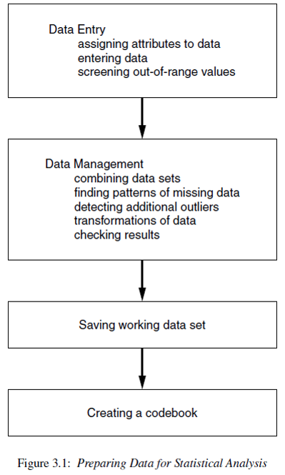

# Preparing Data for Analysis

Just a recap


## A Reproducible Workflow



* You are your own collaborator 6 months from now. Make sure you will be able
to understand what you were doing.
* Investing the time to do things clearly and in a reproducible manner will
make your future self happy.
* Comment your code with explanations and instructions.
    - How did you get from point A to B? 
    - Why did you recode this variable in this manner? 
* This is reason #1 we use the Markdown language through R. 


Figure Credits: [Roger Peng](http://www.biostat.jhsph.edu/~rpeng/)


```{r, warning=FALSE, message=FALSE, echo=FALSE}
library(dplyr)
library(ggplot2)  
depress <- read.table("data/Depress.txt", sep="\t", header=TRUE)  
```

## Identifying Variable Types
This section uses the `depression` data set from Afifi et.al. 

Consider a variable that measures marital status. What data type does R see this variable as? 
```{r}
table(depress$MARITAL)
str(depress$MARITAL)
class(depress$MARITAL)
```

When variables have numerical levels it is necessary to ensure that R knows it is a factor variable.

The following code uses the `factor()` function to take the marital status variable and convert it into a factor variable with specified labels that match the codebook. 
```{r}
depress$MARITAL <- factor(depress$MARITAL, 
                          labels = c("Never Married", "Married", "Divorced", "Separated", "Widowed"))
```

It is important to confirm the recode worked. If it did not you will have to re-read in the raw data set again since the variable `SEX` was replaced. 

```{r}
table(depress$MARITAL)
class(depress$MARITAL)
```

* Create a boxplot of income across marital status category.
```{r}
qplot(y=INCOME, x=MARITAL, data=depress, geom="boxplot")
```

Boxplots are nice because they clearly show the range where 50% of the data lie and any potential outliers. Boxplots can also indicate skewness, but sometimes it is helpful to visualize the location of the mean as well as the median. `ggplot2` has a nice `stat_summary` layer that will calculate and add the means to the current plot. 

```{r}
qplot(y=INCOME, x=MARITAL, data=depress, geom="boxplot") + 
   stat_summary(fun.y=mean, colour="blue", size=3, geom="point")
```

## Data Editing and Recoding

For unbiased and accurate results of a statistical analysis, sufficient data has to be present. Often times once you start slicing and dicing the data to only look at certain groups, or if you are interested in the behavior of certain variables across levels of another variable, sometimes you start to run into small sample size problems. For example, consider marital status again:  

```{r}
table(depress$MARITAL)
```

There are only 13 people who report being separated. This could potentially be too small of a group size for valid statistical analysis. 

One way to deal with insufficient data within a certain category is to collapse categories. The following code uses the `recode()` function from the `car` package to create a new variable that I am calling `MARITAL2` that combines the `Divorced` and `Separated` levels. 

```{r}
library(car)
depress$MARITAL2 <- recode(depress$MARITAL, "'Divorced' = 'Sep/Div'; 'Separated' = 'Sep/Div'")
```

Always confirm your recodes. 
```{r}
table(depress$MARITAL, depress$MARITAL2, useNA="always")
```

This confirms that records where `MARITAL` (rows) is `Divorced` or `Separated` have the value of `Sep/Div` for `MARITAL2` (columns).


Now let's examine the relationship between income against marital status by creating a boxplot. This is a situation where _jittering_  or _dodging_ the points is helpful to avoid overplotting of points. Note that the full `ggplot` code had to be used here, not the simpler `qplot` methods. Furthermore, the `grid.arrange` function from the `gridExtra` package is used  to display these plots side by side. 

```{r, fig.width=10, fig.height=4}
library(gridExtra)
a <- qplot(x=MARITAL2, y=INCOME, data=depress, col=MARITAL2, geom="point", main = "Without jittering") + 
           coord_flip() + theme(legend.position="none")
b <- ggplot(depress, aes(x=INCOME, y=MARITAL2, color=MARITAL2), main="With jittering") +
            geom_point(position=position_jitter()) + theme(legend.position="none")
grid.arrange(a, b, ncol=2)
```

* What do you think `coord_flip()` does? Look at the difference in the X and Y values between
  plot a and plot b. 

* What do you think `theme(legend.position="none")` does? 

_Hint:_ Try removing them and see what happens. 

* What can you say about the relationship between Income and marital status? 

## Outliers

Let's look at the age variable in the depression data set. 
```{r, fig.width=10, fig.height=6}
par(mfrow=c(1,2))
boxplot(depress$AGE)
hist(depress$AGE)
```

Just looking at the data graphically raises no red flags. The boxplot shows no outlying values and the histogram does not look wildly skewed. This is where knowledge about the data set is essential. The codebook does not provide a valid range for the data, but the description of the data starting on page 3 in the textbook clarifies that this data set is on adults. In the research world, this specifies 18 years or older. 

Now look back at the graphics. See anything odd? It appears as if the data go pretty far below 20, possibly below 18. Let's check the numerical summary to get more details. 

```{r}
summary(depress$AGE)
```

The minimum value is a 9, which is outside the range of valid values for this variable. This is where you, as a statistician, data analyst or researcher goes back to the PI and asks for advice. Should this data be set to missing, or edited in a way that changes this data point into a valid piece of data. 

As an example of a common data entry error, and for demonstration purposes, I went in and changed a 19 to a 9. So the correct thing to do here is to change that 9, back to a 19. This is a very good use of the `ifelse()` function. 

```{r}
depress$AGE <- ifelse(depress$AGE==9, 19, depress$AGE)
```

The logical statement is `depress$AGE==9`. Wherever this is true, replace the value of `depress$AGE` with 19, wherever this is false then keep the value of `depress$AGE` unchanged (by "replacing" the new value with the same old value). 


Alternatively, you can change that one value using bracket notation. Here you are specifying that you only want the rows where `AGE==9`, and directly assign a value of 19 to those rows.  
```{r}
depress$AGE[depress$AGE==9] <- 19
```

Confirm the recode. 
```{r}
summary(depress$AGE)
```

Looks like it worked. 

## Data screening and transformations 
The aim of data preparation, screening, wrangling, or transforming is to 

* Identify outliers and inconsistent values
* Assess normality of the distribution
* Assess independence of observations
* Explore data transformations to aid description, inference. 


In the previous section we looked at outliers and inconsistent values. Now let's look at normality and independence using the cleaned depression data set. 

```{r, eval=FALSE}
rm(depress) # remove the current version that was used in the previous part of this markdown file
depress <- read.table("C:/GitHub/MATH456/data/Depress_020116.txt", sep="\t", header=TRUE)  
```

```{r}
hist(depress$INCOME, prob=TRUE, xlab="Annual income (in thousands)", 
     main="Histogram and Density curve of Income", ylab="")
lines(density(depress$INCOME), col="blue")
summary(depress$INCOME)
```

The distribution of annual income is slightly skewed right with a mean of $20.5k per year and a median of $15k per year income. The range of values goes from $2k to $65k. Reported income above $40k appear to have been rounded to the nearest $10k, because there are noticeable peaks at $40k, $50k, and $60k. 

In general, transformations are more effective when the the standard deviation is large relative to the mean. One rule of thumb is if the sd/mean ratio is less than 1/4, a transformation may not be necessary. 
```{r}
sd(depress$INCOME) / mean(depress$INCOME)
```

Alternatively Hoaglin, Mosteller and Tukey (1985) showed that if the largest observation divided by the smallest observation is over 2, then the data may not be sufficiently variable for the transformation to be decisive. 
```{r}
max(depress$INCOME) / (min(depress$INCOME)+.1)
```

Note these rules are not meaningful for data without a natural zero. 

Another common method of assessing normality is to create a normal probability (or normal quantile) plot. 

```{r}
qqnorm(depress$INCOME);qqline(depress$INCOME, col="red")
```

The points on the normal probability plot do not follow the red reference line very well. The dots show a more curved, or `U` shaped form rather than following a linear line. This is another indication that the data is skewed and a transformation for normality should be created. 


* Create three new variables: `log10inc` as the log base 10 of Income, `loginc` as the natural log of Income, and `xincome` which is equal to the negative of one divided by the cubic root of income. 

```{r}
log10inc <- log10(depress$INCOME)
loginc   <- log(depress$INCOME)
xincome  <- -1/(depress$INCOME)^(-1/3)
```


* Create a single plot that display normal probability plots for the original, and each of the three transformations of income. Use the base graphics grid organizer `par(mfrow=c(r,c))` where `r` is the number of rows and `c` is the number of columns. Which transformation does a better job of normalizing the distribution of Income?

```{r, fig.width=10, fig.height=10}
par(mfrow=c(2,2)) # Try (4,1) and (1,4) to see how this works. 
qqnorm(depress$INCOME, main="Income"); qqline(depress$INCOME,col="blue")
qqnorm(log10inc, main="Log 10"); qqline(log10inc, col="blue")
qqnorm(loginc, main = "Natural Log"); qqline(loginc, col="blue")
qqnorm(xincome, main="-1/cuberoot(income)"); qqline(xincome, col="blue")
```


## Selecting Appropriate Analysis

**Considerations:**

* Purpose of analysis.  
* Types of variables in data set.  
* Data used in analysis.   
* Assumptions needed; satisfied?  
* Choice of analyses is often arbitrary: consider several  

**Example:** 

5 independent variables: 3 interval, 1 ordinal, 1 nominal  

1 dependent variable: interval

Analysis options  

- Multiple regression: pretend independent ordinal variable is an
  interval variable use dummy (0 /1) variables for nominal variables
- Analysis of variance: categorize all independent variables
- Analysis of covariance: leave variables as is, check assumptions
- Logistic regression: Categorize dependent variable: high, low
- Survival analysis: IF dependent variable is time to an event

Unsure? Do several and compare results. 

