--- 
title: "Applied Statistics"
author: "Robin Donatello, Edward Roualdes"
date: "Last Updated 2023-02-05"
site: bookdown::bookdown_site
documentclass: book
bibliography: [book.bib]
biblio-style: apalike
link-citations: yes
github-repo: norcalbiostat/AppliedStatistics_notes
url: 
description: "Course notes for Applied Statistics courses at CSU Chico"
---

# Preface {-}


```{=html}
<img src="data:image/png;base64,iVBORw0KGgoAAAANSUhEUgAAAMgAAADICAMAAACahl6sAAAACXBIWXMAAAsTAAALEwEAmpwYAAAKTWlDQ1BQaG90b3Nob3AgSUNDIHByb2ZpbGUAAHjanVN3WJP3Fj7f92UPVkLY8LGXbIEAIiOsCMgQWaIQkgBhhBASQMWFiApWFBURnEhVxILVCkidiOKgKLhnQYqIWotVXDjuH9yntX167+3t+9f7vOec5/zOec8PgBESJpHmomoAOVKFPDrYH49PSMTJvYACFUjgBCAQ5svCZwXFAADwA3l4fnSwP/wBr28AAgBw1S4kEsfh/4O6UCZXACCRAOAiEucLAZBSAMguVMgUAMgYALBTs2QKAJQAAGx5fEIiAKoNAOz0ST4FANipk9wXANiiHKkIAI0BAJkoRyQCQLsAYFWBUiwCwMIAoKxAIi4EwK4BgFm2MkcCgL0FAHaOWJAPQGAAgJlCLMwAIDgCAEMeE80DIEwDoDDSv+CpX3CFuEgBAMDLlc2XS9IzFLiV0Bp38vDg4iHiwmyxQmEXKRBmCeQinJebIxNI5wNMzgwAABr50cH+OD+Q5+bk4eZm52zv9MWi/mvwbyI+IfHf/ryMAgQAEE7P79pf5eXWA3DHAbB1v2upWwDaVgBo3/ldM9sJoFoK0Hr5i3k4/EAenqFQyDwdHAoLC+0lYqG9MOOLPv8z4W/gi372/EAe/tt68ABxmkCZrcCjg/1xYW52rlKO58sEQjFu9+cj/seFf/2OKdHiNLFcLBWK8ViJuFAiTcd5uVKRRCHJleIS6X8y8R+W/QmTdw0ArIZPwE62B7XLbMB+7gECiw5Y0nYAQH7zLYwaC5EAEGc0Mnn3AACTv/mPQCsBAM2XpOMAALzoGFyolBdMxggAAESggSqwQQcMwRSswA6cwR28wBcCYQZEQAwkwDwQQgbkgBwKoRiWQRlUwDrYBLWwAxqgEZrhELTBMTgN5+ASXIHrcBcGYBiewhi8hgkEQcgIE2EhOogRYo7YIs4IF5mOBCJhSDSSgKQg6YgUUSLFyHKkAqlCapFdSCPyLXIUOY1cQPqQ28ggMor8irxHMZSBslED1AJ1QLmoHxqKxqBz0XQ0D12AlqJr0Rq0Hj2AtqKn0UvodXQAfYqOY4DRMQ5mjNlhXIyHRWCJWBomxxZj5Vg1Vo81Yx1YN3YVG8CeYe8IJAKLgBPsCF6EEMJsgpCQR1hMWEOoJewjtBK6CFcJg4Qxwicik6hPtCV6EvnEeGI6sZBYRqwm7iEeIZ4lXicOE1+TSCQOyZLkTgohJZAySQtJa0jbSC2kU6Q+0hBpnEwm65Btyd7kCLKArCCXkbeQD5BPkvvJw+S3FDrFiOJMCaIkUqSUEko1ZT/lBKWfMkKZoKpRzame1AiqiDqfWkltoHZQL1OHqRM0dZolzZsWQ8ukLaPV0JppZ2n3aC/pdLoJ3YMeRZfQl9Jr6Afp5+mD9HcMDYYNg8dIYigZaxl7GacYtxkvmUymBdOXmchUMNcyG5lnmA+Yb1VYKvYqfBWRyhKVOpVWlX6V56pUVXNVP9V5qgtUq1UPq15WfaZGVbNQ46kJ1Bar1akdVbupNq7OUndSj1DPUV+jvl/9gvpjDbKGhUaghkijVGO3xhmNIRbGMmXxWELWclYD6yxrmE1iW7L57Ex2Bfsbdi97TFNDc6pmrGaRZp3mcc0BDsax4PA52ZxKziHODc57LQMtPy2x1mqtZq1+rTfaetq+2mLtcu0W7eva73VwnUCdLJ31Om0693UJuja6UbqFutt1z+o+02PreekJ9cr1Dund0Uf1bfSj9Rfq79bv0R83MDQINpAZbDE4Y/DMkGPoa5hpuNHwhOGoEctoupHEaKPRSaMnuCbuh2fjNXgXPmasbxxirDTeZdxrPGFiaTLbpMSkxeS+Kc2Ua5pmutG003TMzMgs3KzYrMnsjjnVnGueYb7ZvNv8jYWlRZzFSos2i8eW2pZ8ywWWTZb3rJhWPlZ5VvVW16xJ1lzrLOtt1ldsUBtXmwybOpvLtqitm63Edptt3xTiFI8p0in1U27aMez87ArsmuwG7Tn2YfYl9m32zx3MHBId1jt0O3xydHXMdmxwvOuk4TTDqcSpw+lXZxtnoXOd8zUXpkuQyxKXdpcXU22niqdun3rLleUa7rrStdP1o5u7m9yt2W3U3cw9xX2r+00umxvJXcM970H08PdY4nHM452nm6fC85DnL152Xlle+70eT7OcJp7WMG3I28Rb4L3Le2A6Pj1l+s7pAz7GPgKfep+Hvqa+It89viN+1n6Zfgf8nvs7+sv9j/i/4XnyFvFOBWABwQHlAb2BGoGzA2sDHwSZBKUHNQWNBbsGLww+FUIMCQ1ZH3KTb8AX8hv5YzPcZyya0RXKCJ0VWhv6MMwmTB7WEY6GzwjfEH5vpvlM6cy2CIjgR2yIuB9pGZkX+X0UKSoyqi7qUbRTdHF09yzWrORZ+2e9jvGPqYy5O9tqtnJ2Z6xqbFJsY+ybuIC4qriBeIf4RfGXEnQTJAntieTE2MQ9ieNzAudsmjOc5JpUlnRjruXcorkX5unOy553PFk1WZB8OIWYEpeyP+WDIEJQLxhP5aduTR0T8oSbhU9FvqKNolGxt7hKPJLmnVaV9jjdO31D+miGT0Z1xjMJT1IreZEZkrkj801WRNberM/ZcdktOZSclJyjUg1plrQr1zC3KLdPZisrkw3keeZtyhuTh8r35CP5c/PbFWyFTNGjtFKuUA4WTC+oK3hbGFt4uEi9SFrUM99m/ur5IwuCFny9kLBQuLCz2Lh4WfHgIr9FuxYji1MXdy4xXVK6ZHhp8NJ9y2jLspb9UOJYUlXyannc8o5Sg9KlpUMrglc0lamUycturvRauWMVYZVkVe9ql9VbVn8qF5VfrHCsqK74sEa45uJXTl/VfPV5bdra3kq3yu3rSOuk626s91m/r0q9akHV0IbwDa0b8Y3lG19tSt50oXpq9Y7NtM3KzQM1YTXtW8y2rNvyoTaj9nqdf13LVv2tq7e+2Sba1r/dd3vzDoMdFTve75TsvLUreFdrvUV99W7S7oLdjxpiG7q/5n7duEd3T8Wej3ulewf2Re/ranRvbNyvv7+yCW1SNo0eSDpw5ZuAb9qb7Zp3tXBaKg7CQeXBJ9+mfHvjUOihzsPcw83fmX+39QjrSHkr0jq/dawto22gPaG97+iMo50dXh1Hvrf/fu8x42N1xzWPV56gnSg98fnkgpPjp2Snnp1OPz3Umdx590z8mWtdUV29Z0PPnj8XdO5Mt1/3yfPe549d8Lxw9CL3Ytslt0utPa49R35w/eFIr1tv62X3y+1XPK509E3rO9Hv03/6asDVc9f41y5dn3m978bsG7duJt0cuCW69fh29u0XdwruTNxdeo94r/y+2v3qB/oP6n+0/rFlwG3g+GDAYM/DWQ/vDgmHnv6U/9OH4dJHzEfVI0YjjY+dHx8bDRq98mTOk+GnsqcTz8p+Vv9563Or59/94vtLz1j82PAL+YvPv655qfNy76uprzrHI8cfvM55PfGm/K3O233vuO+638e9H5ko/ED+UPPR+mPHp9BP9z7nfP78L/eE8/sl0p8zAAAABGdBTUEAALGOfPtRkwAAACBjSFJNAAB6JQAAgIMAAPn/AACA6QAAdTAAAOpgAAA6mAAAF2+SX8VGAAADAFBMVEX////iu8jQkKPBb4ivR2WbIkCQACcAAAAAAAAAAAAAAAAAAAAAAAAAAAAAAAAAAAAAAAAAAAAAAAAAAAAAAAAAAAAAAAAAAAAAAAAAAAAAAAAAAAAAAAAAAAAAAAAAAAAAAAAAAAAAAAAAAAAAAAAAAAAAAAAAAAAAAAAAAAAAAAAAAAAAAAAAAAAAAAAAAAAAAAAAAAAAAAAAAAAAAAAAAAAAAAAAAAAAAAAAAAAAAAAAAAAAAAAAAAAAAAAAAAAAAAAAAAAAAAAAAAAAAAAAAAAAAAAAAAAAAAAAAAAAAAAAAAAAAAAAAAAAAAAAAAAAAAAAAAAAAAAAAAAAAAAAAAAAAAAAAAAAAAAAAAAAAAAAAAAAAAAAAAAAAAAAAAAAAAAAAAAAAAAAAAAAAAAAAAAAAAAAAAAAAAAAAAAAAAAAAAAAAAAAAAAAAAAAAAAAAAAAAAAAAAAAAAAAAAAAAAAAAAAAAAAAAAAAAAAAAAAAAAAAAAAAAAAAAAAAAAAAAAAAAAAAAAAAAAAAAAAAAAAAAAAAAAAAAAAAAAAAAAAAAAAAAAAAAAAAAAAAAAAAAAAAAAAAAAAAAAAAAAAAAAAAAAAAAAAAAAAAAAAAAAAAAAAAAAAAAAAAAAAAAAAAAAAAAAAAAAAAAAAAAAAAAAAAAAAAAAAAAAAAAAAAAAAAAAAAAAAAAAAAAAAAAAAAAAAAAAAAAAAAAAAAAAAAAAAAAAAAAAAAAAAAAAAAAAAAAAAAAAAAAAAAAAAAAAAAAAAAAAAAAAAAAAAAAAAAAAAAAAAAAAAAAAAAAAAAAAAAAAAAAAAAAAAAAAAAAAAAAAAAAAAAAAAAAAAAAAAAAAAAAAAAAAAAAAAAAAAAAAAAAAAAAAAAAAAAAAAAAAAAAAAAAAAAAAAAAAAAAAAAAAAAAAAAAAAAAAAAAAAAAAAAAAAAAAAAAAAAAAAAAAAAAAAAAAAAAAAAAAAAAAAAAAAAAAAAAAAAAAAAAAAAAAAAAAAAAAAAAAAAAAAAAACfk036AAAAAXRSTlMAQObYZgAAIKtJREFUeNrsfdty40qubCZQ+v8PFgt5HoC6kKJst+3uPSdiaSZW2G1bIli4JhIg8N/rv9d/r/9e/71OL/JffIr9/fe1tn3914TyvyRHg8aBONfXD8b/Byey6ZDBxzs74fUDtv1I7H9WEG/jKmkYV09b5+7cPrA1/s/aCMe1Wd5+AGgAYAYgD2mcTjP8rwpCDkloGJLUdTsAy3PhkON/TBCz3URSkjIWs/n+dNA399Js/2z+gpb9XJBm+1uxcbnCxqFIsPklreSYzsEev6AXP3a/TkvvWldKE+eb+rrpvm66fPyC0kcA0k+vo/3UMAA4u9b9ZdNnSmDbH9MNv2EuPz5UDt2Y10L76meSYGnZ/5EgS3mGM/XvZFSkPYiTIO7/VLXo1uN0BX7NogQJOh1d/u/200kBgPm3U5jvCSKwRdd+KzdbliRA93pIkG9Oj27/2tgJwKzHy8VKCuiDG4CU3q7CUK+H+s+8llvX/tmKj4Q4ydNBcr9wmvPHTudbWXpd0vz7UPxxLKC9HkIc/yAgvnpYjrPob8VIHbo3C0W8/CRmLqC/JQibl+qcQ0X0rlfH6nUhDwsAjboPlZLOapFpgjX/s2jf/tBXKS63/uUfSIbc4vU6aDgA2vkPpLi6q++4rz81drrHdv+vYtBIBCCsX9LSTLMALECPPV7o4BZQhxj6e4KkaZvNi3ixDBOsd0DgUJLSMIHo7hIl0ASz/YYc4/K/m9J/y/3asI1djKYO9JnmunhcpOSh5gcFGAI09cupnNOuv3kip2+266QAmgKAxExQTlKW4oSMEGAzfXHFesOfxJLvJgXqT23ejICQSqG6aA1bNuYRGIAj3dfysbZ75jj6zV37WjrqX/G6I9dbXjd6rJDc1AUyzCPtRKAzKhDIjGZdSH9q6HALgSaxHUJrK2Io1mX38fZfSiTbl07NFdqSWfU41exp8vF8tEMQLKCwEXP0NOJQ/VZ3AZZJl9C6QINa9KlfI5EXCKN91Vi+EhBJ0MxsnMgycqMQ4QyAJsFMoCMAhab2K0OKxjd0dYAOUwCNzxBWVFRU3mKeaeTJJ/wsshdUUIBJ7ytr5FImE0RjID7UBKkkozM6wJaFC5eCpZWt/Pj3BDn90hHrn+uanZGpkfClukgCQI8OwC1oAh5b0RUnH6T4Nfe7Jeu707XKQhTGVI0XLeCIC68Ji54ZxnUkwNrD2nMG2i0s6tfiiLZkfY8O4Q9AXejWni+5VapGBhWKCPF8UYkF4YA66Oogl3Ydjb8vyHqrfrrjnQaQz7zd2+cZJVp1E/JnQ+N10b4OjwAcMrMQOH3dAP6+mAR/FGzm/Rl1VL/TnHYEeBLDhk1fS3pl7qXTxZn3sBawUIf7SkNLkqy0CPJDq28fBUIIkqDSrRc58m7vQAMNoCCCQunWOZORQHD7o5DY0F1HCeWlviOiMNGKj+X4SJBMLpaNDHe1p61G7lYz4hfT+LkBDoDNMxYNmKWxoK4tttumdieUPL5rI+MteZID3PCTTY4E7VLLJQLBs3r3VfNKBEwcnrVPoS3U5yn2k+P/GBNoX/NWwMpKwlZ11XfL0LDrvKoNRtUIDGU5BKj6/3h/I5SOHG51106S6PsBcSvNd/tgdJqfDTwr9OWdwHEPWZYk5ddE4XcSsBJ3hbXI2OSrftSW+vYfRHa/ylGdg4gw46ZrpmWXE0nktJNxOeuMB3yvFdBlRGOHuw6Md1zZ8MeZzyeCDNhpJKeeXWeDEDNzoDsxW2554y+uajnyIaZt0FI1WBB0HLKmA8AAYUYKif4D1Zrp7rE+VOWU5qW6QREzwRUhycyM5TjH+dCWhCsjJDRvvyJgDZkFjU59+c7PcmD/wo819UrhBgG+AkfeubowScw4KOlkomRWICVS1sYzi1mGwAeeympuwhZeWnnS2y9Fdl/+ngCqqDU/BDb2jlYKO1kNEjLKwRmRqjS8Aes/2tNIbWAcIQ7VoaGnPIdGZLQ2f/U+Lr8VpNld3k6zlGTBs87lVCUgtQdCpBfmSFM2VeRm9NoTzM0IrOGIZVnn7s9TXxbkhC1tqLJ5j3n4gHN3QwGr+DAMZY8juwfg8FnaHBg3EDzlANBKuMce0PofJI3bLdDzJGF0kEOvKrOtQslsxr0gWHgQ3yFKrx2uzU5SDmt11XzcFkSfR/ZYghzjY9PInCMvKkMaaa4zbTyhUQBsWg2TYSfj8rmU6jVAqJdr94kpdf8sUWlvUKvxh3W265ZMt7mwhYwFlEQEyBhFFU09KnVdGnbK+sWbeqPPRC720ufDzPFNrjWOZHhedR9BUTNdxwAV3Zj2nZngyNVnhniT/c/78UGcc4hkHkG3T8LiG0FGMj0Nq8vOxZMEIah0cuV+JbMQhysGjtXIJYcL1XTNH2KIzTYMonTkPRDx9q0eXB6LVPZxN6RLGy+u4SgPIDjEACgC1iOzFp4sXeeK8k12lGiRzhfU+x8KQrhND8FGPAX6OFj3hB2H06JXFemHmmgRhgAMx+v7zhy47P/dlVm7dBMzLKoilj5RrYxowzrLQ1hH8wM6ZiIXL76B7BmToaBgAYey2q3IjZM25YFmSXxvpde4F7EAb+310b0gfrq+ygoPdXJaTKZ43IJCqJv3Ujay0uWSIxtY1Cum8XH1+qKA3baDffHZ7Ubsixc0tkNuC1LDSgk3CIIi6UdSGwyBvX2wX9IpV7kDmtPRmdkpGO/B5CYXvnqtvpLL4SEO84c6wPrjm9CaCsQFS4aM1Iz03DJHboJEv2p23gHrF8z/XJrceeH2EgrbtbRUj0aryy/dW460FCTxn7zWDgQ8UYhz1LiGkpd+sCkyAbhDkTUTjptq8SWOxDjAzWXr6f5Iz2cWI7sSt4CgdS4RfoU7dYMI83qpBgkio956NYqHJo0juSuyXgNir98eFuJQV492LnrnXd3b/QpJZINOPMeqdlmqNZStX4WTPFh3Z3aOMzlKhRhHchfeb+JI/mkZWjNxw7R8Az9PN5oe3aIwQYmSQacgwevRnK7GrIOADEGKqswEfCC66BmS8tJuo2J7lzFGeaynaN5mkRgbRrqnLEGRbdzugVi9ve5XXxUUEcYO71vAM/QO6GgWM3PS13Itbh6ePAT1ePhRxqI310E4JkicOiXKzgkj3/W6jZFJKAlTGDSKKpY9lK51y8QidBWnnT+IHMDJbqbqo0N7e0lGgtmtkmdhyIzZDb1z977DYMDnWa+YOKuCTDspykTY2Wso386Sp6dbQZyvsF4RYILDf+y2WeWEQGB0fVnlbxUhe7t5hdFLKKT1TI1lKjfBq7+La8lHnrld7RYgnTUE26HZZHPTLEk1q1Oh9yIDVf5kAhCgIY5bjb6ED4uKmVKWZamhtACkUbenToTjPrxv/77fvFlQmientIDsHhFarw0OFmgO2Yab6kvdJnomwwNCkmV2MFk5xT9t0o6+Xqv33UaO9tKK6HD3gcDEBz5HtImD6F0iNQcAdvDH0kWoEPpukFHT82VLfqN5zGs8p0rtNtEq4S3Uw+tDq3lzIsbWHSODGCekVf1RXPzkyjwKjJx9T0PILJRqS7jJ2ASDK6/VjVi9IN3LcRZk9lJjGCFMw6Da3n/a2p8aeSKwUZT1LnJeiiImVwKUaAnzrsyHfuR5d5vqMIrw48N6RMdj+2Dr4IAtC0DTm9C2E18n3nrJ9t80XANevJNxqlM1rSBSIXx1ri99p/uAqGfj0iyCq+VyfHZFN3XFa5n7Cvcn/4OJw8w4lwANvQ8HaWGJuITjNf+/SeM1BYHYVsuSpwiyY9IgrL9WTWJ59DHucnMr2CgKBmhDTHOkzLQTOeVewS3DlMdHkR1m3KDyJ432yLCzgZY40S5fMvQYhapOv3EHYNERJCuaMj33sK1UMgqAmW080BTEL7zQU0A0np2vOmhOCrDYuEo6NQpm5K/obTMa76nWjbWYJbUDAZG0TAvQmZyvxTFw7ldd1k732Hgja3JwBfaMNMVRBL7AiCYFtOiECwPjZvAjYg/dxEF9pBNKtDLrllEj6ygu57qSXTlWSt+2CH7OT+hAKL7GBdEqOKrtTG5n86Z1QYVEkAZF9SWqM9GrKTc1hKTxqekIrmVsO7EMdi3QQTN4ng93l6MXn7vpkNZwBVf1SF5shI3JjDejpIhEZ4ISrEqT5cPOtruRlY5XG9kkGb+PTjKvcQZKLjPR6qQxtqEYLhNfLcIrEmdEdAwqB2FAFJQMwUhlqm7ehfSe8YIA3Ge/Xe3FLlXVKic1szDPAE+tGSa0oQVfkxDf98aDTFy4xhUUVbdQxRLYuto6Tnme7npXbQcpG2+SbOguGpof5zqW0UudMpfaSBC3RnVYYj/GM6dhoH179oPIkBSnhOdcurfXVEt7/o8W/R4rb0+eG2lk32gnpLQTMK4NHdIUaeXJaS5iAS9EL23NQK8ES3yF785J4/OxzdFlxaEYbbZxkyiZiXTjMbEH2SgjtbMduDJfO6PrjYJR4RR5SiovIguzTJ8gyE2n5BLZd1vnQuSNJ58USIYyqrabP6kyb2QvVHArVvfrTdgoKtGdSRZxGqXTkNKiC4iWWKoI2KPrXWFltgkSkVCEAODYw7gZ1BOzjjD2S4lCaiYZWh1pQvCl/Bn98qK2om86bImVtXgXWHXYsSci7aRd7SrGbcNYZyiuZl0AM5DHKUQFqByrqJNc/duAByzP1KqwlC6NWgrUQRDHdoNCNzX/SZS2EoZ7BDBZVVtBlDc8OSgW4eaxDU8ULmwhkUWUNRxJ7IjiSJCmTlCZm59sJ8rubaCr6QgT1rLLFbLNdKtdxThXC47nxBZKlDBLEIpgHBTJE+BVKAqpovrZgYaD3mVZ5loUUk2Rdju7yGkqafp6h15Ph9M+SAR9YARbG4xQGGk0saCPfkX90mflwYkWaDogeAS9i+ktLAAGFLTLBGNwZTxWBVHnmxR6Mqp96CB58mts7uxrTKR+0VtGOrPECykrJShcwiYEahBJt7DWe2LtWUNB1ZEoP6urccJUyAVtuiZz95mEzmxqTc60aU3XETou3MgpmuWoBLISIqBDhI35iVMqFUUXCCCczxzPUM8mvJI4ywmLdF7IyZGmxWrfz54u7Yw97wR33zA528uq0CpQHDSU6kMw9cCgnrDICRwsFDKhX5C0iIaeFHNCoglGgcoj5UJm/IJqZ4M+ahEDH3H0CObMULXN+hukceC0Mbs24zCLgBYhWdHfSgQ3VpaFSbUpOIcAO1r00QU2SnAGTbCZJFbpkuFp8zIRCs3qofojYbNUQpwBIT+7PjsBilEe6JGTNQFrNciSNV1OQFMCmbTL0WIUaETAe3Y0pgmGJxjHnUtnBBiLq9p8oH2stGuafx68v/YR/exueUFGB32sEqZG9ByTNgdIHAJBNzPSSTKZh2akoZsfsDIXM8kFhJngVH0LF8tehHAT6MaQRlaRd2BMIJeiOV6GkndBavdPea06xMwjjCi2cTL+rDyQxtKAIxQRCEEdSv6G2QFHdRtiNBuClMyCFAnKQMjqxNxp7J0LeKisIiFs222EJ7NqOxhwjeiAZL1SchjVW/UMauIw2+mJGlcPJlKT2dH0pEvsMENXInFUdFrAmI7LKmceg5hkz4EZBiufTCi7SbjWy759306clTc9DKl6/xSNEaANPDPkFEKOgKy8l0DA1ckgQDqII7tRaHYIj3mSa0dKwqOiCAtAGMSqIuH7DcHAbG/Tln2tVsfqvoDZSnPBDDJTpLelWfHck0vK5HOtqp0tG/aS0SVa5ImM3tgYZNcYXioO4IWDztl+UmiG5y2CTktpE9O4UuhaB5BTmeYWZQ7pf9RhrFyFVCAQzOyqsiP14HBXSZ1d+fvGnODk4THdYpa6SfOM7FffZOBvu7rqL2lCbyZwdCFoMtQESx+wf2UcCARa720bqqq+Q9oTq4mjUf6ppjNE1b8O7ZrDtC8e9Q2GMY2kTVbQFKWadU+3URhrzkSDUFR91wOAJwvGO9ldo8tDwbLWgAwK3yjLHF1ICyAYhecJ3Jl/O5isd02MPUVpG8HpfCo6Tq3VyCCnI9uvmXAx0VpZhJm0p+Sq0mVUyrJFlR3d7JGh8UKCOhda+vQ0rnBQifI6AKjnUBomd9GMOEQ3QJ0iIgkvFEQx2VtVgslEYlEWiu1PrLEH8cVhjrYi7raUEK9E5namnb3ZqKYtZ7EId0BKDxGALMx6mIlhYwiHvSp2QhGidb8irjJQPbOwRZm7TmbeUO/4KYXj3dIbL42nBDPkQVhWsjwMalQXqLYP3A4dNwVan6gE54hoCO7JFOyZPuqDOZHGffFSMQDucy2/gxoLmMgMtbnlQAsHNpJ5bCL/DFst3UhGCEy5uoMsThly2U7eeMviY4xLD1CjRqndt4LDK7bNDOUtHOR+abLZHK8b8DJzoEKrgVF0N894Fj665tRkj3Xy1FtOnRvxcbaqJdYvWks4wxxrA0b48F/jAttekGyOagb3uYNtbZA0WgVCaXTBIiLjW+yErI2IJvMkfLnUPFczzmG5BBo1+2S64IS1p3JrPz2PfjGRfa5knciiPXDDc2c8LGfbi8kLRQCWlZ4G3jyg45F7B01PY2frMhwwQ6U+2rq3EmXa++vpMU6jXFto513W2LbGy0UQHXMeUB2iMQG/RN1I10Yb4NbpVVGtGRrbHUJEEKY+gV5VF0F1X6gtIuf4huKzpv4ie7cbf3Uz+SeXujPCXAMSGOlXDehWUZWpRhBQmB1qOPxxxCO6eXR7RMxpEkEaO3qG/8jx2TL7pBi/4lRbvHhJ43vQZsp51/6kQT0UNUcZNFufMmsHVaNmCMQkaViW35wdsI0rlTV7ZY+UvACVpain1t4273TqT7elgcGxLoc3Ex+EBJOObMYqZAk/J1QtWuccU6q7FiZFJvCiBFMfmRwEobxwsWyqmdZKFwzEaMU6n5eZJqm/j+xSpA+x145ZNCgdTXL+yIOdlqgPGnKOiCPxqBxxb4NrH30nKESmMxz3vhTKaGFAxCROEdp2WdlLnnVxv2nVcZ8CSCBCRktswcgx0DpcLmNgHz3IbaAeW5I+gawQEwKYFnlkjI8jYDATQt4GwLtI0ZcJ2dvIPlzz3Y4bY851ZWVFQLknhZFpPcmA6Mr1KHPmYmOb29wVM3l/VsJyFgwmyKJn37C8a0MHmvby0K5O4CLIqNxL0XlqAnYN5iWKVEYSCENkVFPtq0nKhWWrp7OoZggZA1ZVMqs4SM5kr5FlkEkuj0WzI0MQfU4/Zrfvw6SxvrU+ESEV9TakDPA7q2yMuCSL0NFzAjcic5jB4OTGDcwMZqpjpexJuLUQzHrPHR6TLZgNlJ5p4gz1HyWNk+VRuiUp0OYAZTnhKpoCJkimIJXliERDwiw1xsOZH0iEQXTPInO0Si3RSkvaTs4rJB4Ln1Py5eO1Aw+0t4Lwsh5GSrC2j5xzVCA115bts2z5U0wBpB4EGbWsgoshY5B5YYVrNpyE+lAus7kxyQZEz4dvYMCahDiHu3Yvx2CS5bB0idaUbZ59pUwaswtd6sU/yaVmNoLa8EuM2q+wsOkxOB1SH9TjnByhc2CedphxTszaXX5yFsReiYlz+jeVFNnbG+ww7dtibfSoYKNUTawaXk0DJQNJnNROmz1B9eokIECXkvZU/PwebrAkoe/T0Hhbs68sZZh7ypE96OR3cqjFdXR1K/zqAyMT9byNNk6GA0chLcLKJ6DZ6JXZhXNnj8ATnvRMn9Cn3kZ2QTHWG5RuqUeCwqFF57bqzKYJ2wYGVkoegiFM1fMULfMQGsbkERE0AhHmpHX4qP5YF+IjLYhuBg1DZTJM9UnNXtB5YxHTD5UYNb1lkZBHgThiEZwG9kkOlQt1I3q2bnvCYWYKZYJZfZUA1BOmP6r+rd1aOmZ+0wOtRd5Lf0crvEXzct12dRcadYTKb1hdcm3S8ES3JEQPMdf4CoKJDXLBTWT2qQQ4KzurHmWIrVpcgW19KxVDc9gscnCgDxfwGtXftKfTJrPSd4swi+olqY/VRoJBNCnc0NVHeTFDpNF65AYHS90Y4K8v3CddcuMxl1hxJfAzM2oHdJTzGcss9YUTmV4410d2Oq2mV1Gt34EhRGRAczNrFgGz6uFU67c6Q8XkoCMmgY0Z0SILq8bMu6UQN6aXoct8GNAg8pFfGN+bEad6nmxx2BjdQrYKZmlbuDxJ4EATzSJ3l9n0GpEtwg0jRHVHi0AoWMRsvgBgj+m5spFh3k/B0F4LDb9XrJWnPHhAwli7yBoQ0c7LRggdbuXBgk21uAVl2OkCHMkeJ0tJgo25UCGqsR0hGBen392iR7UTt6j+6WToNnWcYqfVNcvJbvRg8ML4TQTLti6quherAOp7VWJFcK5Bq7R9E2zYnif+NxJCPcl2RDedIzb9+ESQfS2qB+YiTh14aKB/g5gsbqXnsYEDQ+92hu6IctEI6gk0yyURszynQPgGUHtIorVMYE5rn0vZ3gpiG1e3YsnabzdAokzpK5SzsnFyproHXzGPTRUOmB8gDpNb76AzAoZQRyOiTz6W+1PQUQsBbNEkboaeXsbAB2uVrCNBiy5xLhZR2MwaJ9NRA/ycHCsuahwvFbMi4K4jzBHMEdxKs7gjPBAfvQ+KK71Kky/uRdGkQwL0XlgPT8LavvFhkUwnnpvb12Rb5ZWixwFrjOIyAsHHGFLTWNllc4iXXc3H2Db87bAAPuzTNY56UnQ/bVNmG7jVTB9JMyNzJ3ayHyIAI7osSCgSDTKQNJdRxacd4yNBNwT33d9CwCr6VZh+uzL3nSBjQ3VKcpnMGgmEtHgeUkREJEvFCCpZkl2Q12oDgpm6BzxXXhhy4kXFc6PxzOeVKraMWPhOEL6fJbihO88pZh9s1jMDnYO5krFcBA8RLd+HDz3ZMuctGgRXj6284Msm/1TiCbG/2/T/hgo4XfZpBIiNOfyrngS3M1238OdE6EZR4ipkJ63PoJwL23eEbY7t9Tp1pgi8W/D/5kQed5MNbOwxEHqz2bXeiZmpP70oMFBUrmomwUL+4lm0O7c393uvwt/8yv2JbGFxRR4+0DuKxFarVsjtIJJ7OsSAtYjB4CeC9TAoDay+EuYq7GF+vmu2sQP3MP3mSG4FOW1HGZxeawispYbqSXkTDRFD1wnOEUGrzic5J5QH9sgZ0FZPRP00peG2phjOdMv2/LIgdpraSf/HhiOsIfrIqrKNo0LW0+0altcJ0nMX6GlJDWeyMEC6qpzfbmI0z34732aM72yEZy+c6x9cUVfxmNCKFwzFjafb99mM2DCTEydiNisGr8UYVwc55r/TQJ4fk2o+WS7/uNnD92Afp85G9ODu6vYwQE/wcWD5mfNbzVbsDG7a6HcY+73j6T9ZAWq+MQln07T3YuZVS9nSNskrIxJy47YIdPRCRkFLwijSlmHNwuelScufbM50noiBlcUfaLNkTC5vLf6Ml1xoa9QmjMgTKsty1zvhxE+3bbWg+TFh6+Ptsu1CcQTcQ81t0+dBHq9a6SpJEfoMMKPNhz9xEmxpZ3XkSQH2Vnp8W5Cdcle9waZudkTQm29T/JyLQF+ToeptQZqT5Nl7HOMIk6ef7Oy+0Ud3piW/L8gpDg02h1oE2Ax90sCVdNeCpC8aoIhKZkaRWF+VJOs4zI2Caa3gPTNGP9StD7eUP07fjm01LQ48EqR/bA+9MBTk2uP2aLXAiqpSBn+iqlHhQeCgYqy7Sznmg5U+fDLURyfiqRERSSgesJiHzFVZcGyUWvLd9q8xh1sV5FwNN3drj8fXdrqN8auSQz1U7O/4lJz55tXPz51rR1R4nFMS29oPSZb9Eb/x+Im7FyQmEti35rTk74bp6T4qq7ltfYJ6+uaJrM0yowE5M6QE6+kIeFvcR6naZ7fvlkMXtfZT+3ZzY2Szs4XGT5a/+tJDIr722A5fGcj+RbMQGruZduF1L0ntHlbE3ttwM0aYwyXIJr9zMar1i4K8lDVygM105OrcUzTW+0+Wro+Ea9Z70j1Tb32s1bI7VuNPBdnc8LjZcmuMnlztDPRf++gzp8RrdlnGXgTCNPO9Dfil1QB/KsikEobUAzAP5VyjNYhffggT01G14TXkVBtuyc8M9y8J0r70oROa46IS1mNdcBT/sI1K5vO1LqThSCBzroOJ0UOc8x/HgL+/9PinLwmSmxdjpHwLNEucidZhdjRAhzUJx0c3JTf1q7YVTFy/D+OxLfUJGGuo6zdUyxk9Q9fgc/m+XKAxZN4zYHJ7gIQPSgBya4Nb8GEByyen0mJA/m5z5LqddyMqJPyWjUyq2lp5NkfUJGN0az2JQTtd0l0CWpO5YLQcSWc9/4WCMQRzcD271bYF6ZO/+WsPG7pbyD2e4godANuqi6QrghF4tGdnihiWqf1gRHa5rYTrhDL82XPfvv/w073IXs8mWWHYejXITosaav9a5Gy/BWLOlN49QfRvC5JN9fmU4NpNzr1tZTzKSpnrj8b8NafOx05dnmLETvL+S4KsZ1+MiaZYEE70PSjSZ7+m7czKogd74LySfj1UN4Lm/+JETk+lNFtD/h0b0cUUa/LOj83SrENrOv5VqQj1SGhef+9E1F+eu3V6HuqEV+3A2MkUvfrkxeOlcJzXNJ5sI4vHoP9F1dKxHjmzJy0eLyBhboPNlmSMZeAZr0+E9/kovNfP+rPn6n7TT0x3P1sbcZOZDHQ0pyl4Qw5fUsxbc8Q/9Frz0/uIFnRId1NFc4zvZTfa6Sx0oP3o4dM/EUTRd+CeNIS+9BztyxO0U8yn//s4svztC47vHzyefQClvN2RjR7f8bs/FWS43fUkFW65MvSycJ9YnHK8WEbRqOLbz5pv3xWjzzp8eKP2kvpv+O+bQz1O1G9Ah+mfCtIvGaUOUfxjxyjEcYkX8c0TMfzwVb3YnR3y2RPnY9/vXzso9NPr+LEgANAPbfey3z9FR9uvx1Zx6OhffgzlXz6RZ98Lod6X4m27epZ40gh64y+OX7iZ/tM34KKp2HzUyeA29fl0Bawvu0bDZ3aL4ucn8mNBNuukza0MNi55tKh6jO10WbmK3PumP5bjd2xkiVTI/5hQmv5NfXxfx6Aev3H5f0eQ1cFQYBxO3vY+lWpu9On6TTl+QbVOYXKr6CfJMZdkDsh4873/w4Ls0MT2iLgNsbP+q5f/lwQ54bXbw8P2U/hLcvyTF4n/Xv+9/nv99/ql1/8bAJquka2Xe0B4AAAAAElFTkSuQmCC" alt="logo" style="position:absolute; top:0; right:0; padding:10px;width: 10%"/>
```

This document is a set of course notes for several Applied Statistics courses at California State University, Chico. This is not a textbook replacement, and topics covered will vary depending on the instructor. To make this clear we use the term _notebook_ to refer to this document so as not to be confused with a traditional textbook. 

Some data and examples in this notebook are drawn from _[Practical Multivariate Analysis, 6tth ed, Afifi, May, Donatello, Clark](https://www.crcpress.com/Practical-Multivariate-Analysis/Afifi-May-Donatello-Clark/p/book/9781138702226)_ and used with permission by the authors. 

<a rel="license" href="http://creativecommons.org/licenses/by-nc/4.0/"></a><br />This work is licensed under a <a rel="license" href="http://creativecommons.org/licenses/by-nc/4.0/">Creative Commons Attribution-NonCommercial 4.0 International License</a>.


  

<!--chapter:end:index.Rmd-->

# (PART) Preparing Data for Analysis {-}

# Workflow and Data Cleaning {#data_prep}

Once the data are available from a study there are still a number of steps that must be undertaken to get them into shape for analysis.

One of the most misunderstood parts of the analysis process is the data preparation stage. To say that 70% of any analysis is spent on the data management stage is not an understatement. 

This chapter provides information on topics related to data processing and corresponds to :book: PMA6 Chapter 3. 


## Generating a reproducible workflows

Reproducibility is the ability for any researcher to take the same data set and run the same
set of software program instructions as another researcher and achieve the same results. 

The goal is to create an exact record of what was done to a data set to produce a specific result. To achieve
reproducibility, we believe that three things must be present:

1. The un-processed data are connected directly to software code file(s) that perform data preparation techniques.
2. The processed data are connected directly to other software code file(s) that perform the analyses. 
3. All data and code files are self-contained such that they could be given to another researcher to execute the code commands on a separate computer and achieve the same results as the original author. 


 Why do we need a codebook? 

* You are your own collaborator 6 months from now. Make sure you will be able to understand what you were doing.
* Investing the time to do things clearly and in a reproducible manner will make your future self happy.
* Comment your code with explanations and instructions.
    - How did you get from point A to B? 
    - Why did you recode this variable in this manner? 
* We need to record those steps (not just for posterity). 
* This means your code must be saved in a script file. 
    - Include sufficient notes to yourself describing what you are doing and why. 
    - For R, this can be in a `.R` or `.RMD` file. I always prefer the latter. 
    - For SPSS you can specify to `paste the syntax` and copy into a `.sps` script file.
    - For SAS you'll use a `.sas` file
    - For STATA this will be a `.do` file


Figure Credits: [Roger Peng](http://www.biostat.jhsph.edu/~rpeng/)

### Literate programming

* Programming paradigm introduced by Knuth (1984) 
* Explain the logic of the program or analysis process in a natural language, 
* Small code snippets included at each step act as a full set of instructions that can be executed to reproduce the result/analysis being discussed. 

Literate programming tools are integrated into most common statistical packages

* Markdown (R, Stata)
* $\LaTeX$ (R, SAS, Stata)  


### Reproducible Research + Literate Programming

Practicing reproducible research techniques using literate programming tools allows such major updates to
be a simple matter of re-compiling all coded instructions using the updated data set. 

The effort then is reduced to a careful review and update of any written results.

Using literate programming tools create formatted documents

* section headers
* bold and italicized words
* tables and graphics with built-in captions

in a streamlined manner that is fully synchronized with the code itself. 

The author writes the text explanations, interpretations, and code in the statistical software program itself, and the program will execute all commands and combine the text, code and output all together into a final dynamic document. 


 What stages of the pipeline shown above can we conduct using literate programming tools? 


## Import data
This section uses the raw `depression` data set from the Afifi et.al. textbook. 


```r
library(ggplot2)  
depress <- read.table("https://norcalbiostat.netlify.com/data/Depress.txt", 
                      sep="\t", header=TRUE)  
```

SPSS syntax will look similar like this: 

```
GET DATA /TYPE=XLSX 
  /FILE='C:\path\to\file.xlsx' 
  /SHEET=name 'Name-of-Sheet' 
  /CELLRANGE=full
  /READNAMES=on
  /ASSUMEDSTRWIDTH=32767.
EXECUTE. 
DATASET NAME DataSetExcel WINDOW=FRONT.
```

Reference on importing data into SPSS: https://libguides.library.kent.edu/SPSS/ImportData. 

The absolute first thing you should do is to look at your raw data table. Are the column headers variable names? Did all the rows get read in? Are there any extra columns or rows included? 

### Renaming variable names for sanity sake
Turn all variable names to lower case. This is especially frustrating for R and STATA users where syntax is case sensitive. **This is completely optional but helpful**


```r
names(depress) <- tolower(names(depress))
```

You should also rename any variable that has spaces or special characters in the name. 


## Data Management 
Questions to ask yourself (and the data) while reviewing the codebook to choose variables to be used in an analysis. 

1. Do you need to code out missing data? 
    - Missing values sometimes are recorded as something like *MISSING* or *-99*? 
2. Do you need to make response codes more logical? 
    - Some systems will record 1=YES and 2=NO. This should be changed to 0=NO. 
3. Do you need to recode numerical variables to categorical?
    - Sometimes categorical data will be recorded as 1, 2, 3 etc when those numbers represent named categories. 
4. Do you need to create secondary variables?
    - Such as an average across measures to create a score. 

Some of these answers will come only after you look at your data. This can be looking at the raw data itself but also looking at tables and charts generated from the data. Often when you try to create a plot or table you will encounter an error or something odd looking that will be the notification that something has to be adjusted. 

Let's look at a few of the common data management processes. 

### Missing data 
In Excel, missing data can show up as a blank cell. In SPSS it is represented as a `.` period. R displays missing data as `NA` values. 

Missing Data in SPSS: https://stats.idre.ucla.edu/spss/modules/missing-data/

Why would data be missing? Other than the obvious data entry errors, tech glitches or just non-cooperative plants or people, sometimes values are out of range and you would rather delete them than change their value (data edit). 

Lets look at the religion variable in the depression data set. 

```r
table(depress$relig, useNA="always")
## 
##    1    2    3    4    6 <NA> 
##  155   51   30   56    2    0
```

Looking at the codebook, there is no category `6` for religion. Let's change all values to `NA`.

```r
depress$relig[depress$relig==6] <- NA
```
This code says take all rows where `relig` is equal to 6, and change them to `NA`. 

Confirm recode.

```r
table(depress$relig, useNA="always")
## 
##    1    2    3    4 <NA> 
##  155   51   30   56    2
```

Notice the use of the `useNA="always"` argument. If we just looked at the base table without this argument, we would have never known there was missing data!

```r
table(depress$relig)
## 
##   1   2   3   4 
## 155  51  30  56
```

What about continuous variables? Well there happens to be no other missing data in this data set, so let's make up a set of 7 data points stored in a variable named `y`. 


```r
y <- c(1, 2, 3, NA, 4, NA, 6)
y
## [1]  1  2  3 NA  4 NA  6
```

The #1 way to identify missing data in a continuous variable is by looking at the `summary()` values. 

```r
mean(y)
## [1] NA
summary(y)
##    Min. 1st Qu.  Median    Mean 3rd Qu.    Max.    NA's 
##     1.0     2.0     3.0     3.2     4.0     6.0       2
mean(y, na.rm=TRUE)
## [1] 3.2
```

In R, any arithmetic function (like addition, multiplication) on missing data results in a missing value. The `na.rm=TRUE` toggle tells R to calculate the _complete case_ mean. This is a biased measure of the mean, but missing data is a topic worthy of it's own course. 


### Identifying Variable Types

The `str` function is short for _structure_. This shows you the variable names, what data types R thinks each variable are, and some of the raw data. You can also use the `view()` function to open the data as a similar spreadsheet format, or `head()` to see the top 6 rows of the data. The latter is sometimes less than helpful for a very large data set. 

```r
str(depress)
## 'data.frame':	294 obs. of  37 variables:
##  $ id      : int  1 2 3 4 5 6 7 8 9 10 ...
##  $ sex     : int  2 1 2 2 2 1 2 1 2 1 ...
##  $ age     : int  68 58 45 50 33 24 58 22 47 30 ...
##  $ marital : int  5 3 2 3 4 2 2 1 2 2 ...
##  $ educat  : int  2 4 3 3 3 3 2 3 3 2 ...
##  $ employ  : int  4 1 1 3 1 1 5 1 4 1 ...
##  $ income  : int  4 15 28 9 35 11 11 9 23 35 ...
##  $ relig   : int  1 1 1 1 1 1 1 1 2 4 ...
##  $ c1      : int  0 0 0 0 0 0 2 0 0 0 ...
##  $ c2      : int  0 0 0 0 0 0 1 1 1 0 ...
##  $ c3      : int  0 1 0 0 0 0 1 2 1 0 ...
##  $ c4      : int  0 0 0 0 0 0 2 0 0 0 ...
##  $ c5      : int  0 0 1 1 0 0 1 2 0 0 ...
##  $ c6      : int  0 0 0 1 0 0 0 1 3 0 ...
##  $ c7      : int  0 0 0 0 0 0 0 0 0 0 ...
##  $ c8      : int  0 0 0 3 3 0 2 0 0 0 ...
##  $ c9      : int  0 0 0 0 3 1 2 0 0 0 ...
##  $ c10     : int  0 0 0 0 0 0 0 0 0 0 ...
##  $ c11     : int  0 0 0 0 0 0 0 0 0 0 ...
##  $ c12     : int  0 1 0 0 0 1 0 0 3 0 ...
##  $ c13     : int  0 0 0 0 0 2 0 0 0 0 ...
##  $ c14     : int  0 0 1 0 0 0 0 0 3 0 ...
##  $ c15     : int  0 1 1 0 0 0 3 0 2 0 ...
##  $ c16     : int  0 0 1 0 0 2 0 1 3 0 ...
##  $ c17     : int  0 1 0 0 0 1 0 1 0 0 ...
##  $ c18     : int  0 0 0 0 0 0 0 1 0 0 ...
##  $ c19     : int  0 0 0 0 0 0 0 1 0 0 ...
##  $ c20     : int  0 0 0 0 0 0 1 0 0 0 ...
##  $ cesd    : int  0 4 4 5 6 7 15 10 16 0 ...
##  $ cases   : int  0 0 0 0 0 0 0 0 1 0 ...
##  $ drink   : int  2 1 1 2 1 1 2 2 1 1 ...
##  $ health  : int  2 1 2 1 1 1 3 1 4 1 ...
##  $ regdoc  : int  1 1 1 1 1 1 1 2 1 1 ...
##  $ treat   : int  1 1 1 2 1 1 1 2 1 2 ...
##  $ beddays : int  0 0 0 0 1 0 0 0 1 0 ...
##  $ acuteill: int  0 0 0 0 1 1 1 1 0 0 ...
##  $ chronill: int  1 1 0 1 0 1 1 0 1 0 ...
```

Right away this tells me that **R** thinks all variables are numeric integers, not categorical variables. This will have to be changed. We'll get to that in a moment. 

In SPSS you'll the following set of icons to tell you what data types the program thinks each column is: 


Consider the variable that measures marital status. 


```r
table(depress$marital)
## 
##   1   2   3   4   5 
##  73 127  43  13  38
str(depress$marital)
##  int [1:294] 5 3 2 3 4 2 2 1 2 2 ...
class(depress$marital)
## [1] "integer"
```
 What data type does R see this variable as? 


When variables have numerical levels it is necessary to ensure that the program knows it is a factor variable.

The following code uses the `factor()` function to take the marital status variable and convert it into a factor variable with specified labels that match the codebook. 

```r
depress$marital <- factor(depress$marital, 
      labels = c("Never Married", "Married", "Divorced", "Separated", "Widowed"))
```

It is important to confirm the recode worked. If it did not you will have to re-read in the raw data set again since the variable `marital` was replaced. 


```r
table(depress$marital)
## 
## Never Married       Married      Divorced     Separated       Widowed 
##            73           127            43            13            38
class(depress$marital)
## [1] "factor"
```

### Outliers

Let's look at the age variable in the depression data set. 

```r
par(mfrow=c(1,2))
boxplot(depress$age)
hist(depress$age)
```


Just looking at the data graphically raises no red flags. The boxplot shows no outlying values and the histogram does not look wildly skewed. This is where knowledge about the data set is essential. The codebook does not provide a valid range for the data, but the description of the data starting on page 3 in the textbook clarifies that this data set is on adults. In the research world, this specifies 18 years or older. 

Now look back at the graphics. See anything odd? It appears as if the data go pretty far below 20, possibly below 18. Let's check the numerical summary to get more details. 


```r
summary(depress$age)
##    Min. 1st Qu.  Median    Mean 3rd Qu.    Max. 
##    9.00   28.00   42.50   44.38   59.00   89.00
```

The minimum value is a 9, which is outside the range of valid values for this variable. This is where you, as a statistician, data analyst or researcher goes back to the PI and asks for advice. Should this data be set to missing, or edited in a way that changes this data point into a valid piece of data. 


Another visual way to look for outliers in a continuous measurement is to create a boxplot.
Here we look at boxplots of income across marital status category.

```r
ggplot(depress, aes(y=income, x=marital)) + geom_boxplot()
```


While there are a few potential outliers (denoted by the dots), there are none so far away from the rest of the group (or at values such as 99 or -99 that may indicate missing codes) that we need to be concerned about. 


As an example of a common data entry error, and for demonstration purposes, I went in and changed a 19 to a 9. So the correct thing to do here is to change that 9, back to a 19. This is a very good use of the `ifelse()` function. 


```r
depress$age <- ifelse(depress$age==9, 19, depress$age)
```

The logical statement is `depress$age9`. Wherever this is true, replace the value of `depress$age` with 19, wherever this is false then keep the value of `depress$age` unchanged (by "replacing" the new value with the same old value). 


Alternatively, you can change that one value using bracket notation. Here you are specifying that you only want the rows where `age==9`, and directly assign a value of 19 to those rows.  

```r
depress$age[depress$age==9] <- 19
```

Confirm the recode. 

```r
summary(depress$age)
##    Min. 1st Qu.  Median    Mean 3rd Qu.    Max. 
##   18.00   28.00   42.50   44.41   59.00   89.00
```

Looks like it worked. 


### Creating secondary variables


#### Collapsing categorical variables into fewer categories
For unbiased and accurate results of a statistical analysis, sufficient data has to be present. Often times once you start slicing and dicing the data to only look at certain groups, or if you are interested in the behavior of certain variables across levels of another variable, sometimes you start to run into small sample size problems. 

For example, consider marital status again. There are only 13 people who report being separated. This could potentially be too small of a group size for valid statistical analysis. 

One way to deal with insufficient data within a certain category is to collapse categories. The following code uses the `recode()` function from  the `car` package to create a new variable that I am calling `marital2` that combines the `Divorced` and `Separated` levels. 


```r
library(car)
marital2 <- recode(depress$marital, "'Divorced' = 'Sep/Div'; 'Separated' = 'Sep/Div'")
```

Always confirm your recodes. 

```r
table(depress$marital, marital2, useNA="always")
##                marital2
##                 Married Never Married Sep/Div Widowed <NA>
##   Never Married       0            73       0       0    0
##   Married           127             0       0       0    0
##   Divorced            0             0      43       0    0
##   Separated           0             0      13       0    0
##   Widowed             0             0       0      38    0
##   <NA>                0             0       0       0    0
```
This confirms that records where `marital` (rows) is `Divorced` or `Separated` have the value of `Sep/Div` for `marital2` (columns). And that no missing data crept up in the process. Now I can drop the temporary `marital2` variable and actually fix `marital`. (keeping it clean)


```r
depress$marital <- recode(depress$marital, "'Divorced' = 'Sep/Div'; 'Separated' = 'Sep/Div'")
rm(marital2)
```

#### Binning a continuous variable into categorical ranges. 
Let's create a new variable that categorizes income into the following ranges: <30, [30, 40), [40,50), [50, 60), 60+.  
The easiest way is to use the `cut2` function in the package `Hmisc`. Note you don't have to load the package fully to use a function from within that package. Useful for times when you only need to use a function once or twice. 


```r
depress$inc_cut <- Hmisc::cut2(depress$income, cuts=c(30,40,50,60))
table(depress$inc_cut)
## 
## [ 2,30) [30,40) [40,50) [50,60) [60,65] 
##     231      28      16       9      10
```

#### Dichotomizing a measure into 2 categories
Dichotomous variables tend to be binary indicator variables where a code of `1` is the level you're interested in. 

For example, gender is coded as 2=Female and 1=Male. This is in the right direction but it needs to be 0/1. 

```r
depress$sex <- depress$sex -1 
table(depress$sex)
## 
##   0   1 
## 111 183
```

0/1 binary coding is mandatory for many analyses. One simple reason is that now you can calculate the mean and interpret it as a proportion. 

```r
mean(depress$sex)
## [1] 0.622449
```

62% of individuals in this data set are female. 

Sometimes the data is recorded as 1/2 (Yes/No), so just subtracting from 1 doesn't create a positive indicator of the variable. For example, `drink=1` if they are a regular drinker, and `drink=2` if they are not. We want not drinking to be coded as `0`, not `2`. 


```r
table(depress$drink)
## 
##   1   2 
## 234  60
```

The `ifelse()` function says that if `depress$DRINK` has a value equal to 2 `==2`, then change the value to 0. Otherwise leave it alone. 


```r
depress$drink <- ifelse(depress$drink==2, 0, depress$drink)
table(depress$drink)
## 
##   0   1 
##  60 234
```


#### Sum or Average values across multiple variables

The Center for Epidemiological Studies Depression Scale (CESD) is series of questions asked to a person to measure their level of depression. `CESD` is calculated as the sum of all 20 component variables, and is already on this data set. Let's create a new variable named `sleep` as subscale for sleep quality by adding up question numbers 5, 11, and 19. 

Reference: http://cesd-r.com/cesdr/


```r
depress$sleep <- depress$c5 + depress$c11 + depress$c19
## # depress <- depress %>% mutate(sleep = c5+c11+c19) # Not run. dplyr example
```


```r
summary(depress$sleep)
##    Min. 1st Qu.  Median    Mean 3rd Qu.    Max. 
##   0.000   0.000   1.000   1.167   2.000   7.000
```


#### Transformations for Normality

Let's look at assessing normal distributions using the **cleaned** depression data set. 


```r
rm(depress) # remove the current version that was used in the previous part of this markdown file
depress <- read.table("https://norcalbiostat.netlify.com/data/depress_081217.txt", sep="\t", header=TRUE)  
```


```r
hist(depress$income, prob=TRUE, xlab="Annual income (in thousands)", 
     main="Histogram and Density curve of Income", ylab="")
lines(density(depress$income), col="blue")
```


```r
summary(depress$income)
##    Min. 1st Qu.  Median    Mean 3rd Qu.    Max. 
##    2.00    9.00   15.00   20.57   28.00   65.00
```

The distribution of annual income is slightly skewed right with a mean of $20.5k per year and a median of $15k per year income. The range of values goes from $2k to $65k. Reported income above $40k appear to have been rounded to the nearest $10k, because there are noticeable peaks at $40k, $50k, and $60k. 

In general, transformations are more effective when the the standard deviation is large relative to the mean. One rule of thumb is if the sd/mean ratio is less than 1/4, a transformation may not be necessary. 

```r
sd(depress$income) / mean(depress$income)
## [1] 0.743147
```

Alternatively Hoaglin, Mosteller and Tukey (1985) showed that if the largest observation divided by the smallest observation is over 2, then the data may not be sufficiently variable for the transformation to be decisive. 

```r
max(depress$income) / (min(depress$income)+.1)
## [1] 30.95238
```

Note these rules are not meaningful for data without a natural zero. 

Another common method of assessing normality is to create a normal probability (or normal quantile) plot. 


```r
qqnorm(depress$income);qqline(depress$income, col="red")
```


The points on the normal probability plot do not follow the red reference line very well. The dots show a more curved, or `U` shaped form rather than following a linear line. This is another indication that the data is skewed and a transformation for normality should be created. 


* Create three new variables: `log10inc` as the log base 10 of Income, `loginc` as the natural log of Income, and `xincome` which is equal to the negative of one divided by the cubic root of income. 


```r
log10inc <- log10(depress$income)
loginc   <- log(depress$income)
xincome  <- -1/(depress$income)^(-1/3)
```


* Create a single plot that display normal probability plots for the original, and each of the three transformations of income. Use the base graphics grid organizer `par(mfrow=c(r,c))` where `r` is the number of rows and `c` is the number of columns. Which transformation does a better job of normalizing the distribution of Income?


```r
par(mfrow=c(2,2)) # Try (4,1) and (1,4) to see how this works. 
qqnorm(depress$income, main="Income"); qqline(depress$income,col="blue")
qqnorm(log10inc, main="Log 10"); qqline(log10inc, col="blue")
qqnorm(loginc, main = "Natural Log"); qqline(loginc, col="blue")
qqnorm(xincome, main="-1/cuberoot(income)"); qqline(xincome, col="blue")
```


## Saving your changes

You've just made a ton of changes! 

* Save or export the new data set to your computer. 
* Edit the codebook to reflect the changes that you made. 
* In a production situation, or when changes aren't being made on a rapid basis, it is common to include the date in the file name. 
* Keep the data, codebook and data management file in the same folder. 

The `Sys.Date()` function takes the current date from your computer. The value is then formatted nicely for human consumption and added (pasted) to the file name before written to the working directory as a new text file.

```r
depress_clean <- depress %>% select(var1, var2, var3)
date <- format(Sys.Date(), "%m%d%y")
filename <- paste("depress_", date, ".txt", sep="")
write.table(depress_clean, filename, sep="\t", row.names=FALSE)
```

SPSS users commonly save cleaned data as a `.sav` format.  

```
SAVE outfile='FilePath\depress_sysdate.sav'
/KEEP = Variable_Name1 Variable_Name2.
EXECUTE.
```

**Saving only selected variables**

* In SPSS the `/KEEP` statement demonstrated above only writes the variable names listed to the saved data set. This can be very useful when dealing with data sets with a large number of variables. 
* For R users, using `dplyr` select is generally the fastest. 


## Wide vs. Long data {#wide-long}

The data on Lung function originally was recorded in _wide_ format, with separate variables for mother's and father's FEV1 score (`MFEV1` and `FFEV`). In this format, the data is one record per family. 


```r
fev <- read.delim("https://norcalbiostat.netlify.com/data/Lung_081217.txt", 
                    sep="\t", header=TRUE)
head(fev)
##   ID AREA FSEX FAGE FHEIGHT FWEIGHT FFVC FFEV1 MSEX MAGE MHEIGHT MWEIGHT MFVC
## 1  1    1    1   53      61     161  391  3.23    2   43      62     136  370
## 2  2    1    1   40      72     198  441  3.95    2   38      66     160  411
## 3  3    1    1   26      69     210  445  3.47    2   27      59     114  309
## 4  4    1    1   34      68     187  433  3.74    2   36      58     123  265
## 5  5    1    1   46      61     121  354  2.90    2   39      62     128  245
## 6  6    1    1   44      72     153  610  4.91    2   36      66     125  349
##   MFEV1 OCSEX OCAGE OCHEIGHT OCWEIGHT OCFVC OCFEV1 MCSEX MCAGE MCHEIGHT
## 1  3.31     2    12       59      115   296   2.79    NA    NA       NA
## 2  3.47     1    10       56       66   323   2.39    NA    NA       NA
## 3  2.65     1     8       50       59   114   1.11    NA    NA       NA
## 4  2.06     2    11       57      106   256   1.85     1     9       49
## 5  2.33     1    16       61       88   260   2.47     2    12       60
## 6  3.06     1    15       67      100   389   3.55     1    13       57
##   MCWEIGHT MCFVC MCFEV1 YCSEX YCAGE YCHEIGHT YCWEIGHT YCFVC YCFEV1
## 1       NA    NA     NA    NA    NA       NA       NA    NA     NA
## 2       NA    NA     NA    NA    NA       NA       NA    NA     NA
## 3       NA    NA     NA    NA    NA       NA       NA    NA     NA
## 4       56   159   1.30    NA    NA       NA       NA    NA     NA
## 5       85   268   2.34     2    10       50       53   154   1.43
## 6       87   276   2.37     2    10       55       72   195   1.69
```

To analyze the effect of gender on FEV, the data need to be in _long_ format, with a single variable for `fev` and a separate variable for gender. The following code chunk demonstrates one method of combining data on height, gender, age and FEV1 for both males and females. 


```r
fev2 <- data.frame(gender = c(fev$FSEX, fev$MSEX), 
                   rev = c(fev$FFEV1, fev$MFEV1), 
                   ht = c(fev$FHEIGHT, fev$MHEIGHT), 
                   age = c(fev$FAGE, fev$MAGE))
fev2$gender <- factor(fev2$gender, labels=c("M", "F"))
head(fev2)  
##   gender  rev ht age
## 1      M 3.23 61  53
## 2      M 3.95 72  40
## 3      M 3.47 69  26
## 4      M 3.74 68  34
## 5      M 2.90 61  46
## 6      M 4.91 72  44
```

Nearly all analysis procedures and most graphing procedures require the data to be in long format. There are several `R` packages that can help with this including `reshape2` and `tidyr`. 

## Dealing with missing data post-analysis 

* Case when: you want to add model predictions to the data set, but you have missing data that was automatically dropped prior to analysis. 

If your original data had missing values, here is one way to get the factor scores for available data back onto the data set. Alternatively you can look into methods to conduct factor analysis with missing data (FactomineR)

1. If no ID column exists, create one: `id = 1:NROW(data)`
2. Use `select()` to extract ID and all variables used in the factor analysis
3. Do `na.omit()`
4. Conduct factor analysis on this subsetted data set
5. Use `bind_cols()` to add columns containing factor scores to this subsetted data set as described above
6. Use `select()` to only keep the ID and the factor score variables
5. Then `left_join()` the factor scores back to the original data, using the ID variable as the joining key.

<!--chapter:end:data_prep.Rmd-->

# Visualizing Data {#data_viz}

Visualizing your data is hands down the most important thing you can learn to do. There are links to additional resources at the end of this document for additional learning. 

There are two audiences in mind when creating data visualizations: 

1. For your eyes only (FYEO). These are quick and dirty plots, without annotation. Meant to be looked at once or twice.
2. To share with others. These need to completely stand on their own. Axes labels, titles, colors as needed, possibly captions.

You will see, and slowly learn, how to add these annotations and how to clean up your graphics to make them sharable. `ggplot2` already does a lot of this work for you. 

We will also use the two most common methods used to create plots. 1) Base graphics, 2) the `ggplot2` package. Each have their own advantages and disadvantages. If you have not done so already, go ahead and install the `ggplot2` package now. 

For **almost** every plot discussed we will create two types of plots

1. FYEO - using base graphics. (Base == Comes with R) Very powerful, but can be technical. 
2. FYEO - using `ggplot2`. Each have their own advantages and disadvantages. 

As time permits I will update each section with a third type of plot - 

  3. Sharable - Contains all bells and whistles needed to make it presentable to others. 

Your task, should you choose to accept, is to follow along through this tutorial and at each step try to reproduce the plot shown. You can accomplish this by simply copying and pasting the syntax into a new R code (or R Markdown) document. 

## The syntax of `ggplot`

The reason we use the functions in `ggplot2` is for consistency in the structure 
of it's arguments. Here is a bare bones generic plotting function: 


```r
ggplot(data, aes(x=x, y=y, col=col, fill=fill, group=group)) +  geom_THING() 
```

### Required arguments

* `data`: What data set is this plot using? This is ALWAYS the first argument.
* `aes()`: This is the _aestetics_ of the plot. What's variable is on the x, what is on 
   the y? Do you want to color by another variable, perhaps fill some box by the value
   of another variable, or group by a variable. 
* `geom_THING()`: Every plot has to have a geometry. What is the shape of the thing you 
   want to plot? Do you want to plot points - use `geom_points()`. Want to connect those
   points with a line? Use `geom_lines()`. We will see many varieties in this lab. 
   
### Optional but helpful arguments

* `ggtitle`: This is the overall plot title
* `xlab()` and `ylab()` axis titles. 
* scale_xy_blah to extend limits
* scale_fill_blah to specifying a fixed color, and change auto legend title
* themes

For a **full** , and comprehensive tutorial and reference guide on how to do nearly anything in ggplot -- this is by far my favorite reference http://www.cookbook-r.com/Graphs/ I reference things in there (like how to remove or change the title of a legend) constantly. 


## The Data

We will use a subset of the `diamonds` dataset that comes with the `ggplot2` package. This dataset contains the prices and other attributes of almost 54,000 diamonds. Review `?diamonds` to learn about the variables we will be using. 


```r
data("diamonds")
set.seed(1410) # Make the sample reproducible
dsmall <- diamonds[sample(nrow(diamonds), 1000), ]
```


## Univariate Visualizations

### Categorical variables
Both Nominal and Ordinal data types can be visualized using the same methods: tables, barcharts and pie charts. 

#### Tables
Tables are the most common way to get summary statistics of a categorical variable. The `table()` function produces a frequency table, where each entry represents the number of records in the data set holding the corresponding labeled value. 


```r
table(dsmall$cut)
## 
##      Fair      Good Very Good   Premium     Ideal 
##        34        99       220       257       390
```
There are 27 Fair quality diamonds, 83 good quality and 387 Ideal quality diamonds in this sample. 

#### Barcharts / Barplots
A Barchart or barplot takes these frequencies, and draws bars along the X-axis where the height of the bars is determined by the frequencies seen in the table. 

**base**
To create a barplot/barchart in base graphics requires the data to be in summarized in a table form first. Then the result of the table is plotted. The first argument is the table to be plotted, the `main` argument controls the title. 

```r
dc <- table(dsmall$cut)
barplot(dc, main="Barchart using base graphics")
```


**ggplot**
The geometry needed to draw a barchart in ggplot is `geom_bar()`.

```r
ggplot(dsmall, aes(x=cut)) + geom_bar()
```


**pretty**
The biggest addition to a barchart is the numbers on top of the bars. This isn't mandatory, but it does make it nice. 

```r
ggplot(dsmall, aes(x=cut)) + theme_bw() + 
    geom_bar(aes(y = ..count..)) + ggtitle("Frequnency of diamonds by cut type") + 
    geom_text(aes(y=..count.. + 10, label=..count..), stat='count', size = 5)
```


#### Plotting Proportions
Often you don't want to compare counts but percents. To accomplish this, we have to aggregate the data to calculate the proportions first, then plot the aggregated data using `geom_col` to create the columns.


```r
cut.props <- data.frame(prop.table(table(dsmall$cut)))
cut.props # what does this data look like? 
##        Var1  Freq
## 1      Fair 0.034
## 2      Good 0.099
## 3 Very Good 0.220
## 4   Premium 0.257
## 5     Ideal 0.390

ggplot(cut.props, aes(x=Var1, y=Freq)) + geom_col() + 
  ylab("Proportion") + xlab("Cut type") + 
  ggtitle("Proportion of diamonds by cut type")
```


#### Cleveland Dot Plots
Another way to visualize categorical data that takes up less ink than bars is a Cleveland dot plot. Here again we are plotting summary data instead of the raw data. This uses the `geom_segment` that draws the lines from x=0 to the value of the proportion (named `Freq` because of the way `data.frame` works).


```r
ggplot(cut.props, aes(x=Freq, y=Var1)) +  
  geom_point(size = 3) + xlab("Proportion of diamonds") + 
  theme_bw() + ylab("Cut Type") +
  geom_segment(aes(x=0, xend=Freq, y=Var1, yend=Var1), color='grey50')
```


#### Pie Chart

Just like `barplot()`, `pie()` takes a table object as it's argument. 

**base**

```r
dc <- table(dsmall$cut)
pie(dc)
```


Pie charts are my _least_ favorite plotting type. Human eyeballs can't distinguish between angles as well as we can with heights. A mandatory piece needed to make the wedges readable is to add the percentages of each wedge. 

```r
pie(dc, labels = paste0(names(dc), ' (', prop.table(dc)*100, "%)"))
```


**ggplot**

And here I thought pie charts couldn't get worse... i'm not a fan at all of the ggplot version. So i'm not even going to show it. Here's a link to another great tutorial that does show you how to make one. 

http://www.sthda.com/english/wiki/ggplot2-pie-chart-quick-start-guide-r-software-and-data-visualization


However -- Never say never. Here's an example of a *good* use of pie charts. 
http://www.storytellingwithdata.com/blog/2019/8/8/forty-five-pie-charts-never-say-never
 


#### Waffle Chart 
This type of chart is not natively found in the `ggplot2` package, but it's own `waffle` package. These are great for infographics. 

Reference: https://www.r-bloggers.com/making-waffle-charts-in-r-with-the-new-waffle-package/ 

```r
library(waffle)

waffle(dc/10, rows=5, size=0.5, 
       title="Cut quality of diamond", 
       xlab="1 square == 10 diamonds")
```


### Continuous Measures
Here we can look at the price, carat, and depth of the diamonds. 

#### Dotplot

```r
plot(dsmall$depth)
```


The base function `plot()` creates a **dotplot** for a continuous variable. The value of the variable is plotted on the y axis, and the index, or row number, is plotted on the x axis. This gives you a nice, quick way to see the values of the data. 

Often you are not interested in the individual values of each data point, but the _distribution_ of the data. In other words, where is the majority of the data? Does it look symmetric around some central point? Around what values do the bulk of the data lie? 

#### Histograms
Rather than showing the value of each observation, we prefer to think of the value as belonging to a \emph{bin}. **The height of the bars in a histogram display the frequency of values that fall into those of those bins.** For example if we cut the poverty rates into 7 bins of equal width, the frequency table would look like this: 


```r
table(cut(dsmall$depth, 7))
## 
## (55.3,57.6] (57.6,59.8] (59.8,62.1] (62.1,64.4] (64.4,66.7] (66.7,68.9] 
##           6          79         536         351          23           3 
## (68.9,71.2] 
##           2
```

In a histogram, the binned counts are plotted as bars into a histogram. Note that the x-axis is continuous, so the bars touch. This is unlike the barchart that has a categorical x-axis, and vertical bars that are separated.

**base**
You can make a histogram in base graphics super easy. 

```r
hist(dsmall$depth)
```


And it doesn't take too much to clean it up. Here you can specify the number of bins by specifying how many `breaks` should be made in the data (the number of breaks controls the number of bins, and bin width) and use `col` for the fill color. 

```r
hist(dsmall$depth, xlab="depth", main="Histogram of diamond depth", col="cyan", breaks=20)
```


**ggplot**

```r
ggplot(dsmall, aes(x=depth)) + geom_histogram(binwidth = 2.2)
```

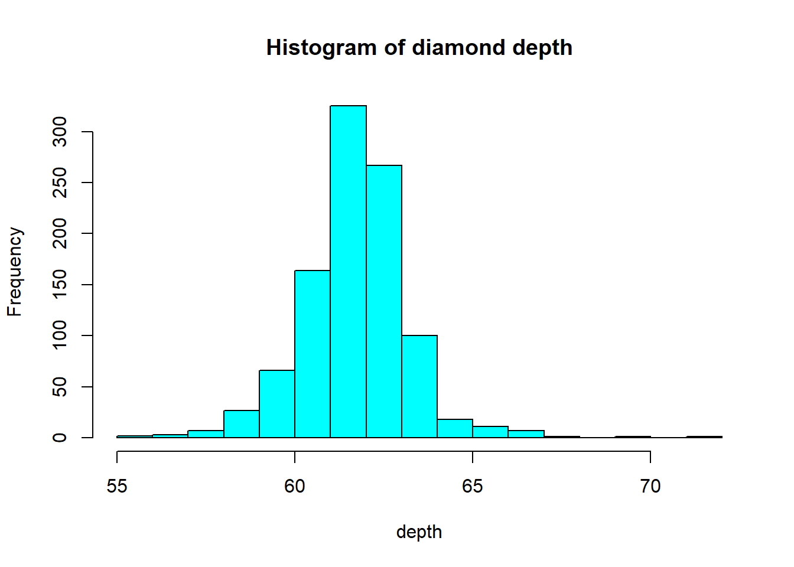

The binwidth here is set by looking at the cut points above that were used to create 7 bins. Notice that darkgrey is the default fill color, but makes it hard to differentiate between the bars. So we'll make the outline black using `colour`, and `fill` the bars with white. 

```r
ggplot(dsmall, aes(x=depth)) + geom_histogram(colour="black", fill="white") + 
  ggtitle("Distribution of diamond depth")
```


Note I did **not** specify the `binwidth` argument here. The size of the bins can hide features from your graph, the default value for ggplot2 is range/30 and usually is a good choice. 


#### Density plots
To get a better idea of the true shape of the distribution we can "smooth" out the bins and create what's called a `density` plot or curve. Notice that the shape of this distribution curve is much more... "wigglier" than the histogram may have implied. 

**base**

```r
plot(density(dsmall$depth))
```


Awesome title huh? (NOT)


**ggplot2**

```r
ggplot(dsmall, aes(x=depth)) + geom_density()
```


#### Histograms + density 
Often is is more helpful to have the density (or kernel density) plot _on top of_ a histogram plot. 

**Base**
Since the height of the bars in a histogram default to showing the frequency of records in the data set within that bin, we need to 1) scale the height so that it's a _relative frequency_, and then use the `lines()` function to add a `density()` line on top. 


```r
hist(dsmall$depth, prob=TRUE)
lines(density(dsmall$depth), col="blue")
```


**ggplot**
The syntax starts the same, we'll add a new geom, `geom_density` and color the line blue. Then we add the histogram geom using `geom_histogram` but must specify that the y axis should be on the density, not frequency, scale. Note that this has to go inside the aesthetic statement `aes()`. I'm also going to get rid of the fill by using `NA` so it doesn't plot over the density line. 

```r
ggplot(dsmall, aes(x=depth)) + geom_density(col="blue") + 
  geom_histogram(aes(y=..density..), colour="black", fill=NA)
```


#### Boxplots
Another very common way to visualize the distribution of a continuous variable is using a boxplot. Boxplots are useful for quickly identifying where the bulk of your data lie. R specifically draws a "modified" boxplot where values that are considered outliers are plotted as dots. 

**base**

```r
boxplot(dsmall$depth)
```


Notice that the only axis labeled is the y=axis. Like a dotplot the x axis, or "width", of the boxplot is meaningless here. We can make the axis more readable by flipping the plot on it's side. 

```r
boxplot(dsmall$depth, horizontal = TRUE, main="Distribution of diamond prices", xlab="Dollars")
```


Horizontal is a bit easier to read in my opinion. 

**ggplot**
What about ggplot? ggplot doesn't really like to do univariate boxplots. We can get around that by specifying that we want the box placed at a specific x value. 


```r
ggplot(dsmall, aes(x=1, y=depth)) + geom_boxplot()
```

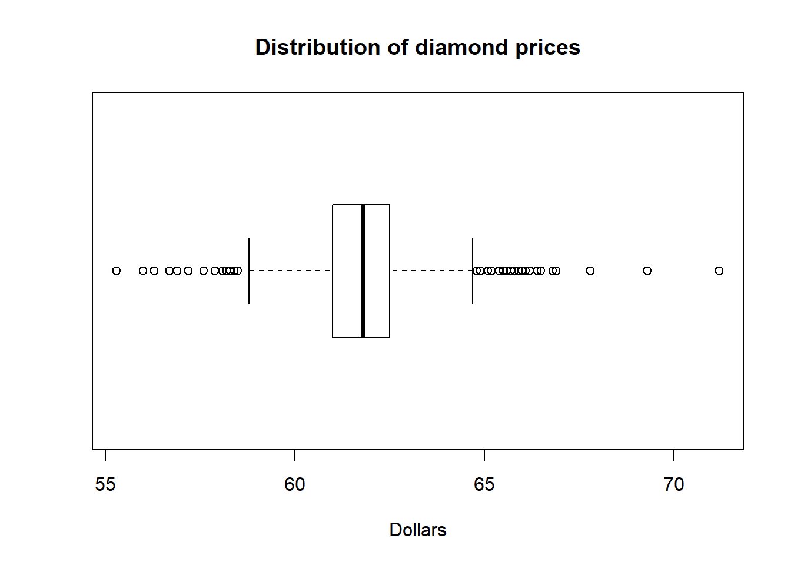

To flip it horizontal you may think to simply swap x and y? Good thinking. Of course it wouldn't be that easy. So let's just flip the whole darned plot on it's coordinate axis. 


```r
ggplot(dsmall, aes(x=1, y=depth)) + geom_boxplot() + coord_flip()
```


#### Violin plots


```r
ggplot(dsmall, aes(x=1, y=depth)) + geom_violin()
```

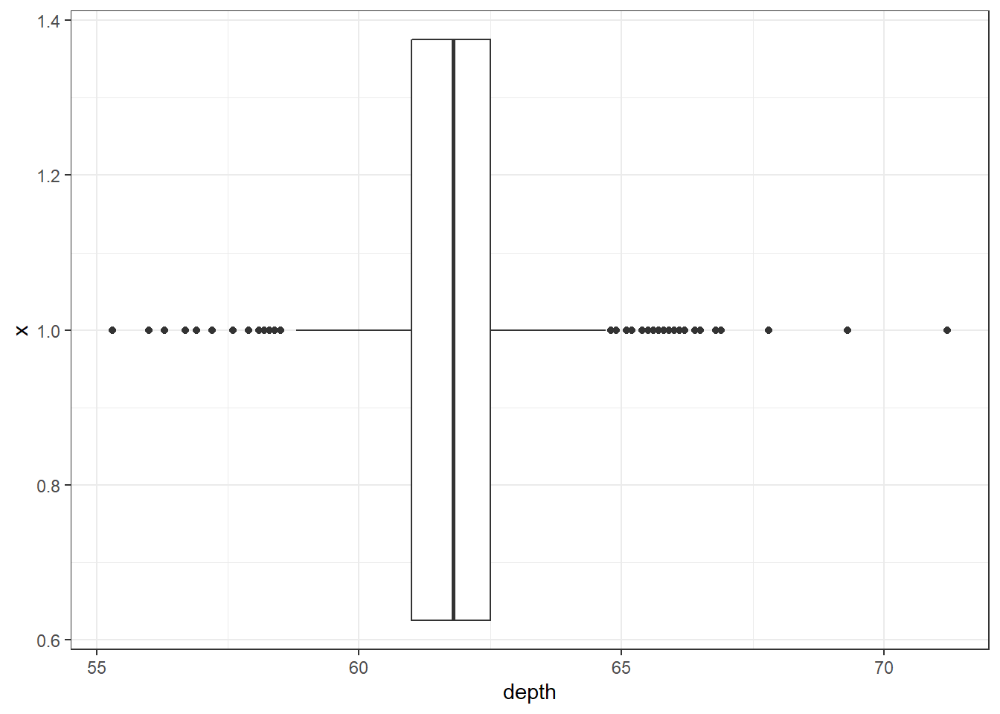

#### Boxplot + Violin plots
Overlaying a boxplot and a violin plot serves a similar purpose to Histograms + Density plots. 


```r
ggplot(dsmall, aes(x=1, y=depth)) + geom_violin() + geom_boxplot()
```


Better appearance - different levels of transparency of the box and violin. 


```r
ggplot(dsmall, aes(x=1, y=depth)) + xlab("") + theme_bw() + 
              geom_violin(fill="blue", alpha=.1) + 
              geom_boxplot(fill="blue", alpha=.5, width=.2) + 
              theme(axis.title.x=element_blank(),
              axis.text.x=element_blank(),
              axis.ticks.x=element_blank())
```

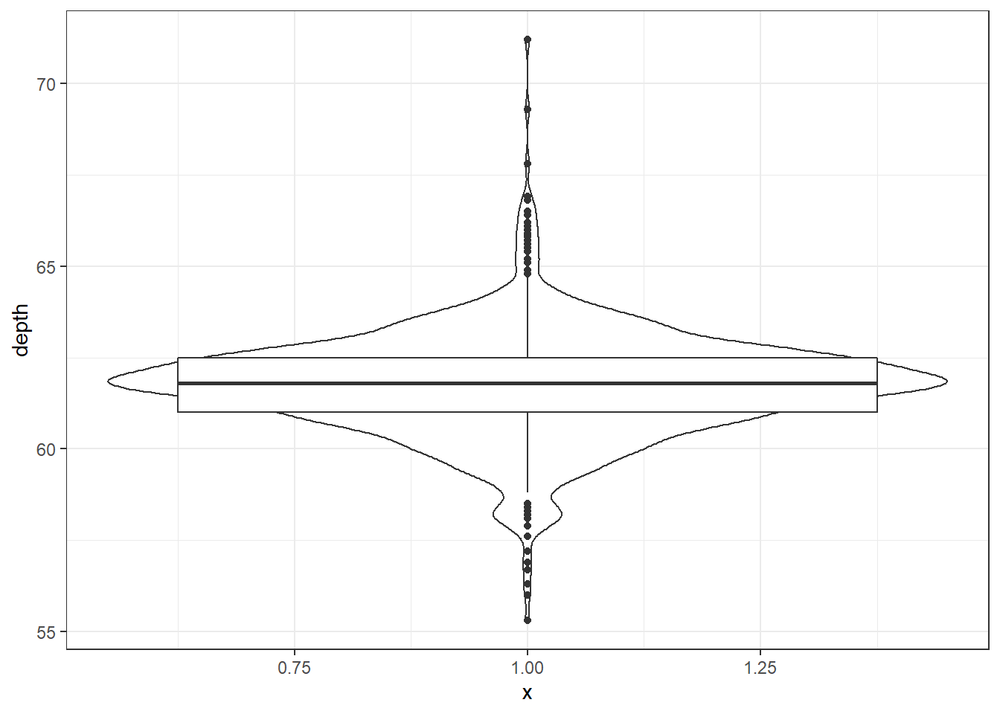


#### Normal QQ plots
The last useful plot that we will do on a single continuous variable is to assess the _normality_ of the distribution. Basically how close the data follows a normal distribution. 

**base**

```r
qqnorm(dsmall$price)
qqline(dsmall$price, col="red")
```


The line I make red because it is a reference line. The closer the points are to following this line, the more "normal" the shape of the distribution is. Price has some pretty strong deviation away from that line. Below I have plotted what a normal distribution looks like as an example of a "perfect" fit. 


```r
z <- rnorm(1000)
qqnorm(z)
qqline(z, col="blue")
```

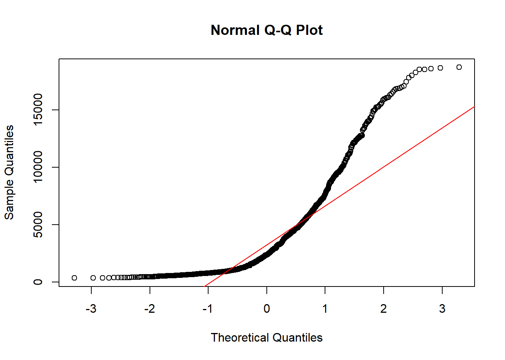

**ggplot**
qq (or qnorm) plots specifically plot the data against a theoretical distribution. That means in the `aes()` aesthetic argument we don't specify either x or y, but instead the `sample=` is the variable we want to plot. 

```r
ggplot(dsmall, aes(sample=price)) + stat_qq()
```


Additional references on making qqplots in ggplot: http://www.sthda.com/english/wiki/ggplot2-qq-plot-quantile-quantile-graph-quick-start-guide-r-software-and-data-visualization


## Bivariate Visualizations

### Categorical v. Categorical

#### Two-way Frequency tables
Cross-tabs, cross-tabulations and two-way tables (all the same thing, different names) can be created by using the `table()` function. 

The frequency table is constructed using the `table()` function. 

```r
table(dsmall$cut, dsmall$color)
##            
##              D  E  F  G  H  I  J
##   Fair       5  6  7  4  5  4  3
##   Good      18 23 11 16 17  7  7
##   Very Good 26 37 46 40 33 25 13
##   Premium   34 53 43 49 41 24 13
##   Ideal     54 63 79 92 53 34 15
```

There are 4 Fair diamonds with color D, and 21 Ideal quality diamonds with color J.

#### Two-way Proprtion tables
Choose your percentages depending on your research question. What are you wanting to compare? 

Best practices: 

* Explanatory variable on the rows
* Response variable on the columns
* Calculate row %'s as the % of the response for each explanatory group. 

Here are demonstrations of how the interpretation of the percents change depending on what the denominator is. 

**Cell proportions**

Wrapping `prop.table()` around a table gives you the **cell** proportions. 

```r
prop.table(table(dsmall$cut, dsmall$color))
##            
##                 D     E     F     G     H     I     J
##   Fair      0.005 0.006 0.007 0.004 0.005 0.004 0.003
##   Good      0.018 0.023 0.011 0.016 0.017 0.007 0.007
##   Very Good 0.026 0.037 0.046 0.040 0.033 0.025 0.013
##   Premium   0.034 0.053 0.043 0.049 0.041 0.024 0.013
##   Ideal     0.054 0.063 0.079 0.092 0.053 0.034 0.015
```
0.4% of all diamonds are D color and Fair cut, 2.1% are J color and Ideal cut. 

**Row proportions**

To get the **row** proportions, you specify `margin=1`. The percentages now add up to 1 across the rows. 

```r
round(prop.table(table(dsmall$cut, dsmall$color), margin=1),3)
##            
##                 D     E     F     G     H     I     J
##   Fair      0.147 0.176 0.206 0.118 0.147 0.118 0.088
##   Good      0.182 0.232 0.111 0.162 0.172 0.071 0.071
##   Very Good 0.118 0.168 0.209 0.182 0.150 0.114 0.059
##   Premium   0.132 0.206 0.167 0.191 0.160 0.093 0.051
##   Ideal     0.138 0.162 0.203 0.236 0.136 0.087 0.038
```

14.8% of all Fair quality diamonds are color D. 5.4% of all Ideal quality diamonds have color J.

**Column proportions**

To get the **column** proportions, you specify `margin=2`. The percentages now add up to 1 down the columns. 

```r
round(prop.table(table(dsmall$cut, dsmall$color), margin=2),3)
##            
##                 D     E     F     G     H     I     J
##   Fair      0.036 0.033 0.038 0.020 0.034 0.043 0.059
##   Good      0.131 0.126 0.059 0.080 0.114 0.074 0.137
##   Very Good 0.190 0.203 0.247 0.199 0.221 0.266 0.255
##   Premium   0.248 0.291 0.231 0.244 0.275 0.255 0.255
##   Ideal     0.394 0.346 0.425 0.458 0.356 0.362 0.294
```

2.7% of all D color diamonds are of Fair quality. 44.7% of all J color diamonds are of Ideal quality. 


#### Grouped bar charts
To compare proportions of one categorical variable within the same level of another, is to use grouped barcharts. 

**base**
As before, the object to be plotted needs to be the result of a table. 

```r
cc <- table(dsmall$cut, dsmall$color)
barplot(cc)
```


Stacked bars can be difficult to interpret, and very difficult to compare values between groups. A side by side barchart is preferable. 
The `beside=TRUE` is what controls the placement of the bars. 

```r
barplot(cc, main="quick side by side barchart using base graphics", beside=TRUE)
```


**ggplot**
Again plot the cut on the x axis, but then `fill` using the second categorical variable. This has the effect of visualizing the **row** percents from the table above. The percent of color, within each type of cut. 


```r
ggplot(dsmall, aes(x=cut, fill=color)) + geom_bar()
```


Again the default is a stacked barchart. So we just specify `position=dodge` to put the bars side by side. 

```r
ggplot(dsmall, aes(x=cut, fill=color)) + geom_bar(position = "dodge")
```


And look, an automatic legend. What if I wanted to better compare cut within color group? This is the **column** percentages. Just switch which variable is the x axis and which one is used to fill the colors!

```r
ggplot(dsmall, aes(x=color, fill=cut)) + geom_bar(position = "dodge")
```


For more than 2 colors I do not recommend choosing the colors yourself. I know little about color theory so I use the built-in color palettes. Here is a [great cheatsheet](https://www.nceas.ucsb.edu/~frazier/RSpatialGuides/colorPaletteCheatsheet.pdf) about using color palettes. 

And this easy change is why we love `ggplot2`. 


### Grouped bar charts with percentages
Not as easy as one would hope, but the solution is to calculate the desired percentages first and then plot the summary data using either `geom_bar(stat='identity')` or `geom_col()`. 


```r
calc.props <- diamonds %>% group_by(color, cut) %>%
              summarise(count=n()) %>%
              mutate(pct=round(count/sum(count),3))
calc.props
## # A tibble: 35 × 4
## # Groups:   color [7]
##    color cut       count   pct
##    <ord> <ord>     <int> <dbl>
##  1 D     Fair        163 0.024
##  2 D     Good        662 0.098
##  3 D     Very Good  1513 0.223
##  4 D     Premium    1603 0.237
##  5 D     Ideal      2834 0.418
##  6 E     Fair        224 0.023
##  7 E     Good        933 0.095
##  8 E     Very Good  2400 0.245
##  9 E     Premium    2337 0.239
## 10 E     Ideal      3903 0.398
## # … with 25 more rows
## # ℹ Use `print(n = ...)` to see more rows
```

Since we're plotting summary data, the height of the bars is specified using `y=pct`. 


```r
ggplot(calc.props, aes(x=color, fill=cut, y=pct)) +
                  geom_col(position="dodge") + theme_bw() 
```


Now set some options to the y axis using `scale_y_continuous()` to make the graph more accurate and readable. The `labels=percent` comes from the `scales` package. 


```r
library(scales)
ggplot(calc.props, aes(x=color, fill=cut, y=pct)) +
                  geom_col(position="dodge") + theme_bw() +
                  scale_y_continuous(limits=c(0,1), labels=percent)
```


#### `sjPlot` 

sjPlot does a very nice job of being able to cleanly show not only n's but percents. 

```r
library(sjPlot)
plot_xtab(dsmall$color, dsmall$cut, margin="row", coord.flip = TRUE) 
```


#### Mosaic plots
But what if you want to know how two categorical variables are related and you don't want to look at two different barplots? Mosaic plots are a way to visualize the proportions in a table. So here's the two-way table we'll be plotting. 

```r
table(dsmall$cut, dsmall$color)
##            
##              D  E  F  G  H  I  J
##   Fair       5  6  7  4  5  4  3
##   Good      18 23 11 16 17  7  7
##   Very Good 26 37 46 40 33 25 13
##   Premium   34 53 43 49 41 24 13
##   Ideal     54 63 79 92 53 34 15
```

The syntax for a mosaic plot uses _model notation_, which is basically y ~ x where the ~ is read as "twiddle" or "tilde". It's to the left of your **1** key.

```r
mosaicplot(cut~color, data=dsmall)
```


Helpful, ish. Here are two very useful options. In reverse obviousness, `color` applies shades of gray to one of the factor levels, and `shade` applies a color gradient scale to the cells in order of what is less than expected (red) to what is more than expected (blue) if these two factors were completely independent. 

```r
par(mfrow=c(1,2)) # display the plots in 1 row and 2 columns
mosaicplot(cut~color, data=dsmall, color=TRUE)
mosaicplot(cut~color, data=dsmall, shade=TRUE)
```


For example, there are fewer 'Very Good' cut diamonds that are color 'G', and fewer 'Premium' cut diamonds that are color 'H'. As you can see, knowing what your data means when trying to interpret what the plots are telling you is essential. 

That's about all the ways you can plot categorical variables. 
If you are wondering why there was no 3D barcharts demonstrated see  
[here](http://faculty.atu.edu/mfinan/2043/section31.pdf),
[here](http://www.bbc.co.uk/schools/gcsebitesize/maths/statistics/representingdata2rev5.shtml), and 
[here](https://en.wikipedia.org/wiki/Misleading_graph) for other ways you can really screw up your visualization.


### Continuous v. Continuous 

#### Scatterplot
The most common method of visualizing the relationship between two continuous variables is by using a scatterplot. 

**base**
Back to the `plot()` command. Here we use model notation again, so it's $y~x$. 

```r
plot(price~carat, data=dsmall)
```


Looks like for the most part as the carat value increases so does price. That makes sense. 

**ggplot**
With ggplot we specify both the x and y variables, and add a point. 

```r
ggplot(dsmall, aes(x=carat, y=price)) + geom_point()
```


**Other Resources**

* http://www.statmethods.net/graphs/scatterplot.html  
* https://www.r-bloggers.com/scatterplot-matrices/

#### Adding lines to the scatterplots 
Two most common trend lines added to a scatterplots are the "best fit" straight line and the "lowess" smoother line. 

**base**
The best fit line (in blue) gets added by using the `abline()` function wrapped around the linear model function `lm()`. Note it uses the same model notation syntax and the `data=` statement as the `plot()` function does. The lowess line is added using the `lines()` function, but the `lowess()` function itself doesn't allow for the `data=` statement so we have to use `$` sign notation. 


```r
plot(price~carat, data=dsmall)
abline(lm(price~carat, data=dsmall), col="blue")
lines(lowess(dsmall$price~dsmall$carat), col="red")
```


**ggplot**
With ggplot, we just add a `geom_smooth()` layer. 

```r
ggplot(dsmall, aes(x=carat, y=price)) + geom_point() + geom_smooth() 
```


Here the point-wise confidence interval for this lowess line is shown in grey. If you want to turn the confidence interval off, use `se=FALSE`. Also notice that the smoothing geom uses a different function or window than the `lowess` function used in base graphics. 

Here it is again using the `ggplot` plotting function and adding another `geom_smooth()` layer for the `lm` (linear model) line in blue, and the lowess line (by not specifying a method) in red.


```r
ggplot(dsmall, aes(x=carat, y=price)) + geom_point() + 
  geom_smooth(se=FALSE, method="lm", color="blue") + 
  geom_smooth(se=FALSE, color="red")
```

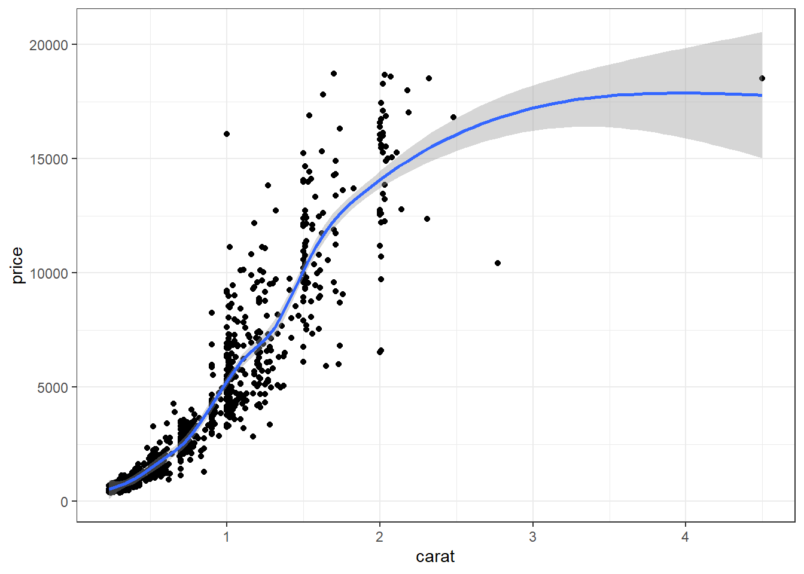


#### Line plots

Line plots connect each dot with a straight line. This is most often done when measuring trends of the response as the value of x increases (such as a time series)

We saw earlier that `carat` and `price` seemed possibly linear. Let see how the average price changes with carat. 

```r
library(dplyr)
price.per.carat <- dsmall %>% group_by(carat) %>% summarise(mean = mean(price))
```

**base**
For base graphics, type='b' means both points and lines, 'l' gives you just lines and 'p' gives you only points. You can find more plotting character options under `?pch`. 


```r
plot(mean~carat, data=price.per.carat, type='l')
```


**ggplot**
With ggplot we specify that we want a line geometry only. 

```r
ggplot(price.per.carat, aes(x=carat, y=mean)) + geom_line()
```


How does this relationship change with cut of the diamond? First lets 
get the average price per combination of carat and cut. 


```r
ppc2 <- dsmall %>% group_by(cut, carat) %>% summarise(mean = mean(price))
```

**base**
This plot can be created in base graphics, but it takes an advanced 
knowledge of the graphics system to do so. So I do not show it here. 

**ggplot**
This is where ggplot starts to excel in it's ease of creating more
complex plots. All we have to do is specify that we want the lines 
colored by the cut variable. 


```r
ggplot(ppc2, aes(x=carat, y=mean, col=cut)) + geom_line()
```


And we get one line per cut. 


### Continuous v. Categorical
Create an appropriate plot for a continuous variable, and plot it for each
level of the categorical variable. 

#### Dotplot/strip chart

Dotplots can be very useful when plotting dots against several categories. They can also be called stripcharts. 

**base**

```r
stripchart(carat ~ cut, data=dsmall)
```


Doesn't look to pretty, but kinda gets the point across. Few fair quality diamonds in the data set, pretty spread out across the carat range except one high end outlier. 

**ggplot**
We can reproduce the same thing by plotting one continuous variable against one categorical variable, and adding a layer of points. I'd argue that horizontal looks better due to the axis-labels. 

```r
a <- ggplot(dsmall, aes(y=carat, x=cut)) + geom_point()
b <- ggplot(dsmall, aes(y=cut, x=carat)) + geom_point()
grid.arrange(a, b, ncol=2)
```


#### Grouped boxplots

**base**
Base graphics plots grouped boxplots with also just the addition of a twiddle (tilde) `~`. 
Another example of where model notation works. 


```r
boxplot(carat~color, data=dsmall)
```


**ggplot**
A simple addition, just define your x and y accordingly. 

```r
ggplot(dsmall, aes(x=color, y=carat, fill=color)) + geom_boxplot()
```


**Adding violins**
Violin plots can be overlaid here as well. 

```r
ggplot(dsmall, aes(x=color, y=carat, fill=color)) +
        geom_violin(alpha=.1) + 
        geom_boxplot(alpha=.5, width=.2)
```


#### Grouped histograms

**base**
There is no easy way to create grouped histograms in base graphics we will skip it. 

**ggplot**
By default ggplot wants to overlay all plots on the same grid. This doesn't look to good with histograms. Instead you can overlay density plots

```r
a <- ggplot(dsmall, aes(x=carat, fill=color)) + geom_histogram()
b <- ggplot(dsmall, aes(x=carat, fill=color)) + geom_density() 
grid.arrange(a,b, ncol=2)
```


The solid fills are still difficult to read, so we can either turn down the alpha (turn up the transparency) or only color the lines and not the fill. 

```r
c <- ggplot(dsmall, aes(x=carat, fill=color)) + geom_density(alpha=.2)
d <- ggplot(dsmall, aes(x=carat, col=color)) + geom_density() 
grid.arrange(c,d, ncol=2)
```

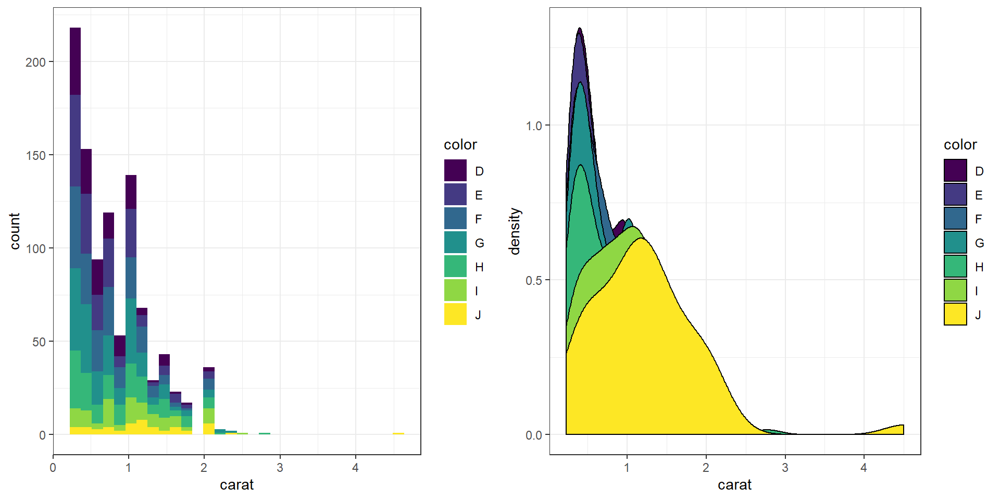

### Joy plots / Ridgelines 
Somewhat new (2017), joylines have not been added to the base distribution of `ggplot2` yet. For now it's available in the `ggjoy` package. Really good way to visualize density plots without the overlapping issue. 


```r
library(ggjoy)
ggplot(dsmall, aes(x=carat, y=color)) + geom_joy()
```


## Faceting / paneling 

This is a good place to introduce a term called `faceting`. The definition is _a particular aspect or feature of something_, or _one side of something many-sided, especially of a cut gem_. Basically instead of plotting the grouped graphics on the same plotting area, we let each group have it's own plot, or facet.  

We add a `facet_wrap()` and specify that we want to panel on the color group. Note the twiddle in front of color. 


```r
ggplot(dsmall, aes(x=carat, fill=color)) + geom_density() + facet_wrap(~color)
```


The grid placement can be semi-controlled by using the `ncol` argument in the `facet_wrap()` statement. 

```r
ggplot(dsmall, aes(x=carat, fill=color)) + geom_density() + facet_wrap(~color, ncol=4)
```


It is important to compare distributions across groups on the same scale, and our eyes can compare items vertically better than horizontally. So let's force `ncol=1`. 


```r
ggplot(dsmall, aes(x=carat, fill=color)) + geom_density() + facet_wrap(~color, ncol=1)
```

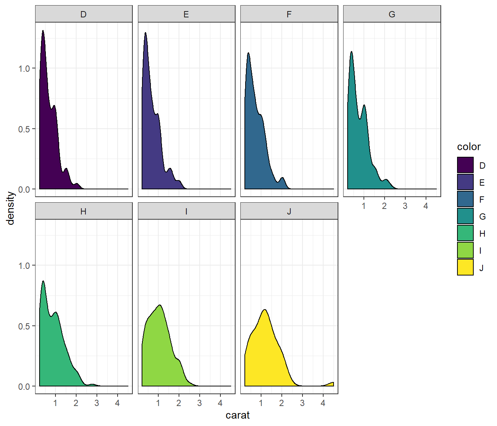


## Multiple plots per window

**base**
I use `par(mfrow=c(r,c))` for base graphics, where `r` is the number of rows and `c` the number of columns. 


```r
par(mfrow=c(1,3))
plot(dsmall$carat)
plot(dsmall$color)
plot(dsmall$price ~ dsmall$carat)
```

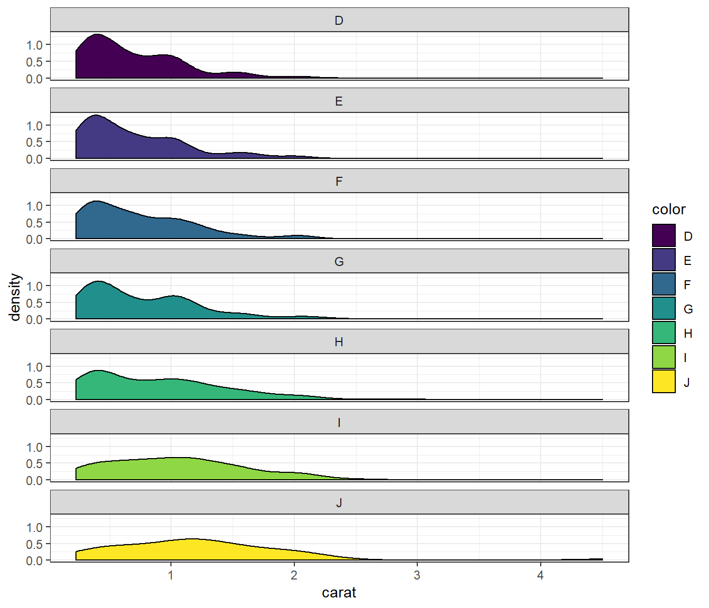

Other resources including learning about `layouts`. Multipanel plotting with base graphics http://seananderson.ca/courses/11-multipanel/multipanel.pdf 

**ggplot**
Use the `grid.arrange` function in the `gridExtra` package. I've done it several times above. You assign the output of a ggplot object to an object (here it's `plot1` and `plot2`). Then you use `grid.arrange()` to arrange them either side by side or top and bottom. 

```r
a <- ggplot(dsmall, aes(x=carat, fill=color)) + geom_density(alpha=.2)
b <- ggplot(dsmall, aes(x=carat, col=color)) + geom_density() 
grid.arrange(a,b, ncol=2)
```


## Multivariate (3+ variables)
This is not much more complicated than taking an appropriate bivariate plot and adding a third variable through paneling, coloring, or changing a shape. 

This is trivial to do in ggplot, not trivial in base graphics. So I won't show those examples. 

### Three continuous
Continuous variables can also be mapped to the size of the point. Here I set the alpha on the points so we could see the overplotting (many points on a single spot). So the darker the spot the more data points on that spot. 


```r
ggplot(dsmall, aes(x=carat, y=price, size=depth)) + geom_point(alpha=.2)
```


### Scatterplot matrix
A scatterplot matrix allows you to look at the bivariate comparison of multiple pairs of variables simultaneously. First we need to trim down the data set to only include the variables we want to plot, then we use the `pairs()` function.


```r
c.vars <- dsmall[,c('carat', 'depth', 'price', 'x', 'y', 'z')]
pairs(c.vars)
```


We can see price has a non-linear relationship with X, Y and Z and x & y have a near perfect linear relationship. 


### Two categorical and one continuous
This is very similar to side by side boxplots, one violin plot per `cut`, within each level of color. This is difficult to really see due to the large number of categories each factor has. 


```r
ggplot(dsmall, aes(x=color, y=price, fill=cut)) + geom_violin()
```

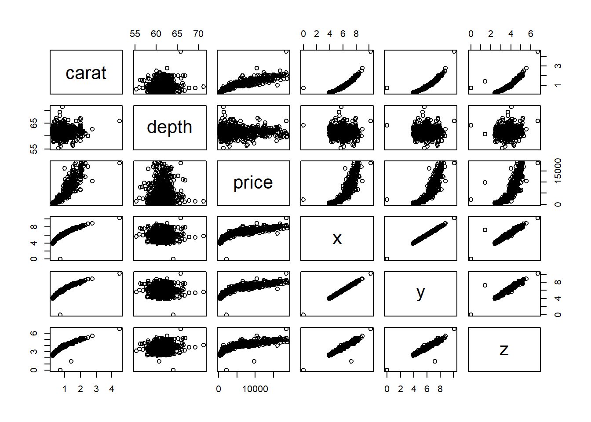

Best bet here would be to panel on color and change the x axis to cut.  

```r
ggplot(dsmall, aes(x=cut, y=price, fill=cut)) + geom_violin() + facet_wrap(~color)
```

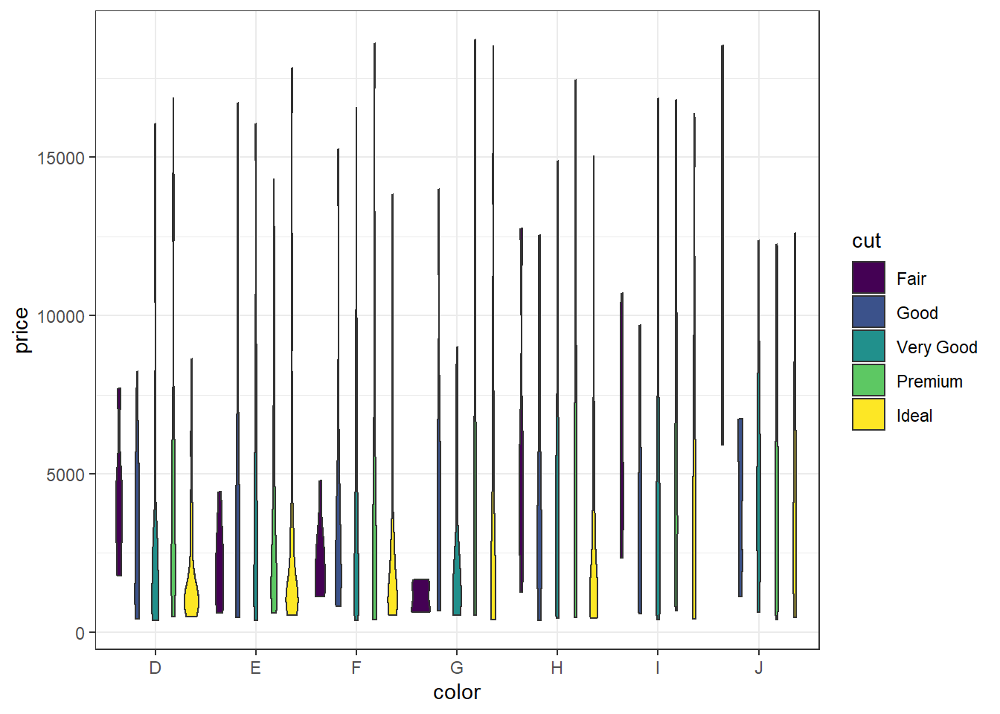


### Two continuous and one categorical 

```r
a <- ggplot(dsmall, aes(x=carat, y=price, color=cut)) + geom_point() + ggtitle("Colored by cut")
d <- ggplot(dsmall, aes(x=carat, y=price, color=cut)) + geom_point() + 
      geom_smooth(se=FALSE) +ggtitle("Lowess line per cut")
grid.arrange(a, d, nrow=1)
```


Change the shape

```r
ggplot(dsmall, aes(x=carat, y=price, shape=cut)) + geom_point() + ggtitle("Shape by cut")
```

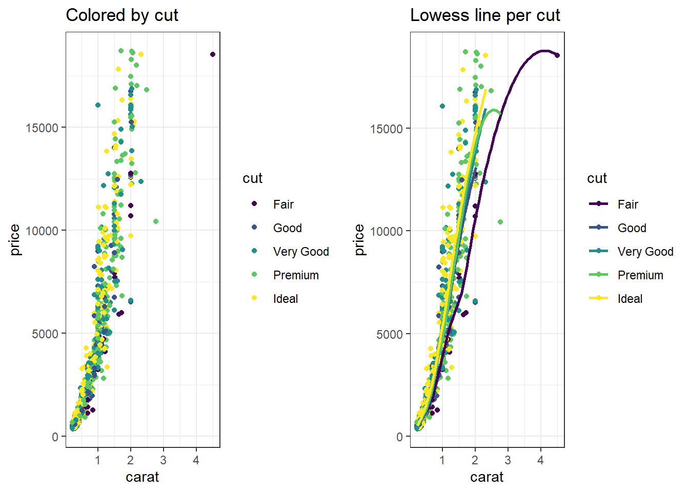

Or we just panel by the third variable


```r
ggplot(dsmall, aes(x=carat, y=price)) + geom_point() + facet_wrap(~cut)
```


## Paneling on two variables
Who says we're stuck with only faceting on one variable? A variant on `facet_wrap` is `facet_grid`. Here we can specify multiple variables to panel on. 


```r
ggplot(dsmall, aes(x=carat, fill=color)) + geom_density() + facet_grid(cut~color)
```


How about plotting price against caret, for all combinations of color and clarity, with the points further separated by cut?

```r
ggplot(dsmall, aes(x=carat, y=price, color=cut)) + geom_point() + facet_grid(clarity~color)
```


And lastly let's look back at how we can play with scatterplots of using a third categorical variable (using `ggplot2` only). We can color the points by cut, 


```r
ggplot(dsmall, aes(x=carat, y=price, color=cut)) + geom_point()
```


We could add a smoothing lowess line for each cut separately, 

```r
ggplot(dsmall, aes(x=carat, y=price, color=cut)) + geom_point() + geom_smooth(se=FALSE)
```

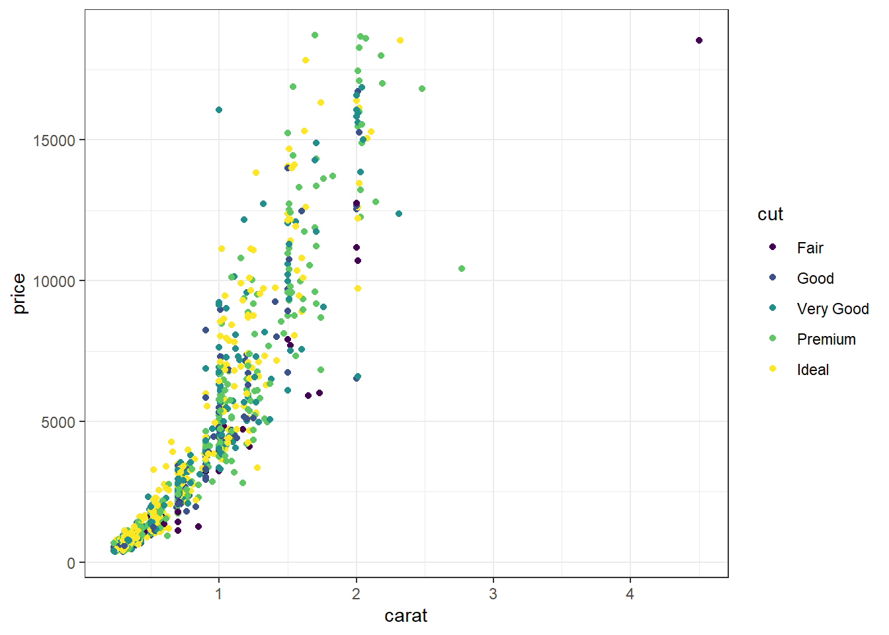

We could change the color by clarity, and shape by cut. 

```r
ggplot(dsmall, aes(x=carat, y=price, color=clarity, shape=cut)) + geom_point() 
```


That's pretty hard to read. So note that just because you **can** change an aesthetic, doesn't mean you should. And just because you can plot things on the same axis, doesn't mean you have to. 

Before you share your plot with any other eyes, always take a step back and try to explain what it is telling you. If you have to take more than a minute to get to the point then it may be too complex and simpler graphics are likely warranted. 


-----

## Troubleshooting 

**Problem:** Missing data showing up as a category in ggplot? 


Get rid of that far right bar!

```r
ggplot(NCbirths, aes(x=marital)) + geom_bar()
```


**Solution:** Use `dplyr` to select only the variables you are going to plot, then pipe in the `na.omit()` at the end. It will create a temporary data frame (e.g) `plot.data` that you then provide to `ggplot()`.


```r
plot.data <- NCbirths %>% select(marital) %>% na.omit()
ggplot(plot.data, aes(x=marital)) + geom_bar()
```


**Problem:** Got numerical binary 0/1 data but want to plot it as categorical? 
> Other related error messages: 
> * Continuous x aesthetic -- did you forget aes(group=...)?  

Consider a continuous variable for the number of characters in an email `num_char`, and a 0/1 binary variable `spam`. 

**Solution:** Create a second variable `var_factor` for plotting and keep the binary `var` as 0/1 for analysis. 


```r
email$spam_cat <- factor(email$spam, labels=c("Ham", "Spam"))
ggplot(email, aes(y=num_char, x=spam_cat)) + geom_boxplot()
```


**Problem:** You want to change the legend title for a `fill` or `color` scale.  

**Solution:** Add the `name=` argument to whatever layer you added that created the legend. Here I speciefied a `fill`, and it was a `discrete` variable. So I use the `scale_fill_discrete()` layer. 


```r
ggplot(email, aes(y=num_char, x=spam_cat, fill=spam_cat)) + geom_boxplot() + 
  scale_fill_discrete(name="Ya like Spam?")
```


Here, I `col`ored the points by a discrete variable, so the layer is `scale_color_discrete()`.

```r
ggplot(email, aes(x=num_char, y=line_breaks, col=spam_cat)) + geom_point() +
  scale_color_discrete(name="Ya like Spam?")
```


**Problem:** You want to add means to boxplots. 
Boxplots are great. Even better with violin overlays. Know what makes them even better than butter? Adding a point for the mean. `stat_summary` is the layer you want to add. Check out [this stack overflow post](https://stackoverflow.com/questions/23942959/ggplot2-show-separate-mean-values-in-box-plot-for-grouped-data) for more context. 


```r
ggplot(email, aes(x=spam_cat, y=num_char, fill=spam_cat)) +
  geom_boxplot() +
  stat_summary(fun.y="mean", geom="point", size=3, pch=17,color="blue")
```


I suggest playing around with `size` and plotting character `pch` to get a feel for how these work. You can also look at `?pch` (and scroll down in the help file) to see the 25 default plotting characters.

## But what about...

* Legend adjustment: remove it, move it to another side, rename it
* Custom specified colors and shapes

Go here http://www.cookbook-r.com/Graphs/ for these. 

### Other plots not mentioned

* Heat maps https://www.r-bloggers.com/how-to-make-a-simple-heatmap-in-ggplot2/ 
* Word clouds https://rpubs.com/brandonkopp/creating-word-clouds-in-r , simpler: http://dangoldin.com/2016/06/06/word-clouds-in-r/ 
* Interactive plots - Look into `plotly()` and `ggplotly()`
* the circle type plots

## Additional Resources

For any Google Search -  be sure to limit searches to within the past year or so. R packages get updated very frequently, and many functions change or become obsolete. 

* R Graphics: https://www.stat.auckland.ac.nz/~paul/RGraphics/rgraphics.html The best book about using base graphics
* R Graphics Cookbook: http://www.cookbook-r.com/Graphs/ or http://amzn.com/1449316956  The best book for using ggplot2 
* STHDA: Statisical tools for high-throughput data analysis. http://www.sthda.com/english/
* Quick-R: [Basic Graphs](http://www.statmethods.net/graphs/index.html)
* Quick-R: [ggplot2](http://www.statmethods.net/advgraphs/ggplot2.html)
* Books 
    - ggplot2 http://ggplot2.org/book/ or http://amzn.com/0387981403
    - qplot http://ggplot2.org/book/qplot.pdf
* Help lists
    - ggplot2 mailing list http://groups.google.com/group/ggplot2
    - stackoverflow http://stackoverflow.com/tags/ggplot2
    - Chico R users group
    

<!--chapter:end:data_viz.Rmd-->

# Selecting Appropriate Analyses {#select_analysis}

_In Progress_
This section covers how to choose appropriate analyses for any number and type of measurements. 
Think like, flow chart. 

**Considerations:**

* Purpose of analysis.  
* Types of variables in data set.  
* Data used in analysis.   
* Assumptions needed; satisfied?  
* Choice of analyses is often arbitrary: consider several  

**Example:** 

5 independent variables: 3 interval, 1 ordinal, 1 nominal  

1 dependent variable: interval

Analysis options  

- Multiple regression: pretend independent ordinal variable is an
  interval variable use dummy (0 /1) variables for nominal variables
- Analysis of variance: categorize all independent variables
- Analysis of covariance: leave variables as is, check assumptions
- Logistic regression: Categorize dependent variable: high, low
- Survival analysis: IF dependent variable is time to an event

Unsure? Do several and compare results. 

<!--chapter:end:select_analysis.Rmd-->

# (PART) Statistical Inference {-}

# Foundations for Inference {#bv-intro}

> Add a section prior to this on foundations for inference. 


<!--chapter:end:bivariate_intro.Rmd-->

# Bivariate Analysis

So far we have been concerned with making inference about a single population parameter. 
Many problems deal with comparing a parameter across two or more groups. Research 
questions include questions like: 

* Does the average life span differ across subspecies of a particular turtle?
* Who has a higher percentage of the female vote - Democrats or Republicans?


A good way to think about all statistical models is that the observed data comes from some true model with some random error.

> DATA = MODEL + RESIDUAL

The `MODEL` is a mathematical formula (like $y = f(x)$). 
The formulation of the `MODEL` will change depending on the number of, and data types of explanatory variables. One goal of inferential analysis is to explain the variation in our data, using information contained in other measures. 


## Assumption of Independent Observations

The primary assumption of most standard statistical procedures is that observations are
independent of each other. That is, the value of one observation does not change or affect another observation. 
However, there are many examples where measurements are made 
on subjects before and after a certain exposure or treatment (pre-post), or an 
experiment to compare two cell phone packages might use pairs of subjects that 
are the same age, sex and income level. One subject would be randomly assigned 
to the first phone package, the other in the pair would get the second phone package. 
This chapter only deals with non-correlated analyses, leaving that topic for a later chapter. 

## Choosing appropriate bivariate analysis

Choosing which statistical analyses procedure is appropriate completely depending on the data types of the explanatory and response variable. This is a simplified table, only covering the common/standard types of bivariate analysis. 


> figure out how to get table here. 

For this set of notes, the variable types are referred to using the first letter, 
e.g. *Q* for quantitative, *B* for binary, and *C* for categorical. 
Thus a T-test is a (Q $\sim$ B) analysis, and a correlation analysis is (Q $\sim$ Q) analysis. 


Links to the example data used in this chapter. 

```r
load(url("https://norcalbiostat.netlify.com/data/addhealth_clean.Rdata"))
county <- read.csv("https://norcalbiostat.netlify.com/data/countyComplete.csv", header=TRUE, stringsAsFactors = FALSE)
```

----

## (Q~B) Two means: T-Test {#bv-ttest}


It is common to compare means from different samples. For instance, we
might investigate the effectiveness of a certain educational intervention
by looking for evidence of greater reading ability in the treatment group
against a control group. That is, our research hypothesis is that reading
ability of a child is associated with an educational intervention.

The null hypothesis states that there is no relationship, or no effect, of
the educational intervention (binary explanatory variable) on the reading ability
of the child (quantitative response variable). This can be written in symbols as follows:


$$H_{0}: \mu_{1} = \mu_{2}\mbox{ or }\qquad  H_{0}: \mu_{1} -\mu_{2}=0$$

where $\mu_{1}$ is the average reading score for students in the control group (no intervention)
and $\mu_{2}$ be the average reading score for students in the intervention group. Notice it can be written as one mean equals the other, but also as the difference between two means equaling zero. 
The alternative hypothesis $H_{A}$ states that there is a relationship:

$$H_{A}: \mu_{1} \neq \mu_{2} \qquad \mbox{ or } \qquad H_{A}: \mu_{1}-\mu_{2} \neq 0$$


### Assumptions
* The data distribution for each group is approximately normal.
* The scores are independent within each group.
* The scores from the two groups are independent of each other (i.e. the two samples are independent).


### Sampling Distribution for the difference

We use $\bar{x}_1 - \bar{x}_2$ as a point estimate for $\mu_1 - \mu_2$, which has a standard error of

$$
 SE_{\bar{x}_1 - \bar{x}_2}
   = \sqrt{SE_{\bar{x}_1}^2 + SE_{\bar{x}_2}^2}
 	 = \sqrt{\frac{\sigma^{2}_{1}}{n_1} + \frac{\sigma^{2}_{2}}{n_2}}
$$

So the equations for a Confidence Interval is, 

$$
  \left( \bar{x}_{1} - \bar{x}_{2} \right) \pm t_{\frac{\alpha}{2}, df}
    \sqrt{ \frac{\sigma^{2}_{1}}{n_{1}} + \frac{\sigma^{2}_{2}}{n_{2}} }
$$ 

and Test Statistic is, 

$$
  t^{*} =  \frac{\left( \bar{x}_{1} - \bar{x}_{2} \right) - d_{0}}
       {\left( \sqrt{ \frac{\sigma^{2}_{1}}{n_{1}} + \frac{\sigma^{2}_{2}}{n_{2}} }
       \right )} 
$$


Typically it is unlikely that the population variances $\sigma^{2}_{1}$ and $\sigma^{2}_{2}$ are known so we will use sample variances $s^{2}_{1}$ and $s^{2}_{2}$ as estimates. 

While you may never hand calculate these equations, it is important to see the format, or structure, of the equations. Equation \ref{2sampCImean} has the same format of 

$$ \mbox{point estimate} \pm 2*\mbox{standard error}$$

regardless what it is we're actually trying to estimate. Thus in a pinch, you can calculate approximate confidence intervals for whatever estimate you are trying to understand, given only the estimate and standard error, even if the computer program does not give it to you easily or directly. 


### Example: Smoking and BMI

We would like to know, is there convincing evidence that the average BMI differs between those who have ever smoked a cigarette in their life compared to those who have never smoked? This example uses the Addhealth dataset.


**1. Identify response and explanatory variables.**

* The quantitative response variable is BMI (variable \R{BMI})
* The binary explanatory variable is whether the person has ever smoked a cigarette (variable \R{eversmoke\_c})

**2. Visualize and summarize bivariate relationship.**

⚠️ Using `na.omit()` is dangerous! This will remove ALL rows with ANY missing data in it. Regardless if the missing values are contained in the variables you are interested in. 
The example below employs a trick/work around to not have NA values show in the output.
We take the data set `addhealth` _and then_ `select` the variables we want to plot, _and then_ we use `na.omit()` to delete all rows with missing data. Then that is saved as a new, temporary data frame specifically named for this case (`plot.bmi.smoke`). 

> note for later. Move this explanation into data viz section. 


```r
plot.bmi.smoke <- addhealth %>% select(eversmoke_c, BMI) %>% na.omit()

ggplot(plot.bmi.smoke, aes(x=eversmoke_c, y=BMI, fill=eversmoke_c)) +
      geom_boxplot(width=.3) + geom_violin(alpha=.4) +
      labs(x="Smoking status") +
      scale_fill_viridis_d(guide=FALSE) +
      stat_summary(fun.y="mean", geom="point", size=3, pch=17,
      position=position_dodge(width=0.75))
```


```r
plot.bmi.smoke %>% group_by(eversmoke_c) %>%
 summarise(mean=mean(BMI, na.rm=TRUE),
             sd = sd(BMI, na.rm=TRUE),
             IQR = IQR(BMI, na.rm=TRUE))
## # A tibble: 2 × 4
##   eversmoke_c  mean    sd   IQR
##   <fct>       <dbl> <dbl> <dbl>
## 1 Non Smoker   29.7  7.76  9.98
## 2 Smoker       28.8  7.32  9.02
```

Smokers have an average BMI of 28.8, smaller than the average BMI of non-smokers at 29.7. Nonsmokers have more variation in their BMIs (sd 7.8 v. 7.3 and IQR 9.98 v. 9.02), but the distributions both look normal, if slightly skewed right.


**3. Write the relationship you want to examine in the form of a research question.**

* Null Hypothesis: There is no relationship between BMI and smoking status.
* Alternate Hypothesis: There is a relationship between BMI and smoking status.


**4. Perform an appropriate statistical analysis.**

I. Let $\mu_1$ denote the average BMI for nonsmokers, and $\mu_2$ the average BMI for smokers.

II.
  $\mu_1 - \mu_2 = 0$ There is no difference in the average BMI between smokers and nonsmokers.
  $\mu_1 - \mu_2 \neq 0$ There is a difference in the average BMI between smokers and nonsmokers. 

III. We are comparing the means between two independent samples. A Two-Sample T-Test for a difference in means will be conducted. The assumptions that the groups are independent is upheld because each individual can only be either a smoker or nonsmoker. The difference in sample means $\bar{x_1} - \bar{x_2}$ is normally distributed -- this is a valid assumption due to the large sample size and that differences typically are normally distributed. The observations are independent, and the variability is roughly equal (IQR 9.9 v. 9.0).

IV. We use the `t.test` function, but use model notation of the format `outcome` $\sim$ `category`. Here, `BMI` is our continuous outcome that we're testing across the (binary) categorical predictor `eversmoke_c`.


```r
t.test(BMI ~ eversmoke_c, data=addhealth)
## 
## 	Welch Two Sample t-test
## 
## data:  BMI by eversmoke_c
## t = 3.6937, df = 3395.3, p-value = 0.0002245
## alternative hypothesis: true difference in means between group Non Smoker and group Smoker is not equal to 0
## 95 percent confidence interval:
##  0.3906204 1.2744780
## sample estimates:
## mean in group Non Smoker     mean in group Smoker 
##                 29.67977                 28.84722
```

We have very strong evidence against the null hypothesis, $p = 0.0002$.

**5. Write a conclusion in the context of the problem.**

On average, nonsmokers have a significantly higher BMI by 0.83 (0.39, 1.27) compared to nonsmokers ($p = 0.0002$).

⚠️ Always check the output against the direction you are testing. R always will calculate a difference as group 1 - group 2, and it defines the groups alphabetically. For example, for a factor variable that has groups A and B, R will automatically calculate the difference as A-B. In this example it is Nonsmoker - Smoker.


----

## (Q~C) Multiple means: ANOVA {#bv-anova}

Frequently, a researcher wants to compare the means of an outcome across three or more treatments in a single experiment. We might initially think to do pairwise comparisons (1v2, 1v3, 2v3) for a total of three comparisons. However, this strategy can be treacherous. If we have many groups and do many comparisons, it is likely that we will eventually find a difference just by chance, even if there is no difference in the populations.

When we analyze a conventional two-treatment experiment, we are prepared to run a 1 in 20 risk of an apparently significant result arising purely by accident (the 5% chance of a Type I error). We regard such a risk as being fairly unlikely and feel justified in accepting with confidence any significant results we obtain.

Analyzing a single experiment as a series of 10 treatment pairs is a very different proposition. The chance of an apparently significant result arising purely by chance somewhere in the 10 analyses increases dramatically. Using a 5% error rate, the chance of NOT making at Type I error is .95. To not make a Type I error 10 times is $.95^{10} = .6$. That means there is a 40% of making a Type I error! \emph{See: \url{https://xkcd.com/882/}.}

#### Example: Visual Comparison
Examine the figure below. Compare groups I, II, and III. Can you visually determine if the differences in the group centers is due to chance or not? What about groups IV, V, and VI?


So we need some method of comparing treatments for more than two groups at a time. 
This is done using an Analysis of Variance (ANOVA) model. 
### Terminology

* **Response Variable**: The response variable in the ANOVA setting is the quantitative (continuous) variable that we want to compare among the different treatments.
* **Factor/Treatment**: A property or characteristic (categorical variable) that allows us to distinguish the different populations from one another. An independent variable to be studied in an investigation such as temperature, type of plant, color of flower, location.
* **Factor/Treatment level**: Factors have different levels, such as 3 temperatures, 5 locations, 3 colors, etc.
* **Within-sample Variation**: Variation within a sample from one population. Individuals who receive the same treatment will experience identical experimental conditions. The variation within each of the treatment groups must therefore be a consequence of solely random variation. 
* **Between-sample Variation**: Variation between samples. This is the difference between the group means. If some treatments are genuinely more effective than others, then we would expect to see relatively large differences between the treatment means and a relatively large between-treatments variation. 


### Formulation of the One-way ANOVA model

ANOVA is a mathematical technique which uses a model based approach to partition the variance in an experiment into different sources of variance. This technique enables us to test if most the variation in the treatment means is due to differences between the groups.

Starting with our generic conceptual understanding of statistical models: 

> DATA = MODEL + RESIDUAL

our MODEL for this situation is the group membership. Does knowing what group an observation is in tell you about the location of the data? The one-way (or one-factor) ANOVA model is

$$
y_{ij} = \mu_{i} + \epsilon_{ij} \qquad \qquad
\epsilon_{ij} \overset{iid}{\sim} \mathcal{N}(0,\sigma^{2})
$$

for $i=1, \ldots, I$ factor levels and $j = 1, \ldots, n_{i}$ subjects within each factor level. The random error terms are independently and identically distributed (iid) normally with common variance. 

The null and alternative hypotheses are always phrased as follows: 

* $H_0$: The mean outcome is the same across all groups. $\mu_1 = \mu_2 = \cdots = \mu_k$
* $H_A$: At least one mean is different.

How do we compare means using an **AN**alysis **O**f **VA**riance? By comparing the portion of the variance in the outcome that is explained by the groups, to the portion that's leftover due to  unexplained randomness. Essentially we're comparing the ratio of `MODEL` to `RESIDUAL`. 

The total variation of the observed data is broken down into 2 parts:

> Total Variation = Between Group Variation + Within Group Variation

Variation is measured using the Sum of Squares (SS): The sum of the squares within a group (SSE), the sum of squares between groups (SSG), and the total sum of squares (SST).


**SSG (Between groups)**: Measures the variation of the $I$ group means around the overall mean.
$$
  SSG = \sum_{i=1}^{I}n_{i}(\bar{y}_{i.}-\bar{y}..)^{2} = n_{1}(\bar{y}_{1.}-\bar{y}..)^{2} + n_{2}(\bar{y}_{2.}-\bar{y}..)^{2} + n_{3}(\bar{y}_{3.}-\bar{y}..)^{2}
$$

**SSE (Within group)**: Measures the variation of each observation around its group mean.
$$
SSE = \sum_{i=1}^{I}\sum_{j=1}^{n_{i}}(y_{ij}-\bar{y}_{i.})^{2} = \sum_{i=1}^{I}(n_{i}-1)Var(Y_{i})
$$

**SST (Total)**: Measures the variation of the $N$ data points around the overall mean.
$$
SST =  \sum_{i=1}^{I}\sum_{j=1}^{n_{i}}(y_{ij}-\bar{y}..)^{2} = (N-1)Var(Y)
$$

### Analysis of Variance Table*: 

The results of an analysis of variance test are always summarized in an ANOVA table. The format of an ANOVA table is as follows:

+----------+--------+-------+---------------------------+-------+
| Source   | SS     | df    | MS                        | F     |
+:=========+:======:+:=====:+:=========================:+:=====:+
| Groups   | SSG    | $I-1$ | MSG = $\frac{SSG}{I-1}$   | $\frac{MSG}{MSE}$ |
+----------+--------+-------+---------------------------+-------+
| Error    | SSE    | $N-I$ | MSE = $\frac{MSG}{N-I}$   |
+----------+--------+-------+---------------------------+
|**Total** | **SST**| $N-1$ |       |
+----------+--------+-------+-------+


### The F-distribution

The $p$-value of the test is the **area to the right** of the F statistic density curve. This is always to the right because the F-distribution is not symmetric, truncated at 0 and skewed right. This is true regardless of the $df$.


### Assumptions

Generally we must check three conditions on the data before performing ANOVA:

* The observations are independent within and across groups
* The data within each group are nearly normal
* The variability across the groups is about equal.

When these three conditions are met, we may perform an ANOVA to determine whether the data provide strong evidence against the null hypothesis that all the $\mu_i$ are equal.


### Example: A comparison of plant species under low water conditions
The `PLANTS1` data file gives the percent of nitrogen in four different species of plants grown in a laboratory. The researchers collected these data in parts of the country where there is very little rainfall. To examine the effect of water, they varied the amount per day from 50mm to 650mm in 100mm increments. There were 9 plants per species-by-water combination. Because the plants are to be used primarily for animal food, with some parts that can be consumed by people, a high nitrogen content is very desirable. Let's formally test to see if the nitrogen content in the plants differ across species.


**1. Identify response and explanatory variables.**

* The quantitative response variable is % nitrogen (`pctnit`)
* The categorical explanatory variable is species (`species`)

**2. Visualize and summarize bivariate relationship.**

```r
plot.nitrogen.species <- plants1 %>% select(species, pctnit) %>% na.omit()

ggplot(plot.nitrogen.species, aes(x=species, y = pctnit, fill=species)) +
      geom_boxplot(width=.3) + geom_violin(alpha=.4) +
      labs(x="Species") +
      scale_fill_viridis_d(guide=FALSE) +
      stat_summary(fun.y="mean", geom="point", size=3, pch=17,
      position=position_dodge(width=0.75))
```


```r
plot.nitrogen.species %>% group_by(species) %>%
 summarise(mean=mean(pctnit, na.rm=TRUE),
             sd = sd(pctnit, na.rm=TRUE),
             IQR = IQR(pctnit, na.rm=TRUE)) %>% kable()
```

<table>
 <thead>
  <tr>
   <th style="text-align:left;"> species </th>
   <th style="text-align:right;"> mean </th>
   <th style="text-align:right;"> sd </th>
   <th style="text-align:right;"> IQR </th>
  </tr>
 </thead>
<tbody>
  <tr>
   <td style="text-align:left;"> 1 </td>
   <td style="text-align:right;"> 3.039810 </td>
   <td style="text-align:right;"> 0.2506118 </td>
   <td style="text-align:right;"> 0.2690 </td>
  </tr>
  <tr>
   <td style="text-align:left;"> 2 </td>
   <td style="text-align:right;"> 2.092841 </td>
   <td style="text-align:right;"> 0.2377523 </td>
   <td style="text-align:right;"> 0.2725 </td>
  </tr>
  <tr>
   <td style="text-align:left;"> 3 </td>
   <td style="text-align:right;"> 3.284365 </td>
   <td style="text-align:right;"> 0.3218599 </td>
   <td style="text-align:right;"> 0.5065 </td>
  </tr>
  <tr>
   <td style="text-align:left;"> 4 </td>
   <td style="text-align:right;"> 1.195587 </td>
   <td style="text-align:right;"> 0.2342217 </td>
   <td style="text-align:right;"> 0.3125 </td>
  </tr>
</tbody>
</table>

While the standard deviations are relatively similar across all species, the means are different (3.04 v. 2.09 v. 3.28 v. 1.20), with species 3 having the largest mean nitrogen content and species 4 the smallest. Species 3 has the highest IQR and species 1 has the lowest 0.506 v.\ 0.269).

**3. Write the relationship you want to examine in the form of a research question.**

* Null Hypothesis: There is no difference in the average nitrogen content among plant species 1 through 4.
* Alternative Hypothesis: There is a difference in the average nitrogen content among plant species 1 through 4.

**4. Perform an appropriate statistical analysis.**

I. Let $\mu_{1}$, $\ldots$, $\mu_{4}$ be the mean nitrogen content in plant species 1 through 4 respectively.

II.  
$H_{0}: \mu_{1} = \mu_{2} = \mu_{3} = \mu_{4}$  
$H_{A}:$ At least one mean is different.  

III. We are comparing means from multiple groups, so an ANOVA is the appropriate procedure. We need to check for independence, approximate normality and approximately equal variances across groups.
   
**Independence:** We are assuming that each plant was sampled independently of each other, and that the species themselves are independent of each other.
 
**Normality:** With grouped data it's easier to look at the histograms than qqplots.


```r
ggplot(plants1, aes(x=pctnit, fill=species)) + ylab("") + geom_density() + 
  facet_grid(species~.) +
  theme(legend.position="bottom") +
  scale_y_continuous(breaks=NULL) + scale_fill_viridis_d()
```


The distributions per group tend to follow an approximate normal distribution.

**Equal variances:** One way to assess if the groups have approximately equal variances is by comparing the IQR across groups.

```r
plants1 %>% group_by(species) %>% summarise(IQR = IQR(pctnit), SD = sd(pctnit)) %>% kable()
```

<table>
 <thead>
  <tr>
   <th style="text-align:left;"> species </th>
   <th style="text-align:right;"> IQR </th>
   <th style="text-align:right;"> SD </th>
  </tr>
 </thead>
<tbody>
  <tr>
   <td style="text-align:left;"> 1 </td>
   <td style="text-align:right;"> 0.2690 </td>
   <td style="text-align:right;"> 0.2506118 </td>
  </tr>
  <tr>
   <td style="text-align:left;"> 2 </td>
   <td style="text-align:right;"> 0.2725 </td>
   <td style="text-align:right;"> 0.2377523 </td>
  </tr>
  <tr>
   <td style="text-align:left;"> 3 </td>
   <td style="text-align:right;"> 0.5065 </td>
   <td style="text-align:right;"> 0.3218599 </td>
  </tr>
  <tr>
   <td style="text-align:left;"> 4 </td>
   <td style="text-align:right;"> 0.3125 </td>
   <td style="text-align:right;"> 0.2342217 </td>
  </tr>
</tbody>
</table>

The IQRs are similar so assumption of equal variances is not grossly violated. We can proceed with the ANOVA procedure.

IV. We use the `aov(response $\sim$ predictor)` function on the relationship between the nitrogen levels and tree species. We then pipe in `summary()` to make the output display nicely.


```r
aov(pctnit~species, data=plants1) %>% summary()
##              Df Sum Sq Mean Sq F value Pr(>F)    
## species       3 172.39   57.46   827.5 <2e-16 ***
## Residuals   248  17.22    0.07                   
## ---
## Signif. codes:  0 '***' 0.001 '**' 0.01 '*' 0.05 '.' 0.1 ' ' 1
```

**5. Write a conclusion in the context of the problem.**
The results of the ANOVA test indicate that at least one species has a different average nitrogen content than the other varieties ($p<$.001).


### Coefficient of determination $R^{2}$

The coefficient of determination is defined as $R^{2} = \frac{SSG}{SST}$ and can be interpreted as the \% of the variation seen in the outcome that is due to subject level variation within each of the treatment groups. The strength of this measure can be thought of in a similar manner as the correlation coefficient $r$: $< .3$ indicates a poor fit, $< .5$ indicates a medium fit, and $> .7$ indicates a good fit.


```r
172.39/(172.39+17.22)*100
## [1] 90.9182
```

A large amount (91%) of the variation seen in nitrogen content in the plant can be explained by the species of plant.


### Multiple Comparisons
Suppose that an ANOVA test reveals that there is a difference in at least one of the means. How can we determine which groups are significantly different without increasing our chance of a Type I error?

Simple! We perform all the pairwise comparisons but using a test statistic that retains a **family-wise error rate** of 0.05 (or our chosen $\alpha$). There are different methods to adjust for multiple comparisons, we will be using the **Tukey HSD (honest significant difference) test**. Continuing on with the analysis of nitrogen across plant species.


```r
TukeyHSD(aov(pctnit~species, data=plants1))
##   Tukey multiple comparisons of means
##     95% family-wise confidence level
## 
## Fit: aov(formula = pctnit ~ species, data = plants1)
## 
## $species
##           diff        lwr        upr   p adj
## 2-1 -0.9469683 -1.0684156 -0.8255209 0.0e+00
## 3-1  0.2445556  0.1231082  0.3660029 2.4e-06
## 4-1 -1.8442222 -1.9656696 -1.7227748 0.0e+00
## 3-2  1.1915238  1.0700764  1.3129712 0.0e+00
## 4-2 -0.8972540 -1.0187014 -0.7758066 0.0e+00
## 4-3 -2.0887778 -2.2102252 -1.9673304 0.0e+00
```

\doublespace
The results from Tukey's HSD for all pairwise comparisons indicate that the average
nitrogen content in one species is significantly different from each of the three other
species. The nice benefit of this procedure is that the difference between the means
of the two groups are compared, and a 95confidence interval for each difference
is included. So specifically, species 2 has on average 0.94 (0.82, 1.09) lower percent 
nitrogen compared to species 1 ($p<.0001$). Also, species 3 has on average 1.19 (1.07, 1.31) 
higher percent nitrogen compared to species 2 ($p<.0001$).


----


## (C~C) Multiple Proportions: $\chi^{2}$ {#bv-chisq}


Recall that the point estimates for the proportion of an event occurring is $\frac{x}{n}$, 
where $x$ is the number of times the event occurs out of $n$ records. 
In this section we we would like to make conclusions about the difference in two
population proportions: $p_1 - p_2$. In other words we're testing the hypothesis that $p_{1}-p_{2}=0$.

Our estimate for the difference in proportions based on the sample is $\hat{p}_1 - \hat{p}_2$. 
No surprise there. What is slightly different is that we use a **pooled proportion** to check the condition
of normality, and to calculate the standard error of the estimate. 
This pooled proportion is calculated by pooling the number of events in both groups, divided by the effective
sample size for those groups. 

$$ \hat{p} = \frac{x_{1} + x_{2}}{n_{1}+n_{2}} $$

Then the standard error of the point estimate is calculated as

$$ \sqrt{\frac{\hat{p}(1-\hat{p})}{n_1} + \frac{\hat{p}(1-\hat{p})}{n_2}} $$

So the equations for the Confidence Interval for the difference in proportions is,

$$
\left( \hat{p}_{1} - \hat{p}_{2} \right) \pm t_{\frac{\alpha}{2}, df}
\sqrt{\frac{\hat{p}(1-\hat{p})}{n_1} + \frac{\hat{p}(1-\hat{p})}{n_2}}
$$

with test statistic, 
$$ 
t^{*} =  \frac{\left( \hat{p}_{1} - \hat{p}_{2} \right) - d_{0}}
        {\left( \sqrt{\frac{\hat{p}(1-\hat{p})}{n_1} + \frac{\hat{p}(1-\hat{p})}{n_2}}
        \right )}
$$


### Conditions for the sampling distribution to be normal.

The difference $\hat{p}_1 - \hat{p}_2$ tends to follow a normal model when 1) each proportion separately follows a normal model, and 2) the two samples are independent of each other. #1 can be verified by checking the **success-failure condition** for each group. 

That means: 

* $\hat{p}n_{1} \geq 10$, AND 
* $\hat{p}n_{2} \geq 10$, AND 
* $\hat{q}n_{1} \geq 10$, AND 
* $\hat{q}n_{1} \geq 10$. 

Where, if I've forgotten to mention it yet, $q = 1-p$.

When sample sizes are below 10, but still not _super_ small, say like 5, we turn to the non-parameteric version of this test called a **Fisher's Exact Test**. 

### Example: Are Mammograms effective? 

This example comes from the [OpenIntro Statistics](https://www.openintro.org/stat/textbook.php?stat_book=os) textbook (3rd ed). 

A 30-year study was conducted with nearly 90,000 female participants.
[(Miller AB. 2014)][mammo] During a 5-year
screening period, each woman was randomized to one of two groups: in the
first group, women received regular mammograms to screen for breast cancer,
and in the second group, women received regular non-mammogram breast cancer
exams. No intervention was made during the following 25 years of the study,
and we'll consider death resulting from breast cancer over the full 30-year
period. Results from the study are summarized in the following table. 

[mammo]:Twenty five year follow-up for breast cancer incidence and mortality of the Canadian National Breast Screening Study: randomized screening trial. BMJ 2014;348:g366.


<table class="table" style="width: auto !important; margin-left: auto; margin-right: auto;">
 <thead>
  <tr>
   <th style="text-align:left;">   </th>
   <th style="text-align:right;"> Alive </th>
   <th style="text-align:right;"> Dead </th>
   <th style="text-align:right;"> Sum </th>
  </tr>
 </thead>
<tbody>
  <tr>
   <td style="text-align:left;"> Control </td>
   <td style="text-align:right;"> 44405 </td>
   <td style="text-align:right;"> 505 </td>
   <td style="text-align:right;"> 44910 </td>
  </tr>
  <tr>
   <td style="text-align:left;"> Mammogram </td>
   <td style="text-align:right;"> 44425 </td>
   <td style="text-align:right;"> 500 </td>
   <td style="text-align:right;"> 44925 </td>
  </tr>
  <tr>
   <td style="text-align:left;"> Sum </td>
   <td style="text-align:right;"> 88830 </td>
   <td style="text-align:right;"> 1005 </td>
   <td style="text-align:right;"> 89835 </td>
  </tr>
</tbody>
</table>

<br>

The independent/explanatory variable is treatment (additional mammograms), and 
the dependent/response variable is death from breast cancer. Are these measures 
associated? 

If mammograms are much more effective than non-mammogram breast cancer exams,
then we would expect to see additional deaths from breast cancer in the control
group (there is a relationship). On the other hand, if mammograms are not as 
effective as regular breast cancer exams, we would expect to see no difference
in breast cancer deaths in the two groups (there is no relationship).

What we need to do is to figure out how many deaths would be **expected**, 
if there was no relationship between treatment death by breast cancer, and then 
examine the **residuals** - the difference between the observed ($O_{ij}$) and 
expected ($E_{ij}$). 

In our DATA = MODEL + RESIDUAL framework, the DATA is the observed counts $O_{ij}$,
and the MODEL is the expected counts $E_{ij}$. 

To see how the expected counts are calculated, we need to define a few more symbols, 
so we can find our way around the cells of a table. 
Just like rows and columns in a matrix, rows are indexed first (as $i$ and columns indexed as $j$). 
So the cell in the top left is $i=1$ and $j=1$. 


+----------+---------+----------+---------+
| $O_{ij}$ | Alive   | Dead     | Total   |
+:=========+:=======:+:========:+:=======:+
| Mammo    |$n_{11}$ | $n_{12}$ | $n_{1.}$|
+----------+---------+-----------+--------+
| Control  |$n_{21}$ | $n_{22}$ | $n_{2.}$|
+----------+---------+----------+---------+
|Total     |$n_{.1}$ | $n_{.2}$ | $N$     |
+----------+---------+----------+---------+

The expected count for each cell is calculated as the row total times the column total for that cell, divided by the overall total. Yes this will end up as a fraction. 

$$E_{ij} = \frac{n_{i.}n_{.j}}{N}$$

<table class="table" style="width: auto !important; margin-left: auto; margin-right: auto;">
 <thead>
  <tr>
   <th style="text-align:left;">   </th>
   <th style="text-align:right;"> Alive </th>
   <th style="text-align:right;"> Dead </th>
  </tr>
 </thead>
<tbody>
  <tr>
   <td style="text-align:left;"> Control </td>
   <td style="text-align:right;"> 44407.58 </td>
   <td style="text-align:right;"> 502.4161 </td>
  </tr>
  <tr>
   <td style="text-align:left;"> Mammogram </td>
   <td style="text-align:right;"> 44422.42 </td>
   <td style="text-align:right;"> 502.5839 </td>
  </tr>
</tbody>
</table>

The residuals are calculated as
$$ RESIDUALS = (O_{ij} - E_{ij})$$ 

<table class="table" style="width: auto !important; margin-left: auto; margin-right: auto;">
 <thead>
  <tr>
   <th style="text-align:left;">   </th>
   <th style="text-align:right;"> Alive </th>
   <th style="text-align:right;"> Dead </th>
  </tr>
 </thead>
<tbody>
  <tr>
   <td style="text-align:left;"> Control </td>
   <td style="text-align:right;"> -0.0122616 </td>
   <td style="text-align:right;"> 0.1152775 </td>
  </tr>
  <tr>
   <td style="text-align:left;"> Mammogram </td>
   <td style="text-align:right;"> 0.0122596 </td>
   <td style="text-align:right;"> -0.1152583 </td>
  </tr>
</tbody>
</table>

Examining the residuals can tell us which combinations had counts more or less observations than expected. If mammograms were not associated with survival, there were 0.01 fewer people still alive than expected, and 0.11 more people dead. This is trivially small (2 x 2) example with very large sample sizes. There will be another example provided later. 

The $\chi^2$ test statistic is defined as the sum of the squared residuals, divided by the expected counts, and follows a $\chi^2$ distribution with degrees of freedom (#rows -1)(#cols -1). 

$$ \sum_{ij}\frac{(O_{ij}-E_{ij})^{2}}{E_{ij}} $$

Like every other statistical test, large values of test statistics correspond to low p-values. 

Below is a picture of the distribution for the current example. The p-value is reported on the left (vertically), the purple shaded area denotes the rejection region if we were using a hard cutoff of 0.05. (The rejection region is the area where the test statistic had to be at for a p-value to be smaller than .05.). For this example the test statistic was 0.017, which corresponds to a p-value of 0.895. Thus, this study does not provide enough evidence to support the claim that mammograms decrease the rate of deaths by breast cancer. 


### Example: Smoking and General Health

More often than not, we will have the full data available. That is, data at each individual record not just a summary table like in the previous example. Let's work through an example. 

Using the Addhealth data set, what can we say about the relationship between smoking and a person's perceived general level of general health? 


**1. Identify response and explanatory variables.**

* The binary explanatory variable is whether the person has ever smoked an entire cigarette (`eversmoke_c`)
* The categorical explanatory variable is the person's general health (`genhealth`) and has levels "Excellent", "Very Good", "Good", "Fair", and "Poor". 


**2. Visualize and summarise bivariate relationship.**


```r
sjPlot::plot_xtab(grp=addhealth$eversmoke_c, x=addhealth$genhealth, 
                  show.total = FALSE, margin="row", legend.title="") 
```


The percentage of smokers seems to increase as the general health status decreases. Almost three-quarters (73%, n=40) of those reporting poor health have smoked an entire cigarette at least once in their life compared to 59% (n=573) of those reporting excellent health. 

**3. Write the relationship you want to examine in the form of a research question.**

Is the proportion of those who have ever smoked equal across all levels of general health? 

* Null Hypothesis: The proportion of smokers in each general health category is the same. 
* Alternate Hypothesis: At least one proportion is different.


**4. Perform an appropriate statistical analysis.**

I. Define the parameters under consideration.

- Let $p_{1}$ be the true proportion of smokers within the ``Excellent" health category.
- Let $p_{2}$ be the true proportion of smokers within the ``Very good" health category. 
- Let $p_{3}$ be the true proportion of smokers within ``Good" health category.
- Let $p_{4}$ be the true proportion of smokers within ``Fair" health category.
- Let $p_{5}$ be the true proportion of smokers within ``Poor" health category.

II. $H_{0}: p_{1} = p_{2} = p_{3} = p_{4} = p_{5}$  
    $H_{A}:$ At least one proportion is different.
    
III. I will conduct a $\chi$-squared test of association. There is at least 10 observations in each combination of smoking status and general health.

IV. Conduct the test. 


```r
health.smoke.model <- chisq.test(addhealth$genhealth, addhealth$eversmoke_c)
health.smoke.model
## 
## 	Pearson's Chi-squared test
## 
## data:  addhealth$genhealth and addhealth$eversmoke_c
## X-squared = 30.795, df = 4, p-value = 3.371e-06
```

We have strong evidence against the null; the $p$-value is less than .0001. 

**5. Write a conclusion in context of the problem.**
We can conclude that there is an association between ever smoking a cigarette in their life and perceived general health ($\chi^2$ = 30.8, df=4, $p<.0001$). 

### Multiple Comparisons
Just like with ANOVA, if we find that the chi-squared test indicates that at least one proportion is different from the others, it's our job to figure out which ones might be different! We will analyze the residuals to accomplish this. Not by hand! Never again! You're not learning how to code for nothing. 

The residuals are automatically stored in the model output. You can either print them out and look at the values directly: 


```r
health.smoke.model$residuals
##                    addhealth$eversmoke_c
## addhealth$genhealth Non Smoker     Smoker
##           Excellent  3.4461139 -2.5168277
##           Very good  0.4810893 -0.3513578
##           Good      -2.4431255  1.7843072
##           Fair      -1.0556365  0.7709714
##           Poor      -0.9446378  0.6899048
```


Or you can extract them and save them as a data frame. Then use ggplot with `geom_raster` to fill in your squares.


```r
plot.residuals <- health.smoke.model$residuals %>% data.frame()
ggplot(plot.residuals, aes(x=addhealth.genhealth, y=addhealth.eversmoke_c)) +
       geom_raster(aes(fill=Freq)) +  scale_fill_viridis_c()
```


The proportion of those who have never smoked and report being in Excellent health is higher than expected if these two measures were independent (high positive residual means observed is greater than expected). A lower percent of people reporting Good health never smoked, which is lower than expected if smoking and health status were independent. So these two categories are likely to be the groups that have a different proportion of lifetime smoker $p_{i}$ compared to the other groups. 


## (Q~Q) Correlation {#bv-corr}

The **correlation coefficient** is designated by $r$ for the sample correlation, and $\rho$ for the population correlation. The correlation is a measure of the strength and direction of a _linear relationship_ between two variables. 

The correlation ranges from +1 to -1. A correlation of +1 means that there is a perfect, positive linear relationship between the two variables. A correlation of -1 means there is a perfect, negative linear relationship between the two variables.
In both cases, knowing the value of one variable, you can perfectly predict the value of the second.

### Strength of the correlation

Here are rough estimates for interpreting the strengths of correlations based on the magnitude of $r$.

* $|r| \geq 0.7$: Very strong relationship
* $0.4 \leq |r| < 0.7$: Strong relationship
* $0.3 \leq |r| < 0.4$: Moderate relationship
* $0.2 \leq |r| < 0.3:$ Weak relationship
* $|r| < 0.2:$ Negligible or no relationship


### Example: Federal spending per capita and poverty rate


```r
ggplot(county, aes(x=poverty, y=fed_spend00)) +
  geom_point() + ylab("federal spending per capita") +
  xlab("poverty rate")
```


```r
cor(county$poverty, county$fed_spend00, use="complete.obs")
## [1] 0.03484461
```

* There is a negligible, positive, linear relationship between poverty rate and per capita federal spending ($r = 0.03$). 
* Let $\rho$ denote the true correlation between poverty rate and federal spending per capita. 
* Our null hypothesis is that there is no correlation between poverty rate and federal spending ($\rho = 0$), and the alternative hypothesis is that they are correlated ($\rho \neq 0$). 
* We can use the `cor.test()` function to analyze the evidence in  favor of this alternative hypothesis. 


```r
cor.test(county$poverty, county$fed_spend00)
## 
## 	Pearson's product-moment correlation
## 
## data:  county$poverty and county$fed_spend00
## t = 1.9444, df = 3110, p-value = 0.05194
## alternative hypothesis: true correlation is not equal to 0
## 95 percent confidence interval:
##  -0.0002922843  0.0698955658
## sample estimates:
##        cor 
## 0.03484461
```

We conclude from this that there was a non-statistically significant, negligible correlation
between poverty and federal spending ($r = 0.03 (-0.0003, .069), p = 0.05$). 


<!--chapter:end:bivariate_analysis.Rmd-->

# (PART) Regression Modeling {-}

# Introduction {#reg-intro}

The general purpose of regression is to learn more about the relationship between several independent or predictor variables and a quantitative dependent variable. Multiple regression procedures are very widely used in research. In general, this inferential tool allows us to ask (and hopefully answer) the general question "_what is the best predictor of_...", and does “_additional variable A_” or “_additional variable B” confound the relationship between my explanatory and response variable?_” 

> * Educational researchers might want to learn about the best predictors of success in high-school. 
* Sociologists may want to find out which of the multiple social indicators best predict whether or not a new immigrant group will adapt to their new country of residence. 
* Biologists may want to find out which factors (i.e. temperature, barometric pressure, humidity, etc.) best predict caterpillar reproduction.

This chapter starts by recapping notation and topics for simple linear regression, when there is only one predictor. Then we move into generalization of these concepts to many predictors, and model building topics such as stratification, interactions, and categorical predictors. 


## Opening Remarks

The PMA6 textbook (Chapter 7) goes into great detail on this topic, since regression is typically the basis for all advanced models. 

The book also distinguishes between a "fixed-x" case, where the values of the explanatory variable $x$ only take on pre-specified values, and a "variable-x" case, where the values of $x$ are observations from a population distribution of X's. 

This latter case is what we will be concerning ourselves with. 


<!--chapter:end:reg_intro.Rmd-->

# Simple Linear Regression {#slr}

The goal of linear regression is to describe the relationship between an independent variable X and a continuous dependent variable $Y$ as a straight line. 

Data for this type of model can arise in two ways; 
  
* Fixed-$X$: values of $X$ are preselected by investigator
* Variable-$X$: have random sample of $(X,Y)$ values
    
    
Both Regression and Correlation can be used for two main purposes: 

* **Descriptive**: Draw inferences regarding the relationship 
* **Predictive**: Predict value of $Y$ for a given value of $X$

Simple Linear Regression is an example of a Bivariate analysis since there is only one covariate (explanatory variable) under consideration.  

\BeginKnitrBlock{rmdnote}<div class="rmdnote">This section uses functions from the `gridExtra`, `sjPlot`, `broom`, `performance` and `ggdist` packages to help tidy and visualize results from regression models. </div>\EndKnitrBlock{rmdnote}


## Example

Lung function data were obtained from an epidemiological study of households living in four areas with different amounts and types of air pollution. The data set used in this book is a subset of the total data. In this chapter we use only the data taken on the fathers, all of whom are nonsmokers (see PMA6 Appendix A for more details). 


```r
# Read in the data from a version stored online. 
fev <- read.delim("https://norcalbiostat.netlify.com/data/Lung_081217.txt", sep="\t", header=TRUE)
```

One of the major early indicators of reduced respiratory function is FEV1 or forced expiratory volume in the first second (amount of air exhaled in 1 second). Since it is known that taller males tend to have higher FEV1, we wish to determine the relationship between height and FEV1. We can use regression analysis for both a descriptive and predictive purpose. 

* **Descriptive**: Describing the relationship between FEV1 and height
* **Predictive**: Use the equation to determine expected or normal FEV1 for a given height


```r
ggplot(fev, aes(y=FFEV1, x=FHEIGHT)) + geom_point() + 
      xlab("Height") + ylab("FEV1") + 
      ggtitle("Scatterplot and Regression line of FEV1 Versus Height for Males.") + 
      geom_smooth(method="lm", se=FALSE, col="blue") 
```


In this graph, height is given on the horizontal axis since it is the independent or predictor variable and FEV1 is given on the vertical axis since it is the dependent or outcome variable.

**Interpretation**: There does appear to be a tendency for taller men to have higher FEV1. The **regression line** is also added to the graph. The line is tilted upwards, indicating that we expect larger values of FEV1 with larger values of height.

Specifically the equation of the regression line is 
$$
Y = -4.087 + 0.118 X
$$

The quantity 0.118 in front of $X$ is greater than zero, indicating that as we increase $X, Y$ will increase. For example, we would expect a father who is 70 inches tall to have an FEV1 value of

$$\mbox{FEV1} = -4.087 + (0.118) (70) = 4.173$$

If the height was 66 inches then we would expect an FEV1 value of only 3.70.

### Caution on out of range predictions

To take an extreme example, suppose a father was 2 feet tall. Then the equation would predict a negative value of FEV1 ($-1.255$).

A safe policy is to restrict the use of the equation to the range of the $X$ observed in the sample.


## Mathematical Model

The mathematical model that we use for regression has three features.

1. $Y$ values are normally distributed at any given $X$ 
2. The mean of $Y$ values at any given $X$ follows a straight line $Y = \beta_{0} + \beta_{1} X$. 
2. The variance of $Y$ values at any $X$ is $\sigma^2$ (same for all X). This is known as _homoscedasticity_, or _homogeneity of variance_. 


Mathematically this is written as: 

$$
Y|X \sim N(\mu_{Y|X}, \sigma^{2}) \\
\mu_{Y|X} = \beta_{0} + \beta_{1} X \\
Var(Y|X) = \sigma^{2} 
$$

and can be visualized as: 


### Unifying model framework

The mathematical model above describes the theoretical relationship between $Y$ and $X$. So in our unifying model framework to describe observed data, 

> DATA = MODEL + RESIDUAL

Our observed data values $y_{i}$ can be modeled as being centered on $\mu_{Y|X}$, with normally distributed residuals. 

$$
y_{i} = \beta_{0} + \beta_{1} X + \epsilon_{i} \\
\epsilon_{i} \sim N(0, \sigma^{2})
$$


## Parameter Estimates
* Estimate the slope $\beta_{1}$ and intercept $\beta_{0}$ using a method called **Least Squares**.
* The residual mean squared error (RMSE) is an estimate of the variance $s^{2}$
    - RMSE can also refer to the root mean squared error. 

The **Least Squares** method finds the estimates for the intercept $b_{0}$ and slope $b_{1}$ that minimize the SSE (Sum of squared errors). Let's explore that visually: 

See https://paternogbc.shinyapps.io/SS_regression/

**Initial Setup**  

* Set the sample size to 50
* Set the regression slope to 1
* Set the standard deviation to 5


The method of Least Squares finds the best estimates for $\beta_{0}$ and $\beta_{1}$ that minimized the sum of the squared residuals:

$$ \sum_{i=1}^{n} \epsilon_{i} $$

For simple linear regression the regression coefficient estimates that minimize the sum of squared errors can be calculated as: 

$$ \hat{\beta_{0}} = \bar{y} - \hat{\beta_{1}}\bar{x} \quad \mbox{  and  } \quad  \hat{\beta_{1}} = r\frac{s_{y}}{s_{x}} $$


### Sum of Squares

Partitioning the Variance using the Sum of Squares:

* SS Total- how far are the points away from $\bar{y}$? (one sample mean)
* SS Regression - how far away is the regression line from $\bar{y}$?.
* SS Error - how far are the points away from the estimated regression line? 

Looking at it this way, we are asking "If I know the value of $x$, how much better will I be at predicting $y$ than if I were just to use $\bar{y}$? 

_This is the same partitioning of variance that is happens with ANOVA!_

\BeginKnitrBlock{rmdnote}<div class="rmdnote">Increase the standard deviation to 30. What happens to SSReg? What about SSE? </div>\EndKnitrBlock{rmdnote}
      

Here is a [link](https://ryansafner.shinyapps.io/ols_estimation_by_min_sse/) to another interactive app where you can try to fit your own line to minimize the SSE. 

**RMSE** is the Root Mean Squared Error. In the PMA textbook this is denoted as $S$, which is an estimate for $\sigma$. 

$$ S = \sqrt{\frac{SSE}{N-2}}$$

## Assumptions

Many of the assumptions for regression are on the form of the residuals, which can't be assessed until _after_ the model has been fit. 

**Assumptions to check before modeling**

* Randomness / Independence
    - Very serious
    - Can use hierarchical models for clustered samples
    - No real good way to "test" for independence. Need to know how the sample was obtained. 
* Linear relationship
    - Slight departures OK
    - Can use transformations to achieve it
    - Graphical assessment: Simple scatterplot of $y$ vs $x$. 
      Looking for linearity in the relationship. 
      Should be done prior to any analysis. 

**Assumptions to check after modeling**

* Homogeneity of variance (same $\sigma^{2}$)
    - Not extremely serious
    - Can use transformations to achieve it
    - Graphical assessment: Plot the residuals against the x variable, add a lowess line. 
      This assumption is upheld if there is no relationship/trend between the residuals and
      the predictor. 
* Normal residuals
    - Slight departures OK
    - Can use transformations to achieve it
    - Graphical assessment: normal qqplot of the model residuals. 


## Example {#slr-fev}

Returning to the Lung function data set from PMA6, lets analyze the relationship between height and FEV for fathers in this data set. 


```r
ggplot(fev, aes(y=FFEV1, x=FHEIGHT)) + geom_point() + 
      xlab("Height") + ylab("FEV1") + 
      ggtitle("Scatter Diagram with Regression (blue) and Lowess (red) Lines 
      of FEV1 Versus Height for Fathers.") + 
      geom_smooth(method="lm", se=FALSE, col="blue") + 
      geom_smooth(se=FALSE, col="red") 
```


There does appear to be a tendency for taller men to have higher FEV1. The trend is linear, the red lowess trend line follows the blue linear fit line quite well. 

Let's fit a linear model and report the regression parameter estimates. 

```r
fev.dad.model <- lm(FFEV1 ~ FHEIGHT, data=fev)
broom::tidy(fev.dad.model) |> kable(digits=3)
```

<table>
 <thead>
  <tr>
   <th style="text-align:left;"> term </th>
   <th style="text-align:right;"> estimate </th>
   <th style="text-align:right;"> std.error </th>
   <th style="text-align:right;"> statistic </th>
   <th style="text-align:right;"> p.value </th>
  </tr>
 </thead>
<tbody>
  <tr>
   <td style="text-align:left;"> (Intercept) </td>
   <td style="text-align:right;"> -4.087 </td>
   <td style="text-align:right;"> 1.152 </td>
   <td style="text-align:right;"> -3.548 </td>
   <td style="text-align:right;"> 0.001 </td>
  </tr>
  <tr>
   <td style="text-align:left;"> FHEIGHT </td>
   <td style="text-align:right;"> 0.118 </td>
   <td style="text-align:right;"> 0.017 </td>
   <td style="text-align:right;"> 7.106 </td>
   <td style="text-align:right;"> 0.000 </td>
  </tr>
</tbody>
</table>

The least squares equation is $Y = -4.09 + 0.118X$. We can calculate the confidence interval for that estimate using the `confint` function. 


```r
confint(fev.dad.model) |> kable(digits=3)
```

<table>
 <thead>
  <tr>
   <th style="text-align:left;">   </th>
   <th style="text-align:right;"> 2.5 % </th>
   <th style="text-align:right;"> 97.5 % </th>
  </tr>
 </thead>
<tbody>
  <tr>
   <td style="text-align:left;"> (Intercept) </td>
   <td style="text-align:right;"> -6.363 </td>
   <td style="text-align:right;"> -1.810 </td>
  </tr>
  <tr>
   <td style="text-align:left;"> FHEIGHT </td>
   <td style="text-align:right;"> 0.085 </td>
   <td style="text-align:right;"> 0.151 </td>
  </tr>
</tbody>
</table>

For ever inch taller a father is, his FEV1 measurement significantly increases by .12 (95%CI: .09, .15, p<.0001).  

## Model Diagnostics

> See PMA6 Section 7.8

Lastly, we need to check assumptions on the residuals to see if the model results are valid. We can use the [`check_model`](https://easystats.github.io/performance/reference/check_model.html) function from the [`performance`](https://easystats.github.io/performance/) package to do the heavy lifting. 


```r
library(performance)
check_model(fev.dad.model)
```


No major deviations away from what is expected.   


## Prediction 
The `predict` function is used to create model based predictions. 

### Predict the _average_ value of Y ($\hat{y}$) based on the model

Create predictions for all observations in the data based on the model, and then take the mean of those $n$ predictions. 

$$
\hat{y_{i}} = b_{0} + b_{1}x_{i} \\
\hat{\mu} = \frac{1}{n}\hat{y_{i}}
$$


```r
predict(fev.dad.model) |> mean()
## [1] 4.093267
```

### Confidence intervals for the predicted mean
We can leverage the `t.test()` function to give us the confidence interval for $\hat{\mu}$


```r
t.test(predict(fev.dad.model))
## 
## 	One Sample t-test
## 
## data:  predict(fev.dad.model)
## t = 152.73, df = 149, p-value < 2.2e-16
## alternative hypothesis: true mean is not equal to 0
## 95 percent confidence interval:
##  4.040309 4.146225
## sample estimates:
## mean of x 
##  4.093267
```

This model predicts that fathers will have FEV1 measurements of 4.09 (95% CI 4.04, 4.14) on average. 

### Predict the _average_ value of Y $(\hat{y_{i}})$ for a certain value of $x^{*}$

This is also called the _fitted_ value. 

$$\hat{y_{i}} = b_{0} + b_{1}x^{*}_{i}$$

We create a new `data.frame` that holds the values of the data we want to predict. $x^{*}=60$ in the first example,  $x^{*}=65$ and $68$ in the second example. 


```r
predict(fev.dad.model, newdata = data.frame(FHEIGHT = 60))
##        1 
## 2.999612
predict(fev.dad.model, newdata = data.frame(FHEIGHT = c(65, 68)))
##        1        2 
## 3.590138 3.944454
```

The confidence interval for the fitted value $\hat{y_{i}}$ is

$$
\hat{Y} \pm t_{\frac{\alpha}{2}}S \bigg[ \frac{1}{N} + \sqrt{\frac{(X^* - \bar{X})^{2}}{\sum(X - \bar{X})^{2}}} \quad  \bigg]
$$

where $S$ is the sample estimated variance (RMSE). We can use the `interval` argument to `predict` to calculate this interval. 


```r
predict(fev.dad.model, 
        newdata = data.frame(FHEIGHT = c(65, 68)),
        interval = "confidence")
##        fit      lwr      upr
## 1 3.590138 3.423257 3.757019
## 2 3.944454 3.844515 4.044393
```

### Predict a _new_ value of Y $\hat{y_{i}}$ for a certain value of $x^{*}$

The point estimate of $\hat{y_{i}}$ is calculated the same, but the prediction interval is wider. This is because individual $y$'s are more variable than the average. This is the same concept that we saw when studying sampling distributions. The standard deviation of the mean $\mu_{Y}$, is smaller than the standard deviation of the individual data points $y_{i}$.

$$
\hat{Y} \pm t_{\frac{\alpha}{2}}S \bigg[ 1+  \frac{1}{N} + \sqrt{\frac{(X^* - \bar{X})^{2}}{\sum(X - \bar{X})^{2}}} \quad  \bigg]
$$

This is obtained in R by modifying the value of the `interval` argument. 


```r
predict(fev.dad.model, 
        newdata = data.frame(FHEIGHT = c(65, 68)),
        interval = "prediction")
##        fit      lwr      upr
## 1 3.590138 2.463568 4.716709
## 2 3.944454 2.825839 5.063069
```

If we set the `se` argument in `geom_smooth` to TRUE, the shaded region is the confidence band for the mean. To get the prediction interval, we have use the `predict` function to calculate the prediction interval, and then we can add that onto the plot as additional `geom_lines`.


```r
pred.int <- predict(fev.dad.model, interval="predict") |> data.frame()

ggplot(fev, aes(y=FFEV1, x=FHEIGHT)) + geom_point() + 
      geom_smooth(method="lm", se=TRUE, col="blue") + 
      geom_line(aes(y=pred.int$lwr), linetype="dashed", col="red", lwd=1.5) + 
      geom_line(aes(y=pred.int$upr), linetype="dashed", col="red", lwd=1.5)
```


## ANOVA for regression

Since an ANOVA is an analysis of the variance due to a model, compared to the unexplained variance, it can be used to test the overall model fit. This will give us the same general answer to the question of "is there an association between X and Y" that testing for a non-zero slope ($\beta \neq 0$). If the mean squared value for the regression is much larger than the mean squared value for the residual error, then the line fits the data better than the simple mean, and thus, the slope of the line is not zero. 


```r
aov(fev.dad.model) |> summary() |> pander()
```


--------------------------------------------------------------
    &nbsp;       Df    Sum Sq   Mean Sq   F value    Pr(>F)   
--------------- ----- -------- --------- --------- -----------
  **FHEIGHT**     1    16.05     16.05     50.5     4.677e-11 

 **Residuals**   148   47.05    0.3179      NA         NA     
--------------------------------------------------------------

Table: Analysis of Variance Model

## Correlation Coefficient

The correlation coefficient $\rho$ (Section  \@ref(bv-corr)) measures the strength of association between $X$ and $Y$ in the _population_. 

It also has a second interpretation as the **Coefficient of Determination**: $100\rho^{2}$ = % of variance of $Y$ associated with $\mathbf{X}$ or explained by $\mathbf{X}$ (the model). 

In other words, $\rho^{2}$ is reduction in variance of Y associated with knowledge of $\mathbf{X}$. 


<!--chapter:end:slr.Rmd-->

# Moderation and Stratification {#mod-strat}

Sometimes the relationship between X and Y may change depending on the value of a third variable. This section provides some motivation for why we need a single model formation that can accommodate more than a single predictor. 


## Moderation

Moderation occurs when the relationship between two variables depends on a third variable.

* The third variable is referred to as the moderating variable or simply the moderator. 
* The moderator affects the direction and/or strength of the relationship between the explanatory ($x$) and response ($y$) variable.
    - This tends to be an important 
* When testing a potential moderator, we are asking the question whether there is an association between two constructs, **but separately for different subgroups within the sample.**
    - This is also called a _stratified_ model, or a _subgroup analysis_.

### Example 1: Simpson's Paradox

Sometimes moderating variables can result in what's known as _Simpson's Paradox_. This has had legal consequences in the past at UC Berkeley. 

https://en.wikipedia.org/wiki/Simpson%27s_paradox

### Example 2: Sepal vs Petal Length in Iris flowers

Let's explore the relationship between the length of the sepal in an iris flower, and the length (cm) of it's petal. 


```r
overall <- ggplot(iris, aes(x=Sepal.Length, y=Petal.Length)) + 
                geom_point() + geom_smooth(se=FALSE) + 
                theme_bw()

by_spec <- ggplot(iris, aes(x=Sepal.Length, y=Petal.Length, col=Species)) + 
                  geom_point() + geom_smooth(se=FALSE) + 
                  theme_bw() + theme(legend.position="top")

gridExtra::grid.arrange(overall, by_spec , ncol=2)
```


The points are clearly clustered by species, the slope of the lowess line between virginica and versicolor appear similar in strength, whereas the slope of the line for setosa is closer to zero. This would imply that petal length for Setosa may not be affected by the length of the sepal.


## Stratification

Stratified models fit the regression equations (or any other bivariate analysis) for each subgroup of the population. 

The mathematical model describing the relationship between Petal length ($Y$), and Sepal length ($X$) for each of the species separately would be written as follows: 

$$ Y_{is} \sim \beta_{0s} + \beta_{1s}*x_{i} + \epsilon_{is} \qquad \epsilon_{is} \sim \mathcal{N}(0,\sigma^{2}_{s})$$
$$ Y_{iv} \sim \beta_{0v} + \beta_{1v}*x_{i} + \epsilon_{iv} \qquad \epsilon_{iv} \sim \mathcal{N}(0,\sigma^{2}_{v}) $$
$$ Y_{ir} \sim \beta_{0r} + \beta_{1r}*x_{i} + \epsilon_{ir} \qquad \epsilon_{ir} \sim \mathcal{N}(0,\sigma^{2}_{r}) $$

where $s, v, r$ indicates species _setosa, versicolor_ and _virginica_ respectively. 
  

In each model, the intercept, slope, and variance of the residuals can all be different. This is the unique and powerful feature of stratified models. The downside is that each model is only fit on the amount of data in that particular subset. Furthermore, each model has 3 parameters that need to be estimated: $\beta_{0}, \beta_{1}$, and $\sigma^{2}$, for a total of 9 for the three models. The more parameters that need to be estimated, the more data we need. 


## Identifying a moderator

Here are 3 scenarios demonstrating how a third variable can modify the relationship between the original two variables. 

**Scenario 1** - Significant relationship at bivariate level (saying expect the effect to exist in the entire population) then when test for moderation the third variable is a moderator if the strength (i.e., p-value is Non-Significant) of the relationship changes. Could just change strength for one level of third variable, not necessarily all levels of the third variable.

**Scenario 2** - Non-significant relationship at bivariate level (saying do not expect the effect to exist in the entire population) then when test for moderation the third variable is a moderator if the relationship becomes significant (saying expect to see it in at least one of the sub-groups or levels of third variable, but not in entire population because was not significant before tested for moderation). Could just become significant in one level of the third variable, not necessarily all levels of the third variable.

**Scenario 3** - Significant relationship at bivariate level (saying expect the effect to exist in the entire population) then when test for moderation the third variable is a moderator if the direction (i.e., means change order/direction) of the relationship changes. Could just change direction for one level of third variable, not necessarily all levels of the third variable.


### What to look for in each type of analysis

* **ANOVA** - look at the $p$-value, $r$-squared, means, and the graph of the ANOVA and compare to those values in the Moderation (i.e., each level of third variable) output to determine if third variable is moderator or not.
* **Chi-Square** - look at the $p$-value, the percents for the columns in the crosstab table, and the graph for the Chi-Square and compare to those values in the Moderation (i.e., each level of third variable) output to determine if third variable is a moderator or not.
* **Correlation and Linear Regression** - look at the correlation coefficient ($r$), $p$-value, regression coefficients, $r$-squared, and the scatterplot. Compare to those values in the Moderation (i.e., each level of third variable) output to determine if third variable is a moderator or not.


## Example 2 (cont.) Correlation & Regression

 Is the relationship between sepal length and petal length the same within each species? 


Let's look at the correlation between these two continuous variables

**overall**

```r
cor(iris$Sepal.Length, iris$Petal.Length)
## [1] 0.8717538
```

**stratified by species**

```r
by(iris, iris$Species, function(x) cor(x$Sepal.Length, x$Petal.Length))
## iris$Species: setosa
## [1] 0.2671758
## ------------------------------------------------------------ 
## iris$Species: versicolor
## [1] 0.754049
## ------------------------------------------------------------ 
## iris$Species: virginica
## [1] 0.8642247
```

There is a strong, positive, linear relationship between the sepal length of the flower and the petal length when ignoring the species. The correlation coefficient $r$ for virginica and veriscolor are similar to the overall $r$ value, 0.86 and 0.75 respectively compared to 0.87. However the correlation between sepal and petal length for species setosa is only 0.26.


 How does the species change the regression equation? 

**overall**

```r
lm(iris$Petal.Length ~ iris$Sepal.Length) |> summary() |> broom::tidy()
## # A tibble: 2 × 5
##   term              estimate std.error statistic  p.value
##   <chr>                <dbl>     <dbl>     <dbl>    <dbl>
## 1 (Intercept)          -7.10    0.507      -14.0 6.13e-29
## 2 iris$Sepal.Length     1.86    0.0859      21.6 1.04e-47
```

**stratified by species**

```r
by(iris, iris$Species, function(x) {
  lm(x$Petal.Length ~ x$Sepal.Length) |> summary() |> broom::tidy()
  })
## iris$Species: setosa
## # A tibble: 2 × 5
##   term           estimate std.error statistic p.value
##   <chr>             <dbl>     <dbl>     <dbl>   <dbl>
## 1 (Intercept)       0.803    0.344       2.34  0.0238
## 2 x$Sepal.Length    0.132    0.0685      1.92  0.0607
## ------------------------------------------------------------ 
## iris$Species: versicolor
## # A tibble: 2 × 5
##   term           estimate std.error statistic  p.value
##   <chr>             <dbl>     <dbl>     <dbl>    <dbl>
## 1 (Intercept)       0.185    0.514      0.360 7.20e- 1
## 2 x$Sepal.Length    0.686    0.0863     7.95  2.59e-10
## ------------------------------------------------------------ 
## iris$Species: virginica
## # A tibble: 2 × 5
##   term           estimate std.error statistic  p.value
##   <chr>             <dbl>     <dbl>     <dbl>    <dbl>
## 1 (Intercept)       0.610    0.417       1.46 1.50e- 1
## 2 x$Sepal.Length    0.750    0.0630     11.9  6.30e-16
```

* Overall: -7.1 + 1.86x, significant positive slope p = 1.04x10-47
* Setosa: 0.08 + 0.13x, non-significant slope, p=.06
* Versicolor: 0.19 + 0.69x, significant positive slope p=2.6x10-10
* Virginica: 0.61 + 0.75x, significant positive slope p= 6.3x10-16


So we can say that iris specis **moderates** the relationship between sepal and petal length. 

## Example 3: ANOVA

Is the relationship between flipper length and species the same for each sex of penguin? 


```r
ggplot(pen, aes(x=flipper_length_mm, y=species, fill=species)) + 
      stat_slab(alpha=.5, justification = 0) + 
      geom_boxplot(width = .2,  outlier.shape = NA) + 
      geom_jitter(alpha = 0.5, height = 0.05) +
      stat_summary(fun="mean", geom="point", col="red", size=4, pch=17) + 
      theme_bw() + 
      labs(x="Flipper Length (mm)", y = "Species", title = "Overall") + 
      theme(legend.position = "none")
```


```r
pen %>% select(flipper_length_mm, species, sex) %>% na.omit() %>%
ggplot(aes(x=flipper_length_mm, y=species, fill=species)) + 
      stat_slab(alpha=.5, justification = 0) + 
      geom_boxplot(width = .2,  outlier.shape = NA) + 
      geom_jitter(alpha = 0.5, height = 0.05) +
      stat_summary(fun="mean", geom="point", col="red", size=4, pch=17) + 
      theme_bw() + 
      labs(x="Flipper Length (mm)", y = "Species", title = "Overall") + 
      theme(legend.position = "none") + 
  facet_wrap(~sex)
```


The pattern of distributions of flipper length by species seems the same for both sexes of penguin. Sex is likely not a moderator. Let's check the ANOVA anyhow

**Overall**

```r
aov(pen$flipper_length_mm ~ pen$species) |> summary()
##              Df Sum Sq Mean Sq F value Pr(>F)    
## pen$species   2  52473   26237   594.8 <2e-16 ***
## Residuals   339  14953      44                   
## ---
## Signif. codes:  0 '***' 0.001 '**' 0.01 '*' 0.05 '.' 0.1 ' ' 1
## 2 observations deleted due to missingness
```

**By Sex**

```r
by(pen, pen$sex, function(x) {
  aov(x$flipper_length_mm ~ x$species) |> summary()
  })
##              Df  Sum Sq Mean Sq F value    Pr(>F)    
## x$species     2 21415.6   10708  411.79 < 2.2e-16 ***
## Residuals   162  4212.6      26                      
## ---
## Signif. codes:  0 '***' 0.001 '**' 0.01 '*' 0.05 '.' 0.1 ' ' 1
## ------------------------------------------------------------ 
##              Df  Sum Sq Mean Sq F value    Pr(>F)    
## x$species     2 29098.4 14549.2  384.37 < 2.2e-16 ***
## Residuals   165  6245.6    37.9                      
## ---
## Signif. codes:  0 '***' 0.001 '**' 0.01 '*' 0.05 '.' 0.1 ' ' 1
```

Sex is **not** a modifier, the relationship between species and flipper length is the same within male and female penguins. 


## Example 4: Chi-Squared

**Identify response, explanatory, and moderating variables**

* Categorical response variable = Ever smoked (variable `eversmoke_c`
* Categorical explanatory variable = General Health (variable `genhealth`
* Categorical Potential Moderator = Gender (variable `female5_c`
  
**Visualize the relationship between smoking and general health across the entire sample.**


```r
plot_xtab(addhealth$genhealth, addhealth$eversmoke_c, 
          show.total = FALSE, margin = "row") + 
  ggtitle("Overall")
```


```r
fem <- addhealth %>% filter(female_c == "Female")
mal <- addhealth %>% filter(female_c == "Male")

fem.plot <- plot_xtab(fem$genhealth, fem$eversmoke_c, 
          show.total = FALSE, margin = "row") + 
  ggtitle("Females only")
mal.plot <- plot_xtab(mal$genhealth, mal$eversmoke_c, 
          show.total = FALSE, margin = "row") + 
  ggtitle("Males only")

gridExtra::grid.arrange(fem.plot, mal.plot)
```


A general pattern is seen where the proportion of smokers increases as the level of general health decreases. This pattern is similar within males and females, but it is noteworthy that a higher proportion of  non smokers are female. 


  Does being female change the relationship between smoking and general health? Is the distribution of smoking status (proportion of those who have ever smoked)  equal across all levels of general health, for both males and females?

**Fit both the original, and stratified models.**

**original**

```r
chisq.test(addhealth$eversmoke_c, addhealth$genhealth)
## 
## 	Pearson's Chi-squared test
## 
## data:  addhealth$eversmoke_c and addhealth$genhealth
## X-squared = 30.795, df = 4, p-value = 3.371e-06
```

**stratified**

```r
by(addhealth, addhealth$female_c, function(x) chisq.test(x$eversmoke_c, x$genhealth))
## addhealth$female_c: Male
## 
## 	Pearson's Chi-squared test
## 
## data:  x$eversmoke_c and x$genhealth
## X-squared = 19.455, df = 4, p-value = 0.0006395
## 
## ------------------------------------------------------------ 
## addhealth$female_c: Female
## 
## 	Pearson's Chi-squared test
## 
## data:  x$eversmoke_c and x$genhealth
## X-squared = 19.998, df = 4, p-value = 0.0004998
```

**Determine if the Third Variable is a moderator or not.**

The relationship between smoking status and general health is significant in both the main effects and the stratified model. The distribution of smoking status across general health categories does not differ between females and males. Gender is **not** a moderator for this analysis. 


<!--chapter:end:moderation_stratification.Rmd-->

# Multiple Linear Regression {#mlr}

Hopefully by now you have some motivation for why we need to have a robust model that can incorporate information from multiple variables at the same time. Multiple linear regression is our tool to expand our MODEL to better fit the DATA. 

* Extends simple linear regression.
* Describes a linear relationship between a single continuous $Y$ variable, and several $X$ variables.
* Predicts $Y$ from $X_{1}, X_{2}, \ldots , X_{P}$.
* X's can be continuous or discrete (categorical)
* X's can be transformations of other X's, e.g., $log(x), x^{2}$. 


Now it's no longer a 2D regression _line_, but a $p$ dimensional regression plane. 


\BeginKnitrBlock{rmdnote}<div class="rmdnote">This section uses functions from the `dotwhisker` and `gtsummary` visualize results from multiple regression models. </div>\EndKnitrBlock{rmdnote}


## Mathematical Model {#mlr-math-model}

The mathematical model for multiple linear regression equates the value of the continuous outcome $y_{i}$ to a **linear combination** of multiple predictors $x_{1} \ldots x_{p}$ each with their own slope coefficient $\beta_{1} \ldots \beta_{p}$. 

$$ y_{i} = \beta_{0} + \beta_{1}x_{1i} + \ldots + \beta_{p}x_{pi} + \epsilon_{i}$$

where $i$ indexes the observations $i = 1 \ldots n$, and $j$ indexes the number of parameters $j=1 \ldots p$. This linear combination is often written using _summation notation_: $\sum_{i=1}^{p}X_{ij}\beta_{j}$. 

The assumptions on the residuals $\epsilon_{i}$ still hold:   

* They have mean zero  
* They are homoscedastic, that is all have the same finite variance: $Var(\epsilon_{i})=\sigma^{2}<\infty$  
* Distinct error terms are uncorrelated: (Independent) $\text{Cov}(\epsilon_{i},\epsilon_{j})=0,\forall i\neq j.$  


In matrix notation the linear combination of $X$'s and $\beta$'s is written as $\mathbf{x}_{i}^{'}\mathbf{\beta}$, (the inner product between the vectors $\mathbf{x}_{i}$ and $\mathbf{\beta}$). Then the model is written as: 

$$ \textbf{y} = \textbf{X} \mathbf{\beta} + \mathbf{\epsilon} ,$$ 

and we say the regression model relates $y$ to a function of $\textbf{X}$ and $\mathbf{\beta}$, where $\textbf{X}$ is a $nxp$ matrix of $p$ covariates on $n$ observations and $\mathbf{\beta}$ is a length $p$ vector of regression coefficients.

_Note: Knowledge of Matricies or Linear Algebra is not required to conduct or understand multiple regression, but it is foundational and essential for Statistics and Data Science majors to understand the theory behind linear models._

_Learners in other domains should attempt to understand matricies at a high level, as some of the places models can fail is due to problems doing math on matricies._

## Parameter Estimation

Recall the goal of regression analysis is to minimize the unexplained/residual error. That is, to minimize the difference between the value of the dependent variable predicted by the model and the true value of the dependent variable.

$$ \hat{y_{i}} - y_{i}, $$

where the predicted values $\hat{y}_{i}$ are calculated as 

$$\hat{y}_{i}  = \sum_{i=1}^{p}X_{ij}\beta_{j}$$

The sum of the squared residual errors (the distance between the observed point $y_{i}$ and the fitted value) now has the following form: 

$$ \sum_{i=1}^{n} |y_{i} - \sum_{i=1}^{p}X_{ij}\beta_{j}|^{2}$$

Or in matrix notation

$$ || \mathbf{Y} - \mathbf{X}\mathbf{\beta} ||^{2} $$ 

Solving this least squares problem for multiple regression requires knowledge of multivariable calculus and linear algebra, and so is left to a course in mathematical statistics. 

## Fitting the model

The analysis in example \@ref(slr-fev) concluded that FEV1 in fathers significantly increases by 0.12 (95% CI:0.09, 0.15) liters per additional inch in height (p<.0001). Looking at the multiple $R^{2}$ (correlation of determination), this simple model explains 25% of the variance seen in the outcome $y$. 

However, FEV tends to decrease with age for adults, so we should be able to predict it better if we use both height and age as independent variables in a multiple regression equation. 

\BeginKnitrBlock{rmdnote}<div class="rmdnote">What direction do you expect the slope coefficient for age to be? For height?</div>\EndKnitrBlock{rmdnote}

Fitting a regression model in R with more than 1 predictor is done by adding each variable to the right hand side of the model notation connected with a `+`. 


```r
lm(FFEV1 ~ FAGE + FHEIGHT, data=fev)
## 
## Call:
## lm(formula = FFEV1 ~ FAGE + FHEIGHT, data = fev)
## 
## Coefficients:
## (Intercept)         FAGE      FHEIGHT  
##    -2.76075     -0.02664      0.11440
```


## Interpreting Coefficients

Similar to simple linear regression, each $\beta_{j}$ coefficient is considered a slope. That is, the amount $Y$ will change for every 1 unit increase in $X_{j}$. In a multiple variable regression model, $\b_{j}$ is the estimated change in $Y$ _after controlling for other predictors in the model_. 

### Continuous predictors


```r
mlr.dad.model <- lm(FFEV1 ~ FAGE + FHEIGHT, data=fev)
summary(mlr.dad.model)
## 
## Call:
## lm(formula = FFEV1 ~ FAGE + FHEIGHT, data = fev)
## 
## Residuals:
##      Min       1Q   Median       3Q      Max 
## -1.34708 -0.34142  0.00917  0.37174  1.41853 
## 
## Coefficients:
##              Estimate Std. Error t value Pr(>|t|)    
## (Intercept) -2.760747   1.137746  -2.427   0.0165 *  
## FAGE        -0.026639   0.006369  -4.183 4.93e-05 ***
## FHEIGHT      0.114397   0.015789   7.245 2.25e-11 ***
## ---
## Signif. codes:  0 '***' 0.001 '**' 0.01 '*' 0.05 '.' 0.1 ' ' 1
## 
## Residual standard error: 0.5348 on 147 degrees of freedom
## Multiple R-squared:  0.3337,	Adjusted R-squared:  0.3247 
## F-statistic: 36.81 on 2 and 147 DF,  p-value: 1.094e-13
confint(mlr.dad.model)
##                   2.5 %      97.5 %
## (Intercept) -5.00919751 -0.51229620
## FAGE        -0.03922545 -0.01405323
## FHEIGHT      0.08319434  0.14559974
```

* Holding height constant, a father who is one year older is expected to have a FEV value 0.03 (0.01, 0.04) liters less than another man (p<.0001).
* Holding age constant, a father who is 1cm taller than another man is expected to have a FEV value of 0.11 (.08, 0.15) liter greater than the other man (p<.0001). 

For the model that includes age, the coefficient for height is now 0.11, which is interpreted as the rate of change of FEV1 as a function of height **after adjusting for age**. This is also called the **partial regression coefficient** of FEV1 on height after adjusting for age. 


### Binary predictors

Binary predictors (categorical variables with only 2 levels) get converted to a numeric _binary indicator_ variable which only has the values 0 and 1. Whichever level gets assigned to be 0 is called the _reference_ group or level. The regression estimate $b$ then is the effect of being in group ($x=1$) _compared to_ being in the reference ($x=0$) group.

Does gender also play a roll in FEV? Let's look at how gender may impact or change the relationship between FEV and either height or age. 

> Note, the `fev` data set is in _wide_ form right now, with different columns for mothers and fathers. First I need to reshape the data into _long_ format, so gender is it's own variable. 


```r
# a pivot_longer() probably would have worked here as well
fev_long <- data.frame(gender = c(fev$FSEX, fev$MSEX), 
                   fev1 = c(fev$FFEV1, fev$MFEV1), 
                   ht = c(fev$FHEIGHT, fev$MHEIGHT), 
                   age = c(fev$FAGE, fev$MAGE), 
                   area = c(fev$AREA, fev$AREA))
fev_long$gender <- factor(fev_long$gender, labels=c("M", "F"))
fev_long$area   <- factor(fev_long$area, labels=c("Burbank", "Lancaster", "Long Beach", "Glendora"))
```

So the model being fit looks like: 

$$ y_{i} = \beta_{0} + \beta_{1}x_{1i} + \beta_{2}x_{2i} +\beta_{3}x_{3i} + \epsilon_{i}$$

where 

* $x_{1}$: Age
* $x_{2}$: height
* $x_{3}$: 0 if Male, 1 if Female


```r
lm(fev1 ~ age + ht + gender, data=fev_long)
## 
## Call:
## lm(formula = fev1 ~ age + ht + gender, data = fev_long)
## 
## Coefficients:
## (Intercept)          age           ht      genderF  
##    -2.24051     -0.02354      0.10509     -0.63775
```

In this model gender is a binary categorical variable, with reference group "Male". This is detected because the variable that shows up in the regression model output is `genderF`. So the estimate shown is for males, compared to females. 

Note that I **DID NOT** have to convert the categorical variable `gender` to a binary numeric variable before fitting it into the model. R (and any other software program) will do this for you already. 


The regression equation for the model with gender is 

$$ y = -2.24 - 0.02 age + 0.11 height - 0.64genderF $$


* $b_{0}:$ For a male who is 0 years old and 0 cm tall, their FEV is -2.24L.
* $b_{1}:$ For every additional year older an individual is, their FEV1 decreases by 0.02L. 
* $b_{2}:$ For every additional cm taller an individual is, their FEV1 increases by 0.16L. 
* $b_{3}:$ Females have 0.64L lower FEV compared to males. 

**Note**: The interpretation of categorical variables still falls under the template language of "for every one unit increase in $X_{p}$, $Y$ changes by $b_{p}$". Here, $X_{3}=0$ for males, and 1 for females. So a 1 "unit" change is females _compared to_ males. 


### Categorical Predictors {#cat-predictors}

Let's continue to model the FEV for individuals living in Southern California, but now we also consider the effect of city they live in. For those unfamiliar with the region, these cities represent very different environmental profiles. 


```r
table(fev_long$area)
## 
##    Burbank  Lancaster Long Beach   Glendora 
##         48         98         38        116
```

Let's fit a model with `area`, notice again I do not do anything to the variable `area` itself aside from add it into the model. 

```r
lm(fev1 ~ age + ht + gender + area, data=fev_long) |> summary()
## 
## Call:
## lm(formula = fev1 ~ age + ht + gender + area, data = fev_long)
## 
## Residuals:
##      Min       1Q   Median       3Q      Max 
## -1.32809 -0.29573  0.00578  0.31588  1.37041 
## 
## Coefficients:
##                 Estimate Std. Error t value Pr(>|t|)    
## (Intercept)    -2.250564   0.752414  -2.991  0.00302 ** 
## age            -0.022801   0.004151  -5.493 8.59e-08 ***
## ht              0.103866   0.010555   9.841  < 2e-16 ***
## genderF        -0.642168   0.078400  -8.191 8.10e-15 ***
## areaLancaster   0.031549   0.084980   0.371  0.71072    
## areaLong Beach  0.061963   0.104057   0.595  0.55199    
## areaGlendora    0.121589   0.082097   1.481  0.13967    
## ---
## Signif. codes:  0 '***' 0.001 '**' 0.01 '*' 0.05 '.' 0.1 ' ' 1
## 
## Residual standard error: 0.4777 on 293 degrees of freedom
## Multiple R-squared:  0.6529,	Adjusted R-squared:  0.6458 
## F-statistic: 91.86 on 6 and 293 DF,  p-value: < 2.2e-16
```

Examine the coefficient names, `areaLancaster`, `areaLong Beach` and `areaGlendora`. Again R automatically take a categorical variable and turn it into a series of binary indicator variables where a 1 indicates if a person is from that area. Notice how someone from Burbank has 0's for all of the three indicator variables, someone from Lancaster only has a 1 in the `areaLancaster` variable and 0 otherwise. And etc for each other area.

<table>
 <thead>
  <tr>
   <th style="text-align:left;">   </th>
   <th style="text-align:right;"> areaLancaster </th>
   <th style="text-align:right;"> areaLong.Beach </th>
   <th style="text-align:right;"> areaGlendora </th>
   <th style="text-align:left;"> area </th>
  </tr>
 </thead>
<tbody>
  <tr>
   <td style="text-align:left;"> 1 </td>
   <td style="text-align:right;"> 0 </td>
   <td style="text-align:right;"> 0 </td>
   <td style="text-align:right;"> 0 </td>
   <td style="text-align:left;"> Burbank </td>
  </tr>
  <tr>
   <td style="text-align:left;"> 51 </td>
   <td style="text-align:right;"> 1 </td>
   <td style="text-align:right;"> 0 </td>
   <td style="text-align:right;"> 0 </td>
   <td style="text-align:left;"> Lancaster </td>
  </tr>
  <tr>
   <td style="text-align:left;"> 75 </td>
   <td style="text-align:right;"> 0 </td>
   <td style="text-align:right;"> 1 </td>
   <td style="text-align:right;"> 0 </td>
   <td style="text-align:left;"> Long Beach </td>
  </tr>
  <tr>
   <td style="text-align:left;"> 101 </td>
   <td style="text-align:right;"> 0 </td>
   <td style="text-align:right;"> 0 </td>
   <td style="text-align:right;"> 1 </td>
   <td style="text-align:left;"> Glendora </td>
  </tr>
</tbody>
</table>

* Most commonly known as "Dummy coding". Not an informative term to use. 
* Better used term: Indicator variable
* Math notation: **I(gender == "Female")**. 
* A.k.a "reference coding" or "one hot encoding"
* For a nominal X with K categories, define K indicator variables.
    - Choose a reference (referent) category:
    - Leave it out
    - Use remaining K-1 in the regression.
    - Often, the largest category is chosen as the reference category.

Interpreting the regression coefficients are going to be **compared to the reference group**. In this case, it is the Burbank area. Why Burbank? Because that is what R sees as the first level. If you want something different, you need to change the factor ordering. 


```r
levels(fev_long$area)
## [1] "Burbank"    "Lancaster"  "Long Beach" "Glendora"
```

The mathematical model is now written as follows, 

$$ Y_{i} = \beta_{0} + \beta_{1}x_{1i} + \beta_{2}x_{2i} +\beta_{3}x_{3i} + \beta_{4}x_{4i} + \beta_{5}x_{5i} +\beta_{6}x_{6i}\epsilon_{i}$$

where 

* $x_{1}$: Age
* $x_{2}$: height
* $x_{3}$: 0 if Male, 1 if Female
* $x_{4}$: 1 if living in Lancaster, 0 otherwise 
* $x_{5}$: 1 if living in Long Beach, 0 otherwise
* $x_{6}$: 1 if living in Glendora, 0 otherwise


For someone living in Burbank, $x_{4}=x_{5}=x_{6} =0$ so the model then is

$$Y_{i} = \beta_{0} + \beta_{1}x_{1i} + \beta_{2}x_{2i} +\beta_{3}x_{3i} + \epsilon_{i}$$

For someone living in Lancaster, $x_{4}=1, x_{5}=0, x_{6} =0$ so the model then is

$$ 
Y_{i} = \beta_{0} + \beta_{1}x_{1i} + \beta_{2}x_{2i} +\beta_{3}x_{3i} + \beta_{4}(1) \\
Y_{i} \sim (\beta_{0} + \beta_{4}) + \beta_{1}x_{i} + \beta_{2}x_{2i} +\beta_{3}x_{3i} \epsilon_{i}
$$

For someone living in Long Beach, $x_{4}=0, x_{5}=1, x_{6} =0$ so the model then is

$$ 
Y_{i} = \beta_{0} + \beta_{1}x_{1i} + \beta_{2}x_{2i} +\beta_{3}x_{3i} + \beta_{5}(1) \\
Y_{i} \sim (\beta_{0} + \beta_{5}) + \beta_{1}x_{i} + \beta_{2}x_{2i} +\beta_{3}x_{3i} \epsilon_{i}
$$


and the model for someone living in Glendora $x_{4}=0, x_{5}=0, x_{6} =1$ is

$$ 
Y_{i} = \beta_{0} + \beta_{1}x_{1i} + \beta_{2}x_{2i} +\beta_{3}x_{3i} + \beta_{6}(1) \\
Y_{i} \sim (\beta_{0} + \beta_{6}) + \beta_{1}x_{i} + \beta_{2}x_{2i} +\beta_{3}x_{3i} \epsilon_{i}
$$


In summary, each area gets it's own intercept, but still has a common slope for all other variables. 

$$
y_{i.Burbank} = -2.25 - 0.023(age) + 0.10(ht) -0.64(female) \\
y_{i.Lancaster} = -2.22 - 0.023(age) + 0.10(ht) -0.64(female)\\
y_{i.Long.Beach} = -2.19 - 0.023(age) + 0.10(ht) -0.64(female) \\
y_{i.Glendora} = -2.13 - 0.023(age) + 0.10(ht) -0.64(female) 
$$

Let's look interpret the regression coefficients and their 95% confidence intervals from the main effects model again. 


```r
lm(fev1 ~ age + ht + gender + area, data=fev_long) |> tbl_regression()
```

```{=html}
<div id="iydbaessff" style="overflow-x:auto;overflow-y:auto;width:auto;height:auto;">
<style>html {
  font-family: -apple-system, BlinkMacSystemFont, 'Segoe UI', Roboto, Oxygen, Ubuntu, Cantarell, 'Helvetica Neue', 'Fira Sans', 'Droid Sans', Arial, sans-serif;
}

#iydbaessff .gt_table {
  display: table;
  border-collapse: collapse;
  margin-left: auto;
  margin-right: auto;
  color: #333333;
  font-size: 16px;
  font-weight: normal;
  font-style: normal;
  background-color: #FFFFFF;
  width: auto;
  border-top-style: solid;
  border-top-width: 2px;
  border-top-color: #A8A8A8;
  border-right-style: none;
  border-right-width: 2px;
  border-right-color: #D3D3D3;
  border-bottom-style: solid;
  border-bottom-width: 2px;
  border-bottom-color: #A8A8A8;
  border-left-style: none;
  border-left-width: 2px;
  border-left-color: #D3D3D3;
}

#iydbaessff .gt_heading {
  background-color: #FFFFFF;
  text-align: center;
  border-bottom-color: #FFFFFF;
  border-left-style: none;
  border-left-width: 1px;
  border-left-color: #D3D3D3;
  border-right-style: none;
  border-right-width: 1px;
  border-right-color: #D3D3D3;
}

#iydbaessff .gt_title {
  color: #333333;
  font-size: 125%;
  font-weight: initial;
  padding-top: 4px;
  padding-bottom: 4px;
  padding-left: 5px;
  padding-right: 5px;
  border-bottom-color: #FFFFFF;
  border-bottom-width: 0;
}

#iydbaessff .gt_subtitle {
  color: #333333;
  font-size: 85%;
  font-weight: initial;
  padding-top: 0;
  padding-bottom: 6px;
  padding-left: 5px;
  padding-right: 5px;
  border-top-color: #FFFFFF;
  border-top-width: 0;
}

#iydbaessff .gt_bottom_border {
  border-bottom-style: solid;
  border-bottom-width: 2px;
  border-bottom-color: #D3D3D3;
}

#iydbaessff .gt_col_headings {
  border-top-style: solid;
  border-top-width: 2px;
  border-top-color: #D3D3D3;
  border-bottom-style: solid;
  border-bottom-width: 2px;
  border-bottom-color: #D3D3D3;
  border-left-style: none;
  border-left-width: 1px;
  border-left-color: #D3D3D3;
  border-right-style: none;
  border-right-width: 1px;
  border-right-color: #D3D3D3;
}

#iydbaessff .gt_col_heading {
  color: #333333;
  background-color: #FFFFFF;
  font-size: 100%;
  font-weight: normal;
  text-transform: inherit;
  border-left-style: none;
  border-left-width: 1px;
  border-left-color: #D3D3D3;
  border-right-style: none;
  border-right-width: 1px;
  border-right-color: #D3D3D3;
  vertical-align: bottom;
  padding-top: 5px;
  padding-bottom: 6px;
  padding-left: 5px;
  padding-right: 5px;
  overflow-x: hidden;
}

#iydbaessff .gt_column_spanner_outer {
  color: #333333;
  background-color: #FFFFFF;
  font-size: 100%;
  font-weight: normal;
  text-transform: inherit;
  padding-top: 0;
  padding-bottom: 0;
  padding-left: 4px;
  padding-right: 4px;
}

#iydbaessff .gt_column_spanner_outer:first-child {
  padding-left: 0;
}

#iydbaessff .gt_column_spanner_outer:last-child {
  padding-right: 0;
}

#iydbaessff .gt_column_spanner {
  border-bottom-style: solid;
  border-bottom-width: 2px;
  border-bottom-color: #D3D3D3;
  vertical-align: bottom;
  padding-top: 5px;
  padding-bottom: 5px;
  overflow-x: hidden;
  display: inline-block;
  width: 100%;
}

#iydbaessff .gt_group_heading {
  padding-top: 8px;
  padding-bottom: 8px;
  padding-left: 5px;
  padding-right: 5px;
  color: #333333;
  background-color: #FFFFFF;
  font-size: 100%;
  font-weight: initial;
  text-transform: inherit;
  border-top-style: solid;
  border-top-width: 2px;
  border-top-color: #D3D3D3;
  border-bottom-style: solid;
  border-bottom-width: 2px;
  border-bottom-color: #D3D3D3;
  border-left-style: none;
  border-left-width: 1px;
  border-left-color: #D3D3D3;
  border-right-style: none;
  border-right-width: 1px;
  border-right-color: #D3D3D3;
  vertical-align: middle;
}

#iydbaessff .gt_empty_group_heading {
  padding: 0.5px;
  color: #333333;
  background-color: #FFFFFF;
  font-size: 100%;
  font-weight: initial;
  border-top-style: solid;
  border-top-width: 2px;
  border-top-color: #D3D3D3;
  border-bottom-style: solid;
  border-bottom-width: 2px;
  border-bottom-color: #D3D3D3;
  vertical-align: middle;
}

#iydbaessff .gt_from_md > :first-child {
  margin-top: 0;
}

#iydbaessff .gt_from_md > :last-child {
  margin-bottom: 0;
}

#iydbaessff .gt_row {
  padding-top: 8px;
  padding-bottom: 8px;
  padding-left: 5px;
  padding-right: 5px;
  margin: 10px;
  border-top-style: solid;
  border-top-width: 1px;
  border-top-color: #D3D3D3;
  border-left-style: none;
  border-left-width: 1px;
  border-left-color: #D3D3D3;
  border-right-style: none;
  border-right-width: 1px;
  border-right-color: #D3D3D3;
  vertical-align: middle;
  overflow-x: hidden;
}

#iydbaessff .gt_stub {
  color: #333333;
  background-color: #FFFFFF;
  font-size: 100%;
  font-weight: initial;
  text-transform: inherit;
  border-right-style: solid;
  border-right-width: 2px;
  border-right-color: #D3D3D3;
  padding-left: 5px;
  padding-right: 5px;
}

#iydbaessff .gt_stub_row_group {
  color: #333333;
  background-color: #FFFFFF;
  font-size: 100%;
  font-weight: initial;
  text-transform: inherit;
  border-right-style: solid;
  border-right-width: 2px;
  border-right-color: #D3D3D3;
  padding-left: 5px;
  padding-right: 5px;
  vertical-align: top;
}

#iydbaessff .gt_row_group_first td {
  border-top-width: 2px;
}

#iydbaessff .gt_summary_row {
  color: #333333;
  background-color: #FFFFFF;
  text-transform: inherit;
  padding-top: 8px;
  padding-bottom: 8px;
  padding-left: 5px;
  padding-right: 5px;
}

#iydbaessff .gt_first_summary_row {
  border-top-style: solid;
  border-top-color: #D3D3D3;
}

#iydbaessff .gt_first_summary_row.thick {
  border-top-width: 2px;
}

#iydbaessff .gt_last_summary_row {
  padding-top: 8px;
  padding-bottom: 8px;
  padding-left: 5px;
  padding-right: 5px;
  border-bottom-style: solid;
  border-bottom-width: 2px;
  border-bottom-color: #D3D3D3;
}

#iydbaessff .gt_grand_summary_row {
  color: #333333;
  background-color: #FFFFFF;
  text-transform: inherit;
  padding-top: 8px;
  padding-bottom: 8px;
  padding-left: 5px;
  padding-right: 5px;
}

#iydbaessff .gt_first_grand_summary_row {
  padding-top: 8px;
  padding-bottom: 8px;
  padding-left: 5px;
  padding-right: 5px;
  border-top-style: double;
  border-top-width: 6px;
  border-top-color: #D3D3D3;
}

#iydbaessff .gt_striped {
  background-color: rgba(128, 128, 128, 0.05);
}

#iydbaessff .gt_table_body {
  border-top-style: solid;
  border-top-width: 2px;
  border-top-color: #D3D3D3;
  border-bottom-style: solid;
  border-bottom-width: 2px;
  border-bottom-color: #D3D3D3;
}

#iydbaessff .gt_footnotes {
  color: #333333;
  background-color: #FFFFFF;
  border-bottom-style: none;
  border-bottom-width: 2px;
  border-bottom-color: #D3D3D3;
  border-left-style: none;
  border-left-width: 2px;
  border-left-color: #D3D3D3;
  border-right-style: none;
  border-right-width: 2px;
  border-right-color: #D3D3D3;
}

#iydbaessff .gt_footnote {
  margin: 0px;
  font-size: 90%;
  padding-left: 4px;
  padding-right: 4px;
  padding-left: 5px;
  padding-right: 5px;
}

#iydbaessff .gt_sourcenotes {
  color: #333333;
  background-color: #FFFFFF;
  border-bottom-style: none;
  border-bottom-width: 2px;
  border-bottom-color: #D3D3D3;
  border-left-style: none;
  border-left-width: 2px;
  border-left-color: #D3D3D3;
  border-right-style: none;
  border-right-width: 2px;
  border-right-color: #D3D3D3;
}

#iydbaessff .gt_sourcenote {
  font-size: 90%;
  padding-top: 4px;
  padding-bottom: 4px;
  padding-left: 5px;
  padding-right: 5px;
}

#iydbaessff .gt_left {
  text-align: left;
}

#iydbaessff .gt_center {
  text-align: center;
}

#iydbaessff .gt_right {
  text-align: right;
  font-variant-numeric: tabular-nums;
}

#iydbaessff .gt_font_normal {
  font-weight: normal;
}

#iydbaessff .gt_font_bold {
  font-weight: bold;
}

#iydbaessff .gt_font_italic {
  font-style: italic;
}

#iydbaessff .gt_super {
  font-size: 65%;
}

#iydbaessff .gt_two_val_uncert {
  display: inline-block;
  line-height: 1em;
  text-align: right;
  font-size: 60%;
  vertical-align: -0.25em;
  margin-left: 0.1em;
}

#iydbaessff .gt_footnote_marks {
  font-style: italic;
  font-weight: normal;
  font-size: 75%;
  vertical-align: 0.4em;
}

#iydbaessff .gt_asterisk {
  font-size: 100%;
  vertical-align: 0;
}

#iydbaessff .gt_slash_mark {
  font-size: 0.7em;
  line-height: 0.7em;
  vertical-align: 0.15em;
}

#iydbaessff .gt_fraction_numerator {
  font-size: 0.6em;
  line-height: 0.6em;
  vertical-align: 0.45em;
}

#iydbaessff .gt_fraction_denominator {
  font-size: 0.6em;
  line-height: 0.6em;
  vertical-align: -0.05em;
}
</style>
<table class="gt_table">
  
  <thead class="gt_col_headings">
    <tr>
      <th class="gt_col_heading gt_columns_bottom_border gt_left" rowspan="1" colspan="1"><strong>Characteristic</strong></th>
      <th class="gt_col_heading gt_columns_bottom_border gt_center" rowspan="1" colspan="1"><strong>Beta</strong></th>
      <th class="gt_col_heading gt_columns_bottom_border gt_center" rowspan="1" colspan="1"><strong>95% CI</strong><sup class="gt_footnote_marks">1</sup></th>
      <th class="gt_col_heading gt_columns_bottom_border gt_center" rowspan="1" colspan="1"><strong>p-value</strong></th>
    </tr>
  </thead>
  <tbody class="gt_table_body">
    <tr><td class="gt_row gt_left">age</td>
<td class="gt_row gt_center">-0.02</td>
<td class="gt_row gt_center">-0.03, -0.01</td>
<td class="gt_row gt_center"><0.001</td></tr>
    <tr><td class="gt_row gt_left">ht</td>
<td class="gt_row gt_center">0.10</td>
<td class="gt_row gt_center">0.08, 0.12</td>
<td class="gt_row gt_center"><0.001</td></tr>
    <tr><td class="gt_row gt_left">gender</td>
<td class="gt_row gt_center"></td>
<td class="gt_row gt_center"></td>
<td class="gt_row gt_center"></td></tr>
    <tr><td class="gt_row gt_left" style="text-align: left; text-indent: 10px;">M</td>
<td class="gt_row gt_center">—</td>
<td class="gt_row gt_center">—</td>
<td class="gt_row gt_center"></td></tr>
    <tr><td class="gt_row gt_left" style="text-align: left; text-indent: 10px;">F</td>
<td class="gt_row gt_center">-0.64</td>
<td class="gt_row gt_center">-0.80, -0.49</td>
<td class="gt_row gt_center"><0.001</td></tr>
    <tr><td class="gt_row gt_left">area</td>
<td class="gt_row gt_center"></td>
<td class="gt_row gt_center"></td>
<td class="gt_row gt_center"></td></tr>
    <tr><td class="gt_row gt_left" style="text-align: left; text-indent: 10px;">Burbank</td>
<td class="gt_row gt_center">—</td>
<td class="gt_row gt_center">—</td>
<td class="gt_row gt_center"></td></tr>
    <tr><td class="gt_row gt_left" style="text-align: left; text-indent: 10px;">Lancaster</td>
<td class="gt_row gt_center">0.03</td>
<td class="gt_row gt_center">-0.14, 0.20</td>
<td class="gt_row gt_center">0.7</td></tr>
    <tr><td class="gt_row gt_left" style="text-align: left; text-indent: 10px;">Long Beach</td>
<td class="gt_row gt_center">0.06</td>
<td class="gt_row gt_center">-0.14, 0.27</td>
<td class="gt_row gt_center">0.6</td></tr>
    <tr><td class="gt_row gt_left" style="text-align: left; text-indent: 10px;">Glendora</td>
<td class="gt_row gt_center">0.12</td>
<td class="gt_row gt_center">-0.04, 0.28</td>
<td class="gt_row gt_center">0.14</td></tr>
  </tbody>
  
  <tfoot class="gt_footnotes">
    <tr>
      <td class="gt_footnote" colspan="4"><sup class="gt_footnote_marks">1</sup> CI = Confidence Interval</td>
    </tr>
  </tfoot>
</table>
</div>
```

* $b_{4}$: After controlling for age, height and gender, those that live in Lancaster have 0.03 (-0.14, 0.20) higher FEV1 compared to someone living in Burbank (p=0.7). 
* $b_{5}$: After controlling for age, height and gender, those that live in Long Beach have 0.06 (-0.14, 0.27) higher FEV1 compared to someone living in Burbank (p=0.6). 
* $b_{6}$: After controlling for age, height and gender, those that live in Glendora have 0.12 (-0.04, 0.28) higher FEV1 compared to someone living in Burbank (p=0.14). 

> Beta coefficients for categorical variables are always interpreted as the difference between that particular level and the reference group


## Presenting results
The direct software output always tells you more information than what you are wanting to share with an audience. Here are some ways to "prettify" your regression output. 


* Using `tidy` and `kable` 

```r
library(broom)
tidy(mlr.dad.model) |> kable(digits=3)
```

<table>
 <thead>
  <tr>
   <th style="text-align:left;"> term </th>
   <th style="text-align:right;"> estimate </th>
   <th style="text-align:right;"> std.error </th>
   <th style="text-align:right;"> statistic </th>
   <th style="text-align:right;"> p.value </th>
  </tr>
 </thead>
<tbody>
  <tr>
   <td style="text-align:left;"> (Intercept) </td>
   <td style="text-align:right;"> -2.761 </td>
   <td style="text-align:right;"> 1.138 </td>
   <td style="text-align:right;"> -2.427 </td>
   <td style="text-align:right;"> 0.016 </td>
  </tr>
  <tr>
   <td style="text-align:left;"> FAGE </td>
   <td style="text-align:right;"> -0.027 </td>
   <td style="text-align:right;"> 0.006 </td>
   <td style="text-align:right;"> -4.183 </td>
   <td style="text-align:right;"> 0.000 </td>
  </tr>
  <tr>
   <td style="text-align:left;"> FHEIGHT </td>
   <td style="text-align:right;"> 0.114 </td>
   <td style="text-align:right;"> 0.016 </td>
   <td style="text-align:right;"> 7.245 </td>
   <td style="text-align:right;"> 0.000 </td>
  </tr>
</tbody>
</table>

* Using [`gtsummary`](https://www.danieldsjoberg.com/gtsummary/)

```r
library(gtsummary)
tbl_regression(mlr.dad.model)
```

```{=html}
<div id="yfsnkzzheh" style="overflow-x:auto;overflow-y:auto;width:auto;height:auto;">
<style>html {
  font-family: -apple-system, BlinkMacSystemFont, 'Segoe UI', Roboto, Oxygen, Ubuntu, Cantarell, 'Helvetica Neue', 'Fira Sans', 'Droid Sans', Arial, sans-serif;
}

#yfsnkzzheh .gt_table {
  display: table;
  border-collapse: collapse;
  margin-left: auto;
  margin-right: auto;
  color: #333333;
  font-size: 16px;
  font-weight: normal;
  font-style: normal;
  background-color: #FFFFFF;
  width: auto;
  border-top-style: solid;
  border-top-width: 2px;
  border-top-color: #A8A8A8;
  border-right-style: none;
  border-right-width: 2px;
  border-right-color: #D3D3D3;
  border-bottom-style: solid;
  border-bottom-width: 2px;
  border-bottom-color: #A8A8A8;
  border-left-style: none;
  border-left-width: 2px;
  border-left-color: #D3D3D3;
}

#yfsnkzzheh .gt_heading {
  background-color: #FFFFFF;
  text-align: center;
  border-bottom-color: #FFFFFF;
  border-left-style: none;
  border-left-width: 1px;
  border-left-color: #D3D3D3;
  border-right-style: none;
  border-right-width: 1px;
  border-right-color: #D3D3D3;
}

#yfsnkzzheh .gt_title {
  color: #333333;
  font-size: 125%;
  font-weight: initial;
  padding-top: 4px;
  padding-bottom: 4px;
  padding-left: 5px;
  padding-right: 5px;
  border-bottom-color: #FFFFFF;
  border-bottom-width: 0;
}

#yfsnkzzheh .gt_subtitle {
  color: #333333;
  font-size: 85%;
  font-weight: initial;
  padding-top: 0;
  padding-bottom: 6px;
  padding-left: 5px;
  padding-right: 5px;
  border-top-color: #FFFFFF;
  border-top-width: 0;
}

#yfsnkzzheh .gt_bottom_border {
  border-bottom-style: solid;
  border-bottom-width: 2px;
  border-bottom-color: #D3D3D3;
}

#yfsnkzzheh .gt_col_headings {
  border-top-style: solid;
  border-top-width: 2px;
  border-top-color: #D3D3D3;
  border-bottom-style: solid;
  border-bottom-width: 2px;
  border-bottom-color: #D3D3D3;
  border-left-style: none;
  border-left-width: 1px;
  border-left-color: #D3D3D3;
  border-right-style: none;
  border-right-width: 1px;
  border-right-color: #D3D3D3;
}

#yfsnkzzheh .gt_col_heading {
  color: #333333;
  background-color: #FFFFFF;
  font-size: 100%;
  font-weight: normal;
  text-transform: inherit;
  border-left-style: none;
  border-left-width: 1px;
  border-left-color: #D3D3D3;
  border-right-style: none;
  border-right-width: 1px;
  border-right-color: #D3D3D3;
  vertical-align: bottom;
  padding-top: 5px;
  padding-bottom: 6px;
  padding-left: 5px;
  padding-right: 5px;
  overflow-x: hidden;
}

#yfsnkzzheh .gt_column_spanner_outer {
  color: #333333;
  background-color: #FFFFFF;
  font-size: 100%;
  font-weight: normal;
  text-transform: inherit;
  padding-top: 0;
  padding-bottom: 0;
  padding-left: 4px;
  padding-right: 4px;
}

#yfsnkzzheh .gt_column_spanner_outer:first-child {
  padding-left: 0;
}

#yfsnkzzheh .gt_column_spanner_outer:last-child {
  padding-right: 0;
}

#yfsnkzzheh .gt_column_spanner {
  border-bottom-style: solid;
  border-bottom-width: 2px;
  border-bottom-color: #D3D3D3;
  vertical-align: bottom;
  padding-top: 5px;
  padding-bottom: 5px;
  overflow-x: hidden;
  display: inline-block;
  width: 100%;
}

#yfsnkzzheh .gt_group_heading {
  padding-top: 8px;
  padding-bottom: 8px;
  padding-left: 5px;
  padding-right: 5px;
  color: #333333;
  background-color: #FFFFFF;
  font-size: 100%;
  font-weight: initial;
  text-transform: inherit;
  border-top-style: solid;
  border-top-width: 2px;
  border-top-color: #D3D3D3;
  border-bottom-style: solid;
  border-bottom-width: 2px;
  border-bottom-color: #D3D3D3;
  border-left-style: none;
  border-left-width: 1px;
  border-left-color: #D3D3D3;
  border-right-style: none;
  border-right-width: 1px;
  border-right-color: #D3D3D3;
  vertical-align: middle;
}

#yfsnkzzheh .gt_empty_group_heading {
  padding: 0.5px;
  color: #333333;
  background-color: #FFFFFF;
  font-size: 100%;
  font-weight: initial;
  border-top-style: solid;
  border-top-width: 2px;
  border-top-color: #D3D3D3;
  border-bottom-style: solid;
  border-bottom-width: 2px;
  border-bottom-color: #D3D3D3;
  vertical-align: middle;
}

#yfsnkzzheh .gt_from_md > :first-child {
  margin-top: 0;
}

#yfsnkzzheh .gt_from_md > :last-child {
  margin-bottom: 0;
}

#yfsnkzzheh .gt_row {
  padding-top: 8px;
  padding-bottom: 8px;
  padding-left: 5px;
  padding-right: 5px;
  margin: 10px;
  border-top-style: solid;
  border-top-width: 1px;
  border-top-color: #D3D3D3;
  border-left-style: none;
  border-left-width: 1px;
  border-left-color: #D3D3D3;
  border-right-style: none;
  border-right-width: 1px;
  border-right-color: #D3D3D3;
  vertical-align: middle;
  overflow-x: hidden;
}

#yfsnkzzheh .gt_stub {
  color: #333333;
  background-color: #FFFFFF;
  font-size: 100%;
  font-weight: initial;
  text-transform: inherit;
  border-right-style: solid;
  border-right-width: 2px;
  border-right-color: #D3D3D3;
  padding-left: 5px;
  padding-right: 5px;
}

#yfsnkzzheh .gt_stub_row_group {
  color: #333333;
  background-color: #FFFFFF;
  font-size: 100%;
  font-weight: initial;
  text-transform: inherit;
  border-right-style: solid;
  border-right-width: 2px;
  border-right-color: #D3D3D3;
  padding-left: 5px;
  padding-right: 5px;
  vertical-align: top;
}

#yfsnkzzheh .gt_row_group_first td {
  border-top-width: 2px;
}

#yfsnkzzheh .gt_summary_row {
  color: #333333;
  background-color: #FFFFFF;
  text-transform: inherit;
  padding-top: 8px;
  padding-bottom: 8px;
  padding-left: 5px;
  padding-right: 5px;
}

#yfsnkzzheh .gt_first_summary_row {
  border-top-style: solid;
  border-top-color: #D3D3D3;
}

#yfsnkzzheh .gt_first_summary_row.thick {
  border-top-width: 2px;
}

#yfsnkzzheh .gt_last_summary_row {
  padding-top: 8px;
  padding-bottom: 8px;
  padding-left: 5px;
  padding-right: 5px;
  border-bottom-style: solid;
  border-bottom-width: 2px;
  border-bottom-color: #D3D3D3;
}

#yfsnkzzheh .gt_grand_summary_row {
  color: #333333;
  background-color: #FFFFFF;
  text-transform: inherit;
  padding-top: 8px;
  padding-bottom: 8px;
  padding-left: 5px;
  padding-right: 5px;
}

#yfsnkzzheh .gt_first_grand_summary_row {
  padding-top: 8px;
  padding-bottom: 8px;
  padding-left: 5px;
  padding-right: 5px;
  border-top-style: double;
  border-top-width: 6px;
  border-top-color: #D3D3D3;
}

#yfsnkzzheh .gt_striped {
  background-color: rgba(128, 128, 128, 0.05);
}

#yfsnkzzheh .gt_table_body {
  border-top-style: solid;
  border-top-width: 2px;
  border-top-color: #D3D3D3;
  border-bottom-style: solid;
  border-bottom-width: 2px;
  border-bottom-color: #D3D3D3;
}

#yfsnkzzheh .gt_footnotes {
  color: #333333;
  background-color: #FFFFFF;
  border-bottom-style: none;
  border-bottom-width: 2px;
  border-bottom-color: #D3D3D3;
  border-left-style: none;
  border-left-width: 2px;
  border-left-color: #D3D3D3;
  border-right-style: none;
  border-right-width: 2px;
  border-right-color: #D3D3D3;
}

#yfsnkzzheh .gt_footnote {
  margin: 0px;
  font-size: 90%;
  padding-left: 4px;
  padding-right: 4px;
  padding-left: 5px;
  padding-right: 5px;
}

#yfsnkzzheh .gt_sourcenotes {
  color: #333333;
  background-color: #FFFFFF;
  border-bottom-style: none;
  border-bottom-width: 2px;
  border-bottom-color: #D3D3D3;
  border-left-style: none;
  border-left-width: 2px;
  border-left-color: #D3D3D3;
  border-right-style: none;
  border-right-width: 2px;
  border-right-color: #D3D3D3;
}

#yfsnkzzheh .gt_sourcenote {
  font-size: 90%;
  padding-top: 4px;
  padding-bottom: 4px;
  padding-left: 5px;
  padding-right: 5px;
}

#yfsnkzzheh .gt_left {
  text-align: left;
}

#yfsnkzzheh .gt_center {
  text-align: center;
}

#yfsnkzzheh .gt_right {
  text-align: right;
  font-variant-numeric: tabular-nums;
}

#yfsnkzzheh .gt_font_normal {
  font-weight: normal;
}

#yfsnkzzheh .gt_font_bold {
  font-weight: bold;
}

#yfsnkzzheh .gt_font_italic {
  font-style: italic;
}

#yfsnkzzheh .gt_super {
  font-size: 65%;
}

#yfsnkzzheh .gt_two_val_uncert {
  display: inline-block;
  line-height: 1em;
  text-align: right;
  font-size: 60%;
  vertical-align: -0.25em;
  margin-left: 0.1em;
}

#yfsnkzzheh .gt_footnote_marks {
  font-style: italic;
  font-weight: normal;
  font-size: 75%;
  vertical-align: 0.4em;
}

#yfsnkzzheh .gt_asterisk {
  font-size: 100%;
  vertical-align: 0;
}

#yfsnkzzheh .gt_slash_mark {
  font-size: 0.7em;
  line-height: 0.7em;
  vertical-align: 0.15em;
}

#yfsnkzzheh .gt_fraction_numerator {
  font-size: 0.6em;
  line-height: 0.6em;
  vertical-align: 0.45em;
}

#yfsnkzzheh .gt_fraction_denominator {
  font-size: 0.6em;
  line-height: 0.6em;
  vertical-align: -0.05em;
}
</style>
<table class="gt_table">
  
  <thead class="gt_col_headings">
    <tr>
      <th class="gt_col_heading gt_columns_bottom_border gt_left" rowspan="1" colspan="1"><strong>Characteristic</strong></th>
      <th class="gt_col_heading gt_columns_bottom_border gt_center" rowspan="1" colspan="1"><strong>Beta</strong></th>
      <th class="gt_col_heading gt_columns_bottom_border gt_center" rowspan="1" colspan="1"><strong>95% CI</strong><sup class="gt_footnote_marks">1</sup></th>
      <th class="gt_col_heading gt_columns_bottom_border gt_center" rowspan="1" colspan="1"><strong>p-value</strong></th>
    </tr>
  </thead>
  <tbody class="gt_table_body">
    <tr><td class="gt_row gt_left">FAGE</td>
<td class="gt_row gt_center">-0.03</td>
<td class="gt_row gt_center">-0.04, -0.01</td>
<td class="gt_row gt_center"><0.001</td></tr>
    <tr><td class="gt_row gt_left">FHEIGHT</td>
<td class="gt_row gt_center">0.11</td>
<td class="gt_row gt_center">0.08, 0.15</td>
<td class="gt_row gt_center"><0.001</td></tr>
  </tbody>
  
  <tfoot class="gt_footnotes">
    <tr>
      <td class="gt_footnote" colspan="4"><sup class="gt_footnote_marks">1</sup> CI = Confidence Interval</td>
    </tr>
  </tfoot>
</table>
</div>
```

* Using `dwplot` from the [`dotwhisker`](https://cran.r-project.org/web/packages/dotwhisker/vignettes/dotwhisker-vignette.html) package to create a _forest plot_. 


```r
library(dotwhisker)
dwplot(mlr.dad.model)
```


* Improvement on `dwplot` - extract the point estimate & CI into a data table, then add it as a `geom_text` layer. 


```r
text <- data.frame(                               # create a data frame
  estimate = coef(mlr.dad.model),                 # by extracting the coefficients,
  CI.low = confint(mlr.dad.model)[,1],            # with their lower
  CI.high = confint(mlr.dad.model)[,2]) %>%       # and upper confidence interval values
  round(2)                                        # round digits

# create the string for the label
text$label <- paste0(text$estimate, "(", text$CI.low, ", " , text$CI.high, ")")

text                                              # view the results to check for correctness
##             estimate CI.low CI.high               label
## (Intercept)    -2.76  -5.01   -0.51 -2.76(-5.01, -0.51)
## FAGE           -0.03  -0.04   -0.01 -0.03(-0.04, -0.01)
## FHEIGHT         0.11   0.08    0.15    0.11(0.08, 0.15)
text <- text[-1, ]                                # drop the intercept row

# ---- create plot ------
mlr.dad.model %>%                                  # start with a model
  tidy() %>%                                       # tidy up the output
  relabel_predictors("(Intercept)" = "Intercept",  # convert to sensible names
                     FAGE = "Age", 
                     FHEIGHT = "Height") %>% 
  filter(term != "Intercept") %>%                  # drop the intercept 
  dwplot() +                                       # create the ggplot 
  geom_text(aes(x=text$estimate, y = term,         # add the estimates and CI's
                label = text$label), 
            nudge_y = .1) +                        # move it up a smidge
  geom_vline(xintercept = 0, col = "grey",         # add a reference line at 0
             lty = "dashed", size=1.2) +           # make it dashed and a little larger
  scale_x_continuous(limits = c(-.15, .15))        # expand the x axis limits for readability
```


## Confounding 

One primary purpose of a multivariable model is to assess the relationship between a particular explanatory variable $x$ and your response variable $y$, _after controlling for other factors_. 


Credit: [A blog about statistical musings](https://significantlystatistical.wordpress.com/2014/12/12/confounders-mediators-moderators-and-covariates/)


\BeginKnitrBlock{rmdnote}<div class="rmdnote">Easy to read short article from a Gastroenterology journal on how to control confounding effects by statistical analysis. https://www.ncbi.nlm.nih.gov/pmc/articles/PMC4017459/</div>\EndKnitrBlock{rmdnote}

Other factors (characteristics/variables) could also be explaining part of the variability seen in $y$. 

> If the relationship between $x_{1}$ and $y$ is bivariately significant, but then no longer significant once $x_{2}$ has been added to the model, then $x_{2}$ is said to explain, or **confound**, the relationship between $x_{1}$ and $y$.

Steps to determine if a variable $x_{2}$ is a confounder. 

1. Fit a regression model on $y \sim x_{1}$. 
2. If $x_{1}$ is not significantly associated with $y$, STOP. Re-read the "IF" part of the definition of a confounder. 
3. Fit a regression model on $y \sim x_{1} + x_{2}$. 
4. Look at the p-value for $x_{1}$. One of two things will have happened. 
    - If $x_{1}$ is still significant, then $x_{2}$ does NOT confound (or explain) the relationship between $y$ and $x_{1}$. 
    - If $x_{1}$ is NO LONGER significantly associated with $y$, then $x_{2}$ IS a confounder. 
    

This means that the third variable is explaining the relationship between the explanatory variable and the response variable.
        
Note that this is a two way relationship. The order of $x_{1}$ and $x_{2}$ is invaraiant. If you were to add $x_{2}$ to the model before $x_{1}$ you may see the same thing occur. That is - both variables are explaining the same portion of the variance in $y$. 

<!---
### Example: Does smoking affect pulse rate? 

Prior studies have indicate that smoking is associated with high blood pressure. Is smoking also associated with your pulse rate? 


First we consider the bivariate relationship between pulse rate (`H4PR`) and cigarette smoking as measured by the quantity of cigarettes smoked each day during the past 30 days (`H4TO6`). 

```r
lm(H4PR ~ H4TO6 , data=addhealth) %>% summary()
## 
## Call:
## lm(formula = H4PR ~ H4TO6, data = addhealth)
## 
## Residuals:
##     Min      1Q  Median      3Q     Max 
## -30.826  -8.548  -0.687   7.258 120.841 
## 
## Coefficients:
##             Estimate Std. Error t value Pr(>|t|)    
## (Intercept)  73.7702     0.4953 148.936  < 2e-16 ***
## H4TO6         0.1389     0.0396   3.507 0.000464 ***
## ---
## Signif. codes:  0 '***' 0.001 '**' 0.01 '*' 0.05 '.' 0.1 ' ' 1
## 
## Residual standard error: 12.56 on 1761 degrees of freedom
##   (4741 observations deleted due to missingness)
## Multiple R-squared:  0.006936,	Adjusted R-squared:  0.006372 
## F-statistic:  12.3 on 1 and 1761 DF,  p-value: 0.0004644
```

As the number of cigarettes smoked each day increases by one, a persons pulse rate significantly increases by 0.13. 

However, there are more ways to assess the amount someone smokes. Consider a different measure of smoking, "during the past 30 days, on how many days did you smoke cigarettes?" (`H4TO5`). So here we are measuring the # of days smoked, not the # of cigarettes per day. If we include both in the model, we note that the earlier measure of smoking `H4TO6` is no longer significant (at the 0.05 level). 


```r
lm(H4PR ~ H4TO5 +  H4TO6 , data=addhealth) %>% summary()
## 
## Call:
## lm(formula = H4PR ~ H4TO5 + H4TO6, data = addhealth)
## 
## Residuals:
##     Min      1Q  Median      3Q     Max 
## -31.682  -8.509  -1.014   7.302 120.320 
## 
## Coefficients:
##             Estimate Std. Error t value Pr(>|t|)    
## (Intercept) 72.78932    0.68037 106.985   <2e-16 ***
## H4TO5        0.06870    0.03271   2.101   0.0358 *  
## H4TO6        0.08292    0.04769   1.739   0.0822 .  
## ---
## Signif. codes:  0 '***' 0.001 '**' 0.01 '*' 0.05 '.' 0.1 ' ' 1
## 
## Residual standard error: 12.55 on 1760 degrees of freedom
##   (4741 observations deleted due to missingness)
## Multiple R-squared:  0.00942,	Adjusted R-squared:  0.008294 
## F-statistic: 8.368 on 2 and 1760 DF,  p-value: 0.0002415
```

Thus, the number of days smoked _confounds_ the relationship between the number of cigarettes smoked per day, and the person's pulse rate. 


--->


## Model Diagnostics 

The same set of regression diagnostics can be examined to identify any potential influential points, outliers or other problems with the linear model. 


```r
check_model(mlr.dad.model)
```


More about these model diagnostics can be found in Section \ref(@model-diagnostics)
 
## What to watch out for
* Representative sample 
* Range of prediction should match observed range of X in sample
* Use of nominal or ordinal, rather than interval or ratio data
* Errors-in-variables
* Correlation does not imply causation 
* Violation of assumptions
* Influential points
* Appropriate model
* Multicollinearity


<!--chapter:end:mlr.Rmd-->

# Model Building {#model-building}

Model building methods are used mainly in exploratory situations where many independent variables have been measured, but a final model explaining the dependent variable has not been reached. You want to build a model that contains enough covariates to explain the model well, but still be parsimonious such that the model is still interpretable. 

This chapter introduces how to use and interpret different types of covariates, how to choose covariates, and then cover some methods to compare between competing models using measures of model fit. 


\BeginKnitrBlock{rmdnote}<div class="rmdnote">This section uses functions from the `gtsummary`, `performance`, and `survey` packages to help tidy and visualize results from regression models. </div>\EndKnitrBlock{rmdnote}


## Interactions {#interactions}

In this _main effects_ model, Species only changes the intercept. The effect of species is not multiplied by Sepal length. Reviewing the scatterplot below, do you think this is a reasonable model to fit the observed relationship?


```r
ggplot(iris, aes(x=Sepal.Length, y=Petal.Length, color = Species)) + 
  geom_point() + geom_smooth(method="lm", se=FALSE)
```


If we care about how species _changes_ the relationship between petal and sepal length, we can fit a model with an **interaction** between sepal length ($x_{1}$) and species. For this first example let $x_{2}$ be an indicator for when `species == setosa`. Note that both _main effects_ of sepal length, and setosa species are also included in the model. Interactions are mathematically represented as a multiplication between the two variables that are interacting. 

$$ Y_{i} \sim \beta_{0} + \beta_{1}x_{i} + \beta_{2}x_{2i} + \beta_{3}x_{1i}x_{2i}$$

If we evaluate this model for both levels of $x_{2}$, the resulting models are the same as the stratified models. 

When $x_{2} = 0$, the record is on an iris not from the _setosa_ species. 

$$ Y_{i} \sim \beta_{0} + \beta_{1}x_{i} + \beta_{2}(0) + \beta_{3}x_{1i}(0)$$
which simplifies to 
$$ Y_{i} \sim \beta_{0} + \beta_{1}x_{i}$$

When $x_{2} = 1$, the record is on an iris of the _setosa_ species. 

$$ Y_{i} \sim \beta_{0} + \beta_{1}x_{i} + \beta_{2}(1) + \beta_{3}x_{1i}(1)$$
which simplifies to
$$ Y_{i} \sim (\beta_{0} + \beta_{2}) + (\beta_{1} + \beta_{3})x_{i}$$

Each subgroup model has a different intercept and slope, but we had to estimate 4 parameters in the interaction model, and 6 for the fully stratified model. 

### Fitting interaction models & interpreting coefficients
Interactions are fit in `R` by simply multiplying `*` the two variables together in the model statement. 

```r
iris$setosa <- ifelse(iris$Species == "setosa", 1, 0)
lm(Petal.Length ~ Sepal.Length + setosa + Sepal.Length*setosa, data=iris) |> tbl_regression()
```

```{=html}
<div id="lsebiubemv" style="overflow-x:auto;overflow-y:auto;width:auto;height:auto;">
<style>html {
  font-family: -apple-system, BlinkMacSystemFont, 'Segoe UI', Roboto, Oxygen, Ubuntu, Cantarell, 'Helvetica Neue', 'Fira Sans', 'Droid Sans', Arial, sans-serif;
}

#lsebiubemv .gt_table {
  display: table;
  border-collapse: collapse;
  margin-left: auto;
  margin-right: auto;
  color: #333333;
  font-size: 16px;
  font-weight: normal;
  font-style: normal;
  background-color: #FFFFFF;
  width: auto;
  border-top-style: solid;
  border-top-width: 2px;
  border-top-color: #A8A8A8;
  border-right-style: none;
  border-right-width: 2px;
  border-right-color: #D3D3D3;
  border-bottom-style: solid;
  border-bottom-width: 2px;
  border-bottom-color: #A8A8A8;
  border-left-style: none;
  border-left-width: 2px;
  border-left-color: #D3D3D3;
}

#lsebiubemv .gt_heading {
  background-color: #FFFFFF;
  text-align: center;
  border-bottom-color: #FFFFFF;
  border-left-style: none;
  border-left-width: 1px;
  border-left-color: #D3D3D3;
  border-right-style: none;
  border-right-width: 1px;
  border-right-color: #D3D3D3;
}

#lsebiubemv .gt_title {
  color: #333333;
  font-size: 125%;
  font-weight: initial;
  padding-top: 4px;
  padding-bottom: 4px;
  padding-left: 5px;
  padding-right: 5px;
  border-bottom-color: #FFFFFF;
  border-bottom-width: 0;
}

#lsebiubemv .gt_subtitle {
  color: #333333;
  font-size: 85%;
  font-weight: initial;
  padding-top: 0;
  padding-bottom: 6px;
  padding-left: 5px;
  padding-right: 5px;
  border-top-color: #FFFFFF;
  border-top-width: 0;
}

#lsebiubemv .gt_bottom_border {
  border-bottom-style: solid;
  border-bottom-width: 2px;
  border-bottom-color: #D3D3D3;
}

#lsebiubemv .gt_col_headings {
  border-top-style: solid;
  border-top-width: 2px;
  border-top-color: #D3D3D3;
  border-bottom-style: solid;
  border-bottom-width: 2px;
  border-bottom-color: #D3D3D3;
  border-left-style: none;
  border-left-width: 1px;
  border-left-color: #D3D3D3;
  border-right-style: none;
  border-right-width: 1px;
  border-right-color: #D3D3D3;
}

#lsebiubemv .gt_col_heading {
  color: #333333;
  background-color: #FFFFFF;
  font-size: 100%;
  font-weight: normal;
  text-transform: inherit;
  border-left-style: none;
  border-left-width: 1px;
  border-left-color: #D3D3D3;
  border-right-style: none;
  border-right-width: 1px;
  border-right-color: #D3D3D3;
  vertical-align: bottom;
  padding-top: 5px;
  padding-bottom: 6px;
  padding-left: 5px;
  padding-right: 5px;
  overflow-x: hidden;
}

#lsebiubemv .gt_column_spanner_outer {
  color: #333333;
  background-color: #FFFFFF;
  font-size: 100%;
  font-weight: normal;
  text-transform: inherit;
  padding-top: 0;
  padding-bottom: 0;
  padding-left: 4px;
  padding-right: 4px;
}

#lsebiubemv .gt_column_spanner_outer:first-child {
  padding-left: 0;
}

#lsebiubemv .gt_column_spanner_outer:last-child {
  padding-right: 0;
}

#lsebiubemv .gt_column_spanner {
  border-bottom-style: solid;
  border-bottom-width: 2px;
  border-bottom-color: #D3D3D3;
  vertical-align: bottom;
  padding-top: 5px;
  padding-bottom: 5px;
  overflow-x: hidden;
  display: inline-block;
  width: 100%;
}

#lsebiubemv .gt_group_heading {
  padding-top: 8px;
  padding-bottom: 8px;
  padding-left: 5px;
  padding-right: 5px;
  color: #333333;
  background-color: #FFFFFF;
  font-size: 100%;
  font-weight: initial;
  text-transform: inherit;
  border-top-style: solid;
  border-top-width: 2px;
  border-top-color: #D3D3D3;
  border-bottom-style: solid;
  border-bottom-width: 2px;
  border-bottom-color: #D3D3D3;
  border-left-style: none;
  border-left-width: 1px;
  border-left-color: #D3D3D3;
  border-right-style: none;
  border-right-width: 1px;
  border-right-color: #D3D3D3;
  vertical-align: middle;
}

#lsebiubemv .gt_empty_group_heading {
  padding: 0.5px;
  color: #333333;
  background-color: #FFFFFF;
  font-size: 100%;
  font-weight: initial;
  border-top-style: solid;
  border-top-width: 2px;
  border-top-color: #D3D3D3;
  border-bottom-style: solid;
  border-bottom-width: 2px;
  border-bottom-color: #D3D3D3;
  vertical-align: middle;
}

#lsebiubemv .gt_from_md > :first-child {
  margin-top: 0;
}

#lsebiubemv .gt_from_md > :last-child {
  margin-bottom: 0;
}

#lsebiubemv .gt_row {
  padding-top: 8px;
  padding-bottom: 8px;
  padding-left: 5px;
  padding-right: 5px;
  margin: 10px;
  border-top-style: solid;
  border-top-width: 1px;
  border-top-color: #D3D3D3;
  border-left-style: none;
  border-left-width: 1px;
  border-left-color: #D3D3D3;
  border-right-style: none;
  border-right-width: 1px;
  border-right-color: #D3D3D3;
  vertical-align: middle;
  overflow-x: hidden;
}

#lsebiubemv .gt_stub {
  color: #333333;
  background-color: #FFFFFF;
  font-size: 100%;
  font-weight: initial;
  text-transform: inherit;
  border-right-style: solid;
  border-right-width: 2px;
  border-right-color: #D3D3D3;
  padding-left: 5px;
  padding-right: 5px;
}

#lsebiubemv .gt_stub_row_group {
  color: #333333;
  background-color: #FFFFFF;
  font-size: 100%;
  font-weight: initial;
  text-transform: inherit;
  border-right-style: solid;
  border-right-width: 2px;
  border-right-color: #D3D3D3;
  padding-left: 5px;
  padding-right: 5px;
  vertical-align: top;
}

#lsebiubemv .gt_row_group_first td {
  border-top-width: 2px;
}

#lsebiubemv .gt_summary_row {
  color: #333333;
  background-color: #FFFFFF;
  text-transform: inherit;
  padding-top: 8px;
  padding-bottom: 8px;
  padding-left: 5px;
  padding-right: 5px;
}

#lsebiubemv .gt_first_summary_row {
  border-top-style: solid;
  border-top-color: #D3D3D3;
}

#lsebiubemv .gt_first_summary_row.thick {
  border-top-width: 2px;
}

#lsebiubemv .gt_last_summary_row {
  padding-top: 8px;
  padding-bottom: 8px;
  padding-left: 5px;
  padding-right: 5px;
  border-bottom-style: solid;
  border-bottom-width: 2px;
  border-bottom-color: #D3D3D3;
}

#lsebiubemv .gt_grand_summary_row {
  color: #333333;
  background-color: #FFFFFF;
  text-transform: inherit;
  padding-top: 8px;
  padding-bottom: 8px;
  padding-left: 5px;
  padding-right: 5px;
}

#lsebiubemv .gt_first_grand_summary_row {
  padding-top: 8px;
  padding-bottom: 8px;
  padding-left: 5px;
  padding-right: 5px;
  border-top-style: double;
  border-top-width: 6px;
  border-top-color: #D3D3D3;
}

#lsebiubemv .gt_striped {
  background-color: rgba(128, 128, 128, 0.05);
}

#lsebiubemv .gt_table_body {
  border-top-style: solid;
  border-top-width: 2px;
  border-top-color: #D3D3D3;
  border-bottom-style: solid;
  border-bottom-width: 2px;
  border-bottom-color: #D3D3D3;
}

#lsebiubemv .gt_footnotes {
  color: #333333;
  background-color: #FFFFFF;
  border-bottom-style: none;
  border-bottom-width: 2px;
  border-bottom-color: #D3D3D3;
  border-left-style: none;
  border-left-width: 2px;
  border-left-color: #D3D3D3;
  border-right-style: none;
  border-right-width: 2px;
  border-right-color: #D3D3D3;
}

#lsebiubemv .gt_footnote {
  margin: 0px;
  font-size: 90%;
  padding-left: 4px;
  padding-right: 4px;
  padding-left: 5px;
  padding-right: 5px;
}

#lsebiubemv .gt_sourcenotes {
  color: #333333;
  background-color: #FFFFFF;
  border-bottom-style: none;
  border-bottom-width: 2px;
  border-bottom-color: #D3D3D3;
  border-left-style: none;
  border-left-width: 2px;
  border-left-color: #D3D3D3;
  border-right-style: none;
  border-right-width: 2px;
  border-right-color: #D3D3D3;
}

#lsebiubemv .gt_sourcenote {
  font-size: 90%;
  padding-top: 4px;
  padding-bottom: 4px;
  padding-left: 5px;
  padding-right: 5px;
}

#lsebiubemv .gt_left {
  text-align: left;
}

#lsebiubemv .gt_center {
  text-align: center;
}

#lsebiubemv .gt_right {
  text-align: right;
  font-variant-numeric: tabular-nums;
}

#lsebiubemv .gt_font_normal {
  font-weight: normal;
}

#lsebiubemv .gt_font_bold {
  font-weight: bold;
}

#lsebiubemv .gt_font_italic {
  font-style: italic;
}

#lsebiubemv .gt_super {
  font-size: 65%;
}

#lsebiubemv .gt_two_val_uncert {
  display: inline-block;
  line-height: 1em;
  text-align: right;
  font-size: 60%;
  vertical-align: -0.25em;
  margin-left: 0.1em;
}

#lsebiubemv .gt_footnote_marks {
  font-style: italic;
  font-weight: normal;
  font-size: 75%;
  vertical-align: 0.4em;
}

#lsebiubemv .gt_asterisk {
  font-size: 100%;
  vertical-align: 0;
}

#lsebiubemv .gt_slash_mark {
  font-size: 0.7em;
  line-height: 0.7em;
  vertical-align: 0.15em;
}

#lsebiubemv .gt_fraction_numerator {
  font-size: 0.6em;
  line-height: 0.6em;
  vertical-align: 0.45em;
}

#lsebiubemv .gt_fraction_denominator {
  font-size: 0.6em;
  line-height: 0.6em;
  vertical-align: -0.05em;
}
</style>
<table class="gt_table">
  
  <thead class="gt_col_headings">
    <tr>
      <th class="gt_col_heading gt_columns_bottom_border gt_left" rowspan="1" colspan="1"><strong>Characteristic</strong></th>
      <th class="gt_col_heading gt_columns_bottom_border gt_center" rowspan="1" colspan="1"><strong>Beta</strong></th>
      <th class="gt_col_heading gt_columns_bottom_border gt_center" rowspan="1" colspan="1"><strong>95% CI</strong><sup class="gt_footnote_marks">1</sup></th>
      <th class="gt_col_heading gt_columns_bottom_border gt_center" rowspan="1" colspan="1"><strong>p-value</strong></th>
    </tr>
  </thead>
  <tbody class="gt_table_body">
    <tr><td class="gt_row gt_left">Sepal.Length</td>
<td class="gt_row gt_center">1.0</td>
<td class="gt_row gt_center">0.91, 1.1</td>
<td class="gt_row gt_center"><0.001</td></tr>
    <tr><td class="gt_row gt_left">setosa</td>
<td class="gt_row gt_center">2.4</td>
<td class="gt_row gt_center">0.61, 4.1</td>
<td class="gt_row gt_center">0.008</td></tr>
    <tr><td class="gt_row gt_left">Sepal.Length * setosa</td>
<td class="gt_row gt_center">-0.90</td>
<td class="gt_row gt_center">-1.2, -0.56</td>
<td class="gt_row gt_center"><0.001</td></tr>
  </tbody>
  
  <tfoot class="gt_footnotes">
    <tr>
      <td class="gt_footnote" colspan="4"><sup class="gt_footnote_marks">1</sup> CI = Confidence Interval</td>
    </tr>
  </tfoot>
</table>
</div>
```

The coefficient $b_{3}$ for the interaction term is significant, confirming that species changes the relationship between sepal length and petal length. Thus, species is a **moderator** (Chapter \@ref(mod-strat)).
 
**Interpreting Coefficients**

* If $x_{2}=0$, then the effect of $x_{1}$ on $Y$ simplifies to: $\beta_{1}$
    * $b_{1}$ The effect of sepal length on petal length **for non-setosa species of iris** (`setosa=0`) 
    * For non-setosa species, the petal length increases 1.03cm for every additional cm of sepal length. 
* If $x_{2}=1$, then the effect of $x_{1}$ on $Y$ model simplifies to: $\beta_{1} + \beta_{3}$
    * For setosa species, the petal length increases by `1.03-0.9=0.13` cm for every additional cm of sepal length. 

\BeginKnitrBlock{rmdcaution}<div class="rmdcaution">The main effects ($b_{1}$, $b_{2}$) cannot be interpreted by themselves when there is an interaction in the model.</div>\EndKnitrBlock{rmdcaution}

### Categorical Interaction variables  {#interactions-catvars}

Let's up the game now and look at the full interaction model with a categorical version of species. 
Recall $x_{1}$ is Sepal Length, $x_{2}$ is the indicator for _versicolor_, and $x_{3}$ the indicator for _virginica_ . Refer to \@ref(cat-predictors) for information on how to interpret categorical predictors as main effects. 

$$ Y_{i} \sim \beta_{0} + \beta_{1}x_{i} + \beta_{2}x_{2i} + \beta_{3}x_{3i} + \beta_{4}x_{1i}x_{2i} + \beta_{5}x_{1i}x_{3i}+\epsilon_{i}$$


```r
summary(lm(Petal.Length ~ Sepal.Length + Species + Sepal.Length*Species, data=iris))
## 
## Call:
## lm(formula = Petal.Length ~ Sepal.Length + Species + Sepal.Length * 
##     Species, data = iris)
## 
## Residuals:
##      Min       1Q   Median       3Q      Max 
## -0.68611 -0.13442 -0.00856  0.15966  0.79607 
## 
## Coefficients:
##                                Estimate Std. Error t value Pr(>|t|)    
## (Intercept)                      0.8031     0.5310   1.512    0.133    
## Sepal.Length                     0.1316     0.1058   1.244    0.216    
## Speciesversicolor               -0.6179     0.6837  -0.904    0.368    
## Speciesvirginica                -0.1926     0.6578  -0.293    0.770    
## Sepal.Length:Speciesversicolor   0.5548     0.1281   4.330 2.78e-05 ***
## Sepal.Length:Speciesvirginica    0.6184     0.1210   5.111 1.00e-06 ***
## ---
## Signif. codes:  0 '***' 0.001 '**' 0.01 '*' 0.05 '.' 0.1 ' ' 1
## 
## Residual standard error: 0.2611 on 144 degrees of freedom
## Multiple R-squared:  0.9789,	Adjusted R-squared:  0.9781 
## F-statistic:  1333 on 5 and 144 DF,  p-value: < 2.2e-16
```

The slope of the relationship between sepal length and petal length is calculated as follows, for each species:   

* _setosa_ $(x_{2}=0, x_{3}=0): b_{1}=0.13$ 
* _versicolor_ $(x_{2}=1, x_{3}=0): b_{1} + b_{2} + b_{4} = 0.13+0.55 = 0.68$
* _virginica_ $(x_{2}=0, x_{3}=1): b_{1} + b_{3} + b_{5} = 0.13+0.62 = 0.75$

Compare this to the estimates gained from the stratified model: 


```r
by(iris, iris$Species, function(x){
  lm(Petal.Length ~ Sepal.Length, data=x) %>% coef()
})
## iris$Species: setosa
##  (Intercept) Sepal.Length 
##    0.8030518    0.1316317 
## ------------------------------------------------------------ 
## iris$Species: versicolor
##  (Intercept) Sepal.Length 
##    0.1851155    0.6864698 
## ------------------------------------------------------------ 
## iris$Species: virginica
##  (Intercept) Sepal.Length 
##    0.6104680    0.7500808
```

They're the same! Proof that an interaction is equivalent to stratification. 

### Example 2

What if we now wanted to include other predictors in the model? How does sepal length relate to petal length after controlling for petal width? We add the variable for petal width into the model


```r
summary(lm(Petal.Length ~ Sepal.Length + setosa + Sepal.Length*setosa + Petal.Width, data=iris))
## 
## Call:
## lm(formula = Petal.Length ~ Sepal.Length + setosa + Sepal.Length * 
##     setosa + Petal.Width, data = iris)
## 
## Residuals:
##      Min       1Q   Median       3Q      Max 
## -0.83519 -0.18278 -0.01812  0.17004  1.06968 
## 
## Coefficients:
##                     Estimate Std. Error t value Pr(>|t|)    
## (Intercept)         -0.86850    0.27028  -3.213  0.00162 ** 
## Sepal.Length         0.66181    0.05179  12.779  < 2e-16 ***
## setosa               1.83713    0.62355   2.946  0.00375 ** 
## Petal.Width          0.97269    0.07970  12.204  < 2e-16 ***
## Sepal.Length:setosa -0.61106    0.12213  -5.003 1.61e-06 ***
## ---
## Signif. codes:  0 '***' 0.001 '**' 0.01 '*' 0.05 '.' 0.1 ' ' 1
## 
## Residual standard error: 0.2769 on 145 degrees of freedom
## Multiple R-squared:  0.9761,	Adjusted R-squared:  0.9754 
## F-statistic:  1478 on 4 and 145 DF,  p-value: < 2.2e-16
```

So far, petal width, and the combination of species and sepal length are both significantly associated with petal length. 

_Note of caution: Stratification implies that the stratifying variable interacts with all other variables._ 
So if we were to go back to the stratified model where we fit the model of petal length on sepal length AND petal width, stratified by species, we would  be implying that species interacts with both sepal length and petal width. 

E.g. the following stratified model 

* $Y = A + B + C + D + C*D$, when D=1
* $Y = A + B + C + D + C*D$, when D=0

is the same as the following interaction model: 

* $Y = A + B + C + D + A*D + B*D + C*D$


### Example 3: 

Let's explore the relationship between income, employment status and depression. 
This example follows a logistic regression example from section \@ref(mlogreg). 

Here I create the binary indicators of `lowincome` (annual income <$10k/year) and underemployed (part time or unemployed).


```r
depress$lowincome <- ifelse(depress$income < 10, 1, 0)
table(depress$lowincome, depress$income, useNA="always")
##       
##         2  4  5  6  7  8  9 11 12 13 15 16 18 19 20 23 24 25 26 27 28 31 32 35
##   0     0  0  0  0  0  0  0 17  2 18 24  1  1 25  3 25  2  1  1  1 19  1  1 24
##   1     7  8 10 12 18 14 22  0  0  0  0  0  0  0  0  0  0  0  0  0  0  0  0  0
##   <NA>  0  0  0  0  0  0  0  0  0  0  0  0  0  0  0  0  0  0  0  0  0  0  0  0
##       
##        36 37 42 45 55 65 <NA>
##   0     1  1  1 15  9 10    0
##   1     0  0  0  0  0  0    0
##   <NA>  0  0  0  0  0  0    0

depress$underemployed <- ifelse(depress$employ %in% c("PT", "Unemp"), 1, 0 )
table(depress$underemployed, depress$employ, useNA="always")
##       
##         FT Houseperson In School Other  PT Retired Unemp <NA>
##   0    167          27         2     4   0      38     0    0
##   1      0           0         0     0  42       0    14    0
##   <NA>   0           0         0     0   0       0     0    0
```

The **Main Effects** model assumes that the effect of income on depression is independent of employment status, and the effect of employment status on depression is independent of income. 


```r
me_model <- glm(cases ~ lowincome + underemployed, data=depress, family="binomial")
summary(me_model)
## 
## Call:
## glm(formula = cases ~ lowincome + underemployed, family = "binomial", 
##     data = depress)
## 
## Deviance Residuals: 
##     Min       1Q   Median       3Q      Max  
## -0.9085  -0.5843  -0.5279  -0.5279   2.0197  
## 
## Coefficients:
##               Estimate Std. Error z value Pr(>|z|)    
## (Intercept)    -1.9003     0.2221  -8.556  < 2e-16 ***
## lowincome       0.2192     0.3353   0.654  0.51322    
## underemployed   1.0094     0.3470   2.909  0.00363 ** 
## ---
## Signif. codes:  0 '***' 0.001 '**' 0.01 '*' 0.05 '.' 0.1 ' ' 1
## 
## (Dispersion parameter for binomial family taken to be 1)
## 
##     Null deviance: 268.12  on 293  degrees of freedom
## Residual deviance: 259.93  on 291  degrees of freedom
## AIC: 265.93
## 
## Number of Fisher Scoring iterations: 4
```

To formally test whether an interaction term is necessary, we add the interaction term into the model and assess whether the coefficient for the interaction term is significantly different from zero. 

```r
me_intx_model <- glm(cases ~ lowincome + underemployed + lowincome*underemployed, data=depress, family="binomial") 
summary(me_intx_model)
## 
## Call:
## glm(formula = cases ~ lowincome + underemployed + lowincome * 
##     underemployed, family = "binomial", data = depress)
## 
## Deviance Residuals: 
##     Min       1Q   Median       3Q      Max  
## -1.3537  -0.5790  -0.5790  -0.4717   2.1219  
## 
## Coefficients:
##                         Estimate Std. Error z value Pr(>|z|)    
## (Intercept)              -1.7011     0.2175  -7.822 5.21e-15 ***
## lowincome                -0.4390     0.4324  -1.015  0.31005    
## underemployed             0.2840     0.4501   0.631  0.52802    
## lowincome:underemployed   2.2615     0.7874   2.872  0.00408 ** 
## ---
## Signif. codes:  0 '***' 0.001 '**' 0.01 '*' 0.05 '.' 0.1 ' ' 1
## 
## (Dispersion parameter for binomial family taken to be 1)
## 
##     Null deviance: 268.12  on 293  degrees of freedom
## Residual deviance: 251.17  on 290  degrees of freedom
## AIC: 259.17
## 
## Number of Fisher Scoring iterations: 4
```


## Wald test

The Wald test is used for simultaneous tests of $Q$ variables in a model. This is used primarily in two situations: 

1. Testing if a categorical variable (with more than 2 levels) as a whole improves model fit. 
2. Testing whether or not the regression model is helpful in predicting values of Y at all. 

Consider a model with $P$ variables and you want to test if $Q$ additional variables are useful.   

* $H_{0}: Q$ additional variables are useless, i.e., their $\beta$'s all = 0  
* $H_{A}: Q$ additional variables are useful to explain/predict $Y$

The traditional test statistic that we've seen since Intro stats is
$\frac{\hat{\theta}-\theta}{\sqrt{Var(\hat{\theta})}}$, and generally has a $Z$ or $T$ distribution. 

The Wald test generalizes this test _any_ linear combination of predictors. 

$$
(R\hat{\theta}_{n}-r)^{'}[R({\hat{V}}_{n}/n)R^{'}]^{-1}
(R\hat{\theta}_{n}-r)
\quad \xrightarrow{\mathcal{D}}  \quad F(Q,n-P)
$$

Where $\mathbf{R}$ is the vector of coefficients for the $\beta$, and $\hat{V}_{n}$ is a consistent estimator of the covariance matrix. Instead of a normal distribution, this test statistic has an $F$ distribution with $Q$ and $n-P$ degrees of freedom. 

**Example**
Consider the following model, where $X_{1}$ and $X_{2}$ are continuous predictors and $X_{3}, X_{4}, X_{5}$ are binary indicators from a 4 level categorical variable. 

$$ 
Y = \beta_{0} + \beta_{1}X_{1} + \beta_{2}X_{2} + \beta_{3}X_{3} + \beta_{4}x_{4} + \beta_{5}X_{5}+\epsilon_{i}
$$

If you wanted to test (1) whether or not the categorical variable as a whole improves model fit, then 
$\mathbf{R} = 
\begin{bmatrix}
0 , 0 ,1,1,1
\end{bmatrix}$

If we want to test (2) that the regression plane is useful to predict $Y$, then we are testing $\beta_{1}=\beta_{2}=...\beta_{5}=0$, then
$\mathbf{R} = 
\begin{bmatrix}
1 , 1 ,1,1,1
\end{bmatrix}$.

### Example: Modeling depression score
Consider a model to predict depression using age, employment status and whether or not the person was chronically ill in the past year as covariates. This example uses the cleaned depression data set.


```r
employ.depression.model <- lm(cesd ~ age + chronill + employ, data=depress)
summary(employ.depression.model)
## 
## Call:
## lm(formula = cesd ~ age + chronill + employ, data = depress)
## 
## Residuals:
##     Min      1Q  Median      3Q     Max 
## -16.665  -5.843  -1.705   3.155  33.576 
## 
## Coefficients:
##                   Estimate Std. Error t value Pr(>|t|)    
## (Intercept)       11.48255    1.50174   7.646 3.19e-13 ***
## age               -0.13300    0.03514  -3.785 0.000187 ***
## chronill           2.68759    1.02368   2.625 0.009121 ** 
## employHouseperson  6.75036    1.79661   3.757 0.000208 ***
## employIn School    1.96663    5.99549   0.328 0.743138    
## employOther        4.89731    4.27848   1.145 0.253320    
## employPT           3.25937    1.47240   2.214 0.027645 *  
## employRetired      3.23316    1.88602   1.714 0.087565 .  
## employUnemp        7.63163    2.33915   3.263 0.001238 ** 
## ---
## Signif. codes:  0 '***' 0.001 '**' 0.01 '*' 0.05 '.' 0.1 ' ' 1
## 
## Residual standard error: 8.385 on 285 degrees of freedom
## Multiple R-squared:  0.1217,	Adjusted R-squared:  0.09704 
## F-statistic: 4.936 on 8 and 285 DF,  p-value: 9.86e-06
```

The results of this model show that age and chronic illness are statistically associated with CESD (each p<.006). However employment status shows mixed results. Some employment statuses are significantly different from the reference group, some are not. So overall, is employment status associated with depression? 

**(1) Testing if a categorical variable as a whole improves model fit**

Since employment is a categorical variable, all the coefficient estimates shown are the effect of being in that income category has on depression _compared to_ being employed full time. For example, the coefficient for PT employment is greater than zero, so they have a higher CESD score compared to someone who is fully employed. 

To test that employment status affects CESD we need to do a global test that all $\beta$'s related to employment status are 0. 

$H_{0}: \beta_{3} = \beta_{4} = \beta_{5} = \beta_{6} = \beta_{7} = \beta_{8} = 0$  
$H_{A}$: At least one $\beta_{j}$ is not 0. 

ANOVA to the rescue! Since ANOVA partitions the variance in our outcome $Y$ into amounts due to each variable, we get an ANOVA table that has one row per term: 


```r
aov(employ.depression.model) %>% summary()
##              Df Sum Sq Mean Sq F value   Pr(>F)    
## age           1    615   614.6   8.743 0.003368 ** 
## chronill      1    409   409.2   5.821 0.016469 *  
## employ        6   1752   292.0   4.154 0.000509 ***
## Residuals   285  20036    70.3                     
## ---
## Signif. codes:  0 '***' 0.001 '**' 0.01 '*' 0.05 '.' 0.1 ' ' 1
```

* The last row for `employ` is what we are interested in here. 
* First confirm that the degrees of freedom are correct. It should equal the # of categories in the variable you are testing, minus 1. 
    - Employment has 7 levels, so $df=6$. 
    - Or equivalently, the degrees of freedom are the number of $beta$'s you are testing to be 0. 
    
The p-value of this Wald test is significant, thus not $beta$'s are equal to zero, which implies employment status significantly predicts CESD score.

\BeginKnitrBlock{rmdcaution}<div class="rmdcaution">Note the p-values for the individual coefficients `age` and `chronill` are not the same as in the regression model. ANOVA models are order dependent as they describe a "reduction" in variance in the outcome due to that variable. A deeper explanation of this is not included in these notes at this time. </div>\EndKnitrBlock{rmdcaution}

**(2) Testing that the regression plane is useful to predict $Y$**

This information is provided to us directly in the last line of the summary output from a linear model. 


```r
summary(employ.depression.model)
## 
## Call:
## lm(formula = cesd ~ age + chronill + employ, data = depress)
## 
## Residuals:
##     Min      1Q  Median      3Q     Max 
## -16.665  -5.843  -1.705   3.155  33.576 
## 
## Coefficients:
##                   Estimate Std. Error t value Pr(>|t|)    
## (Intercept)       11.48255    1.50174   7.646 3.19e-13 ***
## age               -0.13300    0.03514  -3.785 0.000187 ***
## chronill           2.68759    1.02368   2.625 0.009121 ** 
## employHouseperson  6.75036    1.79661   3.757 0.000208 ***
## employIn School    1.96663    5.99549   0.328 0.743138    
## employOther        4.89731    4.27848   1.145 0.253320    
## employPT           3.25937    1.47240   2.214 0.027645 *  
## employRetired      3.23316    1.88602   1.714 0.087565 .  
## employUnemp        7.63163    2.33915   3.263 0.001238 ** 
## ---
## Signif. codes:  0 '***' 0.001 '**' 0.01 '*' 0.05 '.' 0.1 ' ' 1
## 
## Residual standard error: 8.385 on 285 degrees of freedom
## Multiple R-squared:  0.1217,	Adjusted R-squared:  0.09704 
## F-statistic: 4.936 on 8 and 285 DF,  p-value: 9.86e-06
```

### Testing for a moderation effect in a multiple regression model. 

Moderation is introduced in Chapter \@ref(mod-strat), and helps to set the motivation for stratified models. Later, in Chapter \@ref(interactions-catvars), we show that an interaction term in a regression model is equivelant to stratification. 

Well what if you have other predictors in the model, not just the ones that you have an interaction on? We can use the Wald test to assess if a measure is a significant moderator without stratifying. 

Continuing with the depression example we saw that employment affects CESD depression score. What if we think that the effect (slope) of age on CESD may be different depending on their employment? That is, is the effect of age on depression different for those that are employed versus retired? 


```r
emp.dep.intx <- lm(cesd ~ age + chronill + employ + age*employ, data=depress)
summary(emp.dep.intx)
## 
## Call:
## lm(formula = cesd ~ age + chronill + employ + age * employ, data = depress)
## 
## Residuals:
##     Min      1Q  Median      3Q     Max 
## -18.728  -5.499  -1.900   3.251  33.973 
## 
## Coefficients:
##                         Estimate Std. Error t value Pr(>|t|)    
## (Intercept)            10.514408   2.027479   5.186 4.14e-07 ***
## age                    -0.108148   0.050325  -2.149  0.03250 *  
## chronill                2.716041   1.035393   2.623  0.00919 ** 
## employHouseperson      13.136141   5.279521   2.488  0.01343 *  
## employIn School       -39.366285  42.218614  -0.932  0.35192    
## employOther             5.099073  18.815341   0.271  0.78659    
## employPT                2.742451   3.850676   0.712  0.47694    
## employRetired          -2.851372  12.739350  -0.224  0.82306    
## employUnemp            13.820668   5.677595   2.434  0.01555 *  
## age:employHouseperson  -0.130545   0.102421  -1.275  0.20351    
## age:employIn School     1.988808   1.989220   1.000  0.31828    
## age:employOther        -0.009316   0.386657  -0.024  0.98080    
## age:employPT            0.008960   0.085254   0.105  0.91638    
## age:employRetired       0.073942   0.182591   0.405  0.68582    
## age:employUnemp        -0.174615   0.146179  -1.195  0.23328    
## ---
## Signif. codes:  0 '***' 0.001 '**' 0.01 '*' 0.05 '.' 0.1 ' ' 1
## 
## Residual standard error: 8.408 on 279 degrees of freedom
## Multiple R-squared:  0.1354,	Adjusted R-squared:  0.09201 
## F-statistic: 3.121 on 14 and 279 DF,  p-value: 0.0001511
```

Let's revisit our list of beta coefficients: 

* $\beta_{1}$: Age
* $\beta_{2}$: Chronic illness
* $\beta_{3} \ldots \beta_{7}$: Effects of different levels of employment (Houseperson to Unemployed)
* $\beta_{8} \ldots \beta_{12}$: Multiplicative effect that levels of employment have on the slope of age. 

To see if the interaction term `age*employ` is significant, we run an F test via `aov()` and interpret the p-value for the interaction term `age:employ`. Here the pvalue is very large, so there is no reason to believe that employment moderates the relationship between age and CESD score. This is a two way relationship. There is also no reason to believe that age moderates the relationship between employment and CESD score. 


```r
aov(emp.dep.intx) |> summary()
##              Df Sum Sq Mean Sq F value   Pr(>F)    
## age           1    615   614.6   8.694 0.003462 ** 
## chronill      1    409   409.2   5.789 0.016781 *  
## employ        6   1752   292.0   4.131 0.000541 ***
## age:employ    6    313    52.1   0.737 0.620089    
## Residuals   279  19723    70.7                     
## ---
## Signif. codes:  0 '***' 0.001 '**' 0.01 '*' 0.05 '.' 0.1 ' ' 1
```


## Multicollinearity 

* Occurs when some of the X variables are highly intercorrelated.
* Computed estimates of regression coefficients are unstable and have large standard errors. 

For example, the squared standard error of the $i$th slope coefficient ($[SE(\beta_{i})]^2$) can be written as: 

$$
[SE(\beta_{i})]^2 = \frac{S^{2}}{(N-1)(S_{i}^{2})}*\frac{1}{1 - (R_{i})^2}
$$

where $S^{2}$ is the residual mean square, $S_{i}$ the standard deviation of $X_{i}$, and $R_{i}$ the multiple correlation between $X_{i}$ and all other $X$'s. 

When $R_{i}$ is close to 1 (very large), $1 - (R_{i})^2$ becomes close to 0, which makes $\frac{1}{1 - (R_{i})^2}$ very large. 

This fraction is called the **variance inflation factor** and is available in most model diagnostics. 


```r
big.pen.model <- lm(body_mass_g ~ bill_length_mm + bill_depth_mm + flipper_length_mm, data=pen) 
performance::check_collinearity(big.pen.model) |> plot()
```


* Solution: use variable selection to delete some X variables.
* Alternatively, use dimension reduction techniques such as Principal Components (Chapter \@ref(pca)).


## Variable Selection Process

> Ref: PMA6 CH 9

Variable selection methods such as the ones described in this section, are most often used when performing an _Exploratory_ analysis, where many independent variables have been measured, but a final model to explain the variability of a dependent variable has not yet been determined. 

When building a model, we want to choose a set of independent variables that both will yield a good prediction using as few variables as possible (_parsimony_). We also need to consider controlling for moderators and confounders. In many situations where regression is used, the investigator has strong justification for including certain variables in the model.

* previous studies
* accepted theory

The investigator may have prior justification for using certain variables but may be open to suggestions for the remaining variables.

The set of independent variables can be broken down into logical subsets

1. **Factors of primary interest**. (such as an exposure or treatment)
2. **Potential confounders**. These are measures that could be associated with both the response, and explanatory variables, and which could _explain_ the relationship between the primary factor of interest and the outcome. These are typically a set of demographics such as age, gender, ethnicity, and tend to be factors found to be important in prior studies. 
3. **Effect Modifiers (Moderators)**. A set of variables that other studies have shown to change or affect the relationship between the explanatory and response variables. 
4. **Precision variables (covariates)**. Variables associated with the dependent variable, but not the primary factor of interest. 
  

How variables are chosen for inclusion into a model is heavily driven by the purpose of the model: 

* descriptive
* predictive 


### Automated selection procedures


_Forward selection_: Variables are added one at a time until optimal model reached. 

1. Choose the variable with the highest absolute correlation $\mid r \mid$ with the outcome.
2. Choose the next variable that maximizes the model adjusted $R^{2}$. 
3. Repeat until adding additional variables does not improve the model fit significantly. 

_Backward elimination_: Variables are removed one at a time until optimal model reached

1. Put all variables into the model. 
2. Remove the least useful variable in the model. This can be done by choosing the variable with the largest $p$-value. 
3. Repeat until removing additional variables reduces the model fit significantly. 


_Stepwise selection_: Combination of forward and backward. 

0. Start with no variables (just $\bar{Y}$)
1. Add the variable that results in the greatest improvement in model fit. 
2. Add another variable that results in the greatest improvement in model fit after controlling for the first. 
3. Check to see if removing any variable currently in the model improves the fit. 
4. Add another variable...
5. Check to remove variables...
6. Repeat until no variables can be added or removed. 

Most programs have the option to **force** variables to be included in the model. This is important in cases where there is a primary factor of interest such as a treatment effect. 


\BeginKnitrBlock{rmdcaution}<div class="rmdcaution">Automated versions of variable selection processes should not be used blindly. </div>\EndKnitrBlock{rmdcaution}


> "... perhaps the most serious source of error lies in letting statistical procedures make decisions for you."
> "Don't be too quick to turn on the computer. Bypassing the brain to compute by reflex is a sure recipe for disaster."
> _Good and Hardin, Common Errors in Statistics (and How to Avoid Them), p. 3, p. 152_

Warnings: 

* Stopping criteria and algorithm can be different for different software programs. 
* Can reject perfectly plausible models from later consideration
* Hides relationships between variables (X3 is added and now X1 is no longer significant. X1 vs X3 should be looked at)


_Best Subsets_

* Select one X with highest simple $r$ with Y
* Select two X’s with highest multiple $r$ with Y
* Select three X’s with highest multiple $r$ with Y
etc.
* Compute adjusted R2, AIC or BIC each time.
* Compare and choose among the "best subsets" of various sizes.


### Implementation in R

Refer to the following refereces

* Notes maintained by [Xiaorhui Zhu](https://xiaoruizhu.github.io/) for a data mining class at Linder College of Business: https://xiaoruizhu.github.io/Data-Mining-R/lecture/3_LinearReg.html
* Jupyter notebook (R kernel) Stats 191 at Stanford. This one uses cross-validation on the stepwise procedures, and demonstrates the dangers of trusting models that come out of blind use of variable selection methods. https://web.stanford.edu/class/stats191/notebooks/Selection.html
* Author and year unknown, but shows best subsets. At least 2 years old, content has not been tested recently. https://rstudio-pubs-static.s3.amazonaws.com/2897_9220b21cfc0c43a396ff9abf122bb351.html


### Lasso

**L**east **A**bsolute **S**hrinkage and **S**election **O**perator.

Goal is to minimize

$$
RSS + \lambda \sum_{j}\mid \beta_{j} \ \mid
$$

where $\lambda$ is a model complexity penalty parameter. 

* Used during cross-validation and AIC/BIC
* "Shrinks" the coefficients, setting some to exactly 0. 

\BeginKnitrBlock{rmdnote}<div class="rmdnote">Appropriate inference after model selection is currently under research. No unifying theory exists yet. </div>\EndKnitrBlock{rmdnote}

* For now, use lasso to choose variables, then fit a model with only those selected variables in the final model. 
* Variables chosen in this manner are important, yet biased estimates. 


## Comparing between models {#model-fit-criteria}

The goal: Find the subset of independent variables that optimizes (either minimize or maximize) a certain criteria. In other words, the goal is to find the optimal model. 

 How do we measure "optimal"? 


First we need to look at two quantities: 

### RSS: Residual Sum of Squares

Recall the method of least squares introduced in section \@ref(mlr) minimizes the residual sum of squares around the regression plane. This value is central to all following model comparison. How "far away" are the model estimates from the observed? 

$$
\sum(Y - \bar{Y})^{2}(1-R^{2})  
$$


### Likelihood function

What is the likelihood that we observed the data $x$, given parameter values $\theta$. 
$$
\mathcal{L}(\theta \mid x)=p_{\theta }(x)=P_{\theta }(X=x)
$$

* For strictly convenient mathematical matters, we tend to work with the **log-likelihood** (LL).  
* Great because $log$ is a monotonic increasing function, maximizing the LL = maximizing the likelihood function.  
* We can compare between models using functions based off the LL. 


There are several measures we can use to compare between competing models. 

### General F Test  {#general-F}

Two nested models are similar if the p-value for the General F-test is non-significant at a .15 level. _Nested_: The list of variables in one model is a subset of the list of variables from a bigger model. 


```r
# Full model
full.employ.model <- lm(cesd ~ age + chronill + employ, data=depress)
# Reduced model
reduced.employ.model <- lm(cesd ~ age, data=depress)
anova(reduced.employ.model, full.employ.model)
## Analysis of Variance Table
## 
## Model 1: cesd ~ age
## Model 2: cesd ~ age + chronill + employ
##   Res.Df   RSS Df Sum of Sq      F    Pr(>F)    
## 1    292 22197                                  
## 2    285 20036  7    2161.4 4.3921 0.0001197 ***
## ---
## Signif. codes:  0 '***' 0.001 '**' 0.01 '*' 0.05 '.' 0.1 ' ' 1
```

\BeginKnitrBlock{rmdcaution}<div class="rmdcaution">Caution: this uses `anova()` not `aov()`. </div>\EndKnitrBlock{rmdcaution}

Other references: https://online.stat.psu.edu/stat501/lesson/6/6.2


### Multiple $R^{2}$
If the model explains a large amount of variation in the outcome that's good right? So we could consider using $R^{2}$ as a selection criteria and trying to find the model that maximizes this value. 


* Problem: The multiple $R^{2}$ _always_ increases as predictors are added to the model. 
    - Ex. 1: N = 100, P = 1, E($R^{2}$) = 0.01
    - Ex. 2: N = 21, P = 10, E($R^{2}$) = 0.5
* Problem: $R^{2} = 1-\frac{Model SS}{Total SS}$ is biased: If population $R^{2}$ is really zero, then E($R^{2}$) = P/(N-1). 


### Adjusted $R^{2}$
To alleviate bias use Mean squares instead of SS. 

$R^{2} = 1-\frac{Model MS}{Total MS}$

equivalently, 

$R^{2}_{adj} = R^{2} - \frac{p(1-R^{2})}{n-p-1}$

Now Adjusted $R^{2}$ is approximately unbiased and won't inflate as $p$ increases. 

### Mallows $C_{p}$

$$
    C_{p} = (N-P-1)\left(\frac{RMSE}{\hat{\sigma}^{2}} -1 \right) + (P+1)
$$

where $RMSE = \frac{RSS}{N-P-1}$. 

* Smaller is better
* When all variables are chosen, $P+1$ is at it's maximum but the other part of $C_{p}$ is zero since $RMSE$==$\hat{\sigma}^{2}$


### Akaike Information Criterion (AIC)

* A penalty is applied to the deviance that increases as the number of parameters $p$ increase. 
* Tries to find a parsimonious model that is closer to the “truth”.  
* Uses an information function, e.g., the likelihood function $(LL)$.

$$ AIC = -2LL + 2p$$

* Smaller is better
* Can also be written as a function of the residual sum of squares (RSS) (in book)
* Estimates the information in one model _relative to other models_
    - So if all models suck, your AIC will just tell you which one sucks less. 
* Built in `AIC()` function in R
* Rule of thumb: Model 1 and Model 2 are considered to have significantly different fit if the difference in AIC values is greater than 2. 

$$\mid AIC_{1} - AIC_{2}\mid > 2$$


### Bayesian Information Criterion (BIC)

* Similar to AIC. 
* Built in `BIC()` function in R
* Tries to find a parsimonious model that is more likely to be the “truth”. The smaller BIC, the better.

$$ BIC = -2LL + ln(N)*(P+1)$$ 


### AIC vs BIC

* Both are “penalized likelihood” functions
* Each = -2log likelihood + penalty
* AIC: penalty = 2, BIC: penalty = ln(N)
* For any N > 7, ln(N) > 2
* Thus, BIC penalizes larger models more heavily.
* They often agree.
    - When they disagree, AIC chooses a larger model than BIC.

## Model Diagnostics {#model-diagnostics}

Recall from Section \ref(@mlr-math-model) the assumptions for linear regression model are; 

* **Linearity** The relationship between $x_j$ and $y$ is linear, for all $j$. 
* **Normality, Homogeneity of variance** The residuals are identically distributed $\epsilon_{i} \sim N(0, \sigma^{2})$ 
* **Uncorrelated/Independent** Distinct error terms are uncorrelated: $\text{Cov}(\epsilon_{i},\epsilon_{j})=0,\forall i\neq j.$  

There are a few ways to visually assess these assumptions. We'll look at this using a penguin model of body mass as an example. 


```r
pen.bmg.model <- lm(body_mass_g ~ bill_length_mm + flipper_length_mm, data=pen)
```

### Linearity
Create a scatterplot with lowess AND linear regression line. See how close the lowess trend line is to the best fit line. Do this for all variables. 


```r
bill.plot  <- ggplot(pen, aes(y=body_mass_g, x=bill_length_mm)) + 
  geom_point() +   theme_bw() + 
  geom_smooth(col = "red") + 
  geom_smooth(method = "lm" , col = "blue")

flipper.plot  <- ggplot(pen, aes(y=body_mass_g, x=flipper_length_mm)) + 
  geom_point() +   theme_bw() + 
  geom_smooth(col = "red") + 
  geom_smooth(method = "lm" , col = "blue")

gridExtra::grid.arrange(bill.plot, flipper.plot, ncol=2)
```


Both variables appear to have a mostly linear relationship with body mass. For penguins with bill length over 50mm the slope may decrease, but the data is sparse in the tails. 

### Normality of residuals. 
There are two common ways to assess normality. 

1. A histogram or density plot with a normal distribution curve overlaid. 
2. A qqplot. This is also known as a 'normal probability plot'. It is used to compare the theoretical quantiles of the data _if it were to come from a normal distribution_ to the observed quantiles. PMA6 Figure 5.4 has more examples and an explanation. 


```r
gridExtra::grid.arrange(
  plot(check_normality(pen.bmg.model)), 
  plot(check_normality(pen.bmg.model), type = "qq"),
  ncol=2
)
```


In both cases you want to assess how close the dots/distribution is to the reference curve/line. 

### Homogeneity of variance
The variability of the residuals should be constant, and independent of the value of the fitted value $\hat{y}$. 


```r
plot(check_heteroskedasticity(pen.bmg.model))
```


This assumption is often the hardest to be fully upheld. Here we see a slightly downward trend. However, this is not a massive violation of assumptions. 

### Posterior Predictions

Not really an assumption, but we can also assess the fit of a model by how well it does to predict the outcome. Using a Bayesian sampling method, the distribution of the predictions from the model should resemble the observed distribution. 


```r
plot(check_posterior_predictions(pen.bmg.model))
```


This looks like a good fit. 


## General Advice

* Model selection is not a hard science. 
* Some criteria have "rules of thumb" that can guide your exploration (such as difference in AIC < 2)
* _**Use common sense**_: A sub-optimal subset may make more sense than optimal one
* p-values: When you compare two criteria, often the difference has a known distribution. 
    - Wald F Test, the difference in RSS between the two models has a F distribution.
* All criterion should be used as guides.
* Perform multiple methods of variable selection, find the commonalities. 
* Let science and the purpose of your model be your ultimate guide
    - If the purpose of the model is for explanation/interpretation, error on the side of parsimony (smaller model) than being overly complex. 
    - If the purpose is prediction, then as long as you're not overfitting the model (as checked using cross-validation techniques), use as much information as possible. 


## What to watch out for
* Multicollinearity
* Missing Data
* Use previous research as a guide
* Variables not included can bias the results
* Significance levels are only a guide
* Perform model diagnostics after selection to check model fit. 


<!--chapter:end:model_building.Rmd-->

# Generalized Linear Models {#glm}


One of the primary assumptions with linear regression, is that the error terms have a specific distribution. Namely: 

$$ \epsilon_{i} \sim \mathcal{N}(0, \sigma^{2}) \qquad i=1, \ldots, n, \quad \mbox{and } \epsilon_{i} \perp \epsilon_{j}, i \neq j $$

When your outcome variable $y$ is non-continuous/non-normal, the above assumption fails dramatically. 

Generalized Linear Models (GLM) allows for different data type outcomes by allowing the linear portion of the model ($\mathbf{X}\beta$) to be related to the outcome variable $y$ using a _link_ function, that allows the magnitude of the variance of the errors ($\sigma$) to be related to the predicted values themselves. 

There are a few overarching types of non-continuous outcomes that can be modeled with GLM's. 

* Binary data: Logistic or Probit regression (\@ref(logreg))
* Log-linear models (\@ref(log-linear))
* Multinomial/categorical data: Multinomial or Ordinal Logistic regression.  (\@ref(multinomial-reg))
* Count data: Poisson regression (\@ref(poisson-reg))


\BeginKnitrBlock{rmdnote}<div class="rmdnote">This section uses functions from the following additional packages: `gtsummary`,`MKmisc`, `survey`. </div>\EndKnitrBlock{rmdnote}


## Fitting GLMs 

All regression models aim to model the expected value of the response variable $Y$ given the observed data $X$, through some link function $C$ 

$$E(Y|X) = C(X)$$ 

Depending on the data type of $Y$, this link function takes different forms. Examples include: 

* Linear regression: C = Identity function (no change)
* Logistic regression: C = logit function
* Poisson regression: C = log function


### R

The general syntax is similar to `lm()`, with the additional required `family=` argument. See `?family` for a list of options. Example for Logistic regression would be: 


```r
glm(y ~ x1 + x2 + x3, data=DATA, family="binomial") 
```

### SPSS 

File menu: `Regression` --> Binary Logistic. 

Syntax: 

```
logistic regression Y with x1 x2 x3
   /categorical = x2
```

https://www.ibm.com/support/knowledgecenter/en/SSLVMB_26.0.0/statistics_reference_project_ddita/spss/regression/syn_logistic_regression_overview.html

### Stata

`logistic Y x1 x2`

https://www.stata.com/features/overview/logistic-regression/


## Binary outcome data

Consider an outcome variable $Y$ with two levels: Y = 1 if event, = 0 if no event. 

Let $p_{i} = P(y_{i}=1)$. 

Two goals: 

* Assess the impact selected covariates have on the probability of an outcome occurring. 
* Predict the probability of an event occurring given a certain covariate pattern. This is covered in section \@ref(binary-classification)

Binary data can be modeled using a _Logistic Model_ or a _Probit Model_. 

The logistic model relates the probability of an event based on a linear combination of X's. 

$$
log\left(
\frac{p_{i}}{1-p_{i}}
\right) = \beta_{0} + \beta_{1}x_{1i} + \beta_{2}x_{2i} + \ldots + \beta_{p}x_{pi}
$$

Since the _odds_ are defined as the probability an event occurs divided by the  probability it does not occur: $(p/(1-p))$, the function $log\left(\frac{p_{i}}{1-p_{i}}\right)$ is also known as the _log odds_, or more commonly called the **_logit_**. This is the _link_ function for the logistic regression model. 


This in essence takes a binary outcome 0/1 variable, turns it into a continuous probability (which only has a range from 0 to 1) Then the logit(p) has a continuous distribution ranging from $-\infty$ to $\infty$, which is the same form as a Multiple Linear Regression (continuous outcome modeled on a set of covariates)


The probit function uses the inverse CDF for the normal distribution as the link function. The effect of the transformation is very similar. For social science interpretation of the coefficients, we tend to choose the _logit_ transformation and conduct a Logistic Regression. For classification purposes, often researchers will test out both transformations to see which one gives the best predictions. 


## Logistic Regression {#logreg}

Since the link between $X$ and $Y$ is no longer linear, a one unit increase in $X_{p}$ is no longer associated with a $b_{p}$ increase in $Y$. The regression coefficients $b_{p}$ from a logistic regression must be _exponentiated_ before interpretation.  

$$OR = e^{b}$$

The Odds Ratio (OR) provides a directly understandable statistic for the relationship between $y$ and a specific $x$ given all other $x$'s in the model are fixed. A later example in \@ref(mlogreg) provides a numeric example of how Odds Ratios are calculated. 

In testing for a relationship between $x$ and $y$, our hypothesis is that $\beta_{p}=0$. Since $e^{0}=1$, the reference value for the Odds Ratio that signifies no relationship, is 1, not 0. 


### Interpreting Odds Ratios

Consider a binary outcome with values YES, coded as 1, and NO, coded as 0. 

* **OR = 1** = equal chance of response variable being YES given any explanatory variable value. You are not able to predict participants’ responses by knowing their explanatory variable value. This would be a non significant model when looking at the p-value for the explanatory variable in the parameter estimate table.
* **OR > 1** = as the explanatory variable value increases, the presence of a YES response is more likely. We can say that when a participant’s response to the explanatory variable is YES (1), they are more likely to have a response that is a YES (1). 
* **OR <1** = as the explanatory variable value increases, the presence of a YES response is less likely. We can say that when a participant’s response to the explanatory variable is YES (1) they are less likely to have a response that is a YES (1). 

For a continuous variable X with slope coefficient $\beta$, the quantity $e^{b}$ is interpreted as the ratio of the odds for a person with value (X+1) relative to the odds for a person with value X. 


### Confidence Intervals {#or-ci}

Confidence intervals are a range for the population’s predicted odds ratio based on the sample data. We are 95% confident that any given population’s odds ratio would range between those two values. 

The OR is **not** a linear function of the $x's$, but $\beta$ is. This means that a CI for the OR is created by calculating a CI for $\beta$, and then exponentiating the endpoints. A 95% CI for the OR is calculated as: 

$$e^{\hat{\beta} \pm 1.96 SE_{\beta}} $$


This math holds for any $k$ unit change in x. The linearity of the confidence interval only applies at the untransformed level of the $\beta$'s. NOT the odds ratio. 


### Example: The effect of gender on Depression {#logreg-dep-ex}

This uses a cleaned version of the depression data set from PMAS6. 

* Binary outcome variable: Symptoms of Depression (`cases`)
* Binary predictor variable: Gender (`sex`) as an indicator of being female

The outcome $y$ is a 0/1 Bernoulli random variable. The sum of a vector of Bernoulli's ($\sum_{i=1}^{n}y_{i}$) has a Binomial distribution. When we specify that `family = "binomial"` the `glm()` function auto-assigns "logit" link function. 


```r
dep_sex_model <- glm(cases ~ sex, data=depress, family="binomial")
summary(dep_sex_model)
## 
## Call:
## glm(formula = cases ~ sex, family = "binomial", data = depress)
## 
## Deviance Residuals: 
##     Min       1Q   Median       3Q      Max  
## -0.7023  -0.7023  -0.4345  -0.4345   2.1941  
## 
## Coefficients:
##             Estimate Std. Error z value Pr(>|z|)    
## (Intercept)  -2.3125     0.3315  -6.976 3.04e-12 ***
## sex           1.0386     0.3767   2.757  0.00583 ** 
## ---
## Signif. codes:  0 '***' 0.001 '**' 0.01 '*' 0.05 '.' 0.1 ' ' 1
## 
## (Dispersion parameter for binomial family taken to be 1)
## 
##     Null deviance: 268.12  on 293  degrees of freedom
## Residual deviance: 259.40  on 292  degrees of freedom
## AIC: 263.4
## 
## Number of Fisher Scoring iterations: 5
```

We exponentiate the coefficients to back transform the $\beta$ estimates into Odds Ratios

```r
exp(coef(dep_sex_model))
## (Intercept)         sex 
##   0.0990099   2.8251748
exp(confint(dep_sex_model))
##                  2.5 %    97.5 %
## (Intercept) 0.04843014 0.1801265
## sex         1.39911056 6.2142384
```

Females have 2.8 (1.4, 6.2) times the odds of showing signs of depression compared to males. 


### Multiple Logistic Regression {#mlogreg}
Let's continue with the depression model, but now also include age and income as potential predictors of symptoms of depression. 


```r
mvmodel <- glm(cases ~ age + income + sex, data=depress, family="binomial")
summary(mvmodel)
## 
## Call:
## glm(formula = cases ~ age + income + sex, family = "binomial", 
##     data = depress)
## 
## Deviance Residuals: 
##     Min       1Q   Median       3Q      Max  
## -1.0249  -0.6524  -0.5050  -0.3179   2.5305  
## 
## Coefficients:
##             Estimate Std. Error z value Pr(>|z|)   
## (Intercept) -0.67646    0.57881  -1.169  0.24253   
## age         -0.02096    0.00904  -2.318  0.02043 * 
## income      -0.03656    0.01409  -2.595  0.00946 **
## sex          0.92945    0.38582   2.409  0.01600 * 
## ---
## Signif. codes:  0 '***' 0.001 '**' 0.01 '*' 0.05 '.' 0.1 ' ' 1
## 
## (Dispersion parameter for binomial family taken to be 1)
## 
##     Null deviance: 268.12  on 293  degrees of freedom
## Residual deviance: 247.54  on 290  degrees of freedom
## AIC: 255.54
## 
## Number of Fisher Scoring iterations: 5
```

* The sign of the $\beta$ coefficients can be interpreted in the same manner as with linear regression as having a positive or negative relationship.  
* The odds of being depressed are less if the respondent has a higher income and is older, and higher if the respondent is female. 

> The odds of a female being depressed are 2.53 times greater than the odds for Males after adjusting for the effects of age and income (p=.016). 

**Example calculation for $OR = e^{\beta}$**

The full model is: 
$$log(odds) = -0.676 - 0.02096*age - .03656*income + 0.92945*gender$$

We want to calculate the Odds Ratio of depression for women compared to men. 
$$ OR = \frac{Odds (Y=1|F)}{Odds (Y=1|M)} $$

Write out the equations for men and women separately. 
$$ = \frac{e^{-0.676 - 0.02096*age - .03656*income + 0.92945(1)}}
          {e^{-0.676 - 0.02096*age - .03656*income + 0.92945(0)}}$$

Applying rules of exponents to simplify.
$$ = \frac{e^{-0.676}e^{- 0.02096*age}e^{- .03656*income}e^{0.92945(1)}}
          {e^{-0.676}e^{- 0.02096*age}e^{- .03656*income}e^{0.92945(0)}}$$

$$ = \frac{e^{0.92945(1)}}
          {e^{0.92945(0)}}$$

$$ = e^{0.92945} $$


```r
exp(.92945)
## [1] 2.533116
exp(coef(mvmodel)[4])
##      sex 
## 2.533112
```

### Effect of a k unit change 

* Sometimes a 1 unit change in a continuous variable is not meaningful. 
* $exp(kb)$ is the incremental odds ratio corresponding to an increase of $k$ units in the variable X, assuming that the values of all other X variables remain unchanged. 


```r
tbl_regression(mvmodel, exponentiate=TRUE)
```

```{=html}
<div id="swvnyhdtxt" style="overflow-x:auto;overflow-y:auto;width:auto;height:auto;">
<style>html {
  font-family: -apple-system, BlinkMacSystemFont, 'Segoe UI', Roboto, Oxygen, Ubuntu, Cantarell, 'Helvetica Neue', 'Fira Sans', 'Droid Sans', Arial, sans-serif;
}

#swvnyhdtxt .gt_table {
  display: table;
  border-collapse: collapse;
  margin-left: auto;
  margin-right: auto;
  color: #333333;
  font-size: 16px;
  font-weight: normal;
  font-style: normal;
  background-color: #FFFFFF;
  width: auto;
  border-top-style: solid;
  border-top-width: 2px;
  border-top-color: #A8A8A8;
  border-right-style: none;
  border-right-width: 2px;
  border-right-color: #D3D3D3;
  border-bottom-style: solid;
  border-bottom-width: 2px;
  border-bottom-color: #A8A8A8;
  border-left-style: none;
  border-left-width: 2px;
  border-left-color: #D3D3D3;
}

#swvnyhdtxt .gt_heading {
  background-color: #FFFFFF;
  text-align: center;
  border-bottom-color: #FFFFFF;
  border-left-style: none;
  border-left-width: 1px;
  border-left-color: #D3D3D3;
  border-right-style: none;
  border-right-width: 1px;
  border-right-color: #D3D3D3;
}

#swvnyhdtxt .gt_title {
  color: #333333;
  font-size: 125%;
  font-weight: initial;
  padding-top: 4px;
  padding-bottom: 4px;
  padding-left: 5px;
  padding-right: 5px;
  border-bottom-color: #FFFFFF;
  border-bottom-width: 0;
}

#swvnyhdtxt .gt_subtitle {
  color: #333333;
  font-size: 85%;
  font-weight: initial;
  padding-top: 0;
  padding-bottom: 6px;
  padding-left: 5px;
  padding-right: 5px;
  border-top-color: #FFFFFF;
  border-top-width: 0;
}

#swvnyhdtxt .gt_bottom_border {
  border-bottom-style: solid;
  border-bottom-width: 2px;
  border-bottom-color: #D3D3D3;
}

#swvnyhdtxt .gt_col_headings {
  border-top-style: solid;
  border-top-width: 2px;
  border-top-color: #D3D3D3;
  border-bottom-style: solid;
  border-bottom-width: 2px;
  border-bottom-color: #D3D3D3;
  border-left-style: none;
  border-left-width: 1px;
  border-left-color: #D3D3D3;
  border-right-style: none;
  border-right-width: 1px;
  border-right-color: #D3D3D3;
}

#swvnyhdtxt .gt_col_heading {
  color: #333333;
  background-color: #FFFFFF;
  font-size: 100%;
  font-weight: normal;
  text-transform: inherit;
  border-left-style: none;
  border-left-width: 1px;
  border-left-color: #D3D3D3;
  border-right-style: none;
  border-right-width: 1px;
  border-right-color: #D3D3D3;
  vertical-align: bottom;
  padding-top: 5px;
  padding-bottom: 6px;
  padding-left: 5px;
  padding-right: 5px;
  overflow-x: hidden;
}

#swvnyhdtxt .gt_column_spanner_outer {
  color: #333333;
  background-color: #FFFFFF;
  font-size: 100%;
  font-weight: normal;
  text-transform: inherit;
  padding-top: 0;
  padding-bottom: 0;
  padding-left: 4px;
  padding-right: 4px;
}

#swvnyhdtxt .gt_column_spanner_outer:first-child {
  padding-left: 0;
}

#swvnyhdtxt .gt_column_spanner_outer:last-child {
  padding-right: 0;
}

#swvnyhdtxt .gt_column_spanner {
  border-bottom-style: solid;
  border-bottom-width: 2px;
  border-bottom-color: #D3D3D3;
  vertical-align: bottom;
  padding-top: 5px;
  padding-bottom: 5px;
  overflow-x: hidden;
  display: inline-block;
  width: 100%;
}

#swvnyhdtxt .gt_group_heading {
  padding-top: 8px;
  padding-bottom: 8px;
  padding-left: 5px;
  padding-right: 5px;
  color: #333333;
  background-color: #FFFFFF;
  font-size: 100%;
  font-weight: initial;
  text-transform: inherit;
  border-top-style: solid;
  border-top-width: 2px;
  border-top-color: #D3D3D3;
  border-bottom-style: solid;
  border-bottom-width: 2px;
  border-bottom-color: #D3D3D3;
  border-left-style: none;
  border-left-width: 1px;
  border-left-color: #D3D3D3;
  border-right-style: none;
  border-right-width: 1px;
  border-right-color: #D3D3D3;
  vertical-align: middle;
}

#swvnyhdtxt .gt_empty_group_heading {
  padding: 0.5px;
  color: #333333;
  background-color: #FFFFFF;
  font-size: 100%;
  font-weight: initial;
  border-top-style: solid;
  border-top-width: 2px;
  border-top-color: #D3D3D3;
  border-bottom-style: solid;
  border-bottom-width: 2px;
  border-bottom-color: #D3D3D3;
  vertical-align: middle;
}

#swvnyhdtxt .gt_from_md > :first-child {
  margin-top: 0;
}

#swvnyhdtxt .gt_from_md > :last-child {
  margin-bottom: 0;
}

#swvnyhdtxt .gt_row {
  padding-top: 8px;
  padding-bottom: 8px;
  padding-left: 5px;
  padding-right: 5px;
  margin: 10px;
  border-top-style: solid;
  border-top-width: 1px;
  border-top-color: #D3D3D3;
  border-left-style: none;
  border-left-width: 1px;
  border-left-color: #D3D3D3;
  border-right-style: none;
  border-right-width: 1px;
  border-right-color: #D3D3D3;
  vertical-align: middle;
  overflow-x: hidden;
}

#swvnyhdtxt .gt_stub {
  color: #333333;
  background-color: #FFFFFF;
  font-size: 100%;
  font-weight: initial;
  text-transform: inherit;
  border-right-style: solid;
  border-right-width: 2px;
  border-right-color: #D3D3D3;
  padding-left: 5px;
  padding-right: 5px;
}

#swvnyhdtxt .gt_stub_row_group {
  color: #333333;
  background-color: #FFFFFF;
  font-size: 100%;
  font-weight: initial;
  text-transform: inherit;
  border-right-style: solid;
  border-right-width: 2px;
  border-right-color: #D3D3D3;
  padding-left: 5px;
  padding-right: 5px;
  vertical-align: top;
}

#swvnyhdtxt .gt_row_group_first td {
  border-top-width: 2px;
}

#swvnyhdtxt .gt_summary_row {
  color: #333333;
  background-color: #FFFFFF;
  text-transform: inherit;
  padding-top: 8px;
  padding-bottom: 8px;
  padding-left: 5px;
  padding-right: 5px;
}

#swvnyhdtxt .gt_first_summary_row {
  border-top-style: solid;
  border-top-color: #D3D3D3;
}

#swvnyhdtxt .gt_first_summary_row.thick {
  border-top-width: 2px;
}

#swvnyhdtxt .gt_last_summary_row {
  padding-top: 8px;
  padding-bottom: 8px;
  padding-left: 5px;
  padding-right: 5px;
  border-bottom-style: solid;
  border-bottom-width: 2px;
  border-bottom-color: #D3D3D3;
}

#swvnyhdtxt .gt_grand_summary_row {
  color: #333333;
  background-color: #FFFFFF;
  text-transform: inherit;
  padding-top: 8px;
  padding-bottom: 8px;
  padding-left: 5px;
  padding-right: 5px;
}

#swvnyhdtxt .gt_first_grand_summary_row {
  padding-top: 8px;
  padding-bottom: 8px;
  padding-left: 5px;
  padding-right: 5px;
  border-top-style: double;
  border-top-width: 6px;
  border-top-color: #D3D3D3;
}

#swvnyhdtxt .gt_striped {
  background-color: rgba(128, 128, 128, 0.05);
}

#swvnyhdtxt .gt_table_body {
  border-top-style: solid;
  border-top-width: 2px;
  border-top-color: #D3D3D3;
  border-bottom-style: solid;
  border-bottom-width: 2px;
  border-bottom-color: #D3D3D3;
}

#swvnyhdtxt .gt_footnotes {
  color: #333333;
  background-color: #FFFFFF;
  border-bottom-style: none;
  border-bottom-width: 2px;
  border-bottom-color: #D3D3D3;
  border-left-style: none;
  border-left-width: 2px;
  border-left-color: #D3D3D3;
  border-right-style: none;
  border-right-width: 2px;
  border-right-color: #D3D3D3;
}

#swvnyhdtxt .gt_footnote {
  margin: 0px;
  font-size: 90%;
  padding-left: 4px;
  padding-right: 4px;
  padding-left: 5px;
  padding-right: 5px;
}

#swvnyhdtxt .gt_sourcenotes {
  color: #333333;
  background-color: #FFFFFF;
  border-bottom-style: none;
  border-bottom-width: 2px;
  border-bottom-color: #D3D3D3;
  border-left-style: none;
  border-left-width: 2px;
  border-left-color: #D3D3D3;
  border-right-style: none;
  border-right-width: 2px;
  border-right-color: #D3D3D3;
}

#swvnyhdtxt .gt_sourcenote {
  font-size: 90%;
  padding-top: 4px;
  padding-bottom: 4px;
  padding-left: 5px;
  padding-right: 5px;
}

#swvnyhdtxt .gt_left {
  text-align: left;
}

#swvnyhdtxt .gt_center {
  text-align: center;
}

#swvnyhdtxt .gt_right {
  text-align: right;
  font-variant-numeric: tabular-nums;
}

#swvnyhdtxt .gt_font_normal {
  font-weight: normal;
}

#swvnyhdtxt .gt_font_bold {
  font-weight: bold;
}

#swvnyhdtxt .gt_font_italic {
  font-style: italic;
}

#swvnyhdtxt .gt_super {
  font-size: 65%;
}

#swvnyhdtxt .gt_two_val_uncert {
  display: inline-block;
  line-height: 1em;
  text-align: right;
  font-size: 60%;
  vertical-align: -0.25em;
  margin-left: 0.1em;
}

#swvnyhdtxt .gt_footnote_marks {
  font-style: italic;
  font-weight: normal;
  font-size: 75%;
  vertical-align: 0.4em;
}

#swvnyhdtxt .gt_asterisk {
  font-size: 100%;
  vertical-align: 0;
}

#swvnyhdtxt .gt_slash_mark {
  font-size: 0.7em;
  line-height: 0.7em;
  vertical-align: 0.15em;
}

#swvnyhdtxt .gt_fraction_numerator {
  font-size: 0.6em;
  line-height: 0.6em;
  vertical-align: 0.45em;
}

#swvnyhdtxt .gt_fraction_denominator {
  font-size: 0.6em;
  line-height: 0.6em;
  vertical-align: -0.05em;
}
</style>
<table class="gt_table">
  
  <thead class="gt_col_headings">
    <tr>
      <th class="gt_col_heading gt_columns_bottom_border gt_left" rowspan="1" colspan="1"><strong>Characteristic</strong></th>
      <th class="gt_col_heading gt_columns_bottom_border gt_center" rowspan="1" colspan="1"><strong>OR</strong><sup class="gt_footnote_marks">1</sup></th>
      <th class="gt_col_heading gt_columns_bottom_border gt_center" rowspan="1" colspan="1"><strong>95% CI</strong><sup class="gt_footnote_marks">1</sup></th>
      <th class="gt_col_heading gt_columns_bottom_border gt_center" rowspan="1" colspan="1"><strong>p-value</strong></th>
    </tr>
  </thead>
  <tbody class="gt_table_body">
    <tr><td class="gt_row gt_left">age</td>
<td class="gt_row gt_center">0.98</td>
<td class="gt_row gt_center">0.96, 1.00</td>
<td class="gt_row gt_center">0.020</td></tr>
    <tr><td class="gt_row gt_left">income</td>
<td class="gt_row gt_center">0.96</td>
<td class="gt_row gt_center">0.94, 0.99</td>
<td class="gt_row gt_center">0.009</td></tr>
    <tr><td class="gt_row gt_left">sex</td>
<td class="gt_row gt_center">2.53</td>
<td class="gt_row gt_center">1.23, 5.66</td>
<td class="gt_row gt_center">0.016</td></tr>
  </tbody>
  
  <tfoot class="gt_footnotes">
    <tr>
      <td class="gt_footnote" colspan="4"><sup class="gt_footnote_marks">1</sup> OR = Odds Ratio, CI = Confidence Interval</td>
    </tr>
  </tfoot>
</table>
</div>
```

* The Adjusted odds ratio (AOR) for increase of 1 year of age is 0.98 (95%CI .96, 1.0)
* How about a 10 year increase in age? $e^{10*\beta_{age}} = e^{-.21} = .81$

In generalized linear models, the assumptions on $\beta$ having a normal distribution

Refer back to equation \@ref(or-ci), the linearity of the relationship is on the $\beta$ level, not the odds ratio. Do all transformations on the $\beta$'s, then the last step is the non-linear transformation of exponentiation. 

So the mathmatical order of operations is important! First use `coef` to extract the coefficients out of the model object (here named `mvmodel`), then pull the 2nd item out `coef(mvmodel)[2]`, then multiply it by 10, then lastly exponentiate this value. 


```r
exp(10*coef(mvmodel)[2])
##       age 
## 0.8109285
```

Do the same to calculate the confidence interval for a 10 year time span. 

```r
round(exp(10*confint(mvmodel)[2,]),3)
##  2.5 % 97.5 % 
##  0.676  0.965
```

Controlling for gender and income, an individual has 0.81 (95% CI 0.68, 0.97) times the odds of being depressed compared to someone who is 10 years younger than them. 


### Example: Predictors of smoking status

Consider a logistic model on smoking status (0= never smoked, 1=has smoked) using gender, income, and blood pressure class (`bp_class`) as predictors. 

$$
logit(Y) = \beta_{0} + \beta_{1}\mbox{(female)} + \beta_{2}\mbox{(income)} + \beta_{3}\mbox{(Pre-HTN)} 
+ \beta_{4}\mbox{(HTN-I)} + \beta_{5}\mbox{(HTN-II)}
$$


```r
bp.mod <- glm(smoke ~ female_c + income + bp_class, data=addhealth, family='binomial')
tbl_regression(bp.mod, exponentiate=TRUE)
```

```{=html}
<div id="vlzpibhdwv" style="overflow-x:auto;overflow-y:auto;width:auto;height:auto;">
<style>html {
  font-family: -apple-system, BlinkMacSystemFont, 'Segoe UI', Roboto, Oxygen, Ubuntu, Cantarell, 'Helvetica Neue', 'Fira Sans', 'Droid Sans', Arial, sans-serif;
}

#vlzpibhdwv .gt_table {
  display: table;
  border-collapse: collapse;
  margin-left: auto;
  margin-right: auto;
  color: #333333;
  font-size: 16px;
  font-weight: normal;
  font-style: normal;
  background-color: #FFFFFF;
  width: auto;
  border-top-style: solid;
  border-top-width: 2px;
  border-top-color: #A8A8A8;
  border-right-style: none;
  border-right-width: 2px;
  border-right-color: #D3D3D3;
  border-bottom-style: solid;
  border-bottom-width: 2px;
  border-bottom-color: #A8A8A8;
  border-left-style: none;
  border-left-width: 2px;
  border-left-color: #D3D3D3;
}

#vlzpibhdwv .gt_heading {
  background-color: #FFFFFF;
  text-align: center;
  border-bottom-color: #FFFFFF;
  border-left-style: none;
  border-left-width: 1px;
  border-left-color: #D3D3D3;
  border-right-style: none;
  border-right-width: 1px;
  border-right-color: #D3D3D3;
}

#vlzpibhdwv .gt_title {
  color: #333333;
  font-size: 125%;
  font-weight: initial;
  padding-top: 4px;
  padding-bottom: 4px;
  padding-left: 5px;
  padding-right: 5px;
  border-bottom-color: #FFFFFF;
  border-bottom-width: 0;
}

#vlzpibhdwv .gt_subtitle {
  color: #333333;
  font-size: 85%;
  font-weight: initial;
  padding-top: 0;
  padding-bottom: 6px;
  padding-left: 5px;
  padding-right: 5px;
  border-top-color: #FFFFFF;
  border-top-width: 0;
}

#vlzpibhdwv .gt_bottom_border {
  border-bottom-style: solid;
  border-bottom-width: 2px;
  border-bottom-color: #D3D3D3;
}

#vlzpibhdwv .gt_col_headings {
  border-top-style: solid;
  border-top-width: 2px;
  border-top-color: #D3D3D3;
  border-bottom-style: solid;
  border-bottom-width: 2px;
  border-bottom-color: #D3D3D3;
  border-left-style: none;
  border-left-width: 1px;
  border-left-color: #D3D3D3;
  border-right-style: none;
  border-right-width: 1px;
  border-right-color: #D3D3D3;
}

#vlzpibhdwv .gt_col_heading {
  color: #333333;
  background-color: #FFFFFF;
  font-size: 100%;
  font-weight: normal;
  text-transform: inherit;
  border-left-style: none;
  border-left-width: 1px;
  border-left-color: #D3D3D3;
  border-right-style: none;
  border-right-width: 1px;
  border-right-color: #D3D3D3;
  vertical-align: bottom;
  padding-top: 5px;
  padding-bottom: 6px;
  padding-left: 5px;
  padding-right: 5px;
  overflow-x: hidden;
}

#vlzpibhdwv .gt_column_spanner_outer {
  color: #333333;
  background-color: #FFFFFF;
  font-size: 100%;
  font-weight: normal;
  text-transform: inherit;
  padding-top: 0;
  padding-bottom: 0;
  padding-left: 4px;
  padding-right: 4px;
}

#vlzpibhdwv .gt_column_spanner_outer:first-child {
  padding-left: 0;
}

#vlzpibhdwv .gt_column_spanner_outer:last-child {
  padding-right: 0;
}

#vlzpibhdwv .gt_column_spanner {
  border-bottom-style: solid;
  border-bottom-width: 2px;
  border-bottom-color: #D3D3D3;
  vertical-align: bottom;
  padding-top: 5px;
  padding-bottom: 5px;
  overflow-x: hidden;
  display: inline-block;
  width: 100%;
}

#vlzpibhdwv .gt_group_heading {
  padding-top: 8px;
  padding-bottom: 8px;
  padding-left: 5px;
  padding-right: 5px;
  color: #333333;
  background-color: #FFFFFF;
  font-size: 100%;
  font-weight: initial;
  text-transform: inherit;
  border-top-style: solid;
  border-top-width: 2px;
  border-top-color: #D3D3D3;
  border-bottom-style: solid;
  border-bottom-width: 2px;
  border-bottom-color: #D3D3D3;
  border-left-style: none;
  border-left-width: 1px;
  border-left-color: #D3D3D3;
  border-right-style: none;
  border-right-width: 1px;
  border-right-color: #D3D3D3;
  vertical-align: middle;
}

#vlzpibhdwv .gt_empty_group_heading {
  padding: 0.5px;
  color: #333333;
  background-color: #FFFFFF;
  font-size: 100%;
  font-weight: initial;
  border-top-style: solid;
  border-top-width: 2px;
  border-top-color: #D3D3D3;
  border-bottom-style: solid;
  border-bottom-width: 2px;
  border-bottom-color: #D3D3D3;
  vertical-align: middle;
}

#vlzpibhdwv .gt_from_md > :first-child {
  margin-top: 0;
}

#vlzpibhdwv .gt_from_md > :last-child {
  margin-bottom: 0;
}

#vlzpibhdwv .gt_row {
  padding-top: 8px;
  padding-bottom: 8px;
  padding-left: 5px;
  padding-right: 5px;
  margin: 10px;
  border-top-style: solid;
  border-top-width: 1px;
  border-top-color: #D3D3D3;
  border-left-style: none;
  border-left-width: 1px;
  border-left-color: #D3D3D3;
  border-right-style: none;
  border-right-width: 1px;
  border-right-color: #D3D3D3;
  vertical-align: middle;
  overflow-x: hidden;
}

#vlzpibhdwv .gt_stub {
  color: #333333;
  background-color: #FFFFFF;
  font-size: 100%;
  font-weight: initial;
  text-transform: inherit;
  border-right-style: solid;
  border-right-width: 2px;
  border-right-color: #D3D3D3;
  padding-left: 5px;
  padding-right: 5px;
}

#vlzpibhdwv .gt_stub_row_group {
  color: #333333;
  background-color: #FFFFFF;
  font-size: 100%;
  font-weight: initial;
  text-transform: inherit;
  border-right-style: solid;
  border-right-width: 2px;
  border-right-color: #D3D3D3;
  padding-left: 5px;
  padding-right: 5px;
  vertical-align: top;
}

#vlzpibhdwv .gt_row_group_first td {
  border-top-width: 2px;
}

#vlzpibhdwv .gt_summary_row {
  color: #333333;
  background-color: #FFFFFF;
  text-transform: inherit;
  padding-top: 8px;
  padding-bottom: 8px;
  padding-left: 5px;
  padding-right: 5px;
}

#vlzpibhdwv .gt_first_summary_row {
  border-top-style: solid;
  border-top-color: #D3D3D3;
}

#vlzpibhdwv .gt_first_summary_row.thick {
  border-top-width: 2px;
}

#vlzpibhdwv .gt_last_summary_row {
  padding-top: 8px;
  padding-bottom: 8px;
  padding-left: 5px;
  padding-right: 5px;
  border-bottom-style: solid;
  border-bottom-width: 2px;
  border-bottom-color: #D3D3D3;
}

#vlzpibhdwv .gt_grand_summary_row {
  color: #333333;
  background-color: #FFFFFF;
  text-transform: inherit;
  padding-top: 8px;
  padding-bottom: 8px;
  padding-left: 5px;
  padding-right: 5px;
}

#vlzpibhdwv .gt_first_grand_summary_row {
  padding-top: 8px;
  padding-bottom: 8px;
  padding-left: 5px;
  padding-right: 5px;
  border-top-style: double;
  border-top-width: 6px;
  border-top-color: #D3D3D3;
}

#vlzpibhdwv .gt_striped {
  background-color: rgba(128, 128, 128, 0.05);
}

#vlzpibhdwv .gt_table_body {
  border-top-style: solid;
  border-top-width: 2px;
  border-top-color: #D3D3D3;
  border-bottom-style: solid;
  border-bottom-width: 2px;
  border-bottom-color: #D3D3D3;
}

#vlzpibhdwv .gt_footnotes {
  color: #333333;
  background-color: #FFFFFF;
  border-bottom-style: none;
  border-bottom-width: 2px;
  border-bottom-color: #D3D3D3;
  border-left-style: none;
  border-left-width: 2px;
  border-left-color: #D3D3D3;
  border-right-style: none;
  border-right-width: 2px;
  border-right-color: #D3D3D3;
}

#vlzpibhdwv .gt_footnote {
  margin: 0px;
  font-size: 90%;
  padding-left: 4px;
  padding-right: 4px;
  padding-left: 5px;
  padding-right: 5px;
}

#vlzpibhdwv .gt_sourcenotes {
  color: #333333;
  background-color: #FFFFFF;
  border-bottom-style: none;
  border-bottom-width: 2px;
  border-bottom-color: #D3D3D3;
  border-left-style: none;
  border-left-width: 2px;
  border-left-color: #D3D3D3;
  border-right-style: none;
  border-right-width: 2px;
  border-right-color: #D3D3D3;
}

#vlzpibhdwv .gt_sourcenote {
  font-size: 90%;
  padding-top: 4px;
  padding-bottom: 4px;
  padding-left: 5px;
  padding-right: 5px;
}

#vlzpibhdwv .gt_left {
  text-align: left;
}

#vlzpibhdwv .gt_center {
  text-align: center;
}

#vlzpibhdwv .gt_right {
  text-align: right;
  font-variant-numeric: tabular-nums;
}

#vlzpibhdwv .gt_font_normal {
  font-weight: normal;
}

#vlzpibhdwv .gt_font_bold {
  font-weight: bold;
}

#vlzpibhdwv .gt_font_italic {
  font-style: italic;
}

#vlzpibhdwv .gt_super {
  font-size: 65%;
}

#vlzpibhdwv .gt_two_val_uncert {
  display: inline-block;
  line-height: 1em;
  text-align: right;
  font-size: 60%;
  vertical-align: -0.25em;
  margin-left: 0.1em;
}

#vlzpibhdwv .gt_footnote_marks {
  font-style: italic;
  font-weight: normal;
  font-size: 75%;
  vertical-align: 0.4em;
}

#vlzpibhdwv .gt_asterisk {
  font-size: 100%;
  vertical-align: 0;
}

#vlzpibhdwv .gt_slash_mark {
  font-size: 0.7em;
  line-height: 0.7em;
  vertical-align: 0.15em;
}

#vlzpibhdwv .gt_fraction_numerator {
  font-size: 0.6em;
  line-height: 0.6em;
  vertical-align: 0.45em;
}

#vlzpibhdwv .gt_fraction_denominator {
  font-size: 0.6em;
  line-height: 0.6em;
  vertical-align: -0.05em;
}
</style>
<table class="gt_table">
  
  <thead class="gt_col_headings">
    <tr>
      <th class="gt_col_heading gt_columns_bottom_border gt_left" rowspan="1" colspan="1"><strong>Characteristic</strong></th>
      <th class="gt_col_heading gt_columns_bottom_border gt_center" rowspan="1" colspan="1"><strong>OR</strong><sup class="gt_footnote_marks">1</sup></th>
      <th class="gt_col_heading gt_columns_bottom_border gt_center" rowspan="1" colspan="1"><strong>95% CI</strong><sup class="gt_footnote_marks">1</sup></th>
      <th class="gt_col_heading gt_columns_bottom_border gt_center" rowspan="1" colspan="1"><strong>p-value</strong></th>
    </tr>
  </thead>
  <tbody class="gt_table_body">
    <tr><td class="gt_row gt_left">female_c</td>
<td class="gt_row gt_center"></td>
<td class="gt_row gt_center"></td>
<td class="gt_row gt_center"></td></tr>
    <tr><td class="gt_row gt_left" style="text-align: left; text-indent: 10px;">Male</td>
<td class="gt_row gt_center">—</td>
<td class="gt_row gt_center">—</td>
<td class="gt_row gt_center"></td></tr>
    <tr><td class="gt_row gt_left" style="text-align: left; text-indent: 10px;">Female</td>
<td class="gt_row gt_center">0.54</td>
<td class="gt_row gt_center">0.46, 0.63</td>
<td class="gt_row gt_center"><0.001</td></tr>
    <tr><td class="gt_row gt_left">income</td>
<td class="gt_row gt_center">1.00</td>
<td class="gt_row gt_center">1.00, 1.00</td>
<td class="gt_row gt_center">0.005</td></tr>
    <tr><td class="gt_row gt_left">bp_class</td>
<td class="gt_row gt_center"></td>
<td class="gt_row gt_center"></td>
<td class="gt_row gt_center"></td></tr>
    <tr><td class="gt_row gt_left" style="text-align: left; text-indent: 10px;">Normal</td>
<td class="gt_row gt_center">—</td>
<td class="gt_row gt_center">—</td>
<td class="gt_row gt_center"></td></tr>
    <tr><td class="gt_row gt_left" style="text-align: left; text-indent: 10px;">Pre-HTN</td>
<td class="gt_row gt_center">1.08</td>
<td class="gt_row gt_center">0.92, 1.26</td>
<td class="gt_row gt_center">0.4</td></tr>
    <tr><td class="gt_row gt_left" style="text-align: left; text-indent: 10px;">HTN-I</td>
<td class="gt_row gt_center">0.98</td>
<td class="gt_row gt_center">0.79, 1.21</td>
<td class="gt_row gt_center">0.8</td></tr>
    <tr><td class="gt_row gt_left" style="text-align: left; text-indent: 10px;">HTN-II</td>
<td class="gt_row gt_center">1.03</td>
<td class="gt_row gt_center">0.71, 1.50</td>
<td class="gt_row gt_center">0.9</td></tr>
  </tbody>
  
  <tfoot class="gt_footnotes">
    <tr>
      <td class="gt_footnote" colspan="4"><sup class="gt_footnote_marks">1</sup> OR = Odds Ratio, CI = Confidence Interval</td>
    </tr>
  </tfoot>
</table>
</div>
```

It is unlikely that blood pressure is associated with smoking status, all groups are not statistically significantly different from the reference group (all p-values are large). Let's test that hypothesis formally using a Wald Test. 


```r
survey::regTermTest(bp.mod, "bp_class")
## Wald test for bp_class
##  in glm(formula = smoke ~ female_c + income + bp_class, family = "binomial", 
##     data = addhealth)
## F =  0.428004  on  3  and  3723  df: p= 0.73294
```

The Wald Test has a large p-value of 0.73, thus blood pressure classification is not associated with smoking status.

* This means blood pressure classification should not be included in a model to explain smoking status. 


### Model Fit 

📖 PMA6 12.8

#### Pseudo $R^{2}$

Recall in linear regression, the coefficient of determination $R^{2}$ could be used as a measure of model fit, as it represents the proportion of variance in the outcome explained by the model. This statistic can't be calculated for Logistic regression, but several versions of a _Pseudo $R^{2}$_ have been proposed, and are printed as part of the output for many statistical packages such as Stata. 


#### Goodness of Fit

Another way to assess model fit for the entire model is to perform a _goodness-of-fit_ test. The one developed by Hosmer and Lemeshow (1980) is the most commonly used GoF test. In this approach,

1. the predicted probability of belonging to the event group (y=1) is calculated for every observation. 
2. these probabilities are sorted in ascending order, then divided into $j$ equal sized subgroups, typically deciles to create 10 'bins'. 
3. For each 'bin', or range of probabilities, count the observed number of individuals with the event (y=1) ($O_{j}$).
4. For each 'bin', calculate the expected number of events by adding the predicted probabilities in that bin. ($E_{j}$)

The goodness of fit statistic is then calculated as follows: 

$$ GoF \chi^{2} = \sum_{j} \frac{(O_{j}-E_{j})^2}{E_{j}} $$

which approximately follows a $\chi_{J-2}^{2}$ distribution under relatively large sample sizes. 

> A large GoF statistic (or small p-value) indicate that the fit may *NOT* be good

R package: `MKmisc`, function `HLgof.test`. 

```
Mkmisc::HLgof.test(fit=fitted(model), obs=model$y)
```

#### Accurate predictions

Since the logistic regression is all about modeling the probability of an event occurring, we can use that model to create predicted probabilities. The next chapter discusses how to use a logistic regression model for prediction, and what measures of fit are used to assess how "accurate" the model is. 


## Log-linear models {#log-linear}

A *log-linear* model is when the log of the response variable is modeled using a linear combination of predictors. 

$$ln(Y) \sim XB +\epsilon$$

Recall that in statistics, when we refer to the _log_, we mean the natural log _ln_.

This type of model is often use to model count data using the Poisson distribution (Section \@ref(poisson-reg)).

Why are we transforming the outcome? Typically to achieve normality when the response variable is highly skewed. 

**Interpreting results**

Since we transformed our outcome before performing the regression, we have to back-transform the coefficient before interpretation. Similar to logistic regression, we need to _exponentiate_ the regression coefficient before interpreting. 

When using log transformed outcomes, the effect on Y becomes **multiplicative** instead of additive. 

* **Additive** For every 1 unit increase in X, y increases by b1
* **Multiplicative** For every 1 unit increase in X, y is multiplied by $e^{b1}$

Example, let $b_{1} = 0.2$. 

* **Additive** For every 1 unit increase in X, y increases by 0.2 units.
* **Multiplicative** For every 1 unit increase in X, y changes by $e^{0.2} = 1.22$ = 22%


Thus we interpret the coefficient as a **percentage** change in $Y$ for a unit increase in $x_{j}$.

* **$b_{j}<1$** : The expected value of $Y$ for when $x=0$ is $1 - e^{b_{j}}$ percent _lower_ than when $x=1$
* **$b_{j} \geq 1$** : The expected value of $Y$ for when $x=0$ is $e^{b_{j}}$ percent _higher_ than when $x=1$


\BeginKnitrBlock{rmdtip}<div class="rmdtip">This UCLA resource is my "go-to" reference on how to interpret the results when your response, predictor, or both variables are log transformed. 

https://stats.idre.ucla.edu/other/mult-pkg/faq/general/faqhow-do-i-interpret-a-regression-model-when-some-variables-are-log-transformed/</div>\EndKnitrBlock{rmdtip}


### Example

We are going to analyze personal income from the AddHealth data set. First I need to clean up, and log transform the variable for personal earnings `H4EC2` by following the steps below _in order_. 

1. Remove values above 999995 (structural missing). 
3. Create a new variable called `income`, that sets all values of personal income to be NA if below the federal poverty line. 
    - First set `income= H4EC2`
    - Then set income to missing, if `H4EC2 < 10210` (the federal poverty limit from 2008)
4. Then create a new variable: `logincome` that is the natural log (_ln_) of income. e.g. `addhealth$logincome = log(addhealth$income)`

Why are we transforming income? To achieve normality. 

```r
par(mfrow=c(2,2))
hist(addhealth$income, probability = TRUE); lines(density(addhealth$income, na.rm=TRUE), col="red")
hist(addhealth$logincome, probability = TRUE); lines(density(addhealth$logincome, na.rm=TRUE), col="blue")
qqnorm(addhealth$income); qqline(addhealth$income, col="red")
qqnorm(addhealth$logincome); qqline(addhealth$logincome, col="blue")
```


**Identify variables**

* Quantitative outcome that has been log transformed: Income (variable `logincome`)
* Binary predictor: Ever smoked a cigarette (variable `eversmoke_c`)
* Binary confounder: Gender (variable `female_c`)
 
The mathematical multivariable model looks like: 

$$ln(Y) \sim \beta_{0} + \beta_{1}x_{1} + \beta_{2}x_{2}$$

**Fit a linear regression model**


```r
ln.mod.2 <- lm(logincome~wakeup + female_c, data=addhealth)
summary(ln.mod.2) %>% pander()
```


------------------------------------------------------------------
       &nbsp;         Estimate   Std. Error   t value   Pr(>|t|)  
-------------------- ---------- ------------ --------- -----------
  **(Intercept)**      10.65       0.026       409.8        0     

     **wakeup**       -0.01491    0.003218    -4.633    3.73e-06  

 **female_cFemale**   -0.1927      0.017      -11.34    2.564e-29 
------------------------------------------------------------------


---------------------------------------------------------------
 Observations   Residual Std. Error    $R^2$    Adjusted $R^2$ 
-------------- --------------------- --------- ----------------
     3813             0.5233          0.03611       0.0356     
---------------------------------------------------------------

Table: Fitting linear model: logincome ~ wakeup + female_c

```r
1-exp(confint(ln.mod.2)[-1,])
##                     2.5 %      97.5 %
## wakeup         0.02099299 0.008561652
## female_cFemale 0.20231394 0.147326777
```

**Interpret the results**

* For every hour later one wakes up in the morning, one can expect to earn `1-exp(-0.015)` = 1.4% less income than someone who wakes up one hour earlier. This is after controlling for gender. 
* Females have on average `1-exp(-0.19)` = 17% percent lower income than males, after controlling for the wake up time. 

Both gender and time one wakes up are significantly associated with the amount of personal earnings one makes. Waking up later in the morning is associated with 1.4% (95% CI 0.8%-2%, p<.0001) percent lower income than someone who wakes up one hour earlier. Females have 17% (95% CI 15%-20%, p<.0001) percent lower income than males. 


## Count outcome data {#poisson-reg}

Lets consider modeling the distribution of the number of of occurrences of a rare event in a specified period of time
    - e.g. Number of thunderstorms in a year

* If we assume:
    * Rate ($\mu$) is fixed over time
    * Successive occurrences independent of each other

Then we can use the **Poisson distribution**.

$$
P(Y=y) = e^{-\mu}\frac{\mu^{y}}{y!}
$$

* The Poisson distribution has a distinct feature where the mean of the distribution $\mu$, is also the variance. 


#### Poisson Regression 

\BeginKnitrBlock{rmdnote}<div class="rmdnote">This section is still under development</div>\EndKnitrBlock{rmdnote}


Just another GLM - we use a $ln$ as the link function. This lets us model the log rates using a linear combination of covariates. 

$$
  ln(\mu) = \mathbf{X}\beta
$$

Then the expected rate of events per unit of time is: 

$$
  \mu = e^{\mathbf{X}\beta}
$$

This model assumes that the time of "exposure" for each record is identical. 

* Number of cigarettes per month
* Number of epileptic seizures per week
* Number of people with lung cancer in four cities
    
If this is not the case (often), then this model needs to include an _offset_. 

* e.g. observing each patient for epileptic seizures for a different number of days
* accounting for different sizes or structures of populations of interest (e.g. different cities with lung cancer)
  

What actually gets fit in `glm` is the model of expected _counts_, rather than rates, with an offset for the time period $T$. 

* If all time periods are the same, then T is constant, and a linear combination of the intercept, thus dropped from the model. 

$$
  ln(\lambda) = \mathbf{X}\beta + ln(T)
$$

While this offset will be added to the regression model as if it were another variable, it's not quite the same because the regression coefficient for the $ln(T)$ term is fixed at 1. 

The generic formula for fitting a poisson model using `glm` is: 

```r
glm(y ~ x1 + x2 + offset(log(T)), family='poisson')
```
or alternatively as an argument

```r
glm(y ~ x1 + x2, offset = log(T),  family='poisson')
```

The interpretation of the $\beta$ regression coefficients are differences in the log rate (or the log rate-ratio). So, just like with a logistic regression often we back-transform the coefficients by exponentiating before interpreting. So $e^{\beta}$ is now the rate-ratio. 

* The intercept term is not a ratio, but a baseline rate when all covariates are 0
* For other covariates, the coefficient is the relative change _per unit_ change in the covariate. 
    - one year older
    - males vs females
    
Also, similar to logistic regression, since the outcome was transformed, the standard errors are not useful or interpretable as is. To calculate confidence intervals for the rate ratios, 

1. calculate the CI for $\beta$
2. exponentiate each end point. 


#### Example: Modeling counts from the Add Health Wave IV dataset. 

Let's model the number of siblings someone has, based off their age at Wave 1 (2008).


Visualize

```r
ggplot(addhealth, aes(x=nsib)) + geom_histogram() + 
  xlab("Number of siblings") + ylab("Count")
```


```r
nsib.model <- glm(nsib ~ agew1 + female, data=addhealth, family="poisson")
tbl_regression(nsib.model, exponentiate = TRUE)
```

```{=html}
<div id="nbrxuexyhc" style="overflow-x:auto;overflow-y:auto;width:auto;height:auto;">
<style>html {
  font-family: -apple-system, BlinkMacSystemFont, 'Segoe UI', Roboto, Oxygen, Ubuntu, Cantarell, 'Helvetica Neue', 'Fira Sans', 'Droid Sans', Arial, sans-serif;
}

#nbrxuexyhc .gt_table {
  display: table;
  border-collapse: collapse;
  margin-left: auto;
  margin-right: auto;
  color: #333333;
  font-size: 16px;
  font-weight: normal;
  font-style: normal;
  background-color: #FFFFFF;
  width: auto;
  border-top-style: solid;
  border-top-width: 2px;
  border-top-color: #A8A8A8;
  border-right-style: none;
  border-right-width: 2px;
  border-right-color: #D3D3D3;
  border-bottom-style: solid;
  border-bottom-width: 2px;
  border-bottom-color: #A8A8A8;
  border-left-style: none;
  border-left-width: 2px;
  border-left-color: #D3D3D3;
}

#nbrxuexyhc .gt_heading {
  background-color: #FFFFFF;
  text-align: center;
  border-bottom-color: #FFFFFF;
  border-left-style: none;
  border-left-width: 1px;
  border-left-color: #D3D3D3;
  border-right-style: none;
  border-right-width: 1px;
  border-right-color: #D3D3D3;
}

#nbrxuexyhc .gt_title {
  color: #333333;
  font-size: 125%;
  font-weight: initial;
  padding-top: 4px;
  padding-bottom: 4px;
  padding-left: 5px;
  padding-right: 5px;
  border-bottom-color: #FFFFFF;
  border-bottom-width: 0;
}

#nbrxuexyhc .gt_subtitle {
  color: #333333;
  font-size: 85%;
  font-weight: initial;
  padding-top: 0;
  padding-bottom: 6px;
  padding-left: 5px;
  padding-right: 5px;
  border-top-color: #FFFFFF;
  border-top-width: 0;
}

#nbrxuexyhc .gt_bottom_border {
  border-bottom-style: solid;
  border-bottom-width: 2px;
  border-bottom-color: #D3D3D3;
}

#nbrxuexyhc .gt_col_headings {
  border-top-style: solid;
  border-top-width: 2px;
  border-top-color: #D3D3D3;
  border-bottom-style: solid;
  border-bottom-width: 2px;
  border-bottom-color: #D3D3D3;
  border-left-style: none;
  border-left-width: 1px;
  border-left-color: #D3D3D3;
  border-right-style: none;
  border-right-width: 1px;
  border-right-color: #D3D3D3;
}

#nbrxuexyhc .gt_col_heading {
  color: #333333;
  background-color: #FFFFFF;
  font-size: 100%;
  font-weight: normal;
  text-transform: inherit;
  border-left-style: none;
  border-left-width: 1px;
  border-left-color: #D3D3D3;
  border-right-style: none;
  border-right-width: 1px;
  border-right-color: #D3D3D3;
  vertical-align: bottom;
  padding-top: 5px;
  padding-bottom: 6px;
  padding-left: 5px;
  padding-right: 5px;
  overflow-x: hidden;
}

#nbrxuexyhc .gt_column_spanner_outer {
  color: #333333;
  background-color: #FFFFFF;
  font-size: 100%;
  font-weight: normal;
  text-transform: inherit;
  padding-top: 0;
  padding-bottom: 0;
  padding-left: 4px;
  padding-right: 4px;
}

#nbrxuexyhc .gt_column_spanner_outer:first-child {
  padding-left: 0;
}

#nbrxuexyhc .gt_column_spanner_outer:last-child {
  padding-right: 0;
}

#nbrxuexyhc .gt_column_spanner {
  border-bottom-style: solid;
  border-bottom-width: 2px;
  border-bottom-color: #D3D3D3;
  vertical-align: bottom;
  padding-top: 5px;
  padding-bottom: 5px;
  overflow-x: hidden;
  display: inline-block;
  width: 100%;
}

#nbrxuexyhc .gt_group_heading {
  padding-top: 8px;
  padding-bottom: 8px;
  padding-left: 5px;
  padding-right: 5px;
  color: #333333;
  background-color: #FFFFFF;
  font-size: 100%;
  font-weight: initial;
  text-transform: inherit;
  border-top-style: solid;
  border-top-width: 2px;
  border-top-color: #D3D3D3;
  border-bottom-style: solid;
  border-bottom-width: 2px;
  border-bottom-color: #D3D3D3;
  border-left-style: none;
  border-left-width: 1px;
  border-left-color: #D3D3D3;
  border-right-style: none;
  border-right-width: 1px;
  border-right-color: #D3D3D3;
  vertical-align: middle;
}

#nbrxuexyhc .gt_empty_group_heading {
  padding: 0.5px;
  color: #333333;
  background-color: #FFFFFF;
  font-size: 100%;
  font-weight: initial;
  border-top-style: solid;
  border-top-width: 2px;
  border-top-color: #D3D3D3;
  border-bottom-style: solid;
  border-bottom-width: 2px;
  border-bottom-color: #D3D3D3;
  vertical-align: middle;
}

#nbrxuexyhc .gt_from_md > :first-child {
  margin-top: 0;
}

#nbrxuexyhc .gt_from_md > :last-child {
  margin-bottom: 0;
}

#nbrxuexyhc .gt_row {
  padding-top: 8px;
  padding-bottom: 8px;
  padding-left: 5px;
  padding-right: 5px;
  margin: 10px;
  border-top-style: solid;
  border-top-width: 1px;
  border-top-color: #D3D3D3;
  border-left-style: none;
  border-left-width: 1px;
  border-left-color: #D3D3D3;
  border-right-style: none;
  border-right-width: 1px;
  border-right-color: #D3D3D3;
  vertical-align: middle;
  overflow-x: hidden;
}

#nbrxuexyhc .gt_stub {
  color: #333333;
  background-color: #FFFFFF;
  font-size: 100%;
  font-weight: initial;
  text-transform: inherit;
  border-right-style: solid;
  border-right-width: 2px;
  border-right-color: #D3D3D3;
  padding-left: 5px;
  padding-right: 5px;
}

#nbrxuexyhc .gt_stub_row_group {
  color: #333333;
  background-color: #FFFFFF;
  font-size: 100%;
  font-weight: initial;
  text-transform: inherit;
  border-right-style: solid;
  border-right-width: 2px;
  border-right-color: #D3D3D3;
  padding-left: 5px;
  padding-right: 5px;
  vertical-align: top;
}

#nbrxuexyhc .gt_row_group_first td {
  border-top-width: 2px;
}

#nbrxuexyhc .gt_summary_row {
  color: #333333;
  background-color: #FFFFFF;
  text-transform: inherit;
  padding-top: 8px;
  padding-bottom: 8px;
  padding-left: 5px;
  padding-right: 5px;
}

#nbrxuexyhc .gt_first_summary_row {
  border-top-style: solid;
  border-top-color: #D3D3D3;
}

#nbrxuexyhc .gt_first_summary_row.thick {
  border-top-width: 2px;
}

#nbrxuexyhc .gt_last_summary_row {
  padding-top: 8px;
  padding-bottom: 8px;
  padding-left: 5px;
  padding-right: 5px;
  border-bottom-style: solid;
  border-bottom-width: 2px;
  border-bottom-color: #D3D3D3;
}

#nbrxuexyhc .gt_grand_summary_row {
  color: #333333;
  background-color: #FFFFFF;
  text-transform: inherit;
  padding-top: 8px;
  padding-bottom: 8px;
  padding-left: 5px;
  padding-right: 5px;
}

#nbrxuexyhc .gt_first_grand_summary_row {
  padding-top: 8px;
  padding-bottom: 8px;
  padding-left: 5px;
  padding-right: 5px;
  border-top-style: double;
  border-top-width: 6px;
  border-top-color: #D3D3D3;
}

#nbrxuexyhc .gt_striped {
  background-color: rgba(128, 128, 128, 0.05);
}

#nbrxuexyhc .gt_table_body {
  border-top-style: solid;
  border-top-width: 2px;
  border-top-color: #D3D3D3;
  border-bottom-style: solid;
  border-bottom-width: 2px;
  border-bottom-color: #D3D3D3;
}

#nbrxuexyhc .gt_footnotes {
  color: #333333;
  background-color: #FFFFFF;
  border-bottom-style: none;
  border-bottom-width: 2px;
  border-bottom-color: #D3D3D3;
  border-left-style: none;
  border-left-width: 2px;
  border-left-color: #D3D3D3;
  border-right-style: none;
  border-right-width: 2px;
  border-right-color: #D3D3D3;
}

#nbrxuexyhc .gt_footnote {
  margin: 0px;
  font-size: 90%;
  padding-left: 4px;
  padding-right: 4px;
  padding-left: 5px;
  padding-right: 5px;
}

#nbrxuexyhc .gt_sourcenotes {
  color: #333333;
  background-color: #FFFFFF;
  border-bottom-style: none;
  border-bottom-width: 2px;
  border-bottom-color: #D3D3D3;
  border-left-style: none;
  border-left-width: 2px;
  border-left-color: #D3D3D3;
  border-right-style: none;
  border-right-width: 2px;
  border-right-color: #D3D3D3;
}

#nbrxuexyhc .gt_sourcenote {
  font-size: 90%;
  padding-top: 4px;
  padding-bottom: 4px;
  padding-left: 5px;
  padding-right: 5px;
}

#nbrxuexyhc .gt_left {
  text-align: left;
}

#nbrxuexyhc .gt_center {
  text-align: center;
}

#nbrxuexyhc .gt_right {
  text-align: right;
  font-variant-numeric: tabular-nums;
}

#nbrxuexyhc .gt_font_normal {
  font-weight: normal;
}

#nbrxuexyhc .gt_font_bold {
  font-weight: bold;
}

#nbrxuexyhc .gt_font_italic {
  font-style: italic;
}

#nbrxuexyhc .gt_super {
  font-size: 65%;
}

#nbrxuexyhc .gt_two_val_uncert {
  display: inline-block;
  line-height: 1em;
  text-align: right;
  font-size: 60%;
  vertical-align: -0.25em;
  margin-left: 0.1em;
}

#nbrxuexyhc .gt_footnote_marks {
  font-style: italic;
  font-weight: normal;
  font-size: 75%;
  vertical-align: 0.4em;
}

#nbrxuexyhc .gt_asterisk {
  font-size: 100%;
  vertical-align: 0;
}

#nbrxuexyhc .gt_slash_mark {
  font-size: 0.7em;
  line-height: 0.7em;
  vertical-align: 0.15em;
}

#nbrxuexyhc .gt_fraction_numerator {
  font-size: 0.6em;
  line-height: 0.6em;
  vertical-align: 0.45em;
}

#nbrxuexyhc .gt_fraction_denominator {
  font-size: 0.6em;
  line-height: 0.6em;
  vertical-align: -0.05em;
}
</style>
<table class="gt_table">
  
  <thead class="gt_col_headings">
    <tr>
      <th class="gt_col_heading gt_columns_bottom_border gt_left" rowspan="1" colspan="1"><strong>Characteristic</strong></th>
      <th class="gt_col_heading gt_columns_bottom_border gt_center" rowspan="1" colspan="1"><strong>IRR</strong><sup class="gt_footnote_marks">1</sup></th>
      <th class="gt_col_heading gt_columns_bottom_border gt_center" rowspan="1" colspan="1"><strong>95% CI</strong><sup class="gt_footnote_marks">1</sup></th>
      <th class="gt_col_heading gt_columns_bottom_border gt_center" rowspan="1" colspan="1"><strong>p-value</strong></th>
    </tr>
  </thead>
  <tbody class="gt_table_body">
    <tr><td class="gt_row gt_left">agew1</td>
<td class="gt_row gt_center">1.05</td>
<td class="gt_row gt_center">1.03, 1.06</td>
<td class="gt_row gt_center"><0.001</td></tr>
    <tr><td class="gt_row gt_left">female</td>
<td class="gt_row gt_center">1.10</td>
<td class="gt_row gt_center">1.06, 1.14</td>
<td class="gt_row gt_center"><0.001</td></tr>
  </tbody>
  
  <tfoot class="gt_footnotes">
    <tr>
      <td class="gt_footnote" colspan="4"><sup class="gt_footnote_marks">1</sup> IRR = Incidence Rate Ratio, CI = Confidence Interval</td>
    </tr>
  </tfoot>
</table>
</div>
```


## Categorical outcome data {#multinomial-reg}


\BeginKnitrBlock{rmdnote}<div class="rmdnote">This section is still under development</div>\EndKnitrBlock{rmdnote}


If you want to keep the response variable as a categorical variable with more than two levels, the following regression model types are available: 


* [Ordinal Logistic Regression](https://stats.oarc.ucla.edu/r/dae/ordinal-logistic-regression/)
* [Multinomial Regression](https://stats.oarc.ucla.edu/r/dae/multinomial-logistic-regression/)

<!--chapter:end:GLM.Rmd-->

# Classification of Binary outcomes {#binary-classification}

> This section will be expanded to discuss classification for more than two groups. 

## Predicted Probabilities

* Sometimes Odds Ratios can be difficult to interpret or understand. 
* Sometimes you just want to report the probability of the event occurring. 
* Or sometimes you want to predict whether or not a new individual is going to have the event. 

For all of these, we need to calculate $p_{i} = P(y_{i}=1)$, the probability of the event. 


Back solving the logistic model for $p_{i} = e^{\beta X} / (1+e^{\beta X})$ gives us the probability of an event. 

$$
p_{i} = \frac{e^{\beta_{0} + \beta_{1}x_{1i} + \beta_{2}x_{2i} + \ldots + \beta_{p}x_{pi}}}
{1 + e^{\beta_{0} + \beta_{1}x_{1i} + \beta_{2}x_{2i} + \ldots + \beta_{p}x_{pi}}}
$$

Consider the main effects model of depression on age, income and gender from section \@ref(logreg-dep-ex)


---------------------------------------------------------------
     &nbsp;        Estimate   Std. Error   z value   Pr(>|z|)  
----------------- ---------- ------------ --------- -----------
 **(Intercept)**    -2.313      0.3315     -6.976    3.044e-12 

     **sex**        1.039       0.3767      2.757    0.005831  
---------------------------------------------------------------


(Dispersion parameter for  binomial  family taken to be  1 )


-------------------- ---------------------------
   Null deviance:     268.1  on 293  degrees of 
                               freedom          

 Residual deviance:   259.4  on 292  degrees of 
                               freedom          
-------------------- ---------------------------

The predicted probability of depression is calculated as: 
$$
P(depressed) = \frac{e^{-0.676 - 0.02096*age - .03656*income + 0.92945*gender}}
{1 + e^{-0.676 - 0.02096*age - .03656*income + 0.92945*gender}}
$$

Notice you can't get a "generic" probability for all individuals. It entirely depends on their _covariate profile_. In other words, what value X take on for each record. 


Let's compare the probability of being depressed for males and females separately, while holding age and income constant at their average value. 


```r
depress %>% summarize(age=mean(age), income=mean(income))
##        age   income
## 1 44.41497 20.57483
```

Plug the coefficient estimates and the values of the variables into the equation and calculate. 
$$
P(depressed|Female) = \frac{e^{-0.676 - 0.02096(44.4) - .03656(20.6) + 0.92945(1)}}
{1 + e^{-0.676 - 0.02096(44.4) - .03656(20.6) + 0.92945(1)}}
$$


```r
XB.f <- -0.676 - 0.02096*(44.4) - .03656*(20.6) + 0.92945
exp(XB.f) / (1+exp(XB.f))
## [1] 0.1930504
```
$$
P(depressed|Male) = \frac{e^{-0.676 - 0.02096(44.4) - .03656(20.6) + 0.92945(0)}}
{1 + e^{-0.676 - 0.02096(44.4) - .03656(20.6) + 0.92945(0)}}
$$

```r
XB.m <- -0.676 - 0.02096*(44.4) - .03656*(20.6)
exp(XB.m) / (1+exp(XB.m))
## [1] 0.08629312
```

The probability for a 44.4 year old female who makes $20.6k annual income has a 0.19 probability of being depressed. The probability of depression for a male of equal age and income is 0.86. 


## Predicted Class (outcome)

So what if you want to get the model predicted probability of the event for all individuals in the data set? There's no way I'm doing that calculation for every person in the data set. 

We can use the `predict()` command to generate a vector of predictions for each row used in the model. 

\BeginKnitrBlock{rmdcaution}<div class="rmdcaution">Any row with missing data on any variable used in the model will be dropped, and so NOT get a predicted value. So the tactic is to use the data stored in the model object.</div>\EndKnitrBlock{rmdcaution}


```r
mvmodel <- glm(cases ~ age + income + sex, data=depress, family="binomial")
model.pred.prob <- predict(mvmodel, type='response')
```

The `model.pred.prob` is a vector of individual predicted probabilities of the outcome (being depressed). To classify individual $i$ as being depressed or not, we draw a binary value ($x_{i} = 0$ or $1$), with probability $p_{i}$ by using the `rbinom` function, with a `size=1`. 

```r
set.seed(12345) #reminder: change the combo on my luggage
plot.mpp <- data.frame(pred.prob = model.pred.prob, 
                       pred.class = rbinom(n = length(model.pred.prob), 
                                           size = 1, 
                                           p = model.pred.prob),
                       truth = mvmodel$y)
head(plot.mpp)
##    pred.prob pred.class truth
## 1 0.21108906          0     0
## 2 0.08014012          0     0
## 3 0.15266203          0     0
## 4 0.24527840          1     0
## 5 0.15208679          0     0
## 6 0.17056409          0     0
```

Applying class labels and creating a cross table of predicted vs truth: 


```r
plot.mpp <- plot.mpp %>% 
            mutate(pred.class = factor(pred.class, labels=c("Not Depressed", "Depressed")), 
                    truth = factor(truth, labels=c("Not Depressed", "Depressed")))

table(plot.mpp$pred.class, plot.mpp$truth)
##                
##                 Not Depressed Depressed
##   Not Depressed           195        35
##   Depressed                49        15
```

The model correctly identified 195 individuals as not depressed and 15 as depressed.
The model got it wrong 49 + 25 times. 

The **accuracy** of the model is calculated as the fraction of times the model prediction matches the observed category: 


```r
(195+15)/(195+35+49+15)
## [1] 0.7142857
```

This model has a 71.4% accuracy. 


 Is this good? What if death were the event? 

 
#### Distribution of Predicted probabilities
Another important feature to look at is to see how well the model discriminates between the two groups in terms of predicted probabilities. Let's look at a plot: 


```r
ggplot(plot.mpp, aes(x=truth, y=pred.prob, fill=truth)) + 
      geom_jitter(width=.2) + geom_violin(alpha=.4) + theme_bw()
```


 

* What do you notice in this plot?
* What can you infer? 

## Confusion Matrix

A confusion Matrix is the 2x2 table that compares the predicted classes to the true classes.

```r
table(plot.mpp$pred.class, plot.mpp$truth)
##                
##                 Not Depressed Depressed
##   Not Depressed           195        35
##   Depressed                49        15
```

This table was generated by drawing a random Bernoulli variable with probability $p_{i}$. This assumes that probabilities can range from [0,1], but if you look at the plots above, the predicted probabilities max out around 0.5. 

Often we adjust the cutoff value to improve accuracy. This is where we have to put our gut feeling of what probability constitutes "high risk". For some models, this could be as low as 30%. It's whatever the probability is that optimally separates the classes. This is an important tuning parameter because since the models we build are only based on data we measured, often there are other unmeasured confounding factors that affect the predicted probability. So our predictions don't span the full range from [0,1]. 

  Using the above plots, where should we put the cutoff value? At what probability should we classify a record as "depressed"?


There are many different types of criteria that can be used to find the optimal cutoff value. But first we need to understand the expanded borders of a [[Confusion Matrix]](https://en.wikipedia.org/wiki/Confusion_matrix). 


Using the `confusionMatrix` function inside the `caret` package performs all these calculations for us.

\BeginKnitrBlock{rmdcaution}<div class="rmdcaution">You must specify what the 'event' is. 
This is also another place where the factor ordering of binary variables can cause headache. Another reason to control your factors!</div>\EndKnitrBlock{rmdcaution}


```r
caret::confusionMatrix(plot.mpp$pred.class, plot.mpp$truth, positive="Depressed")
## Confusion Matrix and Statistics
## 
##                Reference
## Prediction      Not Depressed Depressed
##   Not Depressed           195        35
##   Depressed                49        15
##                                          
##                Accuracy : 0.7143         
##                  95% CI : (0.659, 0.7652)
##     No Information Rate : 0.8299         
##     P-Value [Acc > NIR] : 1.0000         
##                                          
##                   Kappa : 0.0892         
##                                          
##  Mcnemar's Test P-Value : 0.1561         
##                                          
##             Sensitivity : 0.30000        
##             Specificity : 0.79918        
##          Pos Pred Value : 0.23438        
##          Neg Pred Value : 0.84783        
##              Prevalence : 0.17007        
##          Detection Rate : 0.05102        
##    Detection Prevalence : 0.21769        
##       Balanced Accuracy : 0.54959        
##                                          
##        'Positive' Class : Depressed      
## 
```

* 195 people were correctly predicted to not be depressed (True Negative)
* 49 people were incorrectly predicted to be depressed (False Positive)
* 10 people were incorrectly predicted to not be depressed (False Negative)
* 15 people were correctly predicted to be depressed (True Positive)

## Vocabulary terms
Also other names for the same term, and formulas.

* True positive ($n_{11}$)
* True negative ($n_{22}$)
* False positive, Type I error ($n_{12}$)
* False negative, Type II error ($n_{21}$)
* True positive rate (TPR), Recall, Sensitivity, probability of detection, power. 
$\frac{\# True Positive}{\#Condition Positive}$

* False positive rate (FPR), fall-out, probability of false alarm. 
$\frac{\# False Positive}{\# Condition Negative}$

* False negative rate (FNR), miss rate. 
$\frac{\# False Negative}{\# Condition Positive}$

* True negative rate (TNR), Specificity, selectivity. 
$\frac{\# True Negative}{\# Condition Negative}$

* Prevalence. 
$\frac{\# Condition Positive}{\# Total Population}$

* Accuracy. 
$\frac{\# True Positive + \# True Negative}{\# Total Population}$

* Positive Predictive Value (PPV), Precision. 
$\frac{\# True Positive}{\# Predicted Condition Positive}$

* False discovery rate (FDR). 
$\frac{\# False Positive}{\# Predicted Condition Positive}$

* False omission rate (FOR). 
$\frac{\# False Negative}{\# Predicted Condition Negative}$

* Negative predictive value (NPV). 
$\frac{\# True Negative}{\# Predicted Condition Negative}$

* F1 score. $\frac{2 * (Precision * Recall)}{Precision + Recall}$

<!---
Other terminology: 

* **Sensitivity/Recall/True positive rate**: P(predicted positive | total positive) = `40/(10+40) = .8`
* **Specificity/true negative rate**: P(predicted negative | total negative) = `123/(123+121) = .504`
* **Precision/positive predicted value**: P(true positive | predicted positive) = `40/(121+40) = .2484`
* **Accuracy**: (TP + TN)/ Total: `(40 + 123)/(40+123+121+10) = .5544`
* **Balanced Accuracy**: $[(n_{11}/n_{.1}) + (n_{22}/n_{.2})]/2$ - This is to adjust for class size imbalances (like in this example)
* **F1 score**: the harmonic mean of precision and recall. This ranges from 0 (bad) to 1 (good): $2*\frac{precision*recall}{precision + recall}$ = `2*(.2484*.8)/(.2484+.8) = .38`
---->


## ROC Curves

* ROC curves show the balance between sensitivity and specificity.
* We'll use the [[ROCR]](https://rocr.bioinf.mpi-sb.mpg.de/) package. It only takes 3 commands: 
    - calculate `prediction()` using the model
    - calculate the model `performance()` on both true positive rate and true negative rate for a whole range of cutoff values. 
    - `plot` the curve. 
        - The `colorize` option colors the curve according to the probability cutoff point. 


```r
library(ROCR)
pr <- prediction(model.pred.prob, mvmodel$y)
perf <- performance(pr, measure="tpr", x.measure="fpr")
plot(perf, colorize=TRUE, lwd=3, print.cutoffs.at=c(seq(0,1,by=0.1)))
abline(a=0, b=1, lty=2)
```


We can also use the `performance()` function to evaluate the $f1$ measure


```r
perf.f1 <- performance(pr,measure="f")
perf.acc <- performance(pr,measure="acc")

par(mfrow=c(1,2))
plot(perf.f1)
plot(perf.acc)
```


We can dig into the `perf.acc` object to get the maximum accuracy value (`y.value`), then find the row where that value occurs, and link it to the corresponding cutoff value of x.


```r
(max.f1 <- max(perf.acc@y.values[[1]], na.rm=TRUE))
## [1] 0.8333333
(row.with.max <- which(perf.acc@y.values[[1]]==max.f1))
## [1] 2 8
(cutoff.value <- perf.acc@x.values[[1]][row.with.max])
##       124       256 
## 0.4508171 0.3946273
```

A cutoff of 0.42 provides the maximum accuracy measure. 

You can do the same process with other measures of optimization such as the $f1$ score.

ROC curves: 

* Can also be used for model comparison: http://yaojenkuo.io/diamondsROC.html
* The Area under the Curve (auc) also gives you a measure of overall model accuracy. 


```r
auc <- performance(pr, measure='auc')
auc@y.values
## [[1]]
## [1] 0.695041
```


## Model Performance

* Say we decide that a value of 0.15 is our optimal cutoff value to predict depression using this model. 
* We can use this probability to classify each row into groups. 
    - The assigned class values must match the data type and levels of the true value.
    - It also has to be in the same order, so the `0` group needs to come first. 
    - I want this matrix to show up like the one in Wikipedia, so I'm leveraging the forcats package to reverse my factor level ordering. 
* We can calculate a confusion matrix using the similarly named function from the `caret` package. 


```r
library(caret)

plot.mpp$pred.class2 <- ifelse(plot.mpp$pred.prob <0.15, 0,1) 
plot.mpp$pred.class2 <- factor(plot.mpp$pred.class2, labels=c("Not Depressed", "Depressed")) %>%   
                        forcats::fct_rev()

confusionMatrix(plot.mpp$pred.class2, forcats::fct_rev(plot.mpp$truth), positive="Depressed")
## Confusion Matrix and Statistics
## 
##                Reference
## Prediction      Depressed Not Depressed
##   Depressed            40           121
##   Not Depressed        10           123
##                                           
##                Accuracy : 0.5544          
##                  95% CI : (0.4956, 0.6121)
##     No Information Rate : 0.8299          
##     P-Value [Acc > NIR] : 1               
##                                           
##                   Kappa : 0.1615          
##                                           
##  Mcnemar's Test P-Value : <2e-16          
##                                           
##             Sensitivity : 0.8000          
##             Specificity : 0.5041          
##          Pos Pred Value : 0.2484          
##          Neg Pred Value : 0.9248          
##              Prevalence : 0.1701          
##          Detection Rate : 0.1361          
##    Detection Prevalence : 0.5476          
##       Balanced Accuracy : 0.6520          
##                                           
##        'Positive' Class : Depressed       
## 
```

* 123 people were correctly predicted to not be depressed (True Negative, $n_{11}$)
* 121 people were incorrectly predicted to be depressed (False Positive, $n_{21}$)
* 10 people were incorrectly predicted to not be depressed (False Negative, $n_{12}$)
* 40 people were correctly predicted to be depressed (True Positive, $n_{22}$)

Other terminology: 

* **Sensitivity/Recall/True positive rate**: P(predicted positive | total positive) = `40/(10+40) = .8`
* **Specificity/true negative rate**: P(predicted negative | total negative) = `123/(123+121) = .504`
* **Precision/positive predicted value**: P(true positive | predicted positive) = `40/(121+40) = .2484`
* **Accuracy**: (TP + TN)/ Total: `(40 + 123)/(40+123+121+10) = .5544`
* **Balanced Accuracy**: $[(n_{11}/n_{.1}) + (n_{22}/n_{.2})]/2$ - This is to adjust for class size imbalances (like in this example)
* **F1 score**: the harmonic mean of precision and recall. This ranges from 0 (bad) to 1 (good): $2*\frac{precision*recall}{precision + recall}$ = `2*(.2484*.8)/(.2484+.8) = .38`


<!--chapter:end:classification.Rmd-->

# (PART) Multivariate Analysis {-}

# Introduction {#mv-intro}

There is an important distinction between _multivariable_ and _multivariate_ models. 

* _multivariable_ : Multiple predictor variables ($\mathbf{x}$). 
* _multivariate_: Multiple response variables ($\mathbf{Y}$). 

Often analysts will misuse  _multivariate_  when they really  mean _multivariable_. 

Multivariate techniques are

* Primarily used as an exploratory technique
* Restructure interrelated variables
* Simplify description
* Reduce dimensionality
* Avoid multicollinearity problems in regression

We will discuss two different, but related techniques: Principal Component Analysis and Factor Analysis. 

<!--chapter:end:multivariate_intro.Rmd-->

# Factor Analysis {#fa}


Observed events tend to co-occur for a reason. Consider physical symptoms such as a fever, cough, sore through etc. These are often observed characteristics of an underlying event such as a viral infection. Now, not all individuals express the same symptoms, or event the same severity of symptoms, but we would say that there is a strong correlation between symptoms and underlying disease.  

Factor analysis aims to understand the patterns of correlations between the underlying disease, and observed symptoms. 

## Introduction

This intro comes from [A gentle non-technical introduction to factor analysis](https://assessingpsyche.wordpress.com/2014/01/13/a-gentle-non-technical-introduction-to-factor-analysis/)


No attempt will be made to present a comprehensive treatment of this subject. For more detail see the references mentioned in PMA6 Chapter 15.2 and the links in the [Additional Resources](#help) section for more information. 


### Latent Constructs

Latent variables are ones that cannot be measured directly; e.g. Depression, Anxiety, Mathematical ability. They drive how we would respond to various tasks and questions that _can_ be measured; vocabulary, arithmetic, statistical reasoning. 


Factor Analysis aims to

* Generalize of principal components analysis
* Explain interrelationships among a set of variables
* Where we select a small number of factors to convey essential information
* Can perform additional analyses to improve interpretation


### Comparison with PCA
* Similar in that no dependent variable
* PCA: 
    - Select a number of components that explain as much of the total variance as possible. 
* FA: Factors selected mainly to explain the interrelationships among the original variables.
    - Ideally, the number of factors expected is known in advance. 
    - Major emphasis is placed on obtaining easily understandable factors that convey the 
      essential information contained in the original set of variables.
    


* Mirror image of PCA
    - Each PC is expressed as a linear combination of X's
    - Each $X$ is expressed as a linear combination of Factors


### EFA vs CFA

**Exploratory Factor Analysis**

* Explore the possible underlying factor structure of a set of observed variables
* Does not impose a preconceived structure on the outcome. 


**Confirmatory Factor Analysis**

* Verifies the theoretical factor structure of a set of observed variables
* Test the relationship between observed variables and theoretical underlying latent constructs
* Variable groupings are determined ahead of time. 


## Factor Model

* Start with P **standardized** variables. That is $\frac{(x_{i}-\bar{x})}{s_{i}}$. 
    - So for the rest of these FA notes, understand that each $X$ written has already been standardized. 
* Express each variable as (its own) linear combination of $m$ common factors plus a unique factor $e$. 

\[ 
X_{1} = l_{11}F_{1} + l_{12}F_{2} + \ldots + l_{1m}F_{m} + e_{1} \\
X_{2} = l_{21}F_{1} + l_{22}F_{2} + \ldots + l_{2m}F_{m} + e_{1} \\
\vdots  \\
X_{P} = l_{P1}F_{1} + l_{P2}F_{2} + \ldots + l_{Pm}F_{m} + e_{P}
\]

* $m$ is the number of common factors, typicall $m << P$. Somemtimes, $m$ is known in advance. 
* $X_{i}    = \sum l_{ij} F_{j}+ \epsilon_{i}$
* $F_{j}$ 	= common or latent factors. 
    - They are uncorreclated and each having mean 0 and variance 1
* $l_{ij}$ 	= coefficients of common factors 	= factor loadings
* $e_{i}$ 	= unique factors relating to one of the original variables. 
    - $e_{i}$’s and $F_{j}$’s are uncorrelated


### Components of Variance

Recall that $x_{i}$ is standardized, so $Var(X)=1$. 

Since each response variable $x_{i}$ is broken into two parts, so is the variance. 

* **communality**: part due to common factors. Denoted as $h^{2}_{i}$.
* **specificity**: part due to a unique factor. Denoted as $u^{2}_{i}$.

    
\[    
V(X_{i}) = h^{2}_{i} + u^{2}_{i} 
\]


\BeginKnitrBlock{rmdnote}<div class="rmdnote">If the number $m$ of common factors is not known (EFA), it is recommended that you start with the default option available in the softare program. Often this is the number of factors with eigenvalues greater than 1. 

Since the results are highly dependent on $m$, you should always try several factors to gain further insight into the data. </div>\EndKnitrBlock{rmdnote}


### Two big steps

1. The first step is to numerical find estimates of the loadings $l_{ij}$, and the communalities $h^{2}_{i}$. 
This process is called _initial factor extraction_. There are a number of methods to solve, we will explore three: principal components, iterated components, and maximum likelihood. The mathematical details of each are left in the textbook for interested readers. 

2. The second step is to obtain a new set of factors, called _rotated factors_ which is done to improve interpretation. 

We will first explore these steps using simulated data. 

## Example data setup {#fa-example}

Generate 100 data points from the following multivariate normal distribution: 

$$\mathbf{\mu} = 
  \left(\begin{array}
  {r}
  0.163 \\
  0.142 \\
  0.098 \\
  -0.039 \\
  -0.013
  \end{array}\right), 
  \mathbf{\Sigma} = 
  \left(\begin{array}
  {cc}
  1     &       &   &   &     &  \\
  0.757 & 1     &   &   &     &  \\
  0.047 & 0.054 & 1 &   &     &  \\
  0.155 & 0.176 & 0.531 & 1   &  \\
  0.279 & 0.322 & 0.521 & 0.942 & 1
  \end{array}\right)
$$. 


```r
set.seed(456)
m <- c(0.163, 0.142, 0.098, -0.039, -0.013)
s <- matrix(c(1.000, 0.757, 0.047, 0.155, 0.279, 
              0.757, 1.000, 0.054, 0.176, 0.322, 
              0.047, 0.054, 1.000, 0.531, 0.521, 
              0.155, 0.176, 0.531, 1.000, 0.942, 
              0.279, 0.322, 0.521, 0.942, 1.000), 
            nrow=5)
data <- data.frame(MASS::mvrnorm(n=100, mu=m, Sigma=s))
colnames(data) <- paste0("X", 1:5)
```

Standardize the $X$'s. 


```r
stan.dta <- as.data.frame(scale(data))
```

The hypothetical data model is that these 5 variables are generated from 2 underlying factors. 

$$
\begin{equation}
\begin{aligned}
X_{1} &=  (1)*F_{1} +    (0)*F_{2} + e_{1} \\
X_{2} &=  (1)*F_{1} +    (0)*F_{2} + e_{2} \\
X_{3} &=  (0)*F_{1} +   (.5)*F_{2} + e_{3} \\
X_{4} &=  (0)*F_{1} + (1.5)*F_{2} + e_{4} \\
X_{5} &=  (0)*F_{1} +    (2)*F_{2} + e_{5} \\
\end{aligned}
\end{equation}
$$

**Implications**

* $F_{1}, F_{2}$ and all $e_{i}$'s are independent normal variables
* The first two $X$'s are inter-correlated, and the last 3 $X$'s are inter-correlated
* The first 2 $X$'s are NOT correlated with the last 3 $X$'s


```r
#library(corrplot)
corrplot(cor(stan.dta), tl.col="black")
```


## Factor Extraction Methods {#fa-extract}

Methods

1. Principal Components
2. Iterated Components
3. Maximum Likelihood


### Principal components (PC Factor model)

Recall that $\mathbf{C} = \mathbf{A}\mathbf{X}$,  C's are a function of X

$$ C_{1} = a_{11}X_{1} + a_{12}X_{2} + \ldots + a_{1P}X_{p} $$

We want the reverse: X's are a function of F's. 

* Use the inverse! --> If $c = 5x$ then $x = 5^{-1}C$

The inverse PC model is $\mathbf{X} = \mathbf{A}^{-1}\mathbf{C}$. 

Since $\mathbf{A}$ is orthogonal, $\mathbf{A}^{-1} = \mathbf{A}^{T} = \mathbf{A}^{'}$, so

$$ X_{1} = a_{11}C_{1} + a_{21}C_{2} + \ldots + a_{P1}C_{p} $$

But there are more PC's than Factors...

$$
\begin{equation}
\begin{aligned}
X_{i} &=  \sum_{j=1}^{P}a_{ji}C_{j} \\
&= \sum_{j=1}^{m}a_{ji}C_{j} + \sum_{j=m+1}^{m}a_{ji}C_{j} \\
&= \sum_{j=1}^{m}l_{ji}F_{j} + e_{i} \\
\end{aligned}
\end{equation}
$$

**Adjustment**

* $V(C_{j}) = \lambda_{j}$ not 1
* We transform: $F_{j} = C_{j}\lambda_{j}^{-1/2}$
* Now $V(F_{j}) = 1$
* Loadings: $l_{ij} = \lambda_{j}^{1/2}a_{ji}$

\BeginKnitrBlock{rmdnote}<div class="rmdnote">$l_{ij}$ is the correlation coefficient between variable $i$ and factor $j$</div>\EndKnitrBlock{rmdnote}

This is similar to $a_{ij}$ in PCA. 


#### R code


Factor extraction via principal components can be done using the `principal` function in the `psych` package. We choose `nfactors=2` here because we know there are 2 underlying factors in the data generation model. 


```r
#library(psych)
pc.extract.norotate <- principal(stan.dta, nfactors=2, rotate="none")
print(pc.extract.norotate)
## Principal Components Analysis
## Call: principal(r = stan.dta, nfactors = 2, rotate = "none")
## Standardized loadings (pattern matrix) based upon correlation matrix
##     PC1   PC2   h2    u2 com
## X1 0.53  0.78 0.90 0.104 1.8
## X2 0.59  0.74 0.89 0.106 1.9
## X3 0.70 -0.39 0.64 0.360 1.6
## X4 0.87 -0.38 0.90 0.099 1.4
## X5 0.92 -0.27 0.91 0.087 1.2
## 
##                        PC1  PC2
## SS loadings           2.71 1.53
## Proportion Var        0.54 0.31
## Cumulative Var        0.54 0.85
## Proportion Explained  0.64 0.36
## Cumulative Proportion 0.64 1.00
## 
## Mean item complexity =  1.6
## Test of the hypothesis that 2 components are sufficient.
## 
## The root mean square of the residuals (RMSR) is  0.08 
##  with the empirical chi square  12.61  with prob <  0.00038 
## 
## Fit based upon off diagonal values = 0.97
```

$$
\begin{equation}
\begin{aligned}
X_{1} &=  0.53F_{1} + 0.78F_{2} + e_{1} \\
X_{2} &=  0.59F_{1} + 0.74F_{2} + e_{2} \\
X_{3} &=  0.70F_{1} - 0.39F_{2} + e_{3} \\
X_{4} &=  0.87F_{1} - 0.38F_{2} + e_{4} \\
X_{5} &=  0.92F_{1} - 0.27F_{2} + e_{5} \\
\end{aligned}
\end{equation}
$$

These equations come from the top of the output, under _Standardized loadings_. 

### Iterated components

Select common factors to maximize the total communality

1. Get initial communality estimates
2. Use these (instead of original variances) to get the PC's and factor loadings
3. Get new communality estimates
4. Rinse and repeat
5. Stop when no appreciable changes occur. 

R code not shown, but can be obtained using the `factanal` package in R. 


### Maximum Likelihood

* Assume that all the variables are normally distributed
* Use Maximum Likelihood to estimate the parameters


#### R code 

The `cutoff` argument hides loadings under that value for ease of interpretation. Here I am setting that cutoff at 0 so that all loadings are being displayed. I encourage you to adjust this cutoff value in practice to see how it can be useful in reducing cognitave load of looking through a grid of numbers. 


```r
ml.extract.norotate <- factanal(stan.dta, factors=2, rotation="none")
print(ml.extract.norotate, digits=2, cutoff=0)
## 
## Call:
## factanal(x = stan.dta, factors = 2, rotation = "none")
## 
## Uniquenesses:
##   X1   X2   X3   X4   X5 
## 0.37 0.00 0.63 0.06 0.04 
## 
## Loadings:
##    Factor1 Factor2
## X1 -0.06    0.79  
## X2 -0.07    1.00  
## X3  0.58    0.19  
## X4  0.93    0.28  
## X5  0.90    0.39  
## 
##                Factor1 Factor2
## SS loadings       2.02    1.88
## Proportion Var    0.40    0.38
## Cumulative Var    0.40    0.78
## 
## Test of the hypothesis that 2 factors are sufficient.
## The chi square statistic is 0.2 on 1 degree of freedom.
## The p-value is 0.652
```

The factor equations now are: 

$$
\begin{equation}
\begin{aligned}
X_{1} &=  -0.06F_{1} + 0.79F_{2} + e_{1} \\
X_{2} &=  -0.07F_{1} + 1F_{2} + e_{2} \\
X_{3} &=  0.58F_{1} + 0.19F_{2} + e_{3} \\
\vdots
\end{aligned}
\end{equation}
$$


### Uniqueness

Recall Factor analysis splits the variance of the observed X's into a part due to the communality $h_{i}^{2}$ and specificity $u_{i}^{2}$. This last term is the portion of the variance that is due to the _unique_ factor. Let's look at how those differ depending on the extraction method: 


```r
pc.extract.norotate$uniquenesses
##         X1         X2         X3         X4         X5 
## 0.10356406 0.10628541 0.35980869 0.09916082 0.08669813
ml.extract.norotate$uniquenesses
##         X1         X2         X3         X4         X5 
## 0.37071467 0.00500000 0.62599425 0.06244190 0.03603453
```

Here we see that the uniqueness for X2, X4 and X5 under ML is pretty low compared to the PC extraction method, but that's almost offset by a much higher uniqueness for x1 and X3. 

Ideally we want the variance in the X's to be captured by the factors. So we want to see a low unique variance. 


### Resulting factors


```r
par(mfrow=c(1,2)) # grid of 2 columns and 1 row

pc.load <- pc.extract.norotate$loadings[,1:2]
plot(pc.load, type="n", main="PCA Extraction") # set up the plot but don't put points down
text(pc.load, labels=rownames(pc.load)) # put names instead of points

ml.load <- ml.extract.norotate$loadings[,1:2]
plot(ml.load, type="n", main="ML Extraction") 
text(ml.load, labels=rownames(ml.load))
```


PCA Extraction

* X1 and X2 load high on PC1, and low on PC1. 
* X3, 4 and 5 are negative on PC2, and moderate to high on PC1. 
* PC1 is not highly correlated with X3


ML Extraction

* Same overall split, X3 still not loading high on Factor 1. 
* X1 loading lower on Factor 2 compared to PCA extraction method. 


> Neither extraction method reproduced our true hypothetical factor model. Rotating the factors will achieve our desired results. 


## Rotating Factors

* Find new factors that are easier to interpret
* For each $X$, we want some high/large (near 1) loadings and some low/small (near zero)
* Two common rotation methods: Varimax rotation, and oblique rotation. 

Same(ish) goal as PCA, find a new set of axes to represent the factors. 


### Varimax Rotation

* Restricts the new axes to be orthogonal to each other. (Factors are independent)
* Maximizes the sum of the variances of the squared factor loadings within each factor $\sum Var(l_{ij}^{2}|F_{j})$
* Interpretations slightly less clear

Varimax rotation with principal components extraction.

```r
pc.extract.varimax <- principal(stan.dta, nfactors=2, rotate="varimax")
print(pc.extract.varimax)
## Principal Components Analysis
## Call: principal(r = stan.dta, nfactors = 2, rotate = "varimax")
## Standardized loadings (pattern matrix) based upon correlation matrix
##     RC1  RC2   h2    u2 com
## X1 0.07 0.94 0.90 0.104 1.0
## X2 0.13 0.94 0.89 0.106 1.0
## X3 0.80 0.02 0.64 0.360 1.0
## X4 0.94 0.11 0.90 0.099 1.0
## X5 0.93 0.23 0.91 0.087 1.1
## 
##                        RC1  RC2
## SS loadings           2.41 1.83
## Proportion Var        0.48 0.37
## Cumulative Var        0.48 0.85
## Proportion Explained  0.57 0.43
## Cumulative Proportion 0.57 1.00
## 
## Mean item complexity =  1
## Test of the hypothesis that 2 components are sufficient.
## 
## The root mean square of the residuals (RMSR) is  0.08 
##  with the empirical chi square  12.61  with prob <  0.00038 
## 
## Fit based upon off diagonal values = 0.97
```

Varimax rotation with maximum likelihood extraction. Here i'm using the cutoff argument to only show the values of loadings over 0.3. 

```r
ml.extract.varimax <- factanal(stan.dta, factors=2, rotation="varimax")
print(ml.extract.varimax, digits=2, cutoff=.3)
## 
## Call:
## factanal(x = stan.dta, factors = 2, rotation = "varimax")
## 
## Uniquenesses:
##   X1   X2   X3   X4   X5 
## 0.37 0.00 0.63 0.06 0.04 
## 
## Loadings:
##    Factor1 Factor2
## X1         0.79   
## X2         0.99   
## X3 0.61           
## X4 0.97           
## X5 0.96           
## 
##                Factor1 Factor2
## SS loadings       2.26    1.64
## Proportion Var    0.45    0.33
## Cumulative Var    0.45    0.78
## 
## Test of the hypothesis that 2 factors are sufficient.
## The chi square statistic is 0.2 on 1 degree of freedom.
## The p-value is 0.652
```


Communalities are unchanged after varimax (part of variance due to common factors). This will always be the case for orthogonal (perpendicular) rotations. 


### Oblique rotation

* Same idea as varimax, but drop the orthogonality requirement
* less restrictions allow for greater flexibility
* Factors are still correlated
* Better interpretation
* Methods: 
    - _quartimax_ or _quartimin_ minimizes the number of factors needed to explain each variable
    - _direct oblimin_ standard method, but results in diminished interpretability of factors
    - _promax_ is computationally faster than _direct oblimin_, so good for very large datasets


```r
pc.extract.quartimin <- principal(stan.dta, nfactors=2, rotate="quartimin")
ml.extract.promax<- factanal(stan.dta, factors=2, rotation="promax")
```


```r
par(mfrow=c(2,3))
plot(pc.extract.norotate, title="PC + norotate")
plot(pc.extract.varimax, title="PC + Varimax")
plot(pc.extract.quartimin, title="PC + quartimin")


load <- ml.extract.norotate$loadings[,1:2]
plot(load, type="n", main="ML + norotate")
text(load, labels=rownames(load))

load <- ml.extract.varimax$loadings[,1:2]
plot(load, type="n", main="ML + Varimax") 
text(load, labels=rownames(load)) 

load <- ml.extract.promax$loadings[,1:2]
plot(load, type="n", main= "ML + Promax") 
text(load, labels=rownames(load)) 
```


Varimax vs oblique here doesn't make much of a difference, and typically this is the case. You almost always use some sort of rotation. Recall, this is a hypothetical example and we set up the variables in a distinct two-factor model. So this example will look nice. 


## Factor Scores

We could obtain Factor scores for an individual based on only the X's that highly load on that factor Essentially here, FA would identify subgroups of correlated variables. 

In our hypothetical example where after rotation x1 and x2 loaded highly on factor 2, and x3-5 loaded highly on factor 1, we could calculate factor scores as

* factor score 2 for person $i$ = $x_{i1} + x_{i2}$
* factor score 3 for person $i$ = $x_{i3} + x_{i4} + x_{i5}$

In some simple applications, this approach may be sufficient. 

More commonly, we will use a **regression procedure** to compute factor scores. This method accounts for the correlation between the $x_{i}$'s and uses the factor loadings $l_{ij}$ to calculate the factor scores. 

* Can be used as dependent or independent variables in other analyses
* Can be generated by adding the `scores="regression"` option to `factanal()`, or `scores=TRUE` in `principal()`
* Each record in the data set _with no missing data_ will have a corresponding factor score.
    - `principal()` also has a `missing` argument that if set to `TRUE` it will 
    impute missing values. 


```r
fa.ml.varimax <- factanal(stan.dta, factors=2, rotation="varimax", scores="regression")
summary(fa.ml.varimax$scores)
##     Factor1            Factor2        
##  Min.   :-2.32732   Min.   :-2.79312  
##  1st Qu.:-0.72413   1st Qu.:-0.54362  
##  Median : 0.09196   Median :-0.02376  
##  Mean   : 0.00000   Mean   : 0.00000  
##  3rd Qu.: 0.70603   3rd Qu.: 0.65339  
##  Max.   : 2.43371   Max.   : 2.18992
head(fa.ml.varimax$scores)
##          Factor1      Factor2
## [1,] -1.49174313  0.003612941
## [2,] -0.26254721  1.090864733
## [3,]  0.55516045  0.631119886
## [4,] -1.21028676 -1.281240452
## [5,] -0.04852211 -1.575691468
## [6,] -0.53768770  0.661138335
```


```r
#library(ggforitfy)
autoplot(fa.ml.varimax) # see vignette for more info. Link at bottom
```


To merge these scores back onto the original data set **providing there is no missing data** you can use the `bind_cols()` function in `dplyr`. 


```r
data.withscores <- bind_cols(data, data.frame(fa.ml.varimax$scores))
kable(head(data.withscores))
```

<table>
 <thead>
  <tr>
   <th style="text-align:right;"> X1 </th>
   <th style="text-align:right;"> X2 </th>
   <th style="text-align:right;"> X3 </th>
   <th style="text-align:right;"> X4 </th>
   <th style="text-align:right;"> X5 </th>
   <th style="text-align:right;"> Factor1 </th>
   <th style="text-align:right;"> Factor2 </th>
  </tr>
 </thead>
<tbody>
  <tr>
   <td style="text-align:right;"> -0.8236763 </td>
   <td style="text-align:right;"> -0.1210726 </td>
   <td style="text-align:right;"> -0.5970760 </td>
   <td style="text-align:right;"> -1.4752693 </td>
   <td style="text-align:right;"> -1.2355056 </td>
   <td style="text-align:right;"> -1.4917431 </td>
   <td style="text-align:right;"> 0.0036129 </td>
  </tr>
  <tr>
   <td style="text-align:right;"> 1.4013214 </td>
   <td style="text-align:right;"> 1.0733569 </td>
   <td style="text-align:right;"> 0.7681035 </td>
   <td style="text-align:right;"> -0.0509857 </td>
   <td style="text-align:right;"> 0.0180061 </td>
   <td style="text-align:right;"> -0.2625472 </td>
   <td style="text-align:right;"> 1.0908647 </td>
  </tr>
  <tr>
   <td style="text-align:right;"> 0.2781468 </td>
   <td style="text-align:right;"> 0.7574632 </td>
   <td style="text-align:right;"> 0.6445954 </td>
   <td style="text-align:right;"> 0.6765583 </td>
   <td style="text-align:right;"> 0.7532815 </td>
   <td style="text-align:right;"> 0.5551604 </td>
   <td style="text-align:right;"> 0.6311199 </td>
  </tr>
  <tr>
   <td style="text-align:right;"> 0.1819544 </td>
   <td style="text-align:right;"> -1.3228227 </td>
   <td style="text-align:right;"> -1.0847105 </td>
   <td style="text-align:right;"> -0.9574722 </td>
   <td style="text-align:right;"> -1.3719843 </td>
   <td style="text-align:right;"> -1.2102868 </td>
   <td style="text-align:right;"> -1.2812405 </td>
  </tr>
  <tr>
   <td style="text-align:right;"> -1.6147171 </td>
   <td style="text-align:right;"> -1.4254411 </td>
   <td style="text-align:right;"> 0.3519605 </td>
   <td style="text-align:right;"> -0.0124497 </td>
   <td style="text-align:right;"> -0.2523487 </td>
   <td style="text-align:right;"> -0.0485221 </td>
   <td style="text-align:right;"> -1.5756915 </td>
  </tr>
  <tr>
   <td style="text-align:right;"> 0.8251470 </td>
   <td style="text-align:right;"> 0.6245702 </td>
   <td style="text-align:right;"> -1.2923348 </td>
   <td style="text-align:right;"> -0.6345633 </td>
   <td style="text-align:right;"> -0.0885945 </td>
   <td style="text-align:right;"> -0.5376877 </td>
   <td style="text-align:right;"> 0.6611383 </td>
  </tr>
</tbody>
</table>


## What to watch out for

* Number of factors should be chosen with care. Check default options.
* There should be at least two variables with non-zero weights per factor
* If the factors are to be correlated, try oblique factor analysis
* Results usually are evaluated by reasonableness to investigator rather than by formal tests
* Motivate theory, not replace it. 
* Missing data - factors will only be created using available data. 


## Additional Resources{#help}

* [A gentle non-technical introduction to factor analysis](https://assessingpsyche.wordpress.com/2014/01/13/a-gentle-non-technical-introduction-to-factor-analysis/)
* Tutorial by a Psych 253 student at Stanford https://web.stanford.edu/class/psych253/tutorials/FactorAnalysis.html 
* `ggfortify` vignette for the `autoplot()` function https://cran.r-project.org/web/packages/ggfortify/vignettes/plot_pca.html 

The `FactomineR` looks promising, it has some helpful graphics for determining/confirming variable groupings and aiding interpretations. 

* FactominR: http://factominer.free.fr/ 
* STHDA tutorial using FactominR http://www.sthda.com/english/articles/31-principal-component-methods-in-r-practical-guide/116-mfa-multiple-factor-analysis-in-r-essentials/ 


<!--chapter:end:FA.Rmd-->

# (PART) Multi-level Modeling {-}


# Introduction

When outcome data are expected to be more similar within subgroups than across subgroups the data are typically called **Clustered outcomes**. There are many ways data can be correlated: 

* Sampling students within schools. (Within school correlation)
* Repeatedly measuring the same tree in different places. (Within-subject correlation)
* Repeatedly measuring the same tree over time. (Temporal correlation)
* Poverty measurements from different, but neighboring, counties. (Spatial correlation)

In these cases, the assumption of independence between observations is often violated $Cor(\epsilon_i, \epsilon_j)\neq 0, \forall i\neq j$. 

Analyses should take into account such correlation or else conclusions might not be valid.

Correlation is not limited to one level of subgroup; i.e. repeated measurements on students within schools. 

Models that account for multiple levels of clustering are often called multi-level models. 


\BeginKnitrBlock{rmdnote}<div class="rmdnote">Multi-level modeling can also be referred to as Hierarchical modeling</div>\EndKnitrBlock{rmdnote}

<span style="color:blue">Terminology: Fixed Effects vs Random Effects</span>

* **Fixed Effects**: The variable is thought to have it's own specific effect on the outcome relative to some reference group. The factors are fixed by nature, there are only the levels observed in the data.  
    - The 23 schools in the data make up the entire universe of schools, and we are interested in how one particular school fares. 
* **Random Effects**: The variable was chosen at random, and the levels observed in the data are thought of as representative of all possible levels that could be sampled. We are interested in the distribution of the effects rather than the effect of any one specific level. 
    - The 23 schools in the data set is a sample of a larger population of schools and we are interested in the overall distribution of how school can affect the math score, not any one specific school. 
    
    
    
## Example School Data 

The data used in this first example comes from a publicly available data set called the National Education Longitudinal Study of 1988 (yes it's a bit old data, but sufficient for our purposes here). In this data set math scores are recorded for 519 students from 23 schools. 

 List a few characteristics that you think are associated with math performance, and at what level they are measured. 


The `School23` data set contains the following variables: 

* **School (macro) level variables**
    - School type
    - class structure
    - school size
    - urbanity
    - geographic region
    - percent minority
    - student-teacher ratio
* **Student (micro) level variables**
    - Gender
    - Race
    - Time spent on math homework
    - SES
    - parental education
    - math score

    
Imagine a model of math score based on school type ($X_{1}$ 1 for public, 0 for private) and SES ($X_{2}$). 

\[
Y_{i} = \beta_{0} + \beta_{1}X_{1i} + \beta_{2}X_{2i} + \epsilon_{i}, \qquad i = 1, \ldots, n=519
\]

This model does not take into the account the hierarchical nature of the data in that students are nested within schools. School type is a macro level variable, SES is a micro level variable. We could consider adding indicator variables for each of the 23 schools to create a **Fixed Effects** model,  

\[
Y_{i} = \beta_{0} + \beta_{1}(SchoolType)_{1i} + \beta_{2}(SES)_{2i} + \beta_{3}(School2)_{i} + \ldots + \beta_{24}(School23)_{i} + \epsilon_{i}
\]

but we already are well aware of fitting models with that many parameters, and when some school only have a few students in them. So we need a different model. 

## Multi-level models

Here we specify separate models for the the fixed micro level effect of SES and the random macro level school effect. 

\begin{equation*}
  \begin{aligned}
  MathScore_{ij} & = \beta_{0j} + \beta_{1}SES_{ij} + \epsilon_{ij}, & \qquad i = 1, \ldots, n_{j}\\
  \beta_{0j} & = \gamma_{00} + U_{0j}, & \qquad j=1, \ldots, 23
  \end{aligned}
\end{equation*}

where 

* $\gamma_{00}$ is the average intercept across all schools
* $U_{0j}$ is the difference between the intercept for school $j$ and the average intercept across all schools (random effect of school)

If we substitute the intercept $\beta_{0j}$ in the first model with the information from the second model, 

\[
  MathScore_{ij} = \overbrace{\gamma_{00} + \beta_{1}SES_{ij}}^{^{\mbox{fixed part}}} + \overbrace{U_{0j} + \epsilon_{ij}}^{\mbox{random part}}
\]


Instead of assuming that there is an overall average of math scores ($\beta_0$) from which each school deviates by a fixed amount, the above model assumes that the adjusted average school math scores are normally distributed and are centered at $\gamma_{00}$. 

Because we assume that there is a _distribution of intercepts_, this model is also called a **Random intercept model**.

We'll look at this type of model more closely in the next section using a different example, and using the concept of _pooling_ information. 


 Random Slopes

More complex models are possible. That's a constant theme in all of statistical modeling. Just remember that 

* the underlying complex effects being modeled must be strong enough that a simpler model that doesn't account for these effects will be invalid
* you have to have enough data to estimate any additional parameters
* you have to be able to explain the model and results to an audience

We are not going to cover models that have random slopes, or interactions between fixed and random effects in this notebook. 


<!--chapter:end:MLM_intro.Rmd-->

# Random Intercept Models {#RI}

<span style="color:blue">**Example Data**</span>

Radon is a radioactive gas that naturally occurs in soils around the U.S. As radon decays it releases other radioactive elements, which stick to, among other things, dust particles commonly found in homes.  The EPA believes [radon exposure](https://www.epa.gov/radon) is one of the leading causes of cancer in the United States.

This example uses a dataset named `radon` from the `rstanarm` package. The dataset contains $N=919$ observations, each measurement taken within a home that is located within one of the $J=85$ sampled counties in Minnesota.  The first six rows of the dataframe show us that the county Aitkin has variable levels of $log(radon)$. Our goal is to build a model to predict $log(radon)$.


```r
data(radon, package="rstanarm")
head(radon)
##   floor county  log_radon log_uranium
## 1     1 AITKIN 0.83290912  -0.6890476
## 2     0 AITKIN 0.83290912  -0.6890476
## 3     0 AITKIN 1.09861229  -0.6890476
## 4     0 AITKIN 0.09531018  -0.6890476
## 5     0  ANOKA 1.16315081  -0.8473129
## 6     0  ANOKA 0.95551145  -0.8473129
```

## Pooling  {#pooling}

To highlight the benefits of random intercepts models we will compare three linear regression models: 

* complete pooling
* no pooling
* partial pooling (the random intercept model)


**Complete Pooling**

The complete pooling model pools all counties together to give one single estimate of the $log(radon)$ level. 


**No Pooling**

No pooling refers to the fact that no information is shared among the counties.  Each county is independent of the next.


**Partial Pooling**

The partial pooling model, partially shares information among the counties. 

Each county should get a _unique intercept_ such that the collection of county intercepts are randomly sampled from a normal distribution with mean $0$ and variance $\sigma^2_{\alpha}$.

Because all county intercepts are randomly sampled from the same theoretical population, $N(0, \sigma^2_{\alpha})$, information is shared among the counties.  This sharing of information is generally referred to as **shrinkage**, and should be thought of as a means to reduce variation in estimates among the counties.  When a county has little information to offer, it's estimated intercept will be shrunk towards to overall mean of all counties.


The plot below displays the overall mean as the complete pooling estimate (solid, horizontal line), the no pooling and partial pooling estimates for 8 randomly selected counties contained in the radon data.  The amount of shrinkage from the partial pooling fit is determined by a data dependent compromise between the county level sample size, the variation among the counties, and the variation within the counties.  


Generally, we can see that counties with smaller sample sizes are shrunk more towards the overall mean, while counties with larger sample sizes are shrunk less.  

\BeginKnitrBlock{rmdcaution}<div class="rmdcaution">The fitted values corresponding to different observations within each county of the no-pooling model are jittered to help the eye determine approximate sample size within each county. 

Estimates of variation within each county should not be determined from this arbitrary jittering of points.</div>\EndKnitrBlock{rmdcaution}

## Mathematical Models  {#mathri}

The three models considered set $y_n=log(radon)$, and $x_n$ records floor (0=basement, 1=first floor) for homes $n=1, \ldots, N$.  

### Complete Pooling

The complete pooling model pools all counties together to give them one single estimate of the $log(radon)$ level, $\hat{\alpha}$.  

* The error term $\epsilon_n$ may represent variation due to measurement error, within-house variation, and/or within-county variation.  
* Fans of the random intercept model think that $\epsilon_n$, here, captures too many sources of error into one term, and think that this is a fault of the completely pooled model.


\begin{equation*}
\begin{split}

        y_n = \alpha & + \epsilon_n \\
            & \epsilon_n \sim N(0, \sigma_{\epsilon}^{2})

\end{split}
\end{equation*}


### No Pooling

* The no pooling model gives each county an independent estimate of  $log(radon$), $\hat{\alpha}_{j[n]}$.  
* Read the subscript $j[n]$ as home $n$ is nested within county $j$.  Hence, all homes in each county get their own independent estimate of $log(radon)$.  
* This is equivalent to the fixed effects model
* Here again, one might argue that the error term captures too much noise.


\begin{equation*}
\begin{split}

        y_n = \alpha_{j[n]} & + \epsilon_n \\
            \epsilon_n & \sim N(0, \sigma_{\epsilon}^{2})

\end{split}
\end{equation*}

### Partial Pooling (RI)

* The random intercept model, better known as the partial pooling model, gives each county an intercept term $\alpha_j[n]$ that varies according to its own error term, $\sigma_{\alpha}^2$.  
* This error term measures within-county variation
    - Separating measurement error ($\sigma_{\epsilon}^{2}$) from county level error ($\sigma_{\alpha}^{2}$) . 
* This multi-level modeling shares information among the counties to the effect that the estimates $\alpha_{j[n]}$ are a compromise between the completely pooled and not pooled estimates.  
* When a county has a relatively smaller sample size and/or the variance $\sigma^{2}_{\epsilon}$ is larger than the variance $\sigma^2_{\alpha}$, estimates are shrunk more from the not pooled estimates towards to completely pooled estimate.


\begin{equation*}
\begin{split}

        y_n = \alpha_{j[n]} & + \epsilon_n \\
            \epsilon_n & \sim N(0, \sigma_{\epsilon}^{2}) \\
            \alpha_j[n] & \sim N(\mu_{\alpha}, \sigma_{\alpha}^2)

\end{split}
\end{equation*}


## Components of Variance

Statistics can be thought of as the study of uncertainty, and variance is a measure of uncertainty (and information). So yet again we see that we're partitioning the variance. Recall that 

* Measurement error: $\sigma^{2}_{\epsilon}$ 
* County level error: $\sigma^{2}_{\alpha}$ 

The **intraclass correlation** (ICC, $\rho$) is interpreted as

* the proportion of total variance that is explained by the clusters.  
* the expected correlation between two individuals who are drawn from the same cluster. 

$$ 
\rho = \frac{\sigma^{2}_{\alpha}}{\sigma^{2}_{\alpha} + \sigma^{2}_{\epsilon}}
$$

* When $\rho$ is large, a lot of the variance is at the macro level
    - units within each group are very similar
* If $\rho$ is small enough, one may ask if fitting a multi-level model is worth the complexity. 
* No hard and fast rule to say "is it large enough?"
    - rules of thumb include
        - under 10% (0.1) then a single level analysis may still be appropriate, 
        - over 10\% (0.1) then a multilevel model can be justified. 
  

## Fitting models in R {#fitri}

**Complete Pooling**

The complete pooling model is fit with the function `lm`, and is only modeled by `1` and no covariates. This is the simple mean model, and is equivelant to estimating the mean. 

```r
fit_completepool <- lm(log_radon ~ 1, data=radon)
fit_completepool
## 
## Call:
## lm(formula = log_radon ~ 1, data = radon)
## 
## Coefficients:
## (Intercept)  
##       1.265
mean(radon$log_radon)
## [1] 1.264779
```

**No Pooling**

The no pooling model is also fit with the function `lm`, but gives each county a unique intercept in the model. 


```r
fit_nopool <- lm(log_radon ~ -1 + county, data=radon)
fit_nopool.withint <- lm(log_radon ~ county, data=radon)
```


<table style="text-align:center"><tr><td colspan="3" style="border-bottom: 1px solid black"></td></tr><tr><td style="text-align:left"></td><td colspan="2"><em>Dependent variable:</em></td></tr>
<tr><td></td><td colspan="2" style="border-bottom: 1px solid black"></td></tr>
<tr><td style="text-align:left"></td><td colspan="2">log_radon</td></tr>
<tr><td style="text-align:left"></td><td>(1)</td><td>(2)</td></tr>
<tr><td colspan="3" style="border-bottom: 1px solid black"></td></tr><tr><td style="text-align:left">Constant</td><td></td><td>0.715<sup>*</sup> (0.383)</td></tr>
<tr><td style="text-align:left">countyAITKIN</td><td>0.715<sup>*</sup> (0.383)</td><td></td></tr>
<tr><td style="text-align:left">countyANOKA</td><td>0.891<sup>***</sup> (0.106)</td><td>0.176 (0.398)</td></tr>
<tr><td style="text-align:left">countyBECKER</td><td>1.090<sup>**</sup> (0.443)</td><td>0.375 (0.585)</td></tr>
<tr><td colspan="3" style="border-bottom: 1px solid black"></td></tr><tr><td colspan="3" style="border-bottom: 1px solid black"></td></tr><tr><td style="text-align:left"><em>Note:</em></td><td colspan="2" style="text-align:right"><sup>*</sup>p<0.1; <sup>**</sup>p<0.05; <sup>***</sup>p<0.01</td></tr>
</table>

* The first model (`fit_nopool`) is coded as `lm(log_radon ~ -1 + county, data=radon)`, and so does not have the global intercept (that's what the `-1` does). Each $\beta$ coefficient is the estimate of the mean `log_radon` for that county. 
* The second model (`fit_nopool.withint`) is coded as `lm(log_radon ~ county, data=radon)` and is what we are typically used to fitting.      
    - Each estimate is the difference in log(radon) for that county _compared to a reference county_.
    - Because county is alphabetical, the reference group is AITKIN.
    - Aitkin's mean level of log(radon) shows up as the intercept or _Constant_ term.
* For display purposes only, only the first 3 county estimates are being shown. 

**Partial Pooling**

* The partial pooling model is fit with the function `lmer()`, which is part of the **[`lme4`](https://cran.r-project.org/web/packages/lme4/vignettes/lmer.pdf)** package.
* The extra notation around the input variable `(1|county)` dictates that each county should get its own unique intercept $\alpha_{j[n]}$. 


```r
fit_partpool <- lmer(log_radon ~ (1 |county), data=radon)
```

The fixed effects portion of the model output of `lmer` is similar to output from `lm`, except no p-values are displayed.  The fact that no p-values are displayed is a much discussed topic.  The author of the library `lme4`, Douglas Bates, believes that there is no "obviously correct" solution to calculating p-values for models with randomly varying intercepts (or slopes); see **[here](https://stat.ethz.ch/pipermail/r-help/2006-May/094765.html)** for a general discussion. 


```r
summary(fit_partpool)
## Linear mixed model fit by REML ['lmerMod']
## Formula: log_radon ~ (1 | county)
##    Data: radon
## 
## REML criterion at convergence: 2184.9
## 
## Scaled residuals: 
##     Min      1Q  Median      3Q     Max 
## -4.6880 -0.5884  0.0323  0.6444  3.4186 
## 
## Random effects:
##  Groups   Name        Variance Std.Dev.
##  county   (Intercept) 0.08861  0.2977  
##  Residual             0.58686  0.7661  
## Number of obs: 919, groups:  county, 85
## 
## Fixed effects:
##             Estimate Std. Error t value
## (Intercept)    1.350      0.047   28.72
```

* The random effects portion of the `lmer` output provides a point estimate of the variance of component $\sigma^2_{\alpha} = 0.09$ and the model's residual variance, $\sigma_\epsilon = 0.57$.
* The fixed effect here is interpreted in the same way that we would in a normal fixed effects mean model, as the global predicted value of the outcome of `log_radon`. 
* The random intercepts aren't automatically shown in this output. We can visualize these using a forestplot. We use the `plot_model()` function from the `sjPlot` package, on the `fit_partpool` model, we want to see the random effects (`type="re"`), and we want to sort on the name of the random variable, here it's `"(Intercept)"`. 


```r
sjPlot::plot_model(fit_partpool, type="re", sort.est = "(Intercept)", y.offset = .4)
```


Notice that these effects are centered around 0. Refering back \ref(@mathri), the intercept $\beta_{0j}$ was modeled equal to some average intercept across all groups $\gamma_{00}$, plus some difference. What is plotted above is listed in a table below, showing that if you add that random effect to the fixed effect of the intercept, you get the value of the random intercept for each county. 


```r
showri <- data.frame(Random_Effect   = unlist(ranef(fit_partpool)), 
                     Fixed_Intercept = fixef(fit_partpool), 
                     RandomIntercept = unlist(ranef(fit_partpool))+fixef(fit_partpool))
                
rownames(showri) <- rownames(coef(fit_partpool)$county)
kable(head(showri))
```

<table>
 <thead>
  <tr>
   <th style="text-align:left;">   </th>
   <th style="text-align:right;"> Random_Effect </th>
   <th style="text-align:right;"> Fixed_Intercept </th>
   <th style="text-align:right;"> RandomIntercept </th>
  </tr>
 </thead>
<tbody>
  <tr>
   <td style="text-align:left;"> AITKIN </td>
   <td style="text-align:right;"> -0.2390574 </td>
   <td style="text-align:right;"> 1.34983 </td>
   <td style="text-align:right;"> 1.1107728 </td>
  </tr>
  <tr>
   <td style="text-align:left;"> ANOKA </td>
   <td style="text-align:right;"> -0.4071256 </td>
   <td style="text-align:right;"> 1.34983 </td>
   <td style="text-align:right;"> 0.9427047 </td>
  </tr>
  <tr>
   <td style="text-align:left;"> BECKER </td>
   <td style="text-align:right;"> -0.0809977 </td>
   <td style="text-align:right;"> 1.34983 </td>
   <td style="text-align:right;"> 1.2688325 </td>
  </tr>
  <tr>
   <td style="text-align:left;"> BELTRAMI </td>
   <td style="text-align:right;"> -0.0804277 </td>
   <td style="text-align:right;"> 1.34983 </td>
   <td style="text-align:right;"> 1.2694025 </td>
  </tr>
  <tr>
   <td style="text-align:left;"> BENTON </td>
   <td style="text-align:right;"> -0.0254506 </td>
   <td style="text-align:right;"> 1.34983 </td>
   <td style="text-align:right;"> 1.3243796 </td>
  </tr>
  <tr>
   <td style="text-align:left;"> BIGSTONE </td>
   <td style="text-align:right;"> 0.0582831 </td>
   <td style="text-align:right;"> 1.34983 </td>
   <td style="text-align:right;"> 1.4081133 </td>
  </tr>
</tbody>
</table>


### Comparison of estimates

* By allowing individuals within counties to be correlated, and at the same time let counties be correlated, we allow for some information to be shared across counties. 
* Thus we come back to that idea of shrinkage. Below is a numeric table version of the plot in Section \ref(@pool). 


```r
cmpr.est <- data.frame(Mean_Model       = coef(fit_completepool), 
                       Random_Intercept = unlist(ranef(fit_partpool))+fixef(fit_partpool), 
                       Fixed_Effects    = coef(fit_nopool))
rownames(cmpr.est) <- rownames(coef(fit_partpool)$county)
kable(head(cmpr.est))
```

<table>
 <thead>
  <tr>
   <th style="text-align:left;">   </th>
   <th style="text-align:right;"> Mean_Model </th>
   <th style="text-align:right;"> Random_Intercept </th>
   <th style="text-align:right;"> Fixed_Effects </th>
  </tr>
 </thead>
<tbody>
  <tr>
   <td style="text-align:left;"> AITKIN </td>
   <td style="text-align:right;"> 1.264779 </td>
   <td style="text-align:right;"> 1.1107728 </td>
   <td style="text-align:right;"> 0.7149352 </td>
  </tr>
  <tr>
   <td style="text-align:left;"> ANOKA </td>
   <td style="text-align:right;"> 1.264779 </td>
   <td style="text-align:right;"> 0.9427047 </td>
   <td style="text-align:right;"> 0.8908486 </td>
  </tr>
  <tr>
   <td style="text-align:left;"> BECKER </td>
   <td style="text-align:right;"> 1.264779 </td>
   <td style="text-align:right;"> 1.2688325 </td>
   <td style="text-align:right;"> 1.0900084 </td>
  </tr>
  <tr>
   <td style="text-align:left;"> BELTRAMI </td>
   <td style="text-align:right;"> 1.264779 </td>
   <td style="text-align:right;"> 1.2694025 </td>
   <td style="text-align:right;"> 1.1933029 </td>
  </tr>
  <tr>
   <td style="text-align:left;"> BENTON </td>
   <td style="text-align:right;"> 1.264779 </td>
   <td style="text-align:right;"> 1.3243796 </td>
   <td style="text-align:right;"> 1.2822379 </td>
  </tr>
  <tr>
   <td style="text-align:left;"> BIGSTONE </td>
   <td style="text-align:right;"> 1.264779 </td>
   <td style="text-align:right;"> 1.4081133 </td>
   <td style="text-align:right;"> 1.5367889 </td>
  </tr>
</tbody>
</table>


## Estimation Methods

* Similar to logistic regression, estimates from multi-level models typically aren't estimated directly using maximum likelihood (ML) methods. 
* Iterative methods like **Restricted (residual) Maximum Likelihood (REML)** are used to get approximations. 
* REML is typically the default estimation method for most packages. 


Details of REML are beyond the scope of this class, but knowing the estimation method is important for two reasons

1. Some type of testing procedures that use the likelihood ratio may not be valid. 
    - Comparing models with different fixed effects using a likelihood ratio test is not valid. (Must use Wald Test instead) 
    - Can still use AIC/BIC as guidance (not as formal tests)

2. Iterative procedures are procedures that perform estimation steps over and over until the change in estimates from one step to the next is smaller than some tolerance.
    - Sometimes this convergence to an answer never happens. 
    - You will get some error message about the algorithm not converging. 
    - The more complex the model, the higher chance this can happen
    - scaling, centering, and avoiding collinearity can alleviate these problems with convergence.

You can change the fitting algorithm to use the Log Likelihood anyhow, it may be slightly slower but for simple models the estimates are going to be very close to the REML estimate. Below is a table showing the estimates for the random intercepts, 

<table class="table" style="width: auto !important; margin-left: auto; margin-right: auto;">
 <thead>
  <tr>
   <th style="text-align:left;">   </th>
   <th style="text-align:right;"> REML </th>
   <th style="text-align:right;"> MLE </th>
  </tr>
 </thead>
<tbody>
  <tr>
   <td style="text-align:left;"> AITKIN </td>
   <td style="text-align:right;"> 1.1107728 </td>
   <td style="text-align:right;"> 1.1143654 </td>
  </tr>
  <tr>
   <td style="text-align:left;"> ANOKA </td>
   <td style="text-align:right;"> 0.9427047 </td>
   <td style="text-align:right;"> 0.9438526 </td>
  </tr>
  <tr>
   <td style="text-align:left;"> BECKER </td>
   <td style="text-align:right;"> 1.2688325 </td>
   <td style="text-align:right;"> 1.2700351 </td>
  </tr>
  <tr>
   <td style="text-align:left;"> BELTRAMI </td>
   <td style="text-align:right;"> 1.2694025 </td>
   <td style="text-align:right;"> 1.2702493 </td>
  </tr>
  <tr>
   <td style="text-align:left;"> BENTON </td>
   <td style="text-align:right;"> 1.3243796 </td>
   <td style="text-align:right;"> 1.3245917 </td>
  </tr>
  <tr>
   <td style="text-align:left;"> BIGSTONE </td>
   <td style="text-align:right;"> 1.4081133 </td>
   <td style="text-align:right;"> 1.4068866 </td>
  </tr>
</tbody>
</table>

and the same estimates for the variance terms. 

```r
VarCorr(fit_partpool)
##  Groups   Name        Std.Dev.
##  county   (Intercept) 0.29767 
##  Residual             0.76607
VarCorr(fit_partpool_MLE)
##  Groups   Name        Std.Dev.
##  county   (Intercept) 0.29390 
##  Residual             0.76607
```

So does it matter? Yes and no. In general you want to fit the models using REML, but if you really want to use a Likelihood Ratio **test** to compare models then you need to fit the models using ML. 


## Including Covariates

A similar sort of shrinkage effect is seen with covariates included in the model.  

Consider the covariate $floor$, which takes on the value $1$ when the radon measurement was read within the first floor of the house and $0$ when the measurement was taken in the basement. In this case, county means are shrunk towards the mean of the response, $log(radon)$, within each level of the covariate.


Covariates are fit using standard `+` notation outside the random effects specification, i.e. `(1|county)`. 


```r
ri.with.x <- lmer(log_radon ~ floor + (1 |county), data=radon)
tab_model(ri.with.x, show.r2=FALSE)
```

<table style="border-collapse:collapse; border:none;">
<tr>
<th style="border-top: double; text-align:center; font-style:normal; font-weight:bold; padding:0.2cm;  text-align:left; ">&nbsp;</th>
<th colspan="3" style="border-top: double; text-align:center; font-style:normal; font-weight:bold; padding:0.2cm; ">log radon</th>
</tr>
<tr>
<td style=" text-align:center; border-bottom:1px solid; font-style:italic; font-weight:normal;  text-align:left; ">Predictors</td>
<td style=" text-align:center; border-bottom:1px solid; font-style:italic; font-weight:normal;  ">Estimates</td>
<td style=" text-align:center; border-bottom:1px solid; font-style:italic; font-weight:normal;  ">CI</td>
<td style=" text-align:center; border-bottom:1px solid; font-style:italic; font-weight:normal;  ">p</td>
</tr>
<tr>
<td style=" padding:0.2cm; text-align:left; vertical-align:top; text-align:left; ">(Intercept)</td>
<td style=" padding:0.2cm; text-align:left; vertical-align:top; text-align:center;  ">1.49</td>
<td style=" padding:0.2cm; text-align:left; vertical-align:top; text-align:center;  ">1.40&nbsp;&ndash;&nbsp;1.59</td>
<td style=" padding:0.2cm; text-align:left; vertical-align:top; text-align:center;  "><strong>&lt;0.001</strong></td>
</tr>
<tr>
<td style=" padding:0.2cm; text-align:left; vertical-align:top; text-align:left; ">floor [first floor]</td>
<td style=" padding:0.2cm; text-align:left; vertical-align:top; text-align:center;  ">&#45;0.66</td>
<td style=" padding:0.2cm; text-align:left; vertical-align:top; text-align:center;  ">&#45;0.80&nbsp;&ndash;&nbsp;-0.53</td>
<td style=" padding:0.2cm; text-align:left; vertical-align:top; text-align:center;  "><strong>&lt;0.001</strong></td>
</tr>
<tr>
<td colspan="4" style="font-weight:bold; text-align:left; padding-top:.8em;">Random Effects</td>
</tr>

<tr>
<td style=" padding:0.2cm; text-align:left; vertical-align:top; text-align:left; padding-top:0.1cm; padding-bottom:0.1cm;">&sigma;<sup>2</sup></td>
<td style=" padding:0.2cm; text-align:left; vertical-align:top; padding-top:0.1cm; padding-bottom:0.1cm; text-align:left;" colspan="3">0.53</td>
</tr>

<tr>
<td style=" padding:0.2cm; text-align:left; vertical-align:top; text-align:left; padding-top:0.1cm; padding-bottom:0.1cm;">&tau;<sub>00</sub> <sub>county</sub></td>
<td style=" padding:0.2cm; text-align:left; vertical-align:top; padding-top:0.1cm; padding-bottom:0.1cm; text-align:left;" colspan="3">0.10</td>

<tr>
<td style=" padding:0.2cm; text-align:left; vertical-align:top; text-align:left; padding-top:0.1cm; padding-bottom:0.1cm;">ICC</td>
<td style=" padding:0.2cm; text-align:left; vertical-align:top; padding-top:0.1cm; padding-bottom:0.1cm; text-align:left;" colspan="3">0.16</td>

<tr>
<td style=" padding:0.2cm; text-align:left; vertical-align:top; text-align:left; padding-top:0.1cm; padding-bottom:0.1cm;">N <sub>county</sub></td>
<td style=" padding:0.2cm; text-align:left; vertical-align:top; padding-top:0.1cm; padding-bottom:0.1cm; text-align:left;" colspan="3">85</td>
<tr>
<td style=" padding:0.2cm; text-align:left; vertical-align:top; text-align:left; padding-top:0.1cm; padding-bottom:0.1cm; border-top:1px solid;">Observations</td>
<td style=" padding:0.2cm; text-align:left; vertical-align:top; padding-top:0.1cm; padding-bottom:0.1cm; text-align:left; border-top:1px solid;" colspan="3">919</td>
</tr>

</table>

Note that in this table format, $\tau_{00} = \sigma^{2}_{\alpha}$ and $\sigma^{2} = \sigma^{2}_{\epsilon}$. The estimated random effects can also be easily visualized using functions from the [sjPlot](http://www.strengejacke.de/sjPlot/) package. 


```r
plot_model(ri.with.x, type="re", sort.est = "(Intercept)", y.offset = .4)
```


Function enhancements -- 

* Display the fixed effects by changing `type="est"`. 
* Plot the slope of the fixed effect for each level of the random effect `sjp.lmer(ri.with.x, type="ri.slope")` -- this is being depreciated in the future but works for now. Eventually I'll figure out how to get this plot out of `plot_model()`. 

## More Random Effects

What if you think the slope along some $x$ should vary (such as over time)? 

> This section has not been built yet. Reference this set of notes in the meantime: https://m-clark.github.io/mixed-models-with-R/random_slopes.html


## Centering terms

* Sometimes it might be better to measure the effect of a specific level relative to the average within cluster, rather than overall average.
* The "frog pond" effect
    - A student with an average IQ may be more confident and excel in a group of students with less than average IQ
    - But they may be discouraged and not perform to their potential in a group of students with higher than average IQ.
    
* If the effect of a specific level of a factor is dependent on where the level is in reference to _other cluster members_, more so than where the level is in reference to _all other participants_, the model should be adjusted for as follows: 
* Instead of using the actual value in the regression model you would...
    - calculate the cluster specific average
    - calculate the difference between individual and specific cluster average
    - both cluster average (macro) and difference (micro) are included in the model. 


### A generic `dplyr` approach to centering. 

```
group.means <- data %>% group_by(cluster) %>% summarise(c.ave=mean(variable))
newdata <- data %>% left_join(group.means) %>% mutate(diff = variable - c.ave)
```

1. Create a new data set that I call `group.means` that
    - takes the original `data` set and then (`%>%`)...
    - groups it by the clustering variable so that all subsequent actions are done on each group
    - makes a new variable that I call `c.ave` that is the average of the `variable` of interest
2. I then take the original `data` set, and then
    - merge onto `data`, this `group.means` data set that only contains the clustering variable, and the cluster average variable `c.ave`. 
    - I also toss in a `mutate` to create a new variable that is the `diff`erence between the `variable` of interest and the group averages. 
    - and assign all of this to a `newdata` set 


## Specifying Correlation Structures

* **Independence:** In standard linear models, the assumption on the residuals $\epsilon_{i} \sim \mathcal{N}(0, \sigma_{\epsilon}^{2})$ means that

* The variance of each observation is $\sigma_{\epsilon}^{2}$
* The covariance between two different observations $0$

Consider $n=4$ observations, $y_{1}, \ldots , y_{4}$. Visually the covariance matrix between these four observations would look like this: 

$$
\begin{array}{c|cccc}
  & y_{1} & y_{2} & y_{3} & y_{4}\\
  \hline 
  y_{1} & \sigma_{\epsilon}^{2} & 0 & 0 & 0\\ 
  y_{2} & 0 & \sigma_{\epsilon}^{2} & 0 & 0\\ 
  y_{3} & 0 & 0 & \sigma_{\epsilon}^{2} & 0\\ 
  y_{4} & 0& 0 & 0 & \sigma_{\epsilon}^{2} 
\end{array}
$$

We can also write the covariance matrix as $\sigma_{\epsilon}^{2}$ times the correlation matrix. 

$$
\begin{bmatrix} 
  \sigma_{\epsilon}^{2} & 0 & 0 & 0\\ 
  0 & \sigma_{\epsilon}^{2} & 0 & 0\\ 
  0 & 0 & \sigma_{\epsilon}^{2} & 0\\ 
  0& 0 & 0 & \sigma_{\epsilon}^{2} 
\end{bmatrix}
=
\sigma_{\epsilon}^2 
\begin{bmatrix} 
1 & 0 & 0 & 0 \\ 
& 1 & 0 & 0 \\ 
& & 1 & 0 \\ 
& & & 1 
\end{bmatrix} 
$$


* **Compound Symmetry** or **Exchangeable:** The simplest covariance structure that includes correlated errors is compound symmetry (CS). Here we see correlated errors between individuals, and note that these correlations are presumed to be the same for each pair of responses, namely $\rho$. 

$$
\sigma_{\epsilon}^{2}
\begin{bmatrix} 
1 & \rho & \rho & \rho \\ 
& 1 & \rho & \rho \\ 
& & 1 & \rho \\ 
& & & 1 
\end{bmatrix} 
$$

* **Autoregressive:** Imagine that $y_{1}, \ldots , y_{4}$ were 4 different time points on the same person. The autoregressive (Lag 1) structure considers correlations to be highest for time adjacent times, and a systematically decreasing correlation with increasing distance between time points. This structure is only applicable for evenly spaced time intervals for the repeated measure.

$$
\sigma_{\epsilon}^{2}
\begin{bmatrix} 
1 & \rho & \rho^{2} & \rho^{3} \\ 
& 1 & \rho & \rho^{2} \\ 
& & 1 & \rho \\ 
& & & 1 
\end{bmatrix}
$$


* **Unstructured:** The Unstructured covariance structure (UN) is the most complex because it is estimating unique correlations for each pair of observations. It is not uncommon to find out that you are not able to use this structure simply because there are too many parameters to estimate. 

$$
\begin{bmatrix} 
\sigma_{1}^{2} & \rho_{12} & \rho_{13} & \rho_{14} \\ 
& \sigma_{2}^{2} & \rho_{23} & \rho_{24} \\ 
& & \sigma_{3}^{2} & \rho_{34} \\ 
& & & \sigma_{4}^{2}
\end{bmatrix}
$$

* Random Intercept Model

Let $y_{1}$ and $y_{2}$ be from group 1, and $y_{3}$ and $y_{4}$ be from group 2. 

* error terms between groups are uncorrelated (groups are independent)
* two different observations from the same group have covariance $\sigma_{\alpha}^{2}$
* individuals now have the error associated with their own observation but also due to the group 
  $\sigma_{\epsilon}^{2} + \sigma_{\alpha}^{2}$


$$
\left[
\begin{array}{cc|cc}
  \sigma_{\epsilon}^{2} + \sigma_{\alpha}^{2} & \sigma_{\alpha}^{2} & 0 & 0\\ 
 \sigma_{\alpha}^{2} & \sigma_{\epsilon}^{2} + \sigma_{\alpha}^{2} & 0 & 0\\ 
 \hline
  0 & 0 & \sigma_{\epsilon}^{2} + \sigma_{\alpha}^{2} & \sigma_{\alpha}^{2}\\ 
  0 & 0 & \sigma_{\alpha}^{2} & \sigma_{\epsilon}^{2} + \sigma_{\alpha}^{2} 
\end{array}
\right]
$$


### Changing covariance structures in R

> This is very hard to do as the model becomes more complex. 
> These types of models is where Bayesian statistics has a much easier time fitting models. 
> this section has been commented out of the notes until figured out in a cleaner manner. 

<!---

* Very hard (read - don't bother) to do this using `lmer()` from package `lme4`
* Can do this using `lme()` from package `nlme`. Syntax is similar. 
* The standard classes of correlation structures available in the `nlme` package can be found in [[this help file]](https://stat.ethz.ch/R-manual/R-devel/library/nlme/html/corClasses.html)


```r
library(nlme)
model_lme_cs <- lme(log_radon ~ floor,
                     random = ~ 1 | county, 
                     cor=corCompSymm(value=0.159,form=~1|county),data = radon)
```

Using a different covariance structure can have a large effect on the results. 

* `lmer` using Identity: $\sigma^{2}_{\alpha} = 0.10, \sigma^{2}_{\epsilon} = 0.53$  
* `nlme` using Identity: $\sigma^{2}_{\alpha} = 0.32^2 = 0.10, \sigma^{2}_{\epsilon} = 0.73^2 = 0.53$  
* `nlme` using CS: $\sigma^{2}_{\alpha} = 0.14^2 = 0.02, \sigma^{2}_{\epsilon} = 0.78^2 = 0.61$

\BeginKnitrBlock{rmdcaution}<div class="rmdcaution">Mis-specifying the covariance structure can also have a large effect on the results. </div>\EndKnitrBlock{rmdcaution}

#### Autoregressive 


The AR1 structure specifies that the correlations between the repeated measurements of each subject decrease with the time lag, i.e., the distance in time between the measurements. The data is assumed to be in sort order, where $y_{it}$ and $y_{i(t+1)}$ are in sequential rows. To sort by time within id in dplyr looks like: `arrange(id, time)`. 


* **Equally spaced items**
`lme(..., correlation = corAR1())` which is equivelant to `lme(..., correlation = corAR1(form = ~ 1 | id))` 

* **Not equally spaced items**
`lme(..., correlation = corAR1(form = ~ time | id))`, the `time` variable is used to determine how far apart the measurements are (the time lag). 

* **Discrete vs continuous time**
corAR1() works with discrete time. There is also corCAR1() that works with continuous time.

Ref: https://stats.stackexchange.com/questions/367957/autoregression-in-nlme-undestanding-how-to-specify-corar1


---> 

## Additional References

* Random effects ANOVA in SAS and R http://stla.github.io/stlapblog/posts/AV1R_SASandR.html
* ICCs in mixed models https://www.theanalysisfactor.com/the-intraclass-correlation-coefficient-in-mixed-models/
* Very nice introduction to mixed models in R https://m-clark.github.io/mixed-models-with-R/introduction.html
* Interesting blog by [Tristan Mahr](https://tjmahr.github.io/plotting-partial-pooling-in-mixed-effects-models/) about pooling and shrinkage. 
* Derivation of the covariance structures http://www.bristol.ac.uk/cmm/learning/videos/correlation.html#matrix2 
* Mixed models with R - Michael Clark https://m-clark.github.io/mixed-models-with-R/


### Lecture notes from other classes found on the interwebs

* [BIOL 202: Ecological Statistics from Stanford](https://fukamilab.github.io/BIO202/04-A-mixed-models.html) This is a graduate level class. 


### Package Vignettes
* [lme4](https://cran.r-project.org/web/packages/lme4/vignettes/lmer.pdf) Functions to fit HLMs
* [sjPlot](http://strengejacke.de/sjPlot/sjt.lmer/) **Really** nice way of printing output as tables (and plots).


<!--chapter:end:random_intercept.Rmd-->

# (PART) Other Topics {-}

Other important topics

<!--chapter:end:other_intro.Rmd-->

# Missing Data {#mda}

Missing Data happens. Not always

* General: Item non-response. Individual pieces of data are missing.  
* Unit non-response: Records have some background data on all units, but some units don’t respond to any question. 
* Monotonone missing data: Variables can be ordered such that one block of variables more observed than the next. 

> This is a very brief, and very rough overview of identification and treatment of missing data. For more details (enough for an entire class) see Flexible Imputation of Missing Data, 2nd Ed, by Stef van Buuren: https://stefvanbuuren.name/fimd/ 


## Identifying missing data

* Missing data in `R` is denoted as `NA`
* Arithmetic functions on missing data will return missing

```r
survey <- MASS::survey # to avoid loading the MASS library which will conflict with dplyr
head(survey$Pulse)
## [1]  92 104  87  NA  35  64
mean(survey$Pulse)
## [1] NA
```

The `summary()` function will always show missing.

```r
summary(survey$Pulse)
##    Min. 1st Qu.  Median    Mean 3rd Qu.    Max.    NA's 
##   35.00   66.00   72.50   74.15   80.00  104.00      45
```

The `is.na()` function is helpful to identify rows with missing data

```r
table(is.na(survey$Pulse))
## 
## FALSE  TRUE 
##   192    45
```

The function `table()` will not show NA by default. 

```r
table(survey$M.I)
## 
## Imperial   Metric 
##       68      141
table(survey$M.I, useNA="always")
## 
## Imperial   Metric     <NA> 
##       68      141       28
```

* What percent of the data set is missing? 

```r
round(prop.table(table(is.na(survey)))*100,1)
## 
## FALSE  TRUE 
##  96.2   3.8
```

4% of the data points are missing. 

* How much missing is there per variable? 

```r
prop.miss <- apply(survey, 2, function(x) round(sum(is.na(x))/NROW(x),4))
prop.miss
##    Sex Wr.Hnd NW.Hnd  W.Hnd   Fold  Pulse   Clap   Exer  Smoke Height    M.I 
## 0.0042 0.0042 0.0042 0.0042 0.0000 0.1899 0.0042 0.0000 0.0042 0.1181 0.1181 
##    Age 
## 0.0000
```

The amount of missing data per variable varies from 0 to 19%. 


### Visualize missing patterns

Using `ggplot2`

```r
pmpv <- data.frame(variable = names(survey), pct.miss =prop.miss)

ggplot(pmpv, aes(x=variable, y=pct.miss)) +
  geom_bar(stat="identity") + ylab("Percent") + scale_y_continuous(labels=scales::percent, limits=c(0,1)) + 
  geom_text(data=pmpv, aes(label=paste0(round(pct.miss*100,1),"%"), y=pct.miss+.025), size=4)
```


Using `mice`

```r
library(mice)
md.pattern(survey)
```


```
##     Fold Exer Age Sex Wr.Hnd NW.Hnd W.Hnd Clap Smoke Height M.I Pulse    
## 168    1    1   1   1      1      1     1    1     1      1   1     1   0
## 38     1    1   1   1      1      1     1    1     1      1   1     0   1
## 20     1    1   1   1      1      1     1    1     1      0   0     1   2
## 7      1    1   1   1      1      1     1    1     1      0   0     0   3
## 1      1    1   1   1      1      1     1    1     0      0   0     1   3
## 1      1    1   1   1      1      1     0    1     1      1   1     1   1
## 1      1    1   1   1      0      0     1    0     1      1   1     1   3
## 1      1    1   1   0      1      1     1    1     1      1   1     1   1
##        0    0   0   1      1      1     1    1     1     28  28    45 107
```

This somewhat ugly output tells us that 168 records have no missing data, 38 records are missing only `Pulse` and 20 are missing both `Height` and `M.I`. 

Using `VIM`

```r
library(VIM)
aggr(survey, col=c('chartreuse3','mediumvioletred'),
              numbers=TRUE, sortVars=TRUE,
              labels=names(survey), cex.axis=.7,
              gap=3, ylab=c("Missing data","Pattern"))
```


The plot on the left is a simplified, and ordered version of the ggplot from above, except the bars appear to be inflated because the y-axis goes up to 15% instead of 100%. 

The plot on the right shows the missing data patterns, and indicate that 71% of the records has complete cases, and that everyone who is missing `M.I.` is also missing Height. 

Another plot that can be helpful to identify patterns of missing data is a `marginplot` (also from `VIM`).

* Two continuous variables are plotted against each other.  
* Blue bivariate scatterplot and univariate boxplots are for the observations where values on both variables are observed.
* Red univariate dotplots and boxplots are drawn for the data that is only observed on one of the two variables in question.  
* The darkred text indicates how many records are missing on both. 


```r
marginplot(survey[,c(6,10)])
```


This shows us that the observations missing pulse have the same median height, but those missing height have a higher median pulse rate. 


## Effects of Nonresponse

Textbook example: Example reported in W.G. Cochran, Sampling Techniques, 3rd edition, 1977, ch. 13

> Consider data that come form an experimental sampling of fruit orcharts in North Carolina in 1946.
> Three successive mailings of the same questionnaire were sent to growers. For one of the questions
> the number of fruit trees, complete data were available for the population...

<br>

|      Ave. # trees         | # of growers |  % of pop’n  | Ave # trees/grower  |
|---------------------------|--------------|--------------|---------------------|
| 1st mailing responders	  |   300	       |     10		    |   456               |
| 2nd mailing responders    |   543	       |     17		    |   382               |
| 3rd mailing responders	  |   434	       |     14		    |   340               |
| Nonresponders 	          |  1839	       |     59		    |   290               |
|                           |  --------    |  --------    |    --------         |
|    Total population       |   3116       |    100       |    329              |


* The overall response rate was very low. 
* The rate of non response is clearly related to the average number of trees per grower. 
* The estimate of the average trees per grower can be calculated as a weighted average from responders $\bar{Y_{1}}$ and non responders $\bar{Y_{2}}$. 

**Bias**: The difference between the observed estimate $\bar{y}_{1}$ and the true parameter $\mu$. 

$$ 
  \begin{aligned}
  E(\bar{y}_{1}) - \mu & = \bar{Y_{1}} - \bar{Y} \\
  & = \bar{Y}_{1} - \left[(1-w)\bar{Y}_{1} - w\bar{Y}_{2}\right] \\
  & = w(\bar{Y}_{1} - \bar{Y}_{2})
  \end{aligned}
$$

Where $w$ is the proportion of non-response. 

* The amount of bias is the product of the proportion of non-response and the difference in the means between the responders and the non-responders. 
* The sample provides no information about $\bar{Y_{2}}$, the size of the bias is generally unknown without information gained from external data. 


## Missing Data Mechanisms

Process by which some units observed, some units not observed

* **Missing Completely at Random (MCAR)**: The probability that a data point is missing is completely unrelated (independent) of any observed and unobserved data or parameters. 
    - P(Y missing| X, Y) = P(Y missing)
    - Ex: Miscoding or forgetting to log in answer
* **Missing at Random (MAR)**: The probability that a data point is missing is independent can be explained or modeled by other observed variables. 
    - P(Y missing|x, Y) = P(Y missing | X)
    - Ex: Y = age, X = sex  
		    - Pr (Y miss| X = male) = 0.2  
		    - Pr (Y miss| X = female) = 0.3  
		    - Males people are less likely to fill out an income survey
		    - The missing data on income is related to gender 
		    - After accounting for gender the missing data is unrelated to income.   
* **Not missing at Random (NMAR)**: The probability that a data point is missing depends on the value of the variable in question.   
    - P(Y missing | X, Y) = P (Y missing|X, Y)  
    - Ex: Y = income, X = immigration status  
        - Richer person may be less willing to disclose income  
        - Undocumented immigrant may be less willing to disclose income  

 Write down an example of each. 

Does it matter to inferences?  <span style ="color:red">**Yes!**</span>

### Demonstration via Simulation
What follows is just _one_ method of approaching this problem via code. Simulation is a frequently used technique to understand the behavior of a process over time or over repeated samples. 

#### MCAR
1. Draw a random sample of size 100 from a standard Normal distribution (Z) and calculate the mean. 

```r
set.seed(456) # setting a seed ensures the same numbers will be drawn each time
z <- rnorm(100)
mean.z <- mean(z)
mean.z
## [1] 0.1205748
```

2. Delete data at a rate of $p$ and calculate the complete case (available) mean. 
    - Sample 100 random Bernoulli (0/1) variables with probability $p$. 
    
    ```r
    x <- rbinom(100, 1, p=.5)
    ```
    - Find out which elements are are 1's
    
    ```r
    delete.these <- which(x==1)
    ```
    - Set those elements in `z` to `NA`. 
    
    ```r
    z[delete.these] <- NA
    ```
    - Calculate the complete case mean
    
    ```r
    mean(z, na.rm=TRUE)
    ## [1] 0.1377305
    ```
    
3. Calculate the bias as the sample mean minus the true mean ($E(\hat\theta) - \theta$). 

```r
mean(z, na.rm=TRUE) - mean.z
## [1] 0.01715565
```

How does the bias change as a function of the proportion of missing? Let $p$ range from 0% to 99% and plot the bias as a function of $p$. 


```r
calc.bias <- function(p){ # create a function to handle the repeated calculations
  mean(ifelse(rbinom(100, 1, p)==1, NA, z), na.rm=TRUE) - mean.z
}

p <- seq(0,.99,by=.01)

plot(c(0,1), c(-1, 1), type="n", ylab="Bias", xlab="Proportion of missing")
  points(p, sapply(p, calc.bias), pch=16)
  abline(h=0, lty=2, col="blue")
```


 What is the behavior of the bias as $p$ increases? Look specifically at the position/location of the bias, and the variance/variability of the bias. 

#### NMAR: Missing related to data
What if the rate of missing is related to the value of the outcome? Again, let's setup a simulation to see how this works. 

1. Randomly draw 100 random data points from a Standard Normal distribution to serve as our population, and 100 uniform random values between 0 and 1 to serve as probabilities of the data being missing ($p=P(miss)$)

```r
Z <- rnorm(100)
p <- runif(100, 0, 1)
```

2. Sort both in ascending order, shove into a data frame and confirm that $p(miss)$ increases along with $z$. 

```r
dta <- data.frame(Z=sort(Z), p=sort(p))
head(dta)
##           Z           p
## 1 -2.898122 0.003673455
## 2 -2.185058 0.013886146
## 3 -2.076032 0.035447986
## 4 -1.938288 0.039780643
## 5 -1.930809 0.051362816
## 6 -1.905331 0.054639596
ggplot(dta, aes(x=p, y=Z)) + geom_point() + xlab("P(missing)") + ylab("Z~Normal(0,1)")
```


3. Set $Z$ missing with probability equal to the $p$ for that row. Create a new vector `dta$z.miss` that is either 0, or the value of `dta$Z` with probability `1-dta$p`. Then change all the 0's to `NA`.


```r
dta$Z.miss <- dta$Z * (1-rbinom(NROW(dta), 1, dta$p))
head(dta) # see structure of data to understand what is going on
##           Z           p    Z.miss
## 1 -2.898122 0.003673455 -2.898122
## 2 -2.185058 0.013886146 -2.185058
## 3 -2.076032 0.035447986 -2.076032
## 4 -1.938288 0.039780643 -1.938288
## 5 -1.930809 0.051362816 -1.930809
## 6 -1.905331 0.054639596 -1.905331
dta$Z.miss[dta$Z.miss==0] <- NA
```

5. Calculate the complete case mean and the bias

```r
mean(dta$Z.miss, na.rm=TRUE)
## [1] -0.7777319
mean(dta$Z) - mean(dta$Z.miss, na.rm=TRUE)
## [1] 0.6830372
```

[](images/q.png) Did the complete case estimate over- or under-estimate the true mean? Is the bias positive or negative? 


#### NMAR: Pure Censoring
Consider a hypothetical blood test to measure a hormone that is normally distributed in the blood with mean 10$\mu g$ and variance 1. However the test to detect the compound only can detect levels above 10. 

```r
z <- rnorm(100, 10, 1)
y <- z
y[y<10] <- NA
mean(z) - mean(y, na.rm=TRUE)
## [1] -0.6850601
```

[](images/q.png) Did the complete case estimate over- or under-estimate the true mean? 


\BeginKnitrBlock{rmdnote}<div class="rmdnote">When the data is not missing at random, the bias can be much greater. </div>\EndKnitrBlock{rmdnote}

\BeginKnitrBlock{rmdcaution}<div class="rmdcaution">Usually you don't know the missing data mechanism.</div>\EndKnitrBlock{rmdcaution}

**Degrees of difficulty**

* MCAR: is easiest to deal with.
* MAR: we can live with it.
* NMAR: most difficult to handle.

**Evidence?**

What can we learn from evidence in the data set at hand?

* May be evidence in the data rule out MCAR - test responders vs. nonresponders.
    - Example: Responders tend to have higher/lower average education than nonresponders by t-test
    - Example: Response more likely in one geographic area than another by chi-square test
* No evidence in data set to rule out MAR (although there may be evidence from an external data source)
  
**What is plausible?**

* Cochran example: when human behavior is involved, MCAR must be viewed as an extremely special case that would often be violated in practice
* Missing data may be introduced by design (e.g., measure some variables, don’t measure others for reasons of cost, response burden), in which case MCAR would apply
* MAR is much more common than MCAR
* We cannot be too cavalier about assuming MAR, but anecdotal evidence shows that it often is plausible when conditioning on enough information

**Ignorable Missing**

* If missing-data mechanism is MCAR or MAR then nonresponse is said to be "ignorable".
* Origin of name: in likelihood-based inference, both the data model and missing-data mechanism are important but with MCAR or MAR, inference can be based solely on the data model, thus making inference much simpler   
* "_Ignorability_" is a relative assumption:  missingness on income may be NMAR given only gender, but may be MAR given gender, age, occupation, region of the country

## General strategies

Strategies for handling missing data include:

* Complete-case/available-case analysis: drop cases that make analysis inconvenient. 
* If variables are known to contribute to the missing values, then appropriate modeling can often account for the missingness. 
* Imputation procedures: fill in missing values, then analyze completed data sets using complete-date methods
* Weighting procedures: modify "design weights" (i.e., inverse probabilities of selection from sampling plan) to account for probability of response  
* Model-based approaches: develop model for partially missing data, base inferences on likelihood under that model


### Complete cases analysis
If not all variables observed, delete case from analysis  

* Advantages:
    - Simplicity
    - Common sample for all estimates
* Disadvantages:
    - Loss of valid information
    - Bias due to violation of MCAR  


### Available-case analysis 
* Use all cases where the variable of interest is present 
    - Potentially different sets of cases for means of X and Y
    - and complete pairs for $r_{XY}$  
* Tempting to think that available-case analysis will be superior to complete-case analysis  
* But it can distort relationships between variables by not using a common base of observations for all quantities being estimated.

### Imputation
Fill in missing values, analyze completed data set

* Advantage: 
    * Rectangular data set easier to analyze
* Disadvantage:
    * "Both seductive and dangerous" (Little and Rubin)
    * Can understate uncertainty due to missing values. 
    * Can induce bias if imputing under the wrong model.

## Imputation Methods

* Unconditional mean substitution. <span style ="color:red">**Never use**</span>
    - Impute all missing data using the mean of observed cases
    - Artificially decreases the variance. 
* Hot deck imputation
    - Impute values by randomly sampling values from observed data.  
    - Good for categorical data
    - Reasonable for MCAR and MAR
* Model based imputation 
    - Conditional Mean imputation: Use regression on observed variables to estimate missing values
    - Predictive Mean Matching: Fills in a value randomly by sampling observed values whose regression-predicted values are closest to the regression-predicted value for the missing point. 
        - Cross between hot-deck and conditional mean
    - Categorical data can be imputed using classification models
    - Less biased than mean substitution
    - but SE's could be inflated
* Adding a residual
    - Impute regression value $\pm$ a randomly selected residual based on estimated residual variance
    - Over the long-term, we can reduce bias, on the average

…but we can do better.
  

## Multiple Imputation (MI)

### Goals
* Accurately reflect available information
* Avoid bias in estimates of quantities of interest
* Estimation could involve explicit or implicit model
* Accurately reflect uncertainty due to missingness

### Technique  
1. For each missing value, impute $m$ estimates (usually $m$ = 5)
    - Imputation method must include a random component
2. Create $m$ complete data sets
3. Perform desired analysis on each of the $m$ complete data sets
4. Combine final estimates in a manner that accounts for the between, and within imputation variance. 


### MI as a paradigm
* Logic: "Average over" uncertainty, don’t assume most likely scenario (single imputation) covers all plausible scenarios
* Principle: Want nominal 95% intervals to cover targets of estimation 95% of the time
* Simulation studies show that, when MAR assumption holds:
    - Proper imputations will yield close to nominal coverage (Rubin 87)
    - Improvement over single imputation is meaningful 
    - Number of imputations can be modest - even 2 adequate for many purposes, so 5 is plenty

_Rubin 87: Multiple Imputation for Nonresponse in Surveys, Wiley, 1987)._

### Inference on MI

Consider $m$ imputed data sets. For some quantity of interest $Q$ with squared $SE = U$, calculate $Q_{1}, Q_{2}, \ldots, Q_{m}$ and $U_{1}, U_{2}, \ldots, U_{m}$ (e.g., carry out $m$ regression analyses, obtain point estimates and SE from each). 

Then calculate the average estimate $\bar{Q}$, the average variance $\bar{U}$, and the variance of the averages $B$. 

$$ 
  \begin{aligned}
  \bar{Q} & = \sum^{m}_{i=1}Q_{i}/m \\
  \bar{U} & = \sum^{m}_{i=1}U_{i}/m \\
  B & = \frac{1}{m-1}\sum^{m}_{i=1}(Q_{i}-\bar{Q})^2
  \end{aligned}
$$

Then $T = \bar{U} + \frac{m+1}{m}B$ is the estimated total variance of $\bar{Q}$. 

Significance tests and interval estimates can be based on

$$\frac{\bar{Q}-Q}{\sqrt{T}} \sim t_{df}, \mbox{ where } df = (m-1)(1+\frac{1}{m+1}\frac{\bar{U}}{B})^2$$

                                  
* df are similar to those for comparison of normal means with unequal variances, i.e., using Satterthwaite approximation.
* Ratio of (B = between-imputation variance) to (T = between + within-imputation variance) is known as the fraction of missing information (FMI). 	
    - The FMI has been proposed as a way to monitor ongoing data collection and estimate the potential bias resulting from survey non-responders [Wagner, 2018](https://academic.oup.com/poq/article-abstract/74/2/223/1936466?redirectedFrom=fulltext)
    
## Multiple Imputation using Chained Equations (MICE)


### Overview 

* Generates multiple imputations for incomplete multivariate data by Gibbs sampling. 
* Missing data can occur anywhere in the data. 
* Impute an incomplete column by generating 'plausible' synthetic values given other columns in the data. 
* For predictors that are incomplete themselves, the most recently generated imputations are used to complete the predictors prior to imputation of the target column.
* A separate univariate imputation model can be specified for each column. 
* The default imputation method depends on the measurement level of the target column. 

\BeginKnitrBlock{rmdtip}<div class="rmdtip">Your best reference guide to this section of the notes is the bookdown version of Flexible Imputation of Missing Data, by Stef van Buuren: 

https://stefvanbuuren.name/fimd/ch-multivariate.html

For a more technical details about how the `mice` function works in R, see: 
https://www.jstatsoft.org/article/view/v045i03 </div>\EndKnitrBlock{rmdtip}

### Process / Algorithm 

Consider a data matrix with 3 variables $y_{1}$, $y_{2}$, $y_{3}$, each with missing values. At iteration $(\ell)$:

1. Fit a model on $y_{1}^{(\ell-1)}$ using current values of $y_{2}^{(\ell-1)}, y_{3}^{(\ell-1)}$ 
2. Impute missing $y_{1}$, generating $y_{1}^{(\ell)}$ 
3. Fit a model on $y_{2}^{(\ell-1)}$ using current versions of $y_{1}^{(\ell)}, y_{3}^{(\ell-1)}$ 
4. Impute missing  $y_{2}$, generating $y_{2}^{(\ell)}$ 
5. Fit a model on $y_{3}$ using current versions of $y_{1}^{(\ell)}, y_{2}^{(\ell)}$ 
6. Impute missing  $y_{3}$, generating $y_{3}^{(\ell)}$ 
7. Start next cycle using updated values $y_{1}^{(\ell)}, y_{2}^{(\ell)}, y_{3}^{(\ell)}$

where $(\ell)$ cycles from 1 to $L$, before an imputed value is drawn. 

### Convergence

How many imputations ($m$) should we create and how many iterations ($L$) should I run between imputations? 

* Original research from Rubin states that small amount of imputations ($m=5$) would be sufficient. 
* Advances in computation have resulted in very efficient programs such as `mice` - so generating a larger number of imputations (say $m=40$) are more common [Pan, 2016](https://www.ncbi.nlm.nih.gov/pmc/articles/PMC4934387/)
* You want the number of iterations between draws to be long enough that the Gibbs sampler has converged. 
* There is no test or direct method for determing convergence. 
    - Plot parameter against iteration number, one line per chain. 
    - These lines should be intertwined together, without showing trends. 
    - Convergence can be identified when the variance between lines is smaller (or at least no larger) than the variance within the lines. 

\BeginKnitrBlock{rmdimportant}<div class="rmdimportant">**Mandatory Reading**
  
Read 6.5.2: Convergence https://stefvanbuuren.name/fimd/sec-algoptions.html</div>\EndKnitrBlock{rmdimportant}


### Imputation Methods

Some built-in imputation methods in the `mice` package are:

* _pmm_: Predictive mean matching (any) **DEFAULT FOR NUMERIC**
* _norm.predict_: Linear regression, predicted values (numeric)
* _mean_: Unconditional mean imputation (numeric)
* _logreg_: Logistic regression (factor, 2 levels) **DEFAULT**
* _logreg.boot_: Logistic regression with bootstrap
* _polyreg_: Polytomous logistic regression (factor, >= 2 levels) **DEFAULT**
* _lda_: Linear discriminant analysis (factor, >= 2 categories)
* _cart_: Classification and regression trees (any)
* _rf_: Random forest imputations (any)

## Diagnostics

Q: How do I know if the imputed values are plausible? 
A: Create diagnostic graphics that plot the observed and imputed values together. 

https://stefvanbuuren.name/fimd/sec-diagnostics.html


## Example: Prescribed amount of missing.
We will demonstrate using Fisher's Iris data (pre-built in with R) where we can artificially create a prespecified percent of the data missing. This allows us to be able to  estimate the bias incurred by using these imputation methods.

For the `iris` data we set a seed and use the `prodNA()` function from the `missForest` package to create 10% missing values in this data set. 

```r
library(missForest)
set.seed(12345) # Note to self: Change the combo on my luggage
iris.mis <- prodNA(iris, noNA=0.1)
prop.table(table(is.na(iris.mis)))
## 
## FALSE  TRUE 
##   0.9   0.1
```

Visualize missing data pattern.

```r
library(VIM)
aggr(iris.mis, col=c('darkolivegreen3','salmon'),
              numbers=TRUE, sortVars=TRUE,
              labels=names(iris.mis), cex.axis=.7,
              gap=3, ylab=c("Missing data","Pattern"))
```


```
## 
##  Variables sorted by number of missings: 
##      Variable      Count
##   Petal.Width 0.14000000
##  Sepal.Length 0.13333333
##       Species 0.11333333
##  Petal.Length 0.06000000
##   Sepal.Width 0.05333333
```

Here's another example of where only 10% of the data overall is missing, but it results in only 58% complete cases. 


### Multiply impute the missing data using `mice()`

```r
imp_iris <- mice(iris.mis, m=10, maxit=25, meth="pmm", seed=500, printFlag=FALSE)
summary(imp_iris)
## Class: mids
## Number of multiple imputations:  10 
## Imputation methods:
## Sepal.Length  Sepal.Width Petal.Length  Petal.Width      Species 
##        "pmm"        "pmm"        "pmm"        "pmm"        "pmm" 
## PredictorMatrix:
##              Sepal.Length Sepal.Width Petal.Length Petal.Width Species
## Sepal.Length            0           1            1           1       1
## Sepal.Width             1           0            1           1       1
## Petal.Length            1           1            0           1       1
## Petal.Width             1           1            1           0       1
## Species                 1           1            1           1       0
```

\BeginKnitrBlock{rmdnote}<div class="rmdnote">The Stack Exchange post listed below has a great explanation/description of what each of these arguments control. It is a **very** good idea to understand these controls. 

https://stats.stackexchange.com/questions/219013/how-do-the-number-of-imputations-the-maximum-iterations-affect-accuracy-in-mul/219049#219049</div>\EndKnitrBlock{rmdnote}

### Check the imputation method used on each variable.

```r
imp_iris$meth
## Sepal.Length  Sepal.Width Petal.Length  Petal.Width      Species 
##        "pmm"        "pmm"        "pmm"        "pmm"        "pmm"
```

Predictive mean matching was used for all variables, even `Species`. This is reasonable because PMM is a hot deck method of imputation. 

### Check Convergence

```r
plot(imp_iris, c("Sepal.Length", "Sepal.Width", "Petal.Length"))
```


The variance across chains is no larger than the variance within chains. 

### Look at the values generated for imputation

```r
imp_iris$imp$Sepal.Length
##       1   2   3   4   5   6   7   8   9  10
## 12  5.4 5.2 5.3 5.0 5.4 4.9 5.1 4.9 5.4 5.4
## 13  4.7 4.4 5.0 4.4 4.6 4.4 4.9 4.9 5.0 4.9
## 14  4.4 4.4 4.7 4.5 4.4 4.9 4.4 4.4 4.4 4.4
## 36  4.4 4.4 4.7 4.9 4.7 4.4 4.4 4.4 4.9 4.7
## 38  5.1 5.2 5.4 5.0 5.1 4.6 4.6 5.0 4.7 5.0
## 40  5.2 5.0 5.4 5.4 4.6 5.0 4.8 5.0 4.6 5.1
## 46  4.9 4.4 4.4 4.9 4.7 4.4 4.7 4.7 5.0 5.5
## 51  6.9 6.4 6.8 6.8 6.7 6.3 6.5 6.4 6.8 6.9
## 56  6.0 5.8 5.4 5.8 6.1 5.4 5.4 5.9 6.0 6.0
## 62  6.3 5.8 6.3 5.8 5.7 5.7 6.8 5.8 5.8 6.2
## 74  6.7 5.4 6.4 6.1 6.9 6.8 6.5 6.1 6.4 6.7
## 75  6.2 6.2 5.6 5.8 6.2 6.0 6.7 6.7 5.8 5.7
## 86  6.4 6.0 6.5 6.9 6.1 6.3 6.9 6.8 6.3 6.5
## 90  5.2 5.6 5.5 5.2 5.2 6.0 6.2 5.2 4.9 5.8
## 91  5.6 6.2 6.2 5.6 6.1 5.8 6.0 6.2 5.8 6.2
## 106 7.7 7.9 7.7 7.3 7.9 7.7 7.3 7.7 7.7 7.7
## 124 6.7 6.2 5.7 5.7 6.2 5.7 5.6 5.7 5.6 5.7
## 142 6.2 6.1 6.0 6.1 6.9 6.6 6.1 6.5 6.6 5.8
## 145 6.3 6.4 6.4 6.7 6.3 6.3 6.4 6.3 6.7 6.5
## 148 6.4 6.5 5.6 6.4 6.7 6.0 6.4 6.5 6.4 5.6
```

This is just for us to see what this imputed data look like. Each column is an imputed value, each row is a row where an imputation for `Sepal.Length` was needed. Notice only imputations are shown, no observed data is showing here. 

### Create a complete data set by filling in the missing data using the imputations

```r
iris_1 <- complete(imp_iris, action=1)
```
Action=1 returns the first completed data set, action=2 returns the second completed data set, and so on. 

#### Alternative - Stack the imputed data sets in _long_ format.

```r
iris_long <- complete(imp_iris, 'long')
```

By looking at the `names` of this new object we can confirm that there are indeed 10 complete data sets with $n=150$ in each. 


```r
names(iris_long)
## [1] ".imp"         ".id"          "Sepal.Length" "Sepal.Width"  "Petal.Length"
## [6] "Petal.Width"  "Species"
table(iris_long$.imp)
## 
##   1   2   3   4   5   6   7   8   9  10 
## 150 150 150 150 150 150 150 150 150 150
```


### Visualize Imputations
Let's compare the imputed values to the observed values to see if they are indeed "plausible" We want to see that the distribution of of the magenta points (imputed) matches the distribution of the blue ones (observed). 

**Univariately**

```r
densityplot(imp_iris)
```


**Multivariately**

```r
xyplot(imp_iris, Sepal.Length ~ Sepal.Width + Petal.Length + Petal.Width | Species, cex=.8, pch=16)
```


**Analyze and pool**
All of this imputation was done so we could actually perform an analysis! 

Let's run a simple linear regression on `Sepal.Length` as a function of `Sepal.Width`, 
`Petal.Length` and `Species`.


```r
model <- with(imp_iris, lm(Sepal.Length ~ Sepal.Width + Petal.Length + Species))
summary(pool(model))
##                term   estimate  std.error statistic        df      p.value
## 1       (Intercept)  2.3291755 0.29018720  8.026458 100.48280 1.942002e-12
## 2       Sepal.Width  0.4324051 0.09212873  4.693488  88.97127 9.678996e-06
## 3      Petal.Length  0.8165354 0.07163496 11.398560 107.17114 0.000000e+00
## 4 Speciesversicolor -1.0848839 0.24416495 -4.443242  96.69963 2.360206e-05
## 5  Speciesvirginica -1.6001933 0.31893115 -5.017363 103.29187 2.189018e-06
```

Pooled parameter estimates $\bar{Q}$ and their standard errors $\sqrt{T}$ are provided, along with a significance test (against $\beta_p=0$). Note that a 95% interval must be calculated manually. 

Digging deeper into the object created by `pool(model)`, specifically the `pooled` list, we can pull out additional information including the number of missing values, the _fraction of missing information_ (`fmi`) as defined by Rubin (1987), and `lambda`, the proportion of total variance that is attributable to the missing data ($\lambda = (B + B/m)/T)$. 


```r
kable(pool(model)$pooled[,c(1:4, 8:9)], digits=3)
```

<table>
 <thead>
  <tr>
   <th style="text-align:left;"> term </th>
   <th style="text-align:right;"> m </th>
   <th style="text-align:right;"> estimate </th>
   <th style="text-align:right;"> ubar </th>
   <th style="text-align:right;"> df </th>
   <th style="text-align:right;"> riv </th>
  </tr>
 </thead>
<tbody>
  <tr>
   <td style="text-align:left;"> (Intercept) </td>
   <td style="text-align:right;"> 10 </td>
   <td style="text-align:right;"> 2.329 </td>
   <td style="text-align:right;"> 0.073 </td>
   <td style="text-align:right;"> 100.483 </td>
   <td style="text-align:right;"> 0.151 </td>
  </tr>
  <tr>
   <td style="text-align:left;"> Sepal.Width </td>
   <td style="text-align:right;"> 10 </td>
   <td style="text-align:right;"> 0.432 </td>
   <td style="text-align:right;"> 0.007 </td>
   <td style="text-align:right;"> 88.971 </td>
   <td style="text-align:right;"> 0.193 </td>
  </tr>
  <tr>
   <td style="text-align:left;"> Petal.Length </td>
   <td style="text-align:right;"> 10 </td>
   <td style="text-align:right;"> 0.817 </td>
   <td style="text-align:right;"> 0.005 </td>
   <td style="text-align:right;"> 107.171 </td>
   <td style="text-align:right;"> 0.129 </td>
  </tr>
  <tr>
   <td style="text-align:left;"> Speciesversicolor </td>
   <td style="text-align:right;"> 10 </td>
   <td style="text-align:right;"> -1.085 </td>
   <td style="text-align:right;"> 0.051 </td>
   <td style="text-align:right;"> 96.700 </td>
   <td style="text-align:right;"> 0.164 </td>
  </tr>
  <tr>
   <td style="text-align:left;"> Speciesvirginica </td>
   <td style="text-align:right;"> 10 </td>
   <td style="text-align:right;"> -1.600 </td>
   <td style="text-align:right;"> 0.089 </td>
   <td style="text-align:right;"> 103.292 </td>
   <td style="text-align:right;"> 0.141 </td>
  </tr>
</tbody>
</table>


### Calculating bias
The iris data set had no missing data to begin with. So we can calculate the "true" parameter estimates...

```r
true.model <- lm(Sepal.Length ~ Sepal.Width + Petal.Length + Species, data=iris)
```
and find the difference in coefficients. 

The variance of the multiply imputed estimates is larger because of the between-imputation variance. 


```r
library(forestplot)
te.mean <- summary(true.model)$coefficients[,1]
mi.mean <- summary(pool(model))[,1]
te.ll   <- te.mean - 1.96*summary(true.model)$coefficients[,2]
mi.ll   <- mi.mean - 1.96*summary(pool(model))[,2]
te.ul   <- te.mean + 1.96*summary(true.model)$coefficients[,2]
mi.ul   <- mi.mean + 1.96*summary(pool(model))[,2]
names   <- names(coef(true.model))


forestplot(names, 
           legend = c("True Model", "MICE"),
           fn.ci_norm = c(fpDrawNormalCI, fpDrawCircleCI), 
           mean = cbind(te.mean, mi.mean), 
           lower = cbind(te.ll, mi.ll),
           upper = cbind(te.ul, mi.ul), 
           col=fpColors(box=c("blue", "darkred")), 
           xlab="Regression coefficients",
           boxsize = .1
           )
```


## Final thoughts


> "In our experience with real and artificial data..., the practical conclusion appears to be that multiple imputation, when carefully done, can be safely used with real problems even when the ultimate user may be applying models or analyses not contemplated by the imputer." - Little & Rubin (Book, p. 218)


* Don't ignore missing data. 
* Impute sensibly and multiple times. 
* It's typically desirable to include many predictors in an imputation model, both to 
    - improve precision of imputed values
    - make MAR assumption more plausible
* But the number of covariance parameters goes up as the square of the number of variables in the model,
  - implying practical limits on the number of variables for which parameters can be estimated well 
* MI applies to subjects who have a general missingness pattern, i.e., they have measurements on some variables, but not on others. 
* But, subjects can be lost to follow up due to death or other reasons (i.e., attrition). 
* Here we have only baseline data, but not the outcome or other follow up data. 
* If attrition subjects are eliminated from the sample, they can produce non-response or attrition bias. 
* Use attrition weights.
    - Given a baseline profile, predict the probability that subject will 
      stay and use the inverse probability as weight. 
    - e.g., if for a given profile all subjects stay, then the predicted probability
      is 1 and the attrition weight is 1. Such a subject "counts once". 
    - For another profile, the probability may be 0.5, attrition weight is 
      1/.5 = 2 and that person "counts twice". 
* For differential drop-out, or self-selected treatment, you can consider using Propensity Scores.


## Additional References

* Little, R. and Rubin, D. Statistical Analysis with Missing Data, 2nd Ed., Wiley, 2002
    - Standard reference
    - Requires some math
* Allison, P. Missing Data, Sage, 2001
    - Small and cheap
    - Requires very little math
* Multiple Imputation.com http://www.stefvanbuuren.nl/mi/

* Applied Missing Data Analysis with SPSS and (R) Studio https://bookdown.org/mwheymans/Book_MI/
* http://www.analyticsvidhya.com/blog/2016/03/tutorial-powerful-packages-imputing-missing-values/ 
* http://www.r-bloggers.com/imputing-missing-data-with-r-mice-package/


Imputation methods for complex survey data and data not missing at random is an open research topic. Read more about this here: https://support.sas.com/documentation/cdl/en/statug/63033/HTML/default/viewer.htm#statug_mi_sect032.htm 


https://shirinsplayground.netlify.com/2017/11/mice_sketchnotes/


<!--chapter:end:missing_data.Rmd-->

