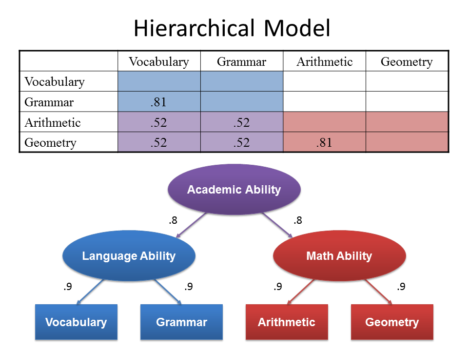

# Factor Analysis {#fa}

**Example 1**

An investigator has asked each respondent in a survey whether he or she strongly agrees, agrees, is undecided, disagrees, or strongly disagrees with 15 statements concerning attitudes toward inflation. 

As a first step, the investigator will do a factor analysis on the resulting data to determine which statements belong together in sets that are uncorrelated with other sets. 

The particular statements that form a single set will be examined to obtain a better understanding of attitudes toward inflation. Scores derived from each set or factor will be used in subsequent analysis to predict consumer spending.


**Example 2** 

There are Fifty test questions

* Each is a function of 3 factors: 
* Verbal, quantitative, analytical skills

You are interested in measuring the gain in analytical skills over the course of a week after doing some task. 

## Latent Constructs

Latent variables are ones that cannot be measured directly; e.g. Depression, Anxiety, Mathematical ability. 
They drive how we would respond to various tasks and questions that _can_ be measured; vocabulary, arithmetic, statistical reasoning. 



How can the correlation in responses to questions help us measure these latent constructs? 

> Factor Analysis aims to

* Generalize of principal components analysis
* Explain interrelationships among a set of variables
* Where we select a small number of factors to convey essential information
* Can perform additional analyses to improve interpretation


## Factor Model

* Start with P **standardized** variables. That is $\frac{(x_{i}-\bar{x})}{s_{i}}$. 
    - So for the rest of these FA notes, understand that each $X$ written has already been standardized. 
* Express each variable as (its own) linear combination of $m$ common factors plus a unique factor $e$. 
* $m << P$. Ideally $m$ is known in advance

\[ 
X_{1} = l_{11}F_{1} + l_{12}F_{2} + \ldots + l_{1m}F_{m} + e_{1} \\
X_{2} = l_{21}F_{1} + l_{22}F_{2} + \ldots + l_{2m}F_{m} + e_{1} \\
\vdots  \\
X_{P} = l_{P1}F_{1} + l_{P2}F_{2} + \ldots + l_{Pm}F_{m} + e_{P}
\]


* $X_{i}    = \sum l_{ij} F_{j}+ \epsilon_{i}$
* $F_{j}$ 	= common or latent factors 
* $e_{i}$ 	= unique factors
* $l_{ij}$ 	= coefficients of common factors 	= factor loadings


* Each $F_{j}$ has mean 0 and variance 1
* $F_{j}$’s are uncorrelated
* $e_{i}’s and $F_{j}$’s are uncorrelated

> How does this compare to the equations for Principal Components? 

### Comparison with PCA
* Similar in that no dependent variable
* PCA: 
    - Select a number of components that explain as much of the total variance as possible. 
* FA: Factors selected mainly to explain the interrelationships among the original variables.
    - Ideally, the number of factors expected is known in advance. 
    - Major emphasis is placed on obtaining easily understandable factors that convey the 
      essential information contained in the original set of variables.
    


* Mirror image of PCA
    - Each PC is expressed as a linear combination of X's
    - Each $X$ is expressed as a linear combination of Factors


### Implications

* Variance of any orginal $X$ is composed of
    - **communality**: part due to common factors
    - **specificity**: part due to a unique factor
    - = 1 when $X$'s are standardized. 
    
\[    
V(X_{i}) = communality + specificity \\
\qquad   = h^{2}_{i} + u^{2}_{i} 
\]

### Two big steps

1. Initial factor extraction: estimate loadings and communalities
2. Factor "rotations" to improve interpretation


```{block2, type='rmdnote'}
Pause here and look at the [hypothetical example setup][fa-example]
```


## Factor Extraction{#fa-extract}

Methods

1. PC Factor Model
2. Iterated PC Factor Model
3. Maximum Likelihood

Notice that the most common method for initial extraction of common factors is _principle components analysis_. 

* Choose the first $m$ principal components and modify them to fit the factor model defined in the previous section. 
* They explain the greatest proportion of the variance and are therefore the most important

### PC Factor Model

Recall that $\mathbf{C} = \mathbf{A}\mathbf{X}$,  C's are a function of X

$$ X_{1} = a_{11}C_{1} + a_{12}C_{2} + \ldots + a_{1P}C_{p} $$

We want the reverse: X's are a function of F's. 

* Use the inverse! --> If $c = 5x$ then $x = 5^{-1}C$

The inverse PC model is $\mathbf{X} = \mathbf{A}^{-1}\mathbf{C}$. 

Since $\mathbf{A}$ is orthogonal, $\mathbf{A}^{-1} = \mathbf{A}^{T} = \mathbf{A}^{'}$, so

$$ X_{1} = a_{11}C_{1} + a_{21}C_{2} + \ldots + a_{P1}C_{p} $$

But there are more PC's than Factors...

$$
\begin{equation}
\begin{aligned}
X_{i} &=  \sum_{j=1}^{P}a_{ji}C_{j} \\
&= \sum_{j=1}^{m}a_{ji}C_{j} + \sum_{j=m+1}^{m}a_{ji}C_{j} \\
&= \sum_{j=1}^{m}l_{ji}F_{j} + e_{i} \\
\end{aligned}
\end{equation}
$$

**Adjustment**

* $V(C_{j}) = \lambda_{j}$ not 1
* We transform: $F_{j} = C_{j}\lambda_{j}^{-1/2}$
* Now $V(F_{j}) = 1$
* Loadings: $l_{ij} = \lambda_{j}^{1/2}a_{ji}$

```{block2, type='rmdnote'}
$l_{ij}$ is the correlation coefficient between variable $i$ and factor $j$
```


## Fake example setup {#fa-example}

Generate 100 data points from the following multivariate normal distribution: 

$$\mathbf{\mu} = 
  \left(\begin{array}
  {r}
  0.163 \\
  0.142 \\
  0.098 \\
  -0.039 \\
  -0.013
  \end{array}\right), 
  \mathbf{\Sigma} = 
  \left(\begin{array}
  {cc}
  1     &       &   &   &     &  \\
  0.757 & 1     &   &   &     &  \\
  0.047 & 0.054 & 1 &   &     &  \\
  0.155 & 0.176 & 0.531 & 1   &  \\
  0.279 & 0.322 & 0.521 & 0.942 & 1
  \end{array}\right)
$$. 


```{r}
set.seed(456)
m <- c(0.163, 0.142, 0.098, -0.039, -0.013)
s <- matrix(c(1.000, 0.757, 0.047, 0.155, 0.279, 
              0.757, 1.000, 0.054, 0.176, 0.322, 
              0.047, 0.054, 1.000, 0.531, 0.521, 
              0.155, 0.176, 0.531, 1.000, 0.942, 
              0.279, 0.322, 0.521, 0.942, 1.000), 
            nrow=5)
data <- data.frame(MASS::mvrnorm(n=100, mu=m, Sigma=s))
colnames(data) <- paste0("X", 1:5)
```

The hypothetical data model is that these 5 variables are generated from 2 underlying factors. 

$$
\begin{equation}
\begin{aligned}
X_{1} &=  (1)*F_{1} +    (0)*F_{2} + e_{1} \\
X_{2} &=  (1)*F_{1} +    (0)*F_{2} + e_{2} \\
X_{3} &=  (0)*F_{1} +   (.5)*F_{2} + e_{3} \\
X_{4} &=  (0)*F_{1} + (1.5)*F_{2} + e_{4} \\
X_{5} &=  (0)*F_{1} +    (2)*F_{2} + e_{5} \\
\end{aligned}
\end{equation}
$$


**Implications**

* $F_{1}, F_{2}$ and all $e_{i}$'s are independent normal variables
* The first two $X$'s are inter-correlated, and the last 3 $X$'s are inter-correlated
* The frist 2 $X$'s are NOT correlated with the last 3 $X$'s

Back to ref(@fa-extract)

## Additional Resources

* [A gentle non-technical introduction to factor analysis](https://assessingpsyche.wordpress.com/2014/01/13/a-gentle-non-technical-introduction-to-factor-analysis/)


