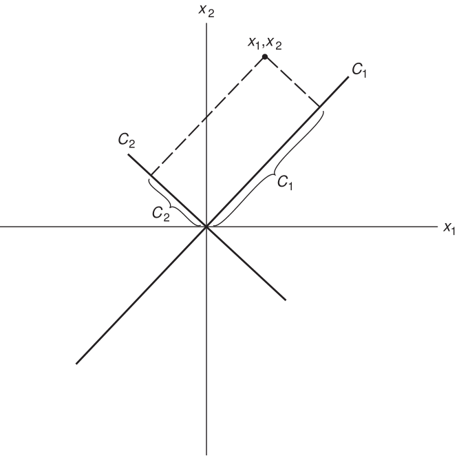
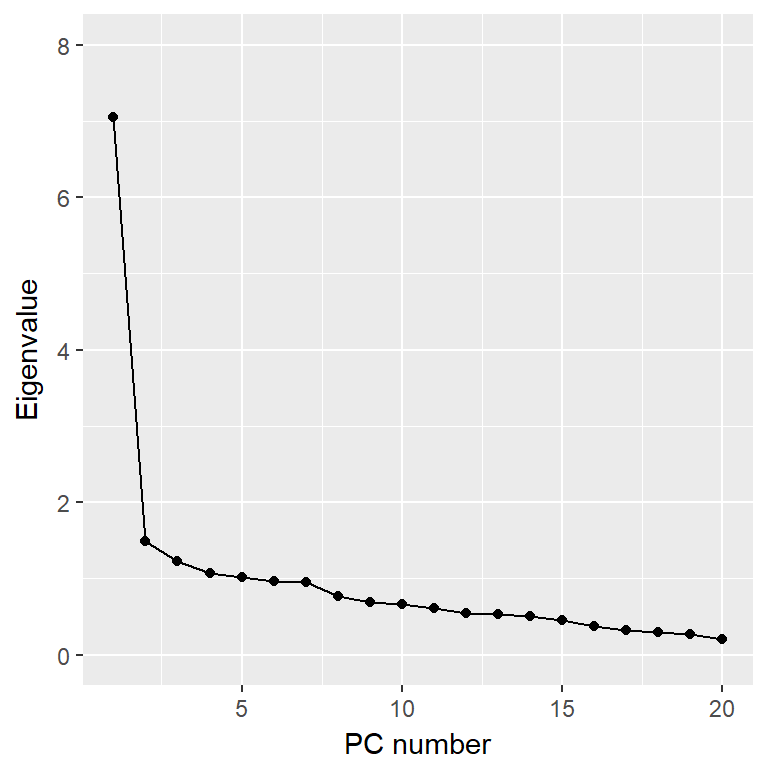
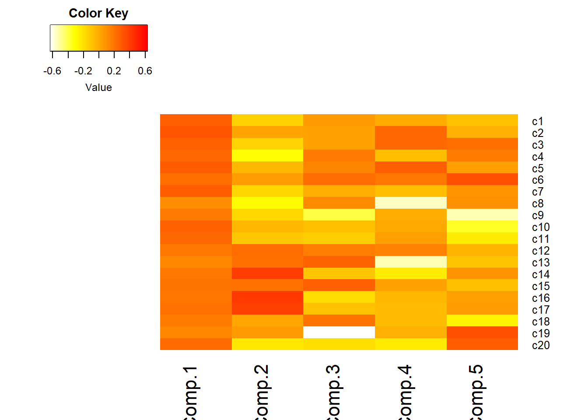

# Multivariate Analysis {#mvmodels}

There is an important distinction between _multivariable_ and _multivariate_ models. 

* _multivariable_ : Multiple predictor variables ($\mathbf{x}$). 
* _multivariate_: Multiple response variables ($mathbf{Y}$). 

Often analysts will misuse  _multivaraite_  when they really  mean _multivariable_. 

We will discuss two different, but related techniques: Principal Component Analysis and Factor Analysis. 

Multivariate techniques are

* Primarily used as an exploratory technique
* Restructure interrelated variables
* Simplify description
* Reduce dimensionality
* Avoid multicollinearity problems in regression


## Principal Component Analysis

More nomenclature tidbits: It's **"Principal"** Components (adjective), not **"Principle"** Components (noun)

From [Grammerist](http://grammarist.com/spelling/principle-principal/): 

> As a noun, principal refers to 
  (1) one who holds a presiding position or rank, and 
  (2) capital or property before interest, 
  and it's also an adjective meaning 
  (3) first or most important in rank 
> 
> Principle is only a noun. In its primary sense, it refers to a basic truth, law, assumption, or rule.

This third definition (3) is the context in which we will be using this term. 

### Not variable selection

Principal Components Analysis (PCA) differs from variable selection in two ways:

1. No dependent variable exists
2. Variables are not eliminated but rather summary variables, i.e., principal components, are computed from all of the original variables. 

We are trying to understand a phenomenon by collecting a series of component measurements, but the underlying mechanics is complex and not easily understood by simply looking at each component individually. The data could be redundant and high levels of multicolinearity may be present. 


### Basic Idea

Consider a hypothetical data set that consists of 100 random pairs of observations $X_{1}$ and $X_{2}$ that are correlated. Let $X_{1} \sim \mathcal{N}(100, 100)$, $X_{2} \sim \mathcal{N}(50, 50)$, with $\rho_{12} = \frac{1}{\sqrt{2}}$. 

In matrix notation this is written as: $\mathbf{X} \sim \mathcal{N}\left(\mathbf{\mu}, \mathbf{\Sigma}\right)$ where 
$$\mathbf{\mu} = 
  \left(\begin{array}
  {r}
  \mu_{1} \\
  \mu_{2}
  \end{array}\right), 
  \mathbf{\Sigma} = 
  \left(\begin{array}
  {cc}
  \sigma_{1}^{2} & \rho_{12}\sigma_{x}\sigma_{y} \\
  \rho_{12}\sigma_{x}\sigma_{y} & \sigma_{2}^{2} 
  \end{array}\right)
$$. 


```r
set.seed(456)
m <- c(100, 50)
s <- matrix(c(100, sqrt(.5*100*50), sqrt(.5*100*50), 50), nrow=2)
data <- data.frame(MASS::mvrnorm(n=100, mu=m, Sigma=s))
colnames(data) <- c("X1", "X2")

plot(X2 ~ X1, data=data, pch=16)
```


Goal: Create two new variables $C_{1}$ and $C_{2}$ as linear combinations of $\mathbf{x_{1}}$ and $\mathbf{x_{2}}$ 

$$ \mathbf{C_{1}} = a_{11}\mathbf{x_{1}} + a_{12}\mathbf{x_{2}} $$
$$ \mathbf{C_{2}} = a_{21}\mathbf{x_{1}} + a_{22}\mathbf{x_{2}} $$

or more simply $\mathbf{C = aX}$, where

* The $\mathbf{x}$'s have been centered by subtracting their mean ($\mathbf{x_{1}} = x_{1}-\bar{x_{1}}$)
* $Var(C_{1})$ is as large as possible 

Graphically we're creating two new axes, where now $C_{1}$ and $C_{2}$ are uncorrelated.

> PCA is mathematically defined as an orthogonal linear transformation that transforms the data to a new coordinate system such that the greatest variance by some projection of the data comes to lie on the first coordinate (called the first principal component), the second greatest variance on the second coordinate, and so on.  [Wikipedia](https://en.wikipedia.org/wiki/Principal_component_analysis)





### More Generally

We want

* From $P$ original variables $X_{1}, \ldots , X_{P}$ get $P$ principal components $C_{1}, \ldots , C_{P}$
* Where each $C_{j}$ is a linear combination of the $X_{i}$'s: $C_{j} = a_{j1}X_{1} + a_{j2}X_{2} + \ldots + a_{jP}X_{P}$
* The coefficients are chosen such that $Var(C_{1}) \geq Var(C_{2}) \geq \ldots \geq Var(C_{P})$
    - Variance is a measure of information. Consider modeling prostate cancer. 
        * Gender has 0 variance. No information.
        * Size of tumor: the variance is > 0, it provides useful information. 
* Any two PC's are uncorrelated: $Cov(C_{i}, C_{j})=0, \quad \forall i \neq j$

We have

$$
  \left[\begin{array}
  {r}
  C_{1} \\
  C_{2} \\
  \vdots \\
  C_{P}
  \end{array}\right] 
  = 
  \left[\begin{array}
  {cccc}
  a_{11} & a_{12} & \ldots & a_{1P} \\
  a_{21} & a_{22} & \ldots & a_{2P} \\
  \vdots & \vdots & \ddots & \vdots \\
  a_{P1} & a_{P2} & \ldots & a_{PP} 
  \end{array}\right]
  \left[\begin{array}
  {r}
  X_{1} \\
  X_{2} \\
  \vdots \\
  X_{P}
  \end{array}\right] 
$$


* Hotelling (1933) showed that the $a_{ij}$'s are solutions to $(\mathbf{\Sigma} -\lambda\mathbf{I})\mathbf{a}=\mathbf{0}$. 
    - $\mathbf{\Sigma}$ is the variance-covariance matrix of the $\mathbf{X}$ variables.  
* This means $\lambda$ is an eigenvalue and $\mathbf{a}$ an eigenvector.
* Problem: There are infinite number of possible $\mathbf{a}$'s
* Solution: Choose $a_{ij}$'s such that the sum of the squares of the coefficients for any one
  eigenvector is = 1. 
    - $P$ unique eigenvalues and $P$ corresponding eigenvectors. 

So, 

* Principal components are the eigenvectors $\mathbf{a_{p}}$
* and their variances are the eigenvalues of the covariance matrix $\mathbf{\Sigma}$ of the $X$'s.
* Variances of the $C_{j}$'s add up to the sum of the variances of the original variables (total variance).

### Calculating C

Calculating the principal components in R can be done using a call to the function `prcomp()`.  [STHDA](http://www.sthda.com/english/articles/31-principal-component-methods-in-r-practical-guide/118-principal-component-analysis-in-r-prcomp-vs-princomp/) has a good overview of the difference between `prcomp()` and `princomp()`. 

```r
pr <- princomp(data)
summary(pr)
```

```
## Importance of components:
##                            Comp.1    Comp.2
## Standard deviation     11.4019265 4.2236767
## Proportion of Variance  0.8793355 0.1206645
## Cumulative Proportion   0.8793355 1.0000000
```

* The summary output above shows the first PC (`Comp.1`) explains the highest proportion of variance. 
* The values for the matrix $\mathbf{A}$ is contained in `pr$loadings`. 

```r
pr$loadings
```

```
## 
## Loadings:
##    Comp.1 Comp.2
## X1 -0.854  0.519
## X2 -0.519 -0.854
## 
##                Comp.1 Comp.2
## SS loadings       1.0    1.0
## Proportion Var    0.5    0.5
## Cumulative Var    0.5    1.0
```

To visualize these new axes, we plot the centered data. 

```r
a <- pr$loadings
x1 <- with(data, X1 - mean(X1))
x2 <- with(data, X2 - mean(X2))

plot(c(-40, 40), c(-20, 20), type="n",xlab="x1", ylab="x2")
points(x=x1, y=x2, pch=16)
abline(0, a[2,1]/a[1,1]); text(30, 10, expression(C[1]))
abline(0, a[2,2]/a[1,2]); text(-10, 20, expression(C[2]))
```


Plot the original data on the new axes we see that PC1 and PC2 are uncorrelated. The red vectors show you where the original coordinates were at. 


```r
biplot(pr)
```


### Using the correlation matrix

* Standardizing: Take $X$ and divide each element by $\sigma_{x}$. 
    - $Z = X/\sigma_{X}$
* Side note: Standardizing and centering == normalizing
    - $Z = (X-\bar{X})/\sigma_{X}$
* Equivalent to analyzing the correlation matrix ($\mathbf{R}$) instead of covariance matrix ($\mathbf{\Sigma}$).

\BeginKnitrBlock{rmdwarning}<div class="rmdwarning">Using $\mathbf{R}$ and $\mathbf{\Sigma}$ will generate different PC's</div>\EndKnitrBlock{rmdwarning}

This makes sense given the difference in matricies: 


```r
cov(data) #Covariance Matrix
```

```
##           X1       X2
## X1 100.74146 50.29187
## X2  50.29187 48.59528
```

```r
cor(data) #Correlation Matrix
```

```
##           X1        X2
## X1 1.0000000 0.7187811
## X2 0.7187811 1.0000000
```

Standardizing your data prior to analysis aids the interpretation of the PC's in a few ways

1. The total variance is the number of variables $P$
2. The proportion explained by each PC is the corresponding eigenvalue / $P$
3. The correlation between $C_{i}$ and standardized variable $x_{j}$ can be written as $r_{ij} = a_{ij}SD(C_{i})$

This last point means that for any given $C_{i}$ we can quantify the relative degree of dependence of the PC on each of the standardized variables. This is a.k.a. the **factor loading** (we will return to this key term later).

To calculate the principal components using the correlation matrix, you just need to specify that you want `cor=TRUE`. 


```r
pr_corr <- princomp(data, cor=TRUE)
summary(pr_corr)
```

```
## Importance of components:
##                           Comp.1    Comp.2
## Standard deviation     1.3110229 0.5303008
## Proportion of Variance 0.8593906 0.1406094
## Cumulative Proportion  0.8593906 1.0000000
```

* If we use the covariance matrix and change the scale of a variable (i.e. in to cm) that will change the results of the PC's
* Many researchers prefer to use the correlation matrix
    - It compensates for the units of measurements for the different variables. 
    - Interpretations are made in terms of the standardized variables. 

### Data Reduction

* Keep first $m$ principal components as representatives of original P variables
* Keep enough to explain a large percentage of original total variance.
* Ideally you want a small number of PC's that explain a large percentage of the total variance. 

**Choosing $m$**

* Rely on existing theory 
* Explain a given % of variance (cumulative percentage plot)
* All eigenvalues > 1 (Scree plot)
* Elbow rule (Scree Plot)

These last two will be best explained using an example. 


### Example Analysis of depression 

This example follows _Analysis of depression data set_ section in PMA5 Section 14.5. This survey asks 20 questions on emotional states that relate to depression. Here I use PCA to reduce these 20 correlated variables down to a few uncorrelated variables that explain the most variance. 

#### Read in the data and run `princomp` on the `C1:C20` variables. 

```r
depress <- read.delim("https://norcalbiostat.netlify.com/data/depress_081217.txt", header=TRUE)
pc_dep  <- princomp(depress[,9:28], cor=TRUE)
summary(pc_dep)
```

```
## Importance of components:
##                           Comp.1     Comp.2     Comp.3     Comp.4
## Standard deviation     2.6562036 1.21883931 1.10973409 1.03232021
## Proportion of Variance 0.3527709 0.07427846 0.06157549 0.05328425
## Cumulative Proportion  0.3527709 0.42704935 0.48862483 0.54190909
##                            Comp.5     Comp.6     Comp.7     Comp.8
## Standard deviation     1.00629648 0.98359581 0.97304489 0.87706188
## Proportion of Variance 0.05063163 0.04837304 0.04734082 0.03846188
## Cumulative Proportion  0.59254072 0.64091375 0.68825457 0.72671645
##                            Comp.9    Comp.10    Comp.11    Comp.12
## Standard deviation     0.83344885 0.81248191 0.77950975 0.74117295
## Proportion of Variance 0.03473185 0.03300634 0.03038177 0.02746687
## Cumulative Proportion  0.76144830 0.79445464 0.82483641 0.85230328
##                           Comp.13    Comp.14    Comp.15    Comp.16
## Standard deviation     0.73255278 0.71324438 0.67149280 0.61252016
## Proportion of Variance 0.02683168 0.02543588 0.02254513 0.01875905
## Cumulative Proportion  0.87913496 0.90457083 0.92711596 0.94587501
##                           Comp.17    Comp.18    Comp.19     Comp.20
## Standard deviation     0.56673129 0.54273638 0.51804873 0.445396635
## Proportion of Variance 0.01605922 0.01472814 0.01341872 0.009918908
## Cumulative Proportion  0.96193423 0.97666237 0.99008109 1.000000000
```

#### Pick a subset of PC's to work with

In the cumulative percentage plot below, I drew a horizontal line at 80%. So the first 9 PC's explain around 75% of the total variance, and the first 10 can explain around 80%. 


```r
library(ggplot2)
qplot(x=1:20, y=cumsum((pc_dep$sdev)^2/20)*100, geom="point") + 
  xlab("PC number") + ylab("Cumulative %") + ylim(c(0,100)) +
  geom_hline(aes(yintercept=80))
```


Create a **Scree plot** by plotting the eigenvalue against the PC number.


```r
qplot(x=1:20, y=(pc_dep$sdev)^2, geom=c("point", "line")) + 
  xlab("PC number") + ylab("Eigenvalue") + ylim(c(0,8))
```



**Option 1**: Take all eigenvalues > 1 ($m=5$)
**Option 2**: Use a cutoff point where the lines joining consecutive points are steep to the left of the cutoff point and flat right of the cutoff point. Point where the two slopes meet is the elbow. ($m=2$). 

#### Examine the loadings


```r
pc_dep$loadings[1:3,1:5]
```

```
##       Comp.1      Comp.2     Comp.3       Comp.4      Comp.5
## c1 0.2774384 -0.14497938 0.05770239 -0.002723687 -0.08826773
## c2 0.3131829  0.02713557 0.03162990  0.247811083 -0.02439748
## c3 0.2677985 -0.15471968 0.03459037  0.247246879  0.21830547
```

Here

* $X_{1}$ = _"I felt that I could not shake..."_
* $X_{2}$ = _"I felt depressed..."_

So the PC's are calculated as

* $C_{1} = 0.277x_{1} + 0.313x_{2} + \ldots $
* $C_{2} = -0.1449x_{1} + 0.0271x_{2} + \ldots $

etc...

#### Interpret the PC's

1. Visualize the loadings using `heatmap.2()` in the `gplots` package. 
    - I reversed the colors so that red was high positive correlation and yellow/white is low. 
    - half the options I use below come from [this SO post](https://stackoverflow.com/questions/11713563/heatmap-color-key-with-five-different-colors). I had no idea what they did, so I took what the solution showed, and played with it (added/changed some to see what they did), and reviewed `?heatmap.2` to see what options were available. 

```r
library(gplots)
```

```
## 
## Attaching package: 'gplots'
```

```
## The following object is masked from 'package:stats':
## 
##     lowess
```

```r
heatmap.2(pc_dep$loadings[,1:5], scale="none", Rowv=NA, Colv=NA, density.info="none",
          dendrogram="none", trace="none", col=rev(heat.colors(256)))
```



2. Loadings over 0.5 (red) help us interpret what these components could "mean"
    - Must know exact wording of component questions
    
* $C_{1}{$: a weighted average of most items. High value indicates respondent had many symptoms of depression. Note sign of loadings are all positive and all roughly the same color. 
    - Recall 
* $C_{2}$: lethargy (high energetic). High loading on c14, 16, 17, low on 4, 8, 20
* $C_{3}$: friendliness of others. Large negative loading on c19, c9

etc. 

### Use in Multiple Regression
* Choose a handful of few principal components to use as predictors in a regression model 
    - Leads to more stable regression estimates.
* Alternative to variable selection
    - Ex: several measures of behavior. 
    - Use PC$_{1}$ or PC$_{1}$ and PC$_{2}$ as summary measures of all.

### Things to watch out for
* Eigenvalues are estimated variances of the PC's and so are subject to large sample variations. 
* The size of variance of last few principal components can be useful as indicator of multicollinearity among original variables
* Principal components derived from standardized variables differ from those derived from original variables
* Important that measurements are accurate, especially for detection of collinearity

\BeginKnitrBlock{rmdcaution}<div class="rmdcaution">Arbitrary cutoff points should not be taken too seriously</div>\EndKnitrBlock{rmdcaution}


## Factor Analysis 

PCA and FA are two similar techniques, sometimes used for similar purposes. However the underlying theory behind each is very different. 


