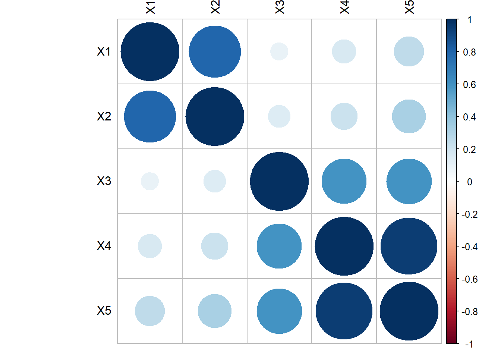
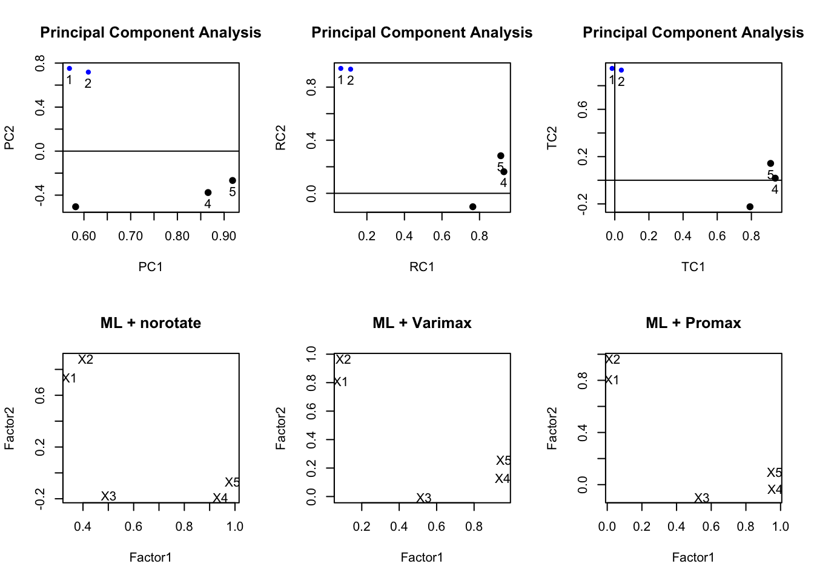
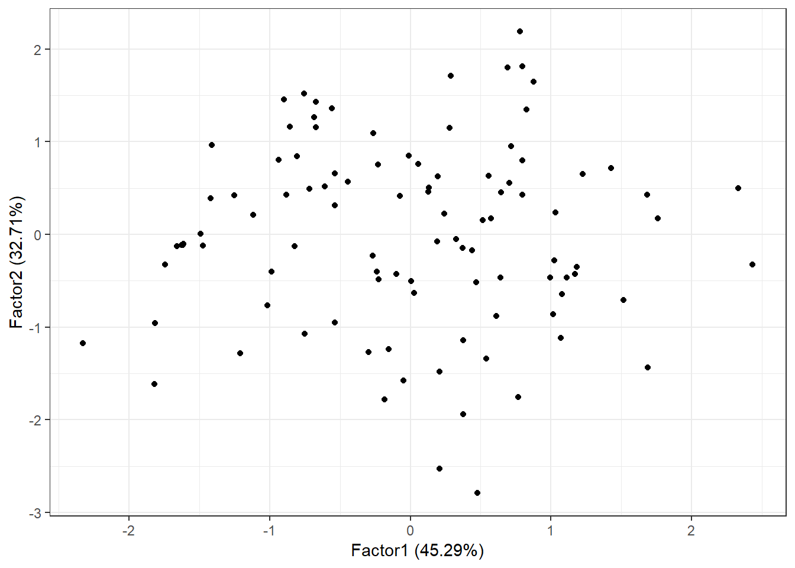

# Factor Analysis {#fa}


Observed events tend to co-occur for a reason. Consider physical symptoms such as a fever, cough, sore through etc. These are often observed characteristics of an underlying event such as a viral infection. Now, not all individuals express the same symptoms, or event the same severity of symptoms, but we would say that there is a strong correlation between symptoms and underlying disease.  

Factor analysis aims to understand the patterns of correlations between the underlying disease, and observed symptoms. 

## Introduction

This intro comes from [A gentle non-technical introduction to factor analysis](https://assessingpsyche.wordpress.com/2014/01/13/a-gentle-non-technical-introduction-to-factor-analysis/)


No attempt will be made to present a comprehensive treatment of this subject. For more detail see the references mentioned in PMA6 Chapter 15.2 and the links in the [Additional Resources](#help) section for more information. 


### Latent Constructs

Latent variables are ones that cannot be measured directly; e.g. Depression, Anxiety, Mathematical ability. They drive how we would respond to various tasks and questions that _can_ be measured; vocabulary, arithmetic, statistical reasoning. 


Factor Analysis aims to

* Generalize of principal components analysis
* Explain interrelationships among a set of variables
* Where we select a small number of factors to convey essential information
* Can perform additional analyses to improve interpretation


### Comparison with PCA
* Similar in that no dependent variable
* PCA: 
    - Select a number of components that explain as much of the total variance as possible. 
* FA: Factors selected mainly to explain the interrelationships among the original variables.
    - Ideally, the number of factors expected is known in advance. 
    - Major emphasis is placed on obtaining easily understandable factors that convey the 
      essential information contained in the original set of variables.
    


* Mirror image of PCA
    - Each PC is expressed as a linear combination of X's
    - Each $X$ is expressed as a linear combination of Factors


### EFA vs CFA

**Exploratory Factor Analysis**

* Explore the possible underlying factor structure of a set of observed variables
* Does not impose a preconceived structure on the outcome. 


**Confirmatory Factor Analysis**

* Verifies the theoretical factor structure of a set of observed variables
* Test the relationship between observed variables and theoretical underlying latent constructs
* Variable groupings are determined ahead of time. 


## Factor Model

* Start with P **standardized** variables. That is $\frac{(x_{i}-\bar{x})}{s_{i}}$. 
    - So for the rest of these FA notes, understand that each $X$ written has already been standardized. 
* Express each variable as (its own) linear combination of $m$ common factors plus a unique factor $e$. 

\[ 
X_{1} = l_{11}F_{1} + l_{12}F_{2} + \ldots + l_{1m}F_{m} + e_{1} \\
X_{2} = l_{21}F_{1} + l_{22}F_{2} + \ldots + l_{2m}F_{m} + e_{1} \\
\vdots  \\
X_{P} = l_{P1}F_{1} + l_{P2}F_{2} + \ldots + l_{Pm}F_{m} + e_{P}
\]

* $m$ is the number of common factors, typicall $m << P$. Somemtimes, $m$ is known in advance. 
* $X_{i}    = \sum l_{ij} F_{j}+ \epsilon_{i}$
* $F_{j}$ 	= common or latent factors. 
    - They are uncorreclated and each having mean 0 and variance 1
* $l_{ij}$ 	= coefficients of common factors 	= factor loadings
* $e_{i}$ 	= unique factors relating to one of the original variables. 
    - $e_{i}$’s and $F_{j}$’s are uncorrelated


### Components of Variance

Recall that $x_{i}$ is standardized, so $Var(X)=1$. 

Since each response variable $x_{i}$ is broken into two parts, so is the variance. 

* **communality**: part due to common factors. Denoted as $h^{2}_{i}$.
* **specificity**: part due to a unique factor. Denoted as $u^{2}_{i}$.

    
\[    
V(X_{i}) = h^{2}_{i} + u^{2}_{i} 
\]


\BeginKnitrBlock{rmdnote}<div class="rmdnote">If the number $m$ of common factors is not known (EFA), it is recommended that you start with the default option available in the softare program. Often this is the number of factors with eigenvalues greater than 1. 

Since the results are highly dependent on $m$, you should always try several factors to gain further insight into the data. </div>\EndKnitrBlock{rmdnote}


### Two big steps

1. The first step is to numerical find estimates of the loadings $l_{ij}$, and the communalities $h^{2}_{i}$. 
This process is called _initial factor extraction_. There are a number of methods to solve, we will explore three: principal components, iterated components, and maximum likelihood. The mathematical details of each are left in the textbook for interested readers. 

2. The second step is to obtain a new set of factors, called _rotated factors_ which is done to improve interpretation. 

We will first explore these steps using simulated data. 

## Example data setup {#fa-example}

Generate 100 data points from the following multivariate normal distribution: 

$$\mathbf{\mu} = 
  \left(\begin{array}
  {r}
  0.163 \\
  0.142 \\
  0.098 \\
  -0.039 \\
  -0.013
  \end{array}\right), 
  \mathbf{\Sigma} = 
  \left(\begin{array}
  {cc}
  1     &       &   &   &     &  \\
  0.757 & 1     &   &   &     &  \\
  0.047 & 0.054 & 1 &   &     &  \\
  0.155 & 0.176 & 0.531 & 1   &  \\
  0.279 & 0.322 & 0.521 & 0.942 & 1
  \end{array}\right)
$$. 


```r
set.seed(456)
m <- c(0.163, 0.142, 0.098, -0.039, -0.013)
s <- matrix(c(1.000, 0.757, 0.047, 0.155, 0.279, 
              0.757, 1.000, 0.054, 0.176, 0.322, 
              0.047, 0.054, 1.000, 0.531, 0.521, 
              0.155, 0.176, 0.531, 1.000, 0.942, 
              0.279, 0.322, 0.521, 0.942, 1.000), 
            nrow=5)
data <- data.frame(MASS::mvrnorm(n=100, mu=m, Sigma=s))
colnames(data) <- paste0("X", 1:5)
```

Standardize the $X$'s. 


```r
stan.dta <- as.data.frame(scale(data))
```

The hypothetical data model is that these 5 variables are generated from 2 underlying factors. 

$$
\begin{equation}
\begin{aligned}
X_{1} &=  (1)*F_{1} +    (0)*F_{2} + e_{1} \\
X_{2} &=  (1)*F_{1} +    (0)*F_{2} + e_{2} \\
X_{3} &=  (0)*F_{1} +   (.5)*F_{2} + e_{3} \\
X_{4} &=  (0)*F_{1} + (1.5)*F_{2} + e_{4} \\
X_{5} &=  (0)*F_{1} +    (2)*F_{2} + e_{5} \\
\end{aligned}
\end{equation}
$$

**Implications**

* $F_{1}, F_{2}$ and all $e_{i}$'s are independent normal variables
* The first two $X$'s are inter-correlated, and the last 3 $X$'s are inter-correlated
* The first 2 $X$'s are NOT correlated with the last 3 $X$'s


```r
#library(corrplot)
corrplot(cor(stan.dta), tl.col="black")
```



## Factor Extraction Methods {#fa-extract}

Methods

1. Principal Components
2. Iterated Components
3. Maximum Likelihood


### Principal components (PC Factor model)

Recall that $\mathbf{C} = \mathbf{A}\mathbf{X}$,  C's are a function of X

$$ C_{1} = a_{11}X_{1} + a_{12}X_{2} + \ldots + a_{1P}X_{p} $$

We want the reverse: X's are a function of F's. 

* Use the inverse! --> If $c = 5x$ then $x = 5^{-1}C$

The inverse PC model is $\mathbf{X} = \mathbf{A}^{-1}\mathbf{C}$. 

Since $\mathbf{A}$ is orthogonal, $\mathbf{A}^{-1} = \mathbf{A}^{T} = \mathbf{A}^{'}$, so

$$ X_{1} = a_{11}C_{1} + a_{21}C_{2} + \ldots + a_{P1}C_{p} $$

But there are more PC's than Factors...

$$
\begin{equation}
\begin{aligned}
X_{i} &=  \sum_{j=1}^{P}a_{ji}C_{j} \\
&= \sum_{j=1}^{m}a_{ji}C_{j} + \sum_{j=m+1}^{m}a_{ji}C_{j} \\
&= \sum_{j=1}^{m}l_{ji}F_{j} + e_{i} \\
\end{aligned}
\end{equation}
$$

**Adjustment**

* $V(C_{j}) = \lambda_{j}$ not 1
* We transform: $F_{j} = C_{j}\lambda_{j}^{-1/2}$
* Now $V(F_{j}) = 1$
* Loadings: $l_{ij} = \lambda_{j}^{1/2}a_{ji}$

\BeginKnitrBlock{rmdnote}<div class="rmdnote">$l_{ij}$ is the correlation coefficient between variable $i$ and factor $j$</div>\EndKnitrBlock{rmdnote}

This is similar to $a_{ij}$ in PCA. 


#### R code


Factor extraction via principal components can be done using the `principal` function in the `psych` package. We choose `nfactors=2` here because we know there are 2 underlying factors in the data generation model. 


```r
#library(psych)
pc.extract.norotate <- principal(stan.dta, nfactors=2, rotate="none")
print(pc.extract.norotate)
## Principal Components Analysis
## Call: principal(r = stan.dta, nfactors = 2, rotate = "none")
## Standardized loadings (pattern matrix) based upon correlation matrix
##     PC1   PC2   h2    u2 com
## X1 0.53  0.78 0.90 0.104 1.8
## X2 0.59  0.74 0.89 0.106 1.9
## X3 0.70 -0.39 0.64 0.360 1.6
## X4 0.87 -0.38 0.90 0.099 1.4
## X5 0.92 -0.27 0.91 0.087 1.2
## 
##                        PC1  PC2
## SS loadings           2.71 1.53
## Proportion Var        0.54 0.31
## Cumulative Var        0.54 0.85
## Proportion Explained  0.64 0.36
## Cumulative Proportion 0.64 1.00
## 
## Mean item complexity =  1.6
## Test of the hypothesis that 2 components are sufficient.
## 
## The root mean square of the residuals (RMSR) is  0.08 
##  with the empirical chi square  12.61  with prob <  0.00038 
## 
## Fit based upon off diagonal values = 0.97
```

$$
\begin{equation}
\begin{aligned}
X_{1} &=  0.53F_{1} + 0.78F_{2} + e_{1} \\
X_{2} &=  0.59F_{1} + 0.74F_{2} + e_{2} \\
X_{3} &=  0.70F_{1} - 0.39F_{2} + e_{3} \\
X_{4} &=  0.87F_{1} - 0.38F_{2} + e_{4} \\
X_{5} &=  0.92F_{1} - 0.27F_{2} + e_{5} \\
\end{aligned}
\end{equation}
$$

These equations come from the top of the output, under _Standardized loadings_. 

### Iterated components

Select common factors to maximize the total communality

1. Get initial communality estimates
2. Use these (instead of original variances) to get the PC's and factor loadings
3. Get new communality estimates
4. Rinse and repeat
5. Stop when no appreciable changes occur. 

R code not shown, but can be obtained using the `factanal` package in R. 


### Maximum Likelihood

* Assume that all the variables are normally distributed
* Use Maximum Likelihood to estimate the parameters


#### R code 

The `cutoff` argument hides loadings under that value for ease of interpretation. Here I am setting that cutoff at 0 so that all loadings are being displayed. I encourage you to adjust this cutoff value in practice to see how it can be useful in reducing cognitave load of looking through a grid of numbers. 


```r
ml.extract.norotate <- factanal(stan.dta, factors=2, rotation="none")
print(ml.extract.norotate, digits=2, cutoff=0)
## 
## Call:
## factanal(x = stan.dta, factors = 2, rotation = "none")
## 
## Uniquenesses:
##   X1   X2   X3   X4   X5 
## 0.37 0.00 0.63 0.06 0.04 
## 
## Loadings:
##    Factor1 Factor2
## X1 -0.06    0.79  
## X2 -0.07    1.00  
## X3  0.58    0.19  
## X4  0.93    0.28  
## X5  0.90    0.39  
## 
##                Factor1 Factor2
## SS loadings       2.02    1.88
## Proportion Var    0.40    0.38
## Cumulative Var    0.40    0.78
## 
## Test of the hypothesis that 2 factors are sufficient.
## The chi square statistic is 0.2 on 1 degree of freedom.
## The p-value is 0.652
```

The factor equations now are: 

$$
\begin{equation}
\begin{aligned}
X_{1} &=  -0.06F_{1} + 0.79F_{2} + e_{1} \\
X_{2} &=  -0.07F_{1} + 1F_{2} + e_{2} \\
X_{3} &=  0.58F_{1} + 0.19F_{2} + e_{3} \\
\vdots
\end{aligned}
\end{equation}
$$


### Uniqueness

Recall Factor analysis splits the variance of the observed X's into a part due to the communality $h_{i}^{2}$ and specificity $u_{i}^{2}$. This last term is the portion of the variance that is due to the _unique_ factor. Let's look at how those differ depending on the extraction method: 


```r
pc.extract.norotate$uniquenesses
##         X1         X2         X3         X4         X5 
## 0.10356406 0.10628541 0.35980869 0.09916082 0.08669813
ml.extract.norotate$uniquenesses
##         X1         X2         X3         X4         X5 
## 0.37071467 0.00500000 0.62599425 0.06244190 0.03603453
```

Here we see that the uniqueness for X2, X4 and X5 under ML is pretty low compared to the PC extraction method, but that's almost offset by a much higher uniqueness for x1 and X3. 

Ideally we want the variance in the X's to be captured by the factors. So we want to see a low unique variance. 


### Resulting factors


```r
par(mfrow=c(1,2)) # grid of 2 columns and 1 row

pc.load <- pc.extract.norotate$loadings[,1:2]
plot(pc.load, type="n", main="PCA Extraction") # set up the plot but don't put points down
text(pc.load, labels=rownames(pc.load)) # put names instead of points

ml.load <- ml.extract.norotate$loadings[,1:2]
plot(ml.load, type="n", main="ML Extraction") 
text(ml.load, labels=rownames(ml.load))
```


PCA Extraction

* X1 and X2 load high on PC1, and low on PC1. 
* X3, 4 and 5 are negative on PC2, and moderate to high on PC1. 
* PC1 is not highly correlated with X3


ML Extraction

* Same overall split, X3 still not loading high on Factor 1. 
* X1 loading lower on Factor 2 compared to PCA extraction method. 


> Neither extraction method reproduced our true hypothetical factor model. Rotating the factors will achieve our desired results. 


## Rotating Factors

* Find new factors that are easier to interpret
* For each $X$, we want some high/large (near 1) loadings and some low/small (near zero)
* Two common rotation methods: Varimax rotation, and oblique rotation. 

Same(ish) goal as PCA, find a new set of axes to represent the factors. 


### Varimax Rotation

* Restricts the new axes to be orthogonal to each other. (Factors are independent)
* Maximizes the sum of the variances of the squared factor loadings within each factor $\sum Var(l_{ij}^{2}|F_{j})$
* Interpretations slightly less clear

Varimax rotation with principal components extraction.

```r
pc.extract.varimax <- principal(stan.dta, nfactors=2, rotate="varimax")
print(pc.extract.varimax)
## Principal Components Analysis
## Call: principal(r = stan.dta, nfactors = 2, rotate = "varimax")
## Standardized loadings (pattern matrix) based upon correlation matrix
##     RC1  RC2   h2    u2 com
## X1 0.07 0.94 0.90 0.104 1.0
## X2 0.13 0.94 0.89 0.106 1.0
## X3 0.80 0.02 0.64 0.360 1.0
## X4 0.94 0.11 0.90 0.099 1.0
## X5 0.93 0.23 0.91 0.087 1.1
## 
##                        RC1  RC2
## SS loadings           2.41 1.83
## Proportion Var        0.48 0.37
## Cumulative Var        0.48 0.85
## Proportion Explained  0.57 0.43
## Cumulative Proportion 0.57 1.00
## 
## Mean item complexity =  1
## Test of the hypothesis that 2 components are sufficient.
## 
## The root mean square of the residuals (RMSR) is  0.08 
##  with the empirical chi square  12.61  with prob <  0.00038 
## 
## Fit based upon off diagonal values = 0.97
```

Varimax rotation with maximum likelihood extraction. Here i'm using the cutoff argument to only show the values of loadings over 0.3. 

```r
ml.extract.varimax <- factanal(stan.dta, factors=2, rotation="varimax")
print(ml.extract.varimax, digits=2, cutoff=.3)
## 
## Call:
## factanal(x = stan.dta, factors = 2, rotation = "varimax")
## 
## Uniquenesses:
##   X1   X2   X3   X4   X5 
## 0.37 0.00 0.63 0.06 0.04 
## 
## Loadings:
##    Factor1 Factor2
## X1         0.79   
## X2         0.99   
## X3 0.61           
## X4 0.97           
## X5 0.96           
## 
##                Factor1 Factor2
## SS loadings       2.26    1.64
## Proportion Var    0.45    0.33
## Cumulative Var    0.45    0.78
## 
## Test of the hypothesis that 2 factors are sufficient.
## The chi square statistic is 0.2 on 1 degree of freedom.
## The p-value is 0.652
```


Communalities are unchanged after varimax (part of variance due to common factors). This will always be the case for orthogonal (perpendicular) rotations. 


### Oblique rotation

* Same idea as varimax, but drop the orthogonality requirement
* less restrictions allow for greater flexibility
* Factors are still correlated
* Better interpretation
* Methods: 
    - _quartimax_ or _quartimin_ minimizes the number of factors needed to explain each variable
    - _direct oblimin_ standard method, but results in diminished interpretability of factors
    - _promax_ is computationally faster than _direct oblimin_, so good for very large datasets


```r
pc.extract.quartimin <- principal(stan.dta, nfactors=2, rotate="quartimin")
ml.extract.promax<- factanal(stan.dta, factors=2, rotation="promax")
```


```r
par(mfrow=c(2,3))
plot(pc.extract.norotate, title="PC + norotate")
plot(pc.extract.varimax, title="PC + Varimax")
plot(pc.extract.quartimin, title="PC + quartimin")


load <- ml.extract.norotate$loadings[,1:2]
plot(load, type="n", main="ML + norotate")
text(load, labels=rownames(load))

load <- ml.extract.varimax$loadings[,1:2]
plot(load, type="n", main="ML + Varimax") 
text(load, labels=rownames(load)) 

load <- ml.extract.promax$loadings[,1:2]
plot(load, type="n", main= "ML + Promax") 
text(load, labels=rownames(load)) 
```



Varimax vs oblique here doesn't make much of a difference, and typically this is the case. You almost always use some sort of rotation. Recall, this is a hypothetical example and we set up the variables in a distinct two-factor model. So this example will look nice. 


## Factor Scores

* Can be used as dependent or independent variables in other analyses
* Each $X$ is a function of $F$'s
* **Factor Scores** are the reverse: Each $F$ is a function of the $X$'s
* Can be generated by adding the `scores="regression"` option to `factanal()`, or `scores=TRUE` in `principal()`
* Each record in the data set _with no missing data_ will have a corresponding factor score.
    - `principal()` also has a `missing` argument that if set to `TRUE` it will 
    impute missing values. 


```r
fa.ml.varimax <- factanal(stan.dta, factors=2, rotation="varimax", scores="regression")
summary(fa.ml.varimax$scores)
##     Factor1            Factor2        
##  Min.   :-2.32732   Min.   :-2.79312  
##  1st Qu.:-0.72413   1st Qu.:-0.54362  
##  Median : 0.09196   Median :-0.02376  
##  Mean   : 0.00000   Mean   : 0.00000  
##  3rd Qu.: 0.70603   3rd Qu.: 0.65339  
##  Max.   : 2.43371   Max.   : 2.18992
head(fa.ml.varimax$scores)
##          Factor1      Factor2
## [1,] -1.49174313  0.003612941
## [2,] -0.26254721  1.090864733
## [3,]  0.55516045  0.631119886
## [4,] -1.21028676 -1.281240452
## [5,] -0.04852211 -1.575691468
## [6,] -0.53768770  0.661138335
```


```r
#library(ggforitfy)
autoplot(fa.ml.varimax) # see vignette for more info. Link at bottom
```



To merge these scores back onto the original data set **providing there is no missing data** you can use the `bind_cols()` function in `dplyr`. 


```r
data.withscores <- bind_cols(data, data.frame(fa.ml.varimax$scores))
kable(head(data.withscores))
```

<table>
 <thead>
  <tr>
   <th style="text-align:right;"> X1 </th>
   <th style="text-align:right;"> X2 </th>
   <th style="text-align:right;"> X3 </th>
   <th style="text-align:right;"> X4 </th>
   <th style="text-align:right;"> X5 </th>
   <th style="text-align:right;"> Factor1 </th>
   <th style="text-align:right;"> Factor2 </th>
  </tr>
 </thead>
<tbody>
  <tr>
   <td style="text-align:right;"> -0.8236763 </td>
   <td style="text-align:right;"> -0.1210726 </td>
   <td style="text-align:right;"> -0.5970760 </td>
   <td style="text-align:right;"> -1.4752693 </td>
   <td style="text-align:right;"> -1.2355056 </td>
   <td style="text-align:right;"> -1.4917431 </td>
   <td style="text-align:right;"> 0.0036129 </td>
  </tr>
  <tr>
   <td style="text-align:right;"> 1.4013214 </td>
   <td style="text-align:right;"> 1.0733569 </td>
   <td style="text-align:right;"> 0.7681035 </td>
   <td style="text-align:right;"> -0.0509857 </td>
   <td style="text-align:right;"> 0.0180061 </td>
   <td style="text-align:right;"> -0.2625472 </td>
   <td style="text-align:right;"> 1.0908647 </td>
  </tr>
  <tr>
   <td style="text-align:right;"> 0.2781468 </td>
   <td style="text-align:right;"> 0.7574632 </td>
   <td style="text-align:right;"> 0.6445954 </td>
   <td style="text-align:right;"> 0.6765583 </td>
   <td style="text-align:right;"> 0.7532815 </td>
   <td style="text-align:right;"> 0.5551604 </td>
   <td style="text-align:right;"> 0.6311199 </td>
  </tr>
  <tr>
   <td style="text-align:right;"> 0.1819544 </td>
   <td style="text-align:right;"> -1.3228227 </td>
   <td style="text-align:right;"> -1.0847105 </td>
   <td style="text-align:right;"> -0.9574722 </td>
   <td style="text-align:right;"> -1.3719843 </td>
   <td style="text-align:right;"> -1.2102868 </td>
   <td style="text-align:right;"> -1.2812405 </td>
  </tr>
  <tr>
   <td style="text-align:right;"> -1.6147171 </td>
   <td style="text-align:right;"> -1.4254411 </td>
   <td style="text-align:right;"> 0.3519605 </td>
   <td style="text-align:right;"> -0.0124497 </td>
   <td style="text-align:right;"> -0.2523487 </td>
   <td style="text-align:right;"> -0.0485221 </td>
   <td style="text-align:right;"> -1.5756915 </td>
  </tr>
  <tr>
   <td style="text-align:right;"> 0.8251470 </td>
   <td style="text-align:right;"> 0.6245702 </td>
   <td style="text-align:right;"> -1.2923348 </td>
   <td style="text-align:right;"> -0.6345633 </td>
   <td style="text-align:right;"> -0.0885945 </td>
   <td style="text-align:right;"> -0.5376877 </td>
   <td style="text-align:right;"> 0.6611383 </td>
  </tr>
</tbody>
</table>


## What to watch out for

* Number of factors should be chosen with care. Check default options.
* There should be at least two variables with non-zero weights per factor
* If the factors are to be correlated, try oblique factor analysis
* Results usually are evaluated by reasonableness to investigator rather than by formal tests
* Motivate theory, not replace it. 
* Missing data - factors will only be created using available data. 


## Additional Resources{#help}

* [A gentle non-technical introduction to factor analysis](https://assessingpsyche.wordpress.com/2014/01/13/a-gentle-non-technical-introduction-to-factor-analysis/)
* Tutorial by a Psych 253 student at Stanford https://web.stanford.edu/class/psych253/tutorials/FactorAnalysis.html 
* `ggfortify` vignette for the `autoplot()` function https://cran.r-project.org/web/packages/ggfortify/vignettes/plot_pca.html 

The `FactomineR` looks promising, it has some helpful graphics for determining/confirming variable groupings and aiding interpretations. 

* FactominR: http://factominer.free.fr/ 
* STHDA tutorial using FactominR http://www.sthda.com/english/articles/31-principal-component-methods-in-r-practical-guide/116-mfa-multiple-factor-analysis-in-r-essentials/ 

