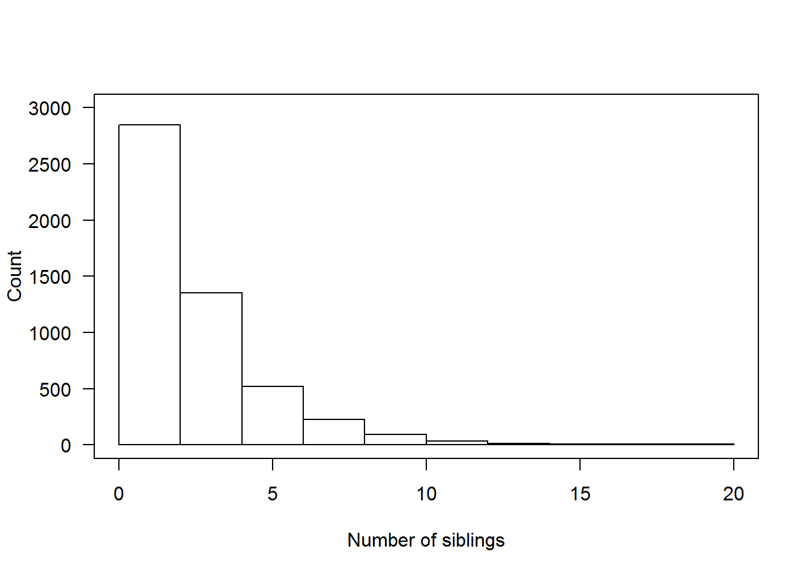

# Generalized Linear Models {#glm}


One of the primary assumptions with linear regression, is that the error terms have a specific distribution. Namely: 

$$ \epsilon_{i} \sim \mathcal{N}(0, \sigma^{2}) \qquad i=1, \ldots, n, \quad \mbox{and } \epsilon_{i} \perp \epsilon_{j}, i \neq j $$

When your outcome variable $y$ is non-continuous/non-normal, the above assumption fails dramatically. 

Generalized Linear Models (GLM) allows for different data type outcomes by allowing the linear portion of the model ($\mathbf{X}\beta$) to be related to the outcome variable $y$ using a _link_ function, that allows the magnitude of the variance of the errors ($\sigma$) to be related to the predicted values themselves. 

There are three overarching types of non-continuous outcomes that can be modeled with GLM's. 

* Binary data: Logistic or Probit regression
* Multinomial/categorical data: Multinomial or Ordinal Logistic regression. 
* Count data: Poisson regression

At this time these notes goes into depth for Logistic regression only, due to its commonplace in data analysis tools. 


## Fitting GLMs in R

Generalized linear regression models can be fit in R using the `glm()` function. This function can fit an entire _family_ of distributions and can be thought of as $E(Y|X) = C(X)$ where $C$ is the **link** function that relates $Y$ to $X$.

* Linear regression: C = Identity function (no change)
* Logistic regression: C = logit function
* Poisson regression: C = log function

The general syntax is similar to `lm()`, with the additional required `family=` argument. See `?family` for a list of options. 


```r
glm(y ~ x1 + x2 + x3, data=DATA, family="binomial")
```

## Binary Data

Goals: 

* Assess the impact selected covariates have on the probability of an outcome occurring. 
* Predict the likelihood / chance / probability of an event occurring given a certain covariate pattern.  

Binary data can be fit using a _Logistic Model_ or a _Probit Model_.


Consider an outcome variable $Y$ with two levels: Y = 1 if event, = 0 if no event. 

Let $p_{i} = P(y_{i}=1)$. 

The logistic model relates the probability of an event based on a linear combination of X's. 

$$
log\left(
\frac{p_{i}}{1-p_{i}}
\right) = \beta_{0} + \beta_{1}x_{1i} + \beta_{2}x_{2i} + \ldots + \beta_{p}x_{pi}
$$

Since the _odds_ are defined as the probability an event occurs divided by the  probability it does not occur: $(p/(1-p))$, the function $log\left(\frac{p_{i}}{1-p_{i}}\right)$ is also known as the _log odds_, or more commonly called the **_logit_**. This is the _link_ function for the logistic regression model. 


This in essence takes a binary outcome 0/1 variable, turns it into a continuous probability (which only has a range from 0 to 1) Then the logit(p) has a continuous distribution ranging from $-\infty$ to $\infty$, which is the same form as a Multiple Linear Regression (continuous outcome modeled on a set of covariates)

Back solving the logistic model for $p_{i} = e^{\beta X} / (1+e^{\beta X})$ gives us the probability of an event. 

$$
p_{i} = \frac{e^{\beta_{0} + \beta_{1}x_{1i} + \beta_{2}x_{2i} + \ldots + \beta_{p}x_{pi}}}
{1 + e^{\beta_{0} + \beta_{1}x_{1i} + \beta_{2}x_{2i} + \ldots + \beta_{p}x_{pi}}}
$$

\BeginKnitrBlock{rmdtip}<div class="rmdtip">The probit function uses the inverse CDF for the normal distribution as the link function. </div>\EndKnitrBlock{rmdtip}


### Example: The effect of gender on Depression

Is gender associated with depression? Read in the `depression` data and recode sex to be an indicator of being male. 

```r
depress <- read.delim("https://norcalbiostat.netlify.com/data/depress_081217.txt")
names(depress) <- tolower(names(depress)) # make all variable names lower case. 
```

* Binary outcome variable: Symptoms of Depression (`cases`)
* Binary predictor variable: Gender (`sex`) as an indicator of being female

The outcome $y$ is a 0/1 Bernoulli random variable. The sum of a vector of Bernoulli's ($\sum_{i=1}^{n}y_{i}$) has a Binomial distribution. When we specify that `family = "binomial"` the `glm()` function auto-assigns "logit" link function. 


```r
dep_sex_model <- glm(cases ~ sex, data=depress, family="binomial")
summary(dep_sex_model)
## 
## Call:
## glm(formula = cases ~ sex, family = "binomial", data = depress)
## 
## Deviance Residuals: 
##     Min       1Q   Median       3Q      Max  
## -0.7023  -0.7023  -0.4345  -0.4345   2.1941  
## 
## Coefficients:
##             Estimate Std. Error z value Pr(>|z|)    
## (Intercept)  -2.3125     0.3315  -6.976 3.04e-12 ***
## sex           1.0386     0.3767   2.757  0.00583 ** 
## ---
## Signif. codes:  0 '***' 0.001 '**' 0.01 '*' 0.05 '.' 0.1 ' ' 1
## 
## (Dispersion parameter for binomial family taken to be 1)
## 
##     Null deviance: 268.12  on 293  degrees of freedom
## Residual deviance: 259.40  on 292  degrees of freedom
## AIC: 263.4
## 
## Number of Fisher Scoring iterations: 5
```

We exponentiate the coefficients to back transform the $\beta$ estimates into Odds Ratios

```r
exp(coef(dep_sex_model))
## (Intercept)         sex 
##   0.0990099   2.8251748
```

Females have 2.8 times the odds of showing signs of depression compared to males. 

**Confidence Intervals**
The OR is **not** a linear function of the $x's$, but $\beta$ is. This means that a CI for the OR is created by calculating a CI for $\beta$, and then exponentiating the endpoints. A 95% CI for the OR can be calculated as: 

$$e^{\hat{\beta} \pm 1.96 SE_{\beta}} $$


```r
exp(confint(dep_sex_model))
##                  2.5 %    97.5 %
## (Intercept) 0.04843014 0.1801265
## sex         1.39911056 6.2142384
```

### Multiple Logistic Regression 
Just like multiple linear regression, additional predictors are simply included in the model using a `+` symbol. 

```r
mvmodel <- glm(cases ~ age + income + sex, data=depress, family="binomial")
summary(mvmodel)
## 
## Call:
## glm(formula = cases ~ age + income + sex, family = "binomial", 
##     data = depress)
## 
## Deviance Residuals: 
##     Min       1Q   Median       3Q      Max  
## -1.0249  -0.6524  -0.5050  -0.3179   2.5305  
## 
## Coefficients:
##             Estimate Std. Error z value Pr(>|z|)   
## (Intercept) -0.67646    0.57881  -1.169  0.24253   
## age         -0.02096    0.00904  -2.318  0.02043 * 
## income      -0.03656    0.01409  -2.595  0.00946 **
## sex          0.92945    0.38582   2.409  0.01600 * 
## ---
## Signif. codes:  0 '***' 0.001 '**' 0.01 '*' 0.05 '.' 0.1 ' ' 1
## 
## (Dispersion parameter for binomial family taken to be 1)
## 
##     Null deviance: 268.12  on 293  degrees of freedom
## Residual deviance: 247.54  on 290  degrees of freedom
## AIC: 255.54
## 
## Number of Fisher Scoring iterations: 5
```

* The sign of the $\beta$ coefficients can be interpreted in the same manner as with linear regression. 
* The odds of being depressed are less if the respondent has a higher income and is older, and higher if the respondent is female. 

### Interpretation

* The OR provides a directly understandable statistic for the relationship between $y$ and a specific $x$ given all other $x$'s in the model are fixed. 
* For a continuous variable X with slope coefficient $\beta$, the quantity $e^{b}$ is interpreted as the ratio of the odds for a person with value (X+1) relative to the odds for a person with value X. 
* $exp(kb)$ is the incremental odds ratio corresponding to an increase of $k$ units in the variable X, assuming that the values of all other X variables remain unchanged. 

**Where does $OR = e^{\beta}$ come from?**

The full model is: 
$$log(odds) = -0.676 - 0.02096*age - .03656*income + 0.92945*gender$$

We want to calculate the Odds Ratio of depression for women compared to men. 
$$ OR = \frac{Odds (Y=1|F)}{Odds (Y=1|M)} $$

Write out the equations for men and women separately. 
$$ = \frac{e^{-0.676 - 0.02096*age - .03656*income + 0.92945(1)}}
          {e^{-0.676 - 0.02096*age - .03656*income + 0.92945(0)}}$$

Applying rules of exponents to simplify.
$$ = \frac{e^{-0.676}e^{- 0.02096*age}e^{- .03656*income}e^{0.92945(1)}}
          {e^{-0.676}e^{- 0.02096*age}e^{- .03656*income}e^{0.92945(0)}}$$

$$ = \frac{e^{0.92945(1)}}
          {e^{0.92945(0)}}$$

$$ = e^{0.92945} $$


```r
exp(.92945)
## [1] 2.533116
exp(coef(mvmodel)[4])
##      sex 
## 2.533112
```

The odds of a female being depressed are 2.53 times greater than the odds for Males after adjusting for the linear effects of age and income (p=.016). 


#### Effect of a k unit change
Sometimes a 1 unit change in a continuous variable is not meaningful. 


```r
exp(coef(mvmodel))
## (Intercept)         age      income         sex 
##   0.5084157   0.9792605   0.9640969   2.5331122
exp(confint(mvmodel))
##                 2.5 %    97.5 %
## (Intercept) 0.1585110 1.5491849
## age         0.9615593 0.9964037
## income      0.9357319 0.9891872
## sex         1.2293435 5.6586150
```

* The Adjusted odds ratio (AOR) for increase of 1 year of age is 0.98 (95%CI .96, 1.0)
* How about a 10 year increase in age? $e^{10*\beta_{age}} = e^{-.21} = .81$


```r
exp(10*coef(mvmodel)[2])
##       age 
## 0.8109285
```
with a confidence interval of

```r
round(exp(10*confint(mvmodel)[2,]),3)
##  2.5 % 97.5 % 
##  0.676  0.965
```

Controlling for gender and income, an individual has 0.81 (95% CI 0.68, 0.97) times the odds of being depressed compared to someone who is 10 years younger than them. 

##### Example: The relationship between income, employment status and depression. 
This example follows PMA5 Ch 12.7

Here I create the binary indicators of lowincome (annual income <$10k/year) and underemployed (part time or unemployed).


```r
depress$lowincome <- ifelse(depress$income < 10, 1, 0)
table(depress$lowincome, depress$income, useNA="always")
##       
##         2  4  5  6  7  8  9 11 12 13 15 16 18 19 20 23 24 25 26 27 28 31
##   0     0  0  0  0  0  0  0 17  2 18 24  1  1 25  3 25  2  1  1  1 19  1
##   1     7  8 10 12 18 14 22  0  0  0  0  0  0  0  0  0  0  0  0  0  0  0
##   <NA>  0  0  0  0  0  0  0  0  0  0  0  0  0  0  0  0  0  0  0  0  0  0
##       
##        32 35 36 37 42 45 55 65 <NA>
##   0     1 24  1  1  1 15  9 10    0
##   1     0  0  0  0  0  0  0  0    0
##   <NA>  0  0  0  0  0  0  0  0    0

depress$underemployed <- ifelse(depress$employ %in% c("PT", "Unemp"), 1, 0 )
table(depress$underemployed, depress$employ, useNA="always")
##       
##         FT Houseperson In School Other  PT Retired Unemp <NA>
##   0    167          27         2     4   0      38     0    0
##   1      0           0         0     0  42       0    14    0
##   <NA>   0           0         0     0   0       0     0    0
```

The **Main Effects** model assumes that the effect of income on depression is independent of employment status, and the effect of employment status on depression is independent of income. 


```r
me_model <- glm(cases ~ lowincome + underemployed, data=depress, family="binomial")
summary(me_model)
## 
## Call:
## glm(formula = cases ~ lowincome + underemployed, family = "binomial", 
##     data = depress)
## 
## Deviance Residuals: 
##     Min       1Q   Median       3Q      Max  
## -0.9085  -0.5843  -0.5279  -0.5279   2.0197  
## 
## Coefficients:
##               Estimate Std. Error z value Pr(>|z|)    
## (Intercept)    -1.9003     0.2221  -8.556  < 2e-16 ***
## lowincome       0.2192     0.3353   0.654  0.51322    
## underemployed   1.0094     0.3470   2.909  0.00363 ** 
## ---
## Signif. codes:  0 '***' 0.001 '**' 0.01 '*' 0.05 '.' 0.1 ' ' 1
## 
## (Dispersion parameter for binomial family taken to be 1)
## 
##     Null deviance: 268.12  on 293  degrees of freedom
## Residual deviance: 259.93  on 291  degrees of freedom
## AIC: 265.93
## 
## Number of Fisher Scoring iterations: 4
```

To formally test whether an interaction term is necessary, we add the interaction term into the model and assess whether the coefficient for the interaction term is significantly different from zero. 

```r
me_intx_model <- glm(cases ~ lowincome + underemployed + lowincome*underemployed, data=depress, family="binomial") 
summary(me_intx_model)
## 
## Call:
## glm(formula = cases ~ lowincome + underemployed + lowincome * 
##     underemployed, family = "binomial", data = depress)
## 
## Deviance Residuals: 
##     Min       1Q   Median       3Q      Max  
## -1.3537  -0.5790  -0.5790  -0.4717   2.1219  
## 
## Coefficients:
##                         Estimate Std. Error z value Pr(>|z|)    
## (Intercept)              -1.7011     0.2175  -7.822 5.21e-15 ***
## lowincome                -0.4390     0.4324  -1.015  0.31005    
## underemployed             0.2840     0.4501   0.631  0.52802    
## lowincome:underemployed   2.2615     0.7874   2.872  0.00408 ** 
## ---
## Signif. codes:  0 '***' 0.001 '**' 0.01 '*' 0.05 '.' 0.1 ' ' 1
## 
## (Dispersion parameter for binomial family taken to be 1)
## 
##     Null deviance: 268.12  on 293  degrees of freedom
## Residual deviance: 251.17  on 290  degrees of freedom
## AIC: 259.17
## 
## Number of Fisher Scoring iterations: 4
```

### Goodness of Fit

* Tests to see if there is sufficient reason to believe that the logistic model does not fit ($H_{a}$), versus it does fit ($H_{0}$)
* This means that a small p-value indicates that the model _does not fit_ the data. 
* We'll look specifically at the Hosmer-Lemeshow (HL) Goodness of fit (GoF) test 

#### HL GoF
1. Compute the probability ($p_{i}$) of event (risk) for each observation. 
2. Sort data by this $p$.
3. Divide into $G$ equal sized groups in ascending order (G=10 is common, i.e. split into deciles)
4. Then for each group we calculate
    - $O_{1g}$: the observed number of events
    - $E_{1g}$: the expected number of events as the $\sum_{i} p_{ig}$
    - $O_{0g}$: the observed number of non-events
    - $E_{0g}$: the expected number of events as the $1-\sum_{i} p_{ig}$
5. Then the HL test statistic ($H$) has a $\chi^{2}$ distribution and is is calculated as: 

$$ 
  H = \sum_{g=1}^{G}\left({\frac {(O_{1g}-E_{1g})^{2}}{E_{1g}}}+{\frac {(O_{0g}-E_{0g})^{2}}{E_{0g}}}\right) \sim \chi^{2}_{G-2}
$$

#### HL GoF in R


```r
MKmisc::HLgof.test(fit = fitted(me_intx_model), obs = me_intx_model$y)
## $C
## 
## 	Hosmer-Lemeshow C statistic
## 
## data:  fitted(me_intx_model) and me_intx_model$y
## X-squared = 5.614e-17, df = 1, p-value = 1
## 
## 
## $H
## 
## 	Hosmer-Lemeshow H statistic
## 
## data:  fitted(me_intx_model) and me_intx_model$y
## X-squared = 5.614e-17, df = 8, p-value = 1
```

A very low test statistic and a very high p-value indicate that this model fits the data well. 

### Classification

* Sometimes Odds Ratios can be difficult to interpret or understand. 
* Sometimes you just want to report the probability of the event occurring. 
* Or sometimes you want to predict whether or not a new individual is going to have the event. 

For all of these, we need to calculate $p_{i} = P(y_{i}=1)$, the probability of the event. 


For the main effects model of depression on age, income and gender the predicted probability of depression is: 
$$
P(depressed) = \frac{e^{-0.676 - 0.02096*age - .03656*income + 0.92945*gender}}
{1 + e^{-0.676 - 0.02096*age - .03656*income + 0.92945*gender}}
$$

Let's compare the probability of being depressed for males and females separately, while holding age and income constant at their average value. 


```r
library(dplyr)
depress %>% summarize(age=mean(age), income=mean(income))
##        age   income
## 1 44.41497 20.57483
```

Plug the coefficient estimates and the values of the variables into the equation and calculate. 
$$
P(depressed|Female) = \frac{e^{-0.676 - 0.02096(44.4) - .03656(20.6) + 0.92945(1)}}
{1 + e^{-0.676 - 0.02096(44.4) - .03656(20.6) + 0.92945(1)}}
$$


```r
XB.f <- -0.676 - 0.02096*(44.4) - .03656*(20.6) + 0.92945
exp(XB.f) / (1+exp(XB.f))
## [1] 0.1930504
```
$$
P(depressed|Male) = \frac{e^{-0.676 - 0.02096(44.4) - .03656(20.6) + 0.92945(0)}}
{1 + e^{-0.676 - 0.02096(44.4) - .03656(20.6) + 0.92945(0)}}
$$

```r
XB.m <- -0.676 - 0.02096*(44.4) - .03656*(20.6)
exp(XB.m) / (1+exp(XB.m))
## [1] 0.08629312
```

The probability for a 44.4 year old female who makes $20.6k annual income has a 0.19 probability of being depressed. The probability of depression for a male of equal age and income is 0.86. 

### Calculating predictions

So what if you want to get the model predicted probability of the event for all individuals in the data set? There's no way I'm doing that calculation for every person in the data set. 

Using the main effects model from above, stored in the object `mvmodel`, we can call the `predict()` command to generate a vector of predictions for each row used in the model. 

\BeginKnitrBlock{rmdcaution}<div class="rmdcaution">Any row with missing data on any variable used in the model will NOT get a predicted value.</div>\EndKnitrBlock{rmdcaution}

The `predict()` function can calculate predictions for any GLM. The model object `mvmodel` stores the information that it was a logistic regression. 

```r
model.pred.prob <- predict(mvmodel, type='response')
head(model.pred.prob)
##          1          2          3          4          5          6 
## 0.21108906 0.08014012 0.15266203 0.24527840 0.15208679 0.17056409
```

#### Distribution of Predictions
How well does our model do to predict depression? 


```r
plot.mpp <- data.frame(prediction = model.pred.prob, 
                       truth = factor(mvmodel$y, labels=c("Not Depressed", "Depressed")))

ggplot(plot.mpp, aes(x=truth, y=prediction, fill=truth)) + 
      geom_jitter(width=.2) + geom_violin(alpha=.4) + theme_bw()
```


 What things can you infer from this plot?

 Where should we put the cutoff value? At what probability should we classify a record as "depressed"?


### Model Performance

* Say we decide that a value of 0.15 is our optimal cutoff value. 
* We can use this probability to classify each row into groups. 
    - The assigned class values must match the data type and levels of the true value.
    - It also has to be in the same order, so the `0` group needs to come first. 
* Then we calculate a [[Confusion Matrix]](https://en.wikipedia.org/wiki/Confusion_matrix) using the similarly named function from the `caret` package. 
    - At it's core, this is a 2x2 table containing counts of each combination of predicted value and true value. 


```r
library(caret)

plot.mpp$pred.class <- ifelse(plot.mpp$prediction <0.15, 0,1)
plot.mpp$pred.class <- factor(plot.mpp$pred.class, labels=c("Not Depressed", "Depressed"))

confusionMatrix(plot.mpp$pred.class, plot.mpp$truth, positive="Depressed")
## Confusion Matrix and Statistics
## 
##                Reference
## Prediction      Not Depressed Depressed
##   Not Depressed           123        10
##   Depressed               121        40
##                                           
##                Accuracy : 0.5544          
##                  95% CI : (0.4956, 0.6121)
##     No Information Rate : 0.8299          
##     P-Value [Acc > NIR] : 1               
##                                           
##                   Kappa : 0.1615          
##  Mcnemar's Test P-Value : <2e-16          
##                                           
##             Sensitivity : 0.8000          
##             Specificity : 0.5041          
##          Pos Pred Value : 0.2484          
##          Neg Pred Value : 0.9248          
##              Prevalence : 0.1701          
##          Detection Rate : 0.1361          
##    Detection Prevalence : 0.5476          
##       Balanced Accuracy : 0.6520          
##                                           
##        'Positive' Class : Depressed       
## 
```

* 123 people were correctly predicted to not be depressed (True Negative, $n_{11}$)
* 121 people were incorrectly predicted to be depressed (False Positive, $n_{21}$)
* 10 people were incorrectly predicted to not be depressed (False Negative, $n_{12}$)
* 40 people were correctly predicted to be depressed (True Positive, $n_{22}$)

Other terminology: 

* **Sensitivity/Recall/True positive rate**: P(condition positive|predicted positive) = `40/(10+40) = .8`
* **Specificity/true negative rate**: P(condition negative|predicted negative) = `123/(123+121) = .504`
* **Precision/positive predicted value**: P(true positive | predicted positive) = `40/(121+40) = .2484`
* **Accuracy**: (TP + TN)/ Total: `(40 + 123)/(40+123+121+10) = .5544`
* **Balanced Accuracy**: $[(n_{11}/n_{.1}) + (n_{22}/n_{.2})]/2$ - This is to adjust for class size imbalances (like in this example)
* **F1 score**: the harmonic mean of precision and recall. This ranges from 0 (bad) to 1 (good): $2*\frac{precision*recall}{precision + recall}$ = `2*(.2484*.8)/(.2484+.8) = .38`


#### Optimal Cutoff Value
Often we adjust the cutoff value to improve accuracy. This is where we have to put our gut feeling of what probability constitutes "high risk". For some models, this could be as low as 30%. It's whatever the probability is that optimally separates the classes. Let's look at two ways to visualize model performance as a function of cutoff.

### ROC Curves

* We can create a Receiver operating characteristic (ROC) curve to help find that sweet spot. 
* ROC curves show the balance between sensitivity and specificity.
* We'll use the [[ROCR]](https://rocr.bioinf.mpi-sb.mpg.de/) package. It only takes 3 commands: 
    - calculate `prediction()` using the model
    - calculate the model `performance()` on both true positive rate and true negative rate for a whole range of cutoff values. 
    - `plot` the curve. 
        - The `colorize` option colors the curve according to the probability cutoff point. 


```r
library(ROCR)
pr <- prediction(model.pred.prob, mvmodel$y)
perf <- performance(pr, measure="tpr", x.measure="fpr")
plot(perf, colorize=TRUE, lwd=3, print.cutoffs.at=c(seq(0,1,by=0.1)))
abline(a=0, b=1, lty=2)
```


We can also use the `performance()` function and say we want to evaluate the $f1$ measure


```r
perf.f1 <- performance(pr,measure="f")
plot(perf.f1)
```


ROC curves: 

* Can also be used for model comparison: http://yaojenkuo.io/diamondsROC.html
* The Area under the Curve an give you a measure of overall model accuracy by calculating the area under the curve (auc). 


```r
auc <- performance(pr, measure='auc')
auc@y.values
## [[1]]
## [1] 0.695041
```

## Categorical Data

* Multinomial Regression
* Ordinal Logistic Regression


## Count Data


Lets consider modeling the distribution of the number of of occurrences of a rare event in a specified period of time
    - e.g. Number of thunderstorms in a year

* If we assume:
    * Rate ($\mu$) is fixed over time
    * Successive occurrences independent of each other

Then we can use the **Poisson distribution**.

$$
P(Y=y) = e^{-\mu}\frac{\mu^{y}}{y!}
$$
* The Poisson distribution has a distinct feature where the mean of the distribution $\mu$, is also the variance. 


#### Poisson Regression

Just another GLM - we use a $ln$ as the link function. 

$$
  ln(\mu) = \mathbf{X}\beta
$$

What actually gets fit, then is: 

$$
  \mu = e^{\mathbf{X}\beta}
$$

This model assumes that the time of "exposure" for each record is identical. 
    - Number of cigarettes per month
    - Number of epileptic seizures per week
    
If this is not the case (often), then this model needs to include an _offset_. 
    - e.g. observing each patient for epileptic seizures for a different number of days
  


#### Example: Modeling counts from the Add Health data Wave IVset. 

Let's model the number of siblings someone has, based off their age at Wave 1 (2008).


Visualize

```r
hist(addhealth$nsib, xlab="Number of siblings", ylab="Count", main="",axes=FALSE, ylim=c(0,3000))
axis(1);axis(2, las=2);box()
```




```r
summary(glm(nsib ~ agew1 + gender, data=addhealth, family="poisson"))
## 
## Call:
## glm(formula = nsib ~ agew1 + gender, family = "poisson", data = addhealth)
## 
## Deviance Residuals: 
##     Min       1Q   Median       3Q      Max  
## -2.5489  -1.1666  -0.4465   0.5469   7.0560  
## 
## Coefficients:
##              Estimate Std. Error z value Pr(>|z|)    
## (Intercept)  0.361561   0.099775   3.624  0.00029 ***
## agew1        0.044303   0.005989   7.397 1.39e-13 ***
## genderMale  -0.096900   0.019089  -5.076 3.85e-07 ***
## ---
## Signif. codes:  0 '***' 0.001 '**' 0.01 '*' 0.05 '.' 0.1 ' ' 1
## 
## (Dispersion parameter for poisson family taken to be 1)
## 
##     Null deviance: 6410.9  on 3917  degrees of freedom
## Residual deviance: 6335.3  on 3915  degrees of freedom
##   (2586 observations deleted due to missingness)
## AIC: 16755
## 
## Number of Fisher Scoring iterations: 5
```

In this case, the exponentiated coefficient is the ratio of the rates of occurrence per unit time Thus, for Poisson regressions, exponentiated coefficients are rate ratios as contrasted with the odds ratios we discussed for logistic regression.

> Incidence Rate Ratio (IRR): the relative difference measure used to compare the incidence rates of events occurring at any given point in time

