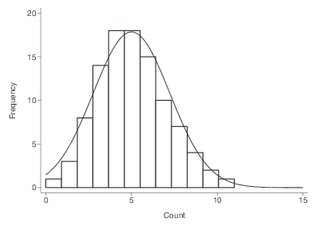

# Generalized Linear Models {#glm}


One of the primary assumptions with linear regression, is that the error terms have a specific distribution. Namely: 

$$ \epsilon_{i} \sim \mathcal{N}(0, \sigma^{2}) \qquad i=1, \ldots, n, \quad \mbox{and } \epsilon_{i} \perp \epsilon_{j}, i \neq j $$

When your outcome variable $y$ is non-continuous/non-normal, the above assumption fails dramatically. 

Generalized Linear Models (GLM) allows for different data type outcomes by allowing the linear portion of the model ($\mathbf{X}\beta$) to be related to the outcome variable $y$ using a _link_ function, that allows the magnitude of the variance of the errors ($\sigma$) to be related to the predicted values themselves. 

There are a few overarching types of non-continuous outcomes that can be modeled with GLM's. 

* Binary data: Logistic or Probit regression (\@ref(logreg))
* Log-linear models (\@ref(log-linear))
* Multinomial/categorical data: Multinomial or Ordinal Logistic regression.  (\@ref(multinomial-reg))
* Count data: Poisson regression (\@ref(poisson-reg))


\BeginKnitrBlock{rmdnote}<div class="rmdnote">This section uses functions from the following additional packages: `gtsummary`,`MKmisc`, `survey`. </div>\EndKnitrBlock{rmdnote}


## Fitting GLMs 

All regression models aim to model the expected value of the response variable $Y$ given the observed data $X$, through some link function $C$ 

$$E(Y|X) = C(X)$$ 

Depending on the data type of $Y$, this link function takes different forms. Examples include: 

* Linear regression: C = Identity function (no change)
* Logistic regression: C = logit function
* Poisson regression: C = log function


**R**

The general syntax is similar to `lm()`, with the additional required `family=` argument. See `?family` for a list of options. Example for Logistic regression would be: 


```r
glm(y ~ x1 + x2 + x3, data=DATA, family="binomial") 
```

**SPSS**

File menu: `Regression` --> Binary Logistic. 

Syntax: 

```
logistic regression Y with x1 x2 x3
   /categorical = x2
```

https://www.ibm.com/support/knowledgecenter/en/SSLVMB_26.0.0/statistics_reference_project_ddita/spss/regression/syn_logistic_regression_overview.html

**Stata**

`logistic Y x1 x2`

https://www.stata.com/features/overview/logistic-regression/


## Log-linear models {#log-linear}

A *log-linear* model is when the log of the response variable is modeled using a linear combination of predictors. 

$$ln(Y) \sim XB +\epsilon$$

Recall that in statistics, when we refer to the _log_, we mean the natural log _ln_.

This type of model is often use to model count data using the Poisson distribution (Section \@ref(poisson-reg)).

Why are we transforming the outcome? Typically to achieve normality when the response variable is highly skewed. 

**Interpreting results**

Since we transformed our outcome before performing the regression, we have to back-transform the coefficient before interpretation. Similar to logistic regression, we need to _exponentiate_ the regression coefficient before interpreting. 

When using log transformed outcomes, the effect on Y becomes **multiplicative** instead of additive. 

* **Additive** For every 1 unit increase in X, y increases by b1
* **Multiplicative** For every 1 unit increase in X, y is multiplied by $e^{b1}$

Example, let $b_{1} = 0.2$. 

* **Additive** For every 1 unit increase in X, y increases by 0.2 units.
* **Multiplicative** For every 1 unit increase in X, y changes by $e^{0.2} = 1.22$ = 22%


Thus we interpret the coefficient as a **percentage** change in $Y$ for a unit increase in $x_{j}$.

* **$b_{j}<0$** : Positive slope, positive association. The expected value of $Y$ for when $x=0$ is $1 - e^{b_{j}}$ percent _lower_ than when $x=1$
* **$b_{j} \geq 0$** : Negative slope, negative association. The expected value of $Y$ for when $x=0$ is $e^{b_{j}}$ percent _higher_ than when $x=1$


\BeginKnitrBlock{rmdtip}<div class="rmdtip">This UCLA resource is my "go-to" reference on how to interpret the results when your response, predictor, or both variables are log transformed. 

https://stats.idre.ucla.edu/other/mult-pkg/faq/general/faqhow-do-i-interpret-a-regression-model-when-some-variables-are-log-transformed/</div>\EndKnitrBlock{rmdtip}


### Example

We are going to analyze personal income from the AddHealth data set. First I need to clean up, and log transform the variable for personal earnings `H4EC2` by following the steps below _in order_. 

1. Remove values above 999995 (structural missing). 
3. Create a new variable called `income`, that sets all values of personal income to be NA if below the federal poverty line. 
    - First set `income= H4EC2`
    - Then set income to missing, if `H4EC2 < 10210` (the federal poverty limit from 2008)
4. Then create a new variable: `logincome` that is the natural log (_ln_) of income. e.g. `addhealth$logincome = log(addhealth$income)`

Why are we transforming income? To achieve normality. 

```r
par(mfrow=c(2,2))
hist(addhealth$income, probability = TRUE); lines(density(addhealth$income, na.rm=TRUE), col="red")
hist(addhealth$logincome, probability = TRUE); lines(density(addhealth$logincome, na.rm=TRUE), col="blue")
qqnorm(addhealth$income); qqline(addhealth$income, col="red")
qqnorm(addhealth$logincome); qqline(addhealth$logincome, col="blue")
```


**Identify variables**

* Quantitative outcome that has been log transformed: Income (variable `logincome`)
* Binary predictor: Ever smoked a cigarette (variable `eversmoke_c`)
* Binary confounder: Gender (variable `female_c`)
 
The mathematical multivariable model looks like: 

$$ln(Y) \sim \beta_{0} + \beta_{1}x_{1} + \beta_{2}x_{2}$$

**Fit a linear regression model**


```r
ln.mod.2 <- lm(logincome~wakeup + female_c, data=addhealth)
summary(ln.mod.2) %>% pander()
```


------------------------------------------------------------------
       &nbsp;         Estimate   Std. Error   t value   Pr(>|t|)  
-------------------- ---------- ------------ --------- -----------
  **(Intercept)**      10.65       0.026       409.8        0     

     **wakeup**       -0.01491    0.003218    -4.633    3.73e-06  

 **female_cFemale**   -0.1927      0.017      -11.34    2.564e-29 
------------------------------------------------------------------


---------------------------------------------------------------
 Observations   Residual Std. Error    $R^2$    Adjusted $R^2$ 
-------------- --------------------- --------- ----------------
     3813             0.5233          0.03611       0.0356     
---------------------------------------------------------------

Table: Fitting linear model: logincome ~ wakeup + female_c


```r
1-exp(confint(ln.mod.2)[-1,])
##                     2.5 %      97.5 %
## wakeup         0.02099299 0.008561652
## female_cFemale 0.20231394 0.147326777
```

**Interpret the results**

* For every hour later one wakes up in the morning, one can expect to earn `1-exp(-0.015)` = 1.4% less income than someone who wakes up one hour earlier. This is after controlling for gender. 
* Females have on average `1-exp(-0.19)` = 17% percent lower income than males, after controlling for the wake up time. 

Both gender and time one wakes up are significantly associated with the amount of personal earnings one makes. Waking up later in the morning is associated with 1.4% (95% CI 0.8%-2%, p<.0001) percent lower income than someone who wakes up one hour earlier. Females have 17% (95% CI 15%-20%, p<.0001) percent lower income than males. 


## Binary outcome data

Consider an outcome variable $Y$ with two levels: Y = 1 if event, = 0 if no event. 

Let $p_{i} = P(y_{i}=1)$. 

Two goals: 

* Assess the impact selected covariates have on the probability of an outcome occurring. 
* Predict the probability of an event occurring given a certain covariate pattern. This is covered in section \@ref(binary-classification)

Binary data can be modeled using a _Logistic Model_ or a _Probit Model_. 

The logistic model relates the probability of an event based on a linear combination of X's. 

$$
log\left(
\frac{p_{i}}{1-p_{i}}
\right) = \beta_{0} + \beta_{1}x_{1i} + \beta_{2}x_{2i} + \ldots + \beta_{p}x_{pi}
$$

Since the _odds_ are defined as the probability an event occurs divided by the  probability it does not occur: $(p/(1-p))$, the function $log\left(\frac{p_{i}}{1-p_{i}}\right)$ is also known as the _log odds_, or more commonly called the **_logit_**. This is the _link_ function for the logistic regression model. 


This in essence takes a binary outcome 0/1 variable, turns it into a continuous probability (which only has a range from 0 to 1) Then the logit(p) has a continuous distribution ranging from $-\infty$ to $\infty$, which is the same form as a Multiple Linear Regression (continuous outcome modeled on a set of covariates)


The probit function uses the inverse CDF for the normal distribution as the link function. The effect of the transformation is very similar. For social science interpretation of the coefficients, we tend to choose the _logit_ transformation and conduct a Logistic Regression. For classification purposes, often researchers will test out both transformations to see which one gives the best predictions. 


## Logistic Regression {#logreg}

Since the link between $X$ and $Y$ is no longer linear, a one unit increase in $X_{p}$ is no longer associated with a $b_{p}$ increase in $Y$. The regression coefficients $b_{p}$ from a logistic regression must be _exponentiated_ before interpretation.  

$$OR = e^{b}$$

The Odds Ratio (OR) provides a directly understandable statistic for the relationship between $y$ and a specific $x$ given all other $x$'s in the model are fixed. A later example in \@ref(mlogreg) provides a numeric example of how Odds Ratios are calculated. 

In testing for a relationship between $x$ and $y$, our hypothesis is that $\beta_{p}=0$. Since $e^{0}=1$, the reference value for the Odds Ratio that signifies no relationship, is 1, not 0. 


### Interpreting Odds Ratios

Consider a binary outcome with values YES, coded as 1, and NO, coded as 0. 

* **OR = 1** = equal chance of response variable being YES given any explanatory variable value. You are not able to predict participants’ responses by knowing their explanatory variable value. This would be a non significant model when looking at the p-value for the explanatory variable in the parameter estimate table.
* **OR > 1** = as the explanatory variable value increases, the presence of a YES response is more likely. We can say that when a participant’s response to the explanatory variable is YES (1), they are more likely to have a response that is a YES (1). 
* **OR <1** = as the explanatory variable value increases, the presence of a YES response is less likely. We can say that when a participant’s response to the explanatory variable is YES (1) they are less likely to have a response that is a YES (1). 

For a continuous variable X with slope coefficient $\beta$, the quantity $e^{b}$ is interpreted as the ratio of the odds for a person with value (X+1) relative to the odds for a person with value X. 


### Confidence Intervals {#or-ci}

Confidence intervals are a range for the population’s predicted odds ratio based on the sample data. We are 95% confident that any given population’s odds ratio would range between those two values. 

The OR is **not** a linear function of the $x's$, but $\beta$ is. This means that a CI for the OR is created by calculating a CI for $\beta$, and then exponentiating the endpoints. A 95% CI for the OR is calculated as: 

$$e^{\hat{\beta} \pm 1.96 SE_{\beta}} $$


This math holds for any $k$ unit change in x. The linearity of the confidence interval only applies at the untransformed level of the $\beta$'s. NOT the odds ratio. 


### Example: The effect of gender on Depression {#logreg-dep-ex}

This uses a cleaned version of the depression data set from PMAS6. 

* Binary outcome variable: Symptoms of Depression (`cases`)
* Binary predictor variable: Gender (`sex`) as an indicator of being female

The outcome $y$ is a 0/1 Bernoulli random variable. The sum of a vector of Bernoulli's ($\sum_{i=1}^{n}y_{i}$) has a Binomial distribution. When we specify that `family = "binomial"` the `glm()` function auto-assigns "logit" link function. 


```r
dep_sex_model <- glm(cases ~ sex, data=depress, family="binomial")
summary(dep_sex_model)
## 
## Call:
## glm(formula = cases ~ sex, family = "binomial", data = depress)
## 
## Coefficients:
##             Estimate Std. Error z value Pr(>|z|)    
## (Intercept)  -2.3125     0.3315  -6.976 3.04e-12 ***
## sex           1.0386     0.3767   2.757  0.00583 ** 
## ---
## Signif. codes:  0 '***' 0.001 '**' 0.01 '*' 0.05 '.' 0.1 ' ' 1
## 
## (Dispersion parameter for binomial family taken to be 1)
## 
##     Null deviance: 268.12  on 293  degrees of freedom
## Residual deviance: 259.40  on 292  degrees of freedom
## AIC: 263.4
## 
## Number of Fisher Scoring iterations: 5
```

We exponentiate the coefficients to back transform the $\beta$ estimates into Odds Ratios

```r
exp(coef(dep_sex_model))
## (Intercept)         sex 
##   0.0990099   2.8251748
exp(confint(dep_sex_model))
##                  2.5 %    97.5 %
## (Intercept) 0.04843014 0.1801265
## sex         1.39911056 6.2142384
```

Females have 2.8 (1.4, 6.2) times the odds of showing signs of depression compared to males. 


### Multiple Logistic Regression {#mlogreg}
Let's continue with the depression model, but now also include age and income as potential predictors of symptoms of depression. 


```r
mvmodel <- glm(cases ~ age + income + sex, data=depress, family="binomial")
summary(mvmodel)
## 
## Call:
## glm(formula = cases ~ age + income + sex, family = "binomial", 
##     data = depress)
## 
## Coefficients:
##             Estimate Std. Error z value Pr(>|z|)   
## (Intercept) -0.67646    0.57881  -1.169  0.24253   
## age         -0.02096    0.00904  -2.318  0.02043 * 
## income      -0.03656    0.01409  -2.595  0.00946 **
## sex          0.92945    0.38582   2.409  0.01600 * 
## ---
## Signif. codes:  0 '***' 0.001 '**' 0.01 '*' 0.05 '.' 0.1 ' ' 1
## 
## (Dispersion parameter for binomial family taken to be 1)
## 
##     Null deviance: 268.12  on 293  degrees of freedom
## Residual deviance: 247.54  on 290  degrees of freedom
## AIC: 255.54
## 
## Number of Fisher Scoring iterations: 5
```

* The sign of the $\beta$ coefficients can be interpreted in the same manner as with linear regression as having a positive or negative relationship.  
* The odds of being depressed are less if the respondent has a higher income and is older, and higher if the respondent is female. 

> The odds of a female being depressed are 2.53 times greater than the odds for Males after adjusting for the effects of age and income (p=.016). 

**Example calculation for $OR = e^{\beta}$**

The full model is: 
$$log(odds) = -0.676 - 0.02096*age - .03656*income + 0.92945*gender$$

We want to calculate the Odds Ratio of depression for women compared to men. 
$$ OR = \frac{Odds (Y=1|F)}{Odds (Y=1|M)} $$

Write out the equations for men and women separately. 
$$ = \frac{e^{-0.676 - 0.02096*age - .03656*income + 0.92945(1)}}
          {e^{-0.676 - 0.02096*age - .03656*income + 0.92945(0)}}$$

Applying rules of exponents to simplify.
$$ = \frac{e^{-0.676}e^{- 0.02096*age}e^{- .03656*income}e^{0.92945(1)}}
          {e^{-0.676}e^{- 0.02096*age}e^{- .03656*income}e^{0.92945(0)}}$$

$$ = \frac{e^{0.92945(1)}}
          {e^{0.92945(0)}}$$

$$ = e^{0.92945} $$


```r
exp(.92945)
## [1] 2.533116
exp(coef(mvmodel)[4])
##      sex 
## 2.533112
```

### Effect of a k unit change 

* Sometimes a 1 unit change in a continuous variable is not meaningful. 
* $exp(kb)$ is the incremental odds ratio corresponding to an increase of $k$ units in the variable X, assuming that the values of all other X variables remain unchanged. 


```r
tbl_regression(mvmodel, exponentiate=TRUE)
```


```{=html}
<div id="pzgyzpwmms" style="padding-left:0px;padding-right:0px;padding-top:10px;padding-bottom:10px;overflow-x:auto;overflow-y:auto;width:auto;height:auto;">
<style>#pzgyzpwmms table {
  font-family: system-ui, 'Segoe UI', Roboto, Helvetica, Arial, sans-serif, 'Apple Color Emoji', 'Segoe UI Emoji', 'Segoe UI Symbol', 'Noto Color Emoji';
  -webkit-font-smoothing: antialiased;
  -moz-osx-font-smoothing: grayscale;
}

#pzgyzpwmms thead, #pzgyzpwmms tbody, #pzgyzpwmms tfoot, #pzgyzpwmms tr, #pzgyzpwmms td, #pzgyzpwmms th {
  border-style: none;
}

#pzgyzpwmms p {
  margin: 0;
  padding: 0;
}

#pzgyzpwmms .gt_table {
  display: table;
  border-collapse: collapse;
  line-height: normal;
  margin-left: auto;
  margin-right: auto;
  color: #333333;
  font-size: 16px;
  font-weight: normal;
  font-style: normal;
  background-color: #FFFFFF;
  width: auto;
  border-top-style: solid;
  border-top-width: 2px;
  border-top-color: #A8A8A8;
  border-right-style: none;
  border-right-width: 2px;
  border-right-color: #D3D3D3;
  border-bottom-style: solid;
  border-bottom-width: 2px;
  border-bottom-color: #A8A8A8;
  border-left-style: none;
  border-left-width: 2px;
  border-left-color: #D3D3D3;
}

#pzgyzpwmms .gt_caption {
  padding-top: 4px;
  padding-bottom: 4px;
}

#pzgyzpwmms .gt_title {
  color: #333333;
  font-size: 125%;
  font-weight: initial;
  padding-top: 4px;
  padding-bottom: 4px;
  padding-left: 5px;
  padding-right: 5px;
  border-bottom-color: #FFFFFF;
  border-bottom-width: 0;
}

#pzgyzpwmms .gt_subtitle {
  color: #333333;
  font-size: 85%;
  font-weight: initial;
  padding-top: 3px;
  padding-bottom: 5px;
  padding-left: 5px;
  padding-right: 5px;
  border-top-color: #FFFFFF;
  border-top-width: 0;
}

#pzgyzpwmms .gt_heading {
  background-color: #FFFFFF;
  text-align: center;
  border-bottom-color: #FFFFFF;
  border-left-style: none;
  border-left-width: 1px;
  border-left-color: #D3D3D3;
  border-right-style: none;
  border-right-width: 1px;
  border-right-color: #D3D3D3;
}

#pzgyzpwmms .gt_bottom_border {
  border-bottom-style: solid;
  border-bottom-width: 2px;
  border-bottom-color: #D3D3D3;
}

#pzgyzpwmms .gt_col_headings {
  border-top-style: solid;
  border-top-width: 2px;
  border-top-color: #D3D3D3;
  border-bottom-style: solid;
  border-bottom-width: 2px;
  border-bottom-color: #D3D3D3;
  border-left-style: none;
  border-left-width: 1px;
  border-left-color: #D3D3D3;
  border-right-style: none;
  border-right-width: 1px;
  border-right-color: #D3D3D3;
}

#pzgyzpwmms .gt_col_heading {
  color: #333333;
  background-color: #FFFFFF;
  font-size: 100%;
  font-weight: normal;
  text-transform: inherit;
  border-left-style: none;
  border-left-width: 1px;
  border-left-color: #D3D3D3;
  border-right-style: none;
  border-right-width: 1px;
  border-right-color: #D3D3D3;
  vertical-align: bottom;
  padding-top: 5px;
  padding-bottom: 6px;
  padding-left: 5px;
  padding-right: 5px;
  overflow-x: hidden;
}

#pzgyzpwmms .gt_column_spanner_outer {
  color: #333333;
  background-color: #FFFFFF;
  font-size: 100%;
  font-weight: normal;
  text-transform: inherit;
  padding-top: 0;
  padding-bottom: 0;
  padding-left: 4px;
  padding-right: 4px;
}

#pzgyzpwmms .gt_column_spanner_outer:first-child {
  padding-left: 0;
}

#pzgyzpwmms .gt_column_spanner_outer:last-child {
  padding-right: 0;
}

#pzgyzpwmms .gt_column_spanner {
  border-bottom-style: solid;
  border-bottom-width: 2px;
  border-bottom-color: #D3D3D3;
  vertical-align: bottom;
  padding-top: 5px;
  padding-bottom: 5px;
  overflow-x: hidden;
  display: inline-block;
  width: 100%;
}

#pzgyzpwmms .gt_spanner_row {
  border-bottom-style: hidden;
}

#pzgyzpwmms .gt_group_heading {
  padding-top: 8px;
  padding-bottom: 8px;
  padding-left: 5px;
  padding-right: 5px;
  color: #333333;
  background-color: #FFFFFF;
  font-size: 100%;
  font-weight: initial;
  text-transform: inherit;
  border-top-style: solid;
  border-top-width: 2px;
  border-top-color: #D3D3D3;
  border-bottom-style: solid;
  border-bottom-width: 2px;
  border-bottom-color: #D3D3D3;
  border-left-style: none;
  border-left-width: 1px;
  border-left-color: #D3D3D3;
  border-right-style: none;
  border-right-width: 1px;
  border-right-color: #D3D3D3;
  vertical-align: middle;
  text-align: left;
}

#pzgyzpwmms .gt_empty_group_heading {
  padding: 0.5px;
  color: #333333;
  background-color: #FFFFFF;
  font-size: 100%;
  font-weight: initial;
  border-top-style: solid;
  border-top-width: 2px;
  border-top-color: #D3D3D3;
  border-bottom-style: solid;
  border-bottom-width: 2px;
  border-bottom-color: #D3D3D3;
  vertical-align: middle;
}

#pzgyzpwmms .gt_from_md > :first-child {
  margin-top: 0;
}

#pzgyzpwmms .gt_from_md > :last-child {
  margin-bottom: 0;
}

#pzgyzpwmms .gt_row {
  padding-top: 8px;
  padding-bottom: 8px;
  padding-left: 5px;
  padding-right: 5px;
  margin: 10px;
  border-top-style: solid;
  border-top-width: 1px;
  border-top-color: #D3D3D3;
  border-left-style: none;
  border-left-width: 1px;
  border-left-color: #D3D3D3;
  border-right-style: none;
  border-right-width: 1px;
  border-right-color: #D3D3D3;
  vertical-align: middle;
  overflow-x: hidden;
}

#pzgyzpwmms .gt_stub {
  color: #333333;
  background-color: #FFFFFF;
  font-size: 100%;
  font-weight: initial;
  text-transform: inherit;
  border-right-style: solid;
  border-right-width: 2px;
  border-right-color: #D3D3D3;
  padding-left: 5px;
  padding-right: 5px;
}

#pzgyzpwmms .gt_stub_row_group {
  color: #333333;
  background-color: #FFFFFF;
  font-size: 100%;
  font-weight: initial;
  text-transform: inherit;
  border-right-style: solid;
  border-right-width: 2px;
  border-right-color: #D3D3D3;
  padding-left: 5px;
  padding-right: 5px;
  vertical-align: top;
}

#pzgyzpwmms .gt_row_group_first td {
  border-top-width: 2px;
}

#pzgyzpwmms .gt_row_group_first th {
  border-top-width: 2px;
}

#pzgyzpwmms .gt_summary_row {
  color: #333333;
  background-color: #FFFFFF;
  text-transform: inherit;
  padding-top: 8px;
  padding-bottom: 8px;
  padding-left: 5px;
  padding-right: 5px;
}

#pzgyzpwmms .gt_first_summary_row {
  border-top-style: solid;
  border-top-color: #D3D3D3;
}

#pzgyzpwmms .gt_first_summary_row.thick {
  border-top-width: 2px;
}

#pzgyzpwmms .gt_last_summary_row {
  padding-top: 8px;
  padding-bottom: 8px;
  padding-left: 5px;
  padding-right: 5px;
  border-bottom-style: solid;
  border-bottom-width: 2px;
  border-bottom-color: #D3D3D3;
}

#pzgyzpwmms .gt_grand_summary_row {
  color: #333333;
  background-color: #FFFFFF;
  text-transform: inherit;
  padding-top: 8px;
  padding-bottom: 8px;
  padding-left: 5px;
  padding-right: 5px;
}

#pzgyzpwmms .gt_first_grand_summary_row {
  padding-top: 8px;
  padding-bottom: 8px;
  padding-left: 5px;
  padding-right: 5px;
  border-top-style: double;
  border-top-width: 6px;
  border-top-color: #D3D3D3;
}

#pzgyzpwmms .gt_last_grand_summary_row_top {
  padding-top: 8px;
  padding-bottom: 8px;
  padding-left: 5px;
  padding-right: 5px;
  border-bottom-style: double;
  border-bottom-width: 6px;
  border-bottom-color: #D3D3D3;
}

#pzgyzpwmms .gt_striped {
  background-color: rgba(128, 128, 128, 0.05);
}

#pzgyzpwmms .gt_table_body {
  border-top-style: solid;
  border-top-width: 2px;
  border-top-color: #D3D3D3;
  border-bottom-style: solid;
  border-bottom-width: 2px;
  border-bottom-color: #D3D3D3;
}

#pzgyzpwmms .gt_footnotes {
  color: #333333;
  background-color: #FFFFFF;
  border-bottom-style: none;
  border-bottom-width: 2px;
  border-bottom-color: #D3D3D3;
  border-left-style: none;
  border-left-width: 2px;
  border-left-color: #D3D3D3;
  border-right-style: none;
  border-right-width: 2px;
  border-right-color: #D3D3D3;
}

#pzgyzpwmms .gt_footnote {
  margin: 0px;
  font-size: 90%;
  padding-top: 4px;
  padding-bottom: 4px;
  padding-left: 5px;
  padding-right: 5px;
}

#pzgyzpwmms .gt_sourcenotes {
  color: #333333;
  background-color: #FFFFFF;
  border-bottom-style: none;
  border-bottom-width: 2px;
  border-bottom-color: #D3D3D3;
  border-left-style: none;
  border-left-width: 2px;
  border-left-color: #D3D3D3;
  border-right-style: none;
  border-right-width: 2px;
  border-right-color: #D3D3D3;
}

#pzgyzpwmms .gt_sourcenote {
  font-size: 90%;
  padding-top: 4px;
  padding-bottom: 4px;
  padding-left: 5px;
  padding-right: 5px;
}

#pzgyzpwmms .gt_left {
  text-align: left;
}

#pzgyzpwmms .gt_center {
  text-align: center;
}

#pzgyzpwmms .gt_right {
  text-align: right;
  font-variant-numeric: tabular-nums;
}

#pzgyzpwmms .gt_font_normal {
  font-weight: normal;
}

#pzgyzpwmms .gt_font_bold {
  font-weight: bold;
}

#pzgyzpwmms .gt_font_italic {
  font-style: italic;
}

#pzgyzpwmms .gt_super {
  font-size: 65%;
}

#pzgyzpwmms .gt_footnote_marks {
  font-size: 75%;
  vertical-align: 0.4em;
  position: initial;
}

#pzgyzpwmms .gt_asterisk {
  font-size: 100%;
  vertical-align: 0;
}

#pzgyzpwmms .gt_indent_1 {
  text-indent: 5px;
}

#pzgyzpwmms .gt_indent_2 {
  text-indent: 10px;
}

#pzgyzpwmms .gt_indent_3 {
  text-indent: 15px;
}

#pzgyzpwmms .gt_indent_4 {
  text-indent: 20px;
}

#pzgyzpwmms .gt_indent_5 {
  text-indent: 25px;
}
</style>
<table class="gt_table" data-quarto-disable-processing="false" data-quarto-bootstrap="false">
  <thead>
    
    <tr class="gt_col_headings">
      <th class="gt_col_heading gt_columns_bottom_border gt_left" rowspan="1" colspan="1" scope="col" id="&lt;strong&gt;Characteristic&lt;/strong&gt;"><strong>Characteristic</strong></th>
      <th class="gt_col_heading gt_columns_bottom_border gt_center" rowspan="1" colspan="1" scope="col" id="&lt;strong&gt;OR&lt;/strong&gt;&lt;span class=&quot;gt_footnote_marks&quot; style=&quot;white-space:nowrap;font-style:italic;font-weight:normal;&quot;&gt;&lt;sup&gt;1&lt;/sup&gt;&lt;/span&gt;"><strong>OR</strong><span class="gt_footnote_marks" style="white-space:nowrap;font-style:italic;font-weight:normal;"><sup>1</sup></span></th>
      <th class="gt_col_heading gt_columns_bottom_border gt_center" rowspan="1" colspan="1" scope="col" id="&lt;strong&gt;95% CI&lt;/strong&gt;&lt;span class=&quot;gt_footnote_marks&quot; style=&quot;white-space:nowrap;font-style:italic;font-weight:normal;&quot;&gt;&lt;sup&gt;1&lt;/sup&gt;&lt;/span&gt;"><strong>95% CI</strong><span class="gt_footnote_marks" style="white-space:nowrap;font-style:italic;font-weight:normal;"><sup>1</sup></span></th>
      <th class="gt_col_heading gt_columns_bottom_border gt_center" rowspan="1" colspan="1" scope="col" id="&lt;strong&gt;p-value&lt;/strong&gt;"><strong>p-value</strong></th>
    </tr>
  </thead>
  <tbody class="gt_table_body">
    <tr><td headers="label" class="gt_row gt_left">age</td>
<td headers="estimate" class="gt_row gt_center">0.98</td>
<td headers="ci" class="gt_row gt_center">0.96, 1.00</td>
<td headers="p.value" class="gt_row gt_center">0.020</td></tr>
    <tr><td headers="label" class="gt_row gt_left">income</td>
<td headers="estimate" class="gt_row gt_center">0.96</td>
<td headers="ci" class="gt_row gt_center">0.94, 0.99</td>
<td headers="p.value" class="gt_row gt_center">0.009</td></tr>
    <tr><td headers="label" class="gt_row gt_left">sex</td>
<td headers="estimate" class="gt_row gt_center">2.53</td>
<td headers="ci" class="gt_row gt_center">1.23, 5.66</td>
<td headers="p.value" class="gt_row gt_center">0.016</td></tr>
  </tbody>
  
  <tfoot class="gt_footnotes">
    <tr>
      <td class="gt_footnote" colspan="4"><span class="gt_footnote_marks" style="white-space:nowrap;font-style:italic;font-weight:normal;"><sup>1</sup></span> OR = Odds Ratio, CI = Confidence Interval</td>
    </tr>
  </tfoot>
</table>
</div>
```


* The Adjusted odds ratio (AOR) for increase of 1 year of age is 0.98 (95%CI .96, 1.0)
* How about a 10 year increase in age? $e^{10*\beta_{age}} = e^{-.21} = .81$

In generalized linear models, the assumptions on $\beta$ having a normal distribution

Refer back to equation \@ref(or-ci), the linearity of the relationship is on the $\beta$ level, not the odds ratio. Do all transformations on the $\beta$'s, then the last step is the non-linear transformation of exponentiation. 

So the mathmatical order of operations is important! First use `coef` to extract the coefficients out of the model object (here named `mvmodel`), then pull the 2nd item out `coef(mvmodel)[2]`, then multiply it by 10, then lastly exponentiate this value. 


```r
exp(10*coef(mvmodel)[2])
##       age 
## 0.8109285
```

Do the same to calculate the confidence interval for a 10 year time span. 

```r
round(exp(10*confint(mvmodel)[2,]),3)
##  2.5 % 97.5 % 
##  0.676  0.965
```

Controlling for gender and income, an individual has 0.81 (95% CI 0.68, 0.97) times the odds of being depressed compared to someone who is 10 years younger than them. 


### Example: Predictors of smoking status

Consider a logistic model on smoking status (0= never smoked, 1=has smoked) using gender, income, and blood pressure class (`bp_class`) as predictors. 

$$
logit(Y) = \beta_{0} + \beta_{1}\mbox{(female)} + \beta_{2}\mbox{(income)} + \beta_{3}\mbox{(Pre-HTN)} 
+ \beta_{4}\mbox{(HTN-I)} + \beta_{5}\mbox{(HTN-II)}
$$


```r
bp.mod <- glm(smoke ~ female_c + income + bp_class, data=addhealth, family='binomial')
tbl_regression(bp.mod, exponentiate=TRUE)
```


```{=html}
<div id="xegwmbxwrm" style="padding-left:0px;padding-right:0px;padding-top:10px;padding-bottom:10px;overflow-x:auto;overflow-y:auto;width:auto;height:auto;">
<style>#xegwmbxwrm table {
  font-family: system-ui, 'Segoe UI', Roboto, Helvetica, Arial, sans-serif, 'Apple Color Emoji', 'Segoe UI Emoji', 'Segoe UI Symbol', 'Noto Color Emoji';
  -webkit-font-smoothing: antialiased;
  -moz-osx-font-smoothing: grayscale;
}

#xegwmbxwrm thead, #xegwmbxwrm tbody, #xegwmbxwrm tfoot, #xegwmbxwrm tr, #xegwmbxwrm td, #xegwmbxwrm th {
  border-style: none;
}

#xegwmbxwrm p {
  margin: 0;
  padding: 0;
}

#xegwmbxwrm .gt_table {
  display: table;
  border-collapse: collapse;
  line-height: normal;
  margin-left: auto;
  margin-right: auto;
  color: #333333;
  font-size: 16px;
  font-weight: normal;
  font-style: normal;
  background-color: #FFFFFF;
  width: auto;
  border-top-style: solid;
  border-top-width: 2px;
  border-top-color: #A8A8A8;
  border-right-style: none;
  border-right-width: 2px;
  border-right-color: #D3D3D3;
  border-bottom-style: solid;
  border-bottom-width: 2px;
  border-bottom-color: #A8A8A8;
  border-left-style: none;
  border-left-width: 2px;
  border-left-color: #D3D3D3;
}

#xegwmbxwrm .gt_caption {
  padding-top: 4px;
  padding-bottom: 4px;
}

#xegwmbxwrm .gt_title {
  color: #333333;
  font-size: 125%;
  font-weight: initial;
  padding-top: 4px;
  padding-bottom: 4px;
  padding-left: 5px;
  padding-right: 5px;
  border-bottom-color: #FFFFFF;
  border-bottom-width: 0;
}

#xegwmbxwrm .gt_subtitle {
  color: #333333;
  font-size: 85%;
  font-weight: initial;
  padding-top: 3px;
  padding-bottom: 5px;
  padding-left: 5px;
  padding-right: 5px;
  border-top-color: #FFFFFF;
  border-top-width: 0;
}

#xegwmbxwrm .gt_heading {
  background-color: #FFFFFF;
  text-align: center;
  border-bottom-color: #FFFFFF;
  border-left-style: none;
  border-left-width: 1px;
  border-left-color: #D3D3D3;
  border-right-style: none;
  border-right-width: 1px;
  border-right-color: #D3D3D3;
}

#xegwmbxwrm .gt_bottom_border {
  border-bottom-style: solid;
  border-bottom-width: 2px;
  border-bottom-color: #D3D3D3;
}

#xegwmbxwrm .gt_col_headings {
  border-top-style: solid;
  border-top-width: 2px;
  border-top-color: #D3D3D3;
  border-bottom-style: solid;
  border-bottom-width: 2px;
  border-bottom-color: #D3D3D3;
  border-left-style: none;
  border-left-width: 1px;
  border-left-color: #D3D3D3;
  border-right-style: none;
  border-right-width: 1px;
  border-right-color: #D3D3D3;
}

#xegwmbxwrm .gt_col_heading {
  color: #333333;
  background-color: #FFFFFF;
  font-size: 100%;
  font-weight: normal;
  text-transform: inherit;
  border-left-style: none;
  border-left-width: 1px;
  border-left-color: #D3D3D3;
  border-right-style: none;
  border-right-width: 1px;
  border-right-color: #D3D3D3;
  vertical-align: bottom;
  padding-top: 5px;
  padding-bottom: 6px;
  padding-left: 5px;
  padding-right: 5px;
  overflow-x: hidden;
}

#xegwmbxwrm .gt_column_spanner_outer {
  color: #333333;
  background-color: #FFFFFF;
  font-size: 100%;
  font-weight: normal;
  text-transform: inherit;
  padding-top: 0;
  padding-bottom: 0;
  padding-left: 4px;
  padding-right: 4px;
}

#xegwmbxwrm .gt_column_spanner_outer:first-child {
  padding-left: 0;
}

#xegwmbxwrm .gt_column_spanner_outer:last-child {
  padding-right: 0;
}

#xegwmbxwrm .gt_column_spanner {
  border-bottom-style: solid;
  border-bottom-width: 2px;
  border-bottom-color: #D3D3D3;
  vertical-align: bottom;
  padding-top: 5px;
  padding-bottom: 5px;
  overflow-x: hidden;
  display: inline-block;
  width: 100%;
}

#xegwmbxwrm .gt_spanner_row {
  border-bottom-style: hidden;
}

#xegwmbxwrm .gt_group_heading {
  padding-top: 8px;
  padding-bottom: 8px;
  padding-left: 5px;
  padding-right: 5px;
  color: #333333;
  background-color: #FFFFFF;
  font-size: 100%;
  font-weight: initial;
  text-transform: inherit;
  border-top-style: solid;
  border-top-width: 2px;
  border-top-color: #D3D3D3;
  border-bottom-style: solid;
  border-bottom-width: 2px;
  border-bottom-color: #D3D3D3;
  border-left-style: none;
  border-left-width: 1px;
  border-left-color: #D3D3D3;
  border-right-style: none;
  border-right-width: 1px;
  border-right-color: #D3D3D3;
  vertical-align: middle;
  text-align: left;
}

#xegwmbxwrm .gt_empty_group_heading {
  padding: 0.5px;
  color: #333333;
  background-color: #FFFFFF;
  font-size: 100%;
  font-weight: initial;
  border-top-style: solid;
  border-top-width: 2px;
  border-top-color: #D3D3D3;
  border-bottom-style: solid;
  border-bottom-width: 2px;
  border-bottom-color: #D3D3D3;
  vertical-align: middle;
}

#xegwmbxwrm .gt_from_md > :first-child {
  margin-top: 0;
}

#xegwmbxwrm .gt_from_md > :last-child {
  margin-bottom: 0;
}

#xegwmbxwrm .gt_row {
  padding-top: 8px;
  padding-bottom: 8px;
  padding-left: 5px;
  padding-right: 5px;
  margin: 10px;
  border-top-style: solid;
  border-top-width: 1px;
  border-top-color: #D3D3D3;
  border-left-style: none;
  border-left-width: 1px;
  border-left-color: #D3D3D3;
  border-right-style: none;
  border-right-width: 1px;
  border-right-color: #D3D3D3;
  vertical-align: middle;
  overflow-x: hidden;
}

#xegwmbxwrm .gt_stub {
  color: #333333;
  background-color: #FFFFFF;
  font-size: 100%;
  font-weight: initial;
  text-transform: inherit;
  border-right-style: solid;
  border-right-width: 2px;
  border-right-color: #D3D3D3;
  padding-left: 5px;
  padding-right: 5px;
}

#xegwmbxwrm .gt_stub_row_group {
  color: #333333;
  background-color: #FFFFFF;
  font-size: 100%;
  font-weight: initial;
  text-transform: inherit;
  border-right-style: solid;
  border-right-width: 2px;
  border-right-color: #D3D3D3;
  padding-left: 5px;
  padding-right: 5px;
  vertical-align: top;
}

#xegwmbxwrm .gt_row_group_first td {
  border-top-width: 2px;
}

#xegwmbxwrm .gt_row_group_first th {
  border-top-width: 2px;
}

#xegwmbxwrm .gt_summary_row {
  color: #333333;
  background-color: #FFFFFF;
  text-transform: inherit;
  padding-top: 8px;
  padding-bottom: 8px;
  padding-left: 5px;
  padding-right: 5px;
}

#xegwmbxwrm .gt_first_summary_row {
  border-top-style: solid;
  border-top-color: #D3D3D3;
}

#xegwmbxwrm .gt_first_summary_row.thick {
  border-top-width: 2px;
}

#xegwmbxwrm .gt_last_summary_row {
  padding-top: 8px;
  padding-bottom: 8px;
  padding-left: 5px;
  padding-right: 5px;
  border-bottom-style: solid;
  border-bottom-width: 2px;
  border-bottom-color: #D3D3D3;
}

#xegwmbxwrm .gt_grand_summary_row {
  color: #333333;
  background-color: #FFFFFF;
  text-transform: inherit;
  padding-top: 8px;
  padding-bottom: 8px;
  padding-left: 5px;
  padding-right: 5px;
}

#xegwmbxwrm .gt_first_grand_summary_row {
  padding-top: 8px;
  padding-bottom: 8px;
  padding-left: 5px;
  padding-right: 5px;
  border-top-style: double;
  border-top-width: 6px;
  border-top-color: #D3D3D3;
}

#xegwmbxwrm .gt_last_grand_summary_row_top {
  padding-top: 8px;
  padding-bottom: 8px;
  padding-left: 5px;
  padding-right: 5px;
  border-bottom-style: double;
  border-bottom-width: 6px;
  border-bottom-color: #D3D3D3;
}

#xegwmbxwrm .gt_striped {
  background-color: rgba(128, 128, 128, 0.05);
}

#xegwmbxwrm .gt_table_body {
  border-top-style: solid;
  border-top-width: 2px;
  border-top-color: #D3D3D3;
  border-bottom-style: solid;
  border-bottom-width: 2px;
  border-bottom-color: #D3D3D3;
}

#xegwmbxwrm .gt_footnotes {
  color: #333333;
  background-color: #FFFFFF;
  border-bottom-style: none;
  border-bottom-width: 2px;
  border-bottom-color: #D3D3D3;
  border-left-style: none;
  border-left-width: 2px;
  border-left-color: #D3D3D3;
  border-right-style: none;
  border-right-width: 2px;
  border-right-color: #D3D3D3;
}

#xegwmbxwrm .gt_footnote {
  margin: 0px;
  font-size: 90%;
  padding-top: 4px;
  padding-bottom: 4px;
  padding-left: 5px;
  padding-right: 5px;
}

#xegwmbxwrm .gt_sourcenotes {
  color: #333333;
  background-color: #FFFFFF;
  border-bottom-style: none;
  border-bottom-width: 2px;
  border-bottom-color: #D3D3D3;
  border-left-style: none;
  border-left-width: 2px;
  border-left-color: #D3D3D3;
  border-right-style: none;
  border-right-width: 2px;
  border-right-color: #D3D3D3;
}

#xegwmbxwrm .gt_sourcenote {
  font-size: 90%;
  padding-top: 4px;
  padding-bottom: 4px;
  padding-left: 5px;
  padding-right: 5px;
}

#xegwmbxwrm .gt_left {
  text-align: left;
}

#xegwmbxwrm .gt_center {
  text-align: center;
}

#xegwmbxwrm .gt_right {
  text-align: right;
  font-variant-numeric: tabular-nums;
}

#xegwmbxwrm .gt_font_normal {
  font-weight: normal;
}

#xegwmbxwrm .gt_font_bold {
  font-weight: bold;
}

#xegwmbxwrm .gt_font_italic {
  font-style: italic;
}

#xegwmbxwrm .gt_super {
  font-size: 65%;
}

#xegwmbxwrm .gt_footnote_marks {
  font-size: 75%;
  vertical-align: 0.4em;
  position: initial;
}

#xegwmbxwrm .gt_asterisk {
  font-size: 100%;
  vertical-align: 0;
}

#xegwmbxwrm .gt_indent_1 {
  text-indent: 5px;
}

#xegwmbxwrm .gt_indent_2 {
  text-indent: 10px;
}

#xegwmbxwrm .gt_indent_3 {
  text-indent: 15px;
}

#xegwmbxwrm .gt_indent_4 {
  text-indent: 20px;
}

#xegwmbxwrm .gt_indent_5 {
  text-indent: 25px;
}
</style>
<table class="gt_table" data-quarto-disable-processing="false" data-quarto-bootstrap="false">
  <thead>
    
    <tr class="gt_col_headings">
      <th class="gt_col_heading gt_columns_bottom_border gt_left" rowspan="1" colspan="1" scope="col" id="&lt;strong&gt;Characteristic&lt;/strong&gt;"><strong>Characteristic</strong></th>
      <th class="gt_col_heading gt_columns_bottom_border gt_center" rowspan="1" colspan="1" scope="col" id="&lt;strong&gt;OR&lt;/strong&gt;&lt;span class=&quot;gt_footnote_marks&quot; style=&quot;white-space:nowrap;font-style:italic;font-weight:normal;&quot;&gt;&lt;sup&gt;1&lt;/sup&gt;&lt;/span&gt;"><strong>OR</strong><span class="gt_footnote_marks" style="white-space:nowrap;font-style:italic;font-weight:normal;"><sup>1</sup></span></th>
      <th class="gt_col_heading gt_columns_bottom_border gt_center" rowspan="1" colspan="1" scope="col" id="&lt;strong&gt;95% CI&lt;/strong&gt;&lt;span class=&quot;gt_footnote_marks&quot; style=&quot;white-space:nowrap;font-style:italic;font-weight:normal;&quot;&gt;&lt;sup&gt;1&lt;/sup&gt;&lt;/span&gt;"><strong>95% CI</strong><span class="gt_footnote_marks" style="white-space:nowrap;font-style:italic;font-weight:normal;"><sup>1</sup></span></th>
      <th class="gt_col_heading gt_columns_bottom_border gt_center" rowspan="1" colspan="1" scope="col" id="&lt;strong&gt;p-value&lt;/strong&gt;"><strong>p-value</strong></th>
    </tr>
  </thead>
  <tbody class="gt_table_body">
    <tr><td headers="label" class="gt_row gt_left">female_c</td>
<td headers="estimate" class="gt_row gt_center"></td>
<td headers="ci" class="gt_row gt_center"></td>
<td headers="p.value" class="gt_row gt_center"></td></tr>
    <tr><td headers="label" class="gt_row gt_left">    Male</td>
<td headers="estimate" class="gt_row gt_center">—</td>
<td headers="ci" class="gt_row gt_center">—</td>
<td headers="p.value" class="gt_row gt_center"></td></tr>
    <tr><td headers="label" class="gt_row gt_left">    Female</td>
<td headers="estimate" class="gt_row gt_center">0.54</td>
<td headers="ci" class="gt_row gt_center">0.46, 0.63</td>
<td headers="p.value" class="gt_row gt_center"><0.001</td></tr>
    <tr><td headers="label" class="gt_row gt_left">income</td>
<td headers="estimate" class="gt_row gt_center">1.00</td>
<td headers="ci" class="gt_row gt_center">1.00, 1.00</td>
<td headers="p.value" class="gt_row gt_center">0.005</td></tr>
    <tr><td headers="label" class="gt_row gt_left">bp_class</td>
<td headers="estimate" class="gt_row gt_center"></td>
<td headers="ci" class="gt_row gt_center"></td>
<td headers="p.value" class="gt_row gt_center"></td></tr>
    <tr><td headers="label" class="gt_row gt_left">    Normal</td>
<td headers="estimate" class="gt_row gt_center">—</td>
<td headers="ci" class="gt_row gt_center">—</td>
<td headers="p.value" class="gt_row gt_center"></td></tr>
    <tr><td headers="label" class="gt_row gt_left">    Pre-HTN</td>
<td headers="estimate" class="gt_row gt_center">1.08</td>
<td headers="ci" class="gt_row gt_center">0.92, 1.26</td>
<td headers="p.value" class="gt_row gt_center">0.4</td></tr>
    <tr><td headers="label" class="gt_row gt_left">    HTN-I</td>
<td headers="estimate" class="gt_row gt_center">0.98</td>
<td headers="ci" class="gt_row gt_center">0.79, 1.21</td>
<td headers="p.value" class="gt_row gt_center">0.8</td></tr>
    <tr><td headers="label" class="gt_row gt_left">    HTN-II</td>
<td headers="estimate" class="gt_row gt_center">1.03</td>
<td headers="ci" class="gt_row gt_center">0.71, 1.50</td>
<td headers="p.value" class="gt_row gt_center">0.9</td></tr>
  </tbody>
  
  <tfoot class="gt_footnotes">
    <tr>
      <td class="gt_footnote" colspan="4"><span class="gt_footnote_marks" style="white-space:nowrap;font-style:italic;font-weight:normal;"><sup>1</sup></span> OR = Odds Ratio, CI = Confidence Interval</td>
    </tr>
  </tfoot>
</table>
</div>
```


It is unlikely that blood pressure is associated with smoking status, all groups are not statistically significantly different from the reference group (all p-values are large). Let's test that hypothesis formally using a Wald Test. 


```r
survey::regTermTest(bp.mod, "bp_class")
## Wald test for bp_class
##  in glm(formula = smoke ~ female_c + income + bp_class, family = "binomial", 
##     data = addhealth)
## F =  0.428004  on  3  and  3723  df: p= 0.73294
```

The Wald Test has a large p-value of 0.73, thus blood pressure classification is not associated with smoking status.

* This means blood pressure classification should not be included in a model to explain smoking status. 


### Model Fit 

📖 PMA6 12.8

#### Pseudo $R^{2}$

Recall in linear regression, the coefficient of determination $R^{2}$ could be used as a measure of model fit, as it represents the proportion of variance in the outcome explained by the model. This statistic can't be calculated for Logistic regression, but several versions of a _Pseudo $R^{2}$_ have been proposed, and are printed as part of the output for many statistical packages such as Stata. 


#### Goodness of Fit

Another way to assess model fit for the entire model is to perform a _goodness-of-fit_ test. The one developed by Hosmer and Lemeshow (1980) is the most commonly used GoF test. In this approach,

1. the predicted probability of belonging to the event group (y=1) is calculated for every observation. 
2. these probabilities are sorted in ascending order, then divided into $j$ equal sized subgroups, typically deciles to create 10 'bins'. 
3. For each 'bin', or range of probabilities, count the observed number of individuals with the event (y=1) ($O_{j}$).
4. For each 'bin', calculate the expected number of events by adding the predicted probabilities in that bin. ($E_{j}$)

The goodness of fit statistic is then calculated as follows: 

$$ GoF \chi^{2} = \sum_{j} \frac{(O_{j}-E_{j})^2}{E_{j}} $$

which approximately follows a $\chi_{J-2}^{2}$ distribution under relatively large sample sizes. 

> A large GoF statistic (or small p-value) indicate that the fit may *NOT* be good

R package: `MKmisc`, function `HLgof.test`. 

```
Mkmisc::HLgof.test(fit=fitted(model), obs=model$y)
```

#### Accurate predictions

Since the logistic regression is all about modeling the probability of an event occurring, we can use that model to create predicted probabilities. The next chapter discusses how to use a logistic regression model for prediction, and what measures of fit are used to assess how "accurate" the model is. 


## Count outcome data {#poisson-reg}

Lets consider modeling the distribution of the number of of occurrences of a rare event in a specified period of time
    - e.g. Number of thunderstorms in a year

* If we assume:
    * Rate ($\mu$) is fixed over time
    * Successive occurrences independent of each other

Then we can use the **Poisson distribution**.

$$
P(Y=y) = e^{-\mu}\frac{\mu^{y}}{y!}
$$

* The Poisson distribution has a distinct feature where the mean of the distribution $\mu$, is also the variance. 




#### Poisson Regression 

\BeginKnitrBlock{rmdnote}<div class="rmdnote">This section is still under development</div>\EndKnitrBlock{rmdnote}


Just another GLM - we use a $ln$ as the link function. This lets us model the log rates using a linear combination of covariates. 

$$
  ln(\mu) = \mathbf{X}\beta
$$

Then the expected rate of events per unit of time is: 

$$
  \mu = e^{\mathbf{X}\beta}
$$

This model assumes that the time of "exposure" for each record is identical. 

* Number of cigarettes per month
* Number of epileptic seizures per week
* Number of people with lung cancer in four cities
    
If this is not the case (often), then this model needs to include an _offset_. 

* e.g. observing each patient for epileptic seizures for a different number of days
* accounting for different sizes or structures of populations of interest (e.g. different cities with lung cancer)
  

What actually gets fit in `glm` is the model of expected _counts_, rather than rates, with an offset for the time period $T$. 

* If all time periods are the same, then T is constant, and a linear combination of the intercept, thus dropped from the model. 

$$
  ln(\lambda) = \mathbf{X}\beta + ln(T)
$$

While this offset will be added to the regression model as if it were another variable, it's not quite the same because the regression coefficient for the $ln(T)$ term is fixed at 1. 

The generic formula for fitting a poisson model using `glm` is: 

```r
glm(y ~ x1 + x2 + offset(log(T)), family='poisson')
```
or alternatively as an argument

```r
glm(y ~ x1 + x2, offset = log(T),  family='poisson')
```

The interpretation of the $\beta$ regression coefficients are differences in the log rate (or the log rate-ratio). So, just like with a logistic regression often we back-transform the coefficients by exponentiating before interpreting. So $e^{\beta}$ is now the rate-ratio. 

* The intercept term is not a ratio, but a baseline rate when all covariates are 0
* For other covariates, the coefficient is the relative change _per unit_ change in the covariate. 
    - one year older
    - males vs females
    
Also, similar to logistic regression, since the outcome was transformed, the standard errors are not useful or interpretable as is. To calculate confidence intervals for the rate ratios, 

1. calculate the CI for $\beta$
2. exponentiate each end point. 


#### Example: Modeling counts from the Add Health Wave IV dataset. 

Let's model the number of siblings someone has, based off their age at Wave 1 (2008).


Visualize

```r
ggplot(addhealth, aes(x=nsib)) + geom_histogram() + 
  xlab("Number of siblings") + ylab("Count")
```


```r
nsib.model <- glm(nsib ~ agew1 + female, data=addhealth, family="poisson")
tbl_regression(nsib.model, exponentiate = TRUE)
```

```{=html}
<div id="mxjtzxkmpu" style="overflow-x:auto;overflow-y:auto;width:auto;height:auto;">
<style>html {
  font-family: -apple-system, BlinkMacSystemFont, 'Segoe UI', Roboto, Oxygen, Ubuntu, Cantarell, 'Helvetica Neue', 'Fira Sans', 'Droid Sans', Arial, sans-serif;
}

#mxjtzxkmpu .gt_table {
  display: table;
  border-collapse: collapse;
  margin-left: auto;
  margin-right: auto;
  color: #333333;
  font-size: 16px;
  font-weight: normal;
  font-style: normal;
  background-color: #FFFFFF;
  width: auto;
  border-top-style: solid;
  border-top-width: 2px;
  border-top-color: #A8A8A8;
  border-right-style: none;
  border-right-width: 2px;
  border-right-color: #D3D3D3;
  border-bottom-style: solid;
  border-bottom-width: 2px;
  border-bottom-color: #A8A8A8;
  border-left-style: none;
  border-left-width: 2px;
  border-left-color: #D3D3D3;
}

#mxjtzxkmpu .gt_heading {
  background-color: #FFFFFF;
  text-align: center;
  border-bottom-color: #FFFFFF;
  border-left-style: none;
  border-left-width: 1px;
  border-left-color: #D3D3D3;
  border-right-style: none;
  border-right-width: 1px;
  border-right-color: #D3D3D3;
}

#mxjtzxkmpu .gt_title {
  color: #333333;
  font-size: 125%;
  font-weight: initial;
  padding-top: 4px;
  padding-bottom: 4px;
  padding-left: 5px;
  padding-right: 5px;
  border-bottom-color: #FFFFFF;
  border-bottom-width: 0;
}

#mxjtzxkmpu .gt_subtitle {
  color: #333333;
  font-size: 85%;
  font-weight: initial;
  padding-top: 0;
  padding-bottom: 6px;
  padding-left: 5px;
  padding-right: 5px;
  border-top-color: #FFFFFF;
  border-top-width: 0;
}

#mxjtzxkmpu .gt_bottom_border {
  border-bottom-style: solid;
  border-bottom-width: 2px;
  border-bottom-color: #D3D3D3;
}

#mxjtzxkmpu .gt_col_headings {
  border-top-style: solid;
  border-top-width: 2px;
  border-top-color: #D3D3D3;
  border-bottom-style: solid;
  border-bottom-width: 2px;
  border-bottom-color: #D3D3D3;
  border-left-style: none;
  border-left-width: 1px;
  border-left-color: #D3D3D3;
  border-right-style: none;
  border-right-width: 1px;
  border-right-color: #D3D3D3;
}

#mxjtzxkmpu .gt_col_heading {
  color: #333333;
  background-color: #FFFFFF;
  font-size: 100%;
  font-weight: normal;
  text-transform: inherit;
  border-left-style: none;
  border-left-width: 1px;
  border-left-color: #D3D3D3;
  border-right-style: none;
  border-right-width: 1px;
  border-right-color: #D3D3D3;
  vertical-align: bottom;
  padding-top: 5px;
  padding-bottom: 6px;
  padding-left: 5px;
  padding-right: 5px;
  overflow-x: hidden;
}

#mxjtzxkmpu .gt_column_spanner_outer {
  color: #333333;
  background-color: #FFFFFF;
  font-size: 100%;
  font-weight: normal;
  text-transform: inherit;
  padding-top: 0;
  padding-bottom: 0;
  padding-left: 4px;
  padding-right: 4px;
}

#mxjtzxkmpu .gt_column_spanner_outer:first-child {
  padding-left: 0;
}

#mxjtzxkmpu .gt_column_spanner_outer:last-child {
  padding-right: 0;
}

#mxjtzxkmpu .gt_column_spanner {
  border-bottom-style: solid;
  border-bottom-width: 2px;
  border-bottom-color: #D3D3D3;
  vertical-align: bottom;
  padding-top: 5px;
  padding-bottom: 5px;
  overflow-x: hidden;
  display: inline-block;
  width: 100%;
}

#mxjtzxkmpu .gt_group_heading {
  padding-top: 8px;
  padding-bottom: 8px;
  padding-left: 5px;
  padding-right: 5px;
  color: #333333;
  background-color: #FFFFFF;
  font-size: 100%;
  font-weight: initial;
  text-transform: inherit;
  border-top-style: solid;
  border-top-width: 2px;
  border-top-color: #D3D3D3;
  border-bottom-style: solid;
  border-bottom-width: 2px;
  border-bottom-color: #D3D3D3;
  border-left-style: none;
  border-left-width: 1px;
  border-left-color: #D3D3D3;
  border-right-style: none;
  border-right-width: 1px;
  border-right-color: #D3D3D3;
  vertical-align: middle;
}

#mxjtzxkmpu .gt_empty_group_heading {
  padding: 0.5px;
  color: #333333;
  background-color: #FFFFFF;
  font-size: 100%;
  font-weight: initial;
  border-top-style: solid;
  border-top-width: 2px;
  border-top-color: #D3D3D3;
  border-bottom-style: solid;
  border-bottom-width: 2px;
  border-bottom-color: #D3D3D3;
  vertical-align: middle;
}

#mxjtzxkmpu .gt_from_md > :first-child {
  margin-top: 0;
}

#mxjtzxkmpu .gt_from_md > :last-child {
  margin-bottom: 0;
}

#mxjtzxkmpu .gt_row {
  padding-top: 8px;
  padding-bottom: 8px;
  padding-left: 5px;
  padding-right: 5px;
  margin: 10px;
  border-top-style: solid;
  border-top-width: 1px;
  border-top-color: #D3D3D3;
  border-left-style: none;
  border-left-width: 1px;
  border-left-color: #D3D3D3;
  border-right-style: none;
  border-right-width: 1px;
  border-right-color: #D3D3D3;
  vertical-align: middle;
  overflow-x: hidden;
}

#mxjtzxkmpu .gt_stub {
  color: #333333;
  background-color: #FFFFFF;
  font-size: 100%;
  font-weight: initial;
  text-transform: inherit;
  border-right-style: solid;
  border-right-width: 2px;
  border-right-color: #D3D3D3;
  padding-left: 5px;
  padding-right: 5px;
}

#mxjtzxkmpu .gt_stub_row_group {
  color: #333333;
  background-color: #FFFFFF;
  font-size: 100%;
  font-weight: initial;
  text-transform: inherit;
  border-right-style: solid;
  border-right-width: 2px;
  border-right-color: #D3D3D3;
  padding-left: 5px;
  padding-right: 5px;
  vertical-align: top;
}

#mxjtzxkmpu .gt_row_group_first td {
  border-top-width: 2px;
}

#mxjtzxkmpu .gt_summary_row {
  color: #333333;
  background-color: #FFFFFF;
  text-transform: inherit;
  padding-top: 8px;
  padding-bottom: 8px;
  padding-left: 5px;
  padding-right: 5px;
}

#mxjtzxkmpu .gt_first_summary_row {
  border-top-style: solid;
  border-top-color: #D3D3D3;
}

#mxjtzxkmpu .gt_first_summary_row.thick {
  border-top-width: 2px;
}

#mxjtzxkmpu .gt_last_summary_row {
  padding-top: 8px;
  padding-bottom: 8px;
  padding-left: 5px;
  padding-right: 5px;
  border-bottom-style: solid;
  border-bottom-width: 2px;
  border-bottom-color: #D3D3D3;
}

#mxjtzxkmpu .gt_grand_summary_row {
  color: #333333;
  background-color: #FFFFFF;
  text-transform: inherit;
  padding-top: 8px;
  padding-bottom: 8px;
  padding-left: 5px;
  padding-right: 5px;
}

#mxjtzxkmpu .gt_first_grand_summary_row {
  padding-top: 8px;
  padding-bottom: 8px;
  padding-left: 5px;
  padding-right: 5px;
  border-top-style: double;
  border-top-width: 6px;
  border-top-color: #D3D3D3;
}

#mxjtzxkmpu .gt_striped {
  background-color: rgba(128, 128, 128, 0.05);
}

#mxjtzxkmpu .gt_table_body {
  border-top-style: solid;
  border-top-width: 2px;
  border-top-color: #D3D3D3;
  border-bottom-style: solid;
  border-bottom-width: 2px;
  border-bottom-color: #D3D3D3;
}

#mxjtzxkmpu .gt_footnotes {
  color: #333333;
  background-color: #FFFFFF;
  border-bottom-style: none;
  border-bottom-width: 2px;
  border-bottom-color: #D3D3D3;
  border-left-style: none;
  border-left-width: 2px;
  border-left-color: #D3D3D3;
  border-right-style: none;
  border-right-width: 2px;
  border-right-color: #D3D3D3;
}

#mxjtzxkmpu .gt_footnote {
  margin: 0px;
  font-size: 90%;
  padding-left: 4px;
  padding-right: 4px;
  padding-left: 5px;
  padding-right: 5px;
}

#mxjtzxkmpu .gt_sourcenotes {
  color: #333333;
  background-color: #FFFFFF;
  border-bottom-style: none;
  border-bottom-width: 2px;
  border-bottom-color: #D3D3D3;
  border-left-style: none;
  border-left-width: 2px;
  border-left-color: #D3D3D3;
  border-right-style: none;
  border-right-width: 2px;
  border-right-color: #D3D3D3;
}

#mxjtzxkmpu .gt_sourcenote {
  font-size: 90%;
  padding-top: 4px;
  padding-bottom: 4px;
  padding-left: 5px;
  padding-right: 5px;
}

#mxjtzxkmpu .gt_left {
  text-align: left;
}

#mxjtzxkmpu .gt_center {
  text-align: center;
}

#mxjtzxkmpu .gt_right {
  text-align: right;
  font-variant-numeric: tabular-nums;
}

#mxjtzxkmpu .gt_font_normal {
  font-weight: normal;
}

#mxjtzxkmpu .gt_font_bold {
  font-weight: bold;
}

#mxjtzxkmpu .gt_font_italic {
  font-style: italic;
}

#mxjtzxkmpu .gt_super {
  font-size: 65%;
}

#mxjtzxkmpu .gt_footnote_marks {
  font-style: italic;
  font-weight: normal;
  font-size: 75%;
  vertical-align: 0.4em;
}

#mxjtzxkmpu .gt_asterisk {
  font-size: 100%;
  vertical-align: 0;
}

#mxjtzxkmpu .gt_indent_1 {
  text-indent: 5px;
}

#mxjtzxkmpu .gt_indent_2 {
  text-indent: 10px;
}

#mxjtzxkmpu .gt_indent_3 {
  text-indent: 15px;
}

#mxjtzxkmpu .gt_indent_4 {
  text-indent: 20px;
}

#mxjtzxkmpu .gt_indent_5 {
  text-indent: 25px;
}
</style>
<table class="gt_table">
  
  <thead class="gt_col_headings">
    <tr>
      <th class="gt_col_heading gt_columns_bottom_border gt_left" rowspan="1" colspan="1" scope="col"><strong>Characteristic</strong></th>
      <th class="gt_col_heading gt_columns_bottom_border gt_center" rowspan="1" colspan="1" scope="col"><strong>IRR</strong><sup class="gt_footnote_marks">1</sup></th>
      <th class="gt_col_heading gt_columns_bottom_border gt_center" rowspan="1" colspan="1" scope="col"><strong>95% CI</strong><sup class="gt_footnote_marks">1</sup></th>
      <th class="gt_col_heading gt_columns_bottom_border gt_center" rowspan="1" colspan="1" scope="col"><strong>p-value</strong></th>
    </tr>
  </thead>
  <tbody class="gt_table_body">
    <tr><td class="gt_row gt_left">agew1</td>
<td class="gt_row gt_center">1.05</td>
<td class="gt_row gt_center">1.03, 1.06</td>
<td class="gt_row gt_center"><0.001</td></tr>
    <tr><td class="gt_row gt_left">female</td>
<td class="gt_row gt_center">1.10</td>
<td class="gt_row gt_center">1.06, 1.14</td>
<td class="gt_row gt_center"><0.001</td></tr>
  </tbody>
  
  <tfoot class="gt_footnotes">
    <tr>
      <td class="gt_footnote" colspan="4"><sup class="gt_footnote_marks">1</sup> IRR = Incidence Rate Ratio, CI = Confidence Interval</td>
    </tr>
  </tfoot>
</table>
</div>
```


## Categorical outcome data {#multinomial-reg}


\BeginKnitrBlock{rmdnote}<div class="rmdnote">This section is still under development</div>\EndKnitrBlock{rmdnote}


If you want to keep the response variable as a categorical variable with more than two levels, the following regression model types are available: 


* [Ordinal Logistic Regression](https://stats.oarc.ucla.edu/r/dae/ordinal-logistic-regression/)
* [Multinomial Regression](https://stats.oarc.ucla.edu/r/dae/multinomial-logistic-regression/)
