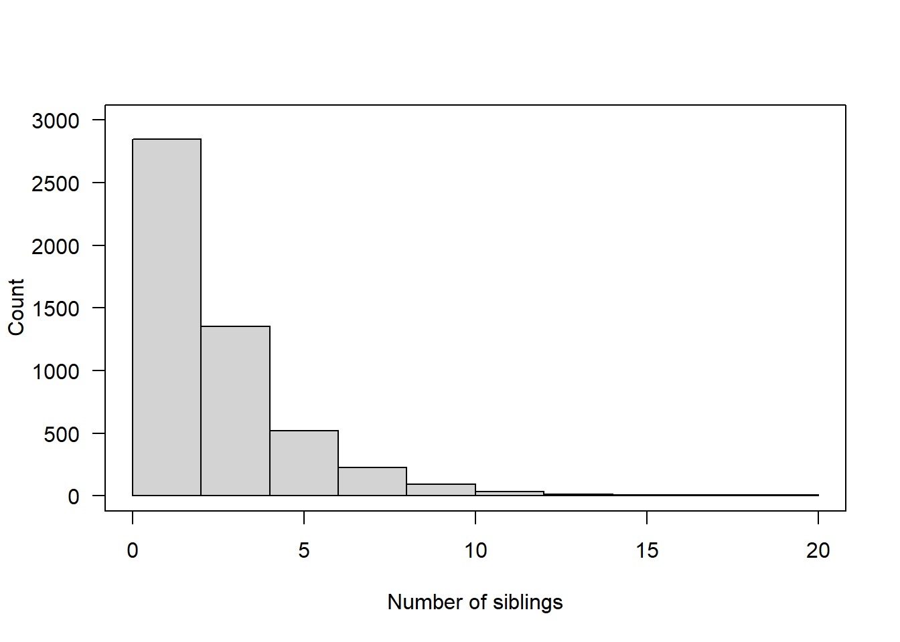

# Generalized Linear Models {#glm}


One of the primary assumptions with linear regression, is that the error terms have a specific distribution. Namely: 

$$ \epsilon_{i} \sim \mathcal{N}(0, \sigma^{2}) \qquad i=1, \ldots, n, \quad \mbox{and } \epsilon_{i} \perp \epsilon_{j}, i \neq j $$

When your outcome variable $y$ is non-continuous/non-normal, the above assumption fails dramatically. 

Generalized Linear Models (GLM) allows for different data type outcomes by allowing the linear portion of the model ($\mathbf{X}\beta$) to be related to the outcome variable $y$ using a _link_ function, that allows the magnitude of the variance of the errors ($\sigma$) to be related to the predicted values themselves. 

There are a few overarching types of non-continuous outcomes that can be modeled with GLM's. 

* Binary data: Logistic or Probit regression
* Log-linear models
* Multinomial/categorical data: Multinomial or Ordinal Logistic regression. 
* Count data: Poisson regression


## Fitting GLMs 

Generalized linear regression models can be fit in R using the `glm()` function. This function can fit an entire _family_ of distributions and can be thought of as $E(Y|X) = C(X)$ where $C$ is the **link** function that relates $Y$ to $X$.

* Linear regression: C = Identity function (no change)
* Logistic regression: C = logit function
* Poisson regression: C = log function

Here is some guidance on code to fit Logistic regression models. 

### R

The general syntax is similar to `lm()`, with the additional required `family=` argument. See `?family` for a list of options. 


```r
glm(y ~ x1 + x2 + x3, data=DATA, family="binomial")
```

### SPSS 

File menu: `Regression` --> Binary Logistic. 

Syntax: 

```
logistic regression Y with x1 x2 x3
   /categorical = x2
```

https://www.ibm.com/support/knowledgecenter/en/SSLVMB_26.0.0/statistics_reference_project_ddita/spss/regression/syn_logistic_regression_overview.html

### Stata

`logistic Y x1 x2`

https://www.stata.com/features/overview/logistic-regression/


## Binary outcome data

Consider an outcome variable $Y$ with two levels: Y = 1 if event, = 0 if no event. 

Let $p_{i} = P(y_{i}=1)$. 

Two goals: 

* Assess the impact selected covariates have on the probability of an outcome occurring. 
* Predict the probability of an event occurring given a certain covariate pattern. This is covered in section \@ref(binary-classification)

Binary data can be modeled using a _Logistic Model_ or a _Probit Model_. 

The logistic model relates the probability of an event based on a linear combination of X's. 

$$
log\left(
\frac{p_{i}}{1-p_{i}}
\right) = \beta_{0} + \beta_{1}x_{1i} + \beta_{2}x_{2i} + \ldots + \beta_{p}x_{pi}
$$

Since the _odds_ are defined as the probability an event occurs divided by the  probability it does not occur: $(p/(1-p))$, the function $log\left(\frac{p_{i}}{1-p_{i}}\right)$ is also known as the _log odds_, or more commonly called the **_logit_**. This is the _link_ function for the logistic regression model. 


This in essence takes a binary outcome 0/1 variable, turns it into a continuous probability (which only has a range from 0 to 1) Then the logit(p) has a continuous distribution ranging from $-\infty$ to $\infty$, which is the same form as a Multiple Linear Regression (continuous outcome modeled on a set of covariates)


The probit function uses the inverse CDF for the normal distribution as the link function. The effect of the transformation is very similar. For social science interpretation of the coefficients, we tend to choose the _logit_ transformation and conduct a Logistic Regression. For classification purposes, often researchers will test out both transformations to see which one gives the best predictions. 


## Logistic Regression

Since the link between $X$ and $Y$ is no longer linear, a one unit increase in $X_{p}$ is no longer associated with a $b_{p}$ increase in $Y$. The regression coefficients $b_{p}$ from a logistic regression must be _exponentiated_ before interpretation.  

$$OR = e^{b}$$

The Odds Ratio (OR) provides a directly understandable statistic for the relationship between $y$ and a specific $x$ given all other $x$'s in the model are fixed. A later example in \@ref(mlogreg) provides a numeric example of how Odds Ratios are calculated. 

In testing for a relationship between $x$ and $y$, our hypothesis is that $\beta_{p}=0$. Since $e^{0}=1$, the reference value for the Odds Ratio that signifies no relationship, is 1, not 0. 


### Interpreting Odds Ratios

Consider a binary outcome with values YES, coded as 1, and NO, coded as 0. 

* **OR = 1** = equal chance of response variable being YES given any explanatory variable value. You are not able to predict participants’ responses by knowing their explanatory variable value. This would be a non significant model when looking at the p-value for the explanatory variable in the parameter estimate table.
* **OR > 1** = as the explanatory variable value increases, the presence of a YES response is more likely. We can say that when a participant’s response to the explanatory variable is YES (1), they are more likely to have a response that is a YES (1). 
* **OR <1** = as the explanatory variable value increases, the presence of a YES response is less likely. We can say that when a participant’s response to the explanatory variable is YES (1) they are less likely to have a response that is a YES (1). 

For a continuous variable X with slope coefficient $\beta$, the quantity $e^{b}$ is interpreted as the ratio of the odds for a person with value (X+1) relative to the odds for a person with value X. 


**Confidence Intervals**

Confidence intervals are a range for the population’s predicted odds ratio based on the sample data. We are 95% confident that any given population’s odds ratio would range between those two values. 

The OR is **not** a linear function of the $x's$, but $\beta$ is. This means that a CI for the OR is created by calculating a CI for $\beta$, and then exponentiating the endpoints. A 95% CI for the OR is calculated as: 

$$e^{\hat{\beta} \pm 1.96 SE_{\beta}} $$


### Example: The effect of gender on Depression {#logreg-dep-ex}

This uses a cleaned version of the depression data set from PMAS5. 

* Binary outcome variable: Symptoms of Depression (`cases`)
* Binary predictor variable: Gender (`sex`) as an indicator of being female

The outcome $y$ is a 0/1 Bernoulli random variable. The sum of a vector of Bernoulli's ($\sum_{i=1}^{n}y_{i}$) has a Binomial distribution. When we specify that `family = "binomial"` the `glm()` function auto-assigns "logit" link function. 


```r
dep_sex_model <- glm(cases ~ sex, data=depress, family="binomial")
summary(dep_sex_model)
## 
## Call:
## glm(formula = cases ~ sex, family = "binomial", data = depress)
## 
## Deviance Residuals: 
##     Min       1Q   Median       3Q      Max  
## -0.7023  -0.7023  -0.4345  -0.4345   2.1941  
## 
## Coefficients:
##             Estimate Std. Error z value Pr(>|z|)    
## (Intercept)  -2.3125     0.3315  -6.976 3.04e-12 ***
## sex           1.0386     0.3767   2.757  0.00583 ** 
## ---
## Signif. codes:  0 '***' 0.001 '**' 0.01 '*' 0.05 '.' 0.1 ' ' 1
## 
## (Dispersion parameter for binomial family taken to be 1)
## 
##     Null deviance: 268.12  on 293  degrees of freedom
## Residual deviance: 259.40  on 292  degrees of freedom
## AIC: 263.4
## 
## Number of Fisher Scoring iterations: 5
```

We exponentiate the coefficients to back transform the $\beta$ estimates into Odds Ratios

```r
exp(coef(dep_sex_model))
## (Intercept)         sex 
##   0.0990099   2.8251748
exp(confint(dep_sex_model))
##                  2.5 %    97.5 %
## (Intercept) 0.04843014 0.1801265
## sex         1.39911056 6.2142384
```

Females have 2.8 (1.4, 6.2) times the odds of showing signs of depression compared to males. 


### Multiple Logistic Regression {#mlogreg}
Let's continue with the depression model, but now also include age and income as potential predictors of symptoms of depression. 


```r
mvmodel <- glm(cases ~ age + income + sex, data=depress, family="binomial")
summary(mvmodel)
## 
## Call:
## glm(formula = cases ~ age + income + sex, family = "binomial", 
##     data = depress)
## 
## Deviance Residuals: 
##     Min       1Q   Median       3Q      Max  
## -1.0249  -0.6524  -0.5050  -0.3179   2.5305  
## 
## Coefficients:
##             Estimate Std. Error z value Pr(>|z|)   
## (Intercept) -0.67646    0.57881  -1.169  0.24253   
## age         -0.02096    0.00904  -2.318  0.02043 * 
## income      -0.03656    0.01409  -2.595  0.00946 **
## sex          0.92945    0.38582   2.409  0.01600 * 
## ---
## Signif. codes:  0 '***' 0.001 '**' 0.01 '*' 0.05 '.' 0.1 ' ' 1
## 
## (Dispersion parameter for binomial family taken to be 1)
## 
##     Null deviance: 268.12  on 293  degrees of freedom
## Residual deviance: 247.54  on 290  degrees of freedom
## AIC: 255.54
## 
## Number of Fisher Scoring iterations: 5
```

* The sign of the $\beta$ coefficients can be interpreted in the same manner as with linear regression as having a positive or negative relationship.  
* The odds of being depressed are less if the respondent has a higher income and is older, and higher if the respondent is female. 

> The odds of a female being depressed are 2.53 times greater than the odds for Males after adjusting for the effects of age and income (p=.016). 

**Example calculation for $OR = e^{\beta}$**

The full model is: 
$$log(odds) = -0.676 - 0.02096*age - .03656*income + 0.92945*gender$$

We want to calculate the Odds Ratio of depression for women compared to men. 
$$ OR = \frac{Odds (Y=1|F)}{Odds (Y=1|M)} $$

Write out the equations for men and women separately. 
$$ = \frac{e^{-0.676 - 0.02096*age - .03656*income + 0.92945(1)}}
          {e^{-0.676 - 0.02096*age - .03656*income + 0.92945(0)}}$$

Applying rules of exponents to simplify.
$$ = \frac{e^{-0.676}e^{- 0.02096*age}e^{- .03656*income}e^{0.92945(1)}}
          {e^{-0.676}e^{- 0.02096*age}e^{- .03656*income}e^{0.92945(0)}}$$

$$ = \frac{e^{0.92945(1)}}
          {e^{0.92945(0)}}$$

$$ = e^{0.92945} $$


```r
exp(.92945)
## [1] 2.533116
exp(coef(mvmodel)[4])
##      sex 
## 2.533112
```


### Effect of a k unit change

* Sometimes a 1 unit change in a continuous variable is not meaningful. 
* $exp(kb)$ is the incremental odds ratio corresponding to an increase of $k$ units in the variable X, assuming that the values of all other X variables remain unchanged. 


```r
exp(coef(mvmodel))
## (Intercept)         age      income         sex 
##   0.5084157   0.9792605   0.9640969   2.5331122
exp(confint(mvmodel))
##                 2.5 %    97.5 %
## (Intercept) 0.1585110 1.5491849
## age         0.9615593 0.9964037
## income      0.9357319 0.9891872
## sex         1.2293435 5.6586150
```

* The Adjusted odds ratio (AOR) for increase of 1 year of age is 0.98 (95%CI .96, 1.0)
* How about a 10 year increase in age? $e^{10*\beta_{age}} = e^{-.21} = .81$


```r
exp(10*coef(mvmodel)[2])
##       age 
## 0.8109285
```
with a confidence interval of

```r
round(exp(10*confint(mvmodel)[2,]),3)
##  2.5 % 97.5 % 
##  0.676  0.965
```

Controlling for gender and income, an individual has 0.81 (95% CI 0.68, 0.97) times the odds of being depressed compared to someone who is 10 years younger than them. 


#### Example: Predictors of smoking status

Consider a logistic model on smoking status (0= never smoked, 1=has smoked) using gender, income, and blood pressure class (`bp_class`) as predictors. 

$$
logit(Y) = \beta_{0} + \beta_{1}\mbox{(female)} + \beta_{2}\mbox{(income)} + \beta_{3}\mbox{(Pre-HTN)} 
+ \beta_{4}\mbox{(HTN-I)} + \beta_{5}\mbox{(HTN-II)}
$$


```r
bp.mod <- glm(smoke ~ female_c + income + bp_class, data=addhealth, family='binomial')
pander(summary(bp.mod))
```


---------------------------------------------------------------------
       &nbsp;           Estimate    Std. Error   z value   Pr(>|z|)  
--------------------- ------------ ------------ --------- -----------
   **(Intercept)**       1.046        0.1064      9.836    7.881e-23 

 **female_cFemale**     -0.6182      0.07617     -8.117    4.798e-16 

     **income**        -3.929e-06   1.411e-06    -2.785    0.005346  

 **bp_classPre-HTN**    0.07289      0.08206     0.8882     0.3745   

  **bp_classHTN-I**     -0.02072      0.1093     -0.1895    0.8497   

 **bp_classHTN-II**     0.02736       0.1888     0.1449     0.8848   
---------------------------------------------------------------------


(Dispersion parameter for  binomial  family taken to be  1 )


-------------------- ---------------------------
   Null deviance:     4853  on 3728  degrees of 
                               freedom          

 Residual deviance:   4769  on 3723  degrees of 
                               freedom          
-------------------- ---------------------------

It is unlikely that blood pressure is associated with smoking status, all groups are not statistically significantly different from the reference group (all p-values are large). Let's test that hypothesis formally using a Wald Test. 


```r
survey::regTermTest(bp.mod, "bp_class")
## Wald test for bp_class
##  in glm(formula = smoke ~ female_c + income + bp_class, family = "binomial", 
##     data = addhealth)
## F =  0.428004  on  3  and  3723  df: p= 0.73294
```

The Wald Test has a large p-value of 0.73, thus blood pressure classification is not associated with smoking status.

* This means blood pressure classification should not be included in a model to explain smoking status. 


## Log-linear models

A *log-linear* model is when the log of the response variable is modeled using a linear combination of predictors. 

$$ln(Y) \sim XB +\epsilon$$

Recall that in statistics, when we refer to the _log_, we mean the natural log _ln_.

This type of model is often use for Poisson models also (Section \@ref(poisson-models)). 

Why are we transforming the outcome? Typically to achieve normality when the response variable is highly skewed. 

**Interpreting results**

This is hands down the best reference that describes how to interpret the results when your response, predictor, or both variables are log transformed. 

https://stats.idre.ucla.edu/other/mult-pkg/faq/general/faqhow-do-i-interpret-a-regression-model-when-some-variables-are-log-transformed/


### Example
We are going to analyze personal income from the AddHealth data set. First I need to clean up, and log transform the variable for personal earnings `H4EC2` by following the steps below _in order_. 

1. Remove values above 999995 (structural missing). 
3. Create a new variable called `income`, that sets all values of personal income to be NA if below the federal poverty line. 
    - First set `income= H4EC2`
    - Then set income to missing, if `H4EC2 < 10210` (the federal poverty limit from 2008)
4. Then create a new variable: `logincome` that is the natural log (_ln_) of income. e.g. `addhealth$logincome = log(addhealth$income)`

Why are we transforming income? To achieve normality. 

```r
par(mfrow=c(2,2))
hist(addhealth$income, probability = TRUE); lines(density(addhealth$income, na.rm=TRUE), col="red")
hist(addhealth$logincome, probability = TRUE); lines(density(addhealth$logincome, na.rm=TRUE), col="blue")
qqnorm(addhealth$income); qqline(addhealth$income, col="red")
qqnorm(addhealth$logincome); qqline(addhealth$logincome, col="blue")
```


**Identify variables**

* Quantitative outcome that has been log transformed: Income (variable `logincome`)
* Binary predictor: Ever smoked a cigarette (variable `eversmoke_c`)
* Binary confounder: Gender (variable `female_c`)
 
The mathematical multivariable model looks like: 

$$ln(Y) \sim \beta_{0} + \beta_{1}x_{1} + \beta_{2}x_{2}$$


Similar to logistic regression, we need to _exponentiate_ the regression coefficient before we can interpret the number as a **percentage** change in $Y$ for a unit increase in $x_{j}$.

* **$b_{j}<1$** : The expected value of $Y$ for when $x=0$ is $1 - e^{b_{j}}$ percent _lower_ than when $x=1$
* **$b_{j} \geq 1$** : The expected value of $Y$ for when $x=0$ is $e^{b_{j}}$ percent _higher_ than when $x=1$


```r
ln.mod.2 <- lm(logincome~wakeup + female_c, data=addhealth)
summary(ln.mod.2) %>% pander()
```


------------------------------------------------------------------
       &nbsp;         Estimate   Std. Error   t value   Pr(>|t|)  
-------------------- ---------- ------------ --------- -----------
  **(Intercept)**      10.65       0.026       409.8        0     

     **wakeup**       -0.01491    0.003218    -4.633    3.73e-06  

 **female_cFemale**   -0.1927      0.017      -11.34    2.564e-29 
------------------------------------------------------------------


---------------------------------------------------------------
 Observations   Residual Std. Error    $R^2$    Adjusted $R^2$ 
-------------- --------------------- --------- ----------------
     3813             0.5233          0.03611       0.0356     
---------------------------------------------------------------

Table: Fitting linear model: logincome ~ wakeup + female_c

```r
1-exp(confint(ln.mod.2)[-1,])
##                     2.5 %      97.5 %
## wakeup         0.02099299 0.008561652
## female_cFemale 0.20231394 0.147326777
```
* For every hour later one wakes up in the morning, one can expect to earn `1-exp(-0.015)` = 1.4% less income than someone who wakes up one hour earlier. This is after controlling for gender. 
* Females have on average `1-exp(-0.19)` = 17% percent lower income than males, after controlling for the wake up time. 

Both gender and time one wakes up are significantly associated with the amount of personal earnings one makes. Waking up later in the morning is associated with 1.4% (95% CI 0.8%-2%, p<.0001) percent lower income than someone who wakes up one hour earlier. Females have 17% (95% CI 15%-20%, p<.0001) percent lower income than males. 


## Count outcome data

Lets consider modeling the distribution of the number of of occurrences of a rare event in a specified period of time
    - e.g. Number of thunderstorms in a year

* If we assume:
    * Rate ($\mu$) is fixed over time
    * Successive occurrences independent of each other

Then we can use the **Poisson distribution**.

$$
P(Y=y) = e^{-\mu}\frac{\mu^{y}}{y!}
$$

* The Poisson distribution has a distinct feature where the mean of the distribution $\mu$, is also the variance. 


#### Poisson Regression {#poisson-models}

Just another GLM - we use a $ln$ as the link function. This lets us model the log rates using a linear combination of covariates. 

$$
  ln(\mu) = \mathbf{X}\beta
$$

Then the expected rate of events per unit of time is: 

$$
  \mu = e^{\mathbf{X}\beta}
$$

This model assumes that the time of "exposure" for each record is identical. 

*  Number of cigarettes per month
* Number of epileptic seizures per week
* Number of people with lung cancer in four cities
    
If this is not the case (often), then this model needs to include an _offset_. 

* e.g. observing each patient for epileptic seizures for a different number of days
* accounting for different sizes or structures of populations of interest (e.g. different cities with lung cancer)
  

What actually gets fit in `glm` is the model of expected _counts_, rather than rates, with an offset for the time period $T$. 

* If all time periods are the same, then T is constant, and a linear combination of the intercept, thus dropped from the model. 

$$
  ln(\lambda) = \mathbf{X}\beta + ln(T)
$$

While this offset will be added to the regression model as if it were another variable, it's not quite the same because the regression coefficient for the $ln(T)$ term is fixed at 1. 

The generic formula for fitting a poisson model using `glm` is: 

```r
glm(y ~ x1 + x2 + offset(log(T)), family='poisson')
```
or alternatively as an argument

```r
glm(y ~ x1 + x2, offset = log(T),  family='poisson')
```

The interpretation of the $\beta$ regression coefficients are differences in the log rate (or the log rate-ratio). So, just like with a logistic regression often we back-transform the coefficients by exponentiating before interpreting. So $e^{\beta}$ is now the rate-ratio. 

* The intercept term is not a ratio, but a baseline rate when all covariates are 0
* For other covariates, the coefficient is the relative change _per unit_ change in the covariate. 
    - one year older
    - males vs females
    
Also, similar to logistic regression, since the outcome was transformed, the standard errors are not useful or interpretable as is. To calculate confidence intervals for the rate ratios, 

1. calculate the CI for $\beta$
2. exponentiate each end point. 


#### Example: Modeling counts from the Add Health data Wave IVset. 

**better example forthcoming**

Let's model the number of siblings someone has, based off their age at Wave 1 (2008).


Visualize

```r
hist(addhealth$nsib, xlab="Number of siblings", ylab="Count", main="",axes=FALSE, ylim=c(0,3000))
axis(1);axis(2, las=2);box()
```




```r
nsib.model <- glm(nsib ~ agew1 + female, data=addhealth, family="poisson")
pander(summary(nsib.model))
```


---------------------------------------------------------------
     &nbsp;        Estimate   Std. Error   z value   Pr(>|z|)  
----------------- ---------- ------------ --------- -----------
 **(Intercept)**    0.2647      0.1014      2.611    0.009019  

    **agew1**       0.0443     0.005989     7.397    1.39e-13  

   **female**       0.0969     0.01909      5.076    3.851e-07 
---------------------------------------------------------------


(Dispersion parameter for  poisson  family taken to be  1 )


-------------------- ---------------------------
   Null deviance:     6411  on 3917  degrees of 
                               freedom          

 Residual deviance:   6335  on 3915  degrees of 
                               freedom          
-------------------- ---------------------------


```r
betas <- cbind(coef(nsib.model), confint(nsib.model))
kable(exp(betas), digits=3)
```

<table>
 <thead>
  <tr>
   <th style="text-align:left;">   </th>
   <th style="text-align:right;">  </th>
   <th style="text-align:right;"> 2.5 % </th>
   <th style="text-align:right;"> 97.5 % </th>
  </tr>
 </thead>
<tbody>
  <tr>
   <td style="text-align:left;"> (Intercept) </td>
   <td style="text-align:right;"> 1.303 </td>
   <td style="text-align:right;"> 1.068 </td>
   <td style="text-align:right;"> 1.589 </td>
  </tr>
  <tr>
   <td style="text-align:left;"> agew1 </td>
   <td style="text-align:right;"> 1.045 </td>
   <td style="text-align:right;"> 1.033 </td>
   <td style="text-align:right;"> 1.058 </td>
  </tr>
  <tr>
   <td style="text-align:left;"> female </td>
   <td style="text-align:right;"> 1.102 </td>
   <td style="text-align:right;"> 1.061 </td>
   <td style="text-align:right;"> 1.144 </td>
  </tr>
</tbody>
</table>


## Categorical outcome data

If you want to keep the response variable as a categorical variable with more than two levels, the following regression model types are available: 


* Ordinal Logistic Regression
* Multinomial Regression


