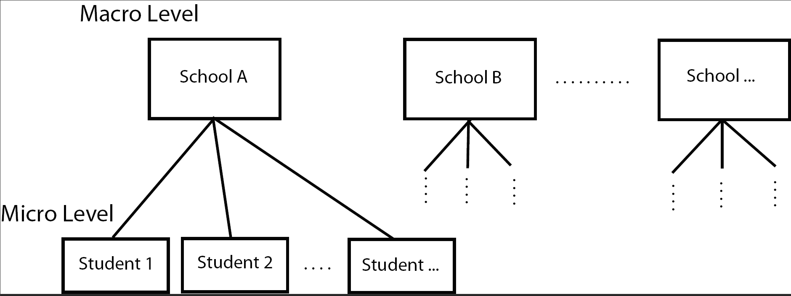

# (PART) Multi-level Modeling {-}

# Introduction

When outcome data are expected to be more similar within subgroups than across subgroups the data are typically called **Clustered outcomes**. There are many ways data can be correlated: 

* Sampling students within schools. (Within school correlation)
* Repeatedly measuring the same tree in different places. (Within-subject correlation)
* Repeatedly measuring the same tree over time. (Temporal correlation)
* Poverty measurements from different, but neighboring, counties. (Spatial correlation)

In these cases, the assumption of independence between observations is often violated $Cor(\epsilon_i, \epsilon_j)\neq 0, \forall i\neq j$. 

Analyses should take into account such correlation or else conclusions might not be valid.

Correlation is not limited to one level of subgroup; i.e. repeated measurements on students within schools. 

Models that account for multiple levels of clustering are often called multi-level models. 

\BeginKnitrBlock{rmdnote}
Multi-level modeling can also be referred to as Hierarchical modeling
\EndKnitrBlock{rmdnote}

Terminology: Fixed Effects vs Random Effects

* **Fixed Effects**: The variable is thought to have it's own specific effect on the outcome relative to some reference group. The factors are fixed by nature, there are only the levels observed in the data.  
    - The 23 schools in the data make up the entire universe of schools, and we are interested in how one particular school fares. 
* **Random Effects**: The variable was chosen at random, and the levels observed in the data are thought of as representative of all possible levels that could be sampled. We are interested in the distribution of the effects rather than the effect of any one specific level. 
    - The 23 schools in the data set is a sample of a larger population of schools and we are interested in the overall distribution of how school can affect the math score, not any one specific school. 
    
    
    
## Example School Data 

The data used in this first example comes from a publicly available data set called the National Education Longitudinal Study of 1988 (yes it's a bit old data, but sufficient for our purposes here). In this data set math scores are recorded for 519 students from 23 schools. 

 List a few characteristics that you think are associated with math performance, and at what level they are measured. 

The `School23` data set contains the following variables: 

* **School (macro) level variables**
    - School type
    - class structure
    - school size
    - urbanity
    - geographic region
    - percent minority
    - student-teacher ratio
* **Student (micro) level variables**
    - Gender
    - Race
    - Time spent on math homework
    - SES
    - parental education
    - math score

    
Imagine a model of math score based on school type ($X_{1}$ 1 for public, 0 for private) and SES ($X_{2}$). 

\[
Y_{i} = \beta_{0} + \beta_{1}X_{1i} + \beta_{2}X_{2i} + \epsilon_{i}, \qquad i = 1, \ldots, n=519
\]

This model does not take into the account the hierarchical nature of the data in that students are nested within schools. School type is a macro level variable, SES is a micro level variable. We could consider adding indicator variables for each of the 23 schools to create a **Fixed Effects** model,  

\[
Y_{i} = \beta_{0} + \beta_{1}(SchoolType)_{1i} + \beta_{2}(SES)_{2i} + \beta_{3}(School2)_{i} + \ldots + \beta_{24}(School23)_{i} + \epsilon_{i}
\]

but we already are well aware of fitting models with that many parameters, and when some school only have a few students in them. So we need a different model. 

## Multi-level models

Here we specify separate models for the the fixed micro level effect of SES and the random macro level school effect. 

\begin{equation*}
  \begin{aligned}
  MathScore_{ij} & = \beta_{0j} + \beta_{1}SES_{ij} + \epsilon_{ij}, & \qquad i = 1, \ldots, n_{j}\\
  \beta_{0j} & = \gamma_{00} + U_{0j}, & \qquad j=1, \ldots, 23
  \end{aligned}
\end{equation*}

where 

* $\gamma_{00}$ is the average intercept across all schools
* $U_{0j}$ is the difference between the intercept for school $j$ and the average intercept across all schools (random effect of school)

If we substitute the intercept $\beta_{0j}$ in the first model with the information from the second model, 

\[
  MathScore_{ij} = \overbrace{\gamma_{00} + \beta_{1}SES_{ij}}^{^{\mbox{fixed part}}} + \overbrace{U_{0j} + \epsilon_{ij}}^{\mbox{random part}}
\]

Instead of assuming that there is an overall average of math scores ($\beta_0$) from which each school deviates by a fixed amount, the above model assumes that the adjusted average school math scores are normally distributed and are centered at $\gamma_{00}$. 

Because we assume that there is a _distribution of intercepts_, this model is also called a **Random intercept model**.

We'll look at this type of model more closely in the next section using a different example, and using the concept of _pooling_ information. 

 Random Slopes

More complex models are possible. That's a constant theme in all of statistical modeling. Just remember that 

* the underlying complex effects being modeled must be strong enough that a simpler model that doesn't account for these effects will be invalid
* you have to have enough data to estimate any additional parameters
* you have to be able to explain the model and results to an audience

We are not going to cover models that have random slopes, or interactions between fixed and random effects in this notebook. 

