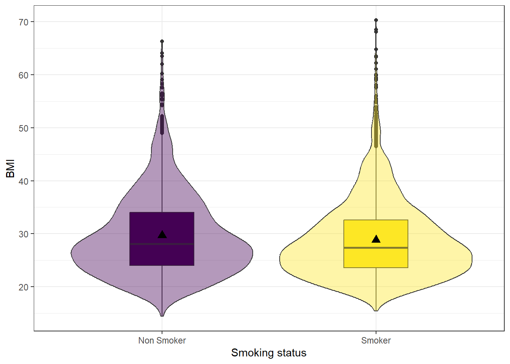
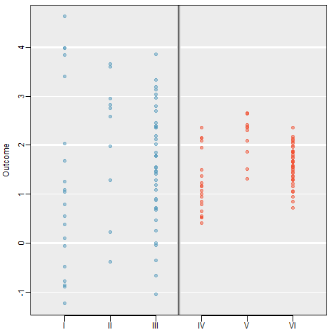
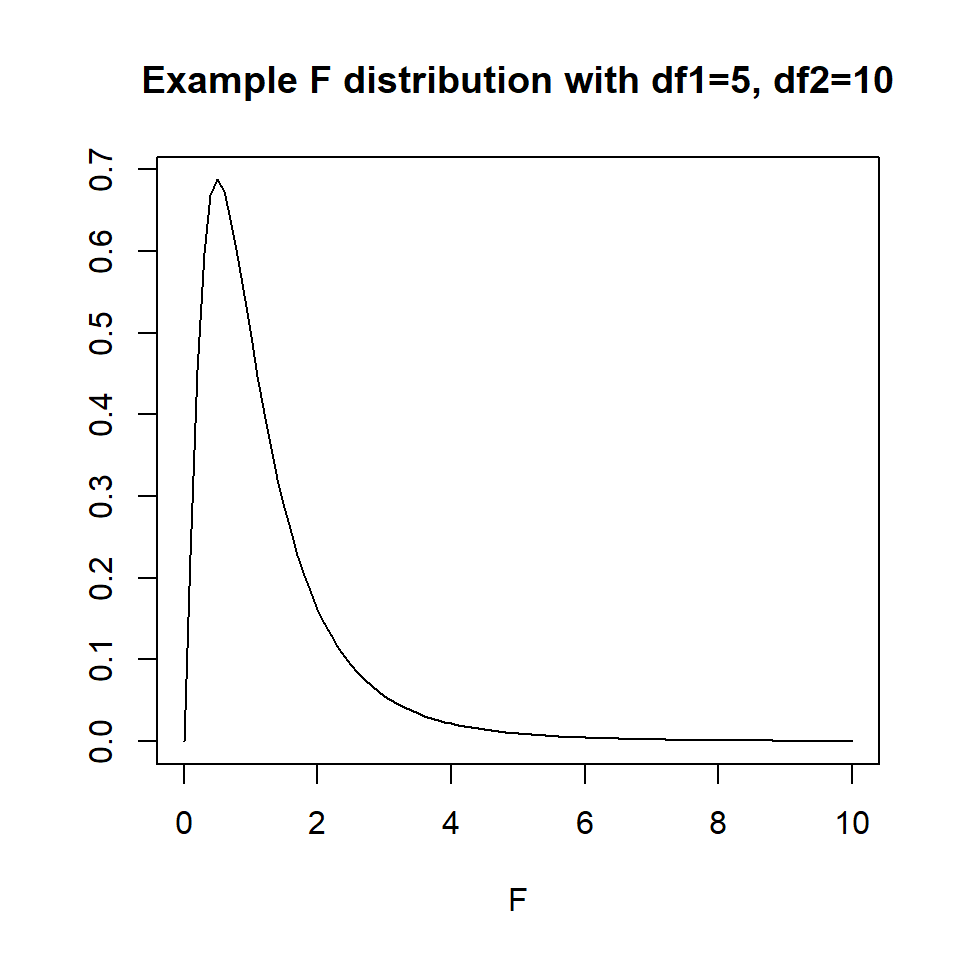
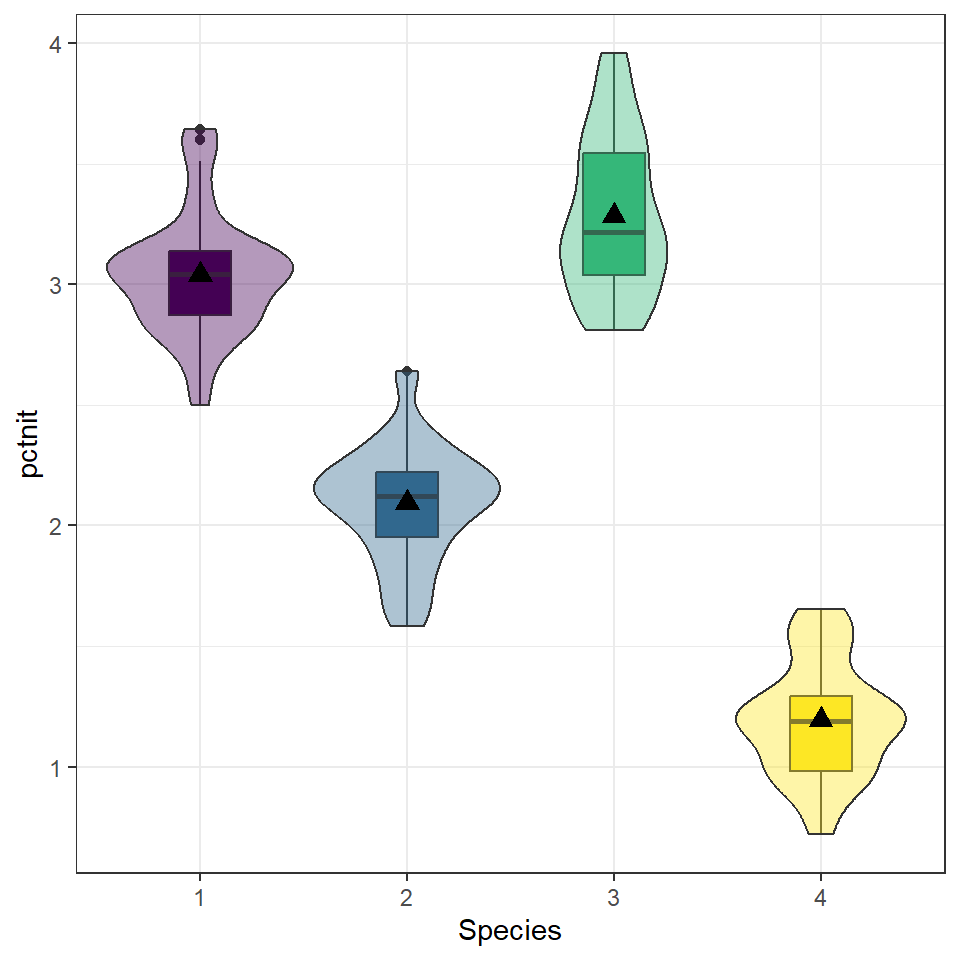
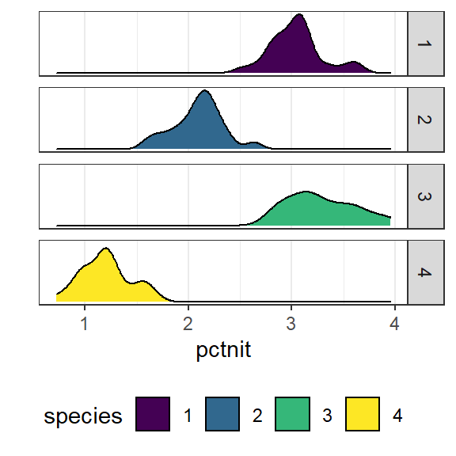
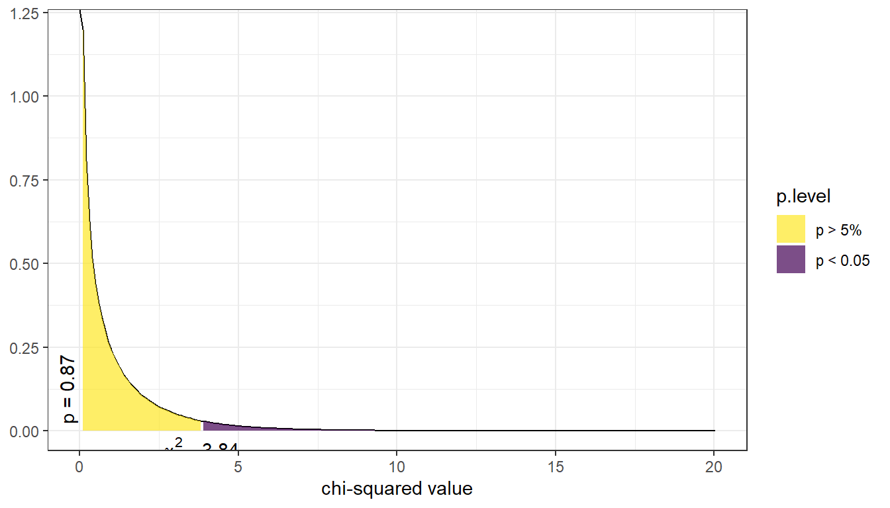
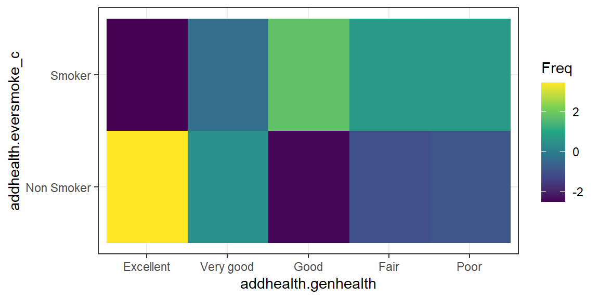
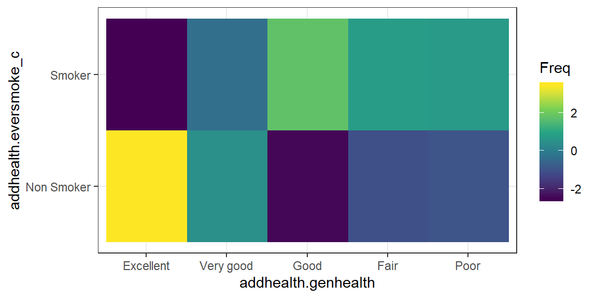

# Bivariate Analysis

So far we have been concerned with making inference about a single population parameter. 
Many problems deal with comparing a parameter across two or more groups. Research 
questions include questions like: 

* Does the average life span differ across subspecies of a particular turtle?
* Who has a higher percentage of the female vote - Democrats or Republicans?


A good way to think about all statistical models is that the observed data comes from some true model with some random error.

> DATA = MODEL + RESIDUAL

The `MODEL` is a mathematical formula (like $y = f(x)$). 
The formulation of the `MODEL` will change depending on the number of, and data types of explanatory variables. One goal of inferential analysis is to explain the variation in our data, using information contained in other measures. 


## Assumption of Independent Observations

The primary assumption of most standard statistical procedures is that observations are
independent of each other. That is, the value of one observation does not change or affect another observation. 
However, there are many examples where measurements are made 
on subjects before and after a certain exposure or treatment (pre-post), or an 
experiment to compare two cell phone packages might use pairs of subjects that 
are the same age, sex and income level. One subject would be randomly assigned 
to the first phone package, the other in the pair would get the second phone package. 
This chapter only deals with non-correlated analyses, leaving that topic for a later chapter. 

## Choosing appropriate bivariate analysis

Choosing which statistical analyses procedure is appropriate completely depending on the data types of the explanatory and response variable. This is a simplified table, only covering the common/standard types of bivariate analysis. 


> figure out how to get table here. 

For this set of notes, the variable types are referred to using the first letter, 
e.g. *Q* for quantitative, *B* for binary, and *C* for categorical. 
Thus a T-test is a (Q $\sim$ B) analysis, and a correlation analysis is (Q $\sim$ Q) analysis. 


Links to the example data used in this chapter. 

```r
load(url("https://norcalbiostat.netlify.com/data/addhealth_clean.Rdata"))
county <- read.csv("https://norcalbiostat.netlify.com/data/countyComplete.csv", header=TRUE, stringsAsFactors = FALSE)
```

----

## (Q~B) Two means: T-Test {#bv-ttest}


It is common to compare means from different samples. For instance, we
might investigate the effectiveness of a certain educational intervention
by looking for evidence of greater reading ability in the treatment group
against a control group. That is, our research hypothesis is that reading
ability of a child is associated with an educational intervention.

The null hypothesis states that there is no relationship, or no effect, of
the educational intervention (binary explanatory variable) on the reading ability
of the child (quantitative response variable). This can be written in symbols as follows:


$$H_{0}: \mu_{1} = \mu_{2}\mbox{ or }\qquad  H_{0}: \mu_{1} -\mu_{2}=0$$

where $\mu_{1}$ is the average reading score for students in the control group (no intervention)
and $\mu_{2}$ be the average reading score for students in the intervention group. Notice it can be written as one mean equals the other, but also as the difference between two means equaling zero. 
The alternative hypothesis $H_{A}$ states that there is a relationship:

$$H_{A}: \mu_{1} \neq \mu_{2} \qquad \mbox{ or } \qquad H_{A}: \mu_{1}-\mu_{2} \neq 0$$


### Assumptions
* The data distribution for each group is approximately normal.
* The scores are independent within each group.
* The scores from the two groups are independent of each other (i.e. the two samples are independent).


### Sampling Distribution for the difference

We use $\bar{x}_1 - \bar{x}_2$ as a point estimate for $\mu_1 - \mu_2$, which has a standard error of

$$
 SE_{\bar{x}_1 - \bar{x}_2}
   = \sqrt{SE_{\bar{x}_1}^2 + SE_{\bar{x}_2}^2}
 	 = \sqrt{\frac{\sigma^{2}_{1}}{n_1} + \frac{\sigma^{2}_{2}}{n_2}}
$$

So the equations for a Confidence Interval is, 

$$
  \left( \bar{x}_{1} - \bar{x}_{2} \right) \pm t_{\frac{\alpha}{2}, df}
    \sqrt{ \frac{\sigma^{2}_{1}}{n_{1}} + \frac{\sigma^{2}_{2}}{n_{2}} }
$$ 

and Test Statistic is, 

$$
  t^{*} =  \frac{\left( \bar{x}_{1} - \bar{x}_{2} \right) - d_{0}}
       {\left( \sqrt{ \frac{\sigma^{2}_{1}}{n_{1}} + \frac{\sigma^{2}_{2}}{n_{2}} }
       \right )} 
$$


Typically it is unlikely that the population variances $\sigma^{2}_{1}$ and $\sigma^{2}_{2}$ are known so we will use sample variances $s^{2}_{1}$ and $s^{2}_{2}$ as estimates. 

While you may never hand calculate these equations, it is important to see the format, or structure, of the equations. Equation \ref{2sampCImean} has the same format of 

$$ \mbox{point estimate} \pm 2*\mbox{standard error}$$

regardless what it is we're actually trying to estimate. Thus in a pinch, you can calculate approximate confidence intervals for whatever estimate you are trying to understand, given only the estimate and standard error, even if the computer program does not give it to you easily or directly. 


### Example: Smoking and BMI

We would like to know, is there convincing evidence that the average BMI differs between those who have ever smoked a cigarette in their life compared to those who have never smoked? This example uses the Addhealth dataset.


**1. Identify response and explanatory variables.**

* The quantitative response variable is BMI (variable \R{BMI})
* The binary explanatory variable is whether the person has ever smoked a cigarette (variable \R{eversmoke\_c})

**2. Visualize and summarize bivariate relationship.**

⚠️ Using `na.omit()` is dangerous! This will remove ALL rows with ANY missing data in it. Regardless if the missing values are contained in the variables you are interested in. 
The example below employs a trick/work around to not have NA values show in the output.
We take the data set `addhealth` _and then_ `select` the variables we want to plot, _and then_ we use `na.omit()` to delete all rows with missing data. Then that is saved as a new, temporary data frame specifically named for this case (`plot.bmi.smoke`). 

> note for later. Move this explanation into data viz section. 


```r
plot.bmi.smoke <- addhealth %>% select(eversmoke_c, BMI) %>% na.omit()

ggplot(plot.bmi.smoke, aes(x=eversmoke_c, y=BMI, fill=eversmoke_c)) +
      geom_boxplot(width=.3) + geom_violin(alpha=.4) +
      labs(x="Smoking status") +
      scale_fill_viridis_d(guide=FALSE) +
      stat_summary(fun.y="mean", geom="point", size=3, pch=17,
      position=position_dodge(width=0.75))
```




```r
plot.bmi.smoke %>% group_by(eversmoke_c) %>%
 summarise(mean=mean(BMI, na.rm=TRUE),
             sd = sd(BMI, na.rm=TRUE),
             IQR = IQR(BMI, na.rm=TRUE))
## # A tibble: 2 × 4
##   eversmoke_c  mean    sd   IQR
##   <fct>       <dbl> <dbl> <dbl>
## 1 Non Smoker   29.7  7.76  9.98
## 2 Smoker       28.8  7.32  9.02
```

Smokers have an average BMI of 28.8, smaller than the average BMI of non-smokers at 29.7. Nonsmokers have more variation in their BMIs (sd 7.8 v. 7.3 and IQR 9.98 v. 9.02), but the distributions both look normal, if slightly skewed right.


**3. Write the relationship you want to examine in the form of a research question.**

* Null Hypothesis: There is no relationship between BMI and smoking status.
* Alternate Hypothesis: There is a relationship between BMI and smoking status.


**4. Perform an appropriate statistical analysis.**

I. Let $\mu_1$ denote the average BMI for nonsmokers, and $\mu_2$ the average BMI for smokers.

II.
  $\mu_1 - \mu_2 = 0$ There is no difference in the average BMI between smokers and nonsmokers.
  $\mu_1 - \mu_2 \neq 0$ There is a difference in the average BMI between smokers and nonsmokers. 

III. We are comparing the means between two independent samples. A Two-Sample T-Test for a difference in means will be conducted. The assumptions that the groups are independent is upheld because each individual can only be either a smoker or nonsmoker. The difference in sample means $\bar{x_1} - \bar{x_2}$ is normally distributed -- this is a valid assumption due to the large sample size and that differences typically are normally distributed. The observations are independent, and the variability is roughly equal (IQR 9.9 v. 9.0).

IV. We use the `t.test` function, but use model notation of the format `outcome` $\sim$ `category`. Here, `BMI` is our continuous outcome that we're testing across the (binary) categorical predictor `eversmoke_c`.


```r
t.test(BMI ~ eversmoke_c, data=addhealth)
## 
## 	Welch Two Sample t-test
## 
## data:  BMI by eversmoke_c
## t = 3.6937, df = 3395.3, p-value = 0.0002245
## alternative hypothesis: true difference in means between group Non Smoker and group Smoker is not equal to 0
## 95 percent confidence interval:
##  0.3906204 1.2744780
## sample estimates:
## mean in group Non Smoker     mean in group Smoker 
##                 29.67977                 28.84722
```

We have very strong evidence against the null hypothesis, $p = 0.0002$.

**5. Write a conclusion in the context of the problem.**

On average, nonsmokers have a significantly higher BMI by 0.83 (0.39, 1.27) compared to nonsmokers ($p = 0.0002$).

⚠️ Always check the output against the direction you are testing. R always will calculate a difference as group 1 - group 2, and it defines the groups alphabetically. For example, for a factor variable that has groups A and B, R will automatically calculate the difference as A-B. In this example it is Nonsmoker - Smoker.


----

## (Q~C) Multiple means: ANOVA {#bv-anova}

Frequently, a researcher wants to compare the means of an outcome across three or more treatments in a single experiment. We might initially think to do pairwise comparisons (1v2, 1v3, 2v3) for a total of three comparisons. However, this strategy can be treacherous. If we have many groups and do many comparisons, it is likely that we will eventually find a difference just by chance, even if there is no difference in the populations.

When we analyze a conventional two-treatment experiment, we are prepared to run a 1 in 20 risk of an apparently significant result arising purely by accident (the 5% chance of a Type I error). We regard such a risk as being fairly unlikely and feel justified in accepting with confidence any significant results we obtain.

Analyzing a single experiment as a series of 10 treatment pairs is a very different proposition. The chance of an apparently significant result arising purely by chance somewhere in the 10 analyses increases dramatically. Using a 5% error rate, the chance of NOT making at Type I error is .95. To not make a Type I error 10 times is $.95^{10} = .6$. That means there is a 40% of making a Type I error! \emph{See: \url{https://xkcd.com/882/}.}

#### Example: Visual Comparison
Examine the figure below. Compare groups I, II, and III. Can you visually determine if the differences in the group centers is due to chance or not? What about groups IV, V, and VI?



So we need some method of comparing treatments for more than two groups at a time. 
This is done using an Analysis of Variance (ANOVA) model. 
### Terminology

* **Response Variable**: The response variable in the ANOVA setting is the quantitative (continuous) variable that we want to compare among the different treatments.
* **Factor/Treatment**: A property or characteristic (categorical variable) that allows us to distinguish the different populations from one another. An independent variable to be studied in an investigation such as temperature, type of plant, color of flower, location.
* **Factor/Treatment level**: Factors have different levels, such as 3 temperatures, 5 locations, 3 colors, etc.
* **Within-sample Variation**: Variation within a sample from one population. Individuals who receive the same treatment will experience identical experimental conditions. The variation within each of the treatment groups must therefore be a consequence of solely random variation. 
* **Between-sample Variation**: Variation between samples. This is the difference between the group means. If some treatments are genuinely more effective than others, then we would expect to see relatively large differences between the treatment means and a relatively large between-treatments variation. 


### Formulation of the One-way ANOVA model

ANOVA is a mathematical technique which uses a model based approach to partition the variance in an experiment into different sources of variance. This technique enables us to test if most the variation in the treatment means is due to differences between the groups.

Starting with our generic conceptual understanding of statistical models: 

> DATA = MODEL + RESIDUAL

our MODEL for this situation is the group membership. Does knowing what group an observation is in tell you about the location of the data? The one-way (or one-factor) ANOVA model is

$$
y_{ij} = \mu_{i} + \epsilon_{ij} \qquad \qquad
\epsilon_{ij} \overset{iid}{\sim} \mathcal{N}(0,\sigma^{2})
$$

for $i=1, \ldots, I$ factor levels and $j = 1, \ldots, n_{i}$ subjects within each factor level. The random error terms are independently and identically distributed (iid) normally with common variance. 

The null and alternative hypotheses are always phrased as follows: 

* $H_0$: The mean outcome is the same across all groups. $\mu_1 = \mu_2 = \cdots = \mu_k$
* $H_A$: At least one mean is different.

How do we compare means using an **AN**alysis **O**f **VA**riance? By comparing the portion of the variance in the outcome that is explained by the groups, to the portion that's leftover due to  unexplained randomness. Essentially we're comparing the ratio of `MODEL` to `RESIDUAL`. 

The total variation of the observed data is broken down into 2 parts:

> Total Variation = Between Group Variation + Within Group Variation

Variation is measured using the Sum of Squares (SS): The sum of the squares within a group (SSE), the sum of squares between groups (SSG), and the total sum of squares (SST).


**SSG (Between groups)**: Measures the variation of the $I$ group means around the overall mean.
$$
  SSG = \sum_{i=1}^{I}n_{i}(\bar{y}_{i.}-\bar{y}..)^{2} = n_{1}(\bar{y}_{1.}-\bar{y}..)^{2} + n_{2}(\bar{y}_{2.}-\bar{y}..)^{2} + n_{3}(\bar{y}_{3.}-\bar{y}..)^{2}
$$

**SSE (Within group)**: Measures the variation of each observation around its group mean.
$$
SSE = \sum_{i=1}^{I}\sum_{j=1}^{n_{i}}(y_{ij}-\bar{y}_{i.})^{2} = \sum_{i=1}^{I}(n_{i}-1)Var(Y_{i})
$$

**SST (Total)**: Measures the variation of the $N$ data points around the overall mean.
$$
SST =  \sum_{i=1}^{I}\sum_{j=1}^{n_{i}}(y_{ij}-\bar{y}..)^{2} = (N-1)Var(Y)
$$

### Analysis of Variance Table*: 

The results of an analysis of variance test are always summarized in an ANOVA table. The format of an ANOVA table is as follows:

+----------+--------+-------+---------------------------+-------+
| Source   | SS     | df    | MS                        | F     |
+:=========+:======:+:=====:+:=========================:+:=====:+
| Groups   | SSG    | $I-1$ | MSG = $\frac{SSG}{I-1}$   | $\frac{MSG}{MSE}$ |
+----------+--------+-------+---------------------------+-------+
| Error    | SSE    | $N-I$ | MSE = $\frac{MSG}{N-I}$   |
+----------+--------+-------+---------------------------+
|**Total** | **SST**| $N-1$ |       |
+----------+--------+-------+-------+


### The F-distribution

The $p$-value of the test is the **area to the right** of the F statistic density curve. This is always to the right because the F-distribution is not symmetric, truncated at 0 and skewed right. This is true regardless of the $df$.



### Assumptions

Generally we must check three conditions on the data before performing ANOVA:

* The observations are independent within and across groups
* The data within each group are nearly normal
* The variability across the groups is about equal.

When these three conditions are met, we may perform an ANOVA to determine whether the data provide strong evidence against the null hypothesis that all the $\mu_i$ are equal.


### Example: A comparison of plant species under low water conditions
The `PLANTS1` data file gives the percent of nitrogen in four different species of plants grown in a laboratory. The researchers collected these data in parts of the country where there is very little rainfall. To examine the effect of water, they varied the amount per day from 50mm to 650mm in 100mm increments. There were 9 plants per species-by-water combination. Because the plants are to be used primarily for animal food, with some parts that can be consumed by people, a high nitrogen content is very desirable. Let's formally test to see if the nitrogen content in the plants differ across species.


**1. Identify response and explanatory variables.**

* The quantitative response variable is % nitrogen (`pctnit`)
* The categorical explanatory variable is species (`species`)

**2. Visualize and summarize bivariate relationship.**

```r
plot.nitrogen.species <- plants1 %>% select(species, pctnit) %>% na.omit()

ggplot(plot.nitrogen.species, aes(x=species, y = pctnit, fill=species)) +
      geom_boxplot(width=.3) + geom_violin(alpha=.4) +
      labs(x="Species") +
      scale_fill_viridis_d(guide=FALSE) +
      stat_summary(fun.y="mean", geom="point", size=3, pch=17,
      position=position_dodge(width=0.75))
```




```r
plot.nitrogen.species %>% group_by(species) %>%
 summarise(mean=mean(pctnit, na.rm=TRUE),
             sd = sd(pctnit, na.rm=TRUE),
             IQR = IQR(pctnit, na.rm=TRUE)) %>% kable()
```

<table>
 <thead>
  <tr>
   <th style="text-align:left;"> species </th>
   <th style="text-align:right;"> mean </th>
   <th style="text-align:right;"> sd </th>
   <th style="text-align:right;"> IQR </th>
  </tr>
 </thead>
<tbody>
  <tr>
   <td style="text-align:left;"> 1 </td>
   <td style="text-align:right;"> 3.039810 </td>
   <td style="text-align:right;"> 0.2506118 </td>
   <td style="text-align:right;"> 0.2690 </td>
  </tr>
  <tr>
   <td style="text-align:left;"> 2 </td>
   <td style="text-align:right;"> 2.092841 </td>
   <td style="text-align:right;"> 0.2377523 </td>
   <td style="text-align:right;"> 0.2725 </td>
  </tr>
  <tr>
   <td style="text-align:left;"> 3 </td>
   <td style="text-align:right;"> 3.284365 </td>
   <td style="text-align:right;"> 0.3218599 </td>
   <td style="text-align:right;"> 0.5065 </td>
  </tr>
  <tr>
   <td style="text-align:left;"> 4 </td>
   <td style="text-align:right;"> 1.195587 </td>
   <td style="text-align:right;"> 0.2342217 </td>
   <td style="text-align:right;"> 0.3125 </td>
  </tr>
</tbody>
</table>

While the standard deviations are relatively similar across all species, the means are different (3.04 v. 2.09 v. 3.28 v. 1.20), with species 3 having the largest mean nitrogen content and species 4 the smallest. Species 3 has the highest IQR and species 1 has the lowest 0.506 v.\ 0.269).

**3. Write the relationship you want to examine in the form of a research question.**

* Null Hypothesis: There is no difference in the average nitrogen content among plant species 1 through 4.
* Alternative Hypothesis: There is a difference in the average nitrogen content among plant species 1 through 4.

**4. Perform an appropriate statistical analysis.**

I. Let $\mu_{1}$, $\ldots$, $\mu_{4}$ be the mean nitrogen content in plant species 1 through 4 respectively.

II.  
$H_{0}: \mu_{1} = \mu_{2} = \mu_{3} = \mu_{4}$  
$H_{A}:$ At least one mean is different.  

III. We are comparing means from multiple groups, so an ANOVA is the appropriate procedure. We need to check for independence, approximate normality and approximately equal variances across groups.
   
**Independence:** We are assuming that each plant was sampled independently of each other, and that the species themselves are independent of each other.
 
**Normality:** With grouped data it's easier to look at the histograms than qqplots.


```r
ggplot(plants1, aes(x=pctnit, fill=species)) + ylab("") + geom_density() + 
  facet_grid(species~.) +
  theme(legend.position="bottom") +
  scale_y_continuous(breaks=NULL) + scale_fill_viridis_d()
```



The distributions per group tend to follow an approximate normal distribution.

**Equal variances:** One way to assess if the groups have approximately equal variances is by comparing the IQR across groups.

```r
plants1 %>% group_by(species) %>% summarise(IQR = IQR(pctnit), SD = sd(pctnit)) %>% kable()
```

<table>
 <thead>
  <tr>
   <th style="text-align:left;"> species </th>
   <th style="text-align:right;"> IQR </th>
   <th style="text-align:right;"> SD </th>
  </tr>
 </thead>
<tbody>
  <tr>
   <td style="text-align:left;"> 1 </td>
   <td style="text-align:right;"> 0.2690 </td>
   <td style="text-align:right;"> 0.2506118 </td>
  </tr>
  <tr>
   <td style="text-align:left;"> 2 </td>
   <td style="text-align:right;"> 0.2725 </td>
   <td style="text-align:right;"> 0.2377523 </td>
  </tr>
  <tr>
   <td style="text-align:left;"> 3 </td>
   <td style="text-align:right;"> 0.5065 </td>
   <td style="text-align:right;"> 0.3218599 </td>
  </tr>
  <tr>
   <td style="text-align:left;"> 4 </td>
   <td style="text-align:right;"> 0.3125 </td>
   <td style="text-align:right;"> 0.2342217 </td>
  </tr>
</tbody>
</table>

The IQRs are similar so assumption of equal variances is not grossly violated. We can proceed with the ANOVA procedure.

IV. We use the `aov(response $\sim$ predictor)` function on the relationship between the nitrogen levels and tree species. We then pipe in `summary()` to make the output display nicely.


```r
aov(pctnit~species, data=plants1) %>% summary()
##              Df Sum Sq Mean Sq F value Pr(>F)    
## species       3 172.39   57.46   827.5 <2e-16 ***
## Residuals   248  17.22    0.07                   
## ---
## Signif. codes:  0 '***' 0.001 '**' 0.01 '*' 0.05 '.' 0.1 ' ' 1
```

**5. Write a conclusion in the context of the problem.**
The results of the ANOVA test indicate that at least one species has a different average nitrogen content than the other varieties ($p<$.001).


### Coefficient of determination $R^{2}$

The coefficient of determination is defined as $R^{2} = \frac{SSG}{SST}$ and can be interpreted as the \% of the variation seen in the outcome that is due to subject level variation within each of the treatment groups. The strength of this measure can be thought of in a similar manner as the correlation coefficient $r$: $< .3$ indicates a poor fit, $< .5$ indicates a medium fit, and $> .7$ indicates a good fit.


```r
172.39/(172.39+17.22)*100
## [1] 90.9182
```

A large amount (91%) of the variation seen in nitrogen content in the plant can be explained by the species of plant.


### Multiple Comparisons
Suppose that an ANOVA test reveals that there is a difference in at least one of the means. How can we determine which groups are significantly different without increasing our chance of a Type I error?

Simple! We perform all the pairwise comparisons but using a test statistic that retains a **family-wise error rate** of 0.05 (or our chosen $\alpha$). There are different methods to adjust for multiple comparisons, we will be using the **Tukey HSD (honest significant difference) test**. Continuing on with the analysis of nitrogen across plant species.


```r
TukeyHSD(aov(pctnit~species, data=plants1))
##   Tukey multiple comparisons of means
##     95% family-wise confidence level
## 
## Fit: aov(formula = pctnit ~ species, data = plants1)
## 
## $species
##           diff        lwr        upr   p adj
## 2-1 -0.9469683 -1.0684156 -0.8255209 0.0e+00
## 3-1  0.2445556  0.1231082  0.3660029 2.4e-06
## 4-1 -1.8442222 -1.9656696 -1.7227748 0.0e+00
## 3-2  1.1915238  1.0700764  1.3129712 0.0e+00
## 4-2 -0.8972540 -1.0187014 -0.7758066 0.0e+00
## 4-3 -2.0887778 -2.2102252 -1.9673304 0.0e+00
```

\doublespace
The results from Tukey's HSD for all pairwise comparisons indicate that the average
nitrogen content in one species is significantly different from each of the three other
species. The nice benefit of this procedure is that the difference between the means
of the two groups are compared, and a 95confidence interval for each difference
is included. So specifically, species 2 has on average 0.94 (0.82, 1.09) lower percent 
nitrogen compared to species 1 ($p<.0001$). Also, species 3 has on average 1.19 (1.07, 1.31) 
higher percent nitrogen compared to species 2 ($p<.0001$).


----


## (C~C) Multiple Proportions: $\chi^{2}$ {#bv-chisq}


Recall that the point estimates for the proportion of an event occurring is $\frac{x}{n}$, 
where $x$ is the number of times the event occurs out of $n$ records. 
In this section we we would like to make conclusions about the difference in two
population proportions: $p_1 - p_2$. In other words we're testing the hypothesis that $p_{1}-p_{2}=0$.

Our estimate for the difference in proportions based on the sample is $\hat{p}_1 - \hat{p}_2$. 
No surprise there. What is slightly different is that we use a **pooled proportion** to check the condition
of normality, and to calculate the standard error of the estimate. 
This pooled proportion is calculated by pooling the number of events in both groups, divided by the effective
sample size for those groups. 

$$ \hat{p} = \frac{x_{1} + x_{2}}{n_{1}+n_{2}} $$

Then the standard error of the point estimate is calculated as

$$ \sqrt{\frac{\hat{p}(1-\hat{p})}{n_1} + \frac{\hat{p}(1-\hat{p})}{n_2}} $$

So the equations for the Confidence Interval for the difference in proportions is,

$$
\left( \hat{p}_{1} - \hat{p}_{2} \right) \pm t_{\frac{\alpha}{2}, df}
\sqrt{\frac{\hat{p}(1-\hat{p})}{n_1} + \frac{\hat{p}(1-\hat{p})}{n_2}}
$$

with test statistic, 
$$ 
t^{*} =  \frac{\left( \hat{p}_{1} - \hat{p}_{2} \right) - d_{0}}
        {\left( \sqrt{\frac{\hat{p}(1-\hat{p})}{n_1} + \frac{\hat{p}(1-\hat{p})}{n_2}}
        \right )}
$$


### Conditions for the sampling distribution to be normal.

The difference $\hat{p}_1 - \hat{p}_2$ tends to follow a normal model when 1) each proportion separately follows a normal model, and 2) the two samples are independent of each other. #1 can be verified by checking the **success-failure condition** for each group. 

That means: 

* $\hat{p}n_{1} \geq 10$, AND 
* $\hat{p}n_{2} \geq 10$, AND 
* $\hat{q}n_{1} \geq 10$, AND 
* $\hat{q}n_{1} \geq 10$. 

Where, if I've forgotten to mention it yet, $q = 1-p$.

When sample sizes are below 10, but still not _super_ small, say like 5, we turn to the non-parameteric version of this test called a **Fisher's Exact Test**. 

### Example: Are Mammograms effective? 

This example comes from the [OpenIntro Statistics](https://www.openintro.org/stat/textbook.php?stat_book=os) textbook (3rd ed). 

A 30-year study was conducted with nearly 90,000 female participants.
[(Miller AB. 2014)][mammo] During a 5-year
screening period, each woman was randomized to one of two groups: in the
first group, women received regular mammograms to screen for breast cancer,
and in the second group, women received regular non-mammogram breast cancer
exams. No intervention was made during the following 25 years of the study,
and we'll consider death resulting from breast cancer over the full 30-year
period. Results from the study are summarized in the following table. 

[mammo]:Twenty five year follow-up for breast cancer incidence and mortality of the Canadian National Breast Screening Study: randomized screening trial. BMJ 2014;348:g366.


<table class="table" style="width: auto !important; margin-left: auto; margin-right: auto;">
 <thead>
  <tr>
   <th style="text-align:left;">   </th>
   <th style="text-align:right;"> Alive </th>
   <th style="text-align:right;"> Dead </th>
   <th style="text-align:right;"> Sum </th>
  </tr>
 </thead>
<tbody>
  <tr>
   <td style="text-align:left;"> Control </td>
   <td style="text-align:right;"> 44405 </td>
   <td style="text-align:right;"> 505 </td>
   <td style="text-align:right;"> 44910 </td>
  </tr>
  <tr>
   <td style="text-align:left;"> Mammogram </td>
   <td style="text-align:right;"> 44425 </td>
   <td style="text-align:right;"> 500 </td>
   <td style="text-align:right;"> 44925 </td>
  </tr>
  <tr>
   <td style="text-align:left;"> Sum </td>
   <td style="text-align:right;"> 88830 </td>
   <td style="text-align:right;"> 1005 </td>
   <td style="text-align:right;"> 89835 </td>
  </tr>
</tbody>
</table>

<br>

The independent/explanatory variable is treatment (additional mammograms), and 
the dependent/response variable is death from breast cancer. Are these measures 
associated? 

If mammograms are much more effective than non-mammogram breast cancer exams,
then we would expect to see additional deaths from breast cancer in the control
group (there is a relationship). On the other hand, if mammograms are not as 
effective as regular breast cancer exams, we would expect to see no difference
in breast cancer deaths in the two groups (there is no relationship).

What we need to do is to figure out how many deaths would be **expected**, 
if there was no relationship between treatment death by breast cancer, and then 
examine the **residuals** - the difference between the observed ($O_{ij}$) and 
expected ($E_{ij}$). 

In our DATA = MODEL + RESIDUAL framework, the DATA is the observed counts $O_{ij}$,
and the MODEL is the expected counts $E_{ij}$. 

To see how the expected counts are calculated, we need to define a few more symbols, 
so we can find our way around the cells of a table. 
Just like rows and columns in a matrix, rows are indexed first (as $i$ and columns indexed as $j$). 
So the cell in the top left is $i=1$ and $j=1$. 


+----------+---------+----------+---------+
| $O_{ij}$ | Alive   | Dead     | Total   |
+:=========+:=======:+:========:+:=======:+
| Mammo    |$n_{11}$ | $n_{12}$ | $n_{1.}$|
+----------+---------+-----------+--------+
| Control  |$n_{21}$ | $n_{22}$ | $n_{2.}$|
+----------+---------+----------+---------+
|Total     |$n_{.1}$ | $n_{.2}$ | $N$     |
+----------+---------+----------+---------+

The expected count for each cell is calculated as the row total times the column total for that cell, divided by the overall total. Yes this will end up as a fraction. 

$$E_{ij} = \frac{n_{i.}n_{.j}}{N}$$

<table class="table" style="width: auto !important; margin-left: auto; margin-right: auto;">
 <thead>
  <tr>
   <th style="text-align:left;">   </th>
   <th style="text-align:right;"> Alive </th>
   <th style="text-align:right;"> Dead </th>
  </tr>
 </thead>
<tbody>
  <tr>
   <td style="text-align:left;"> Control </td>
   <td style="text-align:right;"> 44407.58 </td>
   <td style="text-align:right;"> 502.4161 </td>
  </tr>
  <tr>
   <td style="text-align:left;"> Mammogram </td>
   <td style="text-align:right;"> 44422.42 </td>
   <td style="text-align:right;"> 502.5839 </td>
  </tr>
</tbody>
</table>

The residuals are calculated as
$$ RESIDUALS = (O_{ij} - E_{ij})$$ 

<table class="table" style="width: auto !important; margin-left: auto; margin-right: auto;">
 <thead>
  <tr>
   <th style="text-align:left;">   </th>
   <th style="text-align:right;"> Alive </th>
   <th style="text-align:right;"> Dead </th>
  </tr>
 </thead>
<tbody>
  <tr>
   <td style="text-align:left;"> Control </td>
   <td style="text-align:right;"> -0.0122616 </td>
   <td style="text-align:right;"> 0.1152775 </td>
  </tr>
  <tr>
   <td style="text-align:left;"> Mammogram </td>
   <td style="text-align:right;"> 0.0122596 </td>
   <td style="text-align:right;"> -0.1152583 </td>
  </tr>
</tbody>
</table>

Examining the residuals can tell us which combinations had counts more or less observations than expected. If mammograms were not associated with survival, there were 0.01 fewer people still alive than expected, and 0.11 more people dead. This is trivially small (2 x 2) example with very large sample sizes. There will be another example provided later. 

The $\chi^2$ test statistic is defined as the sum of the squared residuals, divided by the expected counts, and follows a $\chi^2$ distribution with degrees of freedom (#rows -1)(#cols -1). 

$$ \sum_{ij}\frac{(O_{ij}-E_{ij})^{2}}{E_{ij}} $$

Like every other statistical test, large values of test statistics correspond to low p-values. 

Below is a picture of the distribution for the current example. The p-value is reported on the left (vertically), the purple shaded area denotes the rejection region if we were using a hard cutoff of 0.05. (The rejection region is the area where the test statistic had to be at for a p-value to be smaller than .05.). For this example the test statistic was 0.017, which corresponds to a p-value of 0.895. Thus, this study does not provide enough evidence to support the claim that mammograms decrease the rate of deaths by breast cancer. 




### Example: Smoking and General Health

More often than not, we will have the full data available. That is, data at each individual record not just a summary table like in the previous example. Let's work through an example. 

Using the Addhealth data set, what can we say about the relationship between smoking and a person's perceived general level of general health? 


**1. Identify response and explanatory variables.**

* The binary explanatory variable is whether the person has ever smoked an entire cigarette (`eversmoke_c`)
* The categorical explanatory variable is the person's general health (`genhealth`) and has levels "Excellent", "Very Good", "Good", "Fair", and "Poor". 


**2. Visualize and summarise bivariate relationship.**


```r
sjPlot::plot_xtab(grp=addhealth$eversmoke_c, x=addhealth$genhealth, 
                  show.total = FALSE, margin="row", legend.title="") 
```


The percentage of smokers seems to increase as the general health status decreases. Almost three-quarters (73%, n=40) of those reporting poor health have smoked an entire cigarette at least once in their life compared to 59% (n=573) of those reporting excellent health. 

**3. Write the relationship you want to examine in the form of a research question.**

Is the proportion of those who have ever smoked equal across all levels of general health? 

* Null Hypothesis: The proportion of smokers in each general health category is the same. 
* Alternate Hypothesis: At least one proportion is different.


**4. Perform an appropriate statistical analysis.**

I. Define the parameters under consideration.

- Let $p_{1}$ be the true proportion of smokers within the ``Excellent" health category.
- Let $p_{2}$ be the true proportion of smokers within the ``Very good" health category. 
- Let $p_{3}$ be the true proportion of smokers within ``Good" health category.
- Let $p_{4}$ be the true proportion of smokers within ``Fair" health category.
- Let $p_{5}$ be the true proportion of smokers within ``Poor" health category.

II. $H_{0}: p_{1} = p_{2} = p_{3} = p_{4} = p_{5}$  
    $H_{A}:$ At least one proportion is different.
    
III. I will conduct a $\chi$-squared test of association. There is at least 10 observations in each combination of smoking status and general health.

IV. Conduct the test. 


```r
health.smoke.model <- chisq.test(addhealth$genhealth, addhealth$eversmoke_c)
health.smoke.model
## 
## 	Pearson's Chi-squared test
## 
## data:  addhealth$genhealth and addhealth$eversmoke_c
## X-squared = 30.795, df = 4, p-value = 3.371e-06
```

We have strong evidence against the null; the $p$-value is less than .0001. 

**5. Write a conclusion in context of the problem.**
We can conclude that there is an association between ever smoking a cigarette in their life and perceived general health ($\chi^2$ = 30.8, df=4, $p<.0001$). 

### Multiple Comparisons
Just like with ANOVA, if we find that the chi-squared test indicates that at least one proportion is different from the others, it's our job to figure out which ones might be different! We will analyze the residuals to accomplish this. Not by hand! Never again! You're not learning how to code for nothing. 

The residuals are automatically stored in the model output. You can either print them out and look at the values directly: 


```r
health.smoke.model$residuals
##                    addhealth$eversmoke_c
## addhealth$genhealth Non Smoker     Smoker
##           Excellent  3.4461139 -2.5168277
##           Very good  0.4810893 -0.3513578
##           Good      -2.4431255  1.7843072
##           Fair      -1.0556365  0.7709714
##           Poor      -0.9446378  0.6899048
```


Or you can extract them and save them as a data frame. Then use ggplot with `geom_raster` to fill in your squares.


```r
plot.residuals <- health.smoke.model$residuals %>% data.frame()
ggplot(plot.residuals, aes(x=addhealth.genhealth, y=addhealth.eversmoke_c)) +
       geom_raster(aes(fill=Freq)) +  scale_fill_viridis_c()
```



The proportion of those who have never smoked and report being in Excellent health is higher than expected if these two measures were independent (high positive residual means observed is greater than expected). A lower percent of people reporting Good health never smoked, which is lower than expected if smoking and health status were independent. So these two categories are likely to be the groups that have a different proportion of lifetime smoker $p_{i}$ compared to the other groups. 


## (Q~Q) Correlation {#bv-corr}

The **correlation coefficient** is designated by $r$ for the sample correlation, and $\rho$ for the population correlation. The correlation is a measure of the strength and direction of a _linear relationship_ between two variables. 

The correlation ranges from +1 to -1. A correlation of +1 means that there is a perfect, positive linear relationship between the two variables. A correlation of -1 means there is a perfect, negative linear relationship between the two variables.
In both cases, knowing the value of one variable, you can perfectly predict the value of the second.

### Strength of the correlation

Here are rough estimates for interpreting the strengths of correlations based on the magnitude of $r$.

* $|r| \geq 0.7$: Very strong relationship
* $0.4 \leq |r| < 0.7$: Strong relationship
* $0.3 \leq |r| < 0.4$: Moderate relationship
* $0.2 \leq |r| < 0.3:$ Weak relationship
* $|r| < 0.2:$ Negligible or no relationship


### Example: Federal spending per capita and poverty rate


```r
ggplot(county, aes(x=poverty, y=fed_spend00)) +
  geom_point() + ylab("federal spending per capita") +
  xlab("poverty rate")
```



```r
cor(county$poverty, county$fed_spend00, use="complete.obs")
## [1] 0.03484461
```

* There is a negligible, positive, linear relationship between poverty rate and per capita federal spending ($r = 0.03$). 
* Let $\rho$ denote the true correlation between poverty rate and federal spending per capita. 
* Our null hypothesis is that there is no correlation between poverty rate and federal spending ($\rho = 0$), and the alternative hypothesis is that they are correlated ($\rho \neq 0$). 
* We can use the `cor.test()` function to analyze the evidence in  favor of this alternative hypothesis. 


```r
cor.test(county$poverty, county$fed_spend00)
## 
## 	Pearson's product-moment correlation
## 
## data:  county$poverty and county$fed_spend00
## t = 1.9444, df = 3110, p-value = 0.05194
## alternative hypothesis: true correlation is not equal to 0
## 95 percent confidence interval:
##  -0.0002922843  0.0698955658
## sample estimates:
##        cor 
## 0.03484461
```

We conclude from this that there was a non-statistically significant, negligible correlation
between poverty and federal spending ($r = 0.03 (-0.0003, .069), p = 0.05$). 


