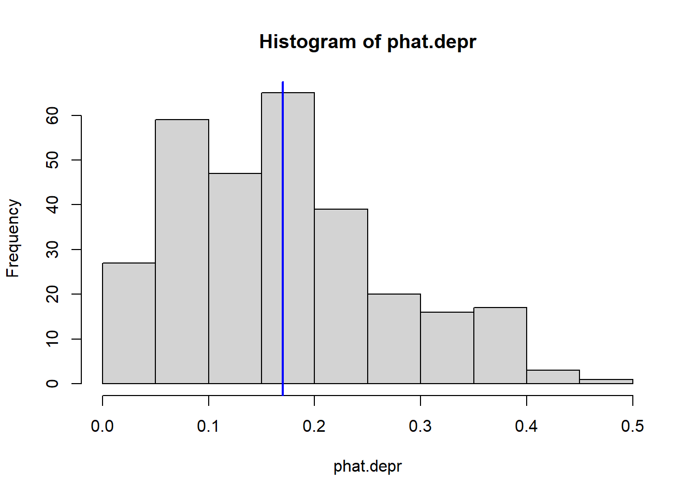
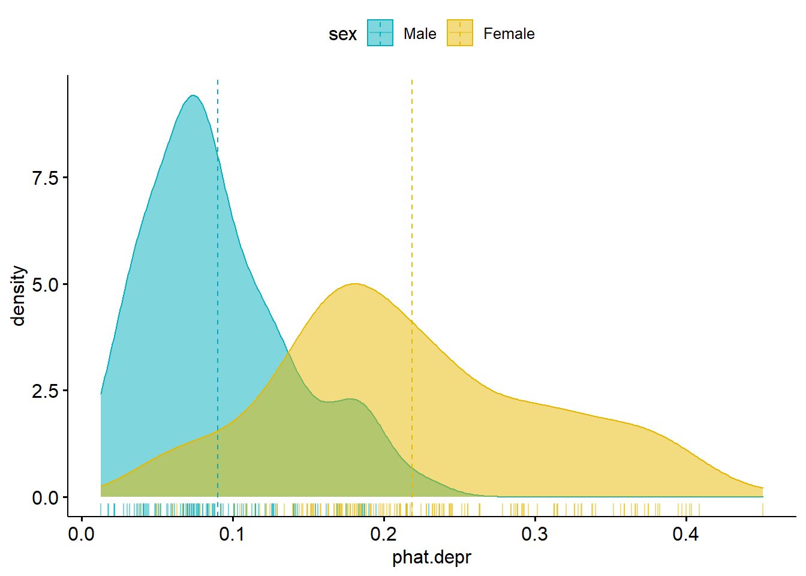
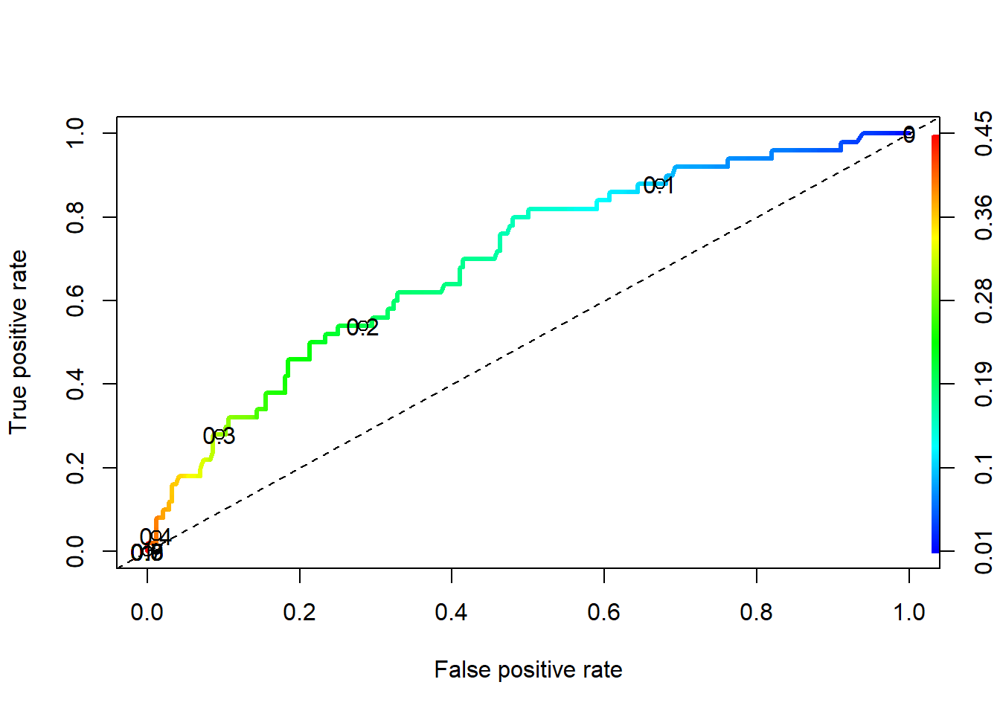

# Classification of Binary outcomes {#binary-classification}

\BeginKnitrBlock{rmdnote}<div class="rmdnote">This section uses functions from the following packages:  

* [ROCR](https://rocr.bioinf.mpi-sb.mpg.de/) to create ROC curves
* [caret](https://topepo.github.io/caret/index.html) package to create a confusion matrix
* [ggpubr](https://rpkgs.datanovia.com/ggpubr/) for some nicer plots</div>\EndKnitrBlock{rmdnote}


## Predicted Probabilities

* Sometimes Odds Ratios can be difficult to interpret or understand. 
* Sometimes you just want to report the probability of the event occurring. 
* Or sometimes you want to predict whether or not a new individual is going to have the event. 

For all of these, we need to calculate $p_{i} = P(y_{i}=1)$, the probability of the event. 
Back solving the logistic model for $p_{i} = e^{\beta X} / (1+e^{\beta X})$ gives us the probability of an event. 

$$
p_{i} = \frac{e^{\beta_{0} + \beta_{1}x_{1i} + \beta_{2}x_{2i} + \ldots + \beta_{p}x_{pi}}}
{1 + e^{\beta_{0} + \beta_{1}x_{1i} + \beta_{2}x_{2i} + \ldots + \beta_{p}x_{pi}}}
$$

Consider the main effects model of depression on age, income and sex from section \@ref(logreg-dep-ex)


--------------------------------------------------------------
     &nbsp;        Estimate   Std. Error   z value   Pr(>|z|) 
----------------- ---------- ------------ --------- ----------
 **(Intercept)**   -0.6765      0.5788     -1.169     0.2425  

     **age**       -0.02096    0.00904     -2.318    0.02043  

   **income**      -0.03656    0.01409     -2.595    0.009457 

  **sexFemale**     0.9294      0.3858      2.409     0.016   
--------------------------------------------------------------


(Dispersion parameter for  binomial  family taken to be  1 )


-------------------- ---------------------------
   Null deviance:     268.1  on 293  degrees of 
                               freedom          

 Residual deviance:   247.5  on 290  degrees of 
                               freedom          
-------------------- ---------------------------


The predicted probability of depression is calculated as: 
$$
P(depressed) = \frac{e^{-0.676 - 0.02096*age - .03656*income + 0.92945*sex}}
{1 + e^{-0.676 - 0.02096*age - .03656*income + 0.92945*sex}}
$$

Notice this formulation requires you to specify a _covariate profile_. In other words, what value X take on for each record. Often when you are only concerned with comparing the effect of a single measures, you set all other measures equal to their means. 

Let's compare the probability of being depressed for males and females separately, while holding age and income constant at the average value calculated across all individuals (regardless of sex). 


```r
depress %>% summarize(age=mean(age), income=mean(income))
##        age   income
## 1 44.41497 20.57483
```

Plug the coefficient estimates and the values of the variables into the equation and calculate. 
$$
P(depressed|Female) = \frac{e^{-0.676 - 0.02096(44.4) - .03656(20.6) + 0.92945(1)}}
{1 + e^{-0.676 - 0.02096(44.4) - .03656(20.6) + 0.92945(1)}}
$$


```r
XB.f <- -0.676 - 0.02096*(44.4) - .03656*(20.6) + 0.92945
exp(XB.f) / (1+exp(XB.f))
## [1] 0.1930504
```
$$
P(depressed|Male) = \frac{e^{-0.676 - 0.02096(44.4) - .03656(20.6) + 0.92945(0)}}
{1 + e^{-0.676 - 0.02096(44.4) - .03656(20.6) + 0.92945(0)}}
$$

```r
XB.m <- -0.676 - 0.02096*(44.4) - .03656*(20.6)
exp(XB.m) / (1+exp(XB.m))
## [1] 0.08629312
```

The probability for a 44.4 year old female who makes $20.6k annual income has a 0.19 probability of being depressed. The probability of depression for a male of equal age and income is 0.086. 


## Distribution of Predicted probabilities

We know that not everyone in the data set is 44.4 years old and makes $20.6k annually (thankfully). So what if you want to get the model predicted probability of the event for all individuals in the data set? There's no way I'm doing that calculation for every person in the data set. 

We can use the `predict()` command to generate a vector of predictions $\hat{p}_{i}$ for each row used in the model. 


```r
phat.depr <- predict(dep_sex_model, type='response') # create prediction vector
summary(phat.depr)
##    Min. 1st Qu.  Median    Mean 3rd Qu.    Max. 
## 0.01271 0.08352 0.16303 0.17007 0.23145 0.45082
hist(phat.depr) # base R histogram
abline(v = mean(phat.depr), col = "blue", lwd = 2) # add mean
```



The average predicted probability of showing symptoms of depression is 0.17. 

### Plotting predictions against covariates

Another important feature to look at is to see how well the model discriminates between the two groups in terms of predicted probabilities. Let's look at a plot: 

\BeginKnitrBlock{rmdcaution}<div class="rmdcaution">Any row with missing data on any variable used in the model will be dropped, and so NOT get a predicted value. So the tactic is to use the data stored in the model object.</div>\EndKnitrBlock{rmdcaution}


```r
model.pred.data <- cbind(dep_sex_model$data, phat.depr)
tail(names(model.pred.data))
## [1] "regdoc"    "treat"     "beddays"   "acuteill"  "chronill"  "phat.depr"
```

Now that the predictions have been added back onto the data used in the model using `cbind`, we have covariates to use to plot the predictions against. 


```r
ggpubr::ggdensity(model.pred.data, x="phat.depr", add="mean", rug = TRUE, 
          color = "sex", fill = "sex", palette = c("#00AFBB", "#E7B800"))
```



 

* What do you notice in this plot?
* What can you infer? 

## Predicted Class (outcome)

To classify individual $i$ as being depressed or not, we draw a binary value ($x_{i} = 0$ or $1$), with probability $p_{i}$ by using the `rbinom` function, with a `size=1`. 

```r
set.seed(12345) #reminder: change the combo on my luggage
plot.mpp <- data.frame(pred.prob = phat.depr, 
                       pred.class = rbinom(n = length(phat.depr), 
                                           size = 1, 
                                           p = phat.depr),
                       truth = dep_sex_model$y)
head(plot.mpp)
##    pred.prob pred.class truth
## 1 0.21108906          0     0
## 2 0.08014012          0     0
## 3 0.15266203          0     0
## 4 0.24527840          1     0
## 5 0.15208679          0     0
## 6 0.17056409          0     0
```

Applying class labels and creating a cross table of predicted vs truth: 


```r
plot.mpp <- plot.mpp %>% 
            mutate(pred.class = factor(pred.class, labels=c("Not Depressed", "Depressed")), 
                    truth = factor(truth, labels=c("Not Depressed", "Depressed")))

table(plot.mpp$pred.class, plot.mpp$truth)
##                
##                 Not Depressed Depressed
##   Not Depressed           195        35
##   Depressed                49        15
```

The model correctly identified 195 individuals as not depressed and 15 as depressed. The model got it wrong 49 + 35 times. 

The **accuracy** of the model is calculated as the fraction of times the model prediction matches the observed category: 


```r
(195+15)/(195+35+49+15)
## [1] 0.7142857
```

This model has a 71.4% accuracy. 

 Is this good? What if death were the event? 

 

## Confusion Matrix

A confusion Matrix is the 2x2 table that compares the predicted classes to the true classes.

```r
table(plot.mpp$pred.class, plot.mpp$truth)
##                
##                 Not Depressed Depressed
##   Not Depressed           195        35
##   Depressed                49        15
```

This table was generated by drawing a random Bernoulli variable with probability $p_{i}$. This assumes that probabilities can range from [0,1], but if you look at the plots above, the predicted probabilities max out around 0.5. 

Often we adjust the cutoff value to improve accuracy. This is where we have to put our gut feeling of what probability constitutes "high risk". For some models, this could be as low as 30%. It's whatever the probability is that optimally separates the classes. This is an important tuning parameter because since the models we build are only based on data we measured, often there are other unmeasured confounding factors that affect the predicted probability. So our predictions don't span the full range from [0,1]. 

  Using the above plots, where should we put the cutoff value? At what probability should we classify a record as "depressed"?


There are many different types of criteria that can be used to find the optimal cutoff value. But first we need to understand the expanded borders of a [[Confusion Matrix]](https://en.wikipedia.org/wiki/Confusion_matrix). 
Using the `confusionMatrix` function inside the `caret` package performs all these calculations for us.

\BeginKnitrBlock{rmdcaution}<div class="rmdcaution">You must specify what the 'event' is. 
This is also another place where the factor ordering of binary variables can cause headache. Another reason to control your factors!</div>\EndKnitrBlock{rmdcaution}


```r
confusionMatrix(plot.mpp$pred.class, plot.mpp$truth, positive="Depressed")
## Confusion Matrix and Statistics
## 
##                Reference
## Prediction      Not Depressed Depressed
##   Not Depressed           195        35
##   Depressed                49        15
##                                          
##                Accuracy : 0.7143         
##                  95% CI : (0.659, 0.7652)
##     No Information Rate : 0.8299         
##     P-Value [Acc > NIR] : 1.0000         
##                                          
##                   Kappa : 0.0892         
##                                          
##  Mcnemar's Test P-Value : 0.1561         
##                                          
##             Sensitivity : 0.30000        
##             Specificity : 0.79918        
##          Pos Pred Value : 0.23438        
##          Neg Pred Value : 0.84783        
##              Prevalence : 0.17007        
##          Detection Rate : 0.05102        
##    Detection Prevalence : 0.21769        
##       Balanced Accuracy : 0.54959        
##                                          
##        'Positive' Class : Depressed      
## 
```

* 195 people were correctly predicted to not be depressed (True Negative)
* 49 people were incorrectly predicted to be depressed (False Positive)
* 10 people were incorrectly predicted to not be depressed (False Negative)
* 15 people were correctly predicted to be depressed (True Positive)

## Vocabulary terms
Also other names for the same term, and formulas.

* True positive ($n_{11}$)
* True negative ($n_{22}$)
* False positive, Type I error ($n_{12}$)
* False negative, Type II error ($n_{21}$)
* True positive rate (TPR), Recall, Sensitivity, probability of detection, power. P(predicted positive | total positive)
$\frac{\# True Positive}{\#Condition Positive}$

* True negative rate (TNR), Specificity, selectivity. P(predicted negative | total negative)
$\frac{\# True Negative}{\# Condition Negative}$


* False positive rate (FPR), fall-out, probability of false alarm. 
$\frac{\# False Positive}{\# Condition Negative}$

* False negative rate (FNR), miss rate. 
$\frac{\# False Negative}{\# Condition Positive}$

* Prevalence. 
$\frac{\# Condition Positive}{\# Total Population}$

* Accuracy. 
$\frac{\# True Positive + \# True Negative}{\# Total Population}$

* Balanced Accuracy: $[(n_{11}/n_{.1}) + (n_{22}/n_{.2})]/2$ - Adjusts for class size imbalances

* Positive Predictive Value (PPV), Precision. P(true positive | predicted positive)
$\frac{\# True Positive}{\# Predicted Condition Positive}$

* False discovery rate (FDR). 
$\frac{\# False Positive}{\# Predicted Condition Positive}$

* False omission rate (FOR). 
$\frac{\# False Negative}{\# Predicted Condition Negative}$

* Negative predictive value (NPV). 
$\frac{\# True Negative}{\# Predicted Condition Negative}$

* F1 score. The harmonic mean of precision and recall. This ranges from 0 (bad) to 1 (good): $\frac{2 * (Precision * Recall)}{Precision + Recall}$


## ROC Curves

* ROC curves show the balance between sensitivity and specificity.
* We'll use the [[ROCR]](https://rocr.bioinf.mpi-sb.mpg.de/) package. It only takes 3 commands: 
    - calculate `prediction()` using the model
    - calculate the model `performance()` on both true positive rate and true negative rate for a whole range of cutoff values. 
    - `plot` the curve. 
        - The `colorize` option colors the curve according to the probability cutoff point. 


```r
pr <- prediction(phat.depr, dep_sex_model$y)
perf <- performance(pr, measure="tpr", x.measure="fpr")
plot(perf, colorize=TRUE, lwd=3, print.cutoffs.at=c(seq(0,1,by=0.1)))
abline(a=0, b=1, lty=2)
```



We can also use the `performance()` function to evaluate the $f1$ measure


```r
perf.f1 <- performance(pr,measure="f")
perf.acc <- performance(pr,measure="acc")

par(mfrow=c(1,2))
plot(perf.f1)
plot(perf.acc)
```


We can dig into the `perf.f1` object to get the maximum $f1$ value (`y.value`), then find the row where that value occurs, and link it to the corresponding cutoff value of x.


```r
(max.f1 <- max(perf.f1@y.values[[1]], na.rm=TRUE))
## [1] 0.3937008
(row.with.max <- which(perf.f1@y.values[[1]]==max.f1))
## [1] 68
(cutoff.value <- perf.f1@x.values[[1]][row.with.max])
##       257 
## 0.2282816
```

A cutoff value of 0.228 provides the most optimal $f1$ score. 

ROC curves: 

* Can also be used for model comparison: http://yaojenkuo.io/diamondsROC.html
* The Area under the Curve (auc) also gives you a measure of overall model accuracy. 


```r
auc <- performance(pr, measure='auc')
auc@y.values
## [[1]]
## [1] 0.695041
```


## Model Performance

* Say we decide that a value of 0.22828 is our optimal cutoff value to predict depression using this model. (note here is a GOOD place to use all the decimals.)
* We can use this probability to classify each row into groups. 
    - The assigned class values must match the data type and levels of the true value.
    - It also has to be in the same order, so the `0` group needs to come first. 
    - I want this matrix to show up like the one in Wikipedia, so I'm leveraging the forcats package to reverse my factor level ordering. 
* We can calculate a confusion matrix using the similarly named function from the `caret` package. 


```r
plot.mpp$pred.class2 <- ifelse(plot.mpp$pred.prob <0.22828, 0,1) 
plot.mpp$pred.class2 <- factor(plot.mpp$pred.class2, labels=c("Not Depressed", "Depressed")) %>%   
                        forcats::fct_rev()

confusionMatrix(plot.mpp$pred.class2, forcats::fct_rev(plot.mpp$truth), positive="Depressed")
## Confusion Matrix and Statistics
## 
##                Reference
## Prediction      Depressed Not Depressed
##   Depressed            25            52
##   Not Depressed        25           192
##                                           
##                Accuracy : 0.7381          
##                  95% CI : (0.6839, 0.7874)
##     No Information Rate : 0.8299          
##     P-Value [Acc > NIR] : 0.999973        
##                                           
##                   Kappa : 0.2362          
##                                           
##  Mcnemar's Test P-Value : 0.003047        
##                                           
##             Sensitivity : 0.50000         
##             Specificity : 0.78689         
##          Pos Pred Value : 0.32468         
##          Neg Pred Value : 0.88479         
##              Prevalence : 0.17007         
##          Detection Rate : 0.08503         
##    Detection Prevalence : 0.26190         
##       Balanced Accuracy : 0.64344         
##                                           
##        'Positive' Class : Depressed       
## 
```

* 192 people were correctly predicted to not be depressed (True Negative, $n_{11}$)
* 52 people were incorrectly predicted to be depressed (False Positive, $n_{21}$)
* 25 people were incorrectly predicted to not be depressed (False Negative, $n_{12}$)
* 25 people were correctly predicted to be depressed (True Positive, $n_{22}$)

Other terminology: 

* **Sensitivity/Recall/True positive rate**: P(predicted positive | total positive) = `25/(25+25) = .50`
* **Specificity/true negative rate**: P(predicted negative | total negative) = `192/(52+192) = .7869`
* **Precision/positive predicted value**: P(true positive | predicted positive) = `25/(25+52) = .3247`
* **Accuracy**: (TP + TN)/ Total: `(25 + 192)/(25+52+25+192) = .7381`
* **Balanced Accuracy**: $[(n_{11}/n_{.1}) + (n_{22}/n_{.2})]/2$ - This is to adjust for class size imbalances (like in this example)
* **F1 score**: the harmonic mean of precision and recall. This ranges from 0 (bad) to 1 (good): $2*\frac{precision*recall}{precision + recall}$ = `2*(.3247*.50)/(.3247+.50) = .3937`


