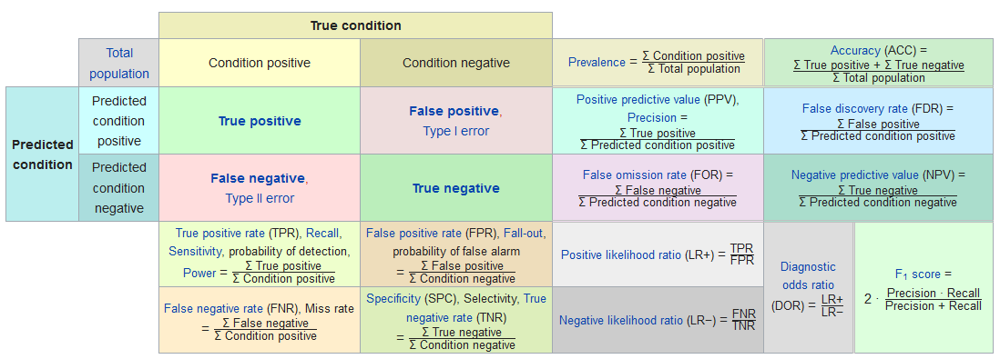

# Classification of Binary outcomes {#binary-classification}

> This section will be expanded to discuss classification for more than two groups. 

* Sometimes Odds Ratios can be difficult to interpret or understand. 
* Sometimes you just want to report the probability of the event occurring. 
* Or sometimes you want to predict whether or not a new individual is going to have the event. 

For all of these, we need to calculate $p_{i} = P(y_{i}=1)$, the probability of the event. 


Back solving the logistic model for $p_{i} = e^{\beta X} / (1+e^{\beta X})$ gives us the probability of an event. 

$$
p_{i} = \frac{e^{\beta_{0} + \beta_{1}x_{1i} + \beta_{2}x_{2i} + \ldots + \beta_{p}x_{pi}}}
{1 + e^{\beta_{0} + \beta_{1}x_{1i} + \beta_{2}x_{2i} + \ldots + \beta_{p}x_{pi}}}
$$

Consider the main effects model of depression on age, income and gender from section \@ref(logreg-dep-ex)


---------------------------------------------------------------
     &nbsp;        Estimate   Std. Error   z value   Pr(>|z|)  
----------------- ---------- ------------ --------- -----------
 **(Intercept)**    -2.313      0.3315     -6.976    3.044e-12 

     **sex**        1.039       0.3767      2.757    0.005831  
---------------------------------------------------------------


(Dispersion parameter for  binomial  family taken to be  1 )


-------------------- ---------------------------
   Null deviance:     268.1  on 293  degrees of 
                               freedom          

 Residual deviance:   259.4  on 292  degrees of 
                               freedom          
-------------------- ---------------------------

The predicted probability of depression is calcualted as: 
$$
P(depressed) = \frac{e^{-0.676 - 0.02096*age - .03656*income + 0.92945*gender}}
{1 + e^{-0.676 - 0.02096*age - .03656*income + 0.92945*gender}}
$$

Notice you can't get a "generic" probability for all individuals. It entirely depends on their _covariate profile_. In other words, what value X take on for each record. 


Let's compare the probability of being depressed for males and females separately, while holding age and income constant at their average value. 


```r
depress %>% summarize(age=mean(age), income=mean(income))
##        age   income
## 1 44.41497 20.57483
```

Plug the coefficient estimates and the values of the variables into the equation and calculate. 
$$
P(depressed|Female) = \frac{e^{-0.676 - 0.02096(44.4) - .03656(20.6) + 0.92945(1)}}
{1 + e^{-0.676 - 0.02096(44.4) - .03656(20.6) + 0.92945(1)}}
$$


```r
XB.f <- -0.676 - 0.02096*(44.4) - .03656*(20.6) + 0.92945
exp(XB.f) / (1+exp(XB.f))
## [1] 0.1930504
```
$$
P(depressed|Male) = \frac{e^{-0.676 - 0.02096(44.4) - .03656(20.6) + 0.92945(0)}}
{1 + e^{-0.676 - 0.02096(44.4) - .03656(20.6) + 0.92945(0)}}
$$

```r
XB.m <- -0.676 - 0.02096*(44.4) - .03656*(20.6)
exp(XB.m) / (1+exp(XB.m))
## [1] 0.08629312
```

The probability for a 44.4 year old female who makes $20.6k annual income has a 0.19 probability of being depressed. The probability of depression for a male of equal age and income is 0.86. 


## Calculating predictions

So what if you want to get the model predicted probability of the event for all individuals in the data set? There's no way I'm doing that calculation for every person in the data set. 

Using the main effects model from above, stored in the object `mvmodel`, we can call the `predict()` command to generate a vector of predictions for each row used in the model. 

\BeginKnitrBlock{rmdcaution}<div class="rmdcaution">Any row with missing data on any variable used in the model will NOT get a predicted value.</div>\EndKnitrBlock{rmdcaution}

The `mvmodel` object contains a lot of information. I recommend you look at `str(mvmodel)` on your own time as it's too much to print out here. The important pieces for this section is that the data used in the model (all complete case records) are stored. 


```r
mvmodel <- glm(cases ~ age + income + sex, data=depress, family="binomial")
model.pred.prob <- predict(mvmodel, type='response')
```

Calling `dim(model.pred.prob)` gives us 294. This matches the number of complete case records used to build the model. This is the same length as `mvmodel$y`, so we can bind them together in a data frame (useful for plotting).  

The `model.pred.prob` is a vector of individual predicted probabilities of the outcome (being depressed). 
To classify individual $i$ as being depressed or not, we draw a binary value ($x_{i} = 0 or 1$), with probability $p_{i}$ by using the `rbinom` function, with a `size=1`. 


```r
set.seed(12345) #reminder: change the combo on my luggage
plot.mpp <- data.frame(pred.prob = model.pred.prob, 
                       pred.class = rbinom(n=length(model.pred.prob), size=1, p=model.pred.prob),
                       truth = mvmodel$y)
head(plot.mpp)
##    pred.prob pred.class truth
## 1 0.21108906          0     0
## 2 0.08014012          0     0
## 3 0.15266203          0     0
## 4 0.24527840          1     0
## 5 0.15208679          0     0
## 6 0.17056409          0     0
```

Applying class labels and creating a cross table of predicted vs truth: 


```r
plot.mpp <- plot.mpp %>% 
            mutate(pred.class = factor(pred.class, labels=c("Not Depressed", "Depressed")), 
                    truth = factor(truth, labels=c("Not Depressed", "Depressed")))

table(plot.mpp$pred.class, plot.mpp$truth)
##                
##                 Not Depressed Depressed
##   Not Depressed           195        35
##   Depressed                49        15
```

The model correctly identified 195 individuals as not depressed and 15 as depressed.
The model got it wrong 49 + 25 times. 

 Is this good? What if death were the event? 

 
#### Distribution of Predictions
Another important feature to look at is to see how well the model discriminates between the two groups in terms of predicted probabilities. Let's look at a plot: 


```r
ggplot(plot.mpp, aes(x=truth, y=pred.prob, fill=truth)) + 
      geom_jitter(width=.2) + geom_violin(alpha=.4) + theme_bw()
```


 

* What do you notice in this plot?
* What can you infer? 

## Confusion Matrix

A confusion Matrix is the 2x2 table that compares the predicted classes to the true classes.

```r
table(plot.mpp$pred.class, plot.mpp$truth)
##                
##                 Not Depressed Depressed
##   Not Depressed           195        35
##   Depressed                49        15
```

This table was generated by drawing a random Bernoulli variable with probability $p_{i}$. This assumes that probabilities can range from [0,1], but if you look at the plots above, the predicted probabilities max out around 0.5. 

Often we adjust the cutoff value to improve accuracy. This is where we have to put our gut feeling of what probability constitutes "high risk". For some models, this could be as low as 30%. It's whatever the probability is that optimally separates the classes. This is an important tuning parameter because since the models we build are only based on data we measured, often there are other unmeasured confounding factors that affect the predicted probability. So our predictions don't span the full range from [0,1]. 

  Using the above plots, where should we put the cutoff value? At what probability should we classify a record as "depressed"?


There are many different types of criteria that can be used to find the optimal cutoff value. But first we need to understand the expanded borders of a [[Confusion Matrix]](https://en.wikipedia.org/wiki/Confusion_matrix). 



Using the `confusionMatrix` function inside the `caret` package performs all these calculations for us.

\BeginKnitrBlock{rmdcaution}<div class="rmdcaution">You must specify what the 'event' is. 
This is also another place where the factor ordering of binary variables can cause headache. Another reason to control your factors!</div>\EndKnitrBlock{rmdcaution}


```r
caret::confusionMatrix(plot.mpp$pred.class, plot.mpp$truth, positive="Depressed")
## Confusion Matrix and Statistics
## 
##                Reference
## Prediction      Not Depressed Depressed
##   Not Depressed           195        35
##   Depressed                49        15
##                                          
##                Accuracy : 0.7143         
##                  95% CI : (0.659, 0.7652)
##     No Information Rate : 0.8299         
##     P-Value [Acc > NIR] : 1.0000         
##                                          
##                   Kappa : 0.0892         
##                                          
##  Mcnemar's Test P-Value : 0.1561         
##                                          
##             Sensitivity : 0.30000        
##             Specificity : 0.79918        
##          Pos Pred Value : 0.23438        
##          Neg Pred Value : 0.84783        
##              Prevalence : 0.17007        
##          Detection Rate : 0.05102        
##    Detection Prevalence : 0.21769        
##       Balanced Accuracy : 0.54959        
##                                          
##        'Positive' Class : Depressed      
## 
```

* 195 people were correctly predicted to not be depressed (True Negative)
* 49 people were incorrectly predicted to be depressed (False Positive)
* 10 people were incorrectly predicted to not be depressed (False Negative)
* 15 people were correctly predicted to be depressed (True Positive)

<!---
Other terminology: 

* **Sensitivity/Recall/True positive rate**: P(predicted positive | total positive) = `40/(10+40) = .8`
* **Specificity/true negative rate**: P(predicted negative | total negative) = `123/(123+121) = .504`
* **Precision/positive predicted value**: P(true positive | predicted positive) = `40/(121+40) = .2484`
* **Accuracy**: (TP + TN)/ Total: `(40 + 123)/(40+123+121+10) = .5544`
* **Balanced Accuracy**: $[(n_{11}/n_{.1}) + (n_{22}/n_{.2})]/2$ - This is to adjust for class size imbalances (like in this example)
* **F1 score**: the harmonic mean of precision and recall. This ranges from 0 (bad) to 1 (good): $2*\frac{precision*recall}{precision + recall}$ = `2*(.2484*.8)/(.2484+.8) = .38`
---->


## ROC Curves

* ROC curves show the balance between sensitivity and specificity.
* We'll use the [[ROCR]](https://rocr.bioinf.mpi-sb.mpg.de/) package. It only takes 3 commands: 
    - calculate `prediction()` using the model
    - calculate the model `performance()` on both true positive rate and true negative rate for a whole range of cutoff values. 
    - `plot` the curve. 
        - The `colorize` option colors the curve according to the probability cutoff point. 


```r
library(ROCR)
pr <- prediction(model.pred.prob, mvmodel$y)
perf <- performance(pr, measure="tpr", x.measure="fpr")
plot(perf, colorize=TRUE, lwd=3, print.cutoffs.at=c(seq(0,1,by=0.1)))
abline(a=0, b=1, lty=2)
```


We can also use the `performance()` function to evaluate the $f1$ measure


```r
perf.f1 <- performance(pr,measure="f")
perf.acc <- performance(pr,measure="acc")

par(mfrow=c(1,2))
plot(perf.f1)
plot(perf.acc)
```


We can dig into the `perf.acc` object to get the maximum accuracy value (`y.value`), then find the row where that value occurs, and link it to the corresponding cutoff value of x.


```r
(max.f1 <- max(perf.acc@y.values[[1]], na.rm=TRUE))
## [1] 0.8333333
(row.with.max <- which(perf.acc@y.values[[1]]==max.f1))
## [1] 2 8
(cutoff.value <- perf.acc@x.values[[1]][row.with.max])
##       124       256 
## 0.4508171 0.3946273
```

A cutoff of 0.42 provides the maximum accuracy measure. 

You can do the same process with other measures of optimization such as the $f1$ score.

ROC curves: 

* Can also be used for model comparison: http://yaojenkuo.io/diamondsROC.html
* The Area under the Curve (auc) also gives you a measure of overall model accuracy. 


```r
auc <- performance(pr, measure='auc')
auc@y.values
## [[1]]
## [1] 0.695041
```


## Model Performance

* Say we decide that a value of 0.15 is our optimal cutoff value to predict depression using this model. 
* We can use this probability to classify each row into groups. 
    - The assigned class values must match the data type and levels of the true value.
    - It also has to be in the same order, so the `0` group needs to come first. 
    - I want this matrix to show up like the one in Wikipedia, so I'm leveraging the forcats package to reverse my factor level ordering. 
* We can calculate a confusion matrix using the similarly named function from the `caret` package. 


```r
library(caret)

plot.mpp$pred.class2 <- ifelse(plot.mpp$pred.prob <0.15, 0,1) 
plot.mpp$pred.class2 <- factor(plot.mpp$pred.class2, labels=c("Not Depressed", "Depressed")) %>%   
                        forcats::fct_rev()

confusionMatrix(plot.mpp$pred.class2, forcats::fct_rev(plot.mpp$truth), positive="Depressed")
## Confusion Matrix and Statistics
## 
##                Reference
## Prediction      Depressed Not Depressed
##   Depressed            40           121
##   Not Depressed        10           123
##                                           
##                Accuracy : 0.5544          
##                  95% CI : (0.4956, 0.6121)
##     No Information Rate : 0.8299          
##     P-Value [Acc > NIR] : 1               
##                                           
##                   Kappa : 0.1615          
##                                           
##  Mcnemar's Test P-Value : <2e-16          
##                                           
##             Sensitivity : 0.8000          
##             Specificity : 0.5041          
##          Pos Pred Value : 0.2484          
##          Neg Pred Value : 0.9248          
##              Prevalence : 0.1701          
##          Detection Rate : 0.1361          
##    Detection Prevalence : 0.5476          
##       Balanced Accuracy : 0.6520          
##                                           
##        'Positive' Class : Depressed       
## 
```

* 123 people were correctly predicted to not be depressed (True Negative, $n_{11}$)
* 121 people were incorrectly predicted to be depressed (False Positive, $n_{21}$)
* 10 people were incorrectly predicted to not be depressed (False Negative, $n_{12}$)
* 40 people were correctly predicted to be depressed (True Positive, $n_{22}$)

Other terminology: 

* **Sensitivity/Recall/True positive rate**: P(predicted positive | total positive) = `40/(10+40) = .8`
* **Specificity/true negative rate**: P(predicted negative | total negative) = `123/(123+121) = .504`
* **Precision/positive predicted value**: P(true positive | predicted positive) = `40/(121+40) = .2484`
* **Accuracy**: (TP + TN)/ Total: `(40 + 123)/(40+123+121+10) = .5544`
* **Balanced Accuracy**: $[(n_{11}/n_{.1}) + (n_{22}/n_{.2})]/2$ - This is to adjust for class size imbalances (like in this example)
* **F1 score**: the harmonic mean of precision and recall. This ranges from 0 (bad) to 1 (good): $2*\frac{precision*recall}{precision + recall}$ = `2*(.2484*.8)/(.2484+.8) = .38`


