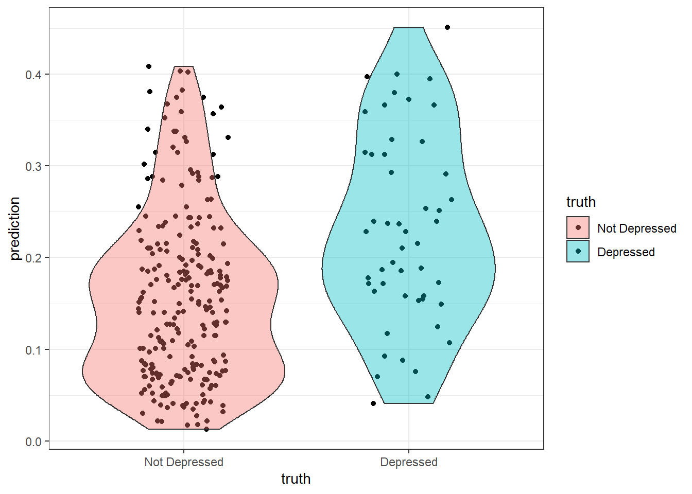
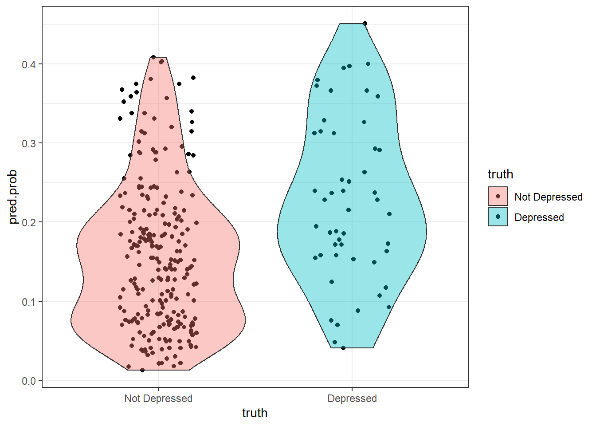

# Classification of Binary outcomes {#binary-classification}

> This section will be expanded to discuss classification for more than two groups. 

* Sometimes Odds Ratios can be difficult to interpret or understand. 
* Sometimes you just want to report the probability of the event occurring. 
* Or sometimes you want to predict whether or not a new individual is going to have the event. 

For all of these, we need to calculate $p_{i} = P(y_{i}=1)$, the probability of the event. 


Back solving the logistic model for $p_{i} = e^{\beta X} / (1+e^{\beta X})$ gives us the probability of an event. 

$$
p_{i} = \frac{e^{\beta_{0} + \beta_{1}x_{1i} + \beta_{2}x_{2i} + \ldots + \beta_{p}x_{pi}}}
{1 + e^{\beta_{0} + \beta_{1}x_{1i} + \beta_{2}x_{2i} + \ldots + \beta_{p}x_{pi}}}
$$

Consider the main effects model of depression on age, income and gender from section \@ref{logreg-dep-ex}


---------------------------------------------------------------
     &nbsp;        Estimate   Std. Error   z value   Pr(>|z|)  
----------------- ---------- ------------ --------- -----------
 **(Intercept)**    -2.313      0.3315     -6.976    3.044e-12 

     **sex**        1.039       0.3767      2.757    0.005831  
---------------------------------------------------------------


(Dispersion parameter for  binomial  family taken to be  1 )


-------------------- ---------------------------
   Null deviance:     268.1  on 293  degrees of 
                               freedom          

 Residual deviance:   259.4  on 292  degrees of 
                               freedom          
-------------------- ---------------------------

The predicted probability of depression is: 
$$
P(depressed) = \frac{e^{-0.676 - 0.02096*age - .03656*income + 0.92945*gender}}
{1 + e^{-0.676 - 0.02096*age - .03656*income + 0.92945*gender}}
$$

Let's compare the probability of being depressed for males and females separately, while holding age and income constant at their average value. 


```r
depress %>% summarize(age=mean(age), income=mean(income))
##        age   income
## 1 44.41497 20.57483
```

Plug the coefficient estimates and the values of the variables into the equation and calculate. 
$$
P(depressed|Female) = \frac{e^{-0.676 - 0.02096(44.4) - .03656(20.6) + 0.92945(1)}}
{1 + e^{-0.676 - 0.02096(44.4) - .03656(20.6) + 0.92945(1)}}
$$


```r
XB.f <- -0.676 - 0.02096*(44.4) - .03656*(20.6) + 0.92945
exp(XB.f) / (1+exp(XB.f))
## [1] 0.1930504
```
$$
P(depressed|Male) = \frac{e^{-0.676 - 0.02096(44.4) - .03656(20.6) + 0.92945(0)}}
{1 + e^{-0.676 - 0.02096(44.4) - .03656(20.6) + 0.92945(0)}}
$$

```r
XB.m <- -0.676 - 0.02096*(44.4) - .03656*(20.6)
exp(XB.m) / (1+exp(XB.m))
## [1] 0.08629312
```

The probability for a 44.4 year old female who makes $20.6k annual income has a 0.19 probability of being depressed. The probability of depression for a male of equal age and income is 0.86. 


## Calculating predictions

So what if you want to get the model predicted probability of the event for all individuals in the data set? There's no way I'm doing that calculation for every person in the data set. 

Using the main effects model from above, stored in the object `mvmodel`, we can call the `predict()` command to generate a vector of predictions for each row used in the model. 

\BeginKnitrBlock{rmdcaution}<div class="rmdcaution">Any row with missing data on any variable used in the model will NOT get a predicted value.</div>\EndKnitrBlock{rmdcaution}

The `predict()` function can calculate predictions for any GLM. The model object `mvmodel` stores the information that it was a logistic regression. 

```r
mvmodel <- glm(cases ~ age + income + sex, data=depress, family="binomial")
model.pred.prob <- predict(mvmodel, type='response')
head(model.pred.prob)
##          1          2          3          4          5          6 
## 0.21108906 0.08014012 0.15266203 0.24527840 0.15208679 0.17056409
```

#### Distribution of Predictions
How well does our model do to predict depression? 


```r
plot.mpp <- data.frame(prediction = model.pred.prob, 
                       truth = factor(mvmodel$y, labels=c("Not Depressed", "Depressed")))

ggplot(plot.mpp, aes(x=truth, y=prediction, fill=truth)) + 
      geom_jitter(width=.2) + geom_violin(alpha=.4) + theme_bw()
```



 What things can you infer from this plot?

 Where should we put the cutoff value? At what probability should we classify a record as "depressed"?


### Optimal Cutoff Value
Often we adjust the cutoff value to improve accuracy. This is where we have to put our gut feeling of what probability constitutes "high risk". For some models, this could be as low as 30%. It's whatever the probability is that optimally separates the classes. Let's look at two ways to visualize model performance as a function of cutoff.

## ROC Curves

* We can create a Receiver operating characteristic (ROC) curve to help find that sweet spot. 
* ROC curves show the balance between sensitivity and specificity.
* We'll use the [[ROCR]](https://rocr.bioinf.mpi-sb.mpg.de/) package. It only takes 3 commands: 
    - calculate `prediction()` using the model
    - calculate the model `performance()` on both true positive rate and true negative rate for a whole range of cutoff values. 
    - `plot` the curve. 
        - The `colorize` option colors the curve according to the probability cutoff point. 


```r
library(ROCR)
pr <- prediction(model.pred.prob, mvmodel$y)
perf <- performance(pr, measure="tpr", x.measure="fpr")
plot(perf, colorize=TRUE, lwd=3, print.cutoffs.at=c(seq(0,1,by=0.1)))
abline(a=0, b=1, lty=2)
```



We can also use the `performance()` function and say we want to evaluate the $f1$ measure


```r
perf.f1 <- performance(pr,measure="f")
plot(perf.f1)
```


ROC curves: 

* Can also be used for model comparison: http://yaojenkuo.io/diamondsROC.html
* The Area under the Curve (auc) also gives you a measure of overall model accuracy. 


```r
auc <- performance(pr, measure='auc')
auc@y.values
## [[1]]
## [1] 0.695041
```


## Model Performance

* Say we decide that a value of 0.15 is our optimal cutoff value. 
* We can use this probability to classify each row into groups. 
    - The assigned class values must match the data type and levels of the true value.
    - It also has to be in the same order, so the `0` group needs to come first. 
* Then we calculate a [[Confusion Matrix]](https://en.wikipedia.org/wiki/Confusion_matrix) using the similarly named function from the `caret` package. 
    - At it's core, this is a 2x2 table containing counts of each combination of predicted value and true value. 


```r
library(caret)

plot.mpp$pred.class <- ifelse(plot.mpp$prediction <0.15, 0,1)
plot.mpp$pred.class <- factor(plot.mpp$pred.class, labels=c("Not Depressed", "Depressed"))

confusionMatrix(plot.mpp$pred.class, plot.mpp$truth, positive="Depressed")
## Confusion Matrix and Statistics
## 
##                Reference
## Prediction      Not Depressed Depressed
##   Not Depressed           123        10
##   Depressed               121        40
##                                           
##                Accuracy : 0.5544          
##                  95% CI : (0.4956, 0.6121)
##     No Information Rate : 0.8299          
##     P-Value [Acc > NIR] : 1               
##                                           
##                   Kappa : 0.1615          
##                                           
##  Mcnemar's Test P-Value : <2e-16          
##                                           
##             Sensitivity : 0.8000          
##             Specificity : 0.5041          
##          Pos Pred Value : 0.2484          
##          Neg Pred Value : 0.9248          
##              Prevalence : 0.1701          
##          Detection Rate : 0.1361          
##    Detection Prevalence : 0.5476          
##       Balanced Accuracy : 0.6520          
##                                           
##        'Positive' Class : Depressed       
## 
```

* 123 people were correctly predicted to not be depressed (True Negative, $n_{11}$)
* 121 people were incorrectly predicted to be depressed (False Positive, $n_{21}$)
* 10 people were incorrectly predicted to not be depressed (False Negative, $n_{12}$)
* 40 people were correctly predicted to be depressed (True Positive, $n_{22}$)

Other terminology: 

* **Sensitivity/Recall/True positive rate**: P(predicted positive | total positive) = `40/(10+40) = .8`
* **Specificity/true negative rate**: P(predicted negative | total negative) = `123/(123+121) = .504`
* **Precision/positive predicted value**: P(true positive | predicted positive) = `40/(121+40) = .2484`
* **Accuracy**: (TP + TN)/ Total: `(40 + 123)/(40+123+121+10) = .5544`
* **Balanced Accuracy**: $[(n_{11}/n_{.1}) + (n_{22}/n_{.2})]/2$ - This is to adjust for class size imbalances (like in this example)
* **F1 score**: the harmonic mean of precision and recall. This ranges from 0 (bad) to 1 (good): $2*\frac{precision*recall}{precision + recall}$ = `2*(.2484*.8)/(.2484+.8) = .38`


