# Cluster Analysis {#cluster}

\BeginKnitrBlock{rmdnote}<div class="rmdnote">Corresponding reading: PMA6 Chapter 16</div>\EndKnitrBlock{rmdnote}

The goal of cluster analysis is to combine _observations_ into groups, when the group membership is not known in advance. 

This is different from Principal Components and Factor Analysis, which aims to group _variables_.

This is still a **Multivariate** analysis technique. That means there is no response variable. 


## When is cluster analysis used? 

* Biology: species taxonomy. Living things are classified into arbitrary groups based on observed characteristics. 
* Types of depression (Andreasen and Grove, 1982, Das-Munshi et al. 2008)
* Properties of dwarf galaxies (Chattopadhyay et.al, 2012)
* Important tool in _Data Mining_ and Marketing research. Consumers can be clustered on the basis of their choice of purchases. 
* State level demographics - how do states cluster on measures such as health indicators, racial and socioeconomic disparities. 
* Fraud detection in insurance claims
* Credit scoring in banking
* Organize information held in text documents. 
* Fantasy football - what other players have similar characteristics to a star player? 


### Data used in this chapter

Suuuuuuper old financial performance data for three different industries in from _Forbes_ in 1981. Bonus points for someone who can get me updated data. 

\BeginKnitrBlock{rmdnote}<div class="rmdnote">These variables are described in detail in Chapter 9.3 and 16.3 in PMA6. You can download the tab delimited [[data file from this link]](data/Cluster.txt) and the [[codebook from this link.]](data/ClusterCodebook.txt)</div>\EndKnitrBlock{rmdnote}


```r
chem <- read.table("data/Cluster.txt", sep="\t", header=TRUE)
```

### Packages used in this chapter


```r
library(factoextra)  # any function that starts with fviz_
library(tidyr)       # for pivot_wider
## library(ggplot2)
## library(gridExtra)   # for multi plot ggplots
## library(dplyr)
## library(cluster)     # for gap statistic
## library(kableExtra)  # side by side tables
```


## Graphical Methods

When there are only a moderate number of variables under consideration, a **profile diagram** or a **parallel coordinates plot** can be informative. 

This diagram plots the _standardized_ values of several variables (on the x-axis), with one line per observation. 

To do this in `ggplot`, we need to transform the data to long format. Here I use the `pivot_longer` function in `tidyr`. To match Table 16.2  and Figure 16.4 in the text, the signs of RRO5 and PAYOUTR1 are reversed to avoid lines crossing. 


```r
stan.chem <- cbind(chem[,1:3], scale(chem[,4:10]))
stan.chem$ROR5 <- -stan.chem$ROR5
stan.chem$PAYOUTR1 <- -stan.chem$PAYOUTR1
stan.chem.long <- tidyr::pivot_longer(data=stan.chem, cols=ROR5:PAYOUTR1, 
                               names_to = "measure", values_to = "value") 
stan.chem.long$measure <- factor(stan.chem.long$measure, 
              levels=c("ROR5", "DE", "SALESGR5", "EPS5", "NPM1", "PE", "PAYOUTR1"))


stan.chem.long %>% filter(OBSNO %in% c(15:21)) %>% 
    ggplot(aes(x=measure, y=value, group=SYMBOL, col=SYMBOL)) + geom_line(size=1.5) + 
           theme_bw(base_size = 14) + ylim(-3.1, 4) 
```

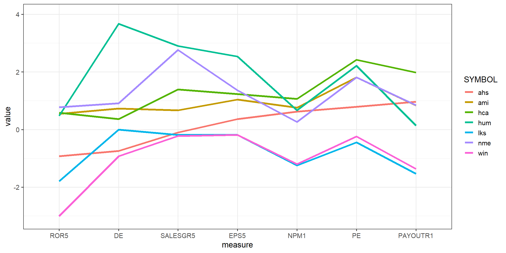


Companies that follow similar patterns: 

* `hca`, `nme`, `hum`
* `lks`, `win` 
* `ahs` is similar to `lks` & `win` for `ROR5` through `SALESGR5`, but diverges after. 
* `ami` is more similar to `hca` than the others, but not on all measures. 

Obvious limitation to creating a profile plot is that it could be difficult to pick out patterns as number of observations increases. The plot below shows all 25 observations in this data set. 


```r
ggplot(stan.chem.long, aes(x=measure, y=value, group=SYMBOL)) + 
    geom_line() + theme_bw() + ylim(-3, 4) 
```

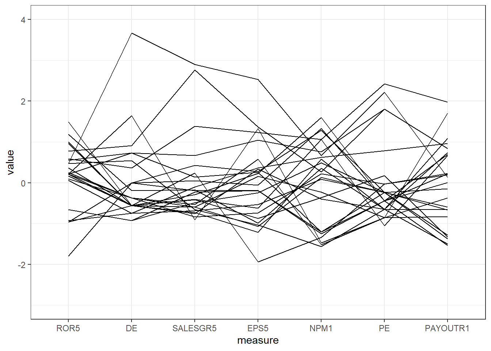


\BeginKnitrBlock{rmdtip}<div class="rmdtip">If the x-axis were time this type of plot is also known as a "spaghetti" plot. See Figure 4.18b in PMA6 as an example. </div>\EndKnitrBlock{rmdtip}

We can do better than looking at profile plots and trying to see which observations behave "similarly". Let's leverage some math concepts and introduce measures of "distance" between two observations. 

For cluster analysis, we need to use the wide data set, where each variable is it's own column, and only the numeric variables containing the measurements. Not the row information such as symbol. Here I set the row names of this numeric matrix to the symbols. This lets the clusters to be 'named' instead of numbered by row number in plots. 


```r
cluster.dta <- stan.chem %>% select(ROR5:PAYOUTR1)
rownames(cluster.dta) <- stan.chem$SYMBOL 
```


## Distance Measures

Let's start with 2 dimensions, and the most familiar type of distance: **Euclidean distance**. 


Recalling the [Pythagorean formula](https://en.wikipedia.org/wiki/Pythagorean_theorem), the Euclidean distance between two points $(p_{1}, p_{2})$ and $(q_{1}, q_{2})$ is

$$ d_{euc} =  \sqrt{(q_{1} - p_{1})^{2} + (q_{2} - p_{2})^{2} }$$

This formula is generalizable to $p$ dimensions, so we can calculate the distance between observations on $p$ numeric variables. The details of calculating a multivariate Euclidean distance is left to a third semester of calculus, but the concept is the same. This measure is commonly referred to as the [Euclidean norm](https://en.wikipedia.org/wiki/Norm_(mathematics)#Euclidean_norm), or L2 norm. 


\BeginKnitrBlock{rmdcaution}<div class="rmdcaution">Distance measures are **not** invariant to changes in scale (units of measurement). Distances between measures that are in the thousands, are much larger than distances between measures that are in the micrograms. This is why you always need to scale the data prior to analysis. </div>\EndKnitrBlock{rmdcaution}

### Other measures of distance

* Euclidean distance tends to be the default in most algorithms. 
* Manhattan distance is similar, calculated using the sum of the absolute value distances:  

$$ d_{man} =  |(q_{1} - p_{1})| + |(q_{2} - p_{2})| $$

* Correlation-based distances. Pearson, Spearman, Kendall to name a few. 
    - Widely used for gene expression data
    - distance is defined by subtracting the correlation coefficient from 1. 


When discussing the _closeness_ of records, we are meaning the minimum distance on all $p$ dimensions under consideration. For this class we will default to using the Euclidean distance unless otherwise specified. 

### Gowers's dissimilarity measure as a distance measures for binary data

When your data is only 0/1, the concept of distance between records (vectors) is not quite the same. In this case you are going to need to use a different type of distance, or _dissimilarity_ measure called the Gower distance. This is created as follows, and used in the same way any other distance matrix is used. 


```r
gower.d <- daisy(x = cluster.dta, metric = "gower")
```

\BeginKnitrBlock{rmdnote}<div class="rmdnote">This information has not been read through in great detail, but reading thorough the following document, the information looks credible and there is a reference to an original paper. I'll trust it. 

https://rstudio-pubs-static.s3.amazonaws.com/423873_adfdb38bce8d47579f6dc916dd67ae75.html</div>\EndKnitrBlock{rmdnote}

### Creating the distance matrix. 


```r
d <- dist(cluster.dta, method="euclidean")
```

We can visualize these distances using a heatmap, where here I've changed the gradient to show the darker the color, the closer the records are to each other. The diagonal is black, because each record has 0 distance from itself.  You can change these colors. 

```r
fviz_dist(d, order=TRUE, show_labels=TRUE, 
          gradient=list(low="black", mid="blue", high="white"))
```

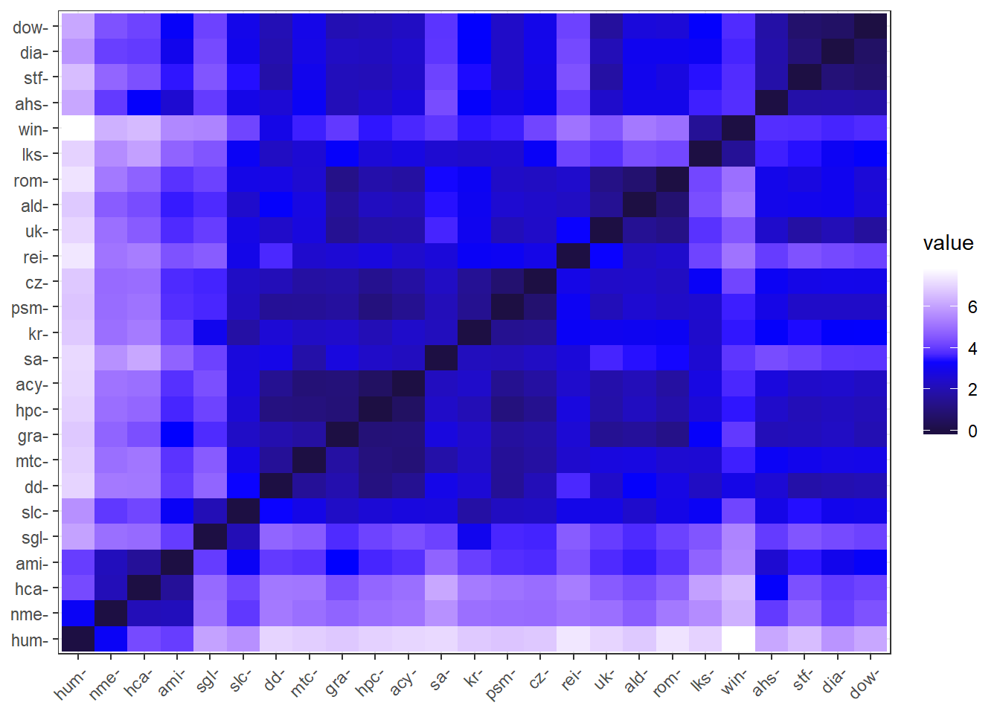

* `order=TRUE` sorts the distances, so notice `hum` is furthest away from almost all other companies except `nme`. 
* `win` and `lks` seem to be a bit 'further' away from others. 


We will explore two methods of clustering: hierarchical and non-hierarchical

## Hierarchical clustering


We can visualize clusters calculated using hierarchical methods using **dendograms**. These are awesome tree-based visualizations, similar to visualizations created for decision trees and random forest models (leafs, nodes, stems, roots). 

{width=70%}


There are two main approaches to linking records into clusters: 

**Agglomerative** is a bottom-up approach. This begins with $N$ clusters (each observation is a cluster), and at each step two observations that are the most similar are combined until all observations are in a single cluster. Good at identifying small clusters.  AKA AGNES (agglomerative nesting)

**Devisive** is a top-down approach. This begins with one cluster containing all the observations, and splits off cases that are most dissimilar to the rest until each observation is in it's own cluster. Good at identifying large clusters. Not that common, so will not be discussed further.  AKA DIANA (divise analysis).


### Linkages
At each step in agglomerative clustering, the clusters with the smallest **linkage distance** between the two clusters are combined. This linkage distance can be computed using several linkage methods. 


**Centroid linkage (PMA6 Fig 16.5).**

* The closest two records are combined, and their centroid is calculated. The **centroid** is calculated as the mean of the length $p$-vector, for our 2 dimensional example in the last section this would be $(\bar{p}, \bar{q})$. 
    - This centroid point/vector takes the place of the original records in the data set. 
* Then the next closest set of points are combined, and their centroid calculated. 
* The centroid need not be an actual measured observation in the data set.


**Single Linkage**

* Each step clusters are combined that contain the closest pair of points, not yet in the same cluster as each other. 

**Complete Linkage**

* Calculate all pairwise distances between points in each cluster. 
* The distance between clusters is the maximum value of the pairwise differences. I.e. the pair of points in each cluster that are the furthest away from each other. 
* At each step, the two clusters that are separated by the shortest maximum distance are combined. 

**Ward's D**

* Minimizes the within-cluster variance. 
* Within cluster variance is calculated as the weighted squared distance between clusters. 
    - For the initial step, this is the squared euclidean distance between all points. 
* At each step the pair of clusters that lead to the smallest increase in the total within-cluster variance are merged. 


### Comparing Linkage methods


```r
par(mfrow=c(2,2))
hclust(d, method="centroid") %>% plot(main="Centroid Linkage")
hclust(d, method="single") %>% plot(main="Single Linkage")
hclust(d, method="complete") %>% plot(main="Complete Linkage")
hclust(d, method="ward.D") %>% plot(main="Ward's Method")
```


In these plots, "height" is a measure of similarity/distance. Also, the longer the "stem" the greater the distance.  

Things I picked out from these plots. 

* `hum` is the last company to be added to any cluster using any methods. 
* `rei` also seems to stand alone as being different from the others. 
* Ward's method seems to create more distinct clusters compared to the other methods
* common companies that are grouped in all methods: 
    - `nme`, `hca`, `ami` 
    - `uk`, `ald`, `roh`
    - `sf`, `dia`, `dow`
    - `gra`, `hpc`, `acy`, and sometimes `mtc`. 


### Dendogram extras

If we say there are 4 clusters, we can use `fviz_dend` to color the dendogram by those clusters. 

```r
clust.ward <- hclust(d, method="ward.D")

a <- fviz_dend(clust.ward, rect=TRUE, k=4)
b <- fviz_dend(clust.ward,  k =4, rect = TRUE, color_labels_by_k = TRUE, 
               rect_border = c("red", "green", "blue", "purple"), 
               rect_fill = TRUE, lower_rect = -1)
grid.arrange(a, b, ncol=2)
```

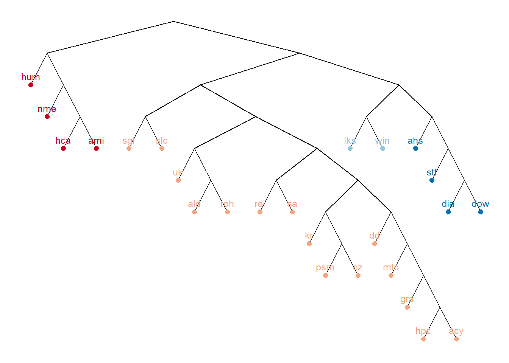

Other options


```r
fviz_dend(clust.ward, k = 4, k_colors = "RdBu", type = "phylogenic", relep = TRUE , 
          phylo_layout = "layout_as_tree")
```


```r
fviz_dend(clust.ward, cex = 0.6, k = 4, type = "circular", rect = TRUE)
```


## Non Hierarchical clustering

$K$-means clustering

1. Divide the data into $K$ clusters. 
2. Calculate the centroid for each cluster. 
3. Calculate the distance from each point to each cluster centroid. 
4. Assign each point to be in the cluster for which it's closest to that cluster's centroid. 
5. Repeat until no points move clusters. 

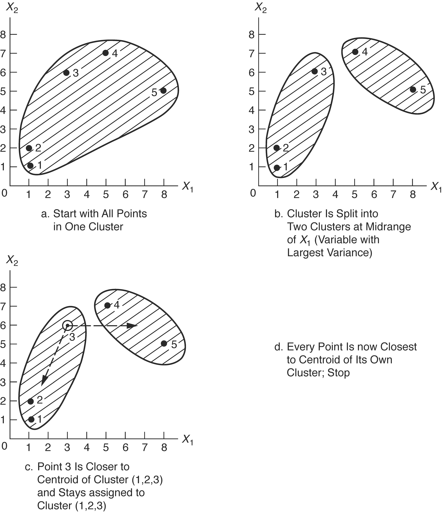{width=80%}


```r
k <- kmeans(cluster.dta, centers=3)
k
## K-means clustering with 3 clusters of sizes 4, 7, 14
## 
## Cluster means:
##         ROR5         DE   SALESGR5        EPS5       NPM1         PE
## 1  0.5959748  1.4185646  1.9308011  1.54316849  0.6882745  2.0643489
## 2 -1.3246523 -0.4541930 -0.1171821  0.02674634  0.4116164 -0.1788732
## 3  0.4920477 -0.1782077 -0.4930664 -0.45427845 -0.4024581 -0.5003774
##      PAYOUTR1
## 1  0.94802477
## 2 -0.45122839
## 3 -0.04525003
## 
## Clustering vector:
## dia dow stf  dd  uk psm gra hpc mtc acy  cz ald rom rei hum hca nme ami 
##   2   2   2   2   3   3   3   3   3   3   3   3   3   3   1   1   1   1 
## ahs lks win sgl slc  kr  sa 
##   2   2   2   3   3   3   3 
## 
## Within cluster sum of squares by cluster:
## [1] 14.22540 21.15603 43.58324
##  (between_SS / total_SS =  53.0 %)
## 
## Available components:
## 
## [1] "cluster"      "centers"      "totss"        "withinss"    
## [5] "tot.withinss" "betweenss"    "size"         "iter"        
## [9] "ifault"
```


Interpreting the output: 

* First table shows the mean of each variable for each cluster. Each row is that 'centroid' vector. 
* The `clustering vector` shows the assigned cluster for each record (company)

The `kmeans` procedure has an `nstart` argument that lets you choose different starting configurations, and lets you choose the best one. Here I iterate through 10 different configurations and compare the cluster assignment results to the first trial where only one configuration was used. 


```r
set.seed(4567)
k2 <- kmeans(cluster.dta, centers=3, nstart=10)
rbind(k$cluster, k2$cluster)
##      dia dow stf dd uk psm gra hpc mtc acy cz ald rom rei hum hca nme ami
## [1,]   2   2   2  2  3   3   3   3   3   3  3   3   3   3   1   1   1   1
## [2,]   1   1   1  1  3   3   3   3   3   3  3   3   3   3   2   2   2   2
##      ahs lks win sgl slc kr sa
## [1,]   2   2   2   3   3  3  3
## [2,]   1   1   1   3   3  3  3
```

Things to note

* I set a seed. That means there's a random process going on here. I set a seed so each time i compile the notes i get the same results. 
* The cluster numbers are invariant. There are still 3 clusters, with `hum:ami` showing up in one cluster (numbered 2 in the first row, numbered 1 in the second row). Basically the cluster labels 1 and 2 have been swapped. 


### Visualizations k-means


Using `fviz_cluster` from the `factoextra` package lets you visualize clusters on two dimensions. 


```r
fviz_cluster(object=k2, data=cluster.dta, choose.vars = c("ROR5", "DE")) + 
      theme_bw() + scale_colour_viridis_d() + scale_fill_viridis_d()
```

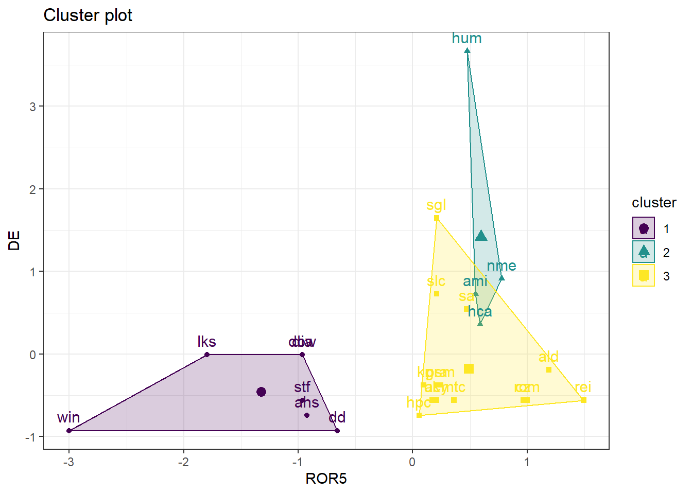

If you omit the `choose.vars` argument, this function will create clusters using the first two principal components instead of the original, standardized data. 


```r
fviz_cluster(object=k2, data=cluster.dta) + 
  theme_bw() + scale_colour_viridis_d() + scale_fill_viridis_d()
```

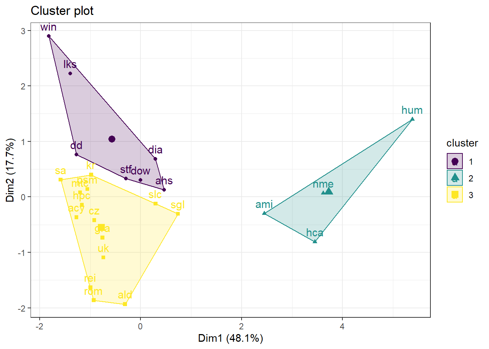


## Choosing K

\BeginKnitrBlock{rmdcaution}<div class="rmdcaution">This section is under construction. I'm not overly happy with getting different results with the same gap statistic. </div>\EndKnitrBlock{rmdcaution}

### Visually


```r
nclust.2 <- kmeans(cluster.dta, centers=2, nstart=10) %>%
              fviz_cluster(data=cluster.dta, geom="point") + theme_bw() + 
              ggtitle("2 clusters")+ 
              scale_colour_viridis_d() + scale_fill_viridis_d()
nclust.3 <- kmeans(cluster.dta, centers=3, nstart=10) %>%
              fviz_cluster(data=cluster.dta, geom="point") + theme_bw() + 
              ggtitle("3 clusters")+ 
              scale_colour_viridis_d() + scale_fill_viridis_d()
nclust.4 <- kmeans(cluster.dta, centers=4, nstart=10) %>%
              fviz_cluster(data=cluster.dta, geom="point") + theme_bw() + 
              ggtitle("4 clusters")+ 
              scale_colour_viridis_d() + scale_fill_viridis_d()
nclust.5 <- kmeans(cluster.dta, centers=5, nstart=10) %>%
              fviz_cluster(data=cluster.dta, geom="point") + theme_bw() + 
              ggtitle("5 clusters")+ 
              scale_colour_viridis_d() + scale_fill_viridis_d()

gridExtra::grid.arrange(nclust.2, nclust.3, nclust.4, nclust.5, nrow=2)
```

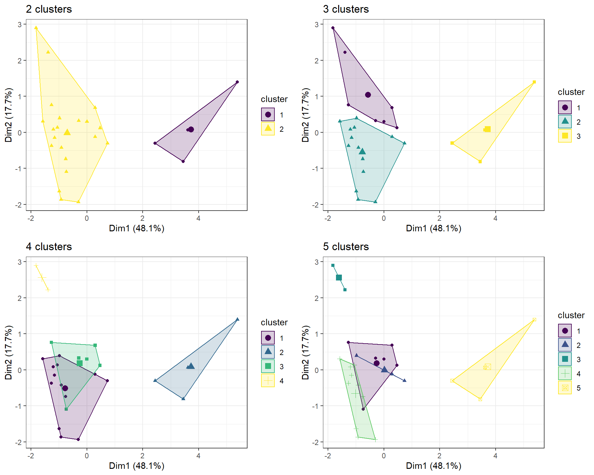

* Three clusters provides the best appearing groupings. 
* The cluster on the right stands out (high on PC2) on it's own regardless of what happens with the other clusters. 
* Cluster #2 in both the 3 and 4 cluster models is the same points. 

### Elbow method

Similar to the scree plot, choose the number of clusters that minimizes the within cluster variance. 


```r
fviz_nbclust(cluster.dta, kmeans, method="wss")
```

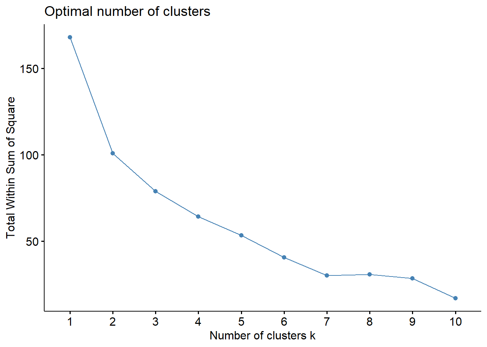

No real "elbow".. but $k=7$ is where I'd say the change point in the slope is at. 


### Gap statistic


* This can be used for both hierarchical and non-hierarchical clustering. 
* Compares total intracluster variation with the expected value under a null distribution of no clustering. 
* See [Tibshirani et.all](http://web.stanford.edu/~hastie/Papers/gap.pdf) for more details. 


```r
set.seed(12345)
fviz_nbclust(cluster.dta, kmeans, method="gap_stat")
```


```r
fviz_nbclust(cluster.dta, hcut, method="gap_stat")
```

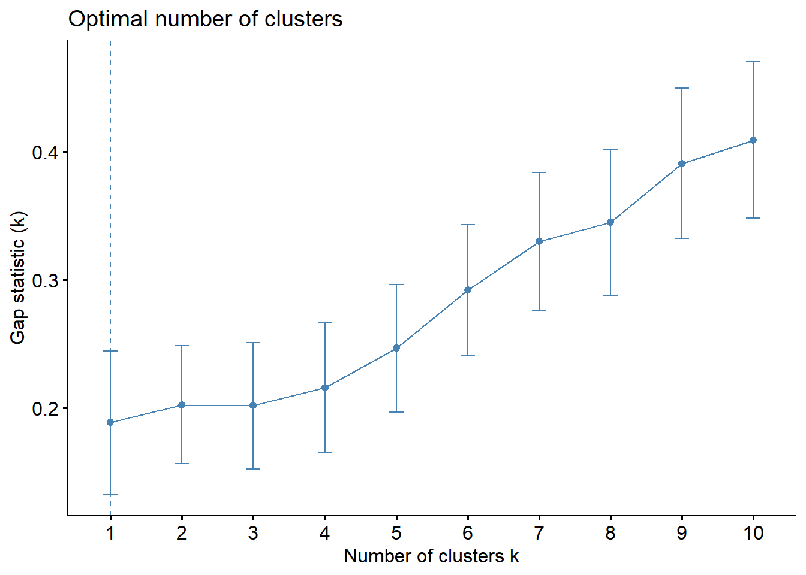


## Assigning Cluster labels

* For hierarchical clustering, you can use the `cutree` function to cut the tree at a certain height to create clusters
* For kmeans clustering, the clustering assignments is contained in the `cluster` object. 


Both can be added back to the original data set, as long as the ordering has not changed

```r
chem$pred.clust.ward <- cutree(clust.ward, k=3)
chem$pred.clust.kmeans <- kmeans(cluster.dta, 3, nstart=20)$cluster
```


In this sample, we *know* the true clusters, so we can compare how well these methods did at capturing the similarities in companies. 


```r
list(
  table(chem$TYPE, chem$pred.clust.ward), 
  table(chem$TYPE, chem$pred.clust.kmeans)
  ) %>% 
  kable(booktabs=TRUE, valign='t', 
        caption="True cluster vs hierarchical (left) and kmeans (right) clustering.")
```

<table class="kable_wrapper">
<caption>(\#tab:unnamed-chunk-27)True cluster vs hierarchical (left) and kmeans (right) clustering.</caption>
<tbody>
  <tr>
   <td> 

<table>
 <thead>
  <tr>
   <th style="text-align:left;">   </th>
   <th style="text-align:right;"> 1 </th>
   <th style="text-align:right;"> 2 </th>
   <th style="text-align:right;"> 3 </th>
  </tr>
 </thead>
<tbody>
  <tr>
   <td style="text-align:left;"> Chem </td>
   <td style="text-align:right;"> 3 </td>
   <td style="text-align:right;"> 11 </td>
   <td style="text-align:right;"> 0 </td>
  </tr>
  <tr>
   <td style="text-align:left;"> Groc </td>
   <td style="text-align:right;"> 2 </td>
   <td style="text-align:right;"> 4 </td>
   <td style="text-align:right;"> 0 </td>
  </tr>
  <tr>
   <td style="text-align:left;"> Heal </td>
   <td style="text-align:right;"> 1 </td>
   <td style="text-align:right;"> 0 </td>
   <td style="text-align:right;"> 4 </td>
  </tr>
</tbody>
</table>

 </td>
   <td> 

<table>
 <thead>
  <tr>
   <th style="text-align:left;">   </th>
   <th style="text-align:right;"> 1 </th>
   <th style="text-align:right;"> 2 </th>
   <th style="text-align:right;"> 3 </th>
  </tr>
 </thead>
<tbody>
  <tr>
   <td style="text-align:left;"> Chem </td>
   <td style="text-align:right;"> 0 </td>
   <td style="text-align:right;"> 10 </td>
   <td style="text-align:right;"> 4 </td>
  </tr>
  <tr>
   <td style="text-align:left;"> Groc </td>
   <td style="text-align:right;"> 0 </td>
   <td style="text-align:right;"> 4 </td>
   <td style="text-align:right;"> 2 </td>
  </tr>
  <tr>
   <td style="text-align:left;"> Heal </td>
   <td style="text-align:right;"> 4 </td>
   <td style="text-align:right;"> 0 </td>
   <td style="text-align:right;"> 1 </td>
  </tr>
</tbody>
</table>

 </td>
  </tr>
</tbody>
</table>

* Both methods clustered 4 out of 5 Health care companies together.
* Both got grocery stores half wrong
* Similar performance for clustering the chemical companies. 


## Exploring clusters

In the example with the companies, there were few enough records that I could see the labels on the visualization itself. When you have lots of records, it can be impossible to identify individual records. 

But do you need to? 

One of the goals is to identify *if* there are clusters of individuals. Then if there are, you may (or may not) be interested in identifying what makes the clusters similar. If you're really interested in the characteristics in individuals being close to each other you can use existing plotting techniques that we've used for bivarate plots, and for PCA. 

Cluster analysis is an exploratory technique. We can use some existing summary tools to explore what the groups, or clusters, are like. 

### Univariate distribution of clusters 

What's the distribution of clusters? This could be answered with a a table or barchart. 

```r
table(chem$pred.clust.kmeans)
## 
##  1  2  3 
##  4 14  7
```

### Bivariate plots

If you have some variables of interest that you think might be contributing to your clustering, create a bivariate plot of those measures against cluster. 


```r
ggplot(chem, aes(x=PAYOUTR1, col=as.factor(pred.clust.kmeans))) + 
        geom_density() + theme_bw()
```


If you want to see how the clusters vary across two or more dimensions, you could create scatterplots


```r
ggplot(chem, aes(x=PAYOUTR1, y=SALESGR5, col=as.factor(pred.clust.kmeans))) + 
        geom_point() + theme_bw() + 
        stat_ellipse(aes(group=pred.clust.kmeans), type="norm")
```

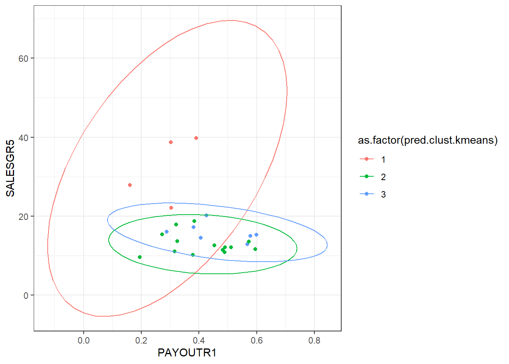


### Multivariate plots

or scatterplot matrices. This one lets me see that PE does a good job of separating out group 1, and possibly ROR5 pulls out group 3. 


```r
caret::featurePlot(x = chem[,c(4:10)], 
                   y = as.factor(chem$pred.clust.kmeans), 
                   plot = "ellipse", auto.key=list(columns=3))
```

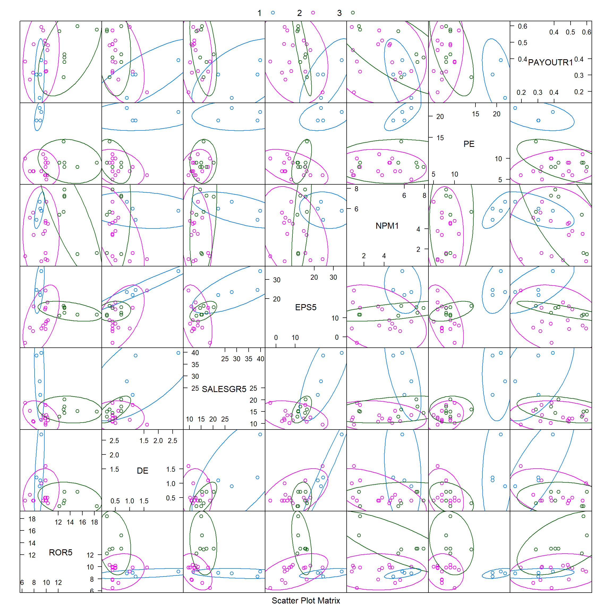

or heatmaps, 


```r
library(dendextend)
# not run, just a reminder where clust.ward came from
# clust.ward <- hclust(d, method="ward.D")

dend.heatmap <- clust.ward %>%  as.dendrogram() %>% ladderize %>% color_branches(k=3)


gplots::heatmap.2(as.matrix(d), 
          srtCol = 60,
          dendrogram = "row",
          Rowv = dend.heatmap,
          Colv = "Rowv", # order the columns like the rows
          trace="none",          
          margins =c(3,6),      
          denscol = "grey",
          density.info = "density",
          col = colorspace::diverge_hcl(10, palette="Green-Brown")
         )
```

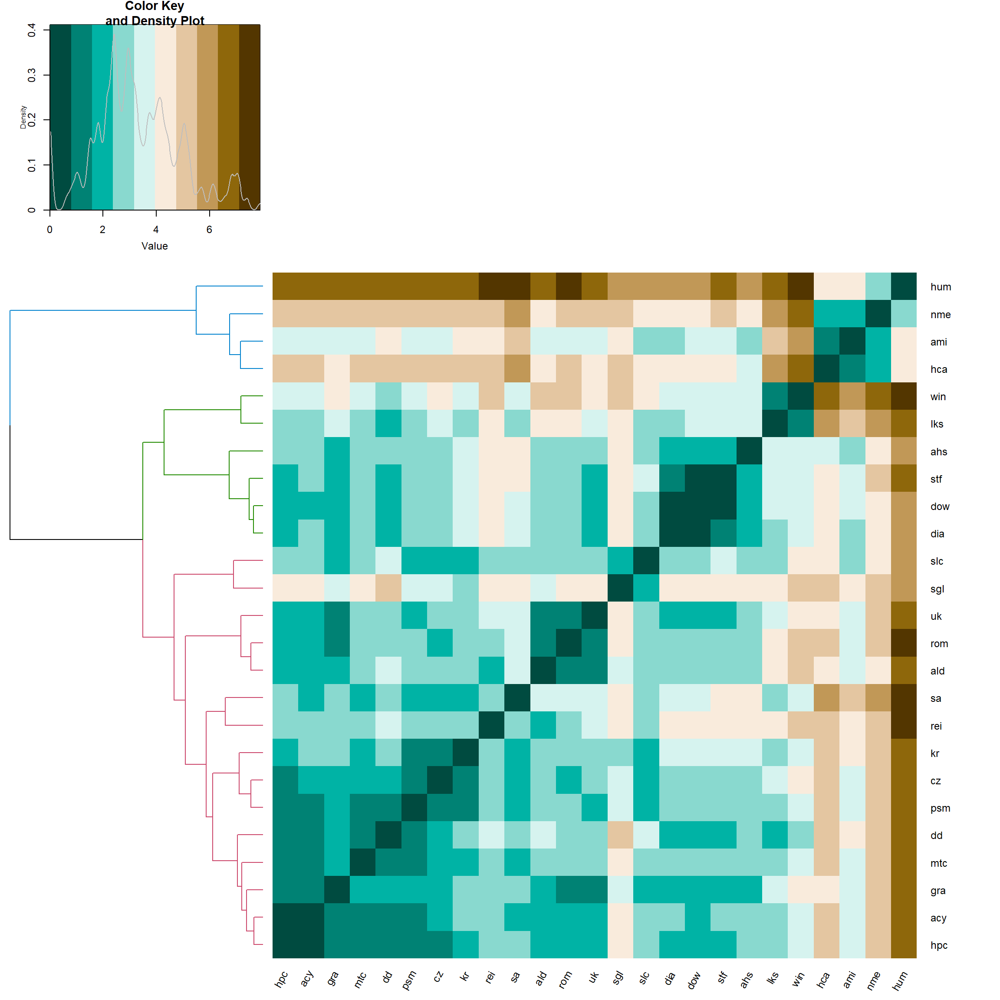

Note that this plot is almost identical to when we visualized the distance matrix `d` using the `fviz_dist` function in 14.3.2. That's what the colors are, is the distances. The difference here is that the rows (and columns) are ordered according to their cluster (with the dendogram on the left.)

  - `colorspace` vignette: https://cran.r-project.org/web/packages/colorspace/vignettes/colorspace.html
  - `dendextend` vignette: https://cran.r-project.org/web/packages/dendextend/vignettes/Cluster_Analysis.html

### Still too many records / variables

So take a sample. 

- Filter on just one cluster and l👀k at your data. 
- Select groups of variables that hang together well as shown by PCA and only cluster on those. 
- Select groups of variables that _mean something_ scientifically, or that you want to know _if_ they are meaningful contributions to clusters. 


## What to watch out for

* $K$ means clustering requires the number of clusters to be specified up front. Hierarchical clustering does not have this restriction. 
* The agglomerative coefficient increases with the number of rows. You can NOT use it to compare between two datasets that are very different in size. 
* Cluster analysis methods are sensitive to outliers
* Different results can occur if you change the order of the data. 
* The centroid does not have to be part of the data set. Alternative methods such as k-medians or k-medoids restrict the centroids to be an actual record that is 'closest' to the calculated mean. 
* Number of clusters depends on the desired level of similarity. 
* Since different algorithms can produce different results, this is especially true across software programs. See PMA6 Table 16.4 as an example of comparing cluster analysis results on the chemical data set in SAS, R and Stata. 
* Sample size. You can cluster on datasets with thousands of records, but know that the dendogram leafs will not be readable. In these cases 


## Additional References

* Chapter 20 and 21 from [Hands on machine learning with R](https://bradleyboehmke.github.io/HOML/) book.
* University of Cincinatti - Business Analytics R Programming Guide (same author as above HOML book)
    - https://uc-r.github.io/kmeans_clustering
    - https://uc-r.github.io/hc_clustering
* R Vignette for [dendextend](https://cran.r-project.org/web/packages/dendextend/vignettes/Cluster_Analysis.html) provides a good visual comparison of different linkage methods on small and large dimensional datasets. 
* [Lecture notes from Data Analysis in the Geosciences, GEOL 830 at University of Georgia.](http://strata.uga.edu/8370/lecturenotes/clusterAnalysis.html)
* STHDA on different ways to visualize clusters 
    - [using built in denodgrams](http://www.sthda.com/english/wiki/beautiful-dendrogram-visualizations-in-r-5-must-known-methods-unsupervised-machine-learning)
    - [using the `factoextra` package](http://www.sthda.com/english/wiki/factoextra-r-package-easy-multivariate-data-analyses-and-elegant-visualization#cluster-analysis-and-factoextra)


