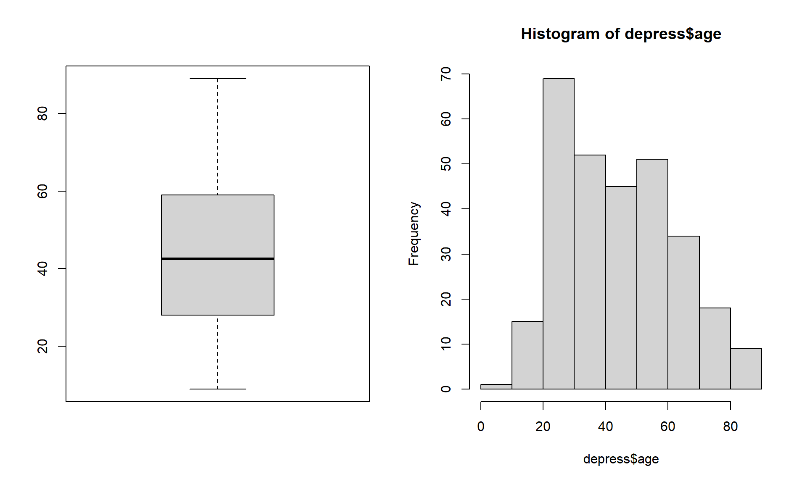
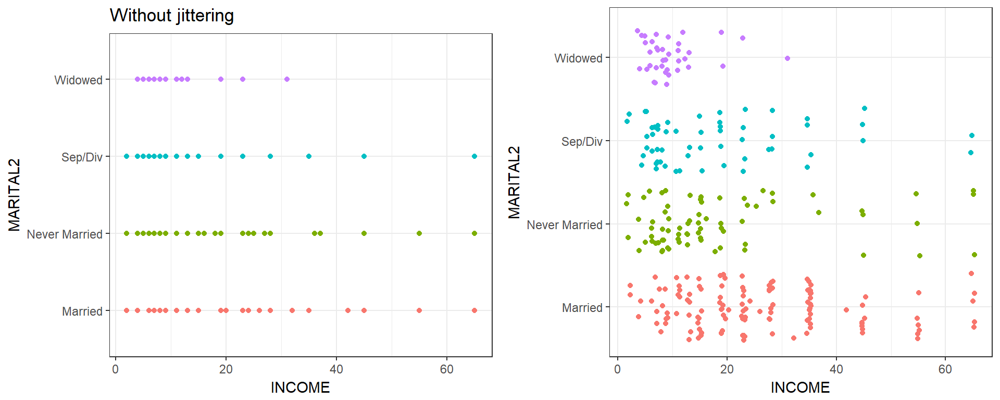
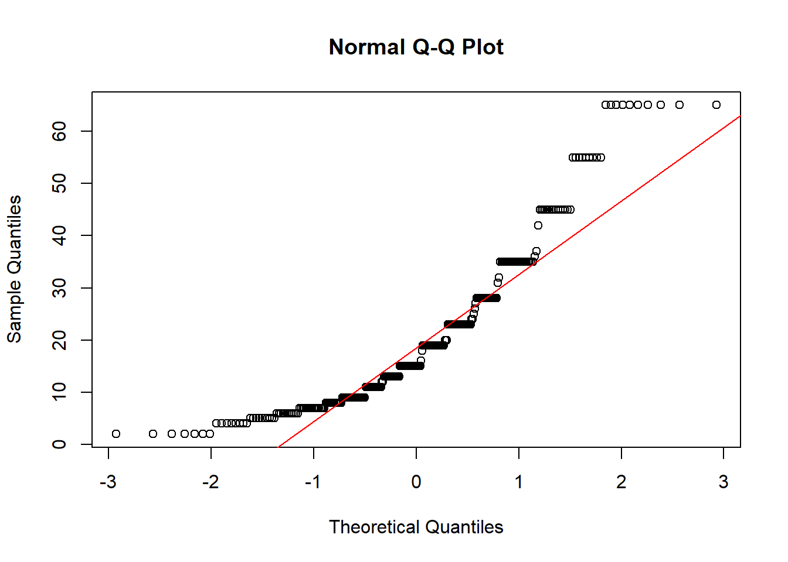

# (PART) Preparing Data for Analysis {-}

# Workflow and Data Cleaning {#data_prep}

Once the data are available from a study there are still a number of steps that must be undertaken to get them into shape for analysis.

One of the most misunderstood parts of the analysis process is the data preparation stage. To say that 70% of any analysis is spent on the data management stage is not an understatement. 

This chapter provides information on topics related to data processing and corresponds to PMA6 Chapter 3. 


## Reproducible workflows

Reproducibility is the ability for any researcher to take the same data set and run the same
set of software program instructions as another researcher and achieve the same results. 

The goal is to create an exact record of what was done to a data set to produce a specific result. To achieve
reproducibility, we believe that three things must be present:

1. The un-processed data are connected directly to software code file(s) that perform data preparation techniques.
2. The processed data are connected directly to other software code file(s) that perform the analyses. 
3. All data and code files are self-contained such that they could be given to another researcher to execute the code commands on a separate computer and achieve the same results as the original author. 


 Why do we need a codebook? 

* You are your own collaborator 6 months from now. Make sure you will be able to understand what you were doing.
* Investing the time to do things clearly and in a reproducible manner will make your future self happy.
* Comment your code with explanations and instructions.
    - How did you get from point A to B? 
    - Why did you recode this variable in this manner? 
* We need to record those steps (not just for posterity). 
* This means your code must be saved in a script file. 
    - Include sufficient notes to yourself describing what you are doing and why. 
    - For R, this can be in a `.R`, `.Rmd` or `.qmd` file. I always prefer the latter. 
    - For SPSS you can specify to `paste the syntax` and copy into a `.sps` script file.
    - For SAS you'll use a `.sas` file
    - For STATA this will be a `.do` file


Figure Credits: [Roger Peng](http://www.biostat.jhsph.edu/~rpeng/)

### Literate programming

* Programming paradigm introduced by Knuth (1984) 
* Explain the logic of the program or analysis process in a natural language, 
* Small code snippets included at each step act as a full set of instructions that can be executed to reproduce the result/analysis being discussed. 

Literate programming tools are integrated into most common statistical packages

* Markdown (R, Stata), Quarto (R, Python, others)
* $\LaTeX$ (R, SAS, Stata)  


\BeginKnitrBlock{rmdnote}<div class="rmdnote">The current gold standard for writing reproducible literate documents in R is to use [Quarto](https://quarto.org/docs/get-started/hello/rstudio.html). This works with Python, julia and other code editing platforms. </div>\EndKnitrBlock{rmdnote}


Practicing reproducible research techniques using literate programming tools allows such major updates to be a simple matter of re-compiling all coded instructions using the updated data set. 

The effort then is reduced to a careful review and update of any written results.

Using literate programming tools create formatted documents

* section headers
* bold and italicized words
* tables and graphics with built-in captions

in a streamlined manner that is fully synchronized with the code itself. 

The author writes the text explanations, interpretations, and code in the statistical software program itself, and the program will execute all commands and combine the text, code and output all together into a final dynamic document. 


 What stages of the pipeline shown above can we conduct using literate programming tools? 


## Import data

This section uses the raw `depression` data set from the Afifi et.al. textbook. This is a tab-delimited data set, so we opt to use `read.table` here. We include arguments `sep="\t"` to indicate columns are separated with tabs and `header=TRUE` to indicate the first row of the data is the variable names.


```r
library(ggplot2)  
depress_raw <- read.table("https://norcalbiostat.netlify.com/data/Depress.txt", 
                      sep="\t", header=TRUE)  
```

\BeginKnitrBlock{rmdnote}<div class="rmdnote">**Learn more** See R for Data Science 2nd edit for more instruction on importing different types of data and ways you can streamline your data import.
https://r4ds.hadley.nz/data-import</div>\EndKnitrBlock{rmdnote}


The absolute first thing you should do is to look at your raw data table. Are the column headers variable names? Did all the rows get read in? Are there any extra columns or rows included? 


## Data Management 

Questions to ask yourself while reviewing the codebook to choose variables to be used in an analysis. 

1. Are there codes that indicate missing? E.g. *MISSING* or *-99*? 
2. Do you need to make response codes more logical? 
    - Some systems will record 1=YES and 2=NO. This should be changed to 0=NO. 
3. Do you need to recode numerical variables to categorical?
    - Sometimes categorical data will be recorded as 1, 2, 3 etc when those numbers represent named categories. 
4. Do you need to create secondary variables such as an average across measures to create a score. 
5. Are the variable names user friendly? Mixtures of CAPS and lower case, names with spaces or special characters should all be changed. 

Some of these answers will come only after you look at your data. This can be looking at the raw data itself but also looking at tables and charts generated from the data. Often when you try to create a plot or table you will encounter an error or something odd looking that will be the notification that something has to be adjusted. 

The next sections go over a _few_ of the common data management processes, but is not comprehensive, and may only show one method for cleaning. There are always different ways to accomplish tasks. 

## Renaming variable names for sanity sake

The best method is to use the `clean_names()` function from the [janitor](https://sfirke.github.io/janitor/) package. 


```r
depress <- depress_raw %>% janitor::clean_names()
```


A base R soluion is to use `tolower() to turn all variable names to lower case. 


```r
## names(depress) <- tolower(names(depress))
tolower("ThIs MIXTure of CAPS and lowercase WILL alL be conVERteD to LoWeR CAsE")
## [1] "this mixture of caps and lowercase will all be converted to lower case"
```


## Identifying Variable Types

The `str` function is short for _structure_. This shows you the variable names, what data types R thinks each variable are, and some of the raw data. 


```r
str(depress)
## 'data.frame':	294 obs. of  37 variables:
##  $ id      : int  1 2 3 4 5 6 7 8 9 10 ...
##  $ sex     : int  2 1 2 2 2 1 2 1 2 1 ...
##  $ age     : int  68 58 45 50 33 24 58 22 47 30 ...
##  $ marital : int  5 3 2 3 4 2 2 1 2 2 ...
##  $ educat  : int  2 4 3 3 3 3 2 3 3 2 ...
##  $ employ  : int  4 1 1 3 1 1 5 1 4 1 ...
##  $ income  : int  4 15 28 9 35 11 11 9 23 35 ...
##  $ relig   : int  1 1 1 1 1 1 1 1 2 4 ...
##  $ c1      : int  0 0 0 0 0 0 2 0 0 0 ...
##  $ c2      : int  0 0 0 0 0 0 1 1 1 0 ...
##  $ c3      : int  0 1 0 0 0 0 1 2 1 0 ...
##  $ c4      : int  0 0 0 0 0 0 2 0 0 0 ...
##  $ c5      : int  0 0 1 1 0 0 1 2 0 0 ...
##  $ c6      : int  0 0 0 1 0 0 0 1 3 0 ...
##  $ c7      : int  0 0 0 0 0 0 0 0 0 0 ...
##  $ c8      : int  0 0 0 3 3 0 2 0 0 0 ...
##  $ c9      : int  0 0 0 0 3 1 2 0 0 0 ...
##  $ c10     : int  0 0 0 0 0 0 0 0 0 0 ...
##  $ c11     : int  0 0 0 0 0 0 0 0 0 0 ...
##  $ c12     : int  0 1 0 0 0 1 0 0 3 0 ...
##  $ c13     : int  0 0 0 0 0 2 0 0 0 0 ...
##  $ c14     : int  0 0 1 0 0 0 0 0 3 0 ...
##  $ c15     : int  0 1 1 0 0 0 3 0 2 0 ...
##  $ c16     : int  0 0 1 0 0 2 0 1 3 0 ...
##  $ c17     : int  0 1 0 0 0 1 0 1 0 0 ...
##  $ c18     : int  0 0 0 0 0 0 0 1 0 0 ...
##  $ c19     : int  0 0 0 0 0 0 0 1 0 0 ...
##  $ c20     : int  0 0 0 0 0 0 1 0 0 0 ...
##  $ cesd    : int  0 4 4 5 6 7 15 10 16 0 ...
##  $ cases   : int  0 0 0 0 0 0 0 0 1 0 ...
##  $ drink   : int  2 1 1 2 1 1 2 2 1 1 ...
##  $ health  : int  2 1 2 1 1 1 3 1 4 1 ...
##  $ regdoc  : int  1 1 1 1 1 1 1 2 1 1 ...
##  $ treat   : int  1 1 1 2 1 1 1 2 1 2 ...
##  $ beddays : int  0 0 0 0 1 0 0 0 1 0 ...
##  $ acuteill: int  0 0 0 0 1 1 1 1 0 0 ...
##  $ chronill: int  1 1 0 1 0 1 1 0 1 0 ...
```

A `tidyverse` alternative is `glimpse()`

```r
glimpse(depress)
## Rows: 294
## Columns: 37
## $ id       <int> 1, 2, 3, 4, 5, 6, 7, 8, 9, 10, 11, 12, 13, 14, 15, 16, 17, 18…
## $ sex      <int> 2, 1, 2, 2, 2, 1, 2, 1, 2, 1, 2, 2, 1, 2, 2, 2, 2, 2, 2, 1, 2…
## $ age      <int> 68, 58, 45, 50, 33, 24, 58, 22, 47, 30, 20, 57, 39, 61, 23, 2…
## $ marital  <int> 5, 3, 2, 3, 4, 2, 2, 1, 2, 2, 1, 2, 2, 5, 2, 1, 1, 4, 1, 5, 1…
## $ educat   <int> 2, 4, 3, 3, 3, 3, 2, 3, 3, 2, 2, 3, 2, 3, 3, 2, 4, 2, 6, 2, 3…
## $ employ   <int> 4, 1, 1, 3, 1, 1, 5, 1, 4, 1, 3, 2, 1, 4, 1, 1, 1, 3, 1, 4, 1…
## $ income   <int> 4, 15, 28, 9, 35, 11, 11, 9, 23, 35, 25, 24, 28, 13, 15, 6, 8…
## $ relig    <int> 1, 1, 1, 1, 1, 1, 1, 1, 2, 4, 4, 1, 1, 1, 2, 1, 1, 1, 1, 4, 2…
## $ c1       <int> 0, 0, 0, 0, 0, 0, 2, 0, 0, 0, 0, 0, 1, 0, 0, 1, 3, 1, 0, 0, 0…
## $ c2       <int> 0, 0, 0, 0, 0, 0, 1, 1, 1, 0, 0, 0, 1, 0, 0, 1, 3, 0, 0, 0, 0…
## $ c3       <int> 0, 1, 0, 0, 0, 0, 1, 2, 1, 0, 1, 0, 0, 0, 0, 2, 2, 1, 0, 0, 0…
## $ c4       <int> 0, 0, 0, 0, 0, 0, 2, 0, 0, 0, 0, 0, 0, 0, 0, 0, 3, 1, 0, 0, 0…
## $ c5       <int> 0, 0, 1, 1, 0, 0, 1, 2, 0, 0, 1, 0, 0, 1, 0, 1, 3, 1, 0, 0, 0…
## $ c6       <int> 0, 0, 0, 1, 0, 0, 0, 1, 3, 0, 2, 0, 0, 0, 0, 1, 3, 0, 0, 0, 0…
## $ c7       <int> 0, 0, 0, 0, 0, 0, 0, 0, 0, 0, 1, 0, 0, 0, 0, 1, 2, 0, 0, 0, 0…
## $ c8       <int> 0, 0, 0, 3, 3, 0, 2, 0, 0, 0, 0, 0, 0, 1, 0, 1, 2, 0, 0, 3, 0…
## $ c9       <int> 0, 0, 0, 0, 3, 1, 2, 0, 0, 0, 0, 0, 0, 0, 0, 2, 3, 0, 0, 0, 3…
## $ c10      <int> 0, 0, 0, 0, 0, 0, 0, 0, 0, 0, 1, 0, 0, 0, 0, 2, 2, 0, 0, 0, 0…
## $ c11      <int> 0, 0, 0, 0, 0, 0, 0, 0, 0, 0, 0, 0, 0, 0, 0, 0, 2, 2, 0, 0, 0…
## $ c12      <int> 0, 1, 0, 0, 0, 1, 0, 0, 3, 0, 1, 0, 1, 1, 0, 1, 2, 0, 0, 0, 0…
## $ c13      <int> 0, 0, 0, 0, 0, 2, 0, 0, 0, 0, 2, 0, 0, 0, 0, 1, 1, 0, 0, 0, 0…
## $ c14      <int> 0, 0, 1, 0, 0, 0, 0, 0, 3, 0, 2, 0, 2, 0, 0, 2, 2, 0, 0, 0, 0…
## $ c15      <int> 0, 1, 1, 0, 0, 0, 3, 0, 2, 0, 1, 2, 0, 0, 1, 1, 3, 0, 0, 0, 0…
## $ c16      <int> 0, 0, 1, 0, 0, 2, 0, 1, 3, 0, 1, 2, 1, 0, 3, 1, 2, 0, 0, 0, 0…
## $ c17      <int> 0, 1, 0, 0, 0, 1, 0, 1, 0, 0, 2, 0, 0, 0, 1, 1, 0, 0, 0, 0, 0…
## $ c18      <int> 0, 0, 0, 0, 0, 0, 0, 1, 0, 0, 3, 0, 0, 0, 0, 2, 1, 0, 0, 0, 0…
## $ c19      <int> 0, 0, 0, 0, 0, 0, 0, 1, 0, 0, 0, 0, 1, 0, 2, 0, 0, 0, 0, 0, 0…
## $ c20      <int> 0, 0, 0, 0, 0, 0, 1, 0, 0, 0, 0, 0, 1, 1, 1, 0, 3, 0, 0, 0, 0…
## $ cesd     <int> 0, 4, 4, 5, 6, 7, 15, 10, 16, 0, 18, 4, 8, 4, 8, 21, 42, 6, 0…
## $ cases    <int> 0, 0, 0, 0, 0, 0, 0, 0, 1, 0, 1, 0, 0, 0, 0, 1, 1, 0, 0, 0, 0…
## $ drink    <int> 2, 1, 1, 2, 1, 1, 2, 2, 1, 1, 1, 2, 1, 1, 1, 1, 1, 2, 2, 1, 1…
## $ health   <int> 2, 1, 2, 1, 1, 1, 3, 1, 4, 1, 2, 2, 3, 1, 1, 3, 1, 3, 2, 2, 1…
## $ regdoc   <int> 1, 1, 1, 1, 1, 1, 1, 2, 1, 1, 1, 1, 1, 1, 1, 1, 2, 1, 2, 1, 1…
## $ treat    <int> 1, 1, 1, 2, 1, 1, 1, 2, 1, 2, 2, 1, 1, 1, 2, 1, 2, 1, 2, 2, 1…
## $ beddays  <int> 0, 0, 0, 0, 1, 0, 0, 0, 1, 0, 0, 1, 0, 0, 0, 1, 1, 1, 1, 0, 0…
## $ acuteill <int> 0, 0, 0, 0, 1, 1, 1, 1, 0, 0, 0, 1, 1, 1, 0, 0, 1, 1, 1, 0, 0…
## $ chronill <int> 1, 1, 0, 1, 0, 1, 1, 0, 1, 0, 0, 1, 0, 0, 0, 1, 0, 1, 0, 0, 1…
```

Right away this tells me that **R** thinks all variables are numeric integers, not categorical variables. Many of these will have to be changed. We'll get to that in a moment. 

**Just check the data type of one variable**


```r
typeof(depress$marital)
## [1] "integer"
class(depress$age)
## [1] "integer"
```


## Convert number to factor

When variables have numerical levels it is necessary to ensure that the program knows it is a factor variable.

The following code uses the `factor()` function to take the marital status variable and convert it into a factor variable with specified labels that match the codebook. 

```r
depress$marital <- factor(depress$marital, 
      labels = c("Never Married", "Married", "Divorced", "Separated", "Widowed"))
```

It is important to confirm the recode worked. If it did not you will have to re-read in the raw data set again since the variable `marital` was replaced. 


```r
table(depress$marital)
## 
## Never Married       Married      Divorced     Separated       Widowed 
##            73           127            43            13            38
class(depress$marital)
## [1] "factor"
```

**See more examples on [Math 130 Lesson 06](https://norcalbiostat.github.io/MATH130/notes/06_factors.html#Convert_a_number_to_Factor_(Video))**

## Identifying Outliers

Let's look at the age variable in the depression data set. 

```r
par(mfrow=c(1,2))
boxplot(depress$age)
hist(depress$age)
```



Just looking at the data graphically raises no red flags. The boxplot shows no outlying values and the histogram does not look wildly skewed. This is where knowledge about the data set is essential. The codebook does not provide a valid range for the data, but the description of the data starting on page 3 in the textbook clarifies that this data set is on adults. In the research world, this specifies 18 years or older. 

Now look back at the graphics. See anything odd? It appears as if the data go pretty far below 20, possibly below 18. Let's check the numerical summary to get more details. 


```r
summary(depress$age)
##    Min. 1st Qu.  Median    Mean 3rd Qu.    Max. 
##    9.00   28.00   42.50   44.38   59.00   89.00
```

The minimum value is a 9, which is outside the range of valid values for this variable. This is where you, as a statistician, data analyst or researcher goes back to the PI and asks for advice. Should this data be set to missing, or edited in a way that changes this data point into a valid piece of data. 

**Another example**


```r
boxplot(depress$income)
```



While there is at least one potential outliers (denoted by the dots), there are none so far away from the rest of the group (or at values such as 99 or -99 that may indicate missing codes) that we need to be concerned about. 


## Changing numeric values

As an example of a common data entry error, and for demonstration purposes, I went in and changed a 19 to a 9. So the correct thing to do here is to change that 9, back to a 19. This is a very good use of the `ifelse()` function. 


```r
depress$age <- ifelse(depress$age==9, 19, depress$age)
```

The logical statement is `depress$age9`. Wherever this is true, replace the value of `depress$age` with 19, wherever this is false then keep the value of `depress$age` unchanged (by "replacing" the new value with the same old value). 

Alternatively, you can change that one value using bracket notation. Here you are specifying that you only want the rows where `age==9`, and directly assign a value of 19 to those rows.  

```r
depress$age[depress$age==9] <- 19
```

Confirm the recode. 

```r
summary(depress$age)
##    Min. 1st Qu.  Median    Mean 3rd Qu.    Max. 
##   18.00   28.00   42.50   44.41   59.00   89.00
```

Looks like it worked. 


## Creating secondary variables

See [Math 130 lesson 05](https://norcalbiostat.github.io/MATH130/notes/05_dm.html#Creating_new_variables_(Video)) for now. 


## Wrangling Factors

For more help on renaming, releveling, lumping, and removing levels see [Math 130 lesson 06](https://norcalbiostat.github.io/MATH130/notes/06_factors.html) for now. Also the [forcats](https://forcats.tidyverse.org/index.html) vignette. 


### Collapsing categorical variables into fewer categories

For unbiased and accurate results of a statistical analysis, sufficient data has to be present. Often times once you start slicing and dicing the data to only look at certain groups, or if you are interested in the behavior of certain variables across levels of another variable, sometimes you start to run into small sample size problems. 

For example, consider marital status again. There are only 13 people who report being separated. This could potentially be too small of a group size for valid statistical analysis. 
One way to deal with insufficient data within a certain category is to collapse categories. The following code uses the `recode()` function from  the `car` package to create a new variable that I am calling `marital2` that combines the `Divorced` and `Separated` levels. 

> ⚠️ Note: See [Math 130 lesson 06](https://norcalbiostat.github.io/MATH130/notes/06_factors.html#Collapsing_factor_levels_(Video)) for a better method using forcats


```r
library(car)
marital2 <- recode(depress$marital, "'Divorced' = 'Sep/Div'; 'Separated' = 'Sep/Div'")
```

Always confirm your recodes. Check a table of the old variable (`marital`) against the new one `marital2`. 

```r
table(depress$marital, marital2, useNA="always")
##                marital2
##                 Married Never Married Sep/Div Widowed <NA>
##   Never Married       0            73       0       0    0
##   Married           127             0       0       0    0
##   Divorced            0             0      43       0    0
##   Separated           0             0      13       0    0
##   Widowed             0             0       0      38    0
##   <NA>                0             0       0       0    0
```

This confirms that records where `marital` (rows) is `Divorced` or `Separated` have the value of `Sep/Div` for `marital2` (columns). And that no missing data crept up in the process. Now I can drop the temporary `marital2` variable and actually fix `marital`. (keeping it clean)


```r
depress$marital <- recode(depress$marital, "'Divorced' = 'Sep/Div'; 'Separated' = 'Sep/Div'")
rm(marital2)
```


## Binning a continuous variable into categorical ranges. 

We can use the `cut` function to create a new variable that categorizes income into the following ranges: <30, [30, 40), [40,50), [50, 60), 60+.  


```r
depress$inc_cut <- cut(depress$income, breaks=c(0, 30,40,50,60, 100))
table(depress$inc_cut)
## 
##   (0,30]  (30,40]  (40,50]  (50,60] (60,100] 
##      231       28       16        9       10
```


## Dichotomizing a measure into 2 categories

Dichotomous variables tend to be binary indicator variables where a code of `1` is the level you're interested in. 

For example, in this study gender is coded as 2=Female and 1=Male. (_This data was collected in the '70s, and so only two genders were provided as options_). We want to convert this 1=Female and 0=Male.


```r
depress$sex <- depress$sex -1 
table(depress$sex)
## 
##   0   1 
## 111 183
```

0/1 binary coding is mandatory for many analyses. One simple reason is that now you can calculate the mean and interpret it as a proportion. 

```r
mean(depress$sex)
## [1] 0.622449
```

62% of individuals in this data set are female. 

Sometimes the data is recorded as 1/2 (Yes/No), so just subtracting from 1 doesn't create a positive indicator of the variable. For example, `drink=1` if they are a regular drinker, and `drink=2` if they are not. We want not drinking to be coded as `0`, not `2`. 


```r
table(depress$drink)
## 
##   1   2 
## 234  60
```

The `ifelse()` function says that if `depress$DRINK` has a value equal to 2 `==2`, then change the value to 0. Otherwise leave it alone. 


```r
depress$drink <- ifelse(depress$drink==2, 0, depress$drink)
table(depress$drink)
## 
##   0   1 
##  60 234
```


## Sum or Average values across multiple variables

The Center for Epidemiological Studies Depression Scale (CESD) is series of questions asked to a person to measure their level of depression. `CESD` is calculated as the sum of all 20 component variables, and is already on this data set. Let's create a new variable named `sleep` as subscale for sleep quality by adding up question numbers 5, 11, and 19. 

Reference: http://cesd-r.com/cesdr/


```r
depress$sleep <- depress$c5 + depress$c11 + depress$c19
## # depress <- depress %>% mutate(sleep = c5+c11+c19) # Not run. dplyr example
## # depress <- depress %>% mutate(across(c(c5, c11, c19), mean)) # Not run, across() example
```


```r
summary(depress$sleep)
##    Min. 1st Qu.  Median    Mean 3rd Qu.    Max. 
##   0.000   0.000   1.000   1.167   2.000   7.000
```


## Transformations for Normality

Let's look at assessing normal distributions using the **cleaned** depression data set. 


```r
hist(depress$income, prob=TRUE, xlab="Annual income (in thousands)", 
     main="Histogram and Density curve of Income", ylab="")
lines(density(depress$income), col="blue")
```



```r
summary(depress$income)
##    Min. 1st Qu.  Median    Mean 3rd Qu.    Max. 
##    2.00    9.00   15.00   20.57   28.00   65.00
```

The distribution of annual income is slightly skewed right with a mean of $20.5k per year and a median of $15k per year income. The range of values goes from $2k to $65k. Reported income above $40k appear to have been rounded to the nearest $10k, because there are noticeable peaks at $40k, $50k, and $60k. 

In general, transformations are more effective when the the standard deviation is large relative to the mean. One rule of thumb is if the sd/mean ratio is less than 1/4, a transformation may not be necessary. 

```r
sd(depress$income) / mean(depress$income)
## [1] 0.743147
```

Alternatively Hoaglin, Mosteller and Tukey (1985) showed that if the largest observation divided by the smallest observation is over 2, then the data may not be sufficiently variable for the transformation to be decisive. 

```r
max(depress$income) / (min(depress$income)+.1)
## [1] 30.95238
```

Note these rules are not meaningful for data without a natural zero. 

Another common method of assessing normality is to create a normal probability (or normal quantile) plot. 


```r
qqnorm(depress$income);qqline(depress$income, col="red")
```


The points on the normal probability plot do not follow the red reference line very well. The dots show a more curved, or `U` shaped form rather than following a linear line. This is another indication that the data is skewed and a transformation for normality should be created. 


* Create three new variables: `log10inc` as the log base 10 of Income, `loginc` as the natural log of Income, and `xincome` which is equal to the negative of one divided by the cubic root of income. 


```r
log10inc <- log10(depress$income)
loginc   <- log(depress$income)
xincome  <- -1/(depress$income)^(-1/3)
```


* Create a single plot that display normal probability plots for the original, and each of the three transformations of income. Use the base graphics grid organizer `par(mfrow=c(r,c))` where `r` is the number of rows and `c` is the number of columns. Which transformation does a better job of normalizing the distribution of Income?


```r
par(mfrow=c(2,2)) # Try (4,1) and (1,4) to see how this works. 
qqnorm(depress$income, main="Income"); qqline(depress$income,col="blue")
qqnorm(log10inc, main="Log 10"); qqline(log10inc, col="blue")
qqnorm(loginc, main = "Natural Log"); qqline(loginc, col="blue")
qqnorm(xincome, main="-1/cuberoot(income)"); qqline(xincome, col="blue")
```


## Export and Save

You've just made a ton of changes! 

* Save or export the new data set to your computer. 
* Edit the codebook to reflect the changes that you made. 
* Keep the data, codebook and data management file in the same folder. 


```r
depress_clean <- depress %>% select(var1, var2, var3)

# Save as a .Rdata file for later use in R
save(depress_clean, "data/depress_clean.Rdata") 
```

Now every time you run your data cleaning script file, it will make all the changes and save/overwrite the `depress_clean.Rdata` data file. This ensures that any analysis script that uses this data has the most up to date varibles. 


Need to export to a different software program? Look into the `haven` package.

SPSS users commonly save cleaned data as a `.sav` format.  

```
SAVE outfile='FilePath\depress_sysdate.sav'
/KEEP = Variable_Name1 Variable_Name2.
EXECUTE.
```

**Saving only selected variables**

* In SPSS the `/KEEP` statement demonstrated above only writes the variable names listed to the saved data set. This can be very useful when dealing with data sets with a large number of variables. 
* For R users, using `dplyr` select is generally the fastest. 


## Wide vs. Long data {#wide-long}

Read more on tidy data here: [https://r4ds.hadley.nz/data-tidy](https://r4ds.hadley.nz/data-tidy)


The data on Lung function originally was recorded in _wide_ format, with separate variables for mother's and father's FEV1 score (`MFEV1` and `FFEV`). In this format, the data is one record per family. 


```r
fev <- read.delim("https://norcalbiostat.netlify.com/data/Lung_081217.txt", 
                    sep="\t", header=TRUE)
head(fev)
##   ID AREA FSEX FAGE FHEIGHT FWEIGHT FFVC FFEV1 MSEX MAGE MHEIGHT MWEIGHT MFVC
## 1  1    1    1   53      61     161  391  3.23    2   43      62     136  370
## 2  2    1    1   40      72     198  441  3.95    2   38      66     160  411
## 3  3    1    1   26      69     210  445  3.47    2   27      59     114  309
## 4  4    1    1   34      68     187  433  3.74    2   36      58     123  265
## 5  5    1    1   46      61     121  354  2.90    2   39      62     128  245
## 6  6    1    1   44      72     153  610  4.91    2   36      66     125  349
##   MFEV1 OCSEX OCAGE OCHEIGHT OCWEIGHT OCFVC OCFEV1 MCSEX MCAGE MCHEIGHT
## 1  3.31     2    12       59      115   296   2.79    NA    NA       NA
## 2  3.47     1    10       56       66   323   2.39    NA    NA       NA
## 3  2.65     1     8       50       59   114   1.11    NA    NA       NA
## 4  2.06     2    11       57      106   256   1.85     1     9       49
## 5  2.33     1    16       61       88   260   2.47     2    12       60
## 6  3.06     1    15       67      100   389   3.55     1    13       57
##   MCWEIGHT MCFVC MCFEV1 YCSEX YCAGE YCHEIGHT YCWEIGHT YCFVC YCFEV1
## 1       NA    NA     NA    NA    NA       NA       NA    NA     NA
## 2       NA    NA     NA    NA    NA       NA       NA    NA     NA
## 3       NA    NA     NA    NA    NA       NA       NA    NA     NA
## 4       56   159   1.30    NA    NA       NA       NA    NA     NA
## 5       85   268   2.34     2    10       50       53   154   1.43
## 6       87   276   2.37     2    10       55       72   195   1.69
```

To analyze the effect of gender on FEV, the data need to be in _long_ format, with a single variable for `fev` and a separate variable for gender. The following code chunk demonstrates one method of combining data on height, gender, age and FEV1 for both males and females. 


```r
fev2 <- data.frame(gender = c(fev$FSEX, fev$MSEX), 
                   rev = c(fev$FFEV1, fev$MFEV1), 
                   ht = c(fev$FHEIGHT, fev$MHEIGHT), 
                   age = c(fev$FAGE, fev$MAGE))
fev2$gender <- factor(fev2$gender, labels=c("M", "F"))
head(fev2)  
##   gender  rev ht age
## 1      M 3.23 61  53
## 2      M 3.95 72  40
## 3      M 3.47 69  26
## 4      M 3.74 68  34
## 5      M 2.90 61  46
## 6      M 4.91 72  44
```

Nearly all analysis procedures and most graphing procedures require the data to be in long format. There are several `R` packages that can help with this including `reshape2` and `tidyr`. 


## Missing data 

### Identifying missing data

In Excel, missing data can show up as a blank cell. In SPSS it is represented as a `.` period. R displays missing data as `NA` values. 

Missing Data in SPSS: https://stats.idre.ucla.edu/spss/modules/missing-data/

Why would data be missing? Other than the obvious data entry errors, tech glitches or just non-cooperative plants or people, sometimes values are out of range and you would rather delete them than change their value (data edit). 

Lets look at the religion variable in the depression data set. 

```r
table(depress$relig, useNA="always")
## 
##    1    2    3    4    6 <NA> 
##  155   51   30   56    2    0
```

Looking at the codebook, there is no category `6` for religion. Let's change all values to `NA`.

```r
depress$relig[depress$relig==6] <- NA
```
This code says take all rows where `relig` is equal to 6, and change them to `NA`. 

Confirm recode.

```r
table(depress$relig, useNA="always")
## 
##    1    2    3    4 <NA> 
##  155   51   30   56    2
```

Notice the use of the `useNA="always"` argument. If we just looked at the base table without this argument, we would have never known there was missing data!

```r
table(depress$relig)
## 
##   1   2   3   4 
## 155  51  30  56
```

What about continuous variables? Well there happens to be no other missing data in this data set, so let's make up a set of 7 data points stored in a variable named `y`. 


```r
y <- c(1, 2, 3, NA, 4, NA, 6)
y
## [1]  1  2  3 NA  4 NA  6
```

The #1 way to identify missing data in a continuous variable is by looking at the `summary()` values. 

```r
mean(y)
## [1] NA
summary(y)
##    Min. 1st Qu.  Median    Mean 3rd Qu.    Max.    NA's 
##     1.0     2.0     3.0     3.2     4.0     6.0       2
mean(y, na.rm=TRUE)
## [1] 3.2
```

In R, any arithmetic function (like addition, multiplication) on missing data results in a missing value. The `na.rm=TRUE` toggle tells R to calculate the _complete case_ mean. This is a biased measure of the mean, but missing data is a topic worthy of it's own course and is introduced in Chapter \@ref(mda).


### Model predictions 

**Situation**: You want to add model predictions to the data set, but you have missing data that was automatically dropped prior to analysis. 

### Regression

R objects created by methods such as `lm` and `glm` will store the data used in the model in the model object itself in `model$data`. See Chapter \@ref(binary-classification) for an example.  


### Factor Analysis and Principle Components

If your original data had missing values, here is one way to get the PC's / factor scores for available data back onto the data set. 

**Method 1) Create an ID column and merge new variables onto original data. (add columns)**

1. If no ID column exists, create one on the original dataset `id = 1:NROW(data)`
2. Use `select()` to extract the ID and all variables used in the factor analysis, then do a `na.omit()` to drop rows with any missing data. Save this as a new complete case data set. 
4. Conduct PCA / Factor analysis on this new complete case data set (MINUS THE ID). Extract the PCs or factor scores. 
5. Use `bind_cols()` to add the ID variable to the data containing factor scores. 
6. Then `left_join(original_data, factor_score_data)` the factor scores back to the original data, using the ID variable as the joining key.

**Method 2) Split the data, analyze one part then concatenate back together. (add rows)**

1. Use the `complete.cases()` function to create a boolean vector for if each row is complete
2. Split the data into complete and incomplete.
3. Do the analysis on the complete rows, extracting the PC's/Factors
4. Add the PC/Factor data onto the complete rows using `bind_cols` 
5. Then `bind_rows` the two parts back together. 


```r
cc.idx <- hiv %>% select(starts_with("pb")) %>% complete.cases() # 1

complete.rows <- hiv[cc.idx,] #2
incomplete.rows <- hiv[!cc.idx,]

pc.scores <- princomp(pb)$scores #3 

complete.add.pc <- bind_cols(complete.rows, pc.scores) #4

hiv.with.pcs <- bind_rows(complete.add.pc, incomplete.rows) #5
```
