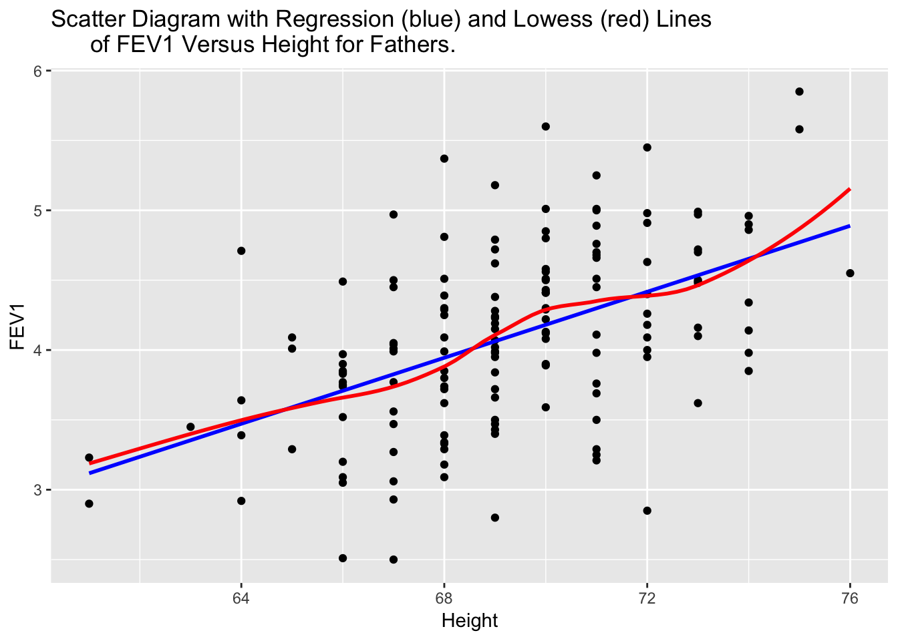
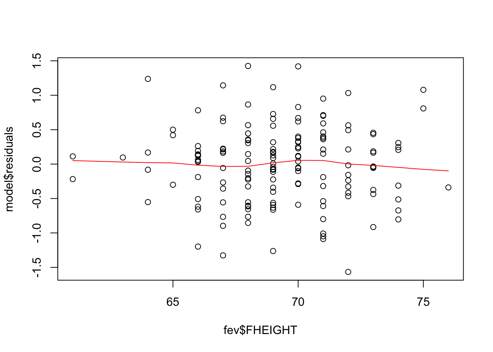
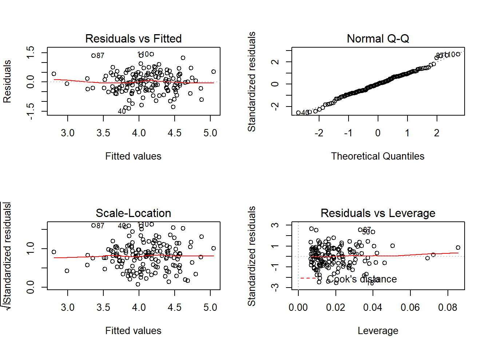

# Simple Linear Regression

The goal of linear regression is to 

* Describe the relationship between an independent variable X and a continuous
  dependent variable $Y$ as a straight line. The textbook discusses two cases: 
    - Fixed-$X$: values of $X$ are preselected by investigator
    - Variable-$X$: have random sample of $(X,Y)$ values
    - Calculations are the same, 
* Draw inferences regarding this relationship
* Predict value of $Y$ for a given value of $X$

## Mathmatical Model
* The mean of $Y$ values at any given $X$ is $\beta_{0} + \beta_{1} X$
* The variance of $Y$ values at any $X$ is $\sigma^2$ (same for all X)
* $Y$ values are normally distributed at any given $X$ (need for inference)


## Parameter Estimates
* Estimate the slope $\beta_{1}$ and intercept $\beta_{0}$ using least-squares methods.
* The residual mean squared error (RMSE) is an estimate of the variance $s^{2}$
* Typically interested in inference on $\beta_{1}$
    - Assume no relationship between $X$ and $Y$ $(H_{0}: \beta_{1}=0)$ 
      until there is reason to believe there is one 
      $(H_{0}: \beta_{1} \neq 0)$

## Interval estimation
* Everything is estimated with some degree of error
* Confidence intervals for the mean of $Y$
* Prediction intervals for an individual $Y$ 

Which one is wider? Why?

## Corelation Coefficient

* The correlation coefficient $\rho$ measures the strength of association
  between $X$ and $Y$ in the _population_.
* $\sigma^{2} = VAR(Y|X)$ is the variance of $Y$ for a specific $X$.
* $\sigma_{y}^{2} = VAR(Y)$ is the variance of $Y$ for all $X$'s.

$$ \sigma^{2} = \sigma_{y}^{2}(1-\rho^{2})$$
$$ \rho^{2} = \frac{\sigma_{y}^{2} - \sigma^{2}}{\sigma_{y}^{2}}$$

* $\rho^{2}$ = reduction in variance of Y associated with knowledge of X/original variance of Y
* **Coefficient of Determiniation**: $100\rho^{2}$ = % of variance of Y associated with X or explained by X
* Caution: association vs. causation.


## Assumptions
* Homogeneity of variance (same $\sigma^{2}$)
    - Not extremely serious
    - Can use transformations to achieve it
    - Graphical assessment: Plot the residuals against the x variable, add a lowess line. 
      This assumption is upheld if there is no relationship/trend between the residuals and
      the predictor. 
* Normal residuals
    - Slight departures OK
    - Can use transformations to achieve it
    - Graphical assessment: normal qqplot of the model residuals. 
* Randomness / Independence
    - Very serious
    - Can use hierarchical models for clustered samples
    - No real good way to "test" for independence. Need to know how the sample was obtained. 
* Linear relationship
    - Slight departures OK
    - Can use transformations to achieve it
    - Graphical assessment: Simple scatterplot of $y$ vs $x$. 
      Looking for linearity in the relationship. 
      Should be done prior to any analysis. 


## Example

Using a cleaned version of the Lung function data set, lets explore the relationship between height and FEV for fathers in this data set. 


```r
fev <- read.delim("https://norcalbiostat.netlify.com/data/Lung_081217.txt", sep="\t", header=TRUE)
```


```r
library(ggplot2)
qplot(y=FFEV1, x=FHEIGHT, geom="point", data=fev, xlab="Height", ylab="FEV1", 
      main="Scatter Diagram with Regression (blue) and Lowess (red) Lines 
      of FEV1 Versus Height for Fathers.") + 
      geom_smooth(method="lm", se=FALSE, col="blue") + 
      geom_smooth(se=FALSE, col="red") 
```



There does appear to be a tendency for taller men to have higher FEV1. Let's fit a linear model and report the regression parameter estimates. 

```r
model <- lm(FFEV1 ~ FHEIGHT, data=fev)
summary(model)
## 
## Call:
## lm(formula = FFEV1 ~ FHEIGHT, data = fev)
## 
## Residuals:
##      Min       1Q   Median       3Q      Max 
## -1.56688 -0.35290  0.04365  0.34149  1.42555 
## 
## Coefficients:
##             Estimate Std. Error t value Pr(>|t|)    
## (Intercept) -4.08670    1.15198  -3.548 0.000521 ***
## FHEIGHT      0.11811    0.01662   7.106 4.68e-11 ***
## ---
## Signif. codes:  0 '***' 0.001 '**' 0.01 '*' 0.05 '.' 0.1 ' ' 1
## 
## Residual standard error: 0.5638 on 148 degrees of freedom
## Multiple R-squared:  0.2544,	Adjusted R-squared:  0.2494 
## F-statistic:  50.5 on 1 and 148 DF,  p-value: 4.677e-11
```
The least squares equation is $Y = -4.087 + 0.118X$.


```r
confint(model)
##                   2.5 %     97.5 %
## (Intercept) -6.36315502 -1.8102499
## FHEIGHT      0.08526328  0.1509472
```
For ever inch taller a father is, his FEV1 measurement significantly increases by .12 (95%CI: .09, .15, p<.0001).  
The correlation between FEV1 and height is $\sqrt{.2544}$ = 0.5. 


Lastly, check assumptions on the residuals to see if the model results are valid. 

* Homogeneity of variance 

```r
plot(model$residuals ~ fev$FHEIGHT)
lines(lowess(model$residuals ~ fev$FHEIGHT), col="red")
```



* Normal residuals

```r
qqnorm(model$residuals)
qqline(model$residuals, col="red")
```


No major deviations away from what is expected.   


# Multiple Linear Regression

* Extends simple linear regression.
* Describes a linear relationship between a single continuous $Y$ variable, and several $X$ variables.
* Predicts $Y$ from $X_{1}, X_{2}, \ldots , X_{P}$.

Now it's no longer a 2D regression _line_, but a $p$ dimensional regression plane. 


## Types of X variables
* Fixed: The levels of $X$ are selected in advance with the intent to measure the affect on an outcome $Y$. 
* Variable: Random sample of individuals from the population is taken and $X$ and $Y$ are measured on each individual.
* X's can be continuous or discrete (categorical)
* X's can be transformations of other X's, e.g., $log(x), x^{2}$. 

## Mathematical Model

$$ y_{i} = \beta_{0} + \beta_{1}x_{1i} + \ldots + \beta_{p}x_{pi} + \epsilon_{i}$$

The assumptions on the residuals $\epsilon_{i}$ still hold:   

* They have mean zero  
* They are homoscedastic, that is all have the same finite variance: $Var(\epsilon_{i})=\sigma^{2}<\infty$  
* Distinct error terms are uncorrelated: (Independent) $\text{Cov}(\epsilon_{i},\epsilon_{j})=0,\forall i\neq j.$  

The regression model relates $y$ to a function of $\textbf{X}$ and $\mathbf{\beta}$, where $\textbf{X}$ is a $nxp$ matrix of $p$ covariates on $n$ observations and $\mathbf{\beta}$ is a length $p$ vector of regression coefficients.

In matrix notation this looks like: 

$$ \textbf{y} = \textbf{X} \mathbf{\beta} + \mathbf{\epsilon} $$

## Parameter Estimation
The goal of regression analysis is to minimize the residual error. 
That is, to minimize the difference between the value of the dependent
variable predicted by the model and the true value of the dependent variable.

$$ \epsilon_{i} = \hat{y_{i}} - y_{i}$$

The method of Least Squares accomplishes this by finding parameter estimates 
$\beta_{0}$ and $\beta_{1}$ that minimized the sum of the squared residuals:

$$ \sum_{i=1}^{n} \epsilon_{i} $$

For simple linear regression the regression coefficient estimates that minimize the sum of squared errors can be calculated as: 
$$ \hat{\beta_{0}} = \bar{y} - \hat{\beta_{1}}\bar{x} \quad \mbox{  and  } \quad  \hat{\beta_{1}} = r\frac{s_{y}}{s_{x}} $$

For multiple linear regression, the fitted values $\hat{y_{i}}$ are calculated as the linear combination of x's and $\beta$'s, $\sum_{i=1}^{p}X_{ij}\beta_{j}$. The sum of the squared residual errors (the distance between the observed point $y_{i}$ and the fitted value) now has the following form: 

$$ \sum_{i=1}^{n} |y_{i} - \sum_{i=1}^{p}X_{ij}\beta_{j}|^{2}$$

Or in matrix notation

$$ || \mathbf{y} - \mathbf{X}\mathbf{\beta} ||^{2} $$ 

The details of methods to calculate the Least Squares estimate of $\beta$'s is left to a course in mathematical statistics. 


## Example 

The analysis in example @slr-ex concluded that FEV1 in fathers significantly increases by 0.12 (95% CI:0.09, 0.15) liters per additional inch in height (p<.0001). Looking at the multiple $R^{2}$ (correlation of determination), this simple model explains 25% of the variance seen in the outcome $y$. 

However, FEV tends to decrease with age for adults, so we should be able to predict it better if we use both height and age as independent variables in a multiple regression equation. 

*  What direction do you expect the slope coefficient for age to be? For height? 

Fitting a regression model in R with more than 1 predictor is done by adding each variable to the right hand side of the model notation connected with a `+`. 


```r
mv_model <- lm(FFEV1 ~ FAGE + FHEIGHT, data=fev)
summary(mv_model)
## 
## Call:
## lm(formula = FFEV1 ~ FAGE + FHEIGHT, data = fev)
## 
## Residuals:
##      Min       1Q   Median       3Q      Max 
## -1.34708 -0.34142  0.00917  0.37174  1.41853 
## 
## Coefficients:
##              Estimate Std. Error t value Pr(>|t|)    
## (Intercept) -2.760747   1.137746  -2.427   0.0165 *  
## FAGE        -0.026639   0.006369  -4.183 4.93e-05 ***
## FHEIGHT      0.114397   0.015789   7.245 2.25e-11 ***
## ---
## Signif. codes:  0 '***' 0.001 '**' 0.01 '*' 0.05 '.' 0.1 ' ' 1
## 
## Residual standard error: 0.5348 on 147 degrees of freedom
## Multiple R-squared:  0.3337,	Adjusted R-squared:  0.3247 
## F-statistic: 36.81 on 2 and 147 DF,  p-value: 1.094e-13
confint(mv_model)
##                   2.5 %      97.5 %
## (Intercept) -5.00919751 -0.51229620
## FAGE        -0.03922545 -0.01405323
## FHEIGHT      0.08319434  0.14559974
```
Holding height constant, a father who is one year older is expected to have a FEV value 0.03 (0.01, 0.04) liters less than another man (p<.0001).

Holding height constant, a father who is 1cm taller than another man is expected to have a FEV value of 0.11 (.08, 0.15) liter greater than the other man (p<.0001). 

For the model that includes age, the coefficient for height is now 0.11, which is interpreted as the rate of change of FEV1 as a function of height **after adjusting for age**. This is also called the **partial regression coefficient** of FEV1 on height after adjusting for age. 

Both height and age are significantly associated with FEV in fathers (p<.0001 each).


## Model Diagnostics 

The same set of regression diagnostics can be examined to identify any potential influential points, outliers or other problems with the linear model. 


```r
par(mfrow=c(2,2))
plot(mv_model)
```




## Multicollinearity

* Occurs when some of the X variables are highly intercorrelated.
* Affects estimates and their SE's (p. 143)
* Look at tolerance, and its inverse, the Variance Inflation Factor (VIF)
* Need tolerance < 0.01, or VIF > 100.


```r
library(car)
vif(mv_model)
##     FAGE  FHEIGHT 
## 1.003163 1.003163
tolerance = 1/vif(mv_model)
tolerance
##      FAGE   FHEIGHT 
## 0.9968473 0.9968473
```

* Solution: use variable selection to delete some X variables.
* Alternatively, use dimension reduction techniques such as Principal Components


## What to watch out for
* Representative sample 
* Range of prediction should match observed range of X in sample
* Use of nominal or ordinal, rather than interval or ratio data
* Errors-in-variables
* Correlation does not imply causation 
* Violation of assumptions
* Influential points
* Appropriate model
* Multicollinearity


