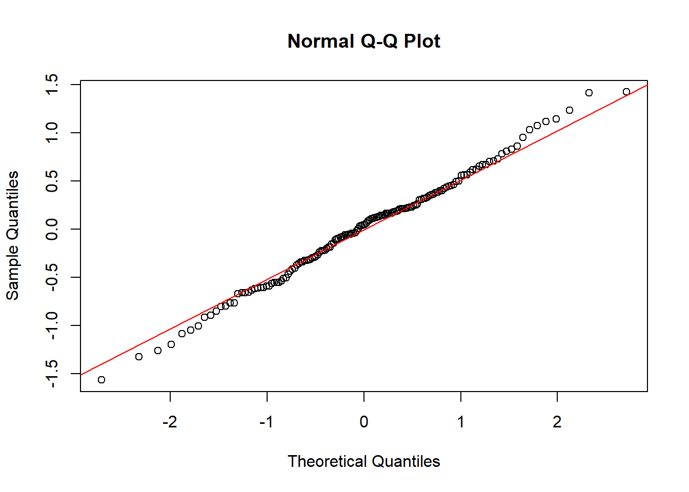
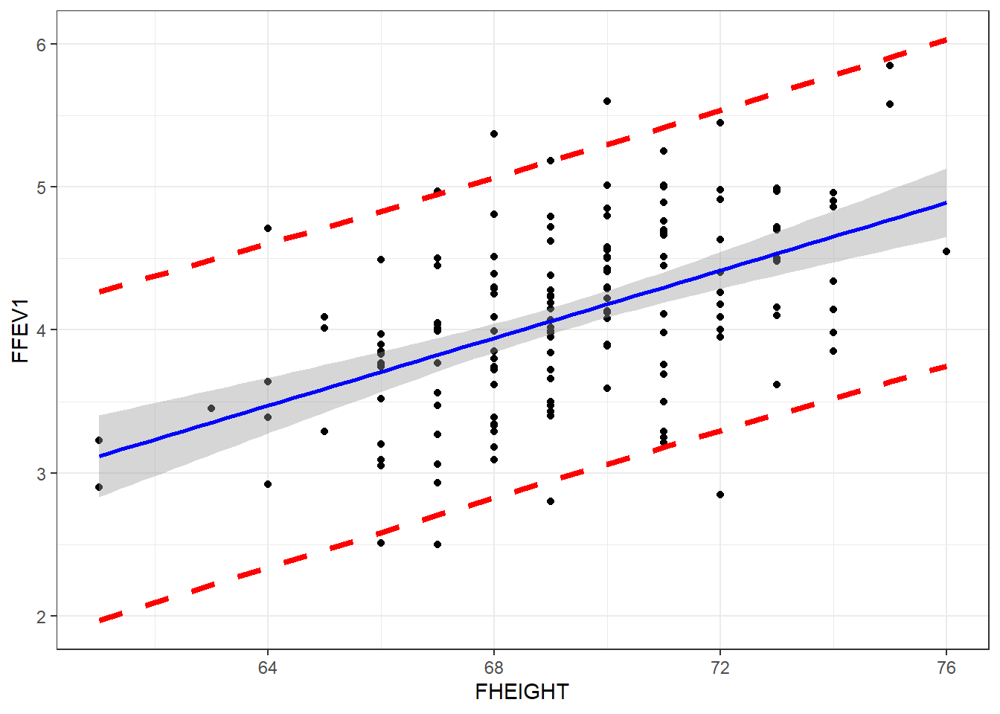

# Simple Linear Regression {#slr}

The goal of linear regression is to describe the relationship between an independent variable X and a continuous dependent variable $Y$ as a straight line. 

Data for this type of model can arise in two ways; 
  
* Fixed-$X$: values of $X$ are preselected by investigator
* Variable-$X$: have random sample of $(X,Y)$ values
    
    
Both Regression and Correlation can be used for two main purposes: 

* **Descriptive**: Draw inferences regarding the relationship 
* **Predictive**: Predict value of $Y$ for a given value of $X$

Simple Linear Regression is an example of a Bivariate analysis since there is only one covariate (explanatory variable) under consideration.  

## Example

Lung function data were obtained from an epidemiological study of households living in four areas with different amounts and types of air pollution. The data set used in this book is a subset of the total data. In this chapter we use only the data taken on the fathers, all of whom are nonsmokers (see PMA6 Appendix A for more details). 


```r
# Read in the data from a version stored online. 
fev <- read.delim("https://norcalbiostat.netlify.com/data/Lung_081217.txt", sep="\t", header=TRUE)
```

One of the major early indicators of reduced respiratory function is FEV1 or forced expiratory volume in the first second (amount of air exhaled in 1 second). Since it is known that taller males tend to have higher FEV1, we wish to determine the relationship between height and FEV1. We can use regression analysis for both a descriptive and predictive purpose. 

* **Descriptive**: Describing the relationship between FEV1 and height
* **Predictive**: Use the equation to determine expected or normal FEV1 for a given height


```r
ggplot(fev, aes(y=FFEV1, x=FHEIGHT)) + geom_point() + 
      xlab("Height") + ylab("FEV1") + 
      ggtitle("Scatterplot and Regression line of FEV1 Versus Height for Males.") + 
      geom_smooth(method="lm", se=FALSE, col="blue") 
```


In this graph, height is given on the horizontal axis since it is the independent or predictor variable and FEV1 is given on the vertical axis since it is the dependent or outcome variable.

**Interpretation**: There does appear to be a tendency for taller men to have higher FEV1. The **regression line** is also added to the graph. The line is tilted upwards, indicating that we expect larger values of FEV1 with larger values of height.

Specifically the equation of the regression line is 
$$
Y = -4.087 + 0.118 X
$$

The quantity 0.118 in front of $X$ is greater than zero, indicating that as we increase $X, Y$ will increase. For example, we would expect a father who is 70 inches tall to have an FEV1 value of

$$\mbox{FEV1} = -4.087 + (0.118) (70) = 4.173$$

If the height was 66 inches then we would expect an FEV1 value of only 3.70.

### Caution on out of range predictions

To take an extreme example, suppose a father was 2 feet tall. Then the equation would predict a negative value of FEV1 ($-1.255$).

A safe policy is to restrict the use of the equation to the range of the $X$ observed in the sample.


## Mathematical Model

The mathematical model that we use for regression has three features.

1. $Y$ values are normally distributed at any given $X$ 
2. The mean of $Y$ values at any given $X$ follows a straight line $Y = \beta_{0} + \beta_{1} X$. 
2. The variance of $Y$ values at any $X$ is $\sigma^2$ (same for all X). This is known as _homoscedasticity_, or _homogeneity of variance_. 


Mathematically this is written as: 

$$
Y|X \sim N(\mu_{Y|X}, \sigma^{2}) \\
\mu_{Y|X} = \beta_{0} + \beta_{1} X \\
Var(Y|X) = \sigma^{2} 
$$

and can be visualized as: 


### Unifying model framework

The mathematical model above describes the theoretical relationship between $Y$ and $X$. So in our unifying model framework to describe observed data, 

> DATA = MODEL + RESIDUAL

Our observed data values $y_{i}$ can be modeled as being centered on $\mu_{Y|X}$, with normally distributed residuals. 

$$
y_{i} = \beta_{0} + \beta_{1} X + \epsilon_{i} \\
\epsilon_{i} \sim N(0, \sigma^{2})
$$


### Parameter Estimates
* Estimate the slope $\beta_{1}$ and intercept $\beta_{0}$ using a method called **Least Squares**.
* The residual mean squared error (RMSE) is an estimate of the variance $s^{2}$
    - RMSE can also refer to the root mean squared error. 
  
  
## Least Squares Regression 

The **Least Squares** method finds the estimates for the intercept $b_{0}$ and slope $b_{1}$ that minimize the SSE (Sum of squared errors). Let's see how that works: 

See https://paternogbc.shinyapps.io/SS_regression/

**Initial Setup**  

* Set the sample size to 50
* Set the regression slope to 1
* Set the standard deviation to 5

**Partitioning the Variance using the Sum of Squares**

* SS Total- how far are the points away from $\bar{y}$? (one sample mean)
* SS Regression - how far away is the regression line from $\bar{y}$?.
* SS Error - how far are the points away from the estimated regression line? 


Looking at it this way, we are asking "If I know the value of $x$, how much better will I be at predicting $y$ than if I were just to use $\bar{y}$? 

_This is the same partitioning of variance that is happens with ANOVA!_

\BeginKnitrBlock{rmdnote}<div class="rmdnote">Increase the standard deviation to 30. What happens to SSReg? What about SSE? </div>\EndKnitrBlock{rmdnote}
      

Here is a [link](https://ryansafner.shinyapps.io/ols_estimation_by_min_sse/) to another interactive app where you can try to fit your own line to minimize the SSE. 

**RMSE** is the Root Mean Squared Error. In the PMA textbook this is denoted as $S$, which is an estimate for $\sigma$. 

$$ S = \sqrt{\frac{SSE}{N-2}}$$


<!---
## Correlation Coefficient

* The correlation coefficient $\rho$ measures the strength of association between $X$ and $Y$ in the _population_.
* $\sigma^{2} = VAR(Y|X)$ is the variance of $Y$ for a specific $X$.
* $\sigma_{y}^{2} = VAR(Y)$ is the variance of $Y$ for all $X$'s.

$$ \sigma^{2} = \sigma_{y}^{2}(1-\rho^{2})$$
$$ \rho^{2} = \frac{\sigma_{y}^{2} - \sigma^{2}}{\sigma_{y}^{2}}$$

* $\rho^{2}$ = reduction in variance of Y associated with knowledge of X/original variance of Y
* **Coefficient of Determination**: $100\rho^{2}$ = % of variance of Y associated with X or explained by X
* Caution: association vs. causation.
--->

## Assumptions

Many of the assumptions for regression are on the form of the residuals, which can't be assessed until _after_ the model has been fit. 

**Assumptions to check before modeling**

* Randomness / Independence
    - Very serious
    - Can use hierarchical models for clustered samples
    - No real good way to "test" for independence. Need to know how the sample was obtained. 
* Linear relationship
    - Slight departures OK
    - Can use transformations to achieve it
    - Graphical assessment: Simple scatterplot of $y$ vs $x$. 
      Looking for linearity in the relationship. 
      Should be done prior to any analysis. 

**Assumptions to check after modeling**

* Homogeneity of variance (same $\sigma^{2}$)
    - Not extremely serious
    - Can use transformations to achieve it
    - Graphical assessment: Plot the residuals against the x variable, add a lowess line. 
      This assumption is upheld if there is no relationship/trend between the residuals and
      the predictor. 
* Normal residuals
    - Slight departures OK
    - Can use transformations to achieve it
    - Graphical assessment: normal qqplot of the model residuals. 


## Example {#slr-fev}

\BeginKnitrBlock{rmdnote}<div class="rmdnote">This section uses functions from the `broom`, and `performance` packages to help tidy and visualize results from regression models. </div>\EndKnitrBlock{rmdnote}

Returning to the Lung function data set from PMA6, lets analyze the relationship between height and FEV for fathers in this data set. 


```r
ggplot(fev, aes(y=FFEV1, x=FHEIGHT)) + geom_point() + 
      xlab("Height") + ylab("FEV1") + 
      ggtitle("Scatter Diagram with Regression (blue) and Lowess (red) Lines 
      of FEV1 Versus Height for Fathers.") + 
      geom_smooth(method="lm", se=FALSE, col="blue") + 
      geom_smooth(se=FALSE, col="red") 
```


There does appear to be a tendency for taller men to have higher FEV1. The trend is linear, the red lowess trend line follows the blue linear fit line quite well. 

Let's fit a linear model and report the regression parameter estimates. 

```r
fev.dad.model <- lm(FFEV1 ~ FHEIGHT, data=fev)
broom::tidy(fev.dad.model) |> kable(digits=3)
```

<table>
 <thead>
  <tr>
   <th style="text-align:left;"> term </th>
   <th style="text-align:right;"> estimate </th>
   <th style="text-align:right;"> std.error </th>
   <th style="text-align:right;"> statistic </th>
   <th style="text-align:right;"> p.value </th>
  </tr>
 </thead>
<tbody>
  <tr>
   <td style="text-align:left;"> (Intercept) </td>
   <td style="text-align:right;"> -4.087 </td>
   <td style="text-align:right;"> 1.152 </td>
   <td style="text-align:right;"> -3.548 </td>
   <td style="text-align:right;"> 0.001 </td>
  </tr>
  <tr>
   <td style="text-align:left;"> FHEIGHT </td>
   <td style="text-align:right;"> 0.118 </td>
   <td style="text-align:right;"> 0.017 </td>
   <td style="text-align:right;"> 7.106 </td>
   <td style="text-align:right;"> 0.000 </td>
  </tr>
</tbody>
</table>

The least squares equation is $Y = -4.09 + 0.118X$. We can calculate the confidence interval for that estimate using the `confint` function. 


```r
confint(fev.dad.model) |> kable(digits=3)
```

<table>
 <thead>
  <tr>
   <th style="text-align:left;">   </th>
   <th style="text-align:right;"> 2.5 % </th>
   <th style="text-align:right;"> 97.5 % </th>
  </tr>
 </thead>
<tbody>
  <tr>
   <td style="text-align:left;"> (Intercept) </td>
   <td style="text-align:right;"> -6.363 </td>
   <td style="text-align:right;"> -1.810 </td>
  </tr>
  <tr>
   <td style="text-align:left;"> FHEIGHT </td>
   <td style="text-align:right;"> 0.085 </td>
   <td style="text-align:right;"> 0.151 </td>
  </tr>
</tbody>
</table>

For ever inch taller a father is, his FEV1 measurement significantly increases by .12 (95%CI: .09, .15, p<.0001).  


Lastly, we need to check assumptions on the residuals to see if the model results are valid. 


```r
performance::check_model(fev.dad.model, 
        check = c("qq", "linearity", "homogeneity", "pp_check"))
```




No major deviations away from what is expected.   

## Prediction 
The `predict` function is used to create model based predictions. 

### Predict the _average_ value of Y ($\hat{y}$) based on the model

Create predictions for all observations in the data based on the model, and then take the mean of those $n$ predictions. 

$$
\hat{y_{i}} = b_{0} + b_{1}x_{i} \\
\hat{\mu} = \frac{1}{n}\hat{y_{i}}
$$


```r
predict(fev.dad.model) |> mean()
## [1] 4.093267
```

### Confidence intervals for the predicted mean
We can leverage the `t.test()` function to give us the confidence interval for $\hat{\mu}$


```r
t.test(predict(fev.dad.model))
## 
## 	One Sample t-test
## 
## data:  predict(fev.dad.model)
## t = 152.73, df = 149, p-value < 2.2e-16
## alternative hypothesis: true mean is not equal to 0
## 95 percent confidence interval:
##  4.040309 4.146225
## sample estimates:
## mean of x 
##  4.093267
```

This model predicts that fathers will have FEV1 measurements of 4.09 (95% CI 4.04, 4.14) on average. 

### Predict the _average_ value of Y $(\hat{y_{i}})$ for a certain value of $x^{*}$

This is also called the _fitted_ value. 

$$\hat{y_{i}} = b_{0} + b_{1}x^{*}_{i}$$

We create a new `data.frame` that holds the values of the data we want to predict. $x^{*}=60$ in the first example,  $x^{*}=65$ and $68$ in the second example. 


```r
predict(fev.dad.model, newdata = data.frame(FHEIGHT = 60))
##        1 
## 2.999612
predict(fev.dad.model, newdata = data.frame(FHEIGHT = c(65, 68)))
##        1        2 
## 3.590138 3.944454
```

The confidence interval for the fitted value $\hat{y_{i}}$ is

$$
\hat{Y} \pm t_{\frac{\alpha}{2}}S \bigg[ \frac{1}{N} + \sqrt{\frac{(X^* - \bar{X})^{2}}{\sum(X - \bar{X})^{2}}} \quad  \bigg]
$$

where $S$ is the sample estimated variance (RMSE). We can use the `interval` argument to `predict` to calculate this interval. 


```r
predict(fev.dad.model, 
        newdata = data.frame(FHEIGHT = c(65, 68)),
        interval = "confidence")
##        fit      lwr      upr
## 1 3.590138 3.423257 3.757019
## 2 3.944454 3.844515 4.044393
```

### Predict a _new_ value of Y $\hat{y_{i}}$ for a certain value of $x^{*}$

The point estimate of $\hat{y_{i}}$ is calculated the same, but the prediction interval is wider. This is because individual $y$'s are more variable than the average. This is the same concept that we saw when studying sampling distributions. The standard deviation of the mean $\mu_{Y}$, is smaller than the standard deviation of the individual data points $y_{i}$.

$$
\hat{Y} \pm t_{\frac{\alpha}{2}}S \bigg[ 1+  \frac{1}{N} + \sqrt{\frac{(X^* - \bar{X})^{2}}{\sum(X - \bar{X})^{2}}} \quad  \bigg]
$$

This is obtained in R by modifying the value of the `interval` argument. 


```r
predict(fev.dad.model, 
        newdata = data.frame(FHEIGHT = c(65, 68)),
        interval = "prediction")
##        fit      lwr      upr
## 1 3.590138 2.463568 4.716709
## 2 3.944454 2.825839 5.063069
```

If we set the `se` argument in `geom_smooth` to TRUE, the shaded region is the confidence band for the mean. To get the prediction interval, we have use the `predict` function to calculate the prediction interval, and then we can add that onto the plot as additional `geom_lines`.


```r
pred.int <- predict(fev.dad.model, interval="predict") |> data.frame()

ggplot(fev, aes(y=FFEV1, x=FHEIGHT)) + geom_point() + 
      geom_smooth(method="lm", se=TRUE, col="blue") + 
      geom_line(aes(y=pred.int$lwr), linetype="dashed", col="red", lwd=1.5) + 
      geom_line(aes(y=pred.int$upr), linetype="dashed", col="red", lwd=1.5)
```



## ANOVA for regression

Since an ANOVA is an analysis of the variance due to a model, compared to the unexplained variance, it can be used to test the overall model fit. This will give us the same general answer to the question of "is there an association between X and Y" that testing for a non-zero slope ($\beta \neq 0$). If the mean squared value for the regression is much larger than the mean squared value for the residual error, then the line fits the data better than the simple mean, and thus, the slope of the line is not zero. 


```r
aov(fev.dad.model) |> summary() |> pander()
```


--------------------------------------------------------------
    &nbsp;       Df    Sum Sq   Mean Sq   F value    Pr(>F)   
--------------- ----- -------- --------- --------- -----------
  **FHEIGHT**     1    16.05     16.05     50.5     4.677e-11 

 **Residuals**   148   47.05    0.3179      NA         NA     
--------------------------------------------------------------

Table: Analysis of Variance Model


# Multiple Linear Regression {#mlr}

* Extends simple linear regression.
* Describes a linear relationship between a single continuous $Y$ variable, and several $X$ variables.
* Predicts $Y$ from $X_{1}, X_{2}, \ldots , X_{P}$.

Now it's no longer a 2D regression _line_, but a $p$ dimensional regression plane. 


## Types of X variables
* Fixed: The levels of $X$ are selected in advance with the intent to measure the affect on an outcome $Y$. 
* Variable: Random sample of individuals from the population is taken and $X$ and $Y$ are measured on each individual.
* X's can be continuous or discrete (categorical)
* X's can be transformations of other X's, e.g., $log(x), x^{2}$. 

## Mathematical Model

$$ y_{i} = \beta_{0} + \beta_{1}x_{1i} + \ldots + \beta_{p}x_{pi} + \epsilon_{i}$$

The assumptions on the residuals $\epsilon_{i}$ still hold:   

* They have mean zero  
* They are homoscedastic, that is all have the same finite variance: $Var(\epsilon_{i})=\sigma^{2}<\infty$  
* Distinct error terms are uncorrelated: (Independent) $\text{Cov}(\epsilon_{i},\epsilon_{j})=0,\forall i\neq j.$  

The regression model relates $y$ to a function of $\textbf{X}$ and $\mathbf{\beta}$, where $\textbf{X}$ is a $nxp$ matrix of $p$ covariates on $n$ observations and $\mathbf{\beta}$ is a length $p$ vector of regression coefficients.

In matrix notation this looks like: 

$$ \textbf{y} = \textbf{X} \mathbf{\beta} + \mathbf{\epsilon} $$

## Parameter Estimation
The goal of regression analysis is to minimize the residual error. 
That is, to minimize the difference between the value of the dependent
variable predicted by the model and the true value of the dependent variable.

$$ \epsilon_{i} = \hat{y_{i}} - y_{i}$$

The method of Least Squares accomplishes this by finding parameter estimates 
$\beta_{0}$ and $\beta_{1}$ that minimized the sum of the squared residuals:

$$ \sum_{i=1}^{n} \epsilon_{i} $$

For simple linear regression the regression coefficient estimates that minimize the sum of squared errors can be calculated as: 
$$ \hat{\beta_{0}} = \bar{y} - \hat{\beta_{1}}\bar{x} \quad \mbox{  and  } \quad  \hat{\beta_{1}} = r\frac{s_{y}}{s_{x}} $$

For multiple linear regression, the fitted values $\hat{y_{i}}$ are calculated as the linear combination of x's and $\beta$'s, $\sum_{i=1}^{p}X_{ij}\beta_{j}$. The sum of the squared residual errors (the distance between the observed point $y_{i}$ and the fitted value) now has the following form: 

$$ \sum_{i=1}^{n} |y_{i} - \sum_{i=1}^{p}X_{ij}\beta_{j}|^{2}$$

Or in matrix notation

$$ || \mathbf{y} - \mathbf{X}\mathbf{\beta} ||^{2} $$ 

The details of methods to calculate the Least Squares estimate of $\beta$'s is left to a course in mathematical statistics. 


## Example 

The analysis in example \@ref(slr-ex) concluded that FEV1 in fathers significantly increases by 0.12 (95% CI:0.09, 0.15) liters per additional inch in height (p<.0001). Looking at the multiple $R^{2}$ (correlation of determination), this simple model explains 25% of the variance seen in the outcome $y$. 

However, FEV tends to decrease with age for adults, so we should be able to predict it better if we use both height and age as independent variables in a multiple regression equation. 

*  What direction do you expect the slope coefficient for age to be? For height? 

Fitting a regression model in R with more than 1 predictor is done by adding each variable to the right hand side of the model notation connected with a `+`. 


```r
mv_model <- lm(FFEV1 ~ FAGE + FHEIGHT, data=fev)
summary(mv_model)
## 
## Call:
## lm(formula = FFEV1 ~ FAGE + FHEIGHT, data = fev)
## 
## Residuals:
##      Min       1Q   Median       3Q      Max 
## -1.34708 -0.34142  0.00917  0.37174  1.41853 
## 
## Coefficients:
##              Estimate Std. Error t value Pr(>|t|)    
## (Intercept) -2.760747   1.137746  -2.427   0.0165 *  
## FAGE        -0.026639   0.006369  -4.183 4.93e-05 ***
## FHEIGHT      0.114397   0.015789   7.245 2.25e-11 ***
## ---
## Signif. codes:  0 '***' 0.001 '**' 0.01 '*' 0.05 '.' 0.1 ' ' 1
## 
## Residual standard error: 0.5348 on 147 degrees of freedom
## Multiple R-squared:  0.3337,	Adjusted R-squared:  0.3247 
## F-statistic: 36.81 on 2 and 147 DF,  p-value: 1.094e-13
confint(mv_model)
##                   2.5 %      97.5 %
## (Intercept) -5.00919751 -0.51229620
## FAGE        -0.03922545 -0.01405323
## FHEIGHT      0.08319434  0.14559974
```
Holding height constant, a father who is one year older is expected to have a FEV value 0.03 (0.01, 0.04) liters less than another man (p<.0001).

Holding age constant, a father who is 1cm taller than another man is expected to have a FEV value of 0.11 (.08, 0.15) liter greater than the other man (p<.0001). 

For the model that includes age, the coefficient for height is now 0.11, which is interpreted as the rate of change of FEV1 as a function of height **after adjusting for age**. This is also called the **partial regression coefficient** of FEV1 on height after adjusting for age. 

Both height and age are significantly associated with FEV in fathers (p<.0001 each).

## Binary predictors.

Does gender also play a roll in FEV? Let's look at the separate effects of height and age on FEV1, and visualize how gender plays a roll. 


```r
ht.plot <- ggplot(fev_long, aes(x=ht, y=fev1)) + 
        geom_point(aes(col=gender)) + 
        geom_smooth(se=FALSE, aes(col=gender), method="lm") + 
        geom_smooth(se=FALSE, col="red", method="lm") + 
        scale_color_viridis_d() + 
        theme(legend.position = c(0.15,0.85))

age.plot <- ggplot(fev_long, aes(x=age, y=fev1)) + 
        geom_point(aes(col=gender)) + 
        geom_smooth(se=FALSE, aes(col=gender), method="lm") + 
        geom_smooth(se=FALSE, col="red", method="lm") + 
        scale_color_viridis_d(guide=FALSE)
        
gridExtra::grid.arrange(ht.plot, age.plot, ncol=2)
```


* The points are colored by gender
* Each gender has it's own best fit line in the same color as the points
* The red line is the best fit line overall - ignoring gender

 Is gender a moderator for either height or age? 

Let's compare the models with, and without gender 

<table style="text-align:center"><tr><td colspan="3" style="border-bottom: 1px solid black"></td></tr><tr><td style="text-align:left"></td><td colspan="2"><em>Dependent variable:</em></td></tr>
<tr><td></td><td colspan="2" style="border-bottom: 1px solid black"></td></tr>
<tr><td style="text-align:left"></td><td colspan="2">fev1</td></tr>
<tr><td style="text-align:left"></td><td>W/o gender</td><td>w/ gender</td></tr>
<tr><td colspan="3" style="border-bottom: 1px solid black"></td></tr><tr><td style="text-align:left">age</td><td>-0.02<sup>***</sup> (-0.03, -0.01)</td><td>-0.02<sup>***</sup> (-0.03, -0.02)</td></tr>
<tr><td style="text-align:left">ht</td><td>0.16<sup>***</sup> (0.15, 0.18)</td><td>0.11<sup>***</sup> (0.08, 0.13)</td></tr>
<tr><td style="text-align:left">genderF</td><td></td><td>-0.64<sup>***</sup> (-0.79, -0.48)</td></tr>
<tr><td style="text-align:left">Constant</td><td>-6.74<sup>***</sup> (-7.84, -5.63)</td><td>-2.24<sup>***</sup> (-3.71, -0.77)</td></tr>
<tr><td colspan="3" style="border-bottom: 1px solid black"></td></tr><tr><td style="text-align:left">Observations</td><td>300</td><td>300</td></tr>
<tr><td style="text-align:left">Adjusted R<sup>2</sup></td><td>0.57</td><td>0.65</td></tr>
<tr><td style="text-align:left">Residual Std. Error</td><td>0.53 (df = 297)</td><td>0.48 (df = 296)</td></tr>
<tr><td style="text-align:left">F Statistic</td><td>197.57<sup>***</sup> (df = 2; 297)</td><td>182.77<sup>***</sup> (df = 3; 296)</td></tr>
<tr><td colspan="3" style="border-bottom: 1px solid black"></td></tr><tr><td style="text-align:left"><em>Note:</em></td><td colspan="2" style="text-align:right"><sup>*</sup>p<0.1; <sup>**</sup>p<0.05; <sup>***</sup>p<0.01</td></tr>
</table>

* Gender is a binary categorical variable, with reference group "Male". 
    - This is detected because the variable that shows up in the regression model output is `genderF`. So the estimate shown is for males, compared to females. 
    - More details on how categorical variables are included in multivariable models is covered in section \@ref(cat-predictors). 


**Interpretation of Coefficients**

The regression equation for the model without gender is 

$$ y = -6.74 - 0.02 age + 0.16 height $$

* $b_{0}:$ For someone who is 0 years old and 0 cm tall, their FEV is -6.74L.
* $b_{1}:$ For every additional year older an individual is, their FEV1 decreases by 0.02L. 
* $b_{2}:$ For every additional cm taller an individual is, their FEV1 increases by 0.16L. 


The regression equation for the model with gender is 

$$ y = -2.24 - 0.02 age + 0.11 height - 0.64genderF $$


* $b_{0}:$ For a male who is 0 years old and 0 cm tall, their FEV is -2.24L.
* $b_{1}:$ For every additional year older an individual is, their FEV1 decreases by 0.02L. 
* $b_{2}:$ For every additional cm taller an individual is, their FEV1 increases by 0.16L. 
* $b_{3}:$ Females have 0.64L lower FEV compared to males. 

**Note**: The interpretation of categorical variables still falls under the template language of "for every one unit increase in $X_{p}$, $Y$ changes by $b_{p}$". Here, $X_{3}=0$ for males, and 1 for females. So a 1 "unit" change is females _compared to_ males. 

 Which model fits better? What measure are you using to quanitify "fit"? 

\BeginKnitrBlock{rmdnote}<div class="rmdnote">What part of the model (intercept, or one of the slope parameters) did adding gender have the most effect on? </div>\EndKnitrBlock{rmdnote}


## Categorical Predictors {#cat-predictors}

Let's continue to model the length of the iris petal based on the length of the sepal, controlling for species. But here we'll keep species as a categorical variable. What happens if we just put the variable in the model? 


```r
summary(lm(Petal.Length ~ Sepal.Length + Species, data=iris))
## 
## Call:
## lm(formula = Petal.Length ~ Sepal.Length + Species, data = iris)
## 
## Residuals:
##      Min       1Q   Median       3Q      Max 
## -0.76390 -0.17875  0.00716  0.17461  0.79954 
## 
## Coefficients:
##                   Estimate Std. Error t value Pr(>|t|)    
## (Intercept)       -1.70234    0.23013  -7.397 1.01e-11 ***
## Sepal.Length       0.63211    0.04527  13.962  < 2e-16 ***
## Speciesversicolor  2.21014    0.07047  31.362  < 2e-16 ***
## Speciesvirginica   3.09000    0.09123  33.870  < 2e-16 ***
## ---
## Signif. codes:  0 '***' 0.001 '**' 0.01 '*' 0.05 '.' 0.1 ' ' 1
## 
## Residual standard error: 0.2826 on 146 degrees of freedom
## Multiple R-squared:  0.9749,	Adjusted R-squared:  0.9744 
## F-statistic:  1890 on 3 and 146 DF,  p-value: < 2.2e-16
```

Examine the coefficient names, `Speciesversicolor` and `Speciesvirginica`. R (and most software packages) automatically take a categorical variable and turn it into a series of binary indicator variables. Let's look at what the software program does in the background. Below is a sample of the iris data. The first column shows the row number, specifically I am only showing 2 sample rows from each species. The second column is the value of the sepal length, the third is the binary indicator for if the iris is from species _versicolor_, next the binary indicator for if the iris is from species _virginica_, and lastly the species as a 3 level categorical variable (which is what we're used to seeing at this point.)


----------------------------------------------------------------------------
 &nbsp;    Sepal.Length   Speciesversicolor   Speciesvirginica    Species   
--------- -------------- ------------------- ------------------ ------------
  **1**        5.1                0                  0             setosa   

  **2**        4.9                0                  0             setosa   

 **51**         7                 1                  0           versicolor 

 **52**        6.4                1                  0           versicolor 

 **101**       6.3                0                  1           virginica  

 **102**       5.8                0                  1           virginica  
----------------------------------------------------------------------------

### Factor variable coding

* Most commonly known as "Dummy coding". Not an informative term to use. 
* Better used term: Indicator variable
* Math notation: **I(gender == "Female")**. 
* A.k.a reference coding
* For a nominal X with K categories, define K indicator variables.
    - Choose a reference (referent) category:
    - Leave it out
    - Use remaining K-1 in the regression.
    - Often, the largest category is chosen as the reference category.

For the iris example, 2 indicator variables are created for _versicolor_ and _virginica_. Interpreting the regression coefficients are going to be **compared to the reference group**. In this case, it is species _setosa_. 

The mathematical model is now written as follows, where $x_{1}$ is Sepal Length, $x_{2}$ is the indicator for _versicolor_, and $x_{3}$ the indicator for _virginica_ 

$$ Y_{i} \sim \beta_{0} + \beta_{1}x_{i} + \beta_{2}x_{2i} + \beta_{3}x_{3i}+ \epsilon_{i}$$

Let's look at the regression coefficients and their 95% confidence intervals from the main effects model again. 


```r
main.eff.model <- lm(Petal.Length ~ Sepal.Length + Species, data=iris)
pander(main.eff.model)
```


---------------------------------------------------------------------
        &nbsp;           Estimate   Std. Error   t value   Pr(>|t|)  
----------------------- ---------- ------------ --------- -----------
    **(Intercept)**       -1.702      0.2301     -7.397    1.005e-11 

   **Sepal.Length**       0.6321     0.04527      13.96    1.121e-28 

 **Speciesversicolor**     2.21      0.07047      31.36    9.646e-67 

 **Speciesvirginica**      3.09      0.09123      33.87    4.918e-71 
---------------------------------------------------------------------

Table: Fitting linear model: Petal.Length ~ Sepal.Length + Species

```r
pander(confint(main.eff.model))
```


-----------------------------------------
        &nbsp;           2.5 %    97.5 % 
----------------------- -------- --------
    **(Intercept)**      -2.157   -1.248 

   **Sepal.Length**      0.5426   0.7216 

 **Speciesversicolor**   2.071    2.349  

 **Speciesvirginica**     2.91     3.27  
-----------------------------------------

In this _main effects_ model, Species only changes the intercept. The effect of species is not multiplied by Sepal length. The interpretations are the following: 

* $b_{1}$: After controlling for species, Petal length significantly increases with the length of the sepal (0.63, 95% CI 0.54-0.72, p<.0001). 
* $b_{2}$: _Versicolor_ has on average 2.2cm longer petal lengths compared to _setosa_ (95% CI 2.1-2.3, p<.0001). 
* $b_{3}$: _Virginica_ has on average 3.1cm longer petal lengths compared to _setosa_ (95% CI 2.9-3.3, p<.0001). 


## Model Diagnostics 

The same set of regression diagnostics can be examined to identify any potential influential points, outliers or other problems with the linear model. 


```r
par(mfrow=c(2,2))
plot(mv_model)
```


## Multicollinearity

* Occurs when some of the X variables are highly intercorrelated.
* Affects estimates and their SE's (p. 143)
* Look at tolerance, and its inverse, the Variance Inflation Factor (VIF)
* Need tolerance < 0.01, or VIF > 100.


```r
car::vif(mv_model)
##     FAGE  FHEIGHT 
## 1.003163 1.003163
tolerance = 1/car::vif(mv_model)
tolerance
##      FAGE   FHEIGHT 
## 0.9968473 0.9968473
```

* Solution: use variable selection to delete some X variables.
* Alternatively, use dimension reduction techniques such as Principal Components


## What to watch out for
* Representative sample 
* Range of prediction should match observed range of X in sample
* Use of nominal or ordinal, rather than interval or ratio data
* Errors-in-variables
* Correlation does not imply causation 
* Violation of assumptions
* Influential points
* Appropriate model
* Multicollinearity


