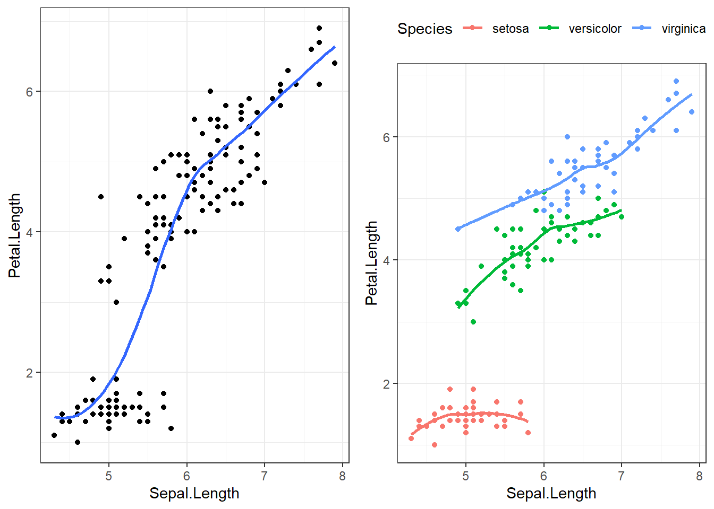
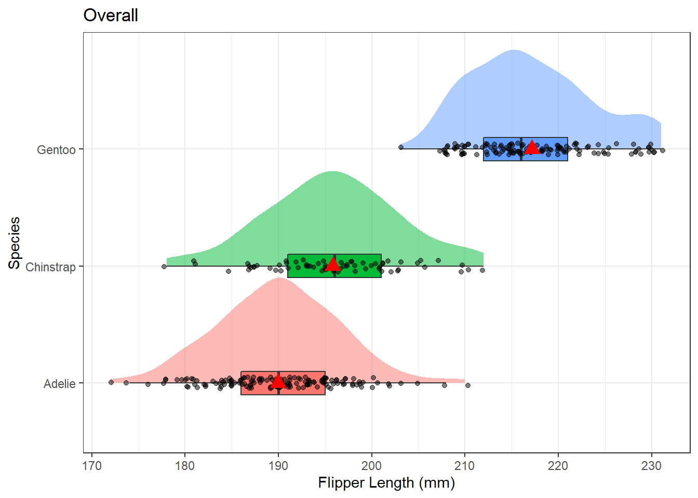
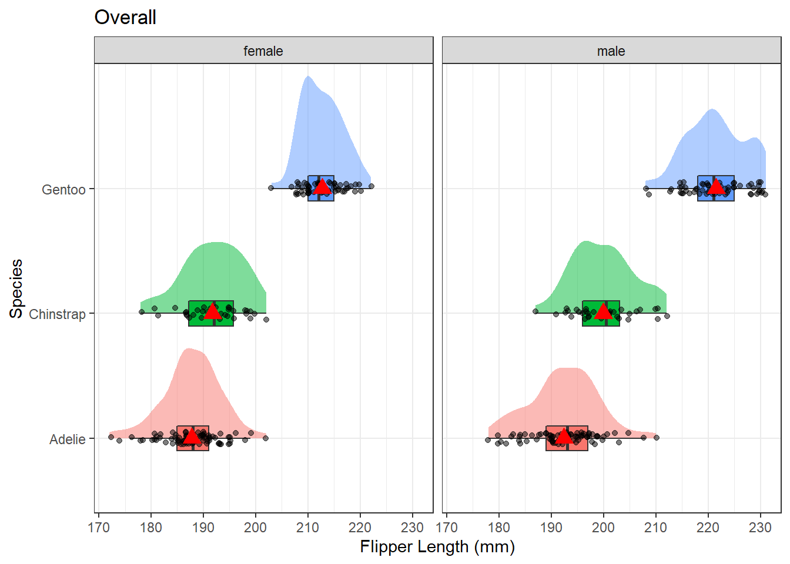
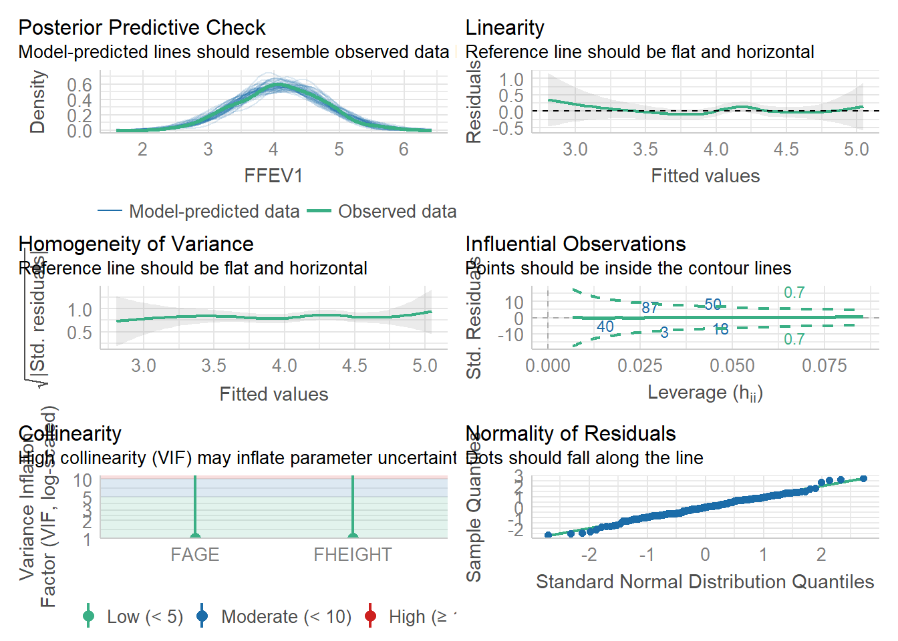

# Simple Linear Regression {#slr}

The goal of linear regression is to describe the relationship between an independent variable X and a continuous dependent variable $Y$ as a straight line. 

Data for this type of model can arise in two ways; 
  
* Fixed-$X$: values of $X$ are preselected by investigator
* Variable-$X$: have random sample of $(X,Y)$ values
    
    
Both Regression and Correlation can be used for two main purposes: 

* **Descriptive**: Draw inferences regarding the relationship 
* **Predictive**: Predict value of $Y$ for a given value of $X$

Simple Linear Regression is an example of a Bivariate analysis since there is only one covariate (explanatory variable) under consideration.  

\BeginKnitrBlock{rmdnote}<div class="rmdnote">This section uses functions from the `gridExtra`, `sjPlot`, `broom`, `performance` and `ggdist` packages to help tidy and visualize results from regression models. </div>\EndKnitrBlock{rmdnote}


## Example

Lung function data were obtained from an epidemiological study of households living in four areas with different amounts and types of air pollution. The data set used in this book is a subset of the total data. In this chapter we use only the data taken on the fathers, all of whom are nonsmokers (see PMA6 Appendix A for more details). 


```r
# Read in the data from a version stored online. 
fev <- read.delim("https://norcalbiostat.netlify.com/data/Lung_081217.txt", sep="\t", header=TRUE)
```

One of the major early indicators of reduced respiratory function is FEV1 or forced expiratory volume in the first second (amount of air exhaled in 1 second). Since it is known that taller males tend to have higher FEV1, we wish to determine the relationship between height and FEV1. We can use regression analysis for both a descriptive and predictive purpose. 

* **Descriptive**: Describing the relationship between FEV1 and height
* **Predictive**: Use the equation to determine expected or normal FEV1 for a given height


```r
ggplot(fev, aes(y=FFEV1, x=FHEIGHT)) + geom_point() + 
      xlab("Height") + ylab("FEV1") + 
      ggtitle("Scatterplot and Regression line of FEV1 Versus Height for Males.") + 
      geom_smooth(method="lm", se=FALSE, col="blue") 
```


In this graph, height is given on the horizontal axis since it is the independent or predictor variable and FEV1 is given on the vertical axis since it is the dependent or outcome variable.

**Interpretation**: There does appear to be a tendency for taller men to have higher FEV1. The **regression line** is also added to the graph. The line is tilted upwards, indicating that we expect larger values of FEV1 with larger values of height.

Specifically the equation of the regression line is 
$$
Y = -4.087 + 0.118 X
$$

The quantity 0.118 in front of $X$ is greater than zero, indicating that as we increase $X, Y$ will increase. For example, we would expect a father who is 70 inches tall to have an FEV1 value of

$$\mbox{FEV1} = -4.087 + (0.118) (70) = 4.173$$

If the height was 66 inches then we would expect an FEV1 value of only 3.70.

### Caution on out of range predictions

To take an extreme example, suppose a father was 2 feet tall. Then the equation would predict a negative value of FEV1 ($-1.255$).

A safe policy is to restrict the use of the equation to the range of the $X$ observed in the sample.


## Mathematical Model

The mathematical model that we use for regression has three features.

1. $Y$ values are normally distributed at any given $X$ 
2. The mean of $Y$ values at any given $X$ follows a straight line $Y = \beta_{0} + \beta_{1} X$. 
2. The variance of $Y$ values at any $X$ is $\sigma^2$ (same for all X). This is known as _homoscedasticity_, or _homogeneity of variance_. 


Mathematically this is written as: 

$$
Y|X \sim N(\mu_{Y|X}, \sigma^{2}) \\
\mu_{Y|X} = \beta_{0} + \beta_{1} X \\
Var(Y|X) = \sigma^{2} 
$$

and can be visualized as: 


### Unifying model framework

The mathematical model above describes the theoretical relationship between $Y$ and $X$. So in our unifying model framework to describe observed data, 

> DATA = MODEL + RESIDUAL

Our observed data values $y_{i}$ can be modeled as being centered on $\mu_{Y|X}$, with normally distributed residuals. 

$$
y_{i} = \beta_{0} + \beta_{1} X + \epsilon_{i} \\
\epsilon_{i} \sim N(0, \sigma^{2})
$$


## Parameter Estimates
* Estimate the slope $\beta_{1}$ and intercept $\beta_{0}$ using a method called **Least Squares**.
* The residual mean squared error (RMSE) is an estimate of the variance $s^{2}$
    - RMSE can also refer to the root mean squared error. 

The **Least Squares** method finds the estimates for the intercept $b_{0}$ and slope $b_{1}$ that minimize the SSE (Sum of squared errors). Let's explore that visually: 

See https://paternogbc.shinyapps.io/SS_regression/

**Initial Setup**  

* Set the sample size to 50
* Set the regression slope to 1
* Set the standard deviation to 5


The method of Least Squares finds the best estimates for $\beta_{0}$ and $\beta_{1}$ that minimized the sum of the squared residuals:

$$ \sum_{i=1}^{n} \epsilon_{i} $$

For simple linear regression the regression coefficient estimates that minimize the sum of squared errors can be calculated as: 

$$ \hat{\beta_{0}} = \bar{y} - \hat{\beta_{1}}\bar{x} \quad \mbox{  and  } \quad  \hat{\beta_{1}} = r\frac{s_{y}}{s_{x}} $$


### Sum of Squares

Partitioning the Variance using the Sum of Squares:

* SS Total- how far are the points away from $\bar{y}$? (one sample mean)
* SS Regression - how far away is the regression line from $\bar{y}$?.
* SS Error - how far are the points away from the estimated regression line? 

Looking at it this way, we are asking "If I know the value of $x$, how much better will I be at predicting $y$ than if I were just to use $\bar{y}$? 

_This is the same partitioning of variance that is happens with ANOVA!_

\BeginKnitrBlock{rmdnote}<div class="rmdnote">Increase the standard deviation to 30. What happens to SSReg? What about SSE? </div>\EndKnitrBlock{rmdnote}
      

Here is a [link](https://ryansafner.shinyapps.io/ols_estimation_by_min_sse/) to another interactive app where you can try to fit your own line to minimize the SSE. 

**RMSE** is the Root Mean Squared Error. In the PMA textbook this is denoted as $S$, which is an estimate for $\sigma$. 

$$ S = \sqrt{\frac{SSE}{N-2}}$$

## Assumptions

Many of the assumptions for regression are on the form of the residuals, which can't be assessed until _after_ the model has been fit. 

**Assumptions to check before modeling**

* Randomness / Independence
    - Very serious
    - Can use hierarchical models for clustered samples
    - No real good way to "test" for independence. Need to know how the sample was obtained. 
* Linear relationship
    - Slight departures OK
    - Can use transformations to achieve it
    - Graphical assessment: Simple scatterplot of $y$ vs $x$. 
      Looking for linearity in the relationship. 
      Should be done prior to any analysis. 

**Assumptions to check after modeling**

* Homogeneity of variance (same $\sigma^{2}$)
    - Not extremely serious
    - Can use transformations to achieve it
    - Graphical assessment: Plot the residuals against the x variable, add a lowess line. 
      This assumption is upheld if there is no relationship/trend between the residuals and
      the predictor. 
* Normal residuals
    - Slight departures OK
    - Can use transformations to achieve it
    - Graphical assessment: normal qqplot of the model residuals. 


## Example {#slr-fev}

Returning to the Lung function data set from PMA6, lets analyze the relationship between height and FEV for fathers in this data set. 


```r
ggplot(fev, aes(y=FFEV1, x=FHEIGHT)) + geom_point() + 
      xlab("Height") + ylab("FEV1") + 
      ggtitle("Scatter Diagram with Regression (blue) and Lowess (red) Lines 
      of FEV1 Versus Height for Fathers.") + 
      geom_smooth(method="lm", se=FALSE, col="blue") + 
      geom_smooth(se=FALSE, col="red") 
```


There does appear to be a tendency for taller men to have higher FEV1. The trend is linear, the red lowess trend line follows the blue linear fit line quite well. 

Let's fit a linear model and report the regression parameter estimates. 

```r
fev.dad.model <- lm(FFEV1 ~ FHEIGHT, data=fev)
broom::tidy(fev.dad.model) |> kable(digits=3)
```

<table>
 <thead>
  <tr>
   <th style="text-align:left;"> term </th>
   <th style="text-align:right;"> estimate </th>
   <th style="text-align:right;"> std.error </th>
   <th style="text-align:right;"> statistic </th>
   <th style="text-align:right;"> p.value </th>
  </tr>
 </thead>
<tbody>
  <tr>
   <td style="text-align:left;"> (Intercept) </td>
   <td style="text-align:right;"> -4.087 </td>
   <td style="text-align:right;"> 1.152 </td>
   <td style="text-align:right;"> -3.548 </td>
   <td style="text-align:right;"> 0.001 </td>
  </tr>
  <tr>
   <td style="text-align:left;"> FHEIGHT </td>
   <td style="text-align:right;"> 0.118 </td>
   <td style="text-align:right;"> 0.017 </td>
   <td style="text-align:right;"> 7.106 </td>
   <td style="text-align:right;"> 0.000 </td>
  </tr>
</tbody>
</table>

The least squares equation is $Y = -4.09 + 0.118X$. We can calculate the confidence interval for that estimate using the `confint` function. 


```r
confint(fev.dad.model) |> kable(digits=3)
```

<table>
 <thead>
  <tr>
   <th style="text-align:left;">   </th>
   <th style="text-align:right;"> 2.5 % </th>
   <th style="text-align:right;"> 97.5 % </th>
  </tr>
 </thead>
<tbody>
  <tr>
   <td style="text-align:left;"> (Intercept) </td>
   <td style="text-align:right;"> -6.363 </td>
   <td style="text-align:right;"> -1.810 </td>
  </tr>
  <tr>
   <td style="text-align:left;"> FHEIGHT </td>
   <td style="text-align:right;"> 0.085 </td>
   <td style="text-align:right;"> 0.151 </td>
  </tr>
</tbody>
</table>

For ever inch taller a father is, his FEV1 measurement significantly increases by .12 (95%CI: .09, .15, p<.0001).  

## Model Diagnostics

> See PMA6 Section 7.8

Lastly, we need to check assumptions on the residuals to see if the model results are valid. We can use the [`check_model`](https://easystats.github.io/performance/reference/check_model.html) function from the [`performance`](https://easystats.github.io/performance/) package to do the heavy lifting. 


```r
library(performance)
check_model(fev.dad.model)
```


No major deviations away from what is expected.   


## Prediction 
The `predict` function is used to create model based predictions. 

### Predict the _average_ value of Y ($\hat{y}$) based on the model

Create predictions for all observations in the data based on the model, and then take the mean of those $n$ predictions. 

$$
\hat{y_{i}} = b_{0} + b_{1}x_{i} \\
\hat{\mu} = \frac{1}{n}\hat{y_{i}}
$$


```r
predict(fev.dad.model) |> mean()
## [1] 4.093267
```

### Confidence intervals for the predicted mean
We can leverage the `t.test()` function to give us the confidence interval for $\hat{\mu}$


```r
t.test(predict(fev.dad.model))
## 
## 	One Sample t-test
## 
## data:  predict(fev.dad.model)
## t = 152.73, df = 149, p-value < 2.2e-16
## alternative hypothesis: true mean is not equal to 0
## 95 percent confidence interval:
##  4.040309 4.146225
## sample estimates:
## mean of x 
##  4.093267
```

This model predicts that fathers will have FEV1 measurements of 4.09 (95% CI 4.04, 4.14) on average. 

### Predict the _average_ value of Y $(\hat{y_{i}})$ for a certain value of $x^{*}$

This is also called the _fitted_ value. 

$$\hat{y_{i}} = b_{0} + b_{1}x^{*}_{i}$$

We create a new `data.frame` that holds the values of the data we want to predict. $x^{*}=60$ in the first example,  $x^{*}=65$ and $68$ in the second example. 


```r
predict(fev.dad.model, newdata = data.frame(FHEIGHT = 60))
##        1 
## 2.999612
predict(fev.dad.model, newdata = data.frame(FHEIGHT = c(65, 68)))
##        1        2 
## 3.590138 3.944454
```

The confidence interval for the fitted value $\hat{y_{i}}$ is

$$
\hat{Y} \pm t_{\frac{\alpha}{2}}S \bigg[ \frac{1}{N} + \sqrt{\frac{(X^* - \bar{X})^{2}}{\sum(X - \bar{X})^{2}}} \quad  \bigg]
$$

where $S$ is the sample estimated variance (RMSE). We can use the `interval` argument to `predict` to calculate this interval. 


```r
predict(fev.dad.model, 
        newdata = data.frame(FHEIGHT = c(65, 68)),
        interval = "confidence")
##        fit      lwr      upr
## 1 3.590138 3.423257 3.757019
## 2 3.944454 3.844515 4.044393
```

### Predict a _new_ value of Y $\hat{y_{i}}$ for a certain value of $x^{*}$

The point estimate of $\hat{y_{i}}$ is calculated the same, but the prediction interval is wider. This is because individual $y$'s are more variable than the average. This is the same concept that we saw when studying sampling distributions. The standard deviation of the mean $\mu_{Y}$, is smaller than the standard deviation of the individual data points $y_{i}$.

$$
\hat{Y} \pm t_{\frac{\alpha}{2}}S \bigg[ 1+  \frac{1}{N} + \sqrt{\frac{(X^* - \bar{X})^{2}}{\sum(X - \bar{X})^{2}}} \quad  \bigg]
$$

This is obtained in R by modifying the value of the `interval` argument. 


```r
predict(fev.dad.model, 
        newdata = data.frame(FHEIGHT = c(65, 68)),
        interval = "prediction")
##        fit      lwr      upr
## 1 3.590138 2.463568 4.716709
## 2 3.944454 2.825839 5.063069
```

If we set the `se` argument in `geom_smooth` to TRUE, the shaded region is the confidence band for the mean. To get the prediction interval, we have use the `predict` function to calculate the prediction interval, and then we can add that onto the plot as additional `geom_lines`.


```r
pred.int <- predict(fev.dad.model, interval="predict") |> data.frame()

ggplot(fev, aes(y=FFEV1, x=FHEIGHT)) + geom_point() + 
      geom_smooth(method="lm", se=TRUE, col="blue") + 
      geom_line(aes(y=pred.int$lwr), linetype="dashed", col="red", lwd=1.5) + 
      geom_line(aes(y=pred.int$upr), linetype="dashed", col="red", lwd=1.5)
```


## ANOVA for regression

Since an ANOVA is an analysis of the variance due to a model, compared to the unexplained variance, it can be used to test the overall model fit. This will give us the same general answer to the question of "is there an association between X and Y" that testing for a non-zero slope ($\beta \neq 0$). If the mean squared value for the regression is much larger than the mean squared value for the residual error, then the line fits the data better than the simple mean, and thus, the slope of the line is not zero. 


```r
aov(fev.dad.model) |> summary() |> pander()
```


--------------------------------------------------------------
    &nbsp;       Df    Sum Sq   Mean Sq   F value    Pr(>F)   
--------------- ----- -------- --------- --------- -----------
  **FHEIGHT**     1    16.05     16.05     50.5     4.677e-11 

 **Residuals**   148   47.05    0.3179      NA         NA     
--------------------------------------------------------------

Table: Analysis of Variance Model

## Correlation Coefficient

The correlation coefficient $\rho$ (Section  \@ref(bv-corr)) measures the strength of association between $X$ and $Y$ in the _population_. 

It also has a second interpretation as the **Coefficient of Determination**: $100\rho^{2}$ = % of variance of $Y$ associated with $\mathbf{X}$ or explained by $\mathbf{X}$ (the model). 

In other words, $\rho^{2}$ is reduction in variance of Y associated with knowledge of $\mathbf{X}$. 


# Moderation and Stratification

Sometimes the relationship between X and Y may change depending on the value of a third variable. This section provides some motivation for why we need a single model formation that can accommodate more than a single predictor. 

## Moderation

Moderation occurs when the relationship between two variables depends on a third variable.

* The third variable is referred to as the moderating variable or simply the moderator. 
* The moderator affects the direction and/or strength of the relationship between the explanatory ($x$) and response ($y$) variable.
    - This tends to be an important 
* When testing a potential moderator, we are asking the question whether there is an association between two constructs, **but separately for different subgroups within the sample.**
    - This is also called a _stratified_ model, or a _subgroup analysis_.

### Example 1: Simpson's Paradox

Sometimes moderating variables can result in what's known as _Simpson's Paradox_. This has had legal consequences in the past at UC Berkeley. 

https://en.wikipedia.org/wiki/Simpson%27s_paradox

### Example 2: Sepal vs Petal Length in Iris flowers

Let's explore the relationship between the length of the sepal in an iris flower, and the length (cm) of it's petal. 


```r
overall <- ggplot(iris, aes(x=Sepal.Length, y=Petal.Length)) + 
                geom_point() + geom_smooth(se=FALSE) + 
                theme_bw()

by_spec <- ggplot(iris, aes(x=Sepal.Length, y=Petal.Length, col=Species)) + 
                  geom_point() + geom_smooth(se=FALSE) + 
                  theme_bw() + theme(legend.position="top")

gridExtra::grid.arrange(overall, by_spec , ncol=2)
```



The points are clearly clustered by species, the slope of the lowess line between virginica and versicolor appear similar in strength, whereas the slope of the line for setosa is closer to zero. This would imply that petal length for Setosa may not be affected by the length of the sepal.


## Stratification

Stratified models fit the regression equations (or any other bivariate analysis) for each subgroup of the population. 

The mathematical model describing the relationship between Petal length ($Y$), and Sepal length ($X$) for each of the species separately would be written as follows: 

$$ Y_{is} \sim \beta_{0s} + \beta_{1s}*x_{i} + \epsilon_{is} \qquad \epsilon_{is} \sim \mathcal{N}(0,\sigma^{2}_{s})$$
$$ Y_{iv} \sim \beta_{0v} + \beta_{1v}*x_{i} + \epsilon_{iv} \qquad \epsilon_{iv} \sim \mathcal{N}(0,\sigma^{2}_{v}) $$
$$ Y_{ir} \sim \beta_{0r} + \beta_{1r}*x_{i} + \epsilon_{ir} \qquad \epsilon_{ir} \sim \mathcal{N}(0,\sigma^{2}_{r}) $$

where $s, v, r$ indicates species _setosa, versicolor_ and _virginica_ respectively. 
  

In each model, the intercept, slope, and variance of the residuals can all be different. This is the unique and powerful feature of stratified models. The downside is that each model is only fit on the amount of data in that particular subset. Furthermore, each model has 3 parameters that need to be estimated: $\beta_{0}, \beta_{1}$, and $\sigma^{2}$, for a total of 9 for the three models. The more parameters that need to be estimated, the more data we need. 


## Identifying a moderator

Here are 3 scenarios demonstrating how a third variable can modify the relationship between the original two variables. 

**Scenario 1** - Significant relationship at bivariate level (saying expect the effect to exist in the entire population) then when test for moderation the third variable is a moderator if the strength (i.e., p-value is Non-Significant) of the relationship changes. Could just change strength for one level of third variable, not necessarily all levels of the third variable.

**Scenario 2** - Non-significant relationship at bivariate level (saying do not expect the effect to exist in the entire population) then when test for moderation the third variable is a moderator if the relationship becomes significant (saying expect to see it in at least one of the sub-groups or levels of third variable, but not in entire population because was not significant before tested for moderation). Could just become significant in one level of the third variable, not necessarily all levels of the third variable.

**Scenario 3** - Significant relationship at bivariate level (saying expect the effect to exist in the entire population) then when test for moderation the third variable is a moderator if the direction (i.e., means change order/direction) of the relationship changes. Could just change direction for one level of third variable, not necessarily all levels of the third variable.


### What to look for in each type of analysis

* **ANOVA** - look at the $p$-value, $r$-squared, means, and the graph of the ANOVA and compare to those values in the Moderation (i.e., each level of third variable) output to determine if third variable is moderator or not.
* **Chi-Square** - look at the $p$-value, the percents for the columns in the crosstab table, and the graph for the Chi-Square and compare to those values in the Moderation (i.e., each level of third variable) output to determine if third variable is a moderator or not.
* **Correlation and Linear Regression** - look at the correlation coefficient ($r$), $p$-value, regression coefficients, $r$-squared, and the scatterplot. Compare to those values in the Moderation (i.e., each level of third variable) output to determine if third variable is a moderator or not.


## Example 2 (cont.) Correlation & Regression

 Is the relationship between sepal length and petal length the same within each species? 


Let's look at the correlation between these two continuous variables

**overall**

```r
cor(iris$Sepal.Length, iris$Petal.Length)
## [1] 0.8717538
```

**stratified by species**

```r
by(iris, iris$Species, function(x) cor(x$Sepal.Length, x$Petal.Length))
## iris$Species: setosa
## [1] 0.2671758
## ------------------------------------------------------------ 
## iris$Species: versicolor
## [1] 0.754049
## ------------------------------------------------------------ 
## iris$Species: virginica
## [1] 0.8642247
```

There is a strong, positive, linear relationship between the sepal length of the flower and the petal length when ignoring the species. The correlation coefficient $r$ for virginica and veriscolor are similar to the overall $r$ value, 0.86 and 0.75 respectively compared to 0.87. However the correlation between sepal and petal length for species setosa is only 0.26.


 How does the species change the regression equation? 

**overall**

```r
lm(iris$Petal.Length ~ iris$Sepal.Length) |> summary() |> tidy()
## # A tibble: 2 × 5
##   term              estimate std.error statistic  p.value
##   <chr>                <dbl>     <dbl>     <dbl>    <dbl>
## 1 (Intercept)          -7.10    0.507      -14.0 6.13e-29
## 2 iris$Sepal.Length     1.86    0.0859      21.6 1.04e-47
```

**stratified by species**

```r
by(iris, iris$Species, function(x) {
  lm(x$Petal.Length ~ x$Sepal.Length) |> summary() |> tidy()
  })
## iris$Species: setosa
## # A tibble: 2 × 5
##   term           estimate std.error statistic p.value
##   <chr>             <dbl>     <dbl>     <dbl>   <dbl>
## 1 (Intercept)       0.803    0.344       2.34  0.0238
## 2 x$Sepal.Length    0.132    0.0685      1.92  0.0607
## ------------------------------------------------------------ 
## iris$Species: versicolor
## # A tibble: 2 × 5
##   term           estimate std.error statistic  p.value
##   <chr>             <dbl>     <dbl>     <dbl>    <dbl>
## 1 (Intercept)       0.185    0.514      0.360 7.20e- 1
## 2 x$Sepal.Length    0.686    0.0863     7.95  2.59e-10
## ------------------------------------------------------------ 
## iris$Species: virginica
## # A tibble: 2 × 5
##   term           estimate std.error statistic  p.value
##   <chr>             <dbl>     <dbl>     <dbl>    <dbl>
## 1 (Intercept)       0.610    0.417       1.46 1.50e- 1
## 2 x$Sepal.Length    0.750    0.0630     11.9  6.30e-16
```

* Overall: -7.1 + 1.86x, significant positive slope p = 1.04x10-47
* Setosa: 0.08 + 0.13x, non-significant slope, p=.06
* Versicolor: 0.19 + 0.69x, significant positive slope p=2.6x10-10
* Virginica: 0.61 + 0.75x, significant positive slope p= 6.3x10-16


So we can say that iris specis **moderates** the relationship between sepal and petal length. 

## Example 3: ANOVA

Is the relationship between flipper length and species the same for each sex of penguin? 


```r
ggplot(pen, aes(x=flipper_length_mm, y=species, fill=species)) + 
      stat_slab(alpha=.5, justification = 0) + 
      geom_boxplot(width = .2,  outlier.shape = NA) + 
      geom_jitter(alpha = 0.5, height = 0.05) +
      stat_summary(fun="mean", geom="point", col="red", size=4, pch=17) + 
      theme_bw() + 
      labs(x="Flipper Length (mm)", y = "Species", title = "Overall") + 
      theme(legend.position = "none")
```




```r
pen %>% select(flipper_length_mm, species, sex) %>% na.omit() %>%
ggplot(aes(x=flipper_length_mm, y=species, fill=species)) + 
      stat_slab(alpha=.5, justification = 0) + 
      geom_boxplot(width = .2,  outlier.shape = NA) + 
      geom_jitter(alpha = 0.5, height = 0.05) +
      stat_summary(fun="mean", geom="point", col="red", size=4, pch=17) + 
      theme_bw() + 
      labs(x="Flipper Length (mm)", y = "Species", title = "Overall") + 
      theme(legend.position = "none") + 
  facet_wrap(~sex)
```



The pattern of distributions of flipper length by species seems the same for both sexes of penguin. Sex is likely not a moderator. Let's check the ANOVA anyhow

**Overall**

```r
aov(pen$flipper_length_mm ~ pen$species) |> summary()
##              Df Sum Sq Mean Sq F value Pr(>F)    
## pen$species   2  52473   26237   594.8 <2e-16 ***
## Residuals   339  14953      44                   
## ---
## Signif. codes:  0 '***' 0.001 '**' 0.01 '*' 0.05 '.' 0.1 ' ' 1
## 2 observations deleted due to missingness
```

**By Sex**

```r
by(pen, pen$sex, function(x) {
  aov(x$flipper_length_mm ~ x$species) |> summary()
  })
##              Df  Sum Sq Mean Sq F value    Pr(>F)    
## x$species     2 21415.6   10708  411.79 < 2.2e-16 ***
## Residuals   162  4212.6      26                      
## ---
## Signif. codes:  0 '***' 0.001 '**' 0.01 '*' 0.05 '.' 0.1 ' ' 1
## ------------------------------------------------------------ 
##              Df  Sum Sq Mean Sq F value    Pr(>F)    
## x$species     2 29098.4 14549.2  384.37 < 2.2e-16 ***
## Residuals   165  6245.6    37.9                      
## ---
## Signif. codes:  0 '***' 0.001 '**' 0.01 '*' 0.05 '.' 0.1 ' ' 1
```

Sex is **not** a modifier, the relationship between species and flipper length is the same within male and female penguins. 


## Example 4: Chi-Squared

**Identify response, explanatory, and moderating variables**

* Categorical response variable = Ever smoked (variable `eversmoke_c`
* Categorical explanatory variable = General Health (variable `genhealth`
* Categorical Potential Moderator = Gender (variable `female5_c`
  
**Visualize the relationship between smoking and general health across the entire sample.**


```r
plot_xtab(addhealth$genhealth, addhealth$eversmoke_c, 
          show.total = FALSE, margin = "row") + 
  ggtitle("Overall")
```


```r
fem <- addhealth %>% filter(female_c == "Female")
mal <- addhealth %>% filter(female_c == "Male")

fem.plot <- plot_xtab(fem$genhealth, fem$eversmoke_c, 
          show.total = FALSE, margin = "row") + 
  ggtitle("Females only")
mal.plot <- plot_xtab(mal$genhealth, mal$eversmoke_c, 
          show.total = FALSE, margin = "row") + 
  ggtitle("Males only")

gridExtra::grid.arrange(fem.plot, mal.plot)
```


A general pattern is seen where the proportion of smokers increases as the level of general health decreases. This pattern is similar within males and females, but it is noteworthy that a higher proportion of  non smokers are female. 


  Does being female change the relationship between smoking and general health? Is the distribution of smoking status (proportion of those who have ever smoked)  equal across all levels of general health, for both males and females?

**Fit both the original, and stratified models.**

**original**

```r
chisq.test(addhealth$eversmoke_c, addhealth$genhealth)
## 
## 	Pearson's Chi-squared test
## 
## data:  addhealth$eversmoke_c and addhealth$genhealth
## X-squared = 30.795, df = 4, p-value = 3.371e-06
```

**stratified**

```r
by(addhealth, addhealth$female_c, function(x) chisq.test(x$eversmoke_c, x$genhealth))
## addhealth$female_c: Male
## 
## 	Pearson's Chi-squared test
## 
## data:  x$eversmoke_c and x$genhealth
## X-squared = 19.455, df = 4, p-value = 0.0006395
## 
## ------------------------------------------------------------ 
## addhealth$female_c: Female
## 
## 	Pearson's Chi-squared test
## 
## data:  x$eversmoke_c and x$genhealth
## X-squared = 19.998, df = 4, p-value = 0.0004998
```

**Determine if the Third Variable is a moderator or not.**

The relationship between smoking status and general health is significant in both the main effects and the stratified model. The distribution of smoking status across general health categories does not differ between females and males. Gender is **not** a moderator for this analysis. 


# Multiple Linear Regression {#mlr}

Hopefully by now you have some motivation for why we need to have a robust model that can incorporate information from multiple variables at the same time. Multiple linear regression is our tool to expand our MODEL to better fit the DATA. 

* Extends simple linear regression.
* Describes a linear relationship between a single continuous $Y$ variable, and several $X$ variables.
* Predicts $Y$ from $X_{1}, X_{2}, \ldots , X_{P}$.
* X's can be continuous or discrete (categorical)
* X's can be transformations of other X's, e.g., $log(x), x^{2}$. 


Now it's no longer a 2D regression _line_, but a $p$ dimensional regression plane. 


## Mathematical Model

The mathematical model for multiple linear regression equates the value of the continuous outcome $y_{i}$ to a **linear combination** of multiple predictors $x_{1} \ldots x_{p}$ each with their own slope coefficient $\beta_{1} \ldots \beta_{p}$. 

$$ y_{i} = \beta_{0} + \beta_{1}x_{1i} + \ldots + \beta_{p}x_{pi} + \epsilon_{i}$$

where $i$ indexes the observations $i = 1 \ldots n$, and $j$ indexes the number of parameters $j=1 \ldots p$. This linear combination is often written using _summation notation_: $\sum_{i=1}^{p}X_{ij}\beta_{j}$. 

The assumptions on the residuals $\epsilon_{i}$ still hold:   

* They have mean zero  
* They are homoscedastic, that is all have the same finite variance: $Var(\epsilon_{i})=\sigma^{2}<\infty$  
* Distinct error terms are uncorrelated: (Independent) $\text{Cov}(\epsilon_{i},\epsilon_{j})=0,\forall i\neq j.$  


In matrix notation the linear combination of $X$'s and $\beta$'s is written as $\mathbf{x}_{i}^{'}\mathbf{\beta}$, (the inner product between the vectors $\mathbf{x}_{i}$ and $\mathbf{\beta}$). Then the model is written as: 

$$ \textbf{y} = \textbf{X} \mathbf{\beta} + \mathbf{\epsilon} ,$$ 

and we say the regression model relates $y$ to a function of $\textbf{X}$ and $\mathbf{\beta}$, where $\textbf{X}$ is a $nxp$ matrix of $p$ covariates on $n$ observations and $\mathbf{\beta}$ is a length $p$ vector of regression coefficients.

_Note: Knowledge of Matricies or Linear Algebra is not required to conduct or understand multiple regression, but it is foundational and essential for Statistics and Data Science majors to understand the theory behind linear models._

_Learners in other domains should attempt to understand matricies at a high level, as some of the places models can fail is due to problems doing math on matricies._

## Parameter Estimation

Recall the goal of regression analysis is to minimize the unexplained/residual error. That is, to minimize the difference between the value of the dependent variable predicted by the model and the true value of the dependent variable.

$$ \hat{y_{i}} - y_{i}, $$

where the predicted values $\hat{y}_{i}$ are calculated as 

$$\hat{y}_{i}  = \sum_{i=1}^{p}X_{ij}\beta_{j}$$


The sum of the squared residual errors (the distance between the observed point $y_{i}$ and the fitted value) now has the following form: 

$$ \sum_{i=1}^{n} |y_{i} - \sum_{i=1}^{p}X_{ij}\beta_{j}|^{2}$$

Or in matrix notation

$$ || \mathbf{Y} - \mathbf{X}\mathbf{\beta} ||^{2} $$ 

Solving this least squares problem for multiple regression requires knowledge of multivariable calculus and linear algebra, and so is left to a course in mathematical statistics. 


## Example {#mlr-fev}

The analysis in example \@ref(slr-fev) concluded that FEV1 in fathers significantly increases by 0.12 (95% CI:0.09, 0.15) liters per additional inch in height (p<.0001). Looking at the multiple $R^{2}$ (correlation of determination), this simple model explains 25% of the variance seen in the outcome $y$. 

However, FEV tends to decrease with age for adults, so we should be able to predict it better if we use both height and age as independent variables in a multiple regression equation. 

\BeginKnitrBlock{rmdnote}<div class="rmdnote">What direction do you expect the slope coefficient for age to be? For height?</div>\EndKnitrBlock{rmdnote}

Fitting a regression model in R with more than 1 predictor is done by adding each variable to the right hand side of the model notation connected with a `+`. 


```r
mlr.dad.model <- lm(FFEV1 ~ FAGE + FHEIGHT, data=fev)
summary(mlr.dad.model)
## 
## Call:
## lm(formula = FFEV1 ~ FAGE + FHEIGHT, data = fev)
## 
## Residuals:
##      Min       1Q   Median       3Q      Max 
## -1.34708 -0.34142  0.00917  0.37174  1.41853 
## 
## Coefficients:
##              Estimate Std. Error t value Pr(>|t|)    
## (Intercept) -2.760747   1.137746  -2.427   0.0165 *  
## FAGE        -0.026639   0.006369  -4.183 4.93e-05 ***
## FHEIGHT      0.114397   0.015789   7.245 2.25e-11 ***
## ---
## Signif. codes:  0 '***' 0.001 '**' 0.01 '*' 0.05 '.' 0.1 ' ' 1
## 
## Residual standard error: 0.5348 on 147 degrees of freedom
## Multiple R-squared:  0.3337,	Adjusted R-squared:  0.3247 
## F-statistic: 36.81 on 2 and 147 DF,  p-value: 1.094e-13
confint(mlr.dad.model)
##                   2.5 %      97.5 %
## (Intercept) -5.00919751 -0.51229620
## FAGE        -0.03922545 -0.01405323
## FHEIGHT      0.08319434  0.14559974
```

**Interpretations**

Holding height constant, a father who is one year older is expected to have a FEV value 0.03 (0.01, 0.04) liters less than another man (p<.0001).

Holding age constant, a father who is 1cm taller than another man is expected to have a FEV value of 0.11 (.08, 0.15) liter greater than the other man (p<.0001). 

For the model that includes age, the coefficient for height is now 0.11, which is interpreted as the rate of change of FEV1 as a function of height **after adjusting for age**. This is also called the **partial regression coefficient** of FEV1 on height after adjusting for age. 

Both height and age are significantly associated with FEV in fathers (p<.0001 each).

## Presenting regression results
The direct software output always tells you more information than what you are wanting to share with an audience. Here are some ways to "prettify" your regression output. 


* Using `tidy` and `kable` 

```r
broom::tidy(mlr.dad.model) |> kable(digits=3)
```

<table>
 <thead>
  <tr>
   <th style="text-align:left;"> term </th>
   <th style="text-align:right;"> estimate </th>
   <th style="text-align:right;"> std.error </th>
   <th style="text-align:right;"> statistic </th>
   <th style="text-align:right;"> p.value </th>
  </tr>
 </thead>
<tbody>
  <tr>
   <td style="text-align:left;"> (Intercept) </td>
   <td style="text-align:right;"> -2.761 </td>
   <td style="text-align:right;"> 1.138 </td>
   <td style="text-align:right;"> -2.427 </td>
   <td style="text-align:right;"> 0.016 </td>
  </tr>
  <tr>
   <td style="text-align:left;"> FAGE </td>
   <td style="text-align:right;"> -0.027 </td>
   <td style="text-align:right;"> 0.006 </td>
   <td style="text-align:right;"> -4.183 </td>
   <td style="text-align:right;"> 0.000 </td>
  </tr>
  <tr>
   <td style="text-align:left;"> FHEIGHT </td>
   <td style="text-align:right;"> 0.114 </td>
   <td style="text-align:right;"> 0.016 </td>
   <td style="text-align:right;"> 7.245 </td>
   <td style="text-align:right;"> 0.000 </td>
  </tr>
</tbody>
</table>

* Using [`gtsummary`](https://www.danieldsjoberg.com/gtsummary/)

```r
library(gtsummary)
tbl_regression(mlr.dad.model)
```

```{=html}
<div id="lgqvbanrpc" style="overflow-x:auto;overflow-y:auto;width:auto;height:auto;">
<style>html {
  font-family: -apple-system, BlinkMacSystemFont, 'Segoe UI', Roboto, Oxygen, Ubuntu, Cantarell, 'Helvetica Neue', 'Fira Sans', 'Droid Sans', Arial, sans-serif;
}

#lgqvbanrpc .gt_table {
  display: table;
  border-collapse: collapse;
  margin-left: auto;
  margin-right: auto;
  color: #333333;
  font-size: 16px;
  font-weight: normal;
  font-style: normal;
  background-color: #FFFFFF;
  width: auto;
  border-top-style: solid;
  border-top-width: 2px;
  border-top-color: #A8A8A8;
  border-right-style: none;
  border-right-width: 2px;
  border-right-color: #D3D3D3;
  border-bottom-style: solid;
  border-bottom-width: 2px;
  border-bottom-color: #A8A8A8;
  border-left-style: none;
  border-left-width: 2px;
  border-left-color: #D3D3D3;
}

#lgqvbanrpc .gt_heading {
  background-color: #FFFFFF;
  text-align: center;
  border-bottom-color: #FFFFFF;
  border-left-style: none;
  border-left-width: 1px;
  border-left-color: #D3D3D3;
  border-right-style: none;
  border-right-width: 1px;
  border-right-color: #D3D3D3;
}

#lgqvbanrpc .gt_title {
  color: #333333;
  font-size: 125%;
  font-weight: initial;
  padding-top: 4px;
  padding-bottom: 4px;
  padding-left: 5px;
  padding-right: 5px;
  border-bottom-color: #FFFFFF;
  border-bottom-width: 0;
}

#lgqvbanrpc .gt_subtitle {
  color: #333333;
  font-size: 85%;
  font-weight: initial;
  padding-top: 0;
  padding-bottom: 6px;
  padding-left: 5px;
  padding-right: 5px;
  border-top-color: #FFFFFF;
  border-top-width: 0;
}

#lgqvbanrpc .gt_bottom_border {
  border-bottom-style: solid;
  border-bottom-width: 2px;
  border-bottom-color: #D3D3D3;
}

#lgqvbanrpc .gt_col_headings {
  border-top-style: solid;
  border-top-width: 2px;
  border-top-color: #D3D3D3;
  border-bottom-style: solid;
  border-bottom-width: 2px;
  border-bottom-color: #D3D3D3;
  border-left-style: none;
  border-left-width: 1px;
  border-left-color: #D3D3D3;
  border-right-style: none;
  border-right-width: 1px;
  border-right-color: #D3D3D3;
}

#lgqvbanrpc .gt_col_heading {
  color: #333333;
  background-color: #FFFFFF;
  font-size: 100%;
  font-weight: normal;
  text-transform: inherit;
  border-left-style: none;
  border-left-width: 1px;
  border-left-color: #D3D3D3;
  border-right-style: none;
  border-right-width: 1px;
  border-right-color: #D3D3D3;
  vertical-align: bottom;
  padding-top: 5px;
  padding-bottom: 6px;
  padding-left: 5px;
  padding-right: 5px;
  overflow-x: hidden;
}

#lgqvbanrpc .gt_column_spanner_outer {
  color: #333333;
  background-color: #FFFFFF;
  font-size: 100%;
  font-weight: normal;
  text-transform: inherit;
  padding-top: 0;
  padding-bottom: 0;
  padding-left: 4px;
  padding-right: 4px;
}

#lgqvbanrpc .gt_column_spanner_outer:first-child {
  padding-left: 0;
}

#lgqvbanrpc .gt_column_spanner_outer:last-child {
  padding-right: 0;
}

#lgqvbanrpc .gt_column_spanner {
  border-bottom-style: solid;
  border-bottom-width: 2px;
  border-bottom-color: #D3D3D3;
  vertical-align: bottom;
  padding-top: 5px;
  padding-bottom: 5px;
  overflow-x: hidden;
  display: inline-block;
  width: 100%;
}

#lgqvbanrpc .gt_group_heading {
  padding-top: 8px;
  padding-bottom: 8px;
  padding-left: 5px;
  padding-right: 5px;
  color: #333333;
  background-color: #FFFFFF;
  font-size: 100%;
  font-weight: initial;
  text-transform: inherit;
  border-top-style: solid;
  border-top-width: 2px;
  border-top-color: #D3D3D3;
  border-bottom-style: solid;
  border-bottom-width: 2px;
  border-bottom-color: #D3D3D3;
  border-left-style: none;
  border-left-width: 1px;
  border-left-color: #D3D3D3;
  border-right-style: none;
  border-right-width: 1px;
  border-right-color: #D3D3D3;
  vertical-align: middle;
}

#lgqvbanrpc .gt_empty_group_heading {
  padding: 0.5px;
  color: #333333;
  background-color: #FFFFFF;
  font-size: 100%;
  font-weight: initial;
  border-top-style: solid;
  border-top-width: 2px;
  border-top-color: #D3D3D3;
  border-bottom-style: solid;
  border-bottom-width: 2px;
  border-bottom-color: #D3D3D3;
  vertical-align: middle;
}

#lgqvbanrpc .gt_from_md > :first-child {
  margin-top: 0;
}

#lgqvbanrpc .gt_from_md > :last-child {
  margin-bottom: 0;
}

#lgqvbanrpc .gt_row {
  padding-top: 8px;
  padding-bottom: 8px;
  padding-left: 5px;
  padding-right: 5px;
  margin: 10px;
  border-top-style: solid;
  border-top-width: 1px;
  border-top-color: #D3D3D3;
  border-left-style: none;
  border-left-width: 1px;
  border-left-color: #D3D3D3;
  border-right-style: none;
  border-right-width: 1px;
  border-right-color: #D3D3D3;
  vertical-align: middle;
  overflow-x: hidden;
}

#lgqvbanrpc .gt_stub {
  color: #333333;
  background-color: #FFFFFF;
  font-size: 100%;
  font-weight: initial;
  text-transform: inherit;
  border-right-style: solid;
  border-right-width: 2px;
  border-right-color: #D3D3D3;
  padding-left: 5px;
  padding-right: 5px;
}

#lgqvbanrpc .gt_stub_row_group {
  color: #333333;
  background-color: #FFFFFF;
  font-size: 100%;
  font-weight: initial;
  text-transform: inherit;
  border-right-style: solid;
  border-right-width: 2px;
  border-right-color: #D3D3D3;
  padding-left: 5px;
  padding-right: 5px;
  vertical-align: top;
}

#lgqvbanrpc .gt_row_group_first td {
  border-top-width: 2px;
}

#lgqvbanrpc .gt_summary_row {
  color: #333333;
  background-color: #FFFFFF;
  text-transform: inherit;
  padding-top: 8px;
  padding-bottom: 8px;
  padding-left: 5px;
  padding-right: 5px;
}

#lgqvbanrpc .gt_first_summary_row {
  border-top-style: solid;
  border-top-color: #D3D3D3;
}

#lgqvbanrpc .gt_first_summary_row.thick {
  border-top-width: 2px;
}

#lgqvbanrpc .gt_last_summary_row {
  padding-top: 8px;
  padding-bottom: 8px;
  padding-left: 5px;
  padding-right: 5px;
  border-bottom-style: solid;
  border-bottom-width: 2px;
  border-bottom-color: #D3D3D3;
}

#lgqvbanrpc .gt_grand_summary_row {
  color: #333333;
  background-color: #FFFFFF;
  text-transform: inherit;
  padding-top: 8px;
  padding-bottom: 8px;
  padding-left: 5px;
  padding-right: 5px;
}

#lgqvbanrpc .gt_first_grand_summary_row {
  padding-top: 8px;
  padding-bottom: 8px;
  padding-left: 5px;
  padding-right: 5px;
  border-top-style: double;
  border-top-width: 6px;
  border-top-color: #D3D3D3;
}

#lgqvbanrpc .gt_striped {
  background-color: rgba(128, 128, 128, 0.05);
}

#lgqvbanrpc .gt_table_body {
  border-top-style: solid;
  border-top-width: 2px;
  border-top-color: #D3D3D3;
  border-bottom-style: solid;
  border-bottom-width: 2px;
  border-bottom-color: #D3D3D3;
}

#lgqvbanrpc .gt_footnotes {
  color: #333333;
  background-color: #FFFFFF;
  border-bottom-style: none;
  border-bottom-width: 2px;
  border-bottom-color: #D3D3D3;
  border-left-style: none;
  border-left-width: 2px;
  border-left-color: #D3D3D3;
  border-right-style: none;
  border-right-width: 2px;
  border-right-color: #D3D3D3;
}

#lgqvbanrpc .gt_footnote {
  margin: 0px;
  font-size: 90%;
  padding-left: 4px;
  padding-right: 4px;
  padding-left: 5px;
  padding-right: 5px;
}

#lgqvbanrpc .gt_sourcenotes {
  color: #333333;
  background-color: #FFFFFF;
  border-bottom-style: none;
  border-bottom-width: 2px;
  border-bottom-color: #D3D3D3;
  border-left-style: none;
  border-left-width: 2px;
  border-left-color: #D3D3D3;
  border-right-style: none;
  border-right-width: 2px;
  border-right-color: #D3D3D3;
}

#lgqvbanrpc .gt_sourcenote {
  font-size: 90%;
  padding-top: 4px;
  padding-bottom: 4px;
  padding-left: 5px;
  padding-right: 5px;
}

#lgqvbanrpc .gt_left {
  text-align: left;
}

#lgqvbanrpc .gt_center {
  text-align: center;
}

#lgqvbanrpc .gt_right {
  text-align: right;
  font-variant-numeric: tabular-nums;
}

#lgqvbanrpc .gt_font_normal {
  font-weight: normal;
}

#lgqvbanrpc .gt_font_bold {
  font-weight: bold;
}

#lgqvbanrpc .gt_font_italic {
  font-style: italic;
}

#lgqvbanrpc .gt_super {
  font-size: 65%;
}

#lgqvbanrpc .gt_two_val_uncert {
  display: inline-block;
  line-height: 1em;
  text-align: right;
  font-size: 60%;
  vertical-align: -0.25em;
  margin-left: 0.1em;
}

#lgqvbanrpc .gt_footnote_marks {
  font-style: italic;
  font-weight: normal;
  font-size: 75%;
  vertical-align: 0.4em;
}

#lgqvbanrpc .gt_asterisk {
  font-size: 100%;
  vertical-align: 0;
}

#lgqvbanrpc .gt_slash_mark {
  font-size: 0.7em;
  line-height: 0.7em;
  vertical-align: 0.15em;
}

#lgqvbanrpc .gt_fraction_numerator {
  font-size: 0.6em;
  line-height: 0.6em;
  vertical-align: 0.45em;
}

#lgqvbanrpc .gt_fraction_denominator {
  font-size: 0.6em;
  line-height: 0.6em;
  vertical-align: -0.05em;
}
</style>
<table class="gt_table">
  
  <thead class="gt_col_headings">
    <tr>
      <th class="gt_col_heading gt_columns_bottom_border gt_left" rowspan="1" colspan="1"><strong>Characteristic</strong></th>
      <th class="gt_col_heading gt_columns_bottom_border gt_center" rowspan="1" colspan="1"><strong>Beta</strong></th>
      <th class="gt_col_heading gt_columns_bottom_border gt_center" rowspan="1" colspan="1"><strong>95% CI</strong><sup class="gt_footnote_marks">1</sup></th>
      <th class="gt_col_heading gt_columns_bottom_border gt_center" rowspan="1" colspan="1"><strong>p-value</strong></th>
    </tr>
  </thead>
  <tbody class="gt_table_body">
    <tr><td class="gt_row gt_left">FAGE</td>
<td class="gt_row gt_center">-0.03</td>
<td class="gt_row gt_center">-0.04, -0.01</td>
<td class="gt_row gt_center"><0.001</td></tr>
    <tr><td class="gt_row gt_left">FHEIGHT</td>
<td class="gt_row gt_center">0.11</td>
<td class="gt_row gt_center">0.08, 0.15</td>
<td class="gt_row gt_center"><0.001</td></tr>
  </tbody>
  
  <tfoot class="gt_footnotes">
    <tr>
      <td class="gt_footnote" colspan="4"><sup class="gt_footnote_marks">1</sup> CI = Confidence Interval</td>
    </tr>
  </tfoot>
</table>
</div>
```

* Using `dwplot` from the [`dotwhisker`](https://cran.r-project.org/web/packages/dotwhisker/vignettes/dotwhisker-vignette.html) package to create a _forest plot_. 


```r
library(dotwhisker)
dwplot(mlr.dad.model)
```


## Model Diagnostics 

The same set of regression diagnostics can be examined to identify any potential influential points, outliers or other problems with the linear model. 


```r
check_model(mlr.dad.model)
```




## Confounding 

One primary purpose of a multivariable model is to assess the relationship between a particular explanatory variable $x$ and your response variable $y$, _after controlling for other factors_. 


Credit: [A blog about statistical musings](https://significantlystatistical.wordpress.com/2014/12/12/confounders-mediators-moderators-and-covariates/)


\BeginKnitrBlock{rmdnote}<div class="rmdnote">Easy to read short article from a Gastroenterology journal on how to control confounding effects by statistical analysis. https://www.ncbi.nlm.nih.gov/pmc/articles/PMC4017459/</div>\EndKnitrBlock{rmdnote}

Other factors (characteristics/variables) could also be explaining part of the variability seen in $y$. 

> If the relationship between $x_{1}$ and $y$ is bivariately significant, but then no longer significant once $x_{2}$ has been added to the model, then $x_{2}$ is said to explain, or **confound**, the relationship between $x_{1}$ and $y$.

Steps to determine if a variable $x_{2}$ is a confounder. 

1. Fit a regression model on $y \sim x_{1}$. 
2. If $x_{1}$ is not significantly associated with $y$, STOP. Re-read the "IF" part of the definition of a confounder. 
3. Fit a regression model on $y \sim x_{1} + x_{2}$. 
4. Look at the p-value for $x_{1}$. One of two things will have happened. 
    - If $x_{1}$ is still significant, then $x_{2}$ does NOT confound (or explain) the relationship between $y$ and $x_{1}$. 
    - If $x_{1}$ is NO LONGER significantly associated with $y$, then $x_{2}$ IS a confounder. 
    
    
Note that this is a two way relationship. The order of $x_{1}$ and $x_{2}$ is invaraiant. If you were to add $x_{2}$ to the model before $x_{1}$ you may see the same thing occur. That is - both variables are explaining the same portion of the variance in $y$. 

### Example: Does smoking affect pulse rate? 

Prior studies have indicate that smoking is associated with high blood pressure. Is smoking also associated with your pulse rate? 


First we consider the bivariate relationship between pulse rate (`H4PR`) and cigarette smoking as measured by the quantity of cigarettes smoked each day during the past 30 days (`H4TO6`). 

```r
lm(H4PR ~ H4TO6 , data=addhealth) %>% summary()
## 
## Call:
## lm(formula = H4PR ~ H4TO6, data = addhealth)
## 
## Residuals:
##     Min      1Q  Median      3Q     Max 
## -30.826  -8.548  -0.687   7.258 120.841 
## 
## Coefficients:
##             Estimate Std. Error t value Pr(>|t|)    
## (Intercept)  73.7702     0.4953 148.936  < 2e-16 ***
## H4TO6         0.1389     0.0396   3.507 0.000464 ***
## ---
## Signif. codes:  0 '***' 0.001 '**' 0.01 '*' 0.05 '.' 0.1 ' ' 1
## 
## Residual standard error: 12.56 on 1761 degrees of freedom
##   (4741 observations deleted due to missingness)
## Multiple R-squared:  0.006936,	Adjusted R-squared:  0.006372 
## F-statistic:  12.3 on 1 and 1761 DF,  p-value: 0.0004644
```

As the number of cigarettes smoked each day increases by one, a persons pulse rate significantly increases by 0.13. 

However, there are more ways to assess the amount someone smokes. Consider a different measure of smoking, "during the past 30 days, on how many days did you smoke cigarettes?" (`H4TO5`). So here we are measuring the # of days smoked, not the # of cigarettes per day. If we include both in the model, we note that the earlier measure of smoking `H4TO6` is no longer significant (at the 0.05 level). 


```r
lm(H4PR ~ H4TO5 +  H4TO6 , data=addhealth) %>% summary()
## 
## Call:
## lm(formula = H4PR ~ H4TO5 + H4TO6, data = addhealth)
## 
## Residuals:
##     Min      1Q  Median      3Q     Max 
## -31.682  -8.509  -1.014   7.302 120.320 
## 
## Coefficients:
##             Estimate Std. Error t value Pr(>|t|)    
## (Intercept) 72.78932    0.68037 106.985   <2e-16 ***
## H4TO5        0.06870    0.03271   2.101   0.0358 *  
## H4TO6        0.08292    0.04769   1.739   0.0822 .  
## ---
## Signif. codes:  0 '***' 0.001 '**' 0.01 '*' 0.05 '.' 0.1 ' ' 1
## 
## Residual standard error: 12.55 on 1760 degrees of freedom
##   (4741 observations deleted due to missingness)
## Multiple R-squared:  0.00942,	Adjusted R-squared:  0.008294 
## F-statistic: 8.368 on 2 and 1760 DF,  p-value: 0.0002415
```

Thus, the number of days smoked _confounds_ the relationship between the number of cigarettes smoked per day, and the person's pulse rate. 


 
## What to watch out for
* Representative sample 
* Range of prediction should match observed range of X in sample
* Use of nominal or ordinal, rather than interval or ratio data
* Errors-in-variables
* Correlation does not imply causation 
* Violation of assumptions
* Influential points
* Appropriate model
* Multicollinearity


