# Longitudinal Data {#longitudinal}

What is **Longitudinal Data**?

- Repeated measures over time on subjects
- Different than other ways of repeated measures on clustered data (like family members, or kids in a classroom)
- Other similar data structures include time series data. Typically only have one subject (one stock market, sales from one product), and usually measured for a longer length of time. 
- **Key feature** is that longitudinal data is ordered over time, linear distance, or some other "meta-meter" such as trial number, dose or length. 

What can we learn from longitudinal data? 

- Population (average) response over time. 
- Population average response over time between different groups.
- How individual responses behave over time. 
- What is the estimate for the next observation over time? 
- How do covariates affect the population mean time trend and individual variation? 


The rest of this chapter is organized as follows: 

1. Introduce the **Pediatric Pain** experiment and explore the resulting data. 
2. See how we can visualize longitudinal data
3. Explore some analyses methods that are often conducted on longitudinal data.
    - There are many ways to parameterize the data and to make comparisons. 
4. Fitting a random intercept model on this data. 
5. Compare estimates between and across groups by writing contrast statements.  


> Data and examples in this section come from Modeling Longitudinal Data, Robert E. Weiss (2005) https://www.springer.com/us/book/9780387402710  

## Pediatric pain data


The Pediatric Pain data set used in this chapter is a result of a designed experiment. Most studies on human pain are observational. The data consist of up to four observations on 64 children aged 8-10. The response is the length of time in seconds that the child can tolerate keeping his or her arm in very cold water, a proxy measure of pain tolerance. After the cold becomes intolerable, the child removes his or her arm. The arm is toweled off, no harm is done.

Two measurements were done on the first visit, then another 2 measurements were taken two weeks later during a second visit. After the arm was dried off study staff asked the child what they were thinking about during that trial. Children were classified into two groups depending on the child's coping style during the trial. _Attenders_ thought about the experiment, objects related to the experiment or their arm. _Distracters_ distracted themselves during the test by thinking about something unrelated to the experiment: the wall, homework, their pet, etc. 

A treatment was administered before the fourth trial. This treatment was a 10 minute conversation where the child was either counseled to attend to the arm, distract themselves from the arm, or no advice was given. 

> The study authors were interested in the main effects of treatment, coping style, and the interaction between the two. 

### Data sample 


```r
kable(pain[1:10,])
```


 id    ses  cs           treatment       sex             age   trial   paintol   l2paintol
---  -----  -----------  --------------  -------  ----------  ------  --------  ----------
  1   73.5  attender     attend          female    10.083333       1     20.55    4.361066
  1   73.5  attender     attend          female    10.083333       2     35.31    5.142005
  1   73.5  attender     attend          female    10.083333       3     14.29    3.836934
  1   73.5  attender     attend          female    10.083333       4     11.71    3.549669
  2   74.7  distracter   distract        female     9.250000       1     28.13    4.814038
  2   74.7  distracter   distract        female     9.250000       2     24.22    4.598127
  2   74.7  distracter   distract        female     9.250000       3     15.86    3.987321
  2   74.7  distracter   distract        female     9.250000       4     20.30    4.343408
  3   81.5  attender     no directions   female     8.666667       1     12.00    3.584963
  3   81.5  attender     no directions   female     8.666667       2     10.00    3.321928

* `id`: participant ID
* `ses`: child's socio-economic status
* `cs`: coping style. Assessed and assigned at the first visit. 
    - `Attender` : thought about the experiment, objects related to their their arm, 
    - `Distracter` : distracted themselves during the test 
* `treatment`: Treatment group.  
    - `Attend` advised to pay attention to the arm
    - `Distract` advised to pay attention to something other than the arm
    - `no direction` no advice was given. 
* `trial`: 1, 2, 3, 4 (time)
* `paintol` = The length of time in seconds arm was underwater. Proxy measure of pain tolerance.
* `l2paintol` = $\log_{2}(paintol)$ - Normality transformation.

### Univariate Visualizations

* **Pain tolerance**

The raw score for `paintol` is very skewed right. A $log_{2}$ transformation was applied and found sufficient to achieve approximate normality. 


```r
pain.dist <- ggplot(pain, aes(x=paintol)) + geom_density() 
l2pain.dist <- ggplot(pain, aes(l2paintol)) + geom_density()
grid.arrange(pain.dist, l2pain.dist)
```

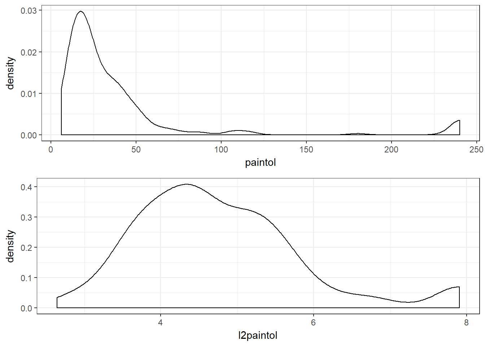

* **Coping style and treatment**

There are nearly equal proportions of coping styles and treatment types. 


```r
kable(table(pain$cs, pain$treatment))
```

              attend   distract   no directions
-----------  -------  ---------  --------------
attender          40         48              40
distracter        44         44              40

## Visualizing longitudinal data

### Profile or spaghetti plots
How does individual's (log 2) pain tolerance change over time/trials? What does the average trend look like? 


```r
all <- ggplot(pain, aes(trial, l2paintol)) + geom_point(alpha=.5) + 
        geom_path(aes(group=id), alpha=.5) + geom_smooth(col="blue", lwd=2)
few <- ggplot(pain[1:16,], aes(trial, l2paintol, group=id)) + geom_line() + geom_point() 
grid.arrange(all, few, ncol=2)
```

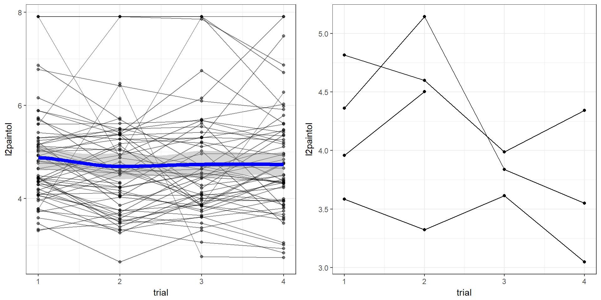

 What's the difference in how the lines are connected using `geom_path()` vs `geom_line()` between the two plots?  

The average is around 5, with a slight decrease at time 2 and then relatively constant. The shading around the trendline shows that the variance across time points is pretty constant.  The right hand plot shows the profile plot for the first 4 kids in the data set, notice how one path stops after trial 2? This tells us there is missing data in this data set that we will have to look out for. 

Quite a bit of variation across individuals, but what about the variation within person? I.e. how does the individual pain tolerance at each trial differ from the individual's average pain tolerance. We'll _center_ the data around each person's own average. With longitudinal data - the person is the cluster. 


```r
person.ave <- pain %>% group_by(id) %>% summarise(l2.ave = mean(l2paintol, na.rm=TRUE))
pain <- pain %>% left_join(person.ave) %>% mutate(diff = l2.ave-l2paintol)
# Always be very cautious when overwriting your data object! 
# Novice users recommended to create a new data set with a different name.

ggplot(pain, aes(trial, diff)) + geom_path(aes(group=id), alpha=.5) + 
      geom_hline(yintercept=0, col="blue", lwd=2)
```

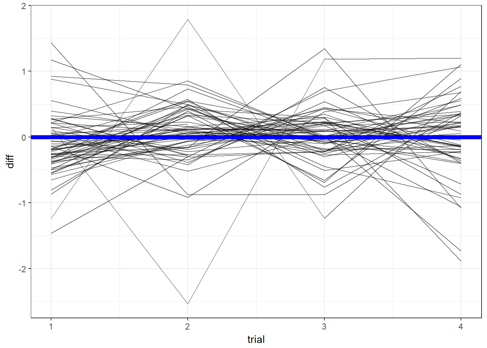

Few individuals have large variations in their pain tolerance across time, and it appears as if those that had higher than average at trial 2, were lower than average at trial 3, and vice versa. 

### Correlation of pain tolerance within person across time {#corrmat}
Correlations are calculated between variables. To calculate the correlation of `l2paintol` between trials, we need to reshape the data to wide format. In wide data, the measure of pain tolerance for each trial is it's own variable (column). 


```r
# First select only the variable we want to transform wide
pain.2.wide <- pain %>% select(id, trial, l2paintol)
# Use the reshape() function to transform - this comes with baseR
pw <- reshape(pain.2.wide, idvar="id", timevar="trial", direction="wide")
# then calculate and visualize the correlation of pain tolerance across time points. 
# use=pairwise complete observations has to be used here because there is missing values
corrplot::corrplot.mixed(cor(pw[,-1], use = 'pairwise.complete.obs'))
```

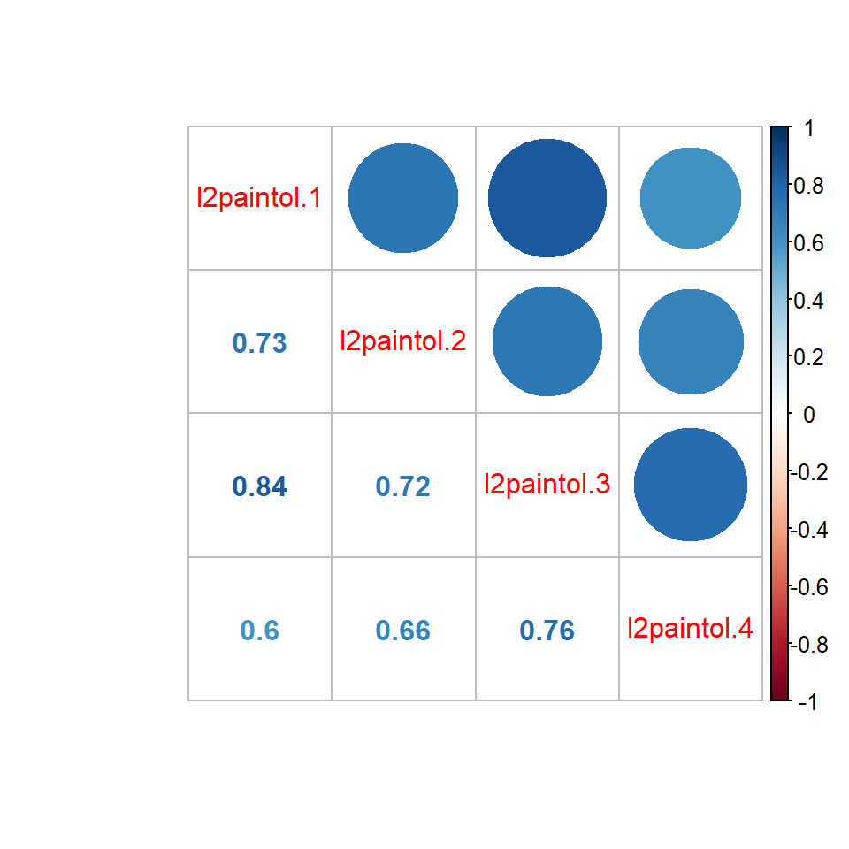

There is a fairly high correlation of pain tolerance between trials.  

##  Analyze pain tolerance across coping style

Visualize the distribution of pain tolerance across the different coping styles. The first plots show the distribution of the raw number of seconds the arms are held under ice water, and the log2 transformation. For the rest of this analysis we'll be using this log2 transformation. 


```r
pt.dist   <- ggplot(pain, aes(paintol, fill=cs)) + geom_density(alpha=.5)
l2pt.dist <- ggplot(pain, aes(l2paintol, fill=cs)) + geom_density(alpha=.5)
grid.arrange(pt.dist, l2pt.dist, ncol=2)
```

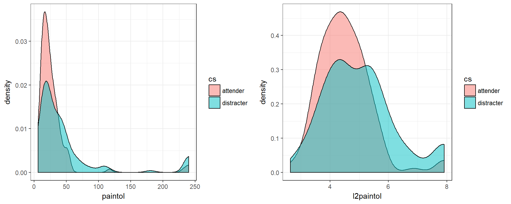

There appears to be a slight difference, but is it significantly different? 
What about the treatment? How does it appear to affect the pain tolerance of the coping styles? 


```r
ggplot(pain, aes(l2paintol, x=cs, fill=treatment)) + 
  geom_boxplot(width=1, alpha=.5) + geom_violin(alpha=.3) + 
  stat_summary(fun.y=mean, colour="black", geom="point", shape=18, size=4, position=position_dodge(width=.9))
```

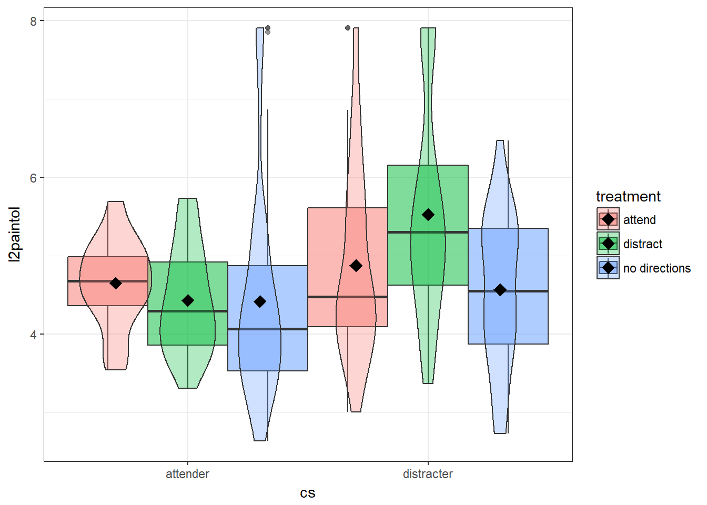

Attenders seem to lower pain tolerance, and lower variation in that pain tolerance. The exception is attenders who were under the "no directions" treatment group. Distracters who were advised to distract themselves were able to keep their arm under water for much longer than the other groups. 

We'll look at many different ways to approach this analysis.

### Two Sample T-test
Compare pain tolerance across coping styles at each trial. Individuals only have one measurement per trial, and individuals are independent of each other, so the data within trials satisfy the independence assumption.  


```r
ggplot(pain, aes(l2paintol, fill=cs)) + geom_density(alpha=.5) + facet_wrap(~trial)
```

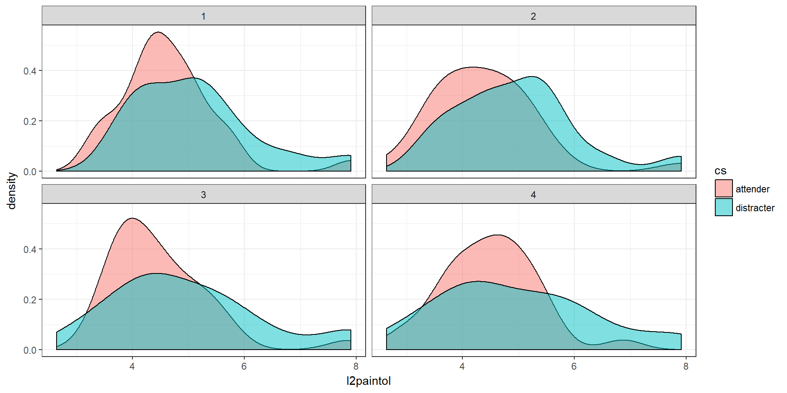

There is a lot of overlap. Which differences are significant? We have no preconceived notion whether or not we can assume equal variances across groups, so we'll run t-tests under both conditions. 


```r
# Make an empty data frame to hold the p-values from the t-tests below.
ttst <- data.frame(eq.var=rep(NA,4), uneq.var=rep(NA,4), 
                   row.names=paste0("Trial", 1:4))
kable(ttst) # what does this look like empty? 
```

         eq.var   uneq.var 
-------  -------  ---------
Trial1                     
Trial2                     
Trial3                     
Trial4                     

```r

# loop over 1 to 4 trials, conduct a t.test, extract the p-value and store it into this empty data frame
for(t in 1:4){
  ttst$eq.var[t]   <- t.test(l2paintol~cs, data=subset(pain, trial==t), var.equal=TRUE)$p.value
  ttst$uneq.var[t] <- t.test(l2paintol~cs, data=subset(pain, trial==t), var.equal=FALSE)$p.value
}
kable(ttst, type='html', digits=4,  
      caption="T-test p-values for a difference between averge pain tolerance across coping style groups") %>% 
    kable_styling(bootstrap_options = "striped", full_width = F, position = "center") # now it's full
```


Table: (\#tab:unnamed-chunk-12)T-test p-values for a difference between averge pain tolerance across coping style groups

          eq.var   uneq.var
-------  -------  ---------
Trial1    0.0524     0.0535
Trial2    0.0308     0.0305
Trial3    0.1041     0.1049
Trial4    0.1121     0.1104

Conclusion: regardless if we assume equal or unequal variances, there is a difference in the log2 pain tolerance between attending groups during trial 1 and 2 only, not during 3 or 4. 

### Averaged over the observed baseline values. 
Perhaps the difference we're seeing is due to a difference at baseline between the two groups? Lets compute the baseline average over the first three responses and see how that differs between coping styles. 

For this analyses the data needs to be in wide format, so we can calculate the row-wise average across times 1-3. We did this earlier using `reshape()`, but that example only turned the `l2paintol` variable wide. Here we need to keep the coping style (`cs`) in addition to the time. 


```r
wide.pain.cs <- pain %>% select(id, trial, l2paintol, cs)
pwc <- reshape(wide.pain.cs, idvar="id", timevar="trial", direction="wide")
kable(head(pwc))
```

      id   l2paintol.1  cs.1          l2paintol.2  cs.2          l2paintol.3  cs.3          l2paintol.4  cs.4       
---  ---  ------------  -----------  ------------  -----------  ------------  -----------  ------------  -----------
1      1      4.361066  attender         5.142005  attender         3.836934  attender         3.549669  attender   
5      2      4.814038  distracter       4.598127  distracter       3.987321  distracter       4.343408  distracter 
9      3      3.584963  attender         3.321928  attender         3.614710  attender         3.047887  attender   
13     4      3.956986  distracter       4.503349  distracter                 distracter                 distracter 
17     5      4.638653  attender         4.549053  attender         4.961160  attender         4.971773  attender   
21     6      6.773073  distracter       6.424754  distracter       6.099716  distracter       5.914086  distracter 

Each variable that we kept now has 4 entries, one for each time point. Some variables such as `cs` are **time fixed**, meaning they don't change over time; `cs.1` = `cs.2` = `cs.3` = `cs=4`. We can drop the other copies of this variable. Other variables like `paintol` are **time varying**, they change within person across time. 


```r
pwc <- pwc %>% select(-cs.2, -cs.3, -cs.4) %>%
               rowwise() %>% 
               mutate(ave.baseline.tol = mean(c(l2paintol.1, l2paintol.2, l2paintol.3), na.rm=TRUE))
kable(head(pwc))
```


 id   l2paintol.1  cs.1          l2paintol.2   l2paintol.3   l2paintol.4   ave.baseline.tol
---  ------------  -----------  ------------  ------------  ------------  -----------------
  1      4.361066  attender         5.142005      3.836934      3.549669           4.446669
  2      4.814038  distracter       4.598127      3.987321      4.343408           4.466495
  3      3.584963  attender         3.321928      3.614710      3.047887           3.507200
  4      3.956986  distracter       4.503349                                       4.230167
  5      4.638653  attender         4.549053      4.961160      4.971773           4.716289
  6      6.773073  distracter       6.424754      6.099716      5.914086           6.432514

The boxplot below has the individual points plotted on top of the boxplots, this allows us to see that the high end outlying point on the boxplot is due to two individuals (one in each coping style group). Distractors seem to have a higher average average baseline tolerance compared to attenders. 

```r
ggplot(pwc, aes(y=ave.baseline.tol, x=cs.1, fill=cs.1)) + 
   geom_boxplot() + geom_jitter(width=.1, col="purple") + 
   stat_summary(fun.y=mean, colour="blue", geom="point", shape=18, size=4)
```

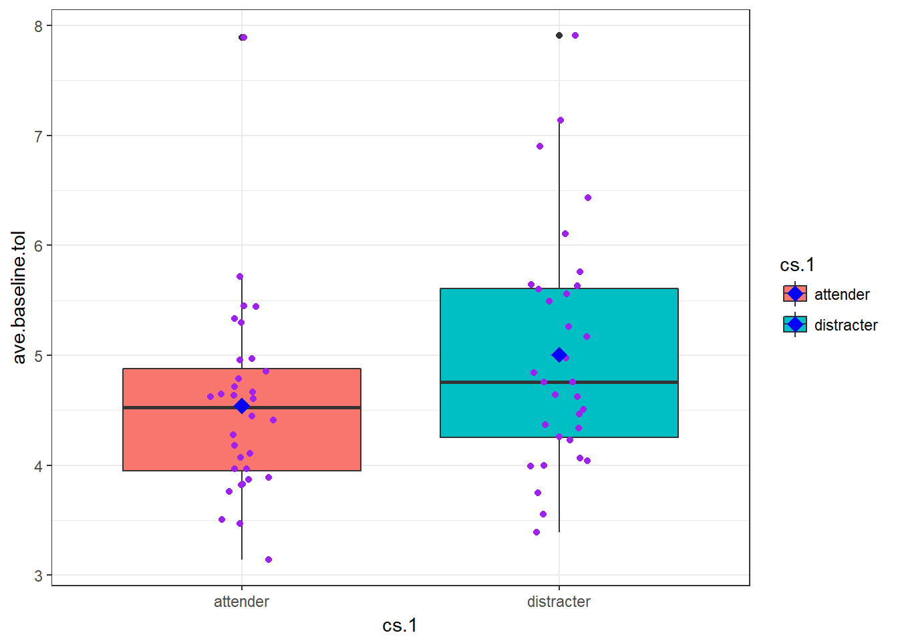

Is this difference significant? 

```r
pander(t.test(ave.baseline.tol ~ cs.1, data=pwc))
```


-----------------------------------------------------------
 Test statistic    df     P value   Alternative hypothesis 
---------------- ------- --------- ------------------------
     -1.899       59.84   0.06236         two.sided        
-----------------------------------------------------------

Table: Welch Two Sample t-test: `ave.baseline.tol` by `cs.1` (continued below)

 
---------------------------------------------------
 mean in group attender   mean in group distracter 
------------------------ --------------------------
          4.54                     5.004           
---------------------------------------------------

Children who distracted themselves from the experiment could keep their arm in the ice water for an average of 5.0 seconds. This was slightly longer than children who attended to the experiment who averaged 4.5 seconds (p=.06). 

 How does this result compare to the previous results? Was this expected? 


### Missing Data

We noticed earlier that there were some missing values in the data. Turns out that no one dropped out for reasons related to the experiment (i.e. they were uncomfortable), but there were some absences from school that day and a few broken arms. 

So far we've been ignoring that there is missing data. The table below shows that there are 6 individuals who are missing a score at time 3, but only 3 at time 4. This means that the time-stratified t-tests conducted earlier are on different sets of data. 


```r
kable(table(is.na(pain$l2paintol), pain$trial))
```

          1    2    3    4
------  ---  ---  ---  ---
FALSE    63   63   58   61
TRUE      1    1    6    3

Is it the same individuals who are missing data? First let's identify the rows with any missing values and save that as a vector of row numbers into `miss.idx`.  


```r
miss.idx <- which(is.na(pain$l2paintol))
miss.idx
##  [1]  15  16  71  79 131 132 166 167 168 173 175
```

Then let's see the id's that correspond to those rows, and save those id numbers in a vector. 


```r
ids.with.missing <- pain$id[miss.idx]
ids.with.missing
##  [1]  4  4 18 20 33 33 42 42 42 44 44
```

There are 6 unique individuals who are missing measurements for pain tolerance. What does their data look like? Half male, half distracters, 3 in the no directions treatment group, 2 in the distraction treatment group, and 1 in the attend group. Understanding the difference in characteristics between those with missing data and those without is important - and a topic we'll come back to in a later chapter. 


```r
kable(pain[pain$id %in% ids.with.missing,c('id', 'cs', 'treatment', 'sex', 'trial', 'paintol' )], 
      type='html', row.names=FALSE) %>% 
      kable_styling(bootstrap_options = "striped", full_width = F, position = "center")
```


 id  cs           treatment       sex       trial   paintol
---  -----------  --------------  -------  ------  --------
  4  distracter   attend          male          1     15.53
  4  distracter   attend          male          2     22.68
  4  distracter   attend          male          3          
  4  distracter   attend          male          4          
 18  attender     no directions   male          1     22.48
 18  attender     no directions   male          2     20.03
 18  attender     no directions   male          3          
 18  attender     no directions   male          4     26.82
 20  distracter   no directions   male          1     30.57
 20  distracter   no directions   male          2     20.29
 20  distracter   no directions   male          3          
 20  distracter   no directions   male          4     11.89
 33  attender     distract        female        1     35.88
 33  attender     distract        female        2     53.04
 33  attender     distract        female        3          
 33  attender     distract        female        4          
 42  attender     distract        female        1     52.58
 42  attender     distract        female        2          
 42  attender     distract        female        3          
 42  attender     distract        female        4          
 44  distracter   no directions   female        1          
 44  distracter   no directions   female        2     16.75
 44  distracter   no directions   female        3          
 44  distracter   no directions   female        4     14.66

What if we just drop all records for all children with missing values at any time point. How does the results here compare to the previous test? 

\BeginKnitrBlock{rmdnote}<div class="rmdnote">The syntax `a %in% b` results in a vector of TRUE and FALSE for every entry in a, whether or not that value is found in b. So `(pwc$id %in% ids.with.missing)` is a list of TRUE/FALSE for every pwc$id, where TRUE is if that id was found in the vector `ids.with.missing`. 

Then we negate that boolean/logic vector by using `!`, (turn TRUE to FALSE and FALSE to TRUE) - so now TRUE means that record belongs to an id with no missing data. Those are the ones we want to keep. </div>\EndKnitrBlock{rmdnote}


```r
pwc.nomiss <- pwc[!(pwc$id %in% ids.with.missing),]
pander(t.test(ave.baseline.tol ~ cs.1, data=pwc.nomiss))
```


-------------------------------------------------------------
 Test statistic    df      P value    Alternative hypothesis 
---------------- ------- ----------- ------------------------
     -2.314       53.53   0.02452 *         two.sided        
-------------------------------------------------------------

Table: Welch Two Sample t-test: `ave.baseline.tol` by `cs.1` (continued below)

 
---------------------------------------------------
 mean in group attender   mean in group distracter 
------------------------ --------------------------
         4.473                     5.076           
---------------------------------------------------

Dropping all data on children with any missing visit data changed our conclusion!

> Of the students providing data at all time points, distractors can keep their arm under ice water significantly longer on average compared to attenders. 

From here on all analyses will be on the 58 students with data on all four time points. 

## Paired t-tests 

So far we've assumed that pain tolerance within person is independent across time points. Let's modify the analysis now to use a paired t-test, where we model the _difference_ between time points within individuals and see if the average _difference_ is not zero. But there are 4 time points, so how many comparisons/tests will this create? 

* trial4 - trial3
* trial4 - trial2
* trial4 - trial1
* trial4 - average baseline


For display and comparison purposes, I'll build another empty vector to store the p-value for the test into. Since there was no difference between the tests assuming equal variance and those without that assumption, I will go with the default here of false.


```r
p<-rep(NA, 4)

p[1] <- t.test(pwc.nomiss$l2paintol.4, pwc.nomiss$l2paintol.3, paired=TRUE)$p.value
p[2] <- t.test(pwc.nomiss$l2paintol.4, pwc.nomiss$l2paintol.2, paired=TRUE)$p.value
p[3] <- t.test(pwc.nomiss$l2paintol.4, pwc.nomiss$l2paintol.1, paired=TRUE)$p.value
p[4] <- t.test(pwc.nomiss$l2paintol.4, pwc.nomiss$ave.baseline.tol, paired=TRUE)$p.value

names(p) <- c("4-3", "4-2", "4-1", "4-ave")

kable(t(p), type='html', digits=3)
```


   4-3     4-2     4-1   4-ave
------  ------  ------  ------
 0.737   0.483   0.355   0.951

Using this approach, we see there is no significant difference between any pair of time points _when combining the data across all coping style and treatment groups_. What is the average trajectory of pain tolerance within coping styles? 

\BeginKnitrBlock{rmdnote}<div class="rmdnote">Notice here that i'm taking the data in long format and then using dplyr to calculate the average `l2paintol` by time and coping style. </div>\EndKnitrBlock{rmdnote}


```r
mean.plot <- pain %>% filter(!(id %in% ids.with.missing)) %>%  #take id's that are NOT in those identified as having missing data
                      group_by(trial, cs) %>%
                      summarise(apt = mean(l2paintol))

ggplot(mean.plot, aes(x=trial, y=apt, col=cs)) + 
      geom_path(data=mean.plot, aes(group=cs), lwd=2)+ ylab("log2 pain tolerance") + 
      #geom_line(data=pain, aes(x=trial, y=l2paintol, group=id), alpha=.3) + 
      geom_jitter(data=pain, aes(x=trial, y=l2paintol), alpha=.5, width=.1)
```

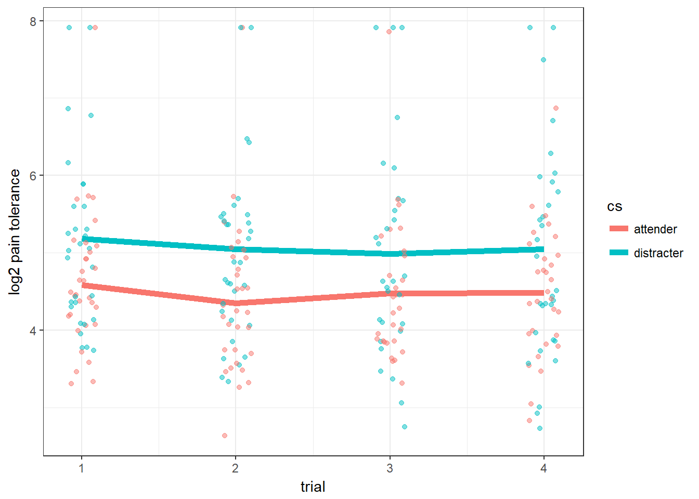

Red lines are attenders, and for the most part their paths are lower than distractors in blue. The dark thick lines are the average for each coping style. 

 Did the log2 pain tolerance change _at the same rate_ between time 2 and 4 for both attenders and distractors? In essence, we are testing a **difference of differences**. One way to accomplish this without explicitly putting `trial` in the model is to calculate the trial4-trial2 difference on each person, then use that as the outcome. 


```r
pwc.nomiss$diff24 <- pwc.nomiss$l2paintol.4 - pwc.nomiss$l2paintol.2
t.test(diff24 ~ cs.1, data=pwc.nomiss)
## 
## 	Welch Two Sample t-test
## 
## data:  diff24 by cs.1
## t = 0.53337, df = 46.824, p-value = 0.5963
## alternative hypothesis: true difference in means is not equal to 0
## 95 percent confidence interval:
##  -0.3700586  0.6370431
## sample estimates:
##   mean in group attender mean in group distracter 
##              0.134765185              0.001272957
```

The average change in `log2paintol` between time 4 and time 2 for distractors is 0.001, and 0.135 for attenders. These changes are not significantly different from each other (p=0.59). 


### But what about treatment groups? 

Let's look at the full interaction model by plotting the average log2 pain tolerance for each of the 6 coping style * treatment combinations. 


```r
full.mean.plot <- pain %>% filter(!(id %in% ids.with.missing)) %>%  #take id's that are NOT in those identified as having missing data
                      group_by(trial, cs, treatment) %>%
                      summarise(apt = mean(l2paintol)) %>%
                      ungroup() %>%
                      mutate(cop = factor(cs, labels=c("A", "D")), 
                             tx = factor(treatment, labels=c("A", "D", "N")), 
                             intx = paste0(cop, tx))

ggplot(full.mean.plot, aes(x=trial, y=apt, col=cs, shape=treatment)) + 
      geom_jitter(data=pain, aes(x=trial, y=l2paintol), alpha=.5, width=.1)+ 
      geom_path(aes(group=intx), lwd=2)+ ylab("log2 pain tolerance") + 
      geom_point(data=full.mean.plot, size=2, col="black")
```

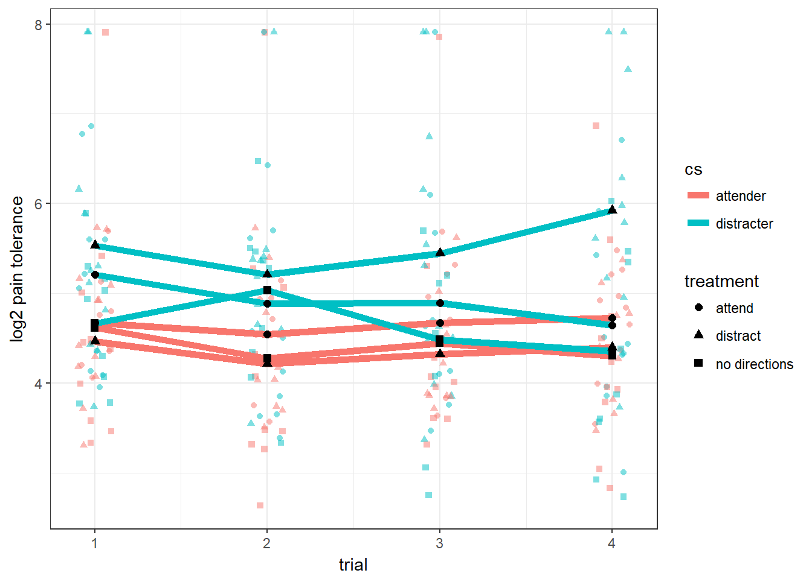

The slopes for the distractor group between trial 2 and trial 4 is positive for those in the distractor treatment, but negative for those in the other treatments. These are averaging out to that zero slope that we saw in the previous graphic. 

The trajectories are different enough that a full interaction model between treatment and CS is warrented. We will move on to using a random intercept model to account for the repeated measures on the individual child now as well. 

## Random Intercept Model

The random intercept model combines aspects of the various simple analyses in one large model that uses all the data available and in an appropriate fashion. This interaction model could be fit using a standard linear model (two way ANOVA anyone?), but we already know that pain tolerance is correlated within individual, so we should use a model that accounts for that design. 

 Which correlation structure is more appropriate? Why? 

* Autoregressive with lag 1 (AR1)
* Compound Symmetry

 Why did we use 0.7 in the argument for `corCompSymm` in the function below? What does this mean? 

```r
library(nlme)
ri.model <- lme(l2paintol ~ cs + treatment + cs*treatment, 
            random = ~ 1|id, cor = corCompSymm(value = 0.7, form=~1|id),  
            data=pain, na.action=na.omit)

summary(ri.model)
## Linear mixed-effects model fit by REML
##  Data: pain 
##        AIC     BIC    logLik
##   602.7188 634.007 -292.3594
## 
## Random effects:
##  Formula: ~1 | id
##         (Intercept)  Residual
## StdDev:   0.5708238 0.9116882
## 
## Correlation Structure: Compound symmetry
##  Formula: ~1 | id 
##  Parameter estimate(s):
##       Rho 
## 0.5697763 
## Fixed effects: l2paintol ~ cs + treatment + cs * treatment 
##                                         Value Std.Error  DF   t-value
## (Intercept)                          4.655032 0.2981311 181 15.614041
## csdistracter                         0.200314 0.4127482  58  0.485319
## treatmentdistract                   -0.127153 0.4062028  58 -0.313028
## treatmentno directions              -0.231649 0.4219640  58 -0.548979
## csdistracter:treatmentdistract       0.801256 0.5720853  58  1.400588
## csdistracter:treatmentno directions -0.083080 0.5912098  58 -0.140525
##                                     p-value
## (Intercept)                          0.0000
## csdistracter                         0.6293
## treatmentdistract                    0.7554
## treatmentno directions               0.5851
## csdistracter:treatmentdistract       0.1667
## csdistracter:treatmentno directions  0.8887
##  Correlation: 
##                                     (Intr) csdstr trtmnt trtmnd csdst:
## csdistracter                        -0.722                            
## treatmentdistract                   -0.734  0.530                     
## treatmentno directions              -0.707  0.510  0.519              
## csdistracter:treatmentdistract       0.521 -0.721 -0.710 -0.368       
## csdistracter:treatmentno directions  0.504 -0.698 -0.370 -0.714  0.504
## 
## Standardized Within-Group Residuals:
##        Min         Q1        Med         Q3        Max 
## -1.7351583 -0.5228960 -0.1537673  0.5140625  2.5298887 
## 
## Number of Observations: 245
## Number of Groups: 64
```

* The model converged - don't forget to check this. There was no error message in the output saying it didn't converge, so we're good. 
* Initially we would think that none of the main effects or interaction terms are significant. However..
* Recall this is an interaction model, so we cannot interpret the main effects directly. We have to write `contrasts` to examine specific effects. 


## Writing Contrasts

The goal is to write down a vector `$\mathbf{L}$` of **linear coefficients** for each covariate profile we want to examine and compare, such that when you multiply $\mathbf{L}\beta$ you are only left with the beta coefficients that you want to test. 

Since all covariates in this model are categorical, what is modeled is a series of binary indicator variables (and in this case the interaction between the two). We need to know the ordering of the coefficients to write our $L$. 


```r
names(fixef(ri.model))
## [1] "(Intercept)"                        
## [2] "csdistracter"                       
## [3] "treatmentdistract"                  
## [4] "treatmentno directions"             
## [5] "csdistracter:treatmentdistract"     
## [6] "csdistracter:treatmentno directions"
```

The linear combination vector $L$ for attenders in the attending treatment (AA), have the following $L$. 
$$
L = 
\begin{bmatrix} 
1 & 0 & 0 & 0 & 0 & 0 \\ 
\end{bmatrix} 
$$

The matrix of $\beta$ regression coefficients is:
$$
\beta = 
\begin{bmatrix} 
4.66 \\ 0.20 \\ -0.13 \\ -0.23 \\ 0.81 \\ -0.09 
\end{bmatrix} 
$$


The quantity $\mathbf{L}\beta$ is then calculated as

$$
\begin{aligned}
L\beta & = 
\begin{bmatrix} 
1 & 0 & 0 & 0 & 0 & 0 \\ 
\end{bmatrix} 
\begin{bmatrix} 
4.66 \\ 0.20 \\ -0.13 \\ -0.23 \\ 0.81 \\ -0.09 
\end{bmatrix} \\
& =
1*4.66 + 0*0.20 - 0 * 0.13 - 0*0.23 + 0*0.81 - 0*0.09 \\
& = 4.66
\end{aligned}
$$

This is the estimate for the log base 2 seconds for an attender in the attending (AA) treatment group. Attenders in the attending treatment group are expected to be able to keep their arm in ice water for on average $2^{4.66}=25.3$ seconds. 


The $L$ matrix for an attender in the distracting treatment group (AD) would look like: 
$$
\begin{aligned}
L\beta & = 
\begin{bmatrix} 
1 & 0 & 1 & 0 & 0 & 0 \\ 
\end{bmatrix} 
\begin{bmatrix} 
4.66 \\ 0.20 \\ -0.13 \\ -0.23 \\ 0.81 \\ -0.09 
\end{bmatrix} \\
& =
1*4.66 + 0*0.20 - 1*0.13 - 0*0.23 + 0*0.81 - 0*0.09 \\
& = 4.53
\end{aligned}
$$

We can have R do this matrix multiplication `%*%` for us: 

```r
L = c(1,0,1,0,0,0)
B = fixed.effects(ri.model)
L%*%B
##          [,1]
## [1,] 4.527879
```

 Write down the $L$ vector for the following groups, calculate $L\beta$ and interpret the results. 

* An attender in the no direction treatment group (AN). 
* A distractor in the attending treatment group (DA). 
* A distractor in the distraction treatment group (DD). 
* A distractor in the no direction treatment group (DN). 


### Comparing groups (contrasts) Subtracting $L_{1}$ from $L_{2}$

What we're really interested in, is the pairwise contrasts. The effect of the distracting treatment on attenders, relative to the attending treatment, AA-AD. 

$$
\ \ \ \ \ L_{1} = 
\begin{bmatrix} 
1 & 0 & 0 & 0 & 0 & 0 \\ 
\end{bmatrix} \\
\ \ \ \ \  L_{2} = 
\begin{bmatrix} 
1 & 0 & 1 & 0 & 0 & 0 \\ 
\end{bmatrix} \\
L_{1} - L_{2} = 
\begin{bmatrix} 
0 & 0 & -1 & 0 & 0 & 0 \\ 
\end{bmatrix} 
$$

```r
L = c(0,0,-1,0,0,0)
L%*%B
##          [,1]
## [1,] 0.127153
```

Attenders in the attending treatment group can keep their arm in ice water on average $2^{0.12} = 1.09$ seconds longer compared to attenders in the distracting treatment group. 

 Explicitly write down $L_{1}-L_{2}$ vector for the specified comparisons, calculate the estimate and interpret the results. 

* DD - DN
* DN - AN
* DD - AA
* AA - AN
* AD - AN 

### Confidence intervals of those estimates
What we did above provides point estimates, but no confidence intervals that will allow you to determine if that difference is significant. Once we know what our $L$ matrix looks like for the comparison of interest, we need to use a model-based approach to this estimation. The `glht()` function in the `multcomp` packages allows us to test any number of `generalized linear hypothesis tests` from many different types of models. 

> Does the treatment that matches the childs existing coping style improve tolerance compared to the null treatment? 


```r
library(multcomp)
contrast.formulas <- rbind(`DD-DN` = c(0,0, 1, -1, 1, -1), 
                           `AA-AN` = c(0,0, 0, -1, 0,0))

plot(glht(ri.model, linfct=contrast.formulas))
```

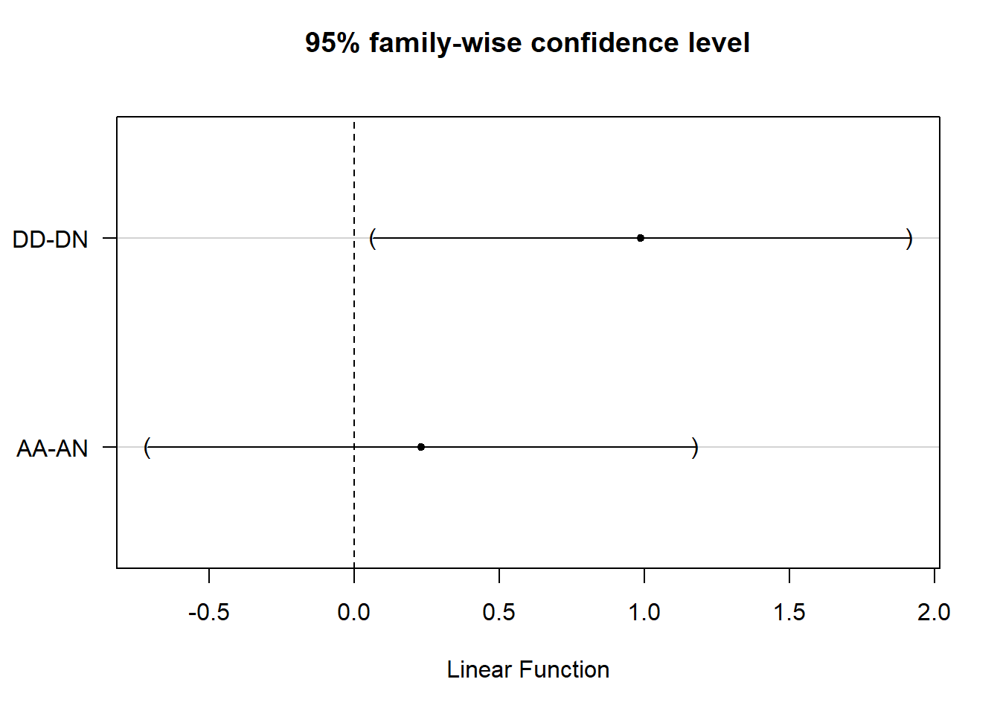

> There was a positive effect of the treatment on the distractor group under the distracting treatment, but no effect on the attending group under the attending treatment compared to no treatment. 

## What to watch out for
These are also topics for a deeper treatment of this topic. 

* How time is measured. Is there consistent units, and is there a baseline value or zero point where all time is referenced back to? 
    - Calendar date vs days since start
    - If time0 is the first treatment, may end up having negative time values. Measurements collected prior to the treatment date. 
* Pattern of missing responses
* Time spacing that form part of the design 
    - Periodic sampling 0-1-2-3-4
    - 3 month: 0-3-6-9-12
    - logarithmic: 0-1-3-6-12-24
* Those are examples of balanced time 
    - Random spacing: take a measurement anytime you encounter the patient. I.e. parent brings child in to doctor for a cold or immunizations, vital measurements are taken. Time is days since birth, but there is no special design enforced.
* Nominal vs actual times
    - Just because you are told to come back in 3 months, doesn't mean everyone makes it exactly in 90 days. 
* Specifying the correlation structure correctly based on study design


## Additional Resources


* Applied Longitudinal Analysis 2nd edition. Fitzmaurice, Laird, Ware (2011) https://content.sph.harvard.edu/fitzmaur/ala2e/ 
* Modeling time series data https://www.datascience.com/blog/introduction-to-forecasting-with-arima-in-r-learn-data-science-tutorials
