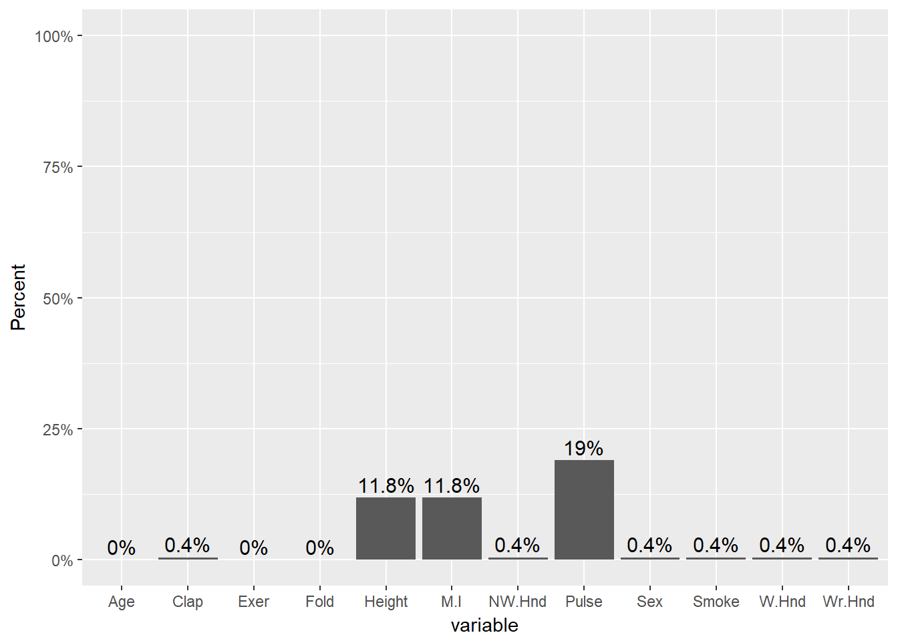
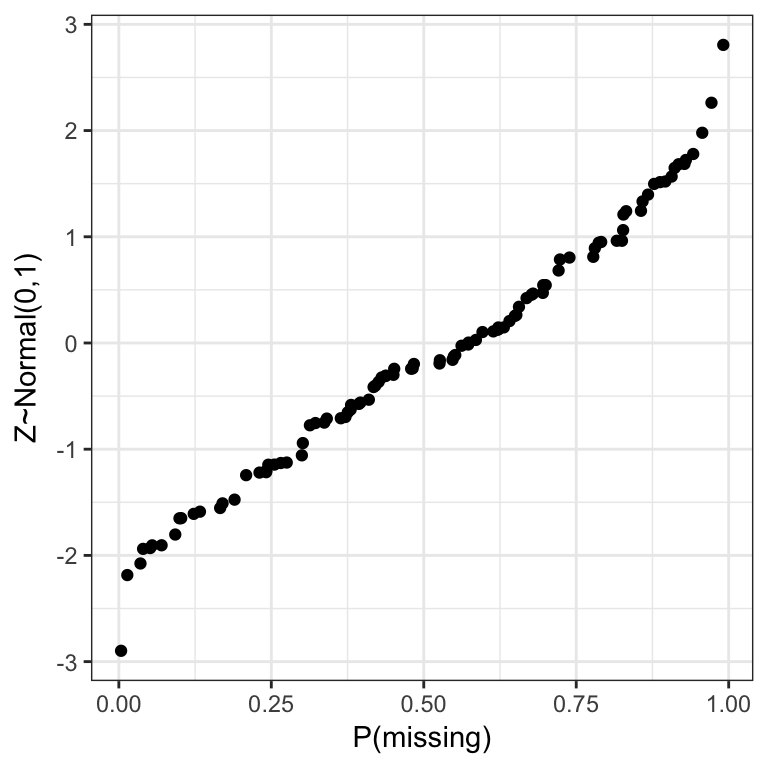

# Missing Data {#mda}

Missing Data happens. Not always

* General: Item non-response. Individual pieces of data are missing.  
* Unit non-response: Records have some background data on all units, but some units don’t respond to any question. 
* Monotonone missing data: Variables can be ordered such that one block of variables more observed than the next. 


## Identifying missing data

* Missing data in `R` is denoted as `NA`
* Arithmetic functions on missing data will return missing

```r
survey <- MASS::survey # to avoid loading the MASS library which will conflict with dplyr
head(survey$Pulse)
## [1]  92 104  87  NA  35  64
mean(survey$Pulse)
## [1] NA
```

The `summary()` function will always show missing.

```r
summary(survey$Pulse)
##    Min. 1st Qu.  Median    Mean 3rd Qu.    Max.    NA's 
##   35.00   66.00   72.50   74.15   80.00  104.00      45
```

The `is.na()` function is helpful to identify rows with missing data

```r
table(is.na(survey$Pulse))
## 
## FALSE  TRUE 
##   192    45
```

The function `table()` will not show NA by default. 

```r
table(survey$M.I)
## 
## Imperial   Metric 
##       68      141
table(survey$M.I, useNA="always")
## 
## Imperial   Metric     <NA> 
##       68      141       28
```

* What percent of the data set is missing? 

```r
round(prop.table(table(is.na(survey)))*100,1)
## 
## FALSE  TRUE 
##  96.2   3.8
```

4% of the data points are missing. 

* How much missing is there per variable? 

```r
prop.miss <- apply(survey, 2, function(x) round(sum(is.na(x))/NROW(x),4))
prop.miss
##    Sex Wr.Hnd NW.Hnd  W.Hnd   Fold  Pulse   Clap   Exer  Smoke Height 
## 0.0042 0.0042 0.0042 0.0042 0.0000 0.1899 0.0042 0.0000 0.0042 0.1181 
##    M.I    Age 
## 0.1181 0.0000
```

The amount of missing data per variable varies from 0 to 19%. 


### Visualize missing patterns

Using `ggplot2`

```r
pmpv <- data.frame(variable = names(survey), pct.miss =prop.miss)

ggplot(pmpv, aes(x=variable, y=pct.miss)) +
  geom_bar(stat="identity") + ylab("Percent") + scale_y_continuous(labels=scales::percent, limits=c(0,1)) + 
  geom_text(data=pmpv, aes(label=paste0(round(pct.miss*100,1),"%"), y=pct.miss+.025), size=4)
```



Using `mice`

```r
library(mice)
md.pattern(survey)
##     Fold Exer Age Sex Wr.Hnd NW.Hnd W.Hnd Clap Smoke Height M.I Pulse    
## 168    1    1   1   1      1      1     1    1     1      1   1     1   0
##   1    1    1   1   0      1      1     1    1     1      1   1     1   1
##   1    1    1   1   1      1      1     0    1     1      1   1     1   1
##  38    1    1   1   1      1      1     1    1     1      1   1     0   1
##  20    1    1   1   1      1      1     1    1     1      0   0     1   2
##   1    1    1   1   1      0      0     1    0     1      1   1     1   3
##   7    1    1   1   1      1      1     1    1     1      0   0     0   3
##   1    1    1   1   1      1      1     1    1     0      0   0     1   3
##        0    0   0   1      1      1     1    1     1     28  28    45 107
```

This somewhat ugly output tells us that 168 records have no missing data, 38 records are missing only `Pulse` and 20 are missing both `Height` and `M.I`. 

Using `VIM`

```r
library(VIM)
aggr(survey, col=c('chartreuse3','mediumvioletred'),
              numbers=TRUE, sortVars=TRUE,
              labels=names(survey), cex.axis=.7,
              gap=3, ylab=c("Missing data","Pattern"))
```


The plot on the left is a simplified, and ordered version of the ggplot from above, except the bars appear to be inflated because the y-axis goes up to 15% instead of 100%. 

The plot on the right shows the missing data patterns, and indicate that 71% of the records has complete cases, and that everyone who is missing `M.I.` is also missing Height. 

Another plot that can be helpful to identify patterns of missing data is a `marginplot` (also from `VIM`).

* Two continuous variables are plotted against each other.  
* Blue bivariate scatterplot and univariate boxplots are for the observations where values on both variables are observed.
* Red univariate dotplots and boxplots are drawn for the data that is only observed on one of the two variables in question.  
* The darkred text indicates how many records are missing on both. 


```r
marginplot(survey[,c(6,10)])
```


This shows us that the observations missing pulse have the same median height, but those missing height have a higher median pulse rate. 


## Effects of Nonresponse

Textbook example: Example reported in W.G. Cochran, Sampling Techniques, 3rd edition, 1977, ch. 13

> Consider data that come form an experimental sampling of fruit orcharts in North Carolina in 1946.
> Three successive mailings of the same questionnaire were sent to growers. For one of the questions
> the number of fruit trees, complete data were available for the population...

<br>

|      Ave. # trees         | # of growers |  % of pop’n  | Ave # trees/grower  |
|---------------------------|--------------|--------------|---------------------|
| 1st mailing responders	  |   300	       |     10		    |   456               |
| 2nd mailing responders    |   543	       |     17		    |   382               |
| 3rd mailing responders	  |   434	       |     14		    |   340               |
| Nonresponders 	          |  1839	       |     59		    |   290               |
|                           |  --------    |  --------    |    --------         |
|    Total population       |   3116       |    100       |    329              |


* The overall response rate was very low. 
* The rate of non response is clearly related to the average number of trees per grower. 
* The estimate of the average trees per grower can be calculated as a weighted average from responders $\bar{Y_{1}}$ and non responders $\bar{Y_{2}}$. 

**Bias**: The difference between the observed estimate $\bar{y}_{1}$ and the true parameter $\mu$. 

$$ 
  \begin{aligned}
  E(\bar{y}_{1}) - \mu & = \bar{Y_{1}} - \bar{Y} \\
  & = \bar{Y}_{1} - \left[(1-w)\bar{Y}_{1} - w\bar{Y}_{2}\right] \\
  & = w(\bar{Y}_{1} - \bar{Y}_{2})
  \end{aligned}
$$

Where $w$ is the proportion of non-response. 

* The amount of bias is the product of the proportion of non-response and the difference in the means between the responders and the non-responders. 
* The sample provides no information about $\bar{Y_{2}}$, the size of the bias is generally unknown without information gained from external data. 


## Missing Data Mechanisms

Process by which some units observed, some units not observed

* **Missing Completely at Random (MCAR)**: The probability that a data point is missing is completely unrelated (independent) of any observed and unobserved data or parameters. 
    - P(Y missing| X, Y) = P(Y missing)
    - Ex: Miscoding or forgetting to log in answer
* **Missing at Random (MAR)**: The probability that a data point is missing is independent can be explained or modeled by other observed variables. 
    - P(Y missing|x, Y) = P(Y missing | X)
    - Ex: Y = age, X = sex  
		    - Pr (Y miss| X = male) = 0.2  
		    - Pr (Y miss| X = female) = 0.3  
		    - Males people are less likely to fill out an income survey
		    - The missing data on income is related to gender 
		    - After accounting for gender the missing data is unrelated to income.   
* **Not missing at Random (NMAR)**: The probability that a data point is missing depends on the value of the variable in question.   
    - P(Y missing | X, Y) = P (Y missing|X, Y)  
    - Ex: Y = income, X = immigration status  
        - Richer person may be less willing to disclose income  
        - Undocumented immigrant may be less willing to disclose income  

 Write down an example of each. 

Does it matter to inferences?  <span style ="color:red">**Yes!**</span>

### Demonstration via Simulation
What follows is just _one_ method of approaching this problem via code. Simulation is a frequently used technique to understand the behavior of a process over time or over repeated samples. 

#### MCAR
1. Draw a random sample of size 100 from a standard Normal distribution (Z) and calculate the mean. 

```r
set.seed(456) # setting a seed ensures the same numbers will be drawn each time
z <- rnorm(100)
mean.z <- mean(z)
mean.z
## [1] 0.1205748
```

2. Delete data at a rate of $p$ and calculate the complete case (available) mean. 
    - Sample 100 random Bernoulli (0/1) variables with probability $p$. 
    
    ```r
    x <- rbinom(100, 1, p=.5)
    ```
    - Find out which elements are are 1's
    
    ```r
    delete.these <- which(x==1)
    ```
    - Set those elements in `z` to `NA`. 
    
    ```r
    z[delete.these] <- NA
    ```
    - Calculate the complete case mean
    
    ```r
    mean(z, na.rm=TRUE)
    ## [1] 0.1377305
    ```
    
3. Calculate the bias as the sample mean minus the true mean ($E(\hat\theta) - \theta$). 

```r
mean(z, na.rm=TRUE) - mean.z
## [1] 0.01715565
```

How does the bias change as a function of the proportion of missing? Let $p$ range from 0% to 99% and plot the bias as a function of $p$. 


```r
calc.bias <- function(p){ # create a function to handle the repeated calculations
  mean(ifelse(rbinom(100, 1, p)==1, NA, z), na.rm=TRUE) - mean.z
}

p <- seq(0,.99,by=.01)

plot(c(0,1), c(-1, 1), type="n", ylab="Bias", xlab="Proportion of missing")
  points(p, sapply(p, calc.bias), pch=16)
  abline(h=0, lty=2, col="blue")
```


 What is the behavior of the bias as $p$ increases? Look specifically at the position/location of the bias, and the variance/variability of the bias. 

#### NMAR: Missing related to data
What if the rate of missing is related to the value of the outcome? Again, let's setup a simulation to see how this works. 

1. Randomly draw 100 random data points from a Standard Normal distribution to serve as our population, and 100 uniform random values between 0 and 1 to serve as probabilities of the data being missing ($p=P(miss)$)

```r
Z <- rnorm(100)
p <- runif(100, 0, 1)
```

2. Sort both in ascending order, shove into a data frame and confirm that $p(miss)$ increases along with $z$. 

```r
dta <- data.frame(Z=sort(Z), p=sort(p))
head(dta)
##           Z           p
## 1 -2.898122 0.003673455
## 2 -2.185058 0.013886146
## 3 -2.076032 0.035447986
## 4 -1.938288 0.039780643
## 5 -1.930809 0.051362816
## 6 -1.905331 0.054639596
ggplot(dta, aes(x=p, y=Z)) + geom_point() + xlab("P(missing)") + ylab("Z~Normal(0,1)")
```



3. Set $Z$ missing with probability equal to the $p$ for that row. Create a new vector `dta$z.miss` that is either 0, or the value of `dta$Z` with probability `1-dta$p`. Then change all the 0's to `NA`.


```r
dta$Z.miss <- dta$Z * (1-rbinom(NROW(dta), 1, dta$p))
head(dta) # see structure of data to understand what is going on
##           Z           p    Z.miss
## 1 -2.898122 0.003673455 -2.898122
## 2 -2.185058 0.013886146 -2.185058
## 3 -2.076032 0.035447986 -2.076032
## 4 -1.938288 0.039780643 -1.938288
## 5 -1.930809 0.051362816 -1.930809
## 6 -1.905331 0.054639596 -1.905331
dta$Z.miss[dta$Z.miss==0] <- NA
```

5. Calculate the complete case mean and the bias

```r
mean(dta$Z.miss, na.rm=TRUE)
## [1] -0.7777319
mean(dta$Z) - mean(dta$Z.miss, na.rm=TRUE)
## [1] 0.6830372
```

[](images/q.png) Did the complete case estimate over- or under-estimate the true mean? Is the bias positive or negative? 


#### NMAR: Pure Censoring
Consider a hypothetical blood test to measure a hormone that is normally distributed in the blood with mean 10$\mu g$ and variance 1. However the test to detect the compound only can detect levels above 10. 

```r
z <- rnorm(100, 10, 1)
y <- z
y[y<10] <- NA
mean(z) - mean(y, na.rm=TRUE)
## [1] -0.6850601
```

[](images/q.png) Did the complete case estimate over- or under-estimate the true mean? 


\BeginKnitrBlock{rmdnote}<div class="rmdnote">When the data is not missing at random, the bias can be much greater. </div>\EndKnitrBlock{rmdnote}

\BeginKnitrBlock{rmdcaution}<div class="rmdcaution">Usually you don't know the missing data mechanism.</div>\EndKnitrBlock{rmdcaution}

**Degrees of difficulty**

* MCAR: is easiest to deal with.
* MAR: we can live with it.
* NMAR: most difficult to handle.

**Evidence?**

What can we learn from evidence in the data set at hand?

* May be evidence in the data rule out MCAR - test responders vs. nonresponders.
    - Example: Responders tend to have higher/lower average education than nonresponders by t-test
    - Example: Response more likely in one geographic area than another by chi-square test
* No evidence in data set to rule out MAR (although there may be evidence from an external data source)
  
**What is plausible?**

* Cochran example: when human behavior is involved, MCAR must be viewed as an extremely special case that would often be violated in practice
* Missing data may be introduced by design (e.g., measure some variables, don’t measure others for reasons of cost, response burden), in which case MCAR would apply
* MAR is much more common than MCAR
* We cannot be too cavalier about assuming MAR, but anecdotal evidence shows that it often is plausible when conditioning on enough information

**Ignorable Missing**

* If missing-data mechanism is MCAR or MAR then nonresponse is said to be "ignorable".
* Origin of name: in likelihood-based inference, both the data model and missing-data mechanism are important but with MCAR or MAR, inference can be based solely on the data model, thus making inference much simpler   
* "_Ignorability_" is a relative assumption:  missingness on income may be NMAR given only gender, but may be MAR given gender, age, occupation, region of the country

## General strategies

Strategies for handling missing data include:

* Complete-case/available-case analysis: drop cases that make analysis inconvenient. 
* If variables are known to contribute to the missing values, then appropriate modeling can often account for the missingness. 
* Imputation procedures: fill in missing values, then analyze completed data sets using complete-date methods
* Weighting procedures: modify "design weights" (i.e., inverse probabilities of selection from sampling plan) to account for probability of response  
* Model-based approaches: develop model for partially missing data, base inferences on likelihood under that model


### Complete cases analysis
If not all variables observed, delete case from analysis  

* Advantages:
    - Simplicity
    - Common sample for all estimates
* Disadvantages:
    - Loss of valid information
    - Bias due to violation of MCAR  


### Available-case analysis 
* Use all cases where the variable of interest is present 
    - Potentially different sets of cases for means of X and Y
    - and complete pairs for $r_{XY}$  
* Tempting to think that available-case analysis will be superior to complete-case analysis  
* But it can distort relationships between variables by not using a common base of observations for all quantities being estimated.

### Imputation
Fill in missing values, analyze completed data set

* Advantage: 
    * Rectangular data set easier to analyze
* Disadvantage:
    * "Both seductive and dangerous" (Little and Rubin)
    * Can understate uncertainty due to missing values. 
    * Can induce bias if imputing under the wrong model.

## Imputation Methods

* Unconditional mean substitution. <span style ="color:red">**Never use**</span>
    - Impute all missing data using the mean of observed cases
    - Artificially decreases the variance. 
* Hot deck imputation
    - Impute values by randomly sampling values from observed data.  
    - Good for categorical data
    - Reasonable for MCAR and MAR
* Model based imputation 
    - Conditional Mean imputation: Use regression on observed variables to estimate missing values
    - Predictive Mean Matching: Fills in a value randomly by sampling observed values whose regression-predicted values are closest to the regression-predicted value for the missing point. 
        - Cross between hot-deck and conditional mean
    - Categorical data can be imputed using classification models
    - Less biased than mean substitution
    - but SE's could be inflated
* Adding a residual
    - Impute regression value $\pm$ a randomly selected residual based on estimated residual variance
    - Over the long-term, we can reduce bias, on the average

…but we can do better.
  

## Multiple Imputation (MI)

### Goals
* Accurately reflect available information
* Avoid bias in estimates of quantities of interest
* Estimation could involve explicit or implicit model
* Accurately reflect uncertainty due to missingness

### Technique  
1. For each missing value, impute $m$ estimates (usually $m$ = 5)
    - Imputation method must include a random component
2. Create $m$ complete data sets
3. Perform desired analysis on each of the $m$ complete data sets
4. Combine final estimates in a manner that accounts for the between, and within imputation variance. 


_Credit: http://www.stefvanbuuren.nl_


### MI as a paradigm
* Logic: "Average over" uncertainty, don’t assume most likely scenario (single imputation) covers all plausible scenarios
* Principle: Want nominal 95% intervals to cover targets of estimation 95% of the time
* Simulation studies show that, when MAR assumption holds:
    - Proper imputations will yield close to nominal coverage (Rubin 87)
    - Improvement over single imputation is meaningful 
    - Number of imputations can be modest - even 2 adequate for many purposes, so 5 is plenty

_Rubin 87: Multiple Imputation for Nonresponse in Surveys, Wiley, 1987)._

### Inference on MI

Consider $m$ imputed data sets. For some quantity of interest $Q$ with squared $SE = U$, calculate $Q_{1}, Q_{2}, \ldots, Q_{m}$ and $U_{1}, U_{2}, \ldots, U_{m}$ (e.g., carry out $m$ regression analyses, obtain point estimates and SE from each). 

Then calculate the average estimate $\bar{Q}$, the average variance $\bar{U}$, and the variance of the averages $B$. 

$$ 
  \begin{aligned}
  \bar{Q} & = \sum^{m}_{i=1}Q_{i}/m \\
  \bar{U} & = \sum^{m}_{i=1}U_{i}/m \\
  B & = \frac{1}{m-1}\sum^{m}_{i=1}(Q_{i}-\bar{Q})^2
  \end{aligned}
$$

Then $T = \bar{U} + \frac{m+1}{m}B$ is the estimated total variance of $\bar{Q}$. 

Significance tests and interval estimates can be based on

$$\frac{\bar{Q}-Q}{\sqrt{T}} \sim t_{df}, \mbox{ where } df = (m-1)(1+\frac{1}{m+1}\frac{\bar{U}}{B})^2$$

                                  
* df are similar to those for comparison of normal means with unequal variances, i.e., using Satterthwaite approximation.
* Ratio of (B = between-imputation variance) to (T = between + within-imputation variance) is known as the fraction of missing information. 	

## Multiple Imputation using Chained Equations (MICE)


* Generates multiple imputations for incomplete multivariate data by Gibbs sampling. 
* Missing data can occur anywhere in the data. 
* Impute an incomplete column by generating 'plausible' synthetic values given other columns in the data. 
* For predictors that are incomplete themselves, the most recently generated imputations are used to complete the predictors prior to imputation of the target column.
* A separate univariate imputation model can be specified for each column. 
* The default imputation method depends on the measurement level of the target column. 


Consider a data matrix with 3 variables $y_{1}$, $y_{2}$, $y_{3}$, each with missing values. At iteration $(\ell)$:

1. Fit a model on $y_{1}^{(\ell-1)}$ using current values of $y_{2}^{(\ell-1)}, y_{3}^{(\ell-1)}$ 
2. Impute missing $y_{1}$, generating $y_{1}^{(\ell)}$ 
3. Fit a model on $y_{2}^{(\ell-1)}$ using current versions of $y_{1}^{(\ell)}, y_{3}^{(\ell-1)}$ 
4. Impute missing  $y_{2}$, generating $y_{2}^{(\ell)}$ 
5. Fit a model on $y_{3}$ using current versions of $y_{1}^{(\ell)}, y_{2}^{(\ell)}$ 
6. Impute missing  $y_{3}$, generating $y_{3}^{(\ell)}$ 
7. Start next cycle using updated values $y_{1}^{(\ell)}, y_{2}^{(\ell)}, y_{3}^{(\ell)}$


(Select) Built-in elementary imputation methods are:

* _pmm_: Predictive mean matching (any) **DEFAULT FOR NUMERIC**
* _norm.nob_: Linear regression ignoring model error (numeric)
* _norm.boot_: Linear regression using bootstrap (numeric)
* _norm.predict_: Linear regression, predicted values (numeric)
* _mean_: Unconditional mean imputation (numeric)
* _logreg_: Logistic regression (factor, 2 levels) **DEFAULT**
* _logreg.boot_: Logistic regression with bootstrap
* _polyreg_: Polytomous logistic regression (factor, >= 2 levels) **DEFAULT**
* _lda_: Linear discriminant analysis (factor, >= 2 categories)
* _cart_: Classification and regression trees (any)
* _rf_: Random forest imputations (any)


#### Example: Prescribed amount of missing.
We will demonstrate using Fisher's Iris data (pre-built in with R) where we can artificially create a prespecified percent of the data missing. This allows us to be able to  estimate the bias incurred by using these imputation methods.

For the `iris` data we set a seed and use the `prodNA()` function from the `missForest` package to create 10% missing values in this data set. 

```r
library(missForest)
prop.table(table(is.na(iris)))
## 
## FALSE 
##     1
set.seed(12345) # Note to self: Change the combo on my luggage
iris.mis <- prodNA(iris, noNA=0.1)
prop.table(table(is.na(iris.mis)))
## 
## FALSE  TRUE 
##   0.9   0.1
```


#### Multiply impute the missing data using `mice()`

```r
imp_iris <- mice(iris.mis, m=5, maxit=20, meth="pmm", seed=500, printFlag=FALSE)
summary(imp_iris)
## Multiply imputed data set
## Call:
## mice(data = iris.mis, m = 5, method = "pmm", maxit = 20, printFlag = FALSE, 
##     seed = 500)
## Number of multiple imputations:  5
## Missing cells per column:
## Sepal.Length  Sepal.Width Petal.Length  Petal.Width      Species 
##           16           15           13           16           15 
## Imputation methods:
## Sepal.Length  Sepal.Width Petal.Length  Petal.Width      Species 
##        "pmm"        "pmm"        "pmm"        "pmm"        "pmm" 
## VisitSequence:
## Sepal.Length  Sepal.Width Petal.Length  Petal.Width      Species 
##            1            2            3            4            5 
## PredictorMatrix:
##              Sepal.Length Sepal.Width Petal.Length Petal.Width Species
## Sepal.Length            0           1            1           1       1
## Sepal.Width             1           0            1           1       1
## Petal.Length            1           1            0           1       1
## Petal.Width             1           1            1           0       1
## Species                 1           1            1           1       0
## Random generator seed value:  500
```

* The `meth`od can be either a single string, or a vector of strings with length `ncol(data)`
    - specifying the elementary imputation method to be used for each column in data. 
    - If specified as a single string, the same method will be used for all columns. 
    - Columns that need not be imputed have the empty method ''
* `printFlag`: Use print=FALSE for silent computation.

**Read 4.3: Assessing Convergence in the [JSS article on mice](https://www.jstatsoft.org/article/view/v045i03)**


#### Check the imputation method used on each variable.

```r
imp_iris$meth
## Sepal.Length  Sepal.Width Petal.Length  Petal.Width      Species 
##        "pmm"        "pmm"        "pmm"        "pmm"        "pmm"
```

#### Look at the values generated for imputation
This just shows what values were imputed for this variable at each imputation. 

```r
imp_iris$imp$Sepal.Length
##       1   2   3   4   5
## 1   5.0 5.0 5.0 5.8 5.2
## 5   5.6 5.0 5.4 4.8 5.8
## 26  5.1 4.9 5.1 5.0 5.5
## 31  5.1 5.0 5.1 4.7 5.5
## 33  5.5 5.7 5.5 5.8 4.9
## 39  4.9 4.4 4.4 4.8 4.6
## 43  5.0 4.9 4.3 4.6 4.6
## 56  6.6 5.8 6.1 5.6 6.1
## 96  6.2 6.2 5.8 6.7 6.6
## 103 6.3 6.3 6.7 6.7 7.2
## 113 6.3 6.7 6.9 6.9 6.7
## 124 6.6 5.6 6.4 6.2 6.2
## 132 7.2 7.7 7.7 7.7 7.7
## 135 7.7 6.9 6.3 6.7 6.3
## 149 7.0 6.7 6.7 6.3 6.7
## 150 6.3 6.4 6.7 7.2 6.4
```

#### Create a complete data set by filling in the missing data using the imputations

```r
iris_1 <- complete(imp_iris, action=1)
```
Action=1 returns the first completed data set, action=2 returns the second completed data set, and so on. 

#### Alternative - Stack the imputed data sets in _long_ format.

```r
iris_long <- complete(imp_iris, 'long')
```

By looking at the `names` of this new object we can confirm that there are indeed 5 complete data sets with $n=150$ in each. 


```r
names(iris_long)
## [1] ".imp"         ".id"          "Sepal.Length" "Sepal.Width" 
## [5] "Petal.Length" "Petal.Width"  "Species"
table(iris_long$.imp)
## 
##   1   2   3   4   5 
## 150 150 150 150 150
```


### Visualize Imputations
Let's compare the imputed values to the observed values to see if they are indeed "plausible" We want to see that the distribution of of the magenta points (imputed) matches the distribution of the blue ones (observed). 

**Univariately**

```r
densityplot(imp_iris)
```


**Multivariately**

```r
xyplot(imp_iris, Sepal.Length ~ Sepal.Width + Petal.Length + Petal.Width | Species, cex=.8, pch=16)
```


**Analyze and pool**
All of this imputation was done so we could actually perform an analysis! 

Let's run a simple linear regression on `Sepal.Length` as a function of `Sepal.Width`, 
`Petal.Length` and `Species`.


```r
model <- with(imp_iris, lm(Sepal.Length ~ Sepal.Width + Petal.Length + Species))
summary(pool(model))
##                     est         se         t       df     Pr(>|t|)
## (Intercept)   2.4424312 0.29430137  8.299082 81.52267 1.851852e-12
## Sepal.Width   0.4574809 0.09086928  5.034495 85.27283 2.636929e-06
## Petal.Length  0.7058246 0.07676480  9.194639 39.26328 2.448841e-11
## Species2     -0.7728084 0.24720667 -3.126163 56.48034 2.796938e-03
## Species3     -1.1255913 0.34481260 -3.264357 36.94475 2.368406e-03
##                   lo 95      hi 95 nmis       fmi    lambda
## (Intercept)   1.8569206  3.0279417   NA 0.1506633 0.1300790
## Sepal.Width   0.2768168  0.6381451   15 0.1424999 0.1226211
## Petal.Length  0.5505864  0.8610627   13 0.2890890 0.2537759
## Species2     -1.2679300 -0.2776869   NA 0.2176870 0.1904668
## Species3     -1.8242833 -0.4268994   NA 0.3017982 0.2649972
```

Pooled parameter estimates $\bar{Q}$ and their standard errors $\sqrt{T}$ are provided, along with a significance test (against $\beta_p=0$), and a 95% interval. 

Additional information included in this table is the number of missing values, the _fraction of missing information_ (`fmi`) as defined by Rubin (1987), and `lambda`, the proportion of total variance that is attributable to the missing data ($\lambda = (B + B/m)/T)$. 


```r
kable(summary(pool(model))[,c(1:3, 5:7, 9)], digits=3)
```

<table>
 <thead>
  <tr>
   <th style="text-align:left;">   </th>
   <th style="text-align:right;"> est </th>
   <th style="text-align:right;"> se </th>
   <th style="text-align:right;"> t </th>
   <th style="text-align:right;"> Pr(&gt;|t|) </th>
   <th style="text-align:right;"> lo 95 </th>
   <th style="text-align:right;"> hi 95 </th>
   <th style="text-align:right;"> fmi </th>
  </tr>
 </thead>
<tbody>
  <tr>
   <td style="text-align:left;"> (Intercept) </td>
   <td style="text-align:right;"> 2.442 </td>
   <td style="text-align:right;"> 0.294 </td>
   <td style="text-align:right;"> 8.299 </td>
   <td style="text-align:right;"> 0.000 </td>
   <td style="text-align:right;"> 1.857 </td>
   <td style="text-align:right;"> 3.028 </td>
   <td style="text-align:right;"> 0.151 </td>
  </tr>
  <tr>
   <td style="text-align:left;"> Sepal.Width </td>
   <td style="text-align:right;"> 0.457 </td>
   <td style="text-align:right;"> 0.091 </td>
   <td style="text-align:right;"> 5.034 </td>
   <td style="text-align:right;"> 0.000 </td>
   <td style="text-align:right;"> 0.277 </td>
   <td style="text-align:right;"> 0.638 </td>
   <td style="text-align:right;"> 0.142 </td>
  </tr>
  <tr>
   <td style="text-align:left;"> Petal.Length </td>
   <td style="text-align:right;"> 0.706 </td>
   <td style="text-align:right;"> 0.077 </td>
   <td style="text-align:right;"> 9.195 </td>
   <td style="text-align:right;"> 0.000 </td>
   <td style="text-align:right;"> 0.551 </td>
   <td style="text-align:right;"> 0.861 </td>
   <td style="text-align:right;"> 0.289 </td>
  </tr>
  <tr>
   <td style="text-align:left;"> Species2 </td>
   <td style="text-align:right;"> -0.773 </td>
   <td style="text-align:right;"> 0.247 </td>
   <td style="text-align:right;"> -3.126 </td>
   <td style="text-align:right;"> 0.003 </td>
   <td style="text-align:right;"> -1.268 </td>
   <td style="text-align:right;"> -0.278 </td>
   <td style="text-align:right;"> 0.218 </td>
  </tr>
  <tr>
   <td style="text-align:left;"> Species3 </td>
   <td style="text-align:right;"> -1.126 </td>
   <td style="text-align:right;"> 0.345 </td>
   <td style="text-align:right;"> -3.264 </td>
   <td style="text-align:right;"> 0.002 </td>
   <td style="text-align:right;"> -1.824 </td>
   <td style="text-align:right;"> -0.427 </td>
   <td style="text-align:right;"> 0.302 </td>
  </tr>
</tbody>
</table>


### Calculating bias
The iris data set had no missing data to begin with. So we can calculate the "true" parameter estimates...

```r
true.model <- lm(Sepal.Length ~ Sepal.Width + Petal.Length + Species, data=iris)
```
and find the difference in coefficients. 

The variance of the multiply imputed estimates is larger because of the between-imputation variance. 


## Final thoughts


> "In our experience with real and artificial data..., the practical conclusion appears to be that multiple imputation, when carefully done, can be safely used with real problems even when the ultimate user may be applying models or analyses not contemplated by the imputer." - Little & Rubin (Book, p. 218)


* Don't ignore missing data. 
* Impute sensibly and multiple times. 
* It's typically desirable to include many predictors in an imputation model, both to 
    - improve precision of imputed values
    - make MAR assumption more plausible
* But the number of covariance parameters goes up as the square of the number of variables in the model,
  - implying practical limits on the number of variables for which parameters can be estimated well 
* MI applies to subjects who have a general missingness pattern, i.e., they have measurements on some variables, but not on others. 
* But, subjects can be lost to follow up due to death or other reasons (i.e., attrition). 
* Here we have only baseline data, but not the outcome or other follow up data. 
* If attrition subjects are eliminated from the sample, they can produce non-response or attrition bias. 
* Use attrition weights.
    - Given a baseline profile, predict the probability that subject will 
      stay and use the inverse probability as weight. 
    - e.g., if for a given profile all subjects stay, then the predicted probability
      is 1 and the attrition weight is 1. Such a subject "counts once". 
    - For another profile, the probability may be 0.5, attrition weight is 
      1/.5 = 2 and that person "counts twice". 
* For differential drop-out, or self-selected treatment, you can consider using Propensity Scores.


## Additional References

* Little, R. and Rubin, D. Statistical Analysis with Missing Data, 2nd Ed., Wiley, 2002
    - Standard reference
    - Requires some math
* Allison, P. Missing Data, Sage, 2001
    - Small and cheap
    - Requires very little math
* Multiple Imputation.com http://www.stefvanbuuren.nl/mi/
* mice: Multivariate Imputation by Chained Equations in R (skim) https://www.jstatsoft.org/article/view/v045i03 
* http://www.analyticsvidhya.com/blog/2016/03/tutorial-powerful-packages-imputing-missing-values/ 
* http://www.r-bloggers.com/imputing-missing-data-with-r-mice-package/


Imputation methods for complex survey data and data not missing at random is an open research topic. Read more about this here: https://support.sas.com/documentation/cdl/en/statug/63033/HTML/default/viewer.htm#statug_mi_sect032.htm 


https://shirinsplayground.netlify.com/2017/11/mice_sketchnotes/


