# Missing Data {#mda}

Missing Data happens. Not always

* General: Item non-response. Individual pieces of data are missing.  
* Unit non-response: Records have some background data on all units, but some units don’t respond to any question. 
* Monotonone missing data: Variables can be ordered such that one block of variables more observed than the next. 

> This is a very brief, and very rough overview of identification and treatment of missing data. For more details (enough for an entire class) see Flexible Imputation of Missing Data, 2nd Ed, by Stef van Buuren: https://stefvanbuuren.name/fimd/ 

\BeginKnitrBlock{rmdnote}<div class="rmdnote">This section uses functions from the following additional packages: `mice`,`MASS`, `VIM`, and `forestplot`. </div>\EndKnitrBlock{rmdnote}

Some examples use a modified version of the Parental HIV data set  [(Codebook)](https://www.norcalbiostat.com/data/ParhivCodebook.txt) that has had some missing data created for demonstration purposes. 


```r
library(VIM); library(mice)
load("data/mi_example.Rdata") #not available to public
```

## Identifying missing data

* Missing data in `R` is denoted as `NA`
* Arithmetic functions on missing data will return missing

```r
survey <- MASS::survey # to avoid loading the MASS library which will conflict with dplyr
head(survey$Pulse)
## [1]  92 104  87  NA  35  64
mean(survey$Pulse)
## [1] NA
```

The `summary()` function will always show missing.

```r
summary(survey$Pulse)
##    Min. 1st Qu.  Median    Mean 3rd Qu.    Max.    NA's 
##   35.00   66.00   72.50   74.15   80.00  104.00      45
```

The `is.na()` function is helpful to identify rows with missing data

```r
table(is.na(survey$Pulse))
## 
## FALSE  TRUE 
##   192    45
```

The function `table()` will not show NA by default. 

```r
table(survey$M.I)
## 
## Imperial   Metric 
##       68      141
table(survey$M.I, useNA="always")
## 
## Imperial   Metric     <NA> 
##       68      141       28
```

* What percent of the data set is missing? 

```r
round(prop.table(table(is.na(survey)))*100,1)
## 
## FALSE  TRUE 
##  96.2   3.8
```

4% of the data points are missing. 

* How much missing is there per variable? 

```r
prop.miss <- apply(survey, 2, function(x) round(sum(is.na(x))/NROW(x),4))
prop.miss
##    Sex Wr.Hnd NW.Hnd  W.Hnd   Fold  Pulse   Clap   Exer  Smoke Height    M.I 
## 0.0042 0.0042 0.0042 0.0042 0.0000 0.1899 0.0042 0.0000 0.0042 0.1181 0.1181 
##    Age 
## 0.0000
```

The amount of missing data per variable varies from 0 to 19%. 


### Visualize missing patterns

Using `ggplot2`

```r
pmpv <- data.frame(variable = names(survey), pct.miss =prop.miss)

ggplot(pmpv, aes(x=variable, y=pct.miss)) +
  geom_bar(stat="identity") + ylab("Percent") + scale_y_continuous(labels=scales::percent, limits=c(0,1)) + 
  geom_text(data=pmpv, aes(label=paste0(round(pct.miss*100,1),"%"), y=pct.miss+.025), size=4)
```

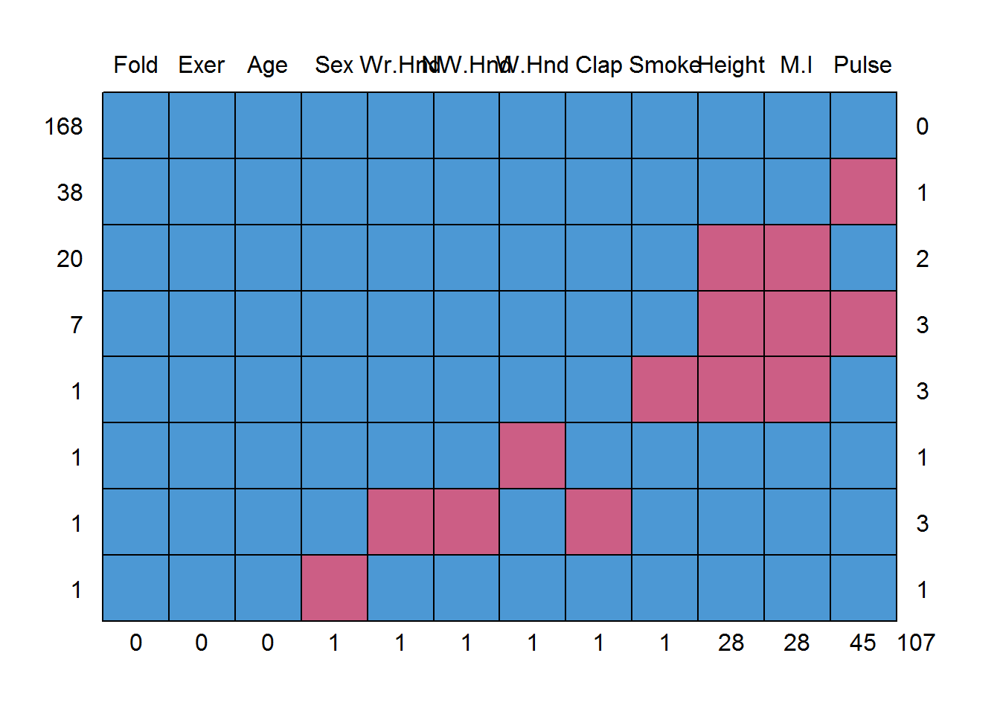

Using `mice`

```r
library(mice)
md.pattern(survey)
```

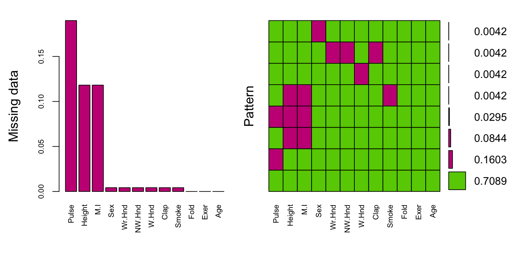

```
##     Fold Exer Age Sex Wr.Hnd NW.Hnd W.Hnd Clap Smoke Height M.I Pulse    
## 168    1    1   1   1      1      1     1    1     1      1   1     1   0
## 38     1    1   1   1      1      1     1    1     1      1   1     0   1
## 20     1    1   1   1      1      1     1    1     1      0   0     1   2
## 7      1    1   1   1      1      1     1    1     1      0   0     0   3
## 1      1    1   1   1      1      1     1    1     0      0   0     1   3
## 1      1    1   1   1      1      1     0    1     1      1   1     1   1
## 1      1    1   1   1      0      0     1    0     1      1   1     1   3
## 1      1    1   1   0      1      1     1    1     1      1   1     1   1
##        0    0   0   1      1      1     1    1     1     28  28    45 107
```

This somewhat ugly output tells us that 168 records have no missing data, 38 records are missing only `Pulse` and 20 are missing both `Height` and `M.I`. 

Using `VIM`

```r
library(VIM)
aggr(survey, col=c('chartreuse3','mediumvioletred'),
              numbers=TRUE, sortVars=TRUE,
              labels=names(survey), cex.axis=.7,
              gap=3, ylab=c("Missing data","Pattern"))
```

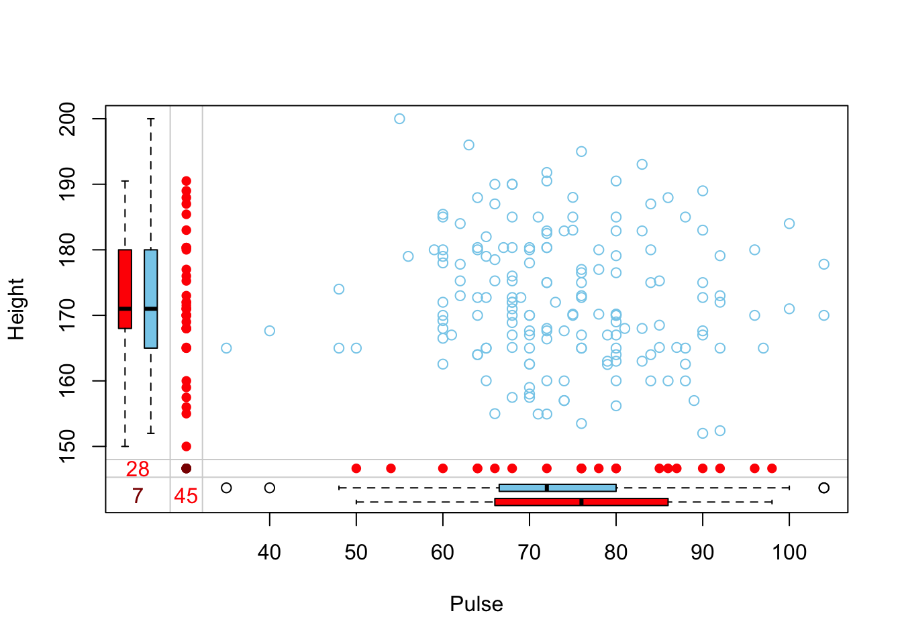

The plot on the left is a simplified, and ordered version of the ggplot from above, except the bars appear to be inflated because the y-axis goes up to 15% instead of 100%. 

The plot on the right shows the missing data patterns, and indicate that 71% of the records has complete cases, and that everyone who is missing `M.I.` is also missing Height. 

Another plot that can be helpful to identify patterns of missing data is a `marginplot` (also from `VIM`).

* Two continuous variables are plotted against each other.  
* Blue bivariate scatterplot and univariate boxplots are for the observations where values on both variables are observed.
* Red univariate dotplots and boxplots are drawn for the data that is only observed on one of the two variables in question.  
* The darkred text indicates how many records are missing on both. 


```r
marginplot(survey[,c(6,10)])
```


This shows us that the observations missing pulse have the same median height, but those missing height have a higher median pulse rate. 

### Example: Parental HIV

#### Identify missing

Entire data set

```r
table(is.na(hiv)) |> prop.table()
## 
##      FALSE       TRUE 
## 0.96330127 0.03669873
```

Only 3.7% of all values in the data set are missing. 


#### Examine missing data patterns of scale variables. 

The parental bonding and BSI scale variables are aggregated variables, meaning they are sums or means of a handful of component variables. That means if any one component variable is missing, the entire scale is missing. _E.g. if y = x1+x2+x3, then y is missing if any of x1, x2 or x3 are missing. _


```r
scale.vars <- hiv %>% select(parent_care:bsi_psycho, gender, siblings, age)
aggr(scale.vars, sortVars=TRUE, combined=TRUE, numbers=TRUE, cex.axis=.7)
```

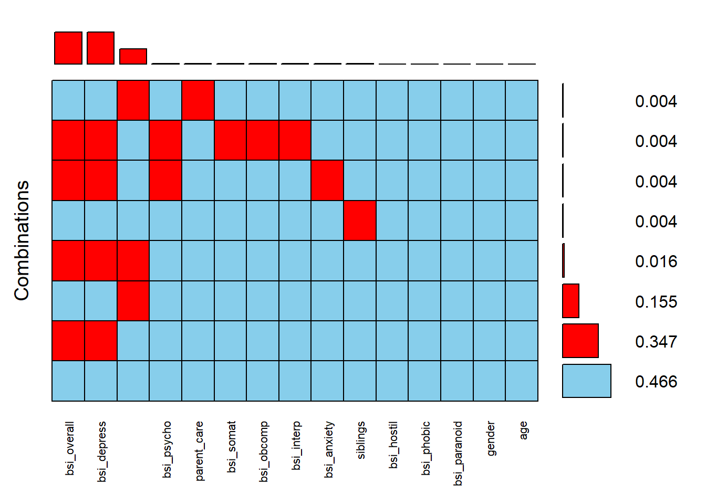

```
## 
##  Variables sorted by number of missings: 
##               Variable Count
##            bsi_overall    93
##            bsi_depress    93
##  parent_overprotection    44
##             bsi_psycho     2
##            parent_care     1
##              bsi_somat     1
##             bsi_obcomp     1
##             bsi_interp     1
##            bsi_anxiety     1
##               siblings     1
##             bsi_hostil     0
##             bsi_phobic     0
##           bsi_paranoid     0
##                 gender     0
##                    age     0
```

34.7% of records are missing both `bsi_overall` and `bsi_depress` This makes sense since `bsi_depress` is a subscale containing 9 component variables and the `bsi_overall` is an average of all 52. 

Another 15.5% of records are missing `parental_overprotection`. 


Is there a bivariate pattern between missing and observed values of `bsi_depress` and `parent_overprotection`?

```r
marginplot(hiv[,c('bsi_depress', 'parent_overprotection')])
```

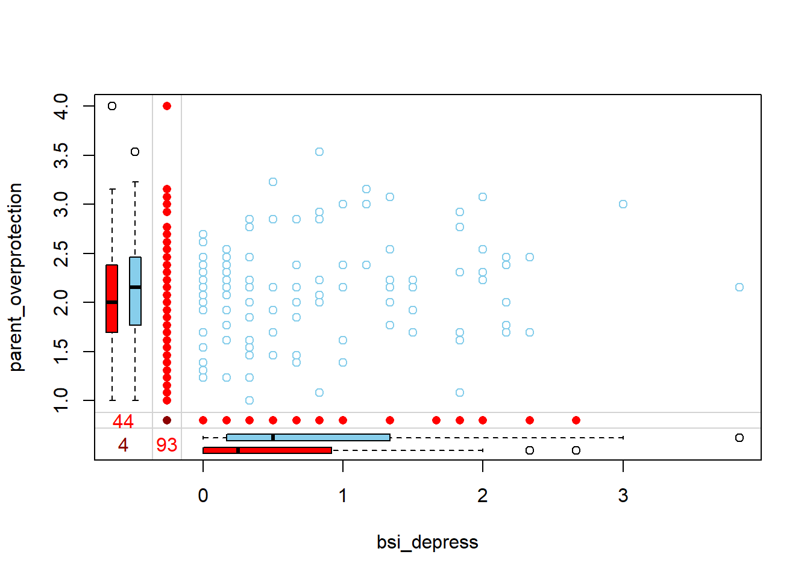

When someone is missing `parent_overprotection`, they have a lower `bsi_depress` score. Those missing `bsi_depress` have a slightly lower `parental_overprotection` score. Only 4 individuals are missing both values. 


## Effects of Nonresponse

Textbook example: Example reported in W.G. Cochran, Sampling Techniques, 3rd edition, 1977, ch. 13

> Consider data that come form an experimental sampling of fruit orcharts in North Carolina in 1946.
> Three successive mailings of the same questionnaire were sent to growers. For one of the questions
> the number of fruit trees, complete data were available for the population...

<br>

|      Ave. # trees         | # of growers |  % of pop’n  | Ave # trees/grower  |
|---------------------------|--------------|--------------|---------------------|
| 1st mailing responders	  |   300	       |     10		    |   456               |
| 2nd mailing responders    |   543	       |     17		    |   382               |
| 3rd mailing responders	  |   434	       |     14		    |   340               |
| Nonresponders 	          |  1839	       |     59		    |   290               |
|                           |  --------    |  --------    |    --------         |
|    Total population       |   3116       |    100       |    329              |


* The overall response rate was very low. 
* The rate of non response is clearly related to the average number of trees per grower. 
* The estimate of the average trees per grower can be calculated as a weighted average from responders $\bar{Y_{1}}$ and non responders $\bar{Y_{2}}$. 

**Bias**: The difference between the observed estimate $\bar{y}_{1}$ and the true parameter $\mu$. 

$$ 
  \begin{aligned}
  E(\bar{y}_{1}) - \mu & = \bar{Y_{1}} - \bar{Y} \\
  & = \bar{Y}_{1} - \left[(1-w)\bar{Y}_{1} - w\bar{Y}_{2}\right] \\
  & = w(\bar{Y}_{1} - \bar{Y}_{2})
  \end{aligned}
$$

Where $w$ is the proportion of non-response. 

* The amount of bias is the product of the proportion of non-response and the difference in the means between the responders and the non-responders. 
* The sample provides no information about $\bar{Y_{2}}$, the size of the bias is generally unknown without information gained from external data. 


## Missing Data Mechanisms

Process by which some units observed, some units not observed

* **Missing Completely at Random (MCAR)**: The probability that a data point is missing is completely unrelated (independent) of any observed and unobserved data or parameters. 
    - P(Y missing| X, Y) = P(Y missing)
    - Ex: Miscoding or forgetting to log in answer
* **Missing at Random (MAR)**: The probability that a data point is missing is independent can be explained or modeled by other observed variables. 
    - P(Y missing|x, Y) = P(Y missing | X)
    - Ex: Y = age, X = sex  
		    - Pr (Y miss| X = male) = 0.2  
		    - Pr (Y miss| X = female) = 0.3  
		    - Males people are less likely to fill out an income survey
		    - The missing data on income is related to gender 
		    - After accounting for gender the missing data is unrelated to income.   
* **Not missing at Random (NMAR)**: The probability that a data point is missing depends on the value of the variable in question.   
    - P(Y missing | X, Y) = P (Y missing|X, Y)  
    - Ex: Y = income, X = immigration status  
        - Richer person may be less willing to disclose income  
        - Undocumented immigrant may be less willing to disclose income  

 Write down an example of each. 

Does it matter to inferences?  <span style ="color:red">**Yes!**</span>

### Demonstration via Simulation
What follows is just _one_ method of approaching this problem via code. Simulation is a frequently used technique to understand the behavior of a process over time or over repeated samples. 

#### MCAR
1. Draw a random sample of size 100 from a standard Normal distribution (Z) and calculate the mean. 

```r
set.seed(456) # setting a seed ensures the same numbers will be drawn each time
z <- rnorm(100)
mean.z <- mean(z)
mean.z
## [1] 0.1205748
```

2. Delete data at a rate of $p$ and calculate the complete case (available) mean. 
    - Sample 100 random Bernoulli (0/1) variables with probability $p$. 
    
    ```r
    x <- rbinom(100, 1, p=.5)
    ```
    - Find out which elements are are 1's
    
    ```r
    delete.these <- which(x==1)
    ```
    - Set those elements in `z` to `NA`. 
    
    ```r
    z[delete.these] <- NA
    ```
    - Calculate the complete case mean
    
    ```r
    mean(z, na.rm=TRUE)
    ## [1] 0.1377305
    ```
    
3. Calculate the bias as the sample mean minus the true mean ($E(\hat\theta) - \theta$). 

```r
mean(z, na.rm=TRUE) - mean.z
## [1] 0.01715565
```

How does the bias change as a function of the proportion of missing? Let $p$ range from 0% to 99% and plot the bias as a function of $p$. 


```r
calc.bias <- function(p){ # create a function to handle the repeated calculations
  mean(ifelse(rbinom(100, 1, p)==1, NA, z), na.rm=TRUE) - mean.z
}

p <- seq(0,.99,by=.01)

plot(c(0,1), c(-1, 1), type="n", ylab="Bias", xlab="Proportion of missing")
  points(p, sapply(p, calc.bias), pch=16)
  abline(h=0, lty=2, col="blue")
```

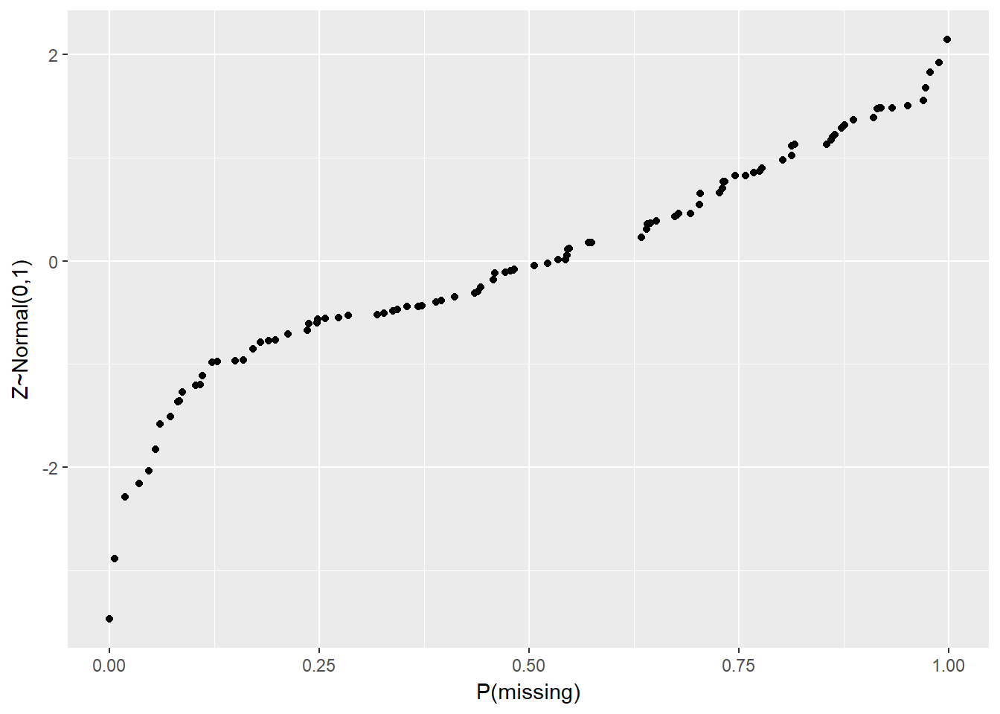


 What is the behavior of the bias as $p$ increases? Look specifically at the position/location of the bias, and the variance/variability of the bias. 

#### NMAR: Missing related to data
What if the rate of missing is related to the value of the outcome? Again, let's setup a simulation to see how this works. 

1. Randomly draw 100 random data points from a Standard Normal distribution to serve as our population, and 100 uniform random values between 0 and 1 to serve as probabilities of the data being missing ($p=P(miss)$)

```r
Z <- rnorm(100)
p <- runif(100, 0, 1)
```

2. Sort both in ascending order, shove into a data frame and confirm that $p(miss)$ increases along with $z$. 

```r
dta <- data.frame(Z=sort(Z), p=sort(p))
head(dta)
##           Z           p
## 1 -2.898122 0.003673455
## 2 -2.185058 0.013886146
## 3 -2.076032 0.035447986
## 4 -1.938288 0.039780643
## 5 -1.930809 0.051362816
## 6 -1.905331 0.054639596
ggplot(dta, aes(x=p, y=Z)) + geom_point() + xlab("P(missing)") + ylab("Z~Normal(0,1)")
```

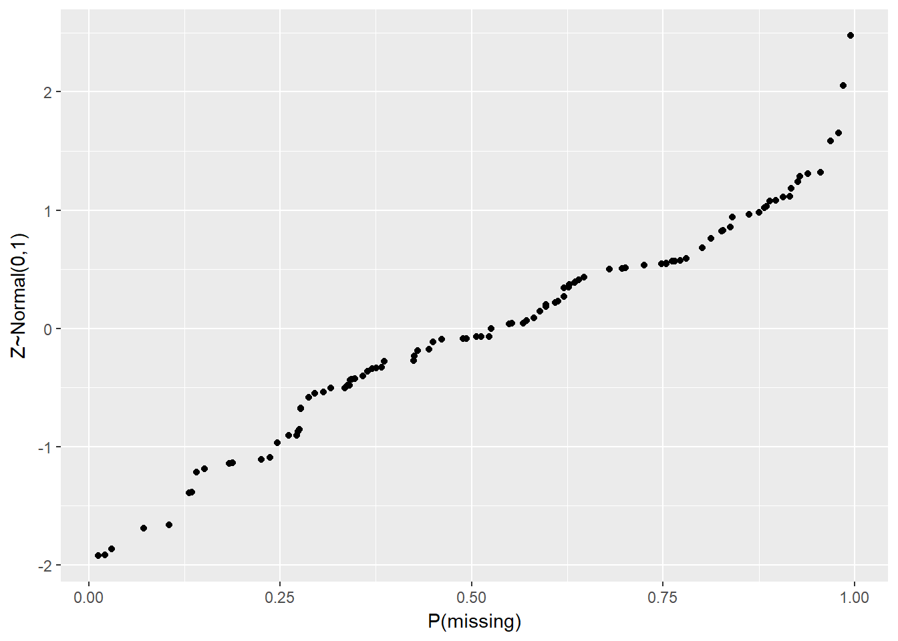

3. Set $Z$ missing with probability equal to the $p$ for that row. Create a new vector `dta$z.miss` that is either 0, or the value of `dta$Z` with probability `1-dta$p`. Then change all the 0's to `NA`.


```r
dta$Z.miss <- dta$Z * (1-rbinom(NROW(dta), 1, dta$p))
head(dta) # see structure of data to understand what is going on
##           Z           p    Z.miss
## 1 -2.898122 0.003673455 -2.898122
## 2 -2.185058 0.013886146 -2.185058
## 3 -2.076032 0.035447986 -2.076032
## 4 -1.938288 0.039780643 -1.938288
## 5 -1.930809 0.051362816 -1.930809
## 6 -1.905331 0.054639596 -1.905331
dta$Z.miss[dta$Z.miss==0] <- NA
```

5. Calculate the complete case mean and the bias

```r
mean(dta$Z.miss, na.rm=TRUE)
## [1] -0.7777319
mean(dta$Z) - mean(dta$Z.miss, na.rm=TRUE)
## [1] 0.6830372
```

[](images/q.png) Did the complete case estimate over- or under-estimate the true mean? Is the bias positive or negative? 


#### NMAR: Pure Censoring
Consider a hypothetical blood test to measure a hormone that is normally distributed in the blood with mean 10$\mu g$ and variance 1. However the test to detect the compound only can detect levels above 10. 

```r
z <- rnorm(100, 10, 1)
y <- z
y[y<10] <- NA
mean(z) - mean(y, na.rm=TRUE)
## [1] -0.6850601
```

[](images/q.png) Did the complete case estimate over- or under-estimate the true mean? 


\BeginKnitrBlock{rmdnote}<div class="rmdnote">When the data is not missing at random, the bias can be much greater. </div>\EndKnitrBlock{rmdnote}

\BeginKnitrBlock{rmdcaution}<div class="rmdcaution">Usually you don't know the missing data mechanism.</div>\EndKnitrBlock{rmdcaution}

**Degrees of difficulty**

* MCAR: is easiest to deal with.
* MAR: we can live with it.
* NMAR: most difficult to handle.

**Evidence?**

What can we learn from evidence in the data set at hand?

* May be evidence in the data rule out MCAR - test responders vs. nonresponders.
    - Example: Responders tend to have higher/lower average education than nonresponders by t-test
    - Example: Response more likely in one geographic area than another by chi-square test
* No evidence in data set to rule out MAR (although there may be evidence from an external data source)
  
**What is plausible?**

* Cochran example: when human behavior is involved, MCAR must be viewed as an extremely special case that would often be violated in practice
* Missing data may be introduced by design (e.g., measure some variables, don’t measure others for reasons of cost, response burden), in which case MCAR would apply
* MAR is much more common than MCAR
* We cannot be too cavalier about assuming MAR, but anecdotal evidence shows that it often is plausible when conditioning on enough information

**Ignorable Missing**

* If missing-data mechanism is MCAR or MAR then nonresponse is said to be "ignorable".
* Origin of name: in likelihood-based inference, both the data model and missing-data mechanism are important but with MCAR or MAR, inference can be based solely on the data model, thus making inference much simpler   
* "_Ignorability_" is a relative assumption:  missingness on income may be NMAR given only gender, but may be MAR given gender, age, occupation, region of the country

## General strategies

Strategies for handling missing data include:

* Complete-case/available-case analysis: drop cases that make analysis inconvenient. 
* If variables are known to contribute to the missing values, then appropriate modeling can often account for the missingness. 
* Imputation procedures: fill in missing values, then analyze completed data sets using complete-date methods
* Weighting procedures: modify "design weights" (i.e., inverse probabilities of selection from sampling plan) to account for probability of response  
* Model-based approaches: develop model for partially missing data, base inferences on likelihood under that model


### Complete cases analysis
If not all variables observed, delete case from analysis  

* Advantages:
    - Simplicity
    - Common sample for all estimates
* Disadvantages:
    - Loss of valid information
    - Bias due to violation of MCAR  


### Available-case analysis 
* Use all cases where the variable of interest is present 
    - Potentially different sets of cases for means of X and Y
    - and complete pairs for $r_{XY}$  
* Tempting to think that available-case analysis will be superior to complete-case analysis  
* But it can distort relationships between variables by not using a common base of observations for all quantities being estimated.

### Imputation
Fill in missing values, analyze completed data set

* Advantage: 
    * Rectangular data set easier to analyze
    * Analysis data set $n$ matches summary table $n$
* Disadvantage:
    * "Both seductive and dangerous" (Little and Rubin)
    * Can understate uncertainty due to missing values. 
    * Can induce bias if imputing under the wrong model.

## Imputation Methods

This section demonstrates each imputation method on the `bsi_depress` scale variable from the parental HIV example. To recap, 37% of the data on this variable is missing. 

Create an index of row numbers containing missing values. This will be used to fill in those missing values with a data value. 

```r
miss.dep.idx<- which(is.na(hiv$bsi_depress))
head(miss.dep.idx) 
## [1]  2  4  5  9 13 14
```

For demonstration purposes I will also create a copy of the `bsi_depress` variable so that the original is not overwritten for each example. 

### Unconditional mean substitution. 
  - Impute all missing data using the mean of observed cases
  - <span style ="color:red">Artificially decreases the variance</span> 


```r
bsi_depress.ums <- hiv$bsi_depress # copy
complete.case.mean <- mean(hiv$bsi_depress, na.rm=TRUE)
bsi_depress.ums[miss.dep.idx] <- complete.case.mean
```

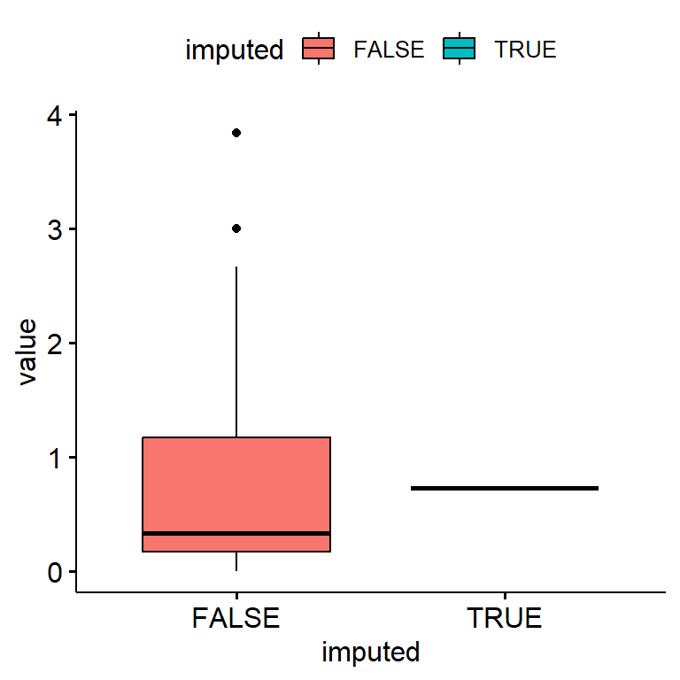

Only a single value was used to impute missing data. 
    
### Hot deck imputation
    - Impute values by randomly sampling values from observed data.  
    - Good for categorical data
    - Reasonable for MCAR and MAR
    - `hotdeck` function in `VIM` available


```r
bsi_depress.hotdeck<- hiv$bsi_depress # copy
hot.deck <- sample(na.omit(hiv$bsi_depress), size = length(miss.dep.idx))
bsi_depress.hotdeck[miss.dep.idx] <- hot.deck
```

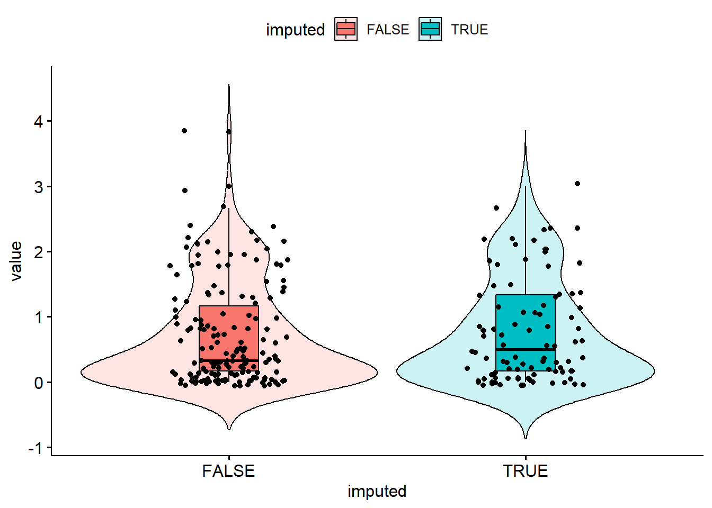

The distribution of imputed values better matches the distribution of observed data, but the distribution (Q1, Q3) is shifted lower a little bit. 


### Model based imputation 

* Conditional Mean imputation: Use regression on observed variables to estimate missing values
    * Predictions only available for cases with no missing covariates
    * Imputed value is the model predicted mean $\hat{\mu}_{Y|X}$
    * Could use `VIM::regressionImp()` function 
* Predictive Mean Matching: Fills in a value randomly by sampling observed values whose regression-predicted values are closest to the regression-predicted value for the missing point. 
    * Cross between hot-deck and conditional mean
    * Categorical data can be imputed using classification models
    * Less biased than mean substitution
    * but SE's could be inflated
    * Typically used in multivariate imputation (so not shown here)
   

Model `bsi_depress` using gender, siblings and age as predictors using linear regression.


```r
reg.model <- lm(bsi_depress ~ gender + siblings + age, hiv) 
need.imp  <- hiv[miss.dep.idx, c("gender", "siblings", "age")]
reg.imp.vals <- predict(reg.model, newdata = need.imp)
bsi_depress.lm <- hiv$bsi_depress # copy
bsi_depress.lm[miss.dep.idx] <- reg.imp.vals
```

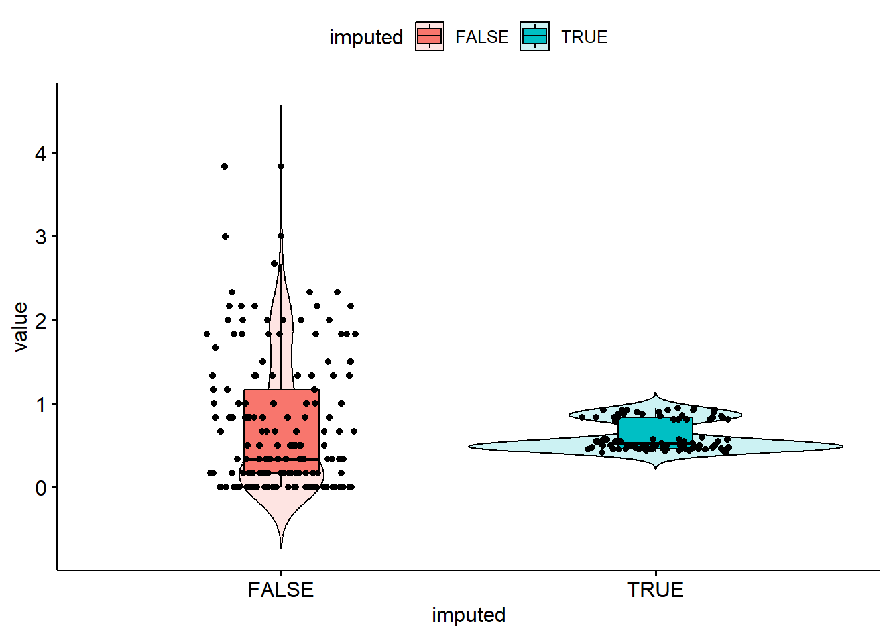

It seems like only values around 0.5 and 0.8 were imputed values for `bsi_depress`. The imputed values don't quite match the distribution of observed values. Regression imputation and PMM seem to perform extremely similarily. 


### Adding a residual

* Impute regression value $\pm$ a randomly selected residual based on estimated residual variance
* Over the long-term, we can reduce bias, on the average


```r
set.seed(1337)
rmse <- sqrt(summary(reg.model)$sigma)
eps <- rnorm(length(miss.dep.idx), mean=0, sd=rmse)
bsi_depress.lm.resid <- hiv$bsi_depress # copy
bsi_depress.lm.resid[miss.dep.idx] <- reg.imp.vals + eps
```

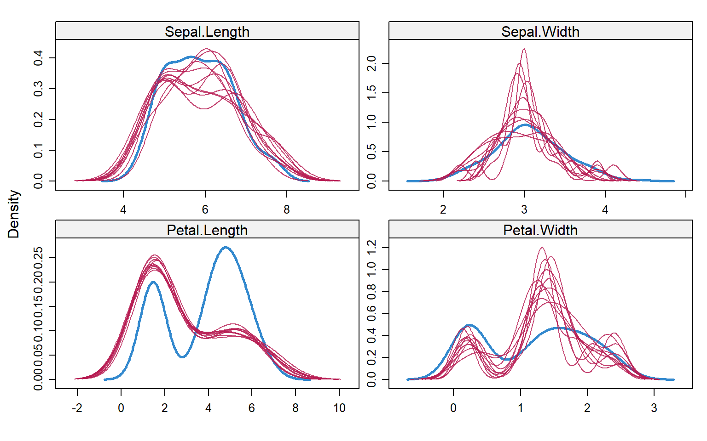

Well, the distribution of imputed values is spread out a bit more, but the imputations do not respect the truncation at 0 this `bsi_depress` value has. 

### Comparison of Estimates

Create a table and plot that compares the point estimates and intervals for the average bsi depression scale. 


```r
single.imp <- bind_rows(
data.frame(value = na.omit(hiv$bsi_depress),  method = "Observed"),
  data.frame(value = bsi_depress.ums, method = "Mean Sub"), 
  data.frame(value = bsi_depress.hotdeck, method = "Hot Deck"), 
  data.frame(value = bsi_depress.lm, method = "Regression"), 
  data.frame(value = bsi_depress.lm.resid, method = "Reg + eps"))

single.imp$method <- forcats::fct_relevel(single.imp$method , 
      c("Observed", "Mean Sub", "Hot Deck", "Regression", "Reg + eps"))

si.ss <- single.imp %>%
  group_by(method) %>%
  summarize(mean = mean(value), 
            sd = sd(value), 
            se = sd/sqrt(n()), 
            cil = mean-1.96*se, 
            ciu = mean+1.96*se)
si.ss
## # A tibble: 5 × 6
##   method      mean    sd     se   cil   ciu
##   <fct>      <dbl> <dbl>  <dbl> <dbl> <dbl>
## 1 Observed   0.723 0.782 0.0622 0.601 0.844
## 2 Mean Sub   0.723 0.620 0.0391 0.646 0.799
## 3 Hot Deck   0.738 0.783 0.0494 0.641 0.835
## 4 Regression 0.682 0.631 0.0399 0.604 0.760
## 5 Reg + eps  0.753 0.848 0.0536 0.648 0.858
```


```r
ggviolin(single.imp, y = "value", 
          fill = "method", x = "method", 
          add = "boxplot", 
          alpha = .2)
```

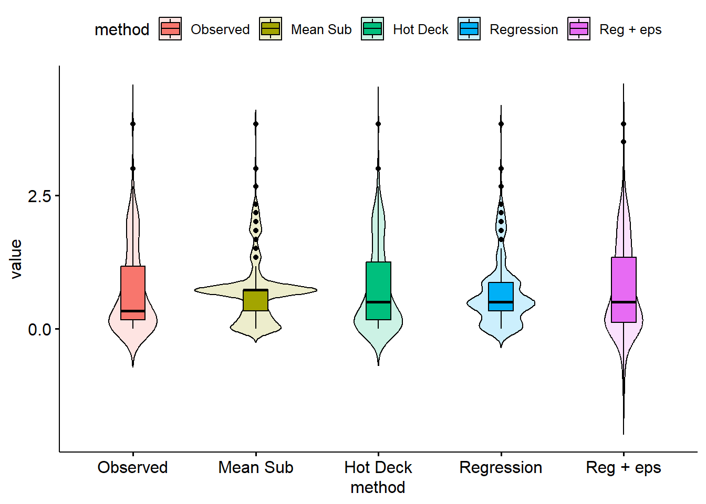

```r

ggplot(si.ss, aes(x=mean, y = method, col=method)) + 
  geom_point() + geom_errorbar(aes(xmin=cil, xmax=ciu), width=0.2) + 
  scale_x_continuous(limits=c(.5, 1)) + 
  theme_bw() + xlab("Average BSI Depression score") + ylab("")
```

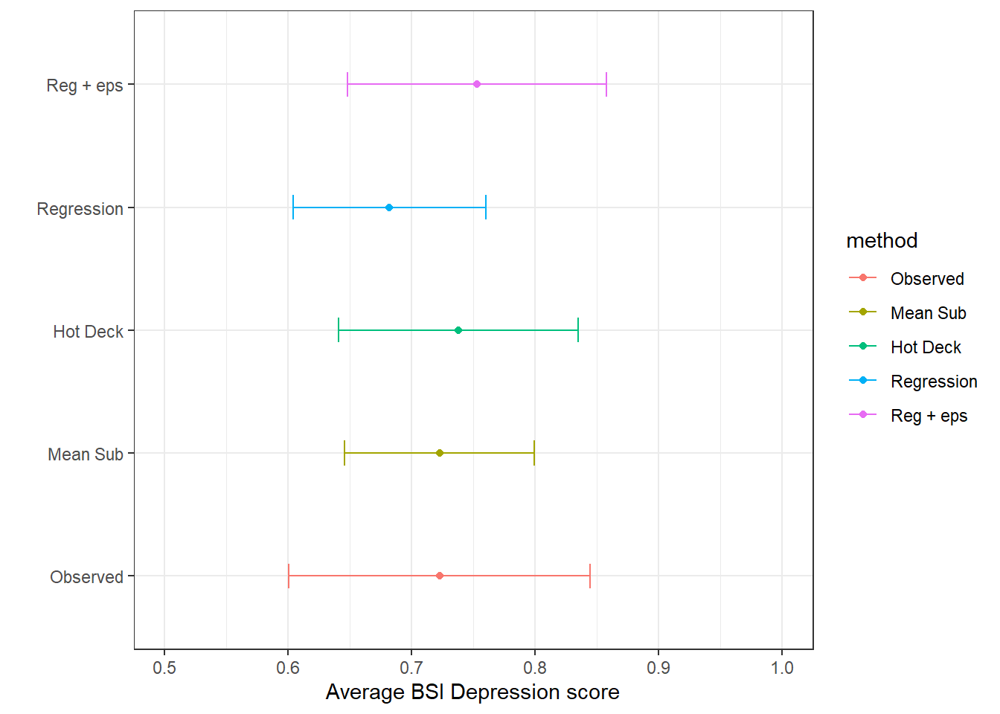


…but we can do better.
  

## Multiple Imputation (MI)

### Goals
* Accurately reflect available information
* Avoid bias in estimates of quantities of interest
* Estimation could involve explicit or implicit model
* Accurately reflect uncertainty due to missingness

### Technique  
1. For each missing value, impute $m$ estimates (usually $m$ = 5)
    - Imputation method must include a random component
2. Create $m$ complete data sets
3. Perform desired analysis on each of the $m$ complete data sets
4. **Pool** final estimates in a manner that accounts for the between, and within imputation variance. 


### MI as a paradigm
* Logic: "Average over" uncertainty, don’t assume most likely scenario (single imputation) covers all plausible scenarios
* Principle: Want nominal 95% intervals to cover targets of estimation 95% of the time
* Simulation studies show that, when MAR assumption holds:
    - Proper imputations will yield close to nominal coverage (Rubin 87)
    - Improvement over single imputation is meaningful 
    - Number of imputations can be modest - even 2 adequate for many purposes, so 5 is plenty

_Rubin 87: Multiple Imputation for Nonresponse in Surveys, Wiley, 1987)._

### Inference on MI (Pooling estimates)

Consider $m$ imputed data sets. For some quantity of interest $Q$ with squared $SE = U$, calculate $Q_{1}, Q_{2}, \ldots, Q_{m}$ and $U_{1}, U_{2}, \ldots, U_{m}$ (e.g., carry out $m$ regression analyses, obtain point estimates and SE from each). 

Then calculate the average estimate $\bar{Q}$, the average variance $\bar{U}$, and the variance of the averages $B$. 

$$ 
  \begin{aligned}
  \bar{Q} & = \sum^{m}_{i=1}Q_{i}/m \\
  \bar{U} & = \sum^{m}_{i=1}U_{i}/m \\
  B & = \frac{1}{m-1}\sum^{m}_{i=1}(Q_{i}-\bar{Q})^2
  \end{aligned}
$$

Then $T = \bar{U} + \frac{m+1}{m}B$ is the estimated total variance of $\bar{Q}$. 

Significance tests and interval estimates can be based on

$$\frac{\bar{Q}-Q}{\sqrt{T}} \sim t_{df}, \mbox{ where } df = (m-1)(1+\frac{1}{m+1}\frac{\bar{U}}{B})^2$$

                                  
* df are similar to those for comparison of normal means with unequal variances, i.e., using Satterthwaite approximation.
* Ratio of (B = between-imputation variance) to (T = between + within-imputation variance) is known as the fraction of missing information (FMI). 	
    - The FMI has been proposed as a way to monitor ongoing data collection and estimate the potential bias resulting from survey non-responders [Wagner, 2018](https://academic.oup.com/poq/article-abstract/74/2/223/1936466?redirectedFrom=fulltext)
    
    
### Example
  
1. Create $m$ imputed datasets using linear regression plus a small amount of random noise so all the imputed values are not identical 


```r
set.seed(1061)
dep.imp1 <- dep.imp2 <- dep.imp3 <- regressionImp(bsi_depress ~ gender + siblings + age, hiv) 
dep.imp1$bsi_depress[miss.dep.idx] <- dep.imp1$bsi_depress[miss.dep.idx] +
  rnorm(length(miss.dep.idx), mean=0, sd=rmse/2)

dep.imp2$bsi_depress[miss.dep.idx] <- dep.imp2$bsi_depress[miss.dep.idx] + 
  rnorm(length(miss.dep.idx), mean=0, sd=rmse/2)

dep.imp3$bsi_depress[miss.dep.idx] <- dep.imp3$bsi_depress[miss.dep.idx] + 
  rnorm(length(miss.dep.idx), mean=0, sd=rmse/2)
```

Visualize the distributions of observed and imputed

```r
dep.mi <- bind_rows(
  data.frame(value = dep.imp1$bsi_depress, imputed = dep.imp1$bsi_depress_imp, 
             imp = "dep.imp1"), 
  data.frame(value = dep.imp2$bsi_depress, imputed = dep.imp2$bsi_depress_imp, 
             imp ="dep.imp2"), 
  data.frame(value = dep.imp3$bsi_depress, imputed = dep.imp3$bsi_depress_imp, 
             imp ="dep.imp3"))

ggdensity(dep.mi, x = "value", color = "imputed", fill = "imputed", 
          add = "mean", rug=TRUE, palette = "jco") + 
  facet_wrap(~imp, ncol=1)
```

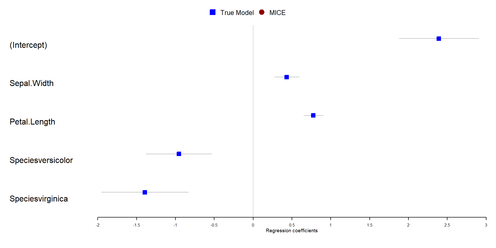

2. Calculate the point estimate $Q$ and the variance $U$ from each imputation. 


```r
(Q <- c(mean(dep.imp1$bsi_depress), 
        mean(dep.imp2$bsi_depress), 
        mean(dep.imp3$bsi_depress)))
## [1] 0.6700139 0.6808710 0.6694280

n.d <- length(dep.imp1$bsi_depress)
(U <- c(sd(dep.imp1$bsi_depress)/sqrt(n.d), 
        sd(dep.imp2$bsi_depress)/sqrt(n.d), 
        sd(dep.imp3$bsi_depress)/sqrt(n.d)))
## [1] 0.04443704 0.04324317 0.04365866
```

3. Pool estimates and calculate a 95% CI


```r
Q.bar <- mean(Q)          # average estimate
U.bar <- mean(U)           # average variance
B <- sd(Q)                 # variance of averages
Tv <- U.bar + ((3+1)/3)*B  # Total variance of estimate

df <- 2*(1+(U.bar/(4*B))^2) # degress of freedom
t95 <- qt(.975, df) # critical value for 95% CI

mi.ss <- data.frame(
  method = "MI Reg", 
  mean = Q.bar, 
  se = sqrt(Tv), 
  cil = Q.bar - t95*sqrt(Tv),
  ciu = Q.bar + t95*sqrt(Tv))

(imp.ss <- bind_rows(si.ss, mi.ss))
## # A tibble: 6 × 6
##   method      mean     sd     se   cil   ciu
##   <chr>      <dbl>  <dbl>  <dbl> <dbl> <dbl>
## 1 Observed   0.723  0.782 0.0622 0.601 0.844
## 2 Mean Sub   0.723  0.620 0.0391 0.646 0.799
## 3 Hot Deck   0.738  0.783 0.0494 0.641 0.835
## 4 Regression 0.682  0.631 0.0399 0.604 0.760
## 5 Reg + eps  0.753  0.848 0.0536 0.648 0.858
## 6 MI Reg     0.673 NA     0.229  0.143 1.20
```


```r
ggplot(imp.ss, aes(x=mean, y = method, col=method)) + 
  geom_point() + geom_errorbar(aes(xmin=cil, xmax=ciu), width=0.2) + 
  scale_x_continuous(limits=c(-.3, 2)) + 
  theme_bw() + xlab("Average BSI Depression score") + ylab("")
```

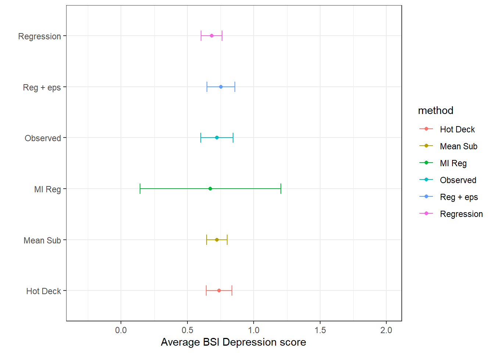


    
    
## Multiple Imputation using Chained Equations (MICE)


### Overview 

* Generates multiple imputations for incomplete multivariate data by Gibbs sampling. 
* Missing data can occur anywhere in the data. 
* Impute an incomplete column by generating 'plausible' synthetic values given other columns in the data. 
* For predictors that are incomplete themselves, the most recently generated imputations are used to complete the predictors prior to imputation of the target column.
* A separate univariate imputation model can be specified for each column. 
* The default imputation method depends on the measurement level of the target column. 

\BeginKnitrBlock{rmdtip}<div class="rmdtip">Your best reference guide to this section of the notes is the bookdown version of Flexible Imputation of Missing Data, by Stef van Buuren: 

https://stefvanbuuren.name/fimd/ch-multivariate.html

For a more technical details about how the `mice` function works in R, see: 
https://www.jstatsoft.org/article/view/v045i03 </div>\EndKnitrBlock{rmdtip}

### Process / Algorithm 

Consider a data matrix with 3 variables $y_{1}$, $y_{2}$, $y_{3}$, each with missing values. At iteration $(\ell)$:

1. Fit a model on $y_{1}^{(\ell-1)}$ using current values of $y_{2}^{(\ell-1)}, y_{3}^{(\ell-1)}$ 
2. Impute missing $y_{1}$, generating $y_{1}^{(\ell)}$ 
3. Fit a model on $y_{2}^{(\ell-1)}$ using current versions of $y_{1}^{(\ell)}, y_{3}^{(\ell-1)}$ 
4. Impute missing  $y_{2}$, generating $y_{2}^{(\ell)}$ 
5. Fit a model on $y_{3}$ using current versions of $y_{1}^{(\ell)}, y_{2}^{(\ell)}$ 
6. Impute missing  $y_{3}$, generating $y_{3}^{(\ell)}$ 
7. Start next cycle using updated values $y_{1}^{(\ell)}, y_{2}^{(\ell)}, y_{3}^{(\ell)}$

where $(\ell)$ cycles from 1 to $L$, before an imputed value is drawn. 

### Convergence

How many imputations ($m$) should we create and how many iterations ($L$) should I run between imputations? 

* Original research from Rubin states that small amount of imputations ($m=5$) would be sufficient. 
* Advances in computation have resulted in very efficient programs such as `mice` - so generating a larger number of imputations (say $m=40$) are more common [Pan, 2016](https://www.ncbi.nlm.nih.gov/pmc/articles/PMC4934387/)
* You want the number of iterations between draws to be long enough that the Gibbs sampler has converged. 
* There is no test or direct method for determing convergence. 
    - Plot parameter against iteration number, one line per chain. 
    - These lines should be intertwined together, without showing trends. 
    - Convergence can be identified when the variance between lines is smaller (or at least no larger) than the variance within the lines. 

\BeginKnitrBlock{rmdimportant}<div class="rmdimportant">**Mandatory Reading**
  
Read 6.5.2: Convergence https://stefvanbuuren.name/fimd/sec-algoptions.html</div>\EndKnitrBlock{rmdimportant}


### Imputation Methods

Some built-in imputation methods in the `mice` package are:

* _pmm_: Predictive mean matching (any) **DEFAULT FOR NUMERIC**
* _norm.predict_: Linear regression, predicted values (numeric)
* _mean_: Unconditional mean imputation (numeric)
* _logreg_: Logistic regression (factor, 2 levels) **DEFAULT**
* _logreg.boot_: Logistic regression with bootstrap
* _polyreg_: Polytomous logistic regression (factor, >= 2 levels) **DEFAULT**
* _lda_: Linear discriminant analysis (factor, >= 2 categories)
* _cart_: Classification and regression trees (any)
* _rf_: Random forest imputations (any)

## Diagnostics

Q: How do I know if the imputed values are plausible? 
A: Create diagnostic graphics that plot the observed and imputed values together. 

https://stefvanbuuren.name/fimd/sec-diagnostics.html


## Example: Prescribed amount of missing.

We will demonstrate using the Palmer Penguins dataset where we can artificially create a prespecified percent of the data missing, (after dropping the 11 rows missing sex) This allows us to be able to  estimate the bias incurred by using these imputation methods.

For the `penguin` data ) out we set a seed and use the `prodNA()` function from the `missForest` package to create 10% missing values in this data set. 

```r
library(missForest)
set.seed(12345) # Raspberry, I HATE raspberry!
pen.nomiss <- na.omit(pen)
pen.miss <- prodNA(pen.nomiss, noNA=0.1)
prop.table(table(is.na(pen.miss)))
## 
##      FALSE       TRUE 
## 0.90015015 0.09984985
```

Visualize missing data pattern.

```r
aggr(pen.miss, col=c('darkolivegreen3','salmon'),
              numbers=TRUE, sortVars=TRUE,
              labels=names(pen.miss), cex.axis=.7,
              gap=3, ylab=c("Missing data","Pattern"))
```

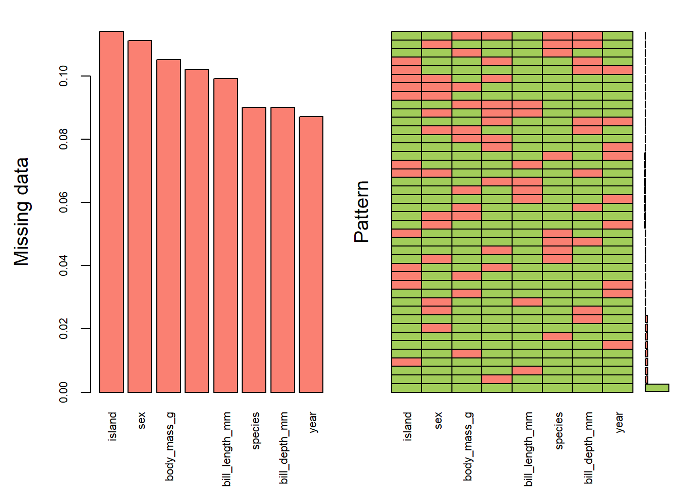

```
## 
##  Variables sorted by number of missings: 
##           Variable      Count
##             island 0.11411411
##                sex 0.11111111
##        body_mass_g 0.10510511
##  flipper_length_mm 0.10210210
##     bill_length_mm 0.09909910
##            species 0.09009009
##      bill_depth_mm 0.09009009
##               year 0.08708709
```

Here's another example of where only 10% of the data overall is missing, but it results in only 58% complete cases. 


### Multiply impute the missing data using `mice()`

```r
imp_pen <- mice(pen.miss, m=10, maxit=25, meth="pmm", seed=500, printFlag=FALSE)
summary(imp_pen)
## Class: mids
## Number of multiple imputations:  10 
## Imputation methods:
##           species            island    bill_length_mm     bill_depth_mm 
##             "pmm"             "pmm"             "pmm"             "pmm" 
## flipper_length_mm       body_mass_g               sex              year 
##             "pmm"             "pmm"             "pmm"             "pmm" 
## PredictorMatrix:
##                   species island bill_length_mm bill_depth_mm flipper_length_mm
## species                 0      1              1             1                 1
## island                  1      0              1             1                 1
## bill_length_mm          1      1              0             1                 1
## bill_depth_mm           1      1              1             0                 1
## flipper_length_mm       1      1              1             1                 0
## body_mass_g             1      1              1             1                 1
##                   body_mass_g sex year
## species                     1   1    1
## island                      1   1    1
## bill_length_mm              1   1    1
## bill_depth_mm               1   1    1
## flipper_length_mm           1   1    1
## body_mass_g                 0   1    1
```

\BeginKnitrBlock{rmdnote}<div class="rmdnote">The Stack Exchange post listed below has a great explanation/description of what each of these arguments control. It is a **very** good idea to understand these controls. 

https://stats.stackexchange.com/questions/219013/how-do-the-number-of-imputations-the-maximum-iterations-affect-accuracy-in-mul/219049#219049</div>\EndKnitrBlock{rmdnote}

### Check the imputation method used on each variable.

```r
imp_pen$meth
##           species            island    bill_length_mm     bill_depth_mm 
##             "pmm"             "pmm"             "pmm"             "pmm" 
## flipper_length_mm       body_mass_g               sex              year 
##             "pmm"             "pmm"             "pmm"             "pmm"
```

Predictive mean matching was used for all variables, even `species` and `island`. This is reasonable because PMM is a hot deck method of imputation. 

### Check Convergence

```r
plot(imp_pen, c("bill_length_mm", "body_mass_g", "bill_depth_mm"))
```

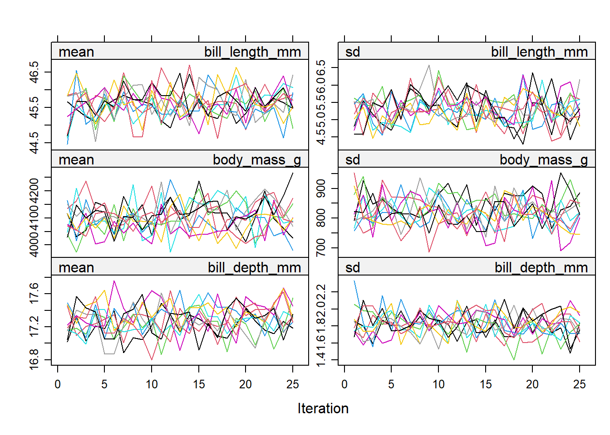

The variance across chains is no larger than the variance within chains. 

### Look at the values generated for imputation

```r
imp_pen$imp$body_mass_g |> head()
##       1    2    3    4    5    6    7    8    9   10
## 3  3800 3750 3550 3900 3550 3300 3400 3900 3450 3900
## 8  3300 3150 3525 3150 3500 3150 3325 3200 3325 3300
## 13 4300 4050 4500 4000 4675 4550 4050 3950 4575 4550
## 35 3400 3900 4075 3600 3900 3700 3900 3425 4725 3250
## 41 3600 4300 3900 3600 3950 3900 3500 3900 4150 4100
## 45 2700 3100 3625 3700 3525 3800 3575 3100 3575 3525
```

This is just for us to see what this imputed data look like. Each column is an imputed value, each row is a row where an imputation for `body_mass_g` was needed. Notice only imputations are shown, no observed data is showing here. 

### Create a complete data set by filling in the missing data using the imputations

```r
pen_1 <- complete(imp_pen, action=1)
```
Action=1 returns the first completed data set, action=2 returns the second completed data set, and so on. 

#### Alternative - Stack the imputed data sets in _long_ format.

```r
pen_long <- complete(imp_pen, 'long')
```

By looking at the `names` of this new object we can confirm that there are indeed 10 complete data sets with $n=333$ in each. 


```r
names(pen_long)
##  [1] ".imp"              ".id"               "species"          
##  [4] "island"            "bill_length_mm"    "bill_depth_mm"    
##  [7] "flipper_length_mm" "body_mass_g"       "sex"              
## [10] "year"
table(pen_long$.imp)
## 
##   1   2   3   4   5   6   7   8   9  10 
## 333 333 333 333 333 333 333 333 333 333
```


### Visualize Imputations
Let's compare the imputed values to the observed values to see if they are indeed "plausible" We want to see that the distribution of of the magenta points (imputed) matches the distribution of the blue ones (observed). 

**Univariately**

```r
densityplot(imp_pen)
```

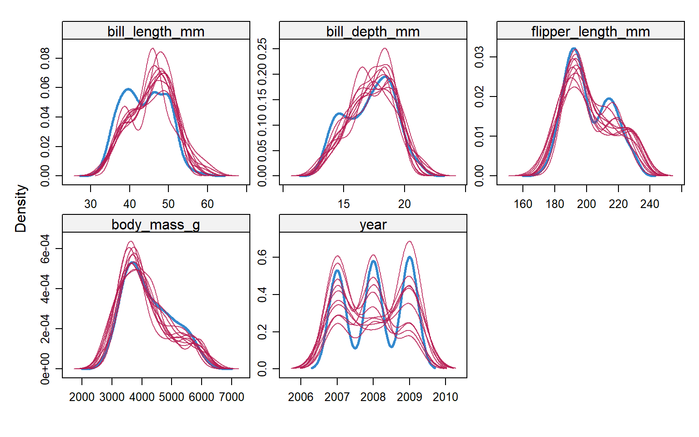

**Multivariately**

```r
xyplot(imp_pen, bill_length_mm ~ bill_depth_mm + flipper_length_mm  | species + island, cex=.8, pch=16)
```

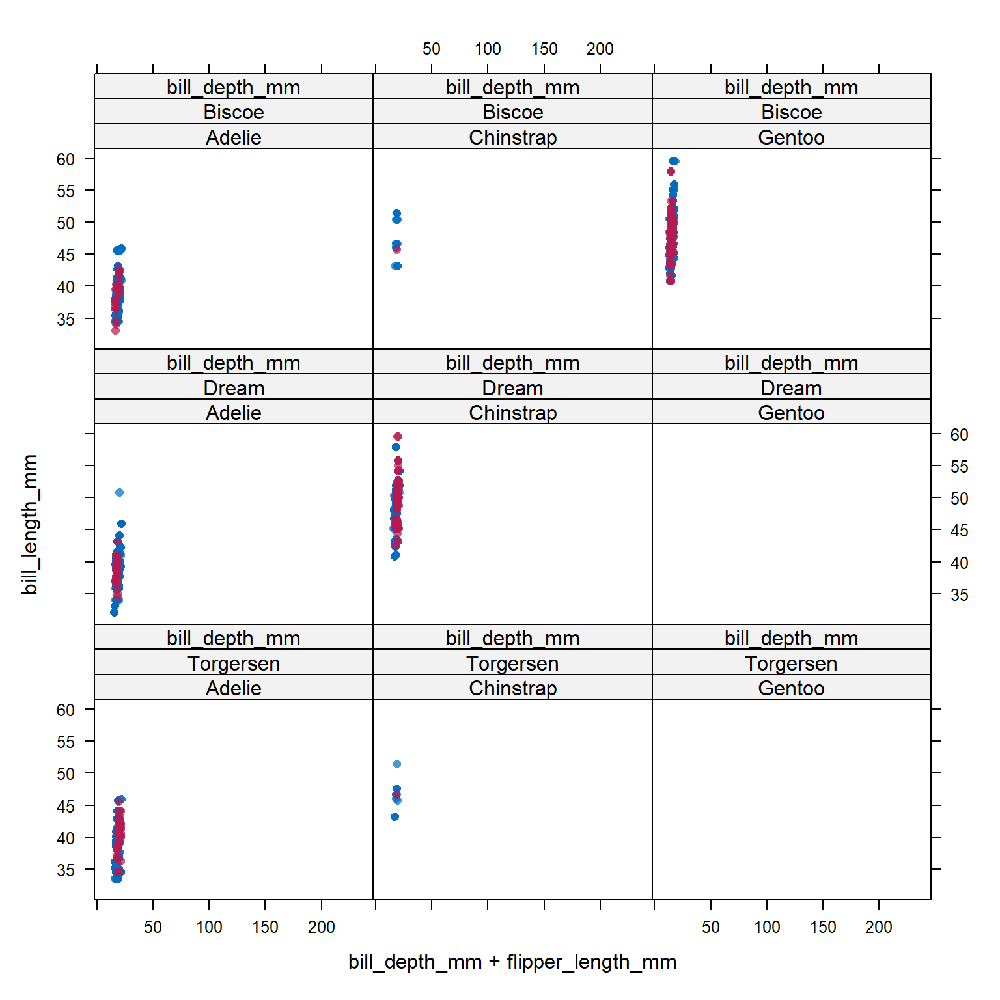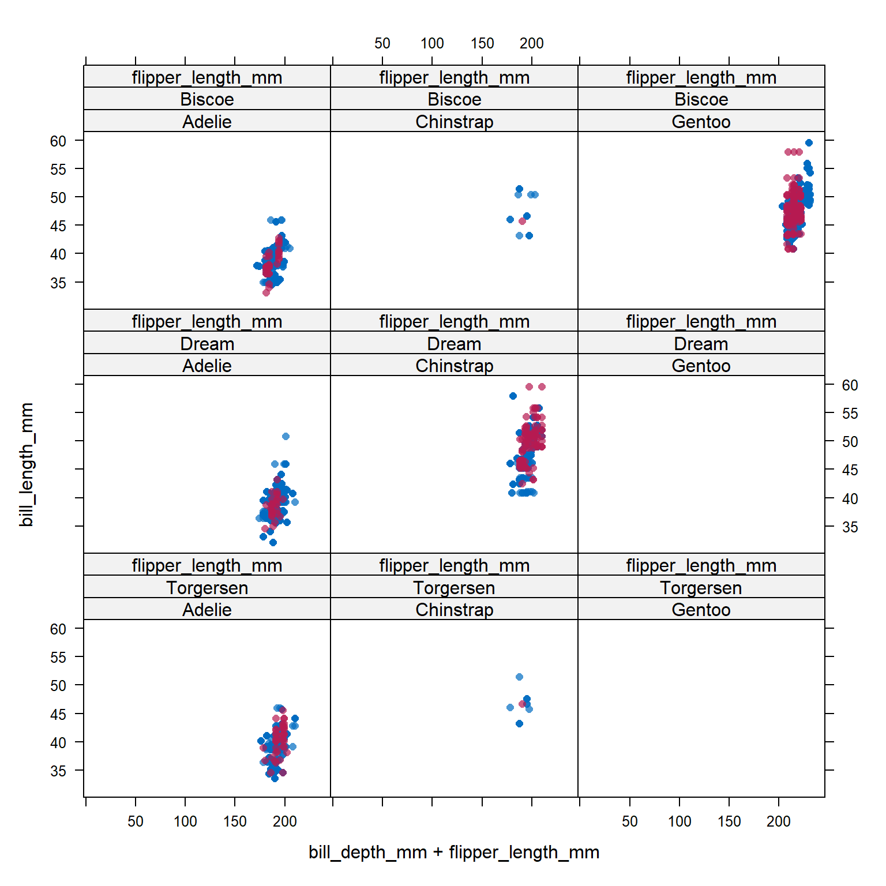

**Analyze and pool**
All of this imputation was done so we could actually perform an analysis! 

Let's run a simple linear regression on `body_mass_g` as a function of `bill_length_mm`, `flipper_length_mm` and `species`.


```r
model <- with(imp_pen, lm(body_mass_g ~ bill_length_mm + flipper_length_mm + species))
summary(pool(model))
##                term    estimate  std.error statistic        df      p.value
## 1       (Intercept) -3758.87511 577.502100 -6.508851 205.80708 5.670334e-10
## 2    bill_length_mm    51.61565   9.013278  5.726624  49.20373 6.081152e-07
## 3 flipper_length_mm    28.67977   3.819019  7.509722  84.41687 5.618897e-11
## 4  speciesChinstrap  -615.76862  97.112862 -6.340753  68.84331 2.051941e-08
## 5     speciesGentoo   155.61083  92.618867  1.680120 298.97391 9.397845e-02
```

Pooled parameter estimates $\bar{Q}$ and their standard errors $\sqrt{T}$ are provided, along with a significance test (against $\beta_p=0$). Note with this output that a 95% interval must be calculated manually. 

We can leverage the `gtsummary` package to tidy and print the results of a `mids` object, but the mice object has to be passed to `tbl_regression` BEFORE you pool. [ref SO post](https://stackoverflow.com/questions/65314702/using-tbl-regression-with-imputed-data-pooled-regression-models). This function needs to access features of the original model first, then will do the appropriate pooling and tidying. 


```r
gtsummary::tbl_regression(model)
```


```{=html}
<div id="xwmupiytlv" style="padding-left:0px;padding-right:0px;padding-top:10px;padding-bottom:10px;overflow-x:auto;overflow-y:auto;width:auto;height:auto;">
<style>#xwmupiytlv table {
  font-family: system-ui, 'Segoe UI', Roboto, Helvetica, Arial, sans-serif, 'Apple Color Emoji', 'Segoe UI Emoji', 'Segoe UI Symbol', 'Noto Color Emoji';
  -webkit-font-smoothing: antialiased;
  -moz-osx-font-smoothing: grayscale;
}

#xwmupiytlv thead, #xwmupiytlv tbody, #xwmupiytlv tfoot, #xwmupiytlv tr, #xwmupiytlv td, #xwmupiytlv th {
  border-style: none;
}

#xwmupiytlv p {
  margin: 0;
  padding: 0;
}

#xwmupiytlv .gt_table {
  display: table;
  border-collapse: collapse;
  line-height: normal;
  margin-left: auto;
  margin-right: auto;
  color: #333333;
  font-size: 16px;
  font-weight: normal;
  font-style: normal;
  background-color: #FFFFFF;
  width: auto;
  border-top-style: solid;
  border-top-width: 2px;
  border-top-color: #A8A8A8;
  border-right-style: none;
  border-right-width: 2px;
  border-right-color: #D3D3D3;
  border-bottom-style: solid;
  border-bottom-width: 2px;
  border-bottom-color: #A8A8A8;
  border-left-style: none;
  border-left-width: 2px;
  border-left-color: #D3D3D3;
}

#xwmupiytlv .gt_caption {
  padding-top: 4px;
  padding-bottom: 4px;
}

#xwmupiytlv .gt_title {
  color: #333333;
  font-size: 125%;
  font-weight: initial;
  padding-top: 4px;
  padding-bottom: 4px;
  padding-left: 5px;
  padding-right: 5px;
  border-bottom-color: #FFFFFF;
  border-bottom-width: 0;
}

#xwmupiytlv .gt_subtitle {
  color: #333333;
  font-size: 85%;
  font-weight: initial;
  padding-top: 3px;
  padding-bottom: 5px;
  padding-left: 5px;
  padding-right: 5px;
  border-top-color: #FFFFFF;
  border-top-width: 0;
}

#xwmupiytlv .gt_heading {
  background-color: #FFFFFF;
  text-align: center;
  border-bottom-color: #FFFFFF;
  border-left-style: none;
  border-left-width: 1px;
  border-left-color: #D3D3D3;
  border-right-style: none;
  border-right-width: 1px;
  border-right-color: #D3D3D3;
}

#xwmupiytlv .gt_bottom_border {
  border-bottom-style: solid;
  border-bottom-width: 2px;
  border-bottom-color: #D3D3D3;
}

#xwmupiytlv .gt_col_headings {
  border-top-style: solid;
  border-top-width: 2px;
  border-top-color: #D3D3D3;
  border-bottom-style: solid;
  border-bottom-width: 2px;
  border-bottom-color: #D3D3D3;
  border-left-style: none;
  border-left-width: 1px;
  border-left-color: #D3D3D3;
  border-right-style: none;
  border-right-width: 1px;
  border-right-color: #D3D3D3;
}

#xwmupiytlv .gt_col_heading {
  color: #333333;
  background-color: #FFFFFF;
  font-size: 100%;
  font-weight: normal;
  text-transform: inherit;
  border-left-style: none;
  border-left-width: 1px;
  border-left-color: #D3D3D3;
  border-right-style: none;
  border-right-width: 1px;
  border-right-color: #D3D3D3;
  vertical-align: bottom;
  padding-top: 5px;
  padding-bottom: 6px;
  padding-left: 5px;
  padding-right: 5px;
  overflow-x: hidden;
}

#xwmupiytlv .gt_column_spanner_outer {
  color: #333333;
  background-color: #FFFFFF;
  font-size: 100%;
  font-weight: normal;
  text-transform: inherit;
  padding-top: 0;
  padding-bottom: 0;
  padding-left: 4px;
  padding-right: 4px;
}

#xwmupiytlv .gt_column_spanner_outer:first-child {
  padding-left: 0;
}

#xwmupiytlv .gt_column_spanner_outer:last-child {
  padding-right: 0;
}

#xwmupiytlv .gt_column_spanner {
  border-bottom-style: solid;
  border-bottom-width: 2px;
  border-bottom-color: #D3D3D3;
  vertical-align: bottom;
  padding-top: 5px;
  padding-bottom: 5px;
  overflow-x: hidden;
  display: inline-block;
  width: 100%;
}

#xwmupiytlv .gt_spanner_row {
  border-bottom-style: hidden;
}

#xwmupiytlv .gt_group_heading {
  padding-top: 8px;
  padding-bottom: 8px;
  padding-left: 5px;
  padding-right: 5px;
  color: #333333;
  background-color: #FFFFFF;
  font-size: 100%;
  font-weight: initial;
  text-transform: inherit;
  border-top-style: solid;
  border-top-width: 2px;
  border-top-color: #D3D3D3;
  border-bottom-style: solid;
  border-bottom-width: 2px;
  border-bottom-color: #D3D3D3;
  border-left-style: none;
  border-left-width: 1px;
  border-left-color: #D3D3D3;
  border-right-style: none;
  border-right-width: 1px;
  border-right-color: #D3D3D3;
  vertical-align: middle;
  text-align: left;
}

#xwmupiytlv .gt_empty_group_heading {
  padding: 0.5px;
  color: #333333;
  background-color: #FFFFFF;
  font-size: 100%;
  font-weight: initial;
  border-top-style: solid;
  border-top-width: 2px;
  border-top-color: #D3D3D3;
  border-bottom-style: solid;
  border-bottom-width: 2px;
  border-bottom-color: #D3D3D3;
  vertical-align: middle;
}

#xwmupiytlv .gt_from_md > :first-child {
  margin-top: 0;
}

#xwmupiytlv .gt_from_md > :last-child {
  margin-bottom: 0;
}

#xwmupiytlv .gt_row {
  padding-top: 8px;
  padding-bottom: 8px;
  padding-left: 5px;
  padding-right: 5px;
  margin: 10px;
  border-top-style: solid;
  border-top-width: 1px;
  border-top-color: #D3D3D3;
  border-left-style: none;
  border-left-width: 1px;
  border-left-color: #D3D3D3;
  border-right-style: none;
  border-right-width: 1px;
  border-right-color: #D3D3D3;
  vertical-align: middle;
  overflow-x: hidden;
}

#xwmupiytlv .gt_stub {
  color: #333333;
  background-color: #FFFFFF;
  font-size: 100%;
  font-weight: initial;
  text-transform: inherit;
  border-right-style: solid;
  border-right-width: 2px;
  border-right-color: #D3D3D3;
  padding-left: 5px;
  padding-right: 5px;
}

#xwmupiytlv .gt_stub_row_group {
  color: #333333;
  background-color: #FFFFFF;
  font-size: 100%;
  font-weight: initial;
  text-transform: inherit;
  border-right-style: solid;
  border-right-width: 2px;
  border-right-color: #D3D3D3;
  padding-left: 5px;
  padding-right: 5px;
  vertical-align: top;
}

#xwmupiytlv .gt_row_group_first td {
  border-top-width: 2px;
}

#xwmupiytlv .gt_row_group_first th {
  border-top-width: 2px;
}

#xwmupiytlv .gt_summary_row {
  color: #333333;
  background-color: #FFFFFF;
  text-transform: inherit;
  padding-top: 8px;
  padding-bottom: 8px;
  padding-left: 5px;
  padding-right: 5px;
}

#xwmupiytlv .gt_first_summary_row {
  border-top-style: solid;
  border-top-color: #D3D3D3;
}

#xwmupiytlv .gt_first_summary_row.thick {
  border-top-width: 2px;
}

#xwmupiytlv .gt_last_summary_row {
  padding-top: 8px;
  padding-bottom: 8px;
  padding-left: 5px;
  padding-right: 5px;
  border-bottom-style: solid;
  border-bottom-width: 2px;
  border-bottom-color: #D3D3D3;
}

#xwmupiytlv .gt_grand_summary_row {
  color: #333333;
  background-color: #FFFFFF;
  text-transform: inherit;
  padding-top: 8px;
  padding-bottom: 8px;
  padding-left: 5px;
  padding-right: 5px;
}

#xwmupiytlv .gt_first_grand_summary_row {
  padding-top: 8px;
  padding-bottom: 8px;
  padding-left: 5px;
  padding-right: 5px;
  border-top-style: double;
  border-top-width: 6px;
  border-top-color: #D3D3D3;
}

#xwmupiytlv .gt_last_grand_summary_row_top {
  padding-top: 8px;
  padding-bottom: 8px;
  padding-left: 5px;
  padding-right: 5px;
  border-bottom-style: double;
  border-bottom-width: 6px;
  border-bottom-color: #D3D3D3;
}

#xwmupiytlv .gt_striped {
  background-color: rgba(128, 128, 128, 0.05);
}

#xwmupiytlv .gt_table_body {
  border-top-style: solid;
  border-top-width: 2px;
  border-top-color: #D3D3D3;
  border-bottom-style: solid;
  border-bottom-width: 2px;
  border-bottom-color: #D3D3D3;
}

#xwmupiytlv .gt_footnotes {
  color: #333333;
  background-color: #FFFFFF;
  border-bottom-style: none;
  border-bottom-width: 2px;
  border-bottom-color: #D3D3D3;
  border-left-style: none;
  border-left-width: 2px;
  border-left-color: #D3D3D3;
  border-right-style: none;
  border-right-width: 2px;
  border-right-color: #D3D3D3;
}

#xwmupiytlv .gt_footnote {
  margin: 0px;
  font-size: 90%;
  padding-top: 4px;
  padding-bottom: 4px;
  padding-left: 5px;
  padding-right: 5px;
}

#xwmupiytlv .gt_sourcenotes {
  color: #333333;
  background-color: #FFFFFF;
  border-bottom-style: none;
  border-bottom-width: 2px;
  border-bottom-color: #D3D3D3;
  border-left-style: none;
  border-left-width: 2px;
  border-left-color: #D3D3D3;
  border-right-style: none;
  border-right-width: 2px;
  border-right-color: #D3D3D3;
}

#xwmupiytlv .gt_sourcenote {
  font-size: 90%;
  padding-top: 4px;
  padding-bottom: 4px;
  padding-left: 5px;
  padding-right: 5px;
}

#xwmupiytlv .gt_left {
  text-align: left;
}

#xwmupiytlv .gt_center {
  text-align: center;
}

#xwmupiytlv .gt_right {
  text-align: right;
  font-variant-numeric: tabular-nums;
}

#xwmupiytlv .gt_font_normal {
  font-weight: normal;
}

#xwmupiytlv .gt_font_bold {
  font-weight: bold;
}

#xwmupiytlv .gt_font_italic {
  font-style: italic;
}

#xwmupiytlv .gt_super {
  font-size: 65%;
}

#xwmupiytlv .gt_footnote_marks {
  font-size: 75%;
  vertical-align: 0.4em;
  position: initial;
}

#xwmupiytlv .gt_asterisk {
  font-size: 100%;
  vertical-align: 0;
}

#xwmupiytlv .gt_indent_1 {
  text-indent: 5px;
}

#xwmupiytlv .gt_indent_2 {
  text-indent: 10px;
}

#xwmupiytlv .gt_indent_3 {
  text-indent: 15px;
}

#xwmupiytlv .gt_indent_4 {
  text-indent: 20px;
}

#xwmupiytlv .gt_indent_5 {
  text-indent: 25px;
}
</style>
<table class="gt_table" data-quarto-disable-processing="false" data-quarto-bootstrap="false">
  <thead>
    <tr class="gt_col_headings">
      <th class="gt_col_heading gt_columns_bottom_border gt_left" rowspan="1" colspan="1" scope="col" id="&lt;strong&gt;Characteristic&lt;/strong&gt;"><strong>Characteristic</strong></th>
      <th class="gt_col_heading gt_columns_bottom_border gt_center" rowspan="1" colspan="1" scope="col" id="&lt;strong&gt;Beta&lt;/strong&gt;"><strong>Beta</strong></th>
      <th class="gt_col_heading gt_columns_bottom_border gt_center" rowspan="1" colspan="1" scope="col" id="&lt;strong&gt;95% CI&lt;/strong&gt;&lt;span class=&quot;gt_footnote_marks&quot; style=&quot;white-space:nowrap;font-style:italic;font-weight:normal;&quot;&gt;&lt;sup&gt;1&lt;/sup&gt;&lt;/span&gt;"><strong>95% CI</strong><span class="gt_footnote_marks" style="white-space:nowrap;font-style:italic;font-weight:normal;"><sup>1</sup></span></th>
      <th class="gt_col_heading gt_columns_bottom_border gt_center" rowspan="1" colspan="1" scope="col" id="&lt;strong&gt;p-value&lt;/strong&gt;"><strong>p-value</strong></th>
    </tr>
  </thead>
  <tbody class="gt_table_body">
    <tr><td headers="label" class="gt_row gt_left">bill_length_mm</td>
<td headers="estimate" class="gt_row gt_center">52</td>
<td headers="ci" class="gt_row gt_center">34, 70</td>
<td headers="p.value" class="gt_row gt_center"><0.001</td></tr>
    <tr><td headers="label" class="gt_row gt_left">flipper_length_mm</td>
<td headers="estimate" class="gt_row gt_center">29</td>
<td headers="ci" class="gt_row gt_center">21, 36</td>
<td headers="p.value" class="gt_row gt_center"><0.001</td></tr>
    <tr><td headers="label" class="gt_row gt_left">species</td>
<td headers="estimate" class="gt_row gt_center"><br /></td>
<td headers="ci" class="gt_row gt_center"><br /></td>
<td headers="p.value" class="gt_row gt_center"><br /></td></tr>
    <tr><td headers="label" class="gt_row gt_left">    Adelie</td>
<td headers="estimate" class="gt_row gt_center">—</td>
<td headers="ci" class="gt_row gt_center">—</td>
<td headers="p.value" class="gt_row gt_center"><br /></td></tr>
    <tr><td headers="label" class="gt_row gt_left">    Chinstrap</td>
<td headers="estimate" class="gt_row gt_center">-616</td>
<td headers="ci" class="gt_row gt_center">-810, -422</td>
<td headers="p.value" class="gt_row gt_center"><0.001</td></tr>
    <tr><td headers="label" class="gt_row gt_left">    Gentoo</td>
<td headers="estimate" class="gt_row gt_center">156</td>
<td headers="ci" class="gt_row gt_center">-27, 338</td>
<td headers="p.value" class="gt_row gt_center">0.094</td></tr>
  </tbody>
  
  <tfoot class="gt_footnotes">
    <tr>
      <td class="gt_footnote" colspan="4"><span class="gt_footnote_marks" style="white-space:nowrap;font-style:italic;font-weight:normal;"><sup>1</sup></span> CI = Confidence Interval</td>
    </tr>
  </tfoot>
</table>
</div>
```


Additionally digging deeper into the object created by `pool(model)`, specifically the `pooled` list, we can pull out additional information including the number of missing values, the _fraction of missing information_ (`fmi`) as defined by Rubin (1987), and `lambda`, the proportion of total variance that is attributable to the missing data ($\lambda = (B + B/m)/T)$. 


```r
kable(pool(model)$pooled[,c(1:4, 8:9)], digits=3)
```

<table>
 <thead>
  <tr>
   <th style="text-align:left;"> term </th>
   <th style="text-align:right;"> m </th>
   <th style="text-align:right;"> estimate </th>
   <th style="text-align:right;"> ubar </th>
   <th style="text-align:right;"> df </th>
   <th style="text-align:right;"> riv </th>
  </tr>
 </thead>
<tbody>
  <tr>
   <td style="text-align:left;"> (Intercept) </td>
   <td style="text-align:right;"> 10 </td>
   <td style="text-align:right;"> -3758.875 </td>
   <td style="text-align:right;"> 296028.896 </td>
   <td style="text-align:right;"> 205.807 </td>
   <td style="text-align:right;"> 0.127 </td>
  </tr>
  <tr>
   <td style="text-align:left;"> bill_length_mm </td>
   <td style="text-align:right;"> 10 </td>
   <td style="text-align:right;"> 51.616 </td>
   <td style="text-align:right;"> 50.961 </td>
   <td style="text-align:right;"> 49.204 </td>
   <td style="text-align:right;"> 0.594 </td>
  </tr>
  <tr>
   <td style="text-align:left;"> flipper_length_mm </td>
   <td style="text-align:right;"> 10 </td>
   <td style="text-align:right;"> 28.680 </td>
   <td style="text-align:right;"> 10.749 </td>
   <td style="text-align:right;"> 84.417 </td>
   <td style="text-align:right;"> 0.357 </td>
  </tr>
  <tr>
   <td style="text-align:left;"> speciesChinstrap </td>
   <td style="text-align:right;"> 10 </td>
   <td style="text-align:right;"> -615.769 </td>
   <td style="text-align:right;"> 6583.091 </td>
   <td style="text-align:right;"> 68.843 </td>
   <td style="text-align:right;"> 0.433 </td>
  </tr>
  <tr>
   <td style="text-align:left;"> speciesGentoo </td>
   <td style="text-align:right;"> 10 </td>
   <td style="text-align:right;"> 155.611 </td>
   <td style="text-align:right;"> 8255.317 </td>
   <td style="text-align:right;"> 298.974 </td>
   <td style="text-align:right;"> 0.039 </td>
  </tr>
</tbody>
</table>


### Calculating bias
The penguins data set used here had no missing data to begin with. So we can calculate the "true" parameter estimates...

```r
true.model <- lm(body_mass_g ~ bill_length_mm + flipper_length_mm + species, data = pen.nomiss)
```
and find the difference in coefficients. 

The variance of the multiply imputed estimates is larger because of the between-imputation variance. 


```r

tm.est <- true.model |> coef() |> broom::tidy() |> mutate(model = "True Model") |>
  rename(est = x)
tm.est$cil <- confint(true.model)[,1]
tm.est$ciu <- confint(true.model)[,2]
tm.est <- tm.est[-1,] # drop intercept

mi <- tbl_regression(model)$table_body |> 
  select(names = label, est = estimate, cil=conf.low, ciu=conf.high) |> 
  mutate(model = "MI") |> filter(!is.na(est))

pen.mi.compare <- bind_rows(tm.est, mi)
pen.mi.compare$names <- gsub("species", "", pen.mi.compare$names)

ggplot(pen.mi.compare, aes(x=est, y = names, col=model)) + 
  geom_point() + geom_errorbar(aes(xmin=cil, xmax=ciu), width=0.2) + 
  theme_bw() 
```

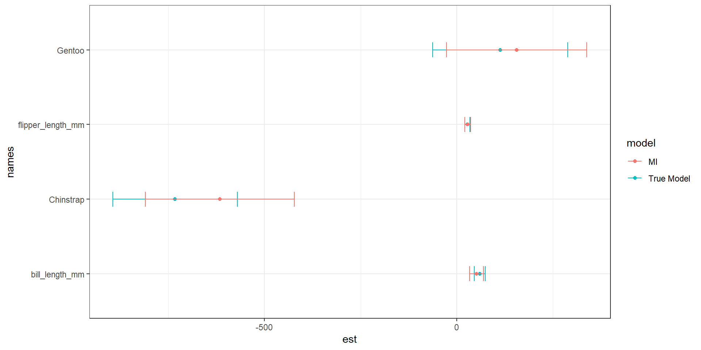

<table>
 <thead>
  <tr>
   <th style="text-align:left;"> names </th>
   <th style="text-align:right;"> True Model </th>
   <th style="text-align:right;"> MI </th>
   <th style="text-align:right;"> bias </th>
  </tr>
 </thead>
<tbody>
  <tr>
   <td style="text-align:left;"> bill_length_mm </td>
   <td style="text-align:right;"> 60.11732 </td>
   <td style="text-align:right;"> 51.61565 </td>
   <td style="text-align:right;"> -8.501672 </td>
  </tr>
  <tr>
   <td style="text-align:left;"> flipper_length_mm </td>
   <td style="text-align:right;"> 27.54429 </td>
   <td style="text-align:right;"> 28.67977 </td>
   <td style="text-align:right;"> 1.135481 </td>
  </tr>
  <tr>
   <td style="text-align:left;"> Chinstrap </td>
   <td style="text-align:right;"> -732.41667 </td>
   <td style="text-align:right;"> -615.76862 </td>
   <td style="text-align:right;"> 116.648049 </td>
  </tr>
  <tr>
   <td style="text-align:left;"> Gentoo </td>
   <td style="text-align:right;"> 113.25418 </td>
   <td style="text-align:right;"> 155.61083 </td>
   <td style="text-align:right;"> 42.356655 </td>
  </tr>
</tbody>
</table>


MI over estimates the difference in body mass between Chinstrap and Adelie, but underestiamtes that difference for Gentoo. There is also an underestimation of the relationship between bill length and body mass. 


## Post MICE data management

Sometimes you'll have a need to do additional data management after imputation has been completed. Creating binary indicators of an event, re-creating scale variables etc. The general approach is to transform the imputed data into long format using `complete` **with the argument `include=TRUE`** , do the necessary data management, and then convert it back to a `mids` object type. 

Continuing with the penguin example, let's create a new variable that is the ratio of bill length to depth.

Recapping prior steps of imputing, and then creating the completed long data set. 


```r
## imp_pen <- mice(pen.miss, m=10, maxit=25, meth="pmm", seed=500, printFlag=FALSE)
pen_long <- complete(imp_pen, 'long', include=TRUE)
```

We create the new ratio variable on the long data: 

```r
pen_long$ratio <- pen_long$bill_length_mm / pen_long$bill_depth_mm
```

Let's visualize this to see how different the distributions are across imputation. Notice imputation "0" still has missing data - this is a result of using `include = TRUE` and keeping the original data as part of the `pen_long` data. 

```r
ggboxplot(pen_long, y="ratio", x="species", facet.by = ".imp")
```

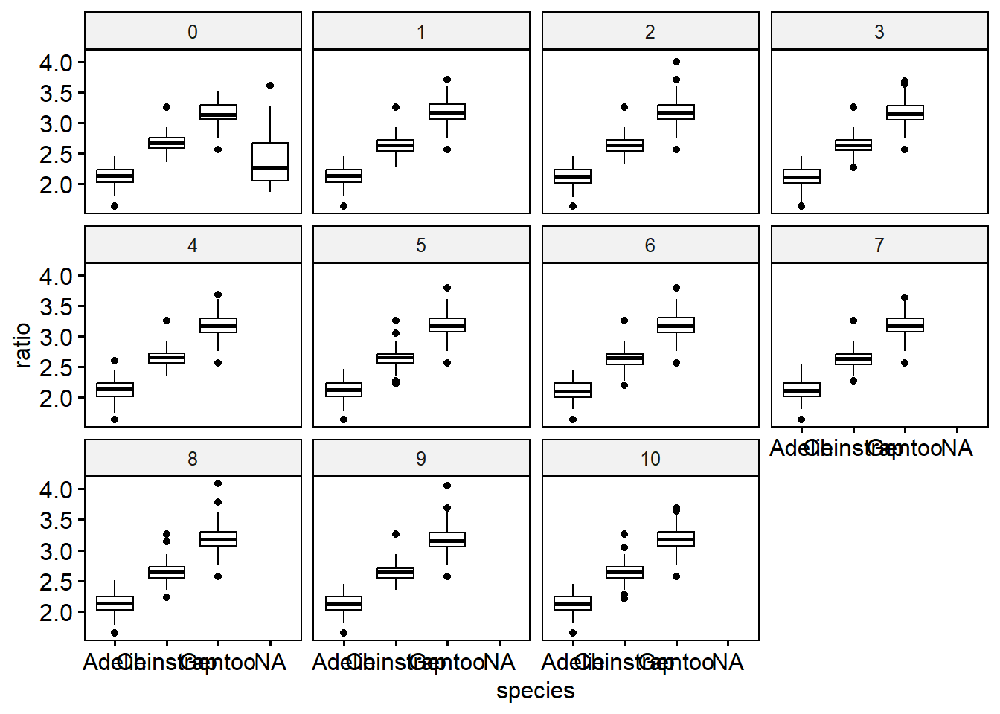

Then convert the data back to `mids` object, specifying the variable name that identifies the imputation number. 


```r
imp_pen1 <- as.mids(pen_long, .imp = ".imp")
```

Now we can conduct analyses such as an ANOVA (in linear model form) to see if this ratio differs significantly across the species. 


```r
nova.ratio <- with(imp_pen1, lm(ratio ~ species))
pool(nova.ratio) |> summary()
##               term  estimate  std.error statistic       df       p.value
## 1      (Intercept) 2.1221949 0.01435687 147.81738 281.7994 4.610006e-269
## 2 speciesChinstrap 0.5217842 0.02569344  20.30807 245.0315  1.958440e-54
## 3    speciesGentoo 1.0643029 0.02165568  49.14659 254.5258 6.526634e-132
```


## Final thoughts


> "In our experience with real and artificial data..., the practical conclusion appears to be that multiple imputation, when carefully done, can be safely used with real problems even when the ultimate user may be applying models or analyses not contemplated by the imputer." - Little & Rubin (Book, p. 218)


* Don't ignore missing data. 
* Impute sensibly and multiple times. 
* It's typically desirable to include many predictors in an imputation model, both to 
    - improve precision of imputed values
    - make MAR assumption more plausible
* But the number of covariance parameters goes up as the square of the number of variables in the model,
  - implying practical limits on the number of variables for which parameters can be estimated well 
* MI applies to subjects who have a general missingness pattern, i.e., they have measurements on some variables, but not on others. 
* But, subjects can be lost to follow up due to death or other reasons (i.e., attrition). 
* Here we have only baseline data, but not the outcome or other follow up data. 
* If attrition subjects are eliminated from the sample, they can produce non-response or attrition bias. 
* Use attrition weights.
    - Given a baseline profile, predict the probability that subject will 
      stay and use the inverse probability as weight. 
    - e.g., if for a given profile all subjects stay, then the predicted probability
      is 1 and the attrition weight is 1. Such a subject "counts once". 
    - For another profile, the probability may be 0.5, attrition weight is 
      1/.5 = 2 and that person "counts twice". 
* For differential drop-out, or self-selected treatment, you can consider using Propensity Scores.


## Additional References

* Little, R. and Rubin, D. Statistical Analysis with Missing Data, 2nd Ed., Wiley, 2002
    - Standard reference
    - Requires some math
* Allison, P. Missing Data, Sage, 2001
    - Small and cheap
    - Requires very little math
* Multiple Imputation.com http://www.stefvanbuuren.nl/mi/

* Applied Missing Data Analysis with SPSS and (R) Studio https://bookdown.org/mwheymans/Book_MI/
* http://www.analyticsvidhya.com/blog/2016/03/tutorial-powerful-packages-imputing-missing-values/ 
* http://www.r-bloggers.com/imputing-missing-data-with-r-mice-package/


Imputation methods for complex survey data and data not missing at random is an open research topic. Read more about this here: https://support.sas.com/documentation/cdl/en/statug/63033/HTML/default/viewer.htm#statug_mi_sect032.htm 


https://shirinsplayground.netlify.com/2017/11/mice_sketchnotes/


