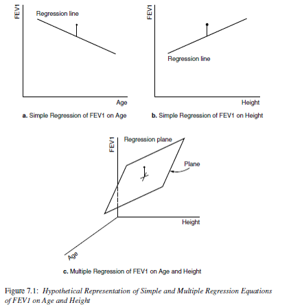
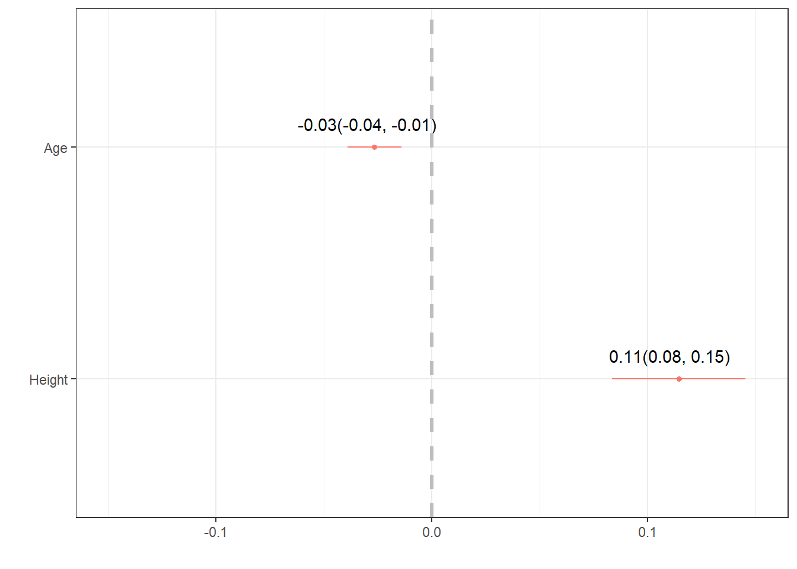
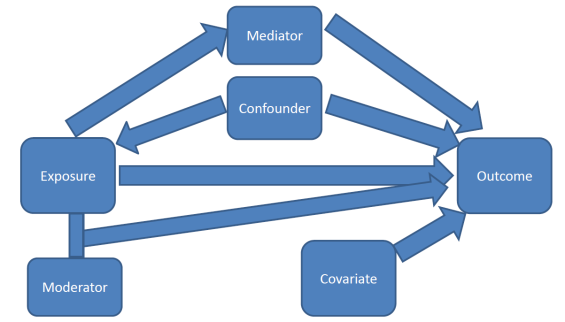

# Multiple Linear Regression {#mlr}

Hopefully by now you have some motivation for why we need to have a robust model that can incorporate information from multiple variables at the same time. Multiple linear regression is our tool to expand our MODEL to better fit the DATA. 

* Extends simple linear regression.
* Describes a linear relationship between a single continuous $Y$ variable, and several $X$ variables.
* Predicts $Y$ from $X_{1}, X_{2}, \ldots , X_{P}$.
* X's can be continuous or discrete (categorical)
* X's can be transformations of other X's, e.g., $log(x), x^{2}$. 


Now it's no longer a 2D regression _line_, but a $p$ dimensional regression plane. 



\BeginKnitrBlock{rmdnote}<div class="rmdnote">This section uses functions from the `dotwhisker` and `gtsummary` visualize results from multiple regression models. </div>\EndKnitrBlock{rmdnote}


## Mathematical Model

The mathematical model for multiple linear regression equates the value of the continuous outcome $y_{i}$ to a **linear combination** of multiple predictors $x_{1} \ldots x_{p}$ each with their own slope coefficient $\beta_{1} \ldots \beta_{p}$. 

$$ y_{i} = \beta_{0} + \beta_{1}x_{1i} + \ldots + \beta_{p}x_{pi} + \epsilon_{i}$$

where $i$ indexes the observations $i = 1 \ldots n$, and $j$ indexes the number of parameters $j=1 \ldots p$. This linear combination is often written using _summation notation_: $\sum_{i=1}^{p}X_{ij}\beta_{j}$. 

The assumptions on the residuals $\epsilon_{i}$ still hold:   

* They have mean zero  
* They are homoscedastic, that is all have the same finite variance: $Var(\epsilon_{i})=\sigma^{2}<\infty$  
* Distinct error terms are uncorrelated: (Independent) $\text{Cov}(\epsilon_{i},\epsilon_{j})=0,\forall i\neq j.$  


In matrix notation the linear combination of $X$'s and $\beta$'s is written as $\mathbf{x}_{i}^{'}\mathbf{\beta}$, (the inner product between the vectors $\mathbf{x}_{i}$ and $\mathbf{\beta}$). Then the model is written as: 

$$ \textbf{y} = \textbf{X} \mathbf{\beta} + \mathbf{\epsilon} ,$$ 

and we say the regression model relates $y$ to a function of $\textbf{X}$ and $\mathbf{\beta}$, where $\textbf{X}$ is a $nxp$ matrix of $p$ covariates on $n$ observations and $\mathbf{\beta}$ is a length $p$ vector of regression coefficients.

_Note: Knowledge of Matricies or Linear Algebra is not required to conduct or understand multiple regression, but it is foundational and essential for Statistics and Data Science majors to understand the theory behind linear models._

_Learners in other domains should attempt to understand matricies at a high level, as some of the places models can fail is due to problems doing math on matricies._

## Parameter Estimation

Recall the goal of regression analysis is to minimize the unexplained/residual error. That is, to minimize the difference between the value of the dependent variable predicted by the model and the true value of the dependent variable.

$$ \hat{y_{i}} - y_{i}, $$

where the predicted values $\hat{y}_{i}$ are calculated as 

$$\hat{y}_{i}  = \sum_{i=1}^{p}X_{ij}\beta_{j}$$

The sum of the squared residual errors (the distance between the observed point $y_{i}$ and the fitted value) now has the following form: 

$$ \sum_{i=1}^{n} |y_{i} - \sum_{i=1}^{p}X_{ij}\beta_{j}|^{2}$$

Or in matrix notation

$$ || \mathbf{Y} - \mathbf{X}\mathbf{\beta} ||^{2} $$ 

Solving this least squares problem for multiple regression requires knowledge of multivariable calculus and linear algebra, and so is left to a course in mathematical statistics. 

## Fitting the model

The analysis in example \@ref(slr-fev) concluded that FEV1 in fathers significantly increases by 0.12 (95% CI:0.09, 0.15) liters per additional inch in height (p<.0001). Looking at the multiple $R^{2}$ (correlation of determination), this simple model explains 25% of the variance seen in the outcome $y$. 

However, FEV tends to decrease with age for adults, so we should be able to predict it better if we use both height and age as independent variables in a multiple regression equation. 

\BeginKnitrBlock{rmdnote}<div class="rmdnote">What direction do you expect the slope coefficient for age to be? For height?</div>\EndKnitrBlock{rmdnote}

Fitting a regression model in R with more than 1 predictor is done by adding each variable to the right hand side of the model notation connected with a `+`. 


```r
lm(FFEV1 ~ FAGE + FHEIGHT, data=fev)
## 
## Call:
## lm(formula = FFEV1 ~ FAGE + FHEIGHT, data = fev)
## 
## Coefficients:
## (Intercept)         FAGE      FHEIGHT  
##    -2.76075     -0.02664      0.11440
```


## Interpreting Coefficients

Similar to simple linear regression, each $\beta_{j}$ coefficient is considered a slope. That is, the amount $Y$ will change for every 1 unit increase in $X_{j}$. In a multiple variable regression model, $\b_{j}$ is the estimated change in $Y$ _after controlling for other predictors in the model_. 

### Continuous predictors


```r
mlr.dad.model <- lm(FFEV1 ~ FAGE + FHEIGHT, data=fev)
summary(mlr.dad.model)
## 
## Call:
## lm(formula = FFEV1 ~ FAGE + FHEIGHT, data = fev)
## 
## Residuals:
##      Min       1Q   Median       3Q      Max 
## -1.34708 -0.34142  0.00917  0.37174  1.41853 
## 
## Coefficients:
##              Estimate Std. Error t value Pr(>|t|)    
## (Intercept) -2.760747   1.137746  -2.427   0.0165 *  
## FAGE        -0.026639   0.006369  -4.183 4.93e-05 ***
## FHEIGHT      0.114397   0.015789   7.245 2.25e-11 ***
## ---
## Signif. codes:  0 '***' 0.001 '**' 0.01 '*' 0.05 '.' 0.1 ' ' 1
## 
## Residual standard error: 0.5348 on 147 degrees of freedom
## Multiple R-squared:  0.3337,	Adjusted R-squared:  0.3247 
## F-statistic: 36.81 on 2 and 147 DF,  p-value: 1.094e-13
confint(mlr.dad.model)
##                   2.5 %      97.5 %
## (Intercept) -5.00919751 -0.51229620
## FAGE        -0.03922545 -0.01405323
## FHEIGHT      0.08319434  0.14559974
```

* Holding height constant, a father who is one year older is expected to have a FEV value 0.03 (0.01, 0.04) liters less than another man (p<.0001).
* Holding age constant, a father who is 1cm taller than another man is expected to have a FEV value of 0.11 (.08, 0.15) liter greater than the other man (p<.0001). 

For the model that includes age, the coefficient for height is now 0.11, which is interpreted as the rate of change of FEV1 as a function of height **after adjusting for age**. This is also called the **partial regression coefficient** of FEV1 on height after adjusting for age. 


### Binary predictors

Binary predictors (categorical variables with only 2 levels) get converted to a numeric _binary indicator_ variable which only has the values 0 and 1. Whichever level gets assigned to be 0 is called the _reference_ group or level. The regression estimate $b$ then is the effect of being in group ($x=1$) _compared to_ being in the reference ($x=0$) group.

Does gender also play a roll in FEV? Let's look at how gender may impact or change the relationship between FEV and either height or age. 

> Note, the `fev` data set is in _wide_ form right now, with different columns for mothers and fathers. First I need to reshape the data into _long_ format, so gender is it's own variable. 


```r
# a pivot_longer() probably would have worked here as well
fev_long <- data.frame(gender = c(fev$FSEX, fev$MSEX), 
                   fev1 = c(fev$FFEV1, fev$MFEV1), 
                   ht = c(fev$FHEIGHT, fev$MHEIGHT), 
                   age = c(fev$FAGE, fev$MAGE), 
                   area = c(fev$AREA, fev$AREA))
fev_long$gender <- factor(fev_long$gender, labels=c("M", "F"))
fev_long$area   <- factor(fev_long$area, labels=c("Burbank", "Lancaster", "Long Beach", "Glendora"))
```

So the model being fit looks like: 

$$ y_{i} = \beta_{0} + \beta_{1}x_{1i} + \beta_{2}x_{2i} +\beta_{3}x_{3i} + \epsilon_{i}$$

where 

* $x_{1}$: Age
* $x_{2}$: height
* $x_{3}$: 0 if Male, 1 if Female


```r
lm(fev1 ~ age + ht + gender, data=fev_long)
## 
## Call:
## lm(formula = fev1 ~ age + ht + gender, data = fev_long)
## 
## Coefficients:
## (Intercept)          age           ht      genderF  
##    -2.24051     -0.02354      0.10509     -0.63775
```

In this model gender is a binary categorical variable, with reference group "Male". This is detected because the variable that shows up in the regression model output is `genderF`. So the estimate shown is for males, compared to females. 

Note that I **DID NOT** have to convert the categorical variable `gender` to a binary numeric variable before fitting it into the model. R (and any other software program) will do this for you already. 


The regression equation for the model with gender is 

$$ y = -2.24 - 0.02 age + 0.11 height - 0.64genderF $$


* $b_{0}:$ For a male who is 0 years old and 0 cm tall, their FEV is -2.24L.
* $b_{1}:$ For every additional year older an individual is, their FEV1 decreases by 0.02L. 
* $b_{2}:$ For every additional cm taller an individual is, their FEV1 increases by 0.16L. 
* $b_{3}:$ Females have 0.64L lower FEV compared to males. 

**Note**: The interpretation of categorical variables still falls under the template language of "for every one unit increase in $X_{p}$, $Y$ changes by $b_{p}$". Here, $X_{3}=0$ for males, and 1 for females. So a 1 "unit" change is females _compared to_ males. 


### Categorical Predictors {#cat-predictors}

Let's continue to model the FEV for individuals living in Southern California, but now we also consider the effect of city they live in. For those unfamiliar with the region, these cities represent very different environmental profiles. 


```r
table(fev_long$area)
## 
##    Burbank  Lancaster Long Beach   Glendora 
##         48         98         38        116
```

Let's fit a model with `area`, notice again I do not do anything to the variable `area` itself aside from add it into the model. 

```r
lm(fev1 ~ age + ht + gender + area, data=fev_long) |> summary()
## 
## Call:
## lm(formula = fev1 ~ age + ht + gender + area, data = fev_long)
## 
## Residuals:
##      Min       1Q   Median       3Q      Max 
## -1.32809 -0.29573  0.00578  0.31588  1.37041 
## 
## Coefficients:
##                 Estimate Std. Error t value Pr(>|t|)    
## (Intercept)    -2.250564   0.752414  -2.991  0.00302 ** 
## age            -0.022801   0.004151  -5.493 8.59e-08 ***
## ht              0.103866   0.010555   9.841  < 2e-16 ***
## genderF        -0.642168   0.078400  -8.191 8.10e-15 ***
## areaLancaster   0.031549   0.084980   0.371  0.71072    
## areaLong Beach  0.061963   0.104057   0.595  0.55199    
## areaGlendora    0.121589   0.082097   1.481  0.13967    
## ---
## Signif. codes:  0 '***' 0.001 '**' 0.01 '*' 0.05 '.' 0.1 ' ' 1
## 
## Residual standard error: 0.4777 on 293 degrees of freedom
## Multiple R-squared:  0.6529,	Adjusted R-squared:  0.6458 
## F-statistic: 91.86 on 6 and 293 DF,  p-value: < 2.2e-16
```

Examine the coefficient names, `areaLancaster`, `areaLong Beach` and `areaGlendora`. Again R automatically take a categorical variable and turn it into a series of binary indicator variables where a 1 indicates if a person is from that area. Notice how someone from Burbank has 0's for all of the three indicator variables, someone from Lancaster only has a 1 in the `areaLancaster` variable and 0 otherwise. And etc for each other area.

<table>
 <thead>
  <tr>
   <th style="text-align:left;">   </th>
   <th style="text-align:right;"> areaLancaster </th>
   <th style="text-align:right;"> areaLong.Beach </th>
   <th style="text-align:right;"> areaGlendora </th>
   <th style="text-align:left;"> area </th>
  </tr>
 </thead>
<tbody>
  <tr>
   <td style="text-align:left;"> 1 </td>
   <td style="text-align:right;"> 0 </td>
   <td style="text-align:right;"> 0 </td>
   <td style="text-align:right;"> 0 </td>
   <td style="text-align:left;"> Burbank </td>
  </tr>
  <tr>
   <td style="text-align:left;"> 51 </td>
   <td style="text-align:right;"> 1 </td>
   <td style="text-align:right;"> 0 </td>
   <td style="text-align:right;"> 0 </td>
   <td style="text-align:left;"> Lancaster </td>
  </tr>
  <tr>
   <td style="text-align:left;"> 75 </td>
   <td style="text-align:right;"> 0 </td>
   <td style="text-align:right;"> 1 </td>
   <td style="text-align:right;"> 0 </td>
   <td style="text-align:left;"> Long Beach </td>
  </tr>
  <tr>
   <td style="text-align:left;"> 101 </td>
   <td style="text-align:right;"> 0 </td>
   <td style="text-align:right;"> 0 </td>
   <td style="text-align:right;"> 1 </td>
   <td style="text-align:left;"> Glendora </td>
  </tr>
</tbody>
</table>


* Most commonly known as "Dummy coding". Not an informative term to use. 
* Better used term: Indicator variable
* Math notation: **I(gender == "Female")**. 
* A.k.a "reference coding" or "one hot encoding"
* For a nominal X with K categories, define K indicator variables.
    - Choose a reference (referent) category:
    - Leave it out
    - Use remaining K-1 in the regression.
    - Often, the largest category is chosen as the reference category.

Interpreting the regression coefficients are going to be **compared to the reference group**. In this case, it is the Burbank area. Why Burbank? Because that is what R sees as the first level. If you want something different, you need to change the factor ordering. 


```r
levels(fev_long$area)
## [1] "Burbank"    "Lancaster"  "Long Beach" "Glendora"
```

The mathematical model is now written as follows, 

$$ Y_{i} = \beta_{0} + \beta_{1}x_{1i} + \beta_{2}x_{2i} +\beta_{3}x_{3i} + \beta_{4}x_{4i} + \beta_{5}x_{5i} +\beta_{6}x_{6i}\epsilon_{i}$$

where 

* $x_{1}$: Age
* $x_{2}$: height
* $x_{3}$: 0 if Male, 1 if Female
* $x_{4}$: 1 if living in Lancaster, 0 otherwise 
* $x_{5}$: 1 if living in Long Beach, 0 otherwise
* $x_{6}$: 1 if living in Glendora, 0 otherwise


For someone living in Burbank, $x_{4}=x_{5}=x_{6} =0$ so the model then is

$$Y_{i} = \beta_{0} + \beta_{1}x_{1i} + \beta_{2}x_{2i} +\beta_{3}x_{3i} + \epsilon_{i}$$

For someone living in Lancaster, $x_{4}=1, x_{5}=0, x_{6} =0$ so the model then is

$$ 
Y_{i} = \beta_{0} + \beta_{1}x_{1i} + \beta_{2}x_{2i} +\beta_{3}x_{3i} + \beta_{4}(1) \\
Y_{i} \sim (\beta_{0} + \beta_{4}) + \beta_{1}x_{i} + \beta_{2}x_{2i} +\beta_{3}x_{3i} \epsilon_{i}
$$

For someone living in Long Beach, $x_{4}=0, x_{5}=1, x_{6} =0$ so the model then is

$$ 
Y_{i} = \beta_{0} + \beta_{1}x_{1i} + \beta_{2}x_{2i} +\beta_{3}x_{3i} + \beta_{5}(1) \\
Y_{i} \sim (\beta_{0} + \beta_{5}) + \beta_{1}x_{i} + \beta_{2}x_{2i} +\beta_{3}x_{3i} \epsilon_{i}
$$


and the model for someone living in Glendora $x_{4}=0, x_{5}=0, x_{6} =1$ is

$$ 
Y_{i} = \beta_{0} + \beta_{1}x_{1i} + \beta_{2}x_{2i} +\beta_{3}x_{3i} + \beta_{6}(1) \\
Y_{i} \sim (\beta_{0} + \beta_{6}) + \beta_{1}x_{i} + \beta_{2}x_{2i} +\beta_{3}x_{3i} \epsilon_{i}
$$


In summary, each area gets it's own intercept, but still has a common slope for all other variables. 

$$
y_{i.Burbank} = -2.25 - 0.023(age) + 0.10(ht) -0.64(female) \\
y_{i.Lancaster} = -2.22 - 0.023(age) + 0.10(ht) -0.64(female)\\
y_{i.Long.Beach} = -2.19 - 0.023(age) + 0.10(ht) -0.64(female) \\
y_{i.Glendora} = -2.13 - 0.023(age) + 0.10(ht) -0.64(female) 
$$

Let's look interpret the regression coefficients and their 95% confidence intervals from the main effects model again. 


```r
lm(fev1 ~ age + ht + gender + area, data=fev_long) |> tbl_regression()
```


```{=html}
<div id="szjhozihim" style="padding-left:0px;padding-right:0px;padding-top:10px;padding-bottom:10px;overflow-x:auto;overflow-y:auto;width:auto;height:auto;">
<style>#szjhozihim table {
  font-family: system-ui, 'Segoe UI', Roboto, Helvetica, Arial, sans-serif, 'Apple Color Emoji', 'Segoe UI Emoji', 'Segoe UI Symbol', 'Noto Color Emoji';
  -webkit-font-smoothing: antialiased;
  -moz-osx-font-smoothing: grayscale;
}

#szjhozihim thead, #szjhozihim tbody, #szjhozihim tfoot, #szjhozihim tr, #szjhozihim td, #szjhozihim th {
  border-style: none;
}

#szjhozihim p {
  margin: 0;
  padding: 0;
}

#szjhozihim .gt_table {
  display: table;
  border-collapse: collapse;
  line-height: normal;
  margin-left: auto;
  margin-right: auto;
  color: #333333;
  font-size: 16px;
  font-weight: normal;
  font-style: normal;
  background-color: #FFFFFF;
  width: auto;
  border-top-style: solid;
  border-top-width: 2px;
  border-top-color: #A8A8A8;
  border-right-style: none;
  border-right-width: 2px;
  border-right-color: #D3D3D3;
  border-bottom-style: solid;
  border-bottom-width: 2px;
  border-bottom-color: #A8A8A8;
  border-left-style: none;
  border-left-width: 2px;
  border-left-color: #D3D3D3;
}

#szjhozihim .gt_caption {
  padding-top: 4px;
  padding-bottom: 4px;
}

#szjhozihim .gt_title {
  color: #333333;
  font-size: 125%;
  font-weight: initial;
  padding-top: 4px;
  padding-bottom: 4px;
  padding-left: 5px;
  padding-right: 5px;
  border-bottom-color: #FFFFFF;
  border-bottom-width: 0;
}

#szjhozihim .gt_subtitle {
  color: #333333;
  font-size: 85%;
  font-weight: initial;
  padding-top: 3px;
  padding-bottom: 5px;
  padding-left: 5px;
  padding-right: 5px;
  border-top-color: #FFFFFF;
  border-top-width: 0;
}

#szjhozihim .gt_heading {
  background-color: #FFFFFF;
  text-align: center;
  border-bottom-color: #FFFFFF;
  border-left-style: none;
  border-left-width: 1px;
  border-left-color: #D3D3D3;
  border-right-style: none;
  border-right-width: 1px;
  border-right-color: #D3D3D3;
}

#szjhozihim .gt_bottom_border {
  border-bottom-style: solid;
  border-bottom-width: 2px;
  border-bottom-color: #D3D3D3;
}

#szjhozihim .gt_col_headings {
  border-top-style: solid;
  border-top-width: 2px;
  border-top-color: #D3D3D3;
  border-bottom-style: solid;
  border-bottom-width: 2px;
  border-bottom-color: #D3D3D3;
  border-left-style: none;
  border-left-width: 1px;
  border-left-color: #D3D3D3;
  border-right-style: none;
  border-right-width: 1px;
  border-right-color: #D3D3D3;
}

#szjhozihim .gt_col_heading {
  color: #333333;
  background-color: #FFFFFF;
  font-size: 100%;
  font-weight: normal;
  text-transform: inherit;
  border-left-style: none;
  border-left-width: 1px;
  border-left-color: #D3D3D3;
  border-right-style: none;
  border-right-width: 1px;
  border-right-color: #D3D3D3;
  vertical-align: bottom;
  padding-top: 5px;
  padding-bottom: 6px;
  padding-left: 5px;
  padding-right: 5px;
  overflow-x: hidden;
}

#szjhozihim .gt_column_spanner_outer {
  color: #333333;
  background-color: #FFFFFF;
  font-size: 100%;
  font-weight: normal;
  text-transform: inherit;
  padding-top: 0;
  padding-bottom: 0;
  padding-left: 4px;
  padding-right: 4px;
}

#szjhozihim .gt_column_spanner_outer:first-child {
  padding-left: 0;
}

#szjhozihim .gt_column_spanner_outer:last-child {
  padding-right: 0;
}

#szjhozihim .gt_column_spanner {
  border-bottom-style: solid;
  border-bottom-width: 2px;
  border-bottom-color: #D3D3D3;
  vertical-align: bottom;
  padding-top: 5px;
  padding-bottom: 5px;
  overflow-x: hidden;
  display: inline-block;
  width: 100%;
}

#szjhozihim .gt_spanner_row {
  border-bottom-style: hidden;
}

#szjhozihim .gt_group_heading {
  padding-top: 8px;
  padding-bottom: 8px;
  padding-left: 5px;
  padding-right: 5px;
  color: #333333;
  background-color: #FFFFFF;
  font-size: 100%;
  font-weight: initial;
  text-transform: inherit;
  border-top-style: solid;
  border-top-width: 2px;
  border-top-color: #D3D3D3;
  border-bottom-style: solid;
  border-bottom-width: 2px;
  border-bottom-color: #D3D3D3;
  border-left-style: none;
  border-left-width: 1px;
  border-left-color: #D3D3D3;
  border-right-style: none;
  border-right-width: 1px;
  border-right-color: #D3D3D3;
  vertical-align: middle;
  text-align: left;
}

#szjhozihim .gt_empty_group_heading {
  padding: 0.5px;
  color: #333333;
  background-color: #FFFFFF;
  font-size: 100%;
  font-weight: initial;
  border-top-style: solid;
  border-top-width: 2px;
  border-top-color: #D3D3D3;
  border-bottom-style: solid;
  border-bottom-width: 2px;
  border-bottom-color: #D3D3D3;
  vertical-align: middle;
}

#szjhozihim .gt_from_md > :first-child {
  margin-top: 0;
}

#szjhozihim .gt_from_md > :last-child {
  margin-bottom: 0;
}

#szjhozihim .gt_row {
  padding-top: 8px;
  padding-bottom: 8px;
  padding-left: 5px;
  padding-right: 5px;
  margin: 10px;
  border-top-style: solid;
  border-top-width: 1px;
  border-top-color: #D3D3D3;
  border-left-style: none;
  border-left-width: 1px;
  border-left-color: #D3D3D3;
  border-right-style: none;
  border-right-width: 1px;
  border-right-color: #D3D3D3;
  vertical-align: middle;
  overflow-x: hidden;
}

#szjhozihim .gt_stub {
  color: #333333;
  background-color: #FFFFFF;
  font-size: 100%;
  font-weight: initial;
  text-transform: inherit;
  border-right-style: solid;
  border-right-width: 2px;
  border-right-color: #D3D3D3;
  padding-left: 5px;
  padding-right: 5px;
}

#szjhozihim .gt_stub_row_group {
  color: #333333;
  background-color: #FFFFFF;
  font-size: 100%;
  font-weight: initial;
  text-transform: inherit;
  border-right-style: solid;
  border-right-width: 2px;
  border-right-color: #D3D3D3;
  padding-left: 5px;
  padding-right: 5px;
  vertical-align: top;
}

#szjhozihim .gt_row_group_first td {
  border-top-width: 2px;
}

#szjhozihim .gt_row_group_first th {
  border-top-width: 2px;
}

#szjhozihim .gt_summary_row {
  color: #333333;
  background-color: #FFFFFF;
  text-transform: inherit;
  padding-top: 8px;
  padding-bottom: 8px;
  padding-left: 5px;
  padding-right: 5px;
}

#szjhozihim .gt_first_summary_row {
  border-top-style: solid;
  border-top-color: #D3D3D3;
}

#szjhozihim .gt_first_summary_row.thick {
  border-top-width: 2px;
}

#szjhozihim .gt_last_summary_row {
  padding-top: 8px;
  padding-bottom: 8px;
  padding-left: 5px;
  padding-right: 5px;
  border-bottom-style: solid;
  border-bottom-width: 2px;
  border-bottom-color: #D3D3D3;
}

#szjhozihim .gt_grand_summary_row {
  color: #333333;
  background-color: #FFFFFF;
  text-transform: inherit;
  padding-top: 8px;
  padding-bottom: 8px;
  padding-left: 5px;
  padding-right: 5px;
}

#szjhozihim .gt_first_grand_summary_row {
  padding-top: 8px;
  padding-bottom: 8px;
  padding-left: 5px;
  padding-right: 5px;
  border-top-style: double;
  border-top-width: 6px;
  border-top-color: #D3D3D3;
}

#szjhozihim .gt_last_grand_summary_row_top {
  padding-top: 8px;
  padding-bottom: 8px;
  padding-left: 5px;
  padding-right: 5px;
  border-bottom-style: double;
  border-bottom-width: 6px;
  border-bottom-color: #D3D3D3;
}

#szjhozihim .gt_striped {
  background-color: rgba(128, 128, 128, 0.05);
}

#szjhozihim .gt_table_body {
  border-top-style: solid;
  border-top-width: 2px;
  border-top-color: #D3D3D3;
  border-bottom-style: solid;
  border-bottom-width: 2px;
  border-bottom-color: #D3D3D3;
}

#szjhozihim .gt_footnotes {
  color: #333333;
  background-color: #FFFFFF;
  border-bottom-style: none;
  border-bottom-width: 2px;
  border-bottom-color: #D3D3D3;
  border-left-style: none;
  border-left-width: 2px;
  border-left-color: #D3D3D3;
  border-right-style: none;
  border-right-width: 2px;
  border-right-color: #D3D3D3;
}

#szjhozihim .gt_footnote {
  margin: 0px;
  font-size: 90%;
  padding-top: 4px;
  padding-bottom: 4px;
  padding-left: 5px;
  padding-right: 5px;
}

#szjhozihim .gt_sourcenotes {
  color: #333333;
  background-color: #FFFFFF;
  border-bottom-style: none;
  border-bottom-width: 2px;
  border-bottom-color: #D3D3D3;
  border-left-style: none;
  border-left-width: 2px;
  border-left-color: #D3D3D3;
  border-right-style: none;
  border-right-width: 2px;
  border-right-color: #D3D3D3;
}

#szjhozihim .gt_sourcenote {
  font-size: 90%;
  padding-top: 4px;
  padding-bottom: 4px;
  padding-left: 5px;
  padding-right: 5px;
}

#szjhozihim .gt_left {
  text-align: left;
}

#szjhozihim .gt_center {
  text-align: center;
}

#szjhozihim .gt_right {
  text-align: right;
  font-variant-numeric: tabular-nums;
}

#szjhozihim .gt_font_normal {
  font-weight: normal;
}

#szjhozihim .gt_font_bold {
  font-weight: bold;
}

#szjhozihim .gt_font_italic {
  font-style: italic;
}

#szjhozihim .gt_super {
  font-size: 65%;
}

#szjhozihim .gt_footnote_marks {
  font-size: 75%;
  vertical-align: 0.4em;
  position: initial;
}

#szjhozihim .gt_asterisk {
  font-size: 100%;
  vertical-align: 0;
}

#szjhozihim .gt_indent_1 {
  text-indent: 5px;
}

#szjhozihim .gt_indent_2 {
  text-indent: 10px;
}

#szjhozihim .gt_indent_3 {
  text-indent: 15px;
}

#szjhozihim .gt_indent_4 {
  text-indent: 20px;
}

#szjhozihim .gt_indent_5 {
  text-indent: 25px;
}
</style>
<table class="gt_table" data-quarto-disable-processing="false" data-quarto-bootstrap="false">
  <thead>
    
    <tr class="gt_col_headings">
      <th class="gt_col_heading gt_columns_bottom_border gt_left" rowspan="1" colspan="1" scope="col" id="&lt;strong&gt;Characteristic&lt;/strong&gt;"><strong>Characteristic</strong></th>
      <th class="gt_col_heading gt_columns_bottom_border gt_center" rowspan="1" colspan="1" scope="col" id="&lt;strong&gt;Beta&lt;/strong&gt;"><strong>Beta</strong></th>
      <th class="gt_col_heading gt_columns_bottom_border gt_center" rowspan="1" colspan="1" scope="col" id="&lt;strong&gt;95% CI&lt;/strong&gt;&lt;span class=&quot;gt_footnote_marks&quot; style=&quot;white-space:nowrap;font-style:italic;font-weight:normal;&quot;&gt;&lt;sup&gt;1&lt;/sup&gt;&lt;/span&gt;"><strong>95% CI</strong><span class="gt_footnote_marks" style="white-space:nowrap;font-style:italic;font-weight:normal;"><sup>1</sup></span></th>
      <th class="gt_col_heading gt_columns_bottom_border gt_center" rowspan="1" colspan="1" scope="col" id="&lt;strong&gt;p-value&lt;/strong&gt;"><strong>p-value</strong></th>
    </tr>
  </thead>
  <tbody class="gt_table_body">
    <tr><td headers="label" class="gt_row gt_left">age</td>
<td headers="estimate" class="gt_row gt_center">-0.02</td>
<td headers="ci" class="gt_row gt_center">-0.03, -0.01</td>
<td headers="p.value" class="gt_row gt_center"><0.001</td></tr>
    <tr><td headers="label" class="gt_row gt_left">ht</td>
<td headers="estimate" class="gt_row gt_center">0.10</td>
<td headers="ci" class="gt_row gt_center">0.08, 0.12</td>
<td headers="p.value" class="gt_row gt_center"><0.001</td></tr>
    <tr><td headers="label" class="gt_row gt_left">gender</td>
<td headers="estimate" class="gt_row gt_center"></td>
<td headers="ci" class="gt_row gt_center"></td>
<td headers="p.value" class="gt_row gt_center"></td></tr>
    <tr><td headers="label" class="gt_row gt_left">    M</td>
<td headers="estimate" class="gt_row gt_center">—</td>
<td headers="ci" class="gt_row gt_center">—</td>
<td headers="p.value" class="gt_row gt_center"></td></tr>
    <tr><td headers="label" class="gt_row gt_left">    F</td>
<td headers="estimate" class="gt_row gt_center">-0.64</td>
<td headers="ci" class="gt_row gt_center">-0.80, -0.49</td>
<td headers="p.value" class="gt_row gt_center"><0.001</td></tr>
    <tr><td headers="label" class="gt_row gt_left">area</td>
<td headers="estimate" class="gt_row gt_center"></td>
<td headers="ci" class="gt_row gt_center"></td>
<td headers="p.value" class="gt_row gt_center"></td></tr>
    <tr><td headers="label" class="gt_row gt_left">    Burbank</td>
<td headers="estimate" class="gt_row gt_center">—</td>
<td headers="ci" class="gt_row gt_center">—</td>
<td headers="p.value" class="gt_row gt_center"></td></tr>
    <tr><td headers="label" class="gt_row gt_left">    Lancaster</td>
<td headers="estimate" class="gt_row gt_center">0.03</td>
<td headers="ci" class="gt_row gt_center">-0.14, 0.20</td>
<td headers="p.value" class="gt_row gt_center">0.7</td></tr>
    <tr><td headers="label" class="gt_row gt_left">    Long Beach</td>
<td headers="estimate" class="gt_row gt_center">0.06</td>
<td headers="ci" class="gt_row gt_center">-0.14, 0.27</td>
<td headers="p.value" class="gt_row gt_center">0.6</td></tr>
    <tr><td headers="label" class="gt_row gt_left">    Glendora</td>
<td headers="estimate" class="gt_row gt_center">0.12</td>
<td headers="ci" class="gt_row gt_center">-0.04, 0.28</td>
<td headers="p.value" class="gt_row gt_center">0.14</td></tr>
  </tbody>
  
  <tfoot class="gt_footnotes">
    <tr>
      <td class="gt_footnote" colspan="4"><span class="gt_footnote_marks" style="white-space:nowrap;font-style:italic;font-weight:normal;"><sup>1</sup></span> CI = Confidence Interval</td>
    </tr>
  </tfoot>
</table>
</div>
```


* $b_{4}$: After controlling for age, height and gender, those that live in Lancaster have 0.03 (-0.14, 0.20) higher FEV1 compared to someone living in Burbank (p=0.7). 
* $b_{5}$: After controlling for age, height and gender, those that live in Long Beach have 0.06 (-0.14, 0.27) higher FEV1 compared to someone living in Burbank (p=0.6). 
* $b_{6}$: After controlling for age, height and gender, those that live in Glendora have 0.12 (-0.04, 0.28) higher FEV1 compared to someone living in Burbank (p=0.14). 

> Beta coefficients for categorical variables are always interpreted as the difference between that particular level and the reference group


## Presenting results
The direct software output always tells you more information than what you are wanting to share with an audience. Here are some ways to "prettify" your regression output. 


* Using `tidy` and `kable` 

```r
library(broom)
tidy(mlr.dad.model) |> kable(digits=3)
```

<table>
 <thead>
  <tr>
   <th style="text-align:left;"> term </th>
   <th style="text-align:right;"> estimate </th>
   <th style="text-align:right;"> std.error </th>
   <th style="text-align:right;"> statistic </th>
   <th style="text-align:right;"> p.value </th>
  </tr>
 </thead>
<tbody>
  <tr>
   <td style="text-align:left;"> (Intercept) </td>
   <td style="text-align:right;"> -2.761 </td>
   <td style="text-align:right;"> 1.138 </td>
   <td style="text-align:right;"> -2.427 </td>
   <td style="text-align:right;"> 0.016 </td>
  </tr>
  <tr>
   <td style="text-align:left;"> FAGE </td>
   <td style="text-align:right;"> -0.027 </td>
   <td style="text-align:right;"> 0.006 </td>
   <td style="text-align:right;"> -4.183 </td>
   <td style="text-align:right;"> 0.000 </td>
  </tr>
  <tr>
   <td style="text-align:left;"> FHEIGHT </td>
   <td style="text-align:right;"> 0.114 </td>
   <td style="text-align:right;"> 0.016 </td>
   <td style="text-align:right;"> 7.245 </td>
   <td style="text-align:right;"> 0.000 </td>
  </tr>
</tbody>
</table>


* Using [`gtsummary`](https://www.danieldsjoberg.com/gtsummary/)

```r
library(gtsummary)
tbl_regression(mlr.dad.model)
```


```{=html}
<div id="jzkjinfvhe" style="padding-left:0px;padding-right:0px;padding-top:10px;padding-bottom:10px;overflow-x:auto;overflow-y:auto;width:auto;height:auto;">
<style>#jzkjinfvhe table {
  font-family: system-ui, 'Segoe UI', Roboto, Helvetica, Arial, sans-serif, 'Apple Color Emoji', 'Segoe UI Emoji', 'Segoe UI Symbol', 'Noto Color Emoji';
  -webkit-font-smoothing: antialiased;
  -moz-osx-font-smoothing: grayscale;
}

#jzkjinfvhe thead, #jzkjinfvhe tbody, #jzkjinfvhe tfoot, #jzkjinfvhe tr, #jzkjinfvhe td, #jzkjinfvhe th {
  border-style: none;
}

#jzkjinfvhe p {
  margin: 0;
  padding: 0;
}

#jzkjinfvhe .gt_table {
  display: table;
  border-collapse: collapse;
  line-height: normal;
  margin-left: auto;
  margin-right: auto;
  color: #333333;
  font-size: 16px;
  font-weight: normal;
  font-style: normal;
  background-color: #FFFFFF;
  width: auto;
  border-top-style: solid;
  border-top-width: 2px;
  border-top-color: #A8A8A8;
  border-right-style: none;
  border-right-width: 2px;
  border-right-color: #D3D3D3;
  border-bottom-style: solid;
  border-bottom-width: 2px;
  border-bottom-color: #A8A8A8;
  border-left-style: none;
  border-left-width: 2px;
  border-left-color: #D3D3D3;
}

#jzkjinfvhe .gt_caption {
  padding-top: 4px;
  padding-bottom: 4px;
}

#jzkjinfvhe .gt_title {
  color: #333333;
  font-size: 125%;
  font-weight: initial;
  padding-top: 4px;
  padding-bottom: 4px;
  padding-left: 5px;
  padding-right: 5px;
  border-bottom-color: #FFFFFF;
  border-bottom-width: 0;
}

#jzkjinfvhe .gt_subtitle {
  color: #333333;
  font-size: 85%;
  font-weight: initial;
  padding-top: 3px;
  padding-bottom: 5px;
  padding-left: 5px;
  padding-right: 5px;
  border-top-color: #FFFFFF;
  border-top-width: 0;
}

#jzkjinfvhe .gt_heading {
  background-color: #FFFFFF;
  text-align: center;
  border-bottom-color: #FFFFFF;
  border-left-style: none;
  border-left-width: 1px;
  border-left-color: #D3D3D3;
  border-right-style: none;
  border-right-width: 1px;
  border-right-color: #D3D3D3;
}

#jzkjinfvhe .gt_bottom_border {
  border-bottom-style: solid;
  border-bottom-width: 2px;
  border-bottom-color: #D3D3D3;
}

#jzkjinfvhe .gt_col_headings {
  border-top-style: solid;
  border-top-width: 2px;
  border-top-color: #D3D3D3;
  border-bottom-style: solid;
  border-bottom-width: 2px;
  border-bottom-color: #D3D3D3;
  border-left-style: none;
  border-left-width: 1px;
  border-left-color: #D3D3D3;
  border-right-style: none;
  border-right-width: 1px;
  border-right-color: #D3D3D3;
}

#jzkjinfvhe .gt_col_heading {
  color: #333333;
  background-color: #FFFFFF;
  font-size: 100%;
  font-weight: normal;
  text-transform: inherit;
  border-left-style: none;
  border-left-width: 1px;
  border-left-color: #D3D3D3;
  border-right-style: none;
  border-right-width: 1px;
  border-right-color: #D3D3D3;
  vertical-align: bottom;
  padding-top: 5px;
  padding-bottom: 6px;
  padding-left: 5px;
  padding-right: 5px;
  overflow-x: hidden;
}

#jzkjinfvhe .gt_column_spanner_outer {
  color: #333333;
  background-color: #FFFFFF;
  font-size: 100%;
  font-weight: normal;
  text-transform: inherit;
  padding-top: 0;
  padding-bottom: 0;
  padding-left: 4px;
  padding-right: 4px;
}

#jzkjinfvhe .gt_column_spanner_outer:first-child {
  padding-left: 0;
}

#jzkjinfvhe .gt_column_spanner_outer:last-child {
  padding-right: 0;
}

#jzkjinfvhe .gt_column_spanner {
  border-bottom-style: solid;
  border-bottom-width: 2px;
  border-bottom-color: #D3D3D3;
  vertical-align: bottom;
  padding-top: 5px;
  padding-bottom: 5px;
  overflow-x: hidden;
  display: inline-block;
  width: 100%;
}

#jzkjinfvhe .gt_spanner_row {
  border-bottom-style: hidden;
}

#jzkjinfvhe .gt_group_heading {
  padding-top: 8px;
  padding-bottom: 8px;
  padding-left: 5px;
  padding-right: 5px;
  color: #333333;
  background-color: #FFFFFF;
  font-size: 100%;
  font-weight: initial;
  text-transform: inherit;
  border-top-style: solid;
  border-top-width: 2px;
  border-top-color: #D3D3D3;
  border-bottom-style: solid;
  border-bottom-width: 2px;
  border-bottom-color: #D3D3D3;
  border-left-style: none;
  border-left-width: 1px;
  border-left-color: #D3D3D3;
  border-right-style: none;
  border-right-width: 1px;
  border-right-color: #D3D3D3;
  vertical-align: middle;
  text-align: left;
}

#jzkjinfvhe .gt_empty_group_heading {
  padding: 0.5px;
  color: #333333;
  background-color: #FFFFFF;
  font-size: 100%;
  font-weight: initial;
  border-top-style: solid;
  border-top-width: 2px;
  border-top-color: #D3D3D3;
  border-bottom-style: solid;
  border-bottom-width: 2px;
  border-bottom-color: #D3D3D3;
  vertical-align: middle;
}

#jzkjinfvhe .gt_from_md > :first-child {
  margin-top: 0;
}

#jzkjinfvhe .gt_from_md > :last-child {
  margin-bottom: 0;
}

#jzkjinfvhe .gt_row {
  padding-top: 8px;
  padding-bottom: 8px;
  padding-left: 5px;
  padding-right: 5px;
  margin: 10px;
  border-top-style: solid;
  border-top-width: 1px;
  border-top-color: #D3D3D3;
  border-left-style: none;
  border-left-width: 1px;
  border-left-color: #D3D3D3;
  border-right-style: none;
  border-right-width: 1px;
  border-right-color: #D3D3D3;
  vertical-align: middle;
  overflow-x: hidden;
}

#jzkjinfvhe .gt_stub {
  color: #333333;
  background-color: #FFFFFF;
  font-size: 100%;
  font-weight: initial;
  text-transform: inherit;
  border-right-style: solid;
  border-right-width: 2px;
  border-right-color: #D3D3D3;
  padding-left: 5px;
  padding-right: 5px;
}

#jzkjinfvhe .gt_stub_row_group {
  color: #333333;
  background-color: #FFFFFF;
  font-size: 100%;
  font-weight: initial;
  text-transform: inherit;
  border-right-style: solid;
  border-right-width: 2px;
  border-right-color: #D3D3D3;
  padding-left: 5px;
  padding-right: 5px;
  vertical-align: top;
}

#jzkjinfvhe .gt_row_group_first td {
  border-top-width: 2px;
}

#jzkjinfvhe .gt_row_group_first th {
  border-top-width: 2px;
}

#jzkjinfvhe .gt_summary_row {
  color: #333333;
  background-color: #FFFFFF;
  text-transform: inherit;
  padding-top: 8px;
  padding-bottom: 8px;
  padding-left: 5px;
  padding-right: 5px;
}

#jzkjinfvhe .gt_first_summary_row {
  border-top-style: solid;
  border-top-color: #D3D3D3;
}

#jzkjinfvhe .gt_first_summary_row.thick {
  border-top-width: 2px;
}

#jzkjinfvhe .gt_last_summary_row {
  padding-top: 8px;
  padding-bottom: 8px;
  padding-left: 5px;
  padding-right: 5px;
  border-bottom-style: solid;
  border-bottom-width: 2px;
  border-bottom-color: #D3D3D3;
}

#jzkjinfvhe .gt_grand_summary_row {
  color: #333333;
  background-color: #FFFFFF;
  text-transform: inherit;
  padding-top: 8px;
  padding-bottom: 8px;
  padding-left: 5px;
  padding-right: 5px;
}

#jzkjinfvhe .gt_first_grand_summary_row {
  padding-top: 8px;
  padding-bottom: 8px;
  padding-left: 5px;
  padding-right: 5px;
  border-top-style: double;
  border-top-width: 6px;
  border-top-color: #D3D3D3;
}

#jzkjinfvhe .gt_last_grand_summary_row_top {
  padding-top: 8px;
  padding-bottom: 8px;
  padding-left: 5px;
  padding-right: 5px;
  border-bottom-style: double;
  border-bottom-width: 6px;
  border-bottom-color: #D3D3D3;
}

#jzkjinfvhe .gt_striped {
  background-color: rgba(128, 128, 128, 0.05);
}

#jzkjinfvhe .gt_table_body {
  border-top-style: solid;
  border-top-width: 2px;
  border-top-color: #D3D3D3;
  border-bottom-style: solid;
  border-bottom-width: 2px;
  border-bottom-color: #D3D3D3;
}

#jzkjinfvhe .gt_footnotes {
  color: #333333;
  background-color: #FFFFFF;
  border-bottom-style: none;
  border-bottom-width: 2px;
  border-bottom-color: #D3D3D3;
  border-left-style: none;
  border-left-width: 2px;
  border-left-color: #D3D3D3;
  border-right-style: none;
  border-right-width: 2px;
  border-right-color: #D3D3D3;
}

#jzkjinfvhe .gt_footnote {
  margin: 0px;
  font-size: 90%;
  padding-top: 4px;
  padding-bottom: 4px;
  padding-left: 5px;
  padding-right: 5px;
}

#jzkjinfvhe .gt_sourcenotes {
  color: #333333;
  background-color: #FFFFFF;
  border-bottom-style: none;
  border-bottom-width: 2px;
  border-bottom-color: #D3D3D3;
  border-left-style: none;
  border-left-width: 2px;
  border-left-color: #D3D3D3;
  border-right-style: none;
  border-right-width: 2px;
  border-right-color: #D3D3D3;
}

#jzkjinfvhe .gt_sourcenote {
  font-size: 90%;
  padding-top: 4px;
  padding-bottom: 4px;
  padding-left: 5px;
  padding-right: 5px;
}

#jzkjinfvhe .gt_left {
  text-align: left;
}

#jzkjinfvhe .gt_center {
  text-align: center;
}

#jzkjinfvhe .gt_right {
  text-align: right;
  font-variant-numeric: tabular-nums;
}

#jzkjinfvhe .gt_font_normal {
  font-weight: normal;
}

#jzkjinfvhe .gt_font_bold {
  font-weight: bold;
}

#jzkjinfvhe .gt_font_italic {
  font-style: italic;
}

#jzkjinfvhe .gt_super {
  font-size: 65%;
}

#jzkjinfvhe .gt_footnote_marks {
  font-size: 75%;
  vertical-align: 0.4em;
  position: initial;
}

#jzkjinfvhe .gt_asterisk {
  font-size: 100%;
  vertical-align: 0;
}

#jzkjinfvhe .gt_indent_1 {
  text-indent: 5px;
}

#jzkjinfvhe .gt_indent_2 {
  text-indent: 10px;
}

#jzkjinfvhe .gt_indent_3 {
  text-indent: 15px;
}

#jzkjinfvhe .gt_indent_4 {
  text-indent: 20px;
}

#jzkjinfvhe .gt_indent_5 {
  text-indent: 25px;
}
</style>
<table class="gt_table" data-quarto-disable-processing="false" data-quarto-bootstrap="false">
  <thead>
    
    <tr class="gt_col_headings">
      <th class="gt_col_heading gt_columns_bottom_border gt_left" rowspan="1" colspan="1" scope="col" id="&lt;strong&gt;Characteristic&lt;/strong&gt;"><strong>Characteristic</strong></th>
      <th class="gt_col_heading gt_columns_bottom_border gt_center" rowspan="1" colspan="1" scope="col" id="&lt;strong&gt;Beta&lt;/strong&gt;"><strong>Beta</strong></th>
      <th class="gt_col_heading gt_columns_bottom_border gt_center" rowspan="1" colspan="1" scope="col" id="&lt;strong&gt;95% CI&lt;/strong&gt;&lt;span class=&quot;gt_footnote_marks&quot; style=&quot;white-space:nowrap;font-style:italic;font-weight:normal;&quot;&gt;&lt;sup&gt;1&lt;/sup&gt;&lt;/span&gt;"><strong>95% CI</strong><span class="gt_footnote_marks" style="white-space:nowrap;font-style:italic;font-weight:normal;"><sup>1</sup></span></th>
      <th class="gt_col_heading gt_columns_bottom_border gt_center" rowspan="1" colspan="1" scope="col" id="&lt;strong&gt;p-value&lt;/strong&gt;"><strong>p-value</strong></th>
    </tr>
  </thead>
  <tbody class="gt_table_body">
    <tr><td headers="label" class="gt_row gt_left">FAGE</td>
<td headers="estimate" class="gt_row gt_center">-0.03</td>
<td headers="ci" class="gt_row gt_center">-0.04, -0.01</td>
<td headers="p.value" class="gt_row gt_center"><0.001</td></tr>
    <tr><td headers="label" class="gt_row gt_left">FHEIGHT</td>
<td headers="estimate" class="gt_row gt_center">0.11</td>
<td headers="ci" class="gt_row gt_center">0.08, 0.15</td>
<td headers="p.value" class="gt_row gt_center"><0.001</td></tr>
  </tbody>
  
  <tfoot class="gt_footnotes">
    <tr>
      <td class="gt_footnote" colspan="4"><span class="gt_footnote_marks" style="white-space:nowrap;font-style:italic;font-weight:normal;"><sup>1</sup></span> CI = Confidence Interval</td>
    </tr>
  </tfoot>
</table>
</div>
```


* Using `dwplot` from the [`dotwhisker`](https://cran.r-project.org/web/packages/dotwhisker/vignettes/dotwhisker-vignette.html) package to create a _forest plot_. 


```r
library(dotwhisker)
dwplot(mlr.dad.model)
```


* Improvement on `dwplot` - extract the point estimate & CI into a data table, then add it as a `geom_text` layer. 


```r
text <- data.frame(                               # create a data frame
  estimate = coef(mlr.dad.model),                 # by extracting the coefficients,
  CI.low = confint(mlr.dad.model)[,1],            # with their lower
  CI.high = confint(mlr.dad.model)[,2]) %>%       # and upper confidence interval values
  round(2)                                        # round digits

# create the string for the label
text$label <- paste0(text$estimate, "(", text$CI.low, ", " , text$CI.high, ")")

text                                              # view the results to check for correctness
##             estimate CI.low CI.high               label
## (Intercept)    -2.76  -5.01   -0.51 -2.76(-5.01, -0.51)
## FAGE           -0.03  -0.04   -0.01 -0.03(-0.04, -0.01)
## FHEIGHT         0.11   0.08    0.15    0.11(0.08, 0.15)
text <- text[-1, ]                                # drop the intercept row

# ---- create plot ------
mlr.dad.model %>%                                  # start with a model
  tidy() %>%                                       # tidy up the output
  relabel_predictors("(Intercept)" = "Intercept",  # convert to sensible names
                     FAGE = "Age", 
                     FHEIGHT = "Height") %>% 
  filter(term != "Intercept") %>%                  # drop the intercept 
  dwplot() +                                       # create the ggplot 
  geom_text(aes(x=text$estimate, y = term,         # add the estimates and CI's
                label = text$label), 
            nudge_y = .1) +                        # move it up a smidge
  geom_vline(xintercept = 0, col = "grey",         # add a reference line at 0
             lty = "dashed", size=1.2) +           # make it dashed and a little larger
  scale_x_continuous(limits = c(-.15, .15))        # expand the x axis limits for readability
```




## Confounding 

One primary purpose of a multivariable model is to assess the relationship between a particular explanatory variable $x$ and your response variable $y$, _after controlling for other factors_. 




Credit: [A blog about statistical musings](https://significantlystatistical.wordpress.com/2014/12/12/confounders-mediators-moderators-and-covariates/)


\BeginKnitrBlock{rmdnote}<div class="rmdnote">Easy to read short article from a Gastroenterology journal on how to control confounding effects by statistical analysis. https://www.ncbi.nlm.nih.gov/pmc/articles/PMC4017459/</div>\EndKnitrBlock{rmdnote}

Other factors (characteristics/variables) could also be explaining part of the variability seen in $y$. 

> If the relationship between $x_{1}$ and $y$ is bivariately significant, but then no longer significant once $x_{2}$ has been added to the model, then $x_{2}$ is said to explain, or **confound**, the relationship between $x_{1}$ and $y$.

Steps to determine if a variable $x_{2}$ is a confounder. 

1. Fit a regression model on $y \sim x_{1}$. 
2. If $x_{1}$ is not significantly associated with $y$, STOP. Re-read the "IF" part of the definition of a confounder. 
3. Fit a regression model on $y \sim x_{1} + x_{2}$. 
4. Look at the p-value for $x_{1}$. One of two things will have happened. 
    - If $x_{1}$ is still significant, then $x_{2}$ does NOT confound (or explain) the relationship between $y$ and $x_{1}$. 
    - If $x_{1}$ is NO LONGER significantly associated with $y$, then $x_{2}$ IS a confounder. 
    

This means that the third variable is explaining the relationship between the explanatory variable and the response variable.
        
Note that this is a two way relationship. The order of $x_{1}$ and $x_{2}$ is invaraiant. If you were to add $x_{2}$ to the model before $x_{1}$ you may see the same thing occur. That is - both variables are explaining the same portion of the variance in $y$. 

<!---
### Example: Does smoking affect pulse rate? 

Prior studies have indicate that smoking is associated with high blood pressure. Is smoking also associated with your pulse rate? 


First we consider the bivariate relationship between pulse rate (`H4PR`) and cigarette smoking as measured by the quantity of cigarettes smoked each day during the past 30 days (`H4TO6`). 

```r
lm(H4PR ~ H4TO6 , data=addhealth) %>% summary()
## 
## Call:
## lm(formula = H4PR ~ H4TO6, data = addhealth)
## 
## Residuals:
##     Min      1Q  Median      3Q     Max 
## -30.826  -8.548  -0.687   7.258 120.841 
## 
## Coefficients:
##             Estimate Std. Error t value Pr(>|t|)    
## (Intercept)  73.7702     0.4953 148.936  < 2e-16 ***
## H4TO6         0.1389     0.0396   3.507 0.000464 ***
## ---
## Signif. codes:  0 '***' 0.001 '**' 0.01 '*' 0.05 '.' 0.1 ' ' 1
## 
## Residual standard error: 12.56 on 1761 degrees of freedom
##   (4741 observations deleted due to missingness)
## Multiple R-squared:  0.006936,	Adjusted R-squared:  0.006372 
## F-statistic:  12.3 on 1 and 1761 DF,  p-value: 0.0004644
```

As the number of cigarettes smoked each day increases by one, a persons pulse rate significantly increases by 0.13. 

However, there are more ways to assess the amount someone smokes. Consider a different measure of smoking, "during the past 30 days, on how many days did you smoke cigarettes?" (`H4TO5`). So here we are measuring the # of days smoked, not the # of cigarettes per day. If we include both in the model, we note that the earlier measure of smoking `H4TO6` is no longer significant (at the 0.05 level). 


```r
lm(H4PR ~ H4TO5 +  H4TO6 , data=addhealth) %>% summary()
## 
## Call:
## lm(formula = H4PR ~ H4TO5 + H4TO6, data = addhealth)
## 
## Residuals:
##     Min      1Q  Median      3Q     Max 
## -31.682  -8.509  -1.014   7.302 120.320 
## 
## Coefficients:
##             Estimate Std. Error t value Pr(>|t|)    
## (Intercept) 72.78932    0.68037 106.985   <2e-16 ***
## H4TO5        0.06870    0.03271   2.101   0.0358 *  
## H4TO6        0.08292    0.04769   1.739   0.0822 .  
## ---
## Signif. codes:  0 '***' 0.001 '**' 0.01 '*' 0.05 '.' 0.1 ' ' 1
## 
## Residual standard error: 12.55 on 1760 degrees of freedom
##   (4741 observations deleted due to missingness)
## Multiple R-squared:  0.00942,	Adjusted R-squared:  0.008294 
## F-statistic: 8.368 on 2 and 1760 DF,  p-value: 0.0002415
```

Thus, the number of days smoked _confounds_ the relationship between the number of cigarettes smoked per day, and the person's pulse rate. 


--->

## What to watch out for
* Representative sample 
* Range of prediction should match observed range of X in sample
* Use of nominal or ordinal, rather than interval or ratio data
* Errors-in-variables
* Correlation does not imply causation 
* Violation of assumptions
* Influential points
* Appropriate model
* Multicollinearity


