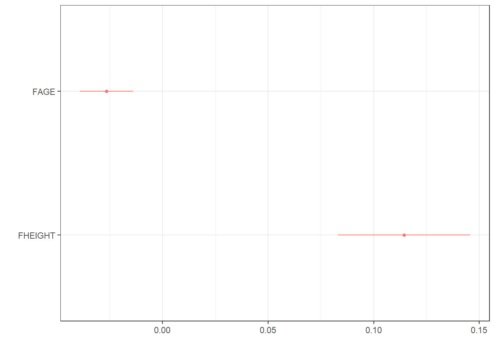
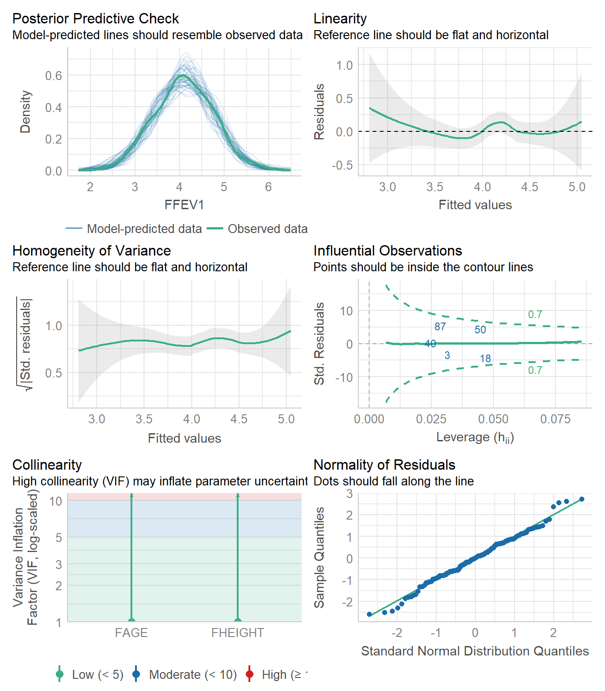

# Multiple Linear Regression {#mlr}

Hopefully by now you have some motivation for why we need to have a robust model that can incorporate information from multiple variables at the same time. Multiple linear regression is our tool to expand our MODEL to better fit the DATA. 

* Extends simple linear regression.
* Describes a linear relationship between a single continuous $Y$ variable, and several $X$ variables.
* Predicts $Y$ from $X_{1}, X_{2}, \ldots , X_{P}$.
* X's can be continuous or discrete (categorical)
* X's can be transformations of other X's, e.g., $log(x), x^{2}$. 


Now it's no longer a 2D regression _line_, but a $p$ dimensional regression plane. 


\BeginKnitrBlock{rmdnote}<div class="rmdnote">This section uses functions from the `dotwhisker` and `gtsummary` visualize results from multiple regression models. </div>\EndKnitrBlock{rmdnote}


## Mathematical Model

The mathematical model for multiple linear regression equates the value of the continuous outcome $y_{i}$ to a **linear combination** of multiple predictors $x_{1} \ldots x_{p}$ each with their own slope coefficient $\beta_{1} \ldots \beta_{p}$. 

$$ y_{i} = \beta_{0} + \beta_{1}x_{1i} + \ldots + \beta_{p}x_{pi} + \epsilon_{i}$$

where $i$ indexes the observations $i = 1 \ldots n$, and $j$ indexes the number of parameters $j=1 \ldots p$. This linear combination is often written using _summation notation_: $\sum_{i=1}^{p}X_{ij}\beta_{j}$. 

The assumptions on the residuals $\epsilon_{i}$ still hold:   

* They have mean zero  
* They are homoscedastic, that is all have the same finite variance: $Var(\epsilon_{i})=\sigma^{2}<\infty$  
* Distinct error terms are uncorrelated: (Independent) $\text{Cov}(\epsilon_{i},\epsilon_{j})=0,\forall i\neq j.$  


In matrix notation the linear combination of $X$'s and $\beta$'s is written as $\mathbf{x}_{i}^{'}\mathbf{\beta}$, (the inner product between the vectors $\mathbf{x}_{i}$ and $\mathbf{\beta}$). Then the model is written as: 

$$ \textbf{y} = \textbf{X} \mathbf{\beta} + \mathbf{\epsilon} ,$$ 

and we say the regression model relates $y$ to a function of $\textbf{X}$ and $\mathbf{\beta}$, where $\textbf{X}$ is a $nxp$ matrix of $p$ covariates on $n$ observations and $\mathbf{\beta}$ is a length $p$ vector of regression coefficients.

_Note: Knowledge of Matricies or Linear Algebra is not required to conduct or understand multiple regression, but it is foundational and essential for Statistics and Data Science majors to understand the theory behind linear models._

_Learners in other domains should attempt to understand matricies at a high level, as some of the places models can fail is due to problems doing math on matricies._

## Parameter Estimation

Recall the goal of regression analysis is to minimize the unexplained/residual error. That is, to minimize the difference between the value of the dependent variable predicted by the model and the true value of the dependent variable.

$$ \hat{y_{i}} - y_{i}, $$

where the predicted values $\hat{y}_{i}$ are calculated as 

$$\hat{y}_{i}  = \sum_{i=1}^{p}X_{ij}\beta_{j}$$

The sum of the squared residual errors (the distance between the observed point $y_{i}$ and the fitted value) now has the following form: 

$$ \sum_{i=1}^{n} |y_{i} - \sum_{i=1}^{p}X_{ij}\beta_{j}|^{2}$$

Or in matrix notation

$$ || \mathbf{Y} - \mathbf{X}\mathbf{\beta} ||^{2} $$ 

Solving this least squares problem for multiple regression requires knowledge of multivariable calculus and linear algebra, and so is left to a course in mathematical statistics. 


## Example {#mlr-fev}

The analysis in example \@ref(slr-fev) concluded that FEV1 in fathers significantly increases by 0.12 (95% CI:0.09, 0.15) liters per additional inch in height (p<.0001). Looking at the multiple $R^{2}$ (correlation of determination), this simple model explains 25% of the variance seen in the outcome $y$. 

However, FEV tends to decrease with age for adults, so we should be able to predict it better if we use both height and age as independent variables in a multiple regression equation. 

\BeginKnitrBlock{rmdnote}<div class="rmdnote">What direction do you expect the slope coefficient for age to be? For height?</div>\EndKnitrBlock{rmdnote}

Fitting a regression model in R with more than 1 predictor is done by adding each variable to the right hand side of the model notation connected with a `+`. 


```r
mlr.dad.model <- lm(FFEV1 ~ FAGE + FHEIGHT, data=fev)
summary(mlr.dad.model)
## 
## Call:
## lm(formula = FFEV1 ~ FAGE + FHEIGHT, data = fev)
## 
## Residuals:
##      Min       1Q   Median       3Q      Max 
## -1.34708 -0.34142  0.00917  0.37174  1.41853 
## 
## Coefficients:
##              Estimate Std. Error t value Pr(>|t|)    
## (Intercept) -2.760747   1.137746  -2.427   0.0165 *  
## FAGE        -0.026639   0.006369  -4.183 4.93e-05 ***
## FHEIGHT      0.114397   0.015789   7.245 2.25e-11 ***
## ---
## Signif. codes:  0 '***' 0.001 '**' 0.01 '*' 0.05 '.' 0.1 ' ' 1
## 
## Residual standard error: 0.5348 on 147 degrees of freedom
## Multiple R-squared:  0.3337,	Adjusted R-squared:  0.3247 
## F-statistic: 36.81 on 2 and 147 DF,  p-value: 1.094e-13
confint(mlr.dad.model)
##                   2.5 %      97.5 %
## (Intercept) -5.00919751 -0.51229620
## FAGE        -0.03922545 -0.01405323
## FHEIGHT      0.08319434  0.14559974
```

**Interpretations**

Holding height constant, a father who is one year older is expected to have a FEV value 0.03 (0.01, 0.04) liters less than another man (p<.0001).

Holding age constant, a father who is 1cm taller than another man is expected to have a FEV value of 0.11 (.08, 0.15) liter greater than the other man (p<.0001). 

For the model that includes age, the coefficient for height is now 0.11, which is interpreted as the rate of change of FEV1 as a function of height **after adjusting for age**. This is also called the **partial regression coefficient** of FEV1 on height after adjusting for age. 

Both height and age are significantly associated with FEV in fathers (p<.0001 each).

## Presenting regression results
The direct software output always tells you more information than what you are wanting to share with an audience. Here are some ways to "prettify" your regression output. 


* Using `tidy` and `kable` 

```r
broom::tidy(mlr.dad.model) |> kable(digits=3)
```

<table>
 <thead>
  <tr>
   <th style="text-align:left;"> term </th>
   <th style="text-align:right;"> estimate </th>
   <th style="text-align:right;"> std.error </th>
   <th style="text-align:right;"> statistic </th>
   <th style="text-align:right;"> p.value </th>
  </tr>
 </thead>
<tbody>
  <tr>
   <td style="text-align:left;"> (Intercept) </td>
   <td style="text-align:right;"> -2.761 </td>
   <td style="text-align:right;"> 1.138 </td>
   <td style="text-align:right;"> -2.427 </td>
   <td style="text-align:right;"> 0.016 </td>
  </tr>
  <tr>
   <td style="text-align:left;"> FAGE </td>
   <td style="text-align:right;"> -0.027 </td>
   <td style="text-align:right;"> 0.006 </td>
   <td style="text-align:right;"> -4.183 </td>
   <td style="text-align:right;"> 0.000 </td>
  </tr>
  <tr>
   <td style="text-align:left;"> FHEIGHT </td>
   <td style="text-align:right;"> 0.114 </td>
   <td style="text-align:right;"> 0.016 </td>
   <td style="text-align:right;"> 7.245 </td>
   <td style="text-align:right;"> 0.000 </td>
  </tr>
</tbody>
</table>

* Using [`gtsummary`](https://www.danieldsjoberg.com/gtsummary/)

```r
library(gtsummary)
tbl_regression(mlr.dad.model)
```

```{=html}
<div id="iydbaessff" style="overflow-x:auto;overflow-y:auto;width:auto;height:auto;">
<style>html {
  font-family: -apple-system, BlinkMacSystemFont, 'Segoe UI', Roboto, Oxygen, Ubuntu, Cantarell, 'Helvetica Neue', 'Fira Sans', 'Droid Sans', Arial, sans-serif;
}

#iydbaessff .gt_table {
  display: table;
  border-collapse: collapse;
  margin-left: auto;
  margin-right: auto;
  color: #333333;
  font-size: 16px;
  font-weight: normal;
  font-style: normal;
  background-color: #FFFFFF;
  width: auto;
  border-top-style: solid;
  border-top-width: 2px;
  border-top-color: #A8A8A8;
  border-right-style: none;
  border-right-width: 2px;
  border-right-color: #D3D3D3;
  border-bottom-style: solid;
  border-bottom-width: 2px;
  border-bottom-color: #A8A8A8;
  border-left-style: none;
  border-left-width: 2px;
  border-left-color: #D3D3D3;
}

#iydbaessff .gt_heading {
  background-color: #FFFFFF;
  text-align: center;
  border-bottom-color: #FFFFFF;
  border-left-style: none;
  border-left-width: 1px;
  border-left-color: #D3D3D3;
  border-right-style: none;
  border-right-width: 1px;
  border-right-color: #D3D3D3;
}

#iydbaessff .gt_title {
  color: #333333;
  font-size: 125%;
  font-weight: initial;
  padding-top: 4px;
  padding-bottom: 4px;
  padding-left: 5px;
  padding-right: 5px;
  border-bottom-color: #FFFFFF;
  border-bottom-width: 0;
}

#iydbaessff .gt_subtitle {
  color: #333333;
  font-size: 85%;
  font-weight: initial;
  padding-top: 0;
  padding-bottom: 6px;
  padding-left: 5px;
  padding-right: 5px;
  border-top-color: #FFFFFF;
  border-top-width: 0;
}

#iydbaessff .gt_bottom_border {
  border-bottom-style: solid;
  border-bottom-width: 2px;
  border-bottom-color: #D3D3D3;
}

#iydbaessff .gt_col_headings {
  border-top-style: solid;
  border-top-width: 2px;
  border-top-color: #D3D3D3;
  border-bottom-style: solid;
  border-bottom-width: 2px;
  border-bottom-color: #D3D3D3;
  border-left-style: none;
  border-left-width: 1px;
  border-left-color: #D3D3D3;
  border-right-style: none;
  border-right-width: 1px;
  border-right-color: #D3D3D3;
}

#iydbaessff .gt_col_heading {
  color: #333333;
  background-color: #FFFFFF;
  font-size: 100%;
  font-weight: normal;
  text-transform: inherit;
  border-left-style: none;
  border-left-width: 1px;
  border-left-color: #D3D3D3;
  border-right-style: none;
  border-right-width: 1px;
  border-right-color: #D3D3D3;
  vertical-align: bottom;
  padding-top: 5px;
  padding-bottom: 6px;
  padding-left: 5px;
  padding-right: 5px;
  overflow-x: hidden;
}

#iydbaessff .gt_column_spanner_outer {
  color: #333333;
  background-color: #FFFFFF;
  font-size: 100%;
  font-weight: normal;
  text-transform: inherit;
  padding-top: 0;
  padding-bottom: 0;
  padding-left: 4px;
  padding-right: 4px;
}

#iydbaessff .gt_column_spanner_outer:first-child {
  padding-left: 0;
}

#iydbaessff .gt_column_spanner_outer:last-child {
  padding-right: 0;
}

#iydbaessff .gt_column_spanner {
  border-bottom-style: solid;
  border-bottom-width: 2px;
  border-bottom-color: #D3D3D3;
  vertical-align: bottom;
  padding-top: 5px;
  padding-bottom: 5px;
  overflow-x: hidden;
  display: inline-block;
  width: 100%;
}

#iydbaessff .gt_group_heading {
  padding-top: 8px;
  padding-bottom: 8px;
  padding-left: 5px;
  padding-right: 5px;
  color: #333333;
  background-color: #FFFFFF;
  font-size: 100%;
  font-weight: initial;
  text-transform: inherit;
  border-top-style: solid;
  border-top-width: 2px;
  border-top-color: #D3D3D3;
  border-bottom-style: solid;
  border-bottom-width: 2px;
  border-bottom-color: #D3D3D3;
  border-left-style: none;
  border-left-width: 1px;
  border-left-color: #D3D3D3;
  border-right-style: none;
  border-right-width: 1px;
  border-right-color: #D3D3D3;
  vertical-align: middle;
}

#iydbaessff .gt_empty_group_heading {
  padding: 0.5px;
  color: #333333;
  background-color: #FFFFFF;
  font-size: 100%;
  font-weight: initial;
  border-top-style: solid;
  border-top-width: 2px;
  border-top-color: #D3D3D3;
  border-bottom-style: solid;
  border-bottom-width: 2px;
  border-bottom-color: #D3D3D3;
  vertical-align: middle;
}

#iydbaessff .gt_from_md > :first-child {
  margin-top: 0;
}

#iydbaessff .gt_from_md > :last-child {
  margin-bottom: 0;
}

#iydbaessff .gt_row {
  padding-top: 8px;
  padding-bottom: 8px;
  padding-left: 5px;
  padding-right: 5px;
  margin: 10px;
  border-top-style: solid;
  border-top-width: 1px;
  border-top-color: #D3D3D3;
  border-left-style: none;
  border-left-width: 1px;
  border-left-color: #D3D3D3;
  border-right-style: none;
  border-right-width: 1px;
  border-right-color: #D3D3D3;
  vertical-align: middle;
  overflow-x: hidden;
}

#iydbaessff .gt_stub {
  color: #333333;
  background-color: #FFFFFF;
  font-size: 100%;
  font-weight: initial;
  text-transform: inherit;
  border-right-style: solid;
  border-right-width: 2px;
  border-right-color: #D3D3D3;
  padding-left: 5px;
  padding-right: 5px;
}

#iydbaessff .gt_stub_row_group {
  color: #333333;
  background-color: #FFFFFF;
  font-size: 100%;
  font-weight: initial;
  text-transform: inherit;
  border-right-style: solid;
  border-right-width: 2px;
  border-right-color: #D3D3D3;
  padding-left: 5px;
  padding-right: 5px;
  vertical-align: top;
}

#iydbaessff .gt_row_group_first td {
  border-top-width: 2px;
}

#iydbaessff .gt_summary_row {
  color: #333333;
  background-color: #FFFFFF;
  text-transform: inherit;
  padding-top: 8px;
  padding-bottom: 8px;
  padding-left: 5px;
  padding-right: 5px;
}

#iydbaessff .gt_first_summary_row {
  border-top-style: solid;
  border-top-color: #D3D3D3;
}

#iydbaessff .gt_first_summary_row.thick {
  border-top-width: 2px;
}

#iydbaessff .gt_last_summary_row {
  padding-top: 8px;
  padding-bottom: 8px;
  padding-left: 5px;
  padding-right: 5px;
  border-bottom-style: solid;
  border-bottom-width: 2px;
  border-bottom-color: #D3D3D3;
}

#iydbaessff .gt_grand_summary_row {
  color: #333333;
  background-color: #FFFFFF;
  text-transform: inherit;
  padding-top: 8px;
  padding-bottom: 8px;
  padding-left: 5px;
  padding-right: 5px;
}

#iydbaessff .gt_first_grand_summary_row {
  padding-top: 8px;
  padding-bottom: 8px;
  padding-left: 5px;
  padding-right: 5px;
  border-top-style: double;
  border-top-width: 6px;
  border-top-color: #D3D3D3;
}

#iydbaessff .gt_striped {
  background-color: rgba(128, 128, 128, 0.05);
}

#iydbaessff .gt_table_body {
  border-top-style: solid;
  border-top-width: 2px;
  border-top-color: #D3D3D3;
  border-bottom-style: solid;
  border-bottom-width: 2px;
  border-bottom-color: #D3D3D3;
}

#iydbaessff .gt_footnotes {
  color: #333333;
  background-color: #FFFFFF;
  border-bottom-style: none;
  border-bottom-width: 2px;
  border-bottom-color: #D3D3D3;
  border-left-style: none;
  border-left-width: 2px;
  border-left-color: #D3D3D3;
  border-right-style: none;
  border-right-width: 2px;
  border-right-color: #D3D3D3;
}

#iydbaessff .gt_footnote {
  margin: 0px;
  font-size: 90%;
  padding-left: 4px;
  padding-right: 4px;
  padding-left: 5px;
  padding-right: 5px;
}

#iydbaessff .gt_sourcenotes {
  color: #333333;
  background-color: #FFFFFF;
  border-bottom-style: none;
  border-bottom-width: 2px;
  border-bottom-color: #D3D3D3;
  border-left-style: none;
  border-left-width: 2px;
  border-left-color: #D3D3D3;
  border-right-style: none;
  border-right-width: 2px;
  border-right-color: #D3D3D3;
}

#iydbaessff .gt_sourcenote {
  font-size: 90%;
  padding-top: 4px;
  padding-bottom: 4px;
  padding-left: 5px;
  padding-right: 5px;
}

#iydbaessff .gt_left {
  text-align: left;
}

#iydbaessff .gt_center {
  text-align: center;
}

#iydbaessff .gt_right {
  text-align: right;
  font-variant-numeric: tabular-nums;
}

#iydbaessff .gt_font_normal {
  font-weight: normal;
}

#iydbaessff .gt_font_bold {
  font-weight: bold;
}

#iydbaessff .gt_font_italic {
  font-style: italic;
}

#iydbaessff .gt_super {
  font-size: 65%;
}

#iydbaessff .gt_two_val_uncert {
  display: inline-block;
  line-height: 1em;
  text-align: right;
  font-size: 60%;
  vertical-align: -0.25em;
  margin-left: 0.1em;
}

#iydbaessff .gt_footnote_marks {
  font-style: italic;
  font-weight: normal;
  font-size: 75%;
  vertical-align: 0.4em;
}

#iydbaessff .gt_asterisk {
  font-size: 100%;
  vertical-align: 0;
}

#iydbaessff .gt_slash_mark {
  font-size: 0.7em;
  line-height: 0.7em;
  vertical-align: 0.15em;
}

#iydbaessff .gt_fraction_numerator {
  font-size: 0.6em;
  line-height: 0.6em;
  vertical-align: 0.45em;
}

#iydbaessff .gt_fraction_denominator {
  font-size: 0.6em;
  line-height: 0.6em;
  vertical-align: -0.05em;
}
</style>
<table class="gt_table">
  
  <thead class="gt_col_headings">
    <tr>
      <th class="gt_col_heading gt_columns_bottom_border gt_left" rowspan="1" colspan="1"><strong>Characteristic</strong></th>
      <th class="gt_col_heading gt_columns_bottom_border gt_center" rowspan="1" colspan="1"><strong>Beta</strong></th>
      <th class="gt_col_heading gt_columns_bottom_border gt_center" rowspan="1" colspan="1"><strong>95% CI</strong><sup class="gt_footnote_marks">1</sup></th>
      <th class="gt_col_heading gt_columns_bottom_border gt_center" rowspan="1" colspan="1"><strong>p-value</strong></th>
    </tr>
  </thead>
  <tbody class="gt_table_body">
    <tr><td class="gt_row gt_left">FAGE</td>
<td class="gt_row gt_center">-0.03</td>
<td class="gt_row gt_center">-0.04, -0.01</td>
<td class="gt_row gt_center"><0.001</td></tr>
    <tr><td class="gt_row gt_left">FHEIGHT</td>
<td class="gt_row gt_center">0.11</td>
<td class="gt_row gt_center">0.08, 0.15</td>
<td class="gt_row gt_center"><0.001</td></tr>
  </tbody>
  
  <tfoot class="gt_footnotes">
    <tr>
      <td class="gt_footnote" colspan="4"><sup class="gt_footnote_marks">1</sup> CI = Confidence Interval</td>
    </tr>
  </tfoot>
</table>
</div>
```

* Using `dwplot` from the [`dotwhisker`](https://cran.r-project.org/web/packages/dotwhisker/vignettes/dotwhisker-vignette.html) package to create a _forest plot_. 


```r
library(dotwhisker)
dwplot(mlr.dad.model)
```



## Confounding 

One primary purpose of a multivariable model is to assess the relationship between a particular explanatory variable $x$ and your response variable $y$, _after controlling for other factors_. 


Credit: [A blog about statistical musings](https://significantlystatistical.wordpress.com/2014/12/12/confounders-mediators-moderators-and-covariates/)


\BeginKnitrBlock{rmdnote}<div class="rmdnote">Easy to read short article from a Gastroenterology journal on how to control confounding effects by statistical analysis. https://www.ncbi.nlm.nih.gov/pmc/articles/PMC4017459/</div>\EndKnitrBlock{rmdnote}

Other factors (characteristics/variables) could also be explaining part of the variability seen in $y$. 

> If the relationship between $x_{1}$ and $y$ is bivariately significant, but then no longer significant once $x_{2}$ has been added to the model, then $x_{2}$ is said to explain, or **confound**, the relationship between $x_{1}$ and $y$.

Steps to determine if a variable $x_{2}$ is a confounder. 

1. Fit a regression model on $y \sim x_{1}$. 
2. If $x_{1}$ is not significantly associated with $y$, STOP. Re-read the "IF" part of the definition of a confounder. 
3. Fit a regression model on $y \sim x_{1} + x_{2}$. 
4. Look at the p-value for $x_{1}$. One of two things will have happened. 
    - If $x_{1}$ is still significant, then $x_{2}$ does NOT confound (or explain) the relationship between $y$ and $x_{1}$. 
    - If $x_{1}$ is NO LONGER significantly associated with $y$, then $x_{2}$ IS a confounder. 
    

This means that the third variable is explaining the relationship between the explanatory variable and the response variable.
        
Note that this is a two way relationship. The order of $x_{1}$ and $x_{2}$ is invaraiant. If you were to add $x_{2}$ to the model before $x_{1}$ you may see the same thing occur. That is - both variables are explaining the same portion of the variance in $y$. 

### Example: Does smoking affect pulse rate? 

Prior studies have indicate that smoking is associated with high blood pressure. Is smoking also associated with your pulse rate? 


First we consider the bivariate relationship between pulse rate (`H4PR`) and cigarette smoking as measured by the quantity of cigarettes smoked each day during the past 30 days (`H4TO6`). 

```r
lm(H4PR ~ H4TO6 , data=addhealth) %>% summary()
## 
## Call:
## lm(formula = H4PR ~ H4TO6, data = addhealth)
## 
## Residuals:
##     Min      1Q  Median      3Q     Max 
## -30.826  -8.548  -0.687   7.258 120.841 
## 
## Coefficients:
##             Estimate Std. Error t value Pr(>|t|)    
## (Intercept)  73.7702     0.4953 148.936  < 2e-16 ***
## H4TO6         0.1389     0.0396   3.507 0.000464 ***
## ---
## Signif. codes:  0 '***' 0.001 '**' 0.01 '*' 0.05 '.' 0.1 ' ' 1
## 
## Residual standard error: 12.56 on 1761 degrees of freedom
##   (4741 observations deleted due to missingness)
## Multiple R-squared:  0.006936,	Adjusted R-squared:  0.006372 
## F-statistic:  12.3 on 1 and 1761 DF,  p-value: 0.0004644
```

As the number of cigarettes smoked each day increases by one, a persons pulse rate significantly increases by 0.13. 

However, there are more ways to assess the amount someone smokes. Consider a different measure of smoking, "during the past 30 days, on how many days did you smoke cigarettes?" (`H4TO5`). So here we are measuring the # of days smoked, not the # of cigarettes per day. If we include both in the model, we note that the earlier measure of smoking `H4TO6` is no longer significant (at the 0.05 level). 


```r
lm(H4PR ~ H4TO5 +  H4TO6 , data=addhealth) %>% summary()
## 
## Call:
## lm(formula = H4PR ~ H4TO5 + H4TO6, data = addhealth)
## 
## Residuals:
##     Min      1Q  Median      3Q     Max 
## -31.682  -8.509  -1.014   7.302 120.320 
## 
## Coefficients:
##             Estimate Std. Error t value Pr(>|t|)    
## (Intercept) 72.78932    0.68037 106.985   <2e-16 ***
## H4TO5        0.06870    0.03271   2.101   0.0358 *  
## H4TO6        0.08292    0.04769   1.739   0.0822 .  
## ---
## Signif. codes:  0 '***' 0.001 '**' 0.01 '*' 0.05 '.' 0.1 ' ' 1
## 
## Residual standard error: 12.55 on 1760 degrees of freedom
##   (4741 observations deleted due to missingness)
## Multiple R-squared:  0.00942,	Adjusted R-squared:  0.008294 
## F-statistic: 8.368 on 2 and 1760 DF,  p-value: 0.0002415
```

Thus, the number of days smoked _confounds_ the relationship between the number of cigarettes smoked per day, and the person's pulse rate. 


## Model Diagnostics 

The same set of regression diagnostics can be examined to identify any potential influential points, outliers or other problems with the linear model. 


```r
check_model(mlr.dad.model)
```




 
## What to watch out for
* Representative sample 
* Range of prediction should match observed range of X in sample
* Use of nominal or ordinal, rather than interval or ratio data
* Errors-in-variables
* Correlation does not imply causation 
* Violation of assumptions
* Influential points
* Appropriate model
* Multicollinearity


