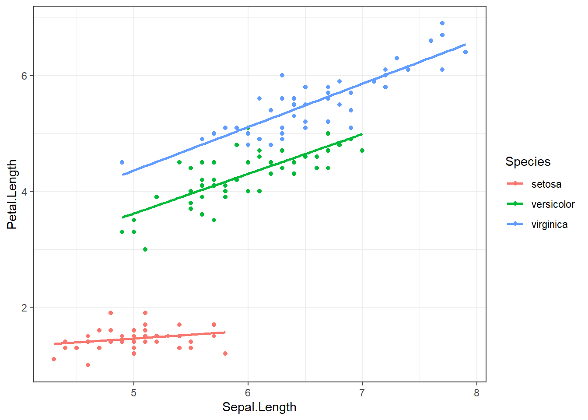
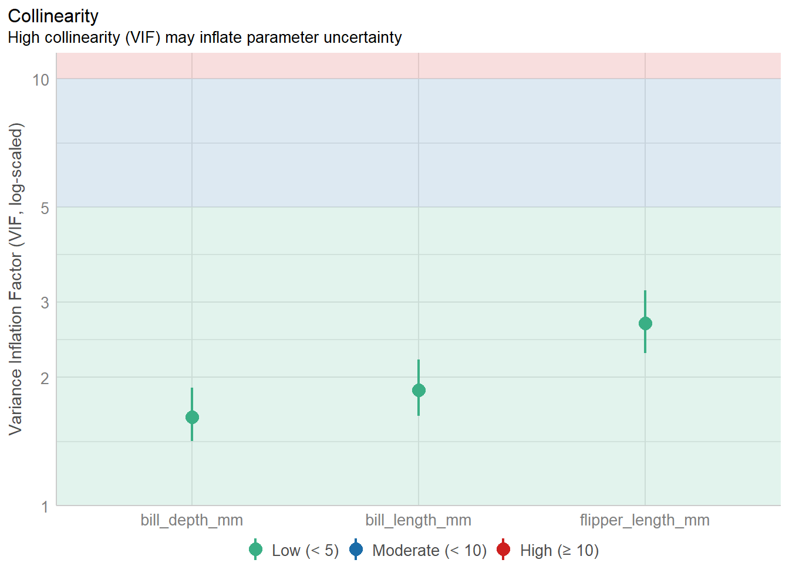
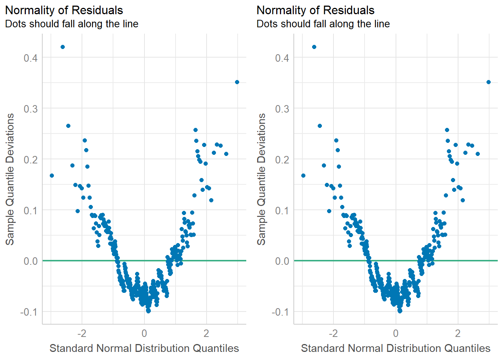
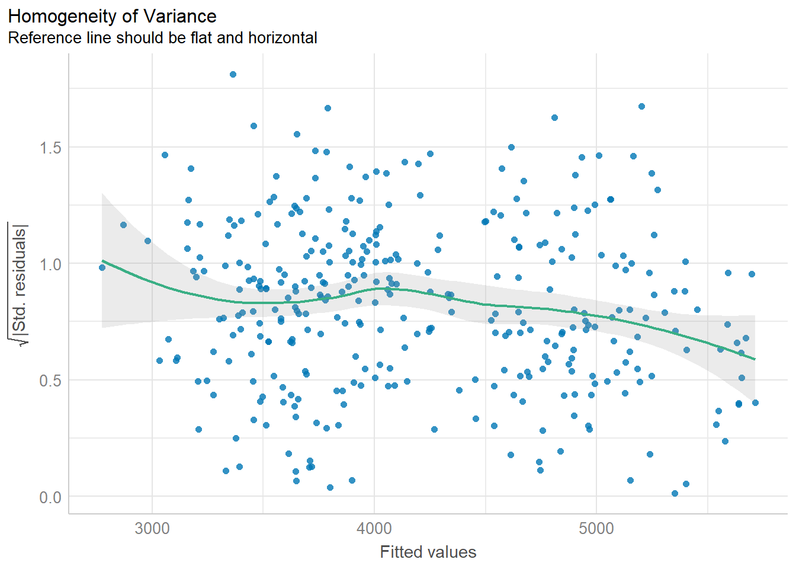
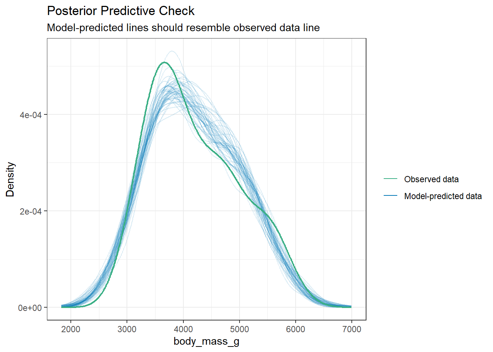
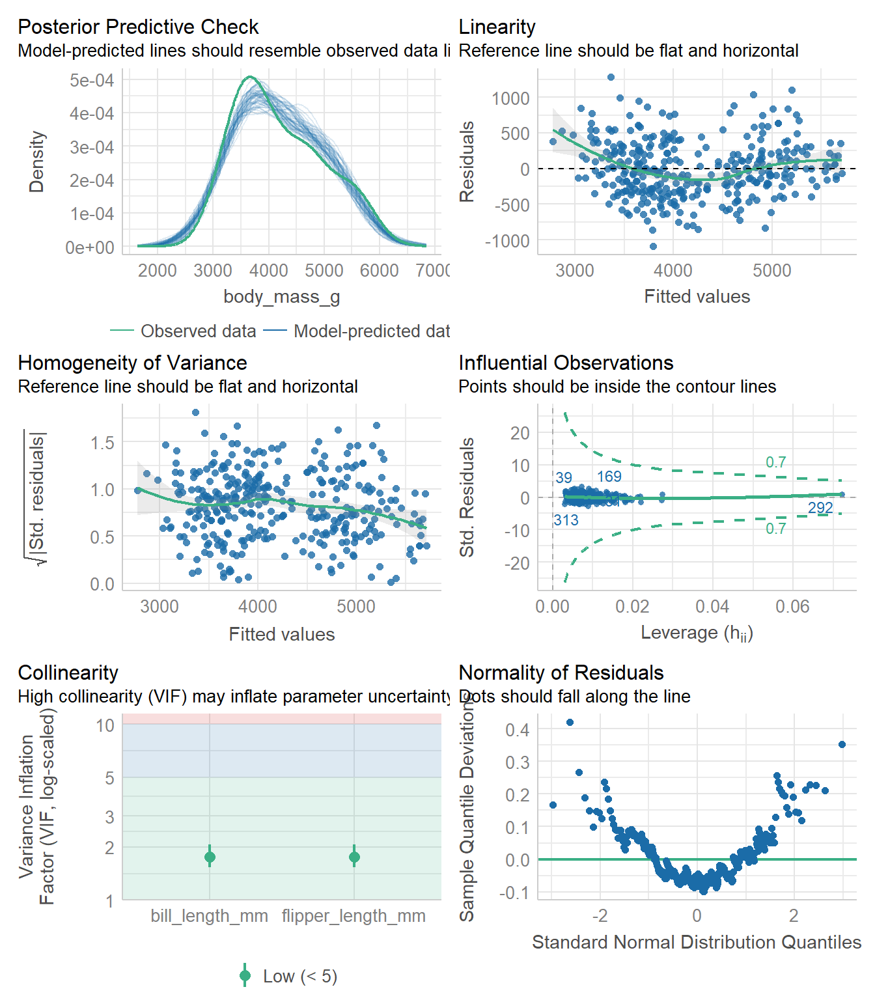

# Model Building {#model-building}

Model building methods are used mainly in exploratory situations where many independent variables have been measured, but a final model explaining the dependent variable has not been reached. You want to build a model that contains enough covariates to explain the model well, but still be parsimonious such that the model is still interpretable. 

This chapter introduces how to use and interpret different types of covariates, how to choose covariates, and then cover some methods to compare between competing models using measures of model fit. 


\BeginKnitrBlock{rmdnote}<div class="rmdnote">This section uses functions from the `gtsummary` and `survey` packages to help tidy and visualize results from regression models. It also uses functions from the `performance` and `glmnet` packages to perform model selection and assessment. </div>\EndKnitrBlock{rmdnote}


## Interactions (PMA6 8.8) {#interactions}

In this _main effects_ model, Species only changes the intercept. The effect of species is not multiplied by Sepal length. Reviewing the scatterplot below, do you think this is a reasonable model to fit the observed relationship?


```r
ggplot(iris, aes(x=Sepal.Length, y=Petal.Length, color = Species)) + 
  geom_point() + geom_smooth(method="lm", se=FALSE)
```




If we care about how species _changes_ the relationship between petal and sepal length, we can fit a model with an **interaction** between sepal length ($x_{1}$) and species. For this first example let $x_{2}$ be an indicator for when `species == setosa`. Note that both _main effects_ of sepal length, and setosa species are also included in the model. Interactions are mathematically represented as a multiplication between the two variables that are interacting. 

$$ Y_{i} \sim \beta_{0} + \beta_{1}x_{i} + \beta_{2}x_{2i} + \beta_{3}x_{1i}x_{2i}$$

If we evaluate this model for both levels of $x_{2}$, the resulting models are the same as the stratified models. 

When $x_{2} = 0$, the record is on an iris not from the _setosa_ species. 

$$ Y_{i} \sim \beta_{0} + \beta_{1}x_{i} + \beta_{2}(0) + \beta_{3}x_{1i}(0)$$
which simplifies to 
$$ Y_{i} \sim \beta_{0} + \beta_{1}x_{i}$$

When $x_{2} = 1$, the record is on an iris of the _setosa_ species. 

$$ Y_{i} \sim \beta_{0} + \beta_{1}x_{i} + \beta_{2}(1) + \beta_{3}x_{1i}(1)$$
which simplifies to
$$ Y_{i} \sim (\beta_{0} + \beta_{2}) + (\beta_{1} + \beta_{3})x_{i}$$

Each subgroup model has a different intercept and slope, but we had to estimate 4 parameters in the interaction model, and 6 for the fully stratified model. 

### Fitting interaction models & interpreting coefficients
Interactions are fit in `R` by simply multiplying `*` the two variables together in the model statement. 

```r
iris$setosa <- ifelse(iris$Species == "setosa", 1, 0)
lm(Petal.Length ~ Sepal.Length + setosa + Sepal.Length*setosa, data=iris) |> tbl_regression()
```


```{=html}
<div id="jontlgyavv" style="padding-left:0px;padding-right:0px;padding-top:10px;padding-bottom:10px;overflow-x:auto;overflow-y:auto;width:auto;height:auto;">
<style>#jontlgyavv table {
  font-family: system-ui, 'Segoe UI', Roboto, Helvetica, Arial, sans-serif, 'Apple Color Emoji', 'Segoe UI Emoji', 'Segoe UI Symbol', 'Noto Color Emoji';
  -webkit-font-smoothing: antialiased;
  -moz-osx-font-smoothing: grayscale;
}

#jontlgyavv thead, #jontlgyavv tbody, #jontlgyavv tfoot, #jontlgyavv tr, #jontlgyavv td, #jontlgyavv th {
  border-style: none;
}

#jontlgyavv p {
  margin: 0;
  padding: 0;
}

#jontlgyavv .gt_table {
  display: table;
  border-collapse: collapse;
  line-height: normal;
  margin-left: auto;
  margin-right: auto;
  color: #333333;
  font-size: 16px;
  font-weight: normal;
  font-style: normal;
  background-color: #FFFFFF;
  width: auto;
  border-top-style: solid;
  border-top-width: 2px;
  border-top-color: #A8A8A8;
  border-right-style: none;
  border-right-width: 2px;
  border-right-color: #D3D3D3;
  border-bottom-style: solid;
  border-bottom-width: 2px;
  border-bottom-color: #A8A8A8;
  border-left-style: none;
  border-left-width: 2px;
  border-left-color: #D3D3D3;
}

#jontlgyavv .gt_caption {
  padding-top: 4px;
  padding-bottom: 4px;
}

#jontlgyavv .gt_title {
  color: #333333;
  font-size: 125%;
  font-weight: initial;
  padding-top: 4px;
  padding-bottom: 4px;
  padding-left: 5px;
  padding-right: 5px;
  border-bottom-color: #FFFFFF;
  border-bottom-width: 0;
}

#jontlgyavv .gt_subtitle {
  color: #333333;
  font-size: 85%;
  font-weight: initial;
  padding-top: 3px;
  padding-bottom: 5px;
  padding-left: 5px;
  padding-right: 5px;
  border-top-color: #FFFFFF;
  border-top-width: 0;
}

#jontlgyavv .gt_heading {
  background-color: #FFFFFF;
  text-align: center;
  border-bottom-color: #FFFFFF;
  border-left-style: none;
  border-left-width: 1px;
  border-left-color: #D3D3D3;
  border-right-style: none;
  border-right-width: 1px;
  border-right-color: #D3D3D3;
}

#jontlgyavv .gt_bottom_border {
  border-bottom-style: solid;
  border-bottom-width: 2px;
  border-bottom-color: #D3D3D3;
}

#jontlgyavv .gt_col_headings {
  border-top-style: solid;
  border-top-width: 2px;
  border-top-color: #D3D3D3;
  border-bottom-style: solid;
  border-bottom-width: 2px;
  border-bottom-color: #D3D3D3;
  border-left-style: none;
  border-left-width: 1px;
  border-left-color: #D3D3D3;
  border-right-style: none;
  border-right-width: 1px;
  border-right-color: #D3D3D3;
}

#jontlgyavv .gt_col_heading {
  color: #333333;
  background-color: #FFFFFF;
  font-size: 100%;
  font-weight: normal;
  text-transform: inherit;
  border-left-style: none;
  border-left-width: 1px;
  border-left-color: #D3D3D3;
  border-right-style: none;
  border-right-width: 1px;
  border-right-color: #D3D3D3;
  vertical-align: bottom;
  padding-top: 5px;
  padding-bottom: 6px;
  padding-left: 5px;
  padding-right: 5px;
  overflow-x: hidden;
}

#jontlgyavv .gt_column_spanner_outer {
  color: #333333;
  background-color: #FFFFFF;
  font-size: 100%;
  font-weight: normal;
  text-transform: inherit;
  padding-top: 0;
  padding-bottom: 0;
  padding-left: 4px;
  padding-right: 4px;
}

#jontlgyavv .gt_column_spanner_outer:first-child {
  padding-left: 0;
}

#jontlgyavv .gt_column_spanner_outer:last-child {
  padding-right: 0;
}

#jontlgyavv .gt_column_spanner {
  border-bottom-style: solid;
  border-bottom-width: 2px;
  border-bottom-color: #D3D3D3;
  vertical-align: bottom;
  padding-top: 5px;
  padding-bottom: 5px;
  overflow-x: hidden;
  display: inline-block;
  width: 100%;
}

#jontlgyavv .gt_spanner_row {
  border-bottom-style: hidden;
}

#jontlgyavv .gt_group_heading {
  padding-top: 8px;
  padding-bottom: 8px;
  padding-left: 5px;
  padding-right: 5px;
  color: #333333;
  background-color: #FFFFFF;
  font-size: 100%;
  font-weight: initial;
  text-transform: inherit;
  border-top-style: solid;
  border-top-width: 2px;
  border-top-color: #D3D3D3;
  border-bottom-style: solid;
  border-bottom-width: 2px;
  border-bottom-color: #D3D3D3;
  border-left-style: none;
  border-left-width: 1px;
  border-left-color: #D3D3D3;
  border-right-style: none;
  border-right-width: 1px;
  border-right-color: #D3D3D3;
  vertical-align: middle;
  text-align: left;
}

#jontlgyavv .gt_empty_group_heading {
  padding: 0.5px;
  color: #333333;
  background-color: #FFFFFF;
  font-size: 100%;
  font-weight: initial;
  border-top-style: solid;
  border-top-width: 2px;
  border-top-color: #D3D3D3;
  border-bottom-style: solid;
  border-bottom-width: 2px;
  border-bottom-color: #D3D3D3;
  vertical-align: middle;
}

#jontlgyavv .gt_from_md > :first-child {
  margin-top: 0;
}

#jontlgyavv .gt_from_md > :last-child {
  margin-bottom: 0;
}

#jontlgyavv .gt_row {
  padding-top: 8px;
  padding-bottom: 8px;
  padding-left: 5px;
  padding-right: 5px;
  margin: 10px;
  border-top-style: solid;
  border-top-width: 1px;
  border-top-color: #D3D3D3;
  border-left-style: none;
  border-left-width: 1px;
  border-left-color: #D3D3D3;
  border-right-style: none;
  border-right-width: 1px;
  border-right-color: #D3D3D3;
  vertical-align: middle;
  overflow-x: hidden;
}

#jontlgyavv .gt_stub {
  color: #333333;
  background-color: #FFFFFF;
  font-size: 100%;
  font-weight: initial;
  text-transform: inherit;
  border-right-style: solid;
  border-right-width: 2px;
  border-right-color: #D3D3D3;
  padding-left: 5px;
  padding-right: 5px;
}

#jontlgyavv .gt_stub_row_group {
  color: #333333;
  background-color: #FFFFFF;
  font-size: 100%;
  font-weight: initial;
  text-transform: inherit;
  border-right-style: solid;
  border-right-width: 2px;
  border-right-color: #D3D3D3;
  padding-left: 5px;
  padding-right: 5px;
  vertical-align: top;
}

#jontlgyavv .gt_row_group_first td {
  border-top-width: 2px;
}

#jontlgyavv .gt_row_group_first th {
  border-top-width: 2px;
}

#jontlgyavv .gt_summary_row {
  color: #333333;
  background-color: #FFFFFF;
  text-transform: inherit;
  padding-top: 8px;
  padding-bottom: 8px;
  padding-left: 5px;
  padding-right: 5px;
}

#jontlgyavv .gt_first_summary_row {
  border-top-style: solid;
  border-top-color: #D3D3D3;
}

#jontlgyavv .gt_first_summary_row.thick {
  border-top-width: 2px;
}

#jontlgyavv .gt_last_summary_row {
  padding-top: 8px;
  padding-bottom: 8px;
  padding-left: 5px;
  padding-right: 5px;
  border-bottom-style: solid;
  border-bottom-width: 2px;
  border-bottom-color: #D3D3D3;
}

#jontlgyavv .gt_grand_summary_row {
  color: #333333;
  background-color: #FFFFFF;
  text-transform: inherit;
  padding-top: 8px;
  padding-bottom: 8px;
  padding-left: 5px;
  padding-right: 5px;
}

#jontlgyavv .gt_first_grand_summary_row {
  padding-top: 8px;
  padding-bottom: 8px;
  padding-left: 5px;
  padding-right: 5px;
  border-top-style: double;
  border-top-width: 6px;
  border-top-color: #D3D3D3;
}

#jontlgyavv .gt_last_grand_summary_row_top {
  padding-top: 8px;
  padding-bottom: 8px;
  padding-left: 5px;
  padding-right: 5px;
  border-bottom-style: double;
  border-bottom-width: 6px;
  border-bottom-color: #D3D3D3;
}

#jontlgyavv .gt_striped {
  background-color: rgba(128, 128, 128, 0.05);
}

#jontlgyavv .gt_table_body {
  border-top-style: solid;
  border-top-width: 2px;
  border-top-color: #D3D3D3;
  border-bottom-style: solid;
  border-bottom-width: 2px;
  border-bottom-color: #D3D3D3;
}

#jontlgyavv .gt_footnotes {
  color: #333333;
  background-color: #FFFFFF;
  border-bottom-style: none;
  border-bottom-width: 2px;
  border-bottom-color: #D3D3D3;
  border-left-style: none;
  border-left-width: 2px;
  border-left-color: #D3D3D3;
  border-right-style: none;
  border-right-width: 2px;
  border-right-color: #D3D3D3;
}

#jontlgyavv .gt_footnote {
  margin: 0px;
  font-size: 90%;
  padding-top: 4px;
  padding-bottom: 4px;
  padding-left: 5px;
  padding-right: 5px;
}

#jontlgyavv .gt_sourcenotes {
  color: #333333;
  background-color: #FFFFFF;
  border-bottom-style: none;
  border-bottom-width: 2px;
  border-bottom-color: #D3D3D3;
  border-left-style: none;
  border-left-width: 2px;
  border-left-color: #D3D3D3;
  border-right-style: none;
  border-right-width: 2px;
  border-right-color: #D3D3D3;
}

#jontlgyavv .gt_sourcenote {
  font-size: 90%;
  padding-top: 4px;
  padding-bottom: 4px;
  padding-left: 5px;
  padding-right: 5px;
}

#jontlgyavv .gt_left {
  text-align: left;
}

#jontlgyavv .gt_center {
  text-align: center;
}

#jontlgyavv .gt_right {
  text-align: right;
  font-variant-numeric: tabular-nums;
}

#jontlgyavv .gt_font_normal {
  font-weight: normal;
}

#jontlgyavv .gt_font_bold {
  font-weight: bold;
}

#jontlgyavv .gt_font_italic {
  font-style: italic;
}

#jontlgyavv .gt_super {
  font-size: 65%;
}

#jontlgyavv .gt_footnote_marks {
  font-size: 75%;
  vertical-align: 0.4em;
  position: initial;
}

#jontlgyavv .gt_asterisk {
  font-size: 100%;
  vertical-align: 0;
}

#jontlgyavv .gt_indent_1 {
  text-indent: 5px;
}

#jontlgyavv .gt_indent_2 {
  text-indent: 10px;
}

#jontlgyavv .gt_indent_3 {
  text-indent: 15px;
}

#jontlgyavv .gt_indent_4 {
  text-indent: 20px;
}

#jontlgyavv .gt_indent_5 {
  text-indent: 25px;
}
</style>
<table class="gt_table" data-quarto-disable-processing="false" data-quarto-bootstrap="false">
  <thead>
    <tr class="gt_col_headings">
      <th class="gt_col_heading gt_columns_bottom_border gt_left" rowspan="1" colspan="1" scope="col" id="&lt;strong&gt;Characteristic&lt;/strong&gt;"><strong>Characteristic</strong></th>
      <th class="gt_col_heading gt_columns_bottom_border gt_center" rowspan="1" colspan="1" scope="col" id="&lt;strong&gt;Beta&lt;/strong&gt;"><strong>Beta</strong></th>
      <th class="gt_col_heading gt_columns_bottom_border gt_center" rowspan="1" colspan="1" scope="col" id="&lt;strong&gt;95% CI&lt;/strong&gt;&lt;span class=&quot;gt_footnote_marks&quot; style=&quot;white-space:nowrap;font-style:italic;font-weight:normal;&quot;&gt;&lt;sup&gt;1&lt;/sup&gt;&lt;/span&gt;"><strong>95% CI</strong><span class="gt_footnote_marks" style="white-space:nowrap;font-style:italic;font-weight:normal;"><sup>1</sup></span></th>
      <th class="gt_col_heading gt_columns_bottom_border gt_center" rowspan="1" colspan="1" scope="col" id="&lt;strong&gt;p-value&lt;/strong&gt;"><strong>p-value</strong></th>
    </tr>
  </thead>
  <tbody class="gt_table_body">
    <tr><td headers="label" class="gt_row gt_left">Sepal.Length</td>
<td headers="estimate" class="gt_row gt_center">1.0</td>
<td headers="ci" class="gt_row gt_center">0.91, 1.1</td>
<td headers="p.value" class="gt_row gt_center"><0.001</td></tr>
    <tr><td headers="label" class="gt_row gt_left">setosa</td>
<td headers="estimate" class="gt_row gt_center">2.4</td>
<td headers="ci" class="gt_row gt_center">0.61, 4.1</td>
<td headers="p.value" class="gt_row gt_center">0.008</td></tr>
    <tr><td headers="label" class="gt_row gt_left">Sepal.Length * setosa</td>
<td headers="estimate" class="gt_row gt_center">-0.90</td>
<td headers="ci" class="gt_row gt_center">-1.2, -0.56</td>
<td headers="p.value" class="gt_row gt_center"><0.001</td></tr>
  </tbody>
  
  <tfoot class="gt_footnotes">
    <tr>
      <td class="gt_footnote" colspan="4"><span class="gt_footnote_marks" style="white-space:nowrap;font-style:italic;font-weight:normal;"><sup>1</sup></span> CI = Confidence Interval</td>
    </tr>
  </tfoot>
</table>
</div>
```


The coefficient $b_{3}$ for the interaction term is significant, confirming that species changes the relationship between sepal length and petal length. Thus, species is a **moderator** (Chapter \@ref(mod-strat)).
 
**Interpreting Coefficients**

* If $x_{2}=0$, then the effect of $x_{1}$ on $Y$ simplifies to: $\beta_{1}$
    * $b_{1}$ The effect of sepal length on petal length **for non-setosa species of iris** (`setosa=0`) 
    * For non-setosa species, the petal length increases 1.03cm for every additional cm of sepal length. 
* If $x_{2}=1$, then the effect of $x_{1}$ on $Y$ model simplifies to: $\beta_{1} + \beta_{3}$
    * For setosa species, the petal length increases by `1.03-0.9=0.13` cm for every additional cm of sepal length. 

\BeginKnitrBlock{rmdcaution}<div class="rmdcaution">The main effects ($b_{1}$, $b_{2}$) cannot be interpreted by themselves when there is an interaction in the model.</div>\EndKnitrBlock{rmdcaution}

### Categorical Interaction variables  {#interactions-catvars}

Let's up the game now and look at the full interaction model with a categorical version of species. 
Recall $x_{1}$ is Sepal Length, $x_{2}$ is the indicator for _versicolor_, and $x_{3}$ the indicator for _virginica_ . Refer to \@ref(cat-predictors) for information on how to interpret categorical predictors as main effects. 

$$ Y_{i} \sim \beta_{0} + \beta_{1}x_{i} + \beta_{2}x_{2i} + \beta_{3}x_{3i} + \beta_{4}x_{1i}x_{2i} + \beta_{5}x_{1i}x_{3i}+\epsilon_{i}$$


```r
summary(lm(Petal.Length ~ Sepal.Length + Species + Sepal.Length*Species, data=iris))
## 
## Call:
## lm(formula = Petal.Length ~ Sepal.Length + Species + Sepal.Length * 
##     Species, data = iris)
## 
## Residuals:
##      Min       1Q   Median       3Q      Max 
## -0.68611 -0.13442 -0.00856  0.15966  0.79607 
## 
## Coefficients:
##                                Estimate Std. Error t value Pr(>|t|)    
## (Intercept)                      0.8031     0.5310   1.512    0.133    
## Sepal.Length                     0.1316     0.1058   1.244    0.216    
## Speciesversicolor               -0.6179     0.6837  -0.904    0.368    
## Speciesvirginica                -0.1926     0.6578  -0.293    0.770    
## Sepal.Length:Speciesversicolor   0.5548     0.1281   4.330 2.78e-05 ***
## Sepal.Length:Speciesvirginica    0.6184     0.1210   5.111 1.00e-06 ***
## ---
## Signif. codes:  0 '***' 0.001 '**' 0.01 '*' 0.05 '.' 0.1 ' ' 1
## 
## Residual standard error: 0.2611 on 144 degrees of freedom
## Multiple R-squared:  0.9789,	Adjusted R-squared:  0.9781 
## F-statistic:  1333 on 5 and 144 DF,  p-value: < 2.2e-16
```

The slope of the relationship between sepal length and petal length is calculated as follows, for each species:   

* _setosa_ $(x_{2}=0, x_{3}=0): b_{1}=0.13$ 
* _versicolor_ $(x_{2}=1, x_{3}=0): b_{1} + b_{2} + b_{4} = 0.13+0.55 = 0.68$
* _virginica_ $(x_{2}=0, x_{3}=1): b_{1} + b_{3} + b_{5} = 0.13+0.62 = 0.75$

Compare this to the estimates gained from the stratified model: 


```r
by(iris, iris$Species, function(x){
  lm(Petal.Length ~ Sepal.Length, data=x) %>% coef()
})
## iris$Species: setosa
##  (Intercept) Sepal.Length 
##    0.8030518    0.1316317 
## ------------------------------------------------------------ 
## iris$Species: versicolor
##  (Intercept) Sepal.Length 
##    0.1851155    0.6864698 
## ------------------------------------------------------------ 
## iris$Species: virginica
##  (Intercept) Sepal.Length 
##    0.6104680    0.7500808
```

They're the same! Proof that an interaction is equivalent to stratification. 

### Example 2

What if we now wanted to include other predictors in the model? How does sepal length relate to petal length after controlling for petal width? We add the variable for petal width into the model


```r
summary(lm(Petal.Length ~ Sepal.Length + setosa + Sepal.Length*setosa + Petal.Width, data=iris))
## 
## Call:
## lm(formula = Petal.Length ~ Sepal.Length + setosa + Sepal.Length * 
##     setosa + Petal.Width, data = iris)
## 
## Residuals:
##      Min       1Q   Median       3Q      Max 
## -0.83519 -0.18278 -0.01812  0.17004  1.06968 
## 
## Coefficients:
##                     Estimate Std. Error t value Pr(>|t|)    
## (Intercept)         -0.86850    0.27028  -3.213  0.00162 ** 
## Sepal.Length         0.66181    0.05179  12.779  < 2e-16 ***
## setosa               1.83713    0.62355   2.946  0.00375 ** 
## Petal.Width          0.97269    0.07970  12.204  < 2e-16 ***
## Sepal.Length:setosa -0.61106    0.12213  -5.003 1.61e-06 ***
## ---
## Signif. codes:  0 '***' 0.001 '**' 0.01 '*' 0.05 '.' 0.1 ' ' 1
## 
## Residual standard error: 0.2769 on 145 degrees of freedom
## Multiple R-squared:  0.9761,	Adjusted R-squared:  0.9754 
## F-statistic:  1478 on 4 and 145 DF,  p-value: < 2.2e-16
```

So far, petal width, and the combination of species and sepal length are both significantly associated with petal length. 

_Note of caution: Stratification implies that the stratifying variable interacts with all other variables._ 
So if we were to go back to the stratified model where we fit the model of petal length on sepal length AND petal width, stratified by species, we would  be implying that species interacts with both sepal length and petal width. 

E.g. the following stratified model 

* $Y = A + B + C + D + C*D$, when D=1
* $Y = A + B + C + D + C*D$, when D=0

is the same as the following interaction model: 

* $Y = A + B + C + D + A*D + B*D + C*D$


### Example 3: 

Let's explore the relationship between income, employment status and depression. 
This example follows a logistic regression example from section \@ref(mlogreg). 

Here I create the binary indicators of `lowincome` (annual income <$10k/year) and underemployed (part time or unemployed).


```r
depress$lowincome <- ifelse(depress$income < 10, 1, 0)
table(depress$lowincome, depress$income, useNA="always")
##       
##         2  4  5  6  7  8  9 11 12 13 15 16 18 19 20 23 24 25 26 27 28 31 32 35
##   0     0  0  0  0  0  0  0 17  2 18 24  1  1 25  3 25  2  1  1  1 19  1  1 24
##   1     7  8 10 12 18 14 22  0  0  0  0  0  0  0  0  0  0  0  0  0  0  0  0  0
##   <NA>  0  0  0  0  0  0  0  0  0  0  0  0  0  0  0  0  0  0  0  0  0  0  0  0
##       
##        36 37 42 45 55 65 <NA>
##   0     1  1  1 15  9 10    0
##   1     0  0  0  0  0  0    0
##   <NA>  0  0  0  0  0  0    0

depress$underemployed <- ifelse(depress$employ %in% c("PT", "Unemp"), 1, 0 )
table(depress$underemployed, depress$employ, useNA="always")
##       
##         FT Houseperson In School Other  PT Retired Unemp <NA>
##   0    167          27         2     4   0      38     0    0
##   1      0           0         0     0  42       0    14    0
##   <NA>   0           0         0     0   0       0     0    0
```

The **Main Effects** model assumes that the effect of income on depression is independent of employment status, and the effect of employment status on depression is independent of income. 


```r
me_model <- glm(cases ~ lowincome + underemployed, data=depress, family="binomial")
summary(me_model)
## 
## Call:
## glm(formula = cases ~ lowincome + underemployed, family = "binomial", 
##     data = depress)
## 
## Coefficients:
##               Estimate Std. Error z value Pr(>|z|)    
## (Intercept)    -1.9003     0.2221  -8.556  < 2e-16 ***
## lowincome       0.2192     0.3353   0.654  0.51322    
## underemployed   1.0094     0.3470   2.909  0.00363 ** 
## ---
## Signif. codes:  0 '***' 0.001 '**' 0.01 '*' 0.05 '.' 0.1 ' ' 1
## 
## (Dispersion parameter for binomial family taken to be 1)
## 
##     Null deviance: 268.12  on 293  degrees of freedom
## Residual deviance: 259.93  on 291  degrees of freedom
## AIC: 265.93
## 
## Number of Fisher Scoring iterations: 4
```

To formally test whether an interaction term is necessary, we add the interaction term into the model and assess whether the coefficient for the interaction term is significantly different from zero. 

```r
me_intx_model <- glm(cases ~ lowincome + underemployed + lowincome*underemployed, data=depress, family="binomial") 
summary(me_intx_model)
## 
## Call:
## glm(formula = cases ~ lowincome + underemployed + lowincome * 
##     underemployed, family = "binomial", data = depress)
## 
## Coefficients:
##                         Estimate Std. Error z value Pr(>|z|)    
## (Intercept)              -1.7011     0.2175  -7.822 5.21e-15 ***
## lowincome                -0.4390     0.4324  -1.015  0.31005    
## underemployed             0.2840     0.4501   0.631  0.52802    
## lowincome:underemployed   2.2615     0.7874   2.872  0.00408 ** 
## ---
## Signif. codes:  0 '***' 0.001 '**' 0.01 '*' 0.05 '.' 0.1 ' ' 1
## 
## (Dispersion parameter for binomial family taken to be 1)
## 
##     Null deviance: 268.12  on 293  degrees of freedom
## Residual deviance: 251.17  on 290  degrees of freedom
## AIC: 259.17
## 
## Number of Fisher Scoring iterations: 4
```


## Simultaneous test of multiple variables (PMA6 9.5) {#general-F}

The General-F test is used for simultaneous tests of $Q$ variables in a model. This is used primarily in two situations: 

1. Testing if a categorical variable (with more than 2 levels) as a whole improves model fit. 
2. Testing whether or not the regression model is helpful in predicting values of Y at all. 

Consider a model with $P$ variables and you want to test if $Q$ additional variables are useful.   

* $H_{0}: Q$ additional variables are useless, i.e., their $\beta$'s all = 0  
* $H_{A}: Q$ additional variables are useful to explain/predict $Y$

We can leverage the ANOVA framework to compare the residual sum of squares between the model including the $Q$ variables, and the one without. 

$$
F = \frac{({\mbox{RSS}}_P-{\mbox{RSS}_{P+Q})}/Q}{{\mbox
{RSS}}_{P+Q}{/}(N-P-Q-1)}
$$


The numerator quantifies improvement in the model from adding the additional $Q$ variables. This ratio has a $F$ distribution with $Q$ and $N-P-Q-1$ degrees of freedom.

**Example**
Consider the following model, where $X_{1}$ and $X_{2}$ are continuous predictors and $X_{3}, X_{4}, X_{5}$ are binary indicators from a 4 level categorical variable. 

$$ 
Y = \beta_{0} + \beta_{1}X_{1} + \beta_{2}X_{2} + \beta_{3}X_{3} + \beta_{4}x_{4} + \beta_{5}X_{5}+\epsilon_{i}
$$

If you wanted to test (1) whether or not the categorical variable as a whole improves model fit, then 
$\mathbf{R} = 
\begin{bmatrix}
0 , 0 ,1,1,1
\end{bmatrix}$

If we want to test (2) that the regression plane is useful to predict $Y$, then we are testing $\beta_{1}=\beta_{2}=...\beta_{5}=0$, then
$\mathbf{R} = 
\begin{bmatrix}
1 , 1 ,1,1,1
\end{bmatrix}$.

### Example: Modeling depression score
Consider a model to predict depression using age, employment status and whether or not the person was chronically ill in the past year as covariates. This example uses the cleaned depression data set.


```r
employ.depression.model <- lm(cesd ~ age + chronill + employ, data=depress)
summary(employ.depression.model)
## 
## Call:
## lm(formula = cesd ~ age + chronill + employ, data = depress)
## 
## Residuals:
##     Min      1Q  Median      3Q     Max 
## -16.665  -5.843  -1.705   3.155  33.576 
## 
## Coefficients:
##                   Estimate Std. Error t value Pr(>|t|)    
## (Intercept)       11.48255    1.50174   7.646 3.19e-13 ***
## age               -0.13300    0.03514  -3.785 0.000187 ***
## chronill           2.68759    1.02368   2.625 0.009121 ** 
## employHouseperson  6.75036    1.79661   3.757 0.000208 ***
## employIn School    1.96663    5.99549   0.328 0.743138    
## employOther        4.89731    4.27848   1.145 0.253320    
## employPT           3.25937    1.47240   2.214 0.027645 *  
## employRetired      3.23316    1.88602   1.714 0.087565 .  
## employUnemp        7.63163    2.33915   3.263 0.001238 ** 
## ---
## Signif. codes:  0 '***' 0.001 '**' 0.01 '*' 0.05 '.' 0.1 ' ' 1
## 
## Residual standard error: 8.385 on 285 degrees of freedom
## Multiple R-squared:  0.1217,	Adjusted R-squared:  0.09704 
## F-statistic: 4.936 on 8 and 285 DF,  p-value: 9.86e-06
```

The results of this model show that age and chronic illness are statistically associated with CESD (each p<.006). However employment status shows mixed results. Some employment statuses are significantly different from the reference group, some are not. So overall, is employment status associated with depression? 

**(1) Testing if a categorical variable as a whole improves model fit**

Since employment is a categorical variable, all the coefficient estimates shown are the effect of being in that income category has on depression _compared to_ being employed full time. For example, the coefficient for PT employment is greater than zero, so they have a higher CESD score compared to someone who is fully employed. 

To test that employment status affects CESD we need to do a global test that all $\beta$'s related to employment status are 0. 

$H_{0}: \beta_{3} = \beta_{4} = \beta_{5} = \beta_{6} = \beta_{7} = \beta_{8} = 0$  
$H_{A}$: At least one $\beta_{j}$ is not 0. 

ANOVA to the rescue! Since ANOVA partitions the variance in our outcome $Y$ into amounts due to each variable, we get an ANOVA table that has one row per term: 


```r
aov(employ.depression.model) %>% summary()
##              Df Sum Sq Mean Sq F value   Pr(>F)    
## age           1    615   614.6   8.743 0.003368 ** 
## chronill      1    409   409.2   5.821 0.016469 *  
## employ        6   1752   292.0   4.154 0.000509 ***
## Residuals   285  20036    70.3                     
## ---
## Signif. codes:  0 '***' 0.001 '**' 0.01 '*' 0.05 '.' 0.1 ' ' 1
```

* The last row for `employ` is what we are interested in here. 
* First confirm that the degrees of freedom are correct. It should equal the # of categories in the variable you are testing, minus 1. 
    - Employment has 7 levels, so $df=6$. 
    - Or equivalently, the degrees of freedom are the number of $beta$'s you are testing to be 0. 
    
The p-value of this Wald test is significant, thus not $beta$'s are equal to zero, which implies employment status significantly predicts CESD score.

\BeginKnitrBlock{rmdcaution}<div class="rmdcaution">Note the p-values for the individual coefficients `age` and `chronill` are not the same as in the regression model. ANOVA models are order dependent as they describe a "reduction" in variance in the outcome due to that variable. A deeper explanation of this is not included in these notes at this time. </div>\EndKnitrBlock{rmdcaution}

**(2) Testing that the regression plane is useful to predict $Y$**

This information is provided to us directly in the last line of the summary output from a linear model. 


```r
summary(employ.depression.model)
## 
## Call:
## lm(formula = cesd ~ age + chronill + employ, data = depress)
## 
## Residuals:
##     Min      1Q  Median      3Q     Max 
## -16.665  -5.843  -1.705   3.155  33.576 
## 
## Coefficients:
##                   Estimate Std. Error t value Pr(>|t|)    
## (Intercept)       11.48255    1.50174   7.646 3.19e-13 ***
## age               -0.13300    0.03514  -3.785 0.000187 ***
## chronill           2.68759    1.02368   2.625 0.009121 ** 
## employHouseperson  6.75036    1.79661   3.757 0.000208 ***
## employIn School    1.96663    5.99549   0.328 0.743138    
## employOther        4.89731    4.27848   1.145 0.253320    
## employPT           3.25937    1.47240   2.214 0.027645 *  
## employRetired      3.23316    1.88602   1.714 0.087565 .  
## employUnemp        7.63163    2.33915   3.263 0.001238 ** 
## ---
## Signif. codes:  0 '***' 0.001 '**' 0.01 '*' 0.05 '.' 0.1 ' ' 1
## 
## Residual standard error: 8.385 on 285 degrees of freedom
## Multiple R-squared:  0.1217,	Adjusted R-squared:  0.09704 
## F-statistic: 4.936 on 8 and 285 DF,  p-value: 9.86e-06
```

### Testing for a moderation effect in a multiple regression model. 

Moderation is introduced in Chapter \@ref(mod-strat), and helps to set the motivation for stratified models. Later, in Chapter \@ref(interactions-catvars), we show that an interaction term in a regression model is equivelant to stratification. 

Well what if you have other predictors in the model, not just the ones that you have an interaction on? We can use the Wald test to assess if a measure is a significant moderator without stratifying. 

Continuing with the depression example we saw that employment affects CESD depression score. What if we think that the effect (slope) of age on CESD may be different depending on their employment? That is, is the effect of age on depression different for those that are employed versus retired? 


```r
emp.dep.intx <- lm(cesd ~ age + chronill + employ + age*employ, data=depress)
summary(emp.dep.intx)
## 
## Call:
## lm(formula = cesd ~ age + chronill + employ + age * employ, data = depress)
## 
## Residuals:
##     Min      1Q  Median      3Q     Max 
## -18.728  -5.499  -1.900   3.251  33.973 
## 
## Coefficients:
##                         Estimate Std. Error t value Pr(>|t|)    
## (Intercept)            10.514408   2.027479   5.186 4.14e-07 ***
## age                    -0.108148   0.050325  -2.149  0.03250 *  
## chronill                2.716041   1.035393   2.623  0.00919 ** 
## employHouseperson      13.136141   5.279521   2.488  0.01343 *  
## employIn School       -39.366285  42.218614  -0.932  0.35192    
## employOther             5.099073  18.815341   0.271  0.78659    
## employPT                2.742451   3.850676   0.712  0.47694    
## employRetired          -2.851372  12.739350  -0.224  0.82306    
## employUnemp            13.820668   5.677595   2.434  0.01555 *  
## age:employHouseperson  -0.130545   0.102421  -1.275  0.20351    
## age:employIn School     1.988808   1.989220   1.000  0.31828    
## age:employOther        -0.009316   0.386657  -0.024  0.98080    
## age:employPT            0.008960   0.085254   0.105  0.91638    
## age:employRetired       0.073942   0.182591   0.405  0.68582    
## age:employUnemp        -0.174615   0.146179  -1.195  0.23328    
## ---
## Signif. codes:  0 '***' 0.001 '**' 0.01 '*' 0.05 '.' 0.1 ' ' 1
## 
## Residual standard error: 8.408 on 279 degrees of freedom
## Multiple R-squared:  0.1354,	Adjusted R-squared:  0.09201 
## F-statistic: 3.121 on 14 and 279 DF,  p-value: 0.0001511
```

Let's revisit our list of beta coefficients: 

* $\beta_{1}$: Age
* $\beta_{2}$: Chronic illness
* $\beta_{3} \ldots \beta_{7}$: Effects of different levels of employment (Houseperson to Unemployed)
* $\beta_{8} \ldots \beta_{12}$: Multiplicative effect that levels of employment have on the slope of age. 

To see if the interaction term `age*employ` is significant, we run an F test via `aov()` and interpret the p-value for the interaction term `age:employ`. Here the pvalue is very large, so there is no reason to believe that employment moderates the relationship between age and CESD score. This is a two way relationship. There is also no reason to believe that age moderates the relationship between employment and CESD score. 


```r
aov(emp.dep.intx) |> summary()
##              Df Sum Sq Mean Sq F value   Pr(>F)    
## age           1    615   614.6   8.694 0.003462 ** 
## chronill      1    409   409.2   5.789 0.016781 *  
## employ        6   1752   292.0   4.131 0.000541 ***
## age:employ    6    313    52.1   0.737 0.620089    
## Residuals   279  19723    70.7                     
## ---
## Signif. codes:  0 '***' 0.001 '**' 0.01 '*' 0.05 '.' 0.1 ' ' 1
```

This last table is also known as a "Two Factor" or "Two way" ANOVA with an interaction term. This is quite often used in scientific experiments where two treatments (and their combination) is being investigated. 

## Multicollinearity (PMA6 8.9)

* Occurs when some of the X variables are highly intercorrelated.
* Computed estimates of regression coefficients are unstable and have large standard errors. 

For example, the squared standard error of the $i$th slope coefficient ($[SE(\beta_{i})]^2$) can be written as: 

$$
[SE(\beta_{i})]^2 = \frac{S^{2}}{(N-1)(S_{i}^{2})}*\frac{1}{1 - (R_{i})^2}
$$

where $S^{2}$ is the residual mean square, $S_{i}$ the standard deviation of $X_{i}$, and $R_{i}$ the multiple correlation between $X_{i}$ and all other $X$'s. 

When $R_{i}$ is close to 1 (very large), $1 - (R_{i})^2$ becomes close to 0, which makes $\frac{1}{1 - (R_{i})^2}$ very large. 

This fraction is called the **variance inflation factor** and is available in most model diagnostics. 


```r
big.pen.model <- lm(body_mass_g ~ bill_length_mm + bill_depth_mm + flipper_length_mm, data=pen) 
performance::check_collinearity(big.pen.model) |> plot()
```



* Solution: use variable selection to delete some X variables.
* Alternatively, use dimension reduction techniques such as Principal Components (Chapter \@ref(pca)).


## Variable Selection Process

\BeginKnitrBlock{rmdnote}<div class="rmdnote">Corresponding PMA6 Ch 9</div>\EndKnitrBlock{rmdnote}

Variable selection methods such as the ones described in this section, are most often used when performing an _Exploratory_ analysis, where many independent variables have been measured, but a final model to explain the variability of a dependent variable has not yet been determined. 

When building a model, we want to choose a set of independent variables that both will yield a good prediction using as few variables as possible (_parsimony_). We also need to consider controlling for moderators and confounders. In many situations where regression is used, the investigator has strong justification for including certain variables in the model.

* previous studies
* accepted theory

The investigator may have prior justification for using certain variables but may be open to suggestions for the remaining variables.

The set of independent variables can be broken down into logical subsets

1. **Factors of primary interest**. (such as an exposure or treatment)
2. **Potential confounders**. These are measures that could be associated with both the response, and explanatory variables, and which could _explain_ the relationship between the primary factor of interest and the outcome. These are typically a set of demographics such as age, gender, ethnicity, and tend to be factors found to be important in prior studies. 
3. **Effect Modifiers (Moderators)**. A set of variables that other studies have shown to change or affect the relationship between the explanatory and response variables. 
4. **Precision variables (covariates)**. Variables associated with the dependent variable, but not the primary factor of interest. 
  

How variables are chosen for inclusion into a model is heavily driven by the purpose of the model: 

* descriptive
* predictive 


### Automated selection procedures (PMA6 9.6)

> This example uses the penguins data to model the body mass

\BeginKnitrBlock{rmdcaution}<div class="rmdcaution">The model fitting must apply the models to the same dataset. This may be a problem if there are missing values. We suggest you remove the missing values first. (From the R help file)</div>\EndKnitrBlock{rmdcaution}


```r
pen.nomiss <- pen %>% na.omit()
```

#### Forward selection: Variables are added one at a time until optimal model reached. 

1. Choose the variable with the highest absolute correlation $\mid r \mid$ with the outcome.
2. Choose the next variable that maximizes the model adjusted $R^{2}$. 
3. Repeat until adding additional variables does not improve the model fit significantly. 

#### Backward elimination: Variables are removed one at a time until optimal model reached

1. Put all variables into the model. 
2. Remove the least useful variable in the model. This can be done by choosing the variable with the largest $p$-value. 
3. Repeat until removing additional variables reduces the model fit significantly. 

#### Stepwise selection: Combination of forward and backward. 

0. Start with no variables (just $\bar{Y}$)
1. Add the variable that results in the greatest improvement in model fit. 
2. Add another variable that results in the greatest improvement in model fit after controlling for the first. 
3. Check to see if removing any variable currently in the model improves the fit. 
4. Add another variable...
5. Check to remove variables...
6. Repeat until no variables can be added or removed. 

Most programs have the option to **force** variables to be included in the model. This is important in cases where there is a primary factor of interest such as a treatment effect. 

**Doing stepwise selection in R**

First you need to specify your null model - just the outcome, no covariates, and the full model - the outcome against ALL of your covariates. 


```r
null.model <- lm(body_mass_g ~ 1, data=pen.nomiss)
full.model <- lm(body_mass_g ~ ., data=pen.nomiss)
```

**Forward selection**


```r
step(null.model, 
     scope=list(lower=null.model, upper=full.model),
     direction='forward', trace=1) |> summary()
## Start:  AIC=4457.28
## body_mass_g ~ 1
## 
##                     Df Sum of Sq       RSS    AIC
## + flipper_length_mm  1 164047703  51211963 3981.1
## + species            2 145190219  70069447 4087.5
## + island             2  83740680 131518986 4297.2
## + bill_length_mm     1  74792533 140467133 4317.1
## + bill_depth_mm      1  47959592 167300074 4375.3
## + sex                1  38878897 176380769 4392.9
## <none>                           215259666 4457.3
## + year               1    102884 215156782 4459.1
## 
## Step:  AIC=3981.13
## body_mass_g ~ flipper_length_mm
## 
##                  Df Sum of Sq      RSS    AIC
## + sex             1   9416589 41795374 3915.5
## + species         2   5368818 45843144 3948.3
## + island          2   3437527 47774435 3962.0
## + year            1   2666295 48545668 3965.3
## + bill_depth_mm   1    338887 50873075 3980.9
## <none>                        51211963 3981.1
## + bill_length_mm  1    140000 51071963 3982.2
## 
## Step:  AIC=3915.47
## body_mass_g ~ flipper_length_mm + sex
## 
##                  Df Sum of Sq      RSS    AIC
## + species         2  13141806 28653568 3793.8
## + island          2   6037165 35758209 3867.5
## + bill_depth_mm   1   3667377 38127997 3886.9
## + year            1   2276715 39518658 3898.8
## <none>                        41795374 3915.5
## + bill_length_mm  1    144990 41650383 3916.3
## 
## Step:  AIC=3793.76
## body_mass_g ~ flipper_length_mm + sex + species
## 
##                  Df Sum of Sq      RSS    AIC
## + bill_depth_mm   1   1196096 27457472 3781.6
## + bill_length_mm  1    780776 27872792 3786.6
## + year            1    474080 28179488 3790.2
## <none>                        28653568 3793.8
## + island          2     61695 28591873 3797.0
## 
## Step:  AIC=3781.56
## body_mass_g ~ flipper_length_mm + sex + species + bill_depth_mm
## 
##                  Df Sum of Sq      RSS    AIC
## + bill_length_mm  1    541825 26915647 3776.9
## + year            1    272828 27184644 3780.2
## <none>                        27457472 3781.6
## + island          2     59488 27397984 3784.8
## 
## Step:  AIC=3776.93
## body_mass_g ~ flipper_length_mm + sex + species + bill_depth_mm + 
##     bill_length_mm
## 
##          Df Sum of Sq      RSS    AIC
## + year    1    319160 26596486 3775.0
## <none>                26915647 3776.9
## + island  2     56214 26859432 3780.2
## 
## Step:  AIC=3774.95
## body_mass_g ~ flipper_length_mm + sex + species + bill_depth_mm + 
##     bill_length_mm + year
## 
##          Df Sum of Sq      RSS  AIC
## <none>                26596486 3775
## + island  2     79468 26517018 3778
## 
## Call:
## lm(formula = body_mass_g ~ flipper_length_mm + sex + species + 
##     bill_depth_mm + bill_length_mm + year, data = pen.nomiss)
## 
## Residuals:
##     Min      1Q  Median      3Q     Max 
## -809.15 -179.43   -3.42  183.60  866.03 
## 
## Coefficients:
##                    Estimate Std. Error t value Pr(>|t|)    
## (Intercept)       80838.770  41677.817   1.940 0.053292 .  
## flipper_length_mm    18.064      3.088   5.849 1.20e-08 ***
## sexmale             382.168     47.797   7.996 2.28e-14 ***
## speciesChinstrap   -274.496     81.558  -3.366 0.000855 ***
## speciesGentoo       929.275    136.036   6.831 4.16e-11 ***
## bill_depth_mm        60.749     19.926   3.049 0.002487 ** 
## bill_length_mm       18.997      7.086   2.681 0.007718 ** 
## year                -41.139     20.832  -1.975 0.049131 *  
## ---
## Signif. codes:  0 '***' 0.001 '**' 0.01 '*' 0.05 '.' 0.1 ' ' 1
## 
## Residual standard error: 286.1 on 325 degrees of freedom
## Multiple R-squared:  0.8764,	Adjusted R-squared:  0.8738 
## F-statistic: 329.3 on 7 and 325 DF,  p-value: < 2.2e-16
```

**Backward selection**

```r
step(full.model, direction='backward', trace=1) |> summary()
## Start:  AIC=3777.96
## body_mass_g ~ species + island + bill_length_mm + bill_depth_mm + 
##     flipper_length_mm + sex + year
## 
##                     Df Sum of Sq      RSS    AIC
## - island             2     79468 26596486 3775.0
## <none>                           26517018 3778.0
## - year               1    342414 26859432 3780.2
## - bill_length_mm     1    583730 27100748 3783.2
## - bill_depth_mm      1    758473 27275491 3785.3
## - flipper_length_mm  1   2872068 29389086 3810.2
## - sex                1   5101785 31618803 3834.6
## - species            2   6470784 32987802 3846.7
## 
## Step:  AIC=3774.95
## body_mass_g ~ species + bill_length_mm + bill_depth_mm + flipper_length_mm + 
##     sex + year
## 
##                     Df Sum of Sq      RSS    AIC
## <none>                           26596486 3775.0
## - year               1    319160 26915647 3776.9
## - bill_length_mm     1    588158 27184644 3780.2
## - bill_depth_mm      1    760657 27357143 3782.3
## - flipper_length_mm  1   2800047 29396533 3806.3
## - sex                1   5231718 31828204 3832.8
## - species            2   9693667 36290153 3874.4
## 
## Call:
## lm(formula = body_mass_g ~ species + bill_length_mm + bill_depth_mm + 
##     flipper_length_mm + sex + year, data = pen.nomiss)
## 
## Residuals:
##     Min      1Q  Median      3Q     Max 
## -809.15 -179.43   -3.42  183.60  866.03 
## 
## Coefficients:
##                    Estimate Std. Error t value Pr(>|t|)    
## (Intercept)       80838.770  41677.817   1.940 0.053292 .  
## speciesChinstrap   -274.496     81.558  -3.366 0.000855 ***
## speciesGentoo       929.275    136.036   6.831 4.16e-11 ***
## bill_length_mm       18.997      7.086   2.681 0.007718 ** 
## bill_depth_mm        60.749     19.926   3.049 0.002487 ** 
## flipper_length_mm    18.064      3.088   5.849 1.20e-08 ***
## sexmale             382.168     47.797   7.996 2.28e-14 ***
## year                -41.139     20.832  -1.975 0.049131 *  
## ---
## Signif. codes:  0 '***' 0.001 '**' 0.01 '*' 0.05 '.' 0.1 ' ' 1
## 
## Residual standard error: 286.1 on 325 degrees of freedom
## Multiple R-squared:  0.8764,	Adjusted R-squared:  0.8738 
## F-statistic: 329.3 on 7 and 325 DF,  p-value: < 2.2e-16
```

**Stepwise** 

```r
step(null.model, 
     scope=list(lower=null.model, upper=full.model),
     direction='both', trace=1) |> summary()
## Start:  AIC=4457.28
## body_mass_g ~ 1
## 
##                     Df Sum of Sq       RSS    AIC
## + flipper_length_mm  1 164047703  51211963 3981.1
## + species            2 145190219  70069447 4087.5
## + island             2  83740680 131518986 4297.2
## + bill_length_mm     1  74792533 140467133 4317.1
## + bill_depth_mm      1  47959592 167300074 4375.3
## + sex                1  38878897 176380769 4392.9
## <none>                           215259666 4457.3
## + year               1    102884 215156782 4459.1
## 
## Step:  AIC=3981.13
## body_mass_g ~ flipper_length_mm
## 
##                     Df Sum of Sq       RSS    AIC
## + sex                1   9416589  41795374 3915.5
## + species            2   5368818  45843144 3948.3
## + island             2   3437527  47774435 3962.0
## + year               1   2666295  48545668 3965.3
## + bill_depth_mm      1    338887  50873075 3980.9
## <none>                            51211963 3981.1
## + bill_length_mm     1    140000  51071963 3982.2
## - flipper_length_mm  1 164047703 215259666 4457.3
## 
## Step:  AIC=3915.47
## body_mass_g ~ flipper_length_mm + sex
## 
##                     Df Sum of Sq       RSS    AIC
## + species            2  13141806  28653568 3793.8
## + island             2   6037165  35758209 3867.5
## + bill_depth_mm      1   3667377  38127997 3886.9
## + year               1   2276715  39518658 3898.8
## <none>                            41795374 3915.5
## + bill_length_mm     1    144990  41650383 3916.3
## - sex                1   9416589  51211963 3981.1
## - flipper_length_mm  1 134585395 176380769 4392.9
## 
## Step:  AIC=3793.76
## body_mass_g ~ flipper_length_mm + sex + species
## 
##                     Df Sum of Sq      RSS    AIC
## + bill_depth_mm      1   1196096 27457472 3781.6
## + bill_length_mm     1    780776 27872792 3786.6
## + year               1    474080 28179488 3790.2
## <none>                           28653568 3793.8
## + island             2     61695 28591873 3797.0
## - flipper_length_mm  1   4325617 32979185 3838.6
## - species            2  13141806 41795374 3915.5
## - sex                1  17189576 45843144 3948.3
## 
## Step:  AIC=3781.56
## body_mass_g ~ flipper_length_mm + sex + species + bill_depth_mm
## 
##                     Df Sum of Sq      RSS    AIC
## + bill_length_mm     1    541825 26915647 3776.9
## + year               1    272828 27184644 3780.2
## <none>                           27457472 3781.6
## + island             2     59488 27397984 3784.8
## - bill_depth_mm      1   1196096 28653568 3793.8
## - flipper_length_mm  1   3145834 30603306 3815.7
## - sex                1   7932472 35389944 3864.1
## - species            2  10670525 38127997 3886.9
## 
## Step:  AIC=3776.93
## body_mass_g ~ flipper_length_mm + sex + species + bill_depth_mm + 
##     bill_length_mm
## 
##                     Df Sum of Sq      RSS    AIC
## + year               1    319160 26596486 3775.0
## <none>                           26915647 3776.9
## + island             2     56214 26859432 3780.2
## - bill_length_mm     1    541825 27457472 3781.6
## - bill_depth_mm      1    957145 27872792 3786.6
## - flipper_length_mm  1   2481143 29396790 3804.3
## - sex                1   5482024 32397671 3836.7
## - species            2  11183644 38099291 3888.6
## 
## Step:  AIC=3774.95
## body_mass_g ~ flipper_length_mm + sex + species + bill_depth_mm + 
##     bill_length_mm + year
## 
##                     Df Sum of Sq      RSS    AIC
## <none>                           26596486 3775.0
## - year               1    319160 26915647 3776.9
## + island             2     79468 26517018 3778.0
## - bill_length_mm     1    588158 27184644 3780.2
## - bill_depth_mm      1    760657 27357143 3782.3
## - flipper_length_mm  1   2800047 29396533 3806.3
## - sex                1   5231718 31828204 3832.8
## - species            2   9693667 36290153 3874.4
## 
## Call:
## lm(formula = body_mass_g ~ flipper_length_mm + sex + species + 
##     bill_depth_mm + bill_length_mm + year, data = pen.nomiss)
## 
## Residuals:
##     Min      1Q  Median      3Q     Max 
## -809.15 -179.43   -3.42  183.60  866.03 
## 
## Coefficients:
##                    Estimate Std. Error t value Pr(>|t|)    
## (Intercept)       80838.770  41677.817   1.940 0.053292 .  
## flipper_length_mm    18.064      3.088   5.849 1.20e-08 ***
## sexmale             382.168     47.797   7.996 2.28e-14 ***
## speciesChinstrap   -274.496     81.558  -3.366 0.000855 ***
## speciesGentoo       929.275    136.036   6.831 4.16e-11 ***
## bill_depth_mm        60.749     19.926   3.049 0.002487 ** 
## bill_length_mm       18.997      7.086   2.681 0.007718 ** 
## year                -41.139     20.832  -1.975 0.049131 *  
## ---
## Signif. codes:  0 '***' 0.001 '**' 0.01 '*' 0.05 '.' 0.1 ' ' 1
## 
## Residual standard error: 286.1 on 325 degrees of freedom
## Multiple R-squared:  0.8764,	Adjusted R-squared:  0.8738 
## F-statistic: 329.3 on 7 and 325 DF,  p-value: < 2.2e-16
```


Warnings: 

* Stopping criteria and algorithm can be different for different software programs. 
* Can reject perfectly plausible models from later consideration
* Hides relationships between variables (X3 is added and now X1 is no longer significant. X1 vs X3 should be looked at)

**Other references** Stats 191 at Stanford. This one uses cross-validation on the **stepwise procedures**, and demonstrates the dangers of trusting models that come out of blind use of variable selection methods. https://web.stanford.edu/class/stats191/notebooks/Selection.html

#### Best Subsets

* Select one X with highest simple $r$ with Y
* Select two X’s with highest multiple $r$ with Y
* Select three X’s with highest multiple $r$ with Y
etc.
* Compute adjusted R2, AIC or BIC each time.
* Compare and choose among the "best subsets" of various sizes.


```r
oc.ht <- regsubsets(body_mass_g ~ ., data=pen.nomiss)
par(mfrow=c(1,3)) # set plotting window to be 1 row and 3 columns
plot(oc.ht, scale='adjr2');plot(oc.ht, scale='bic');plot(oc.ht, scale='Cp')
```


* The black squares are when the variable is in the model, the white is when it's not
* The vertical axis are chosen fit metrics such as adjusted R2, BIC and Mallows Cp. The higher the better

In this example variables that show up as improving model fit include `species`, `sex`, `flipper_length_mm`, `bill_length`, and possibly `year`. For sure island is out.  


**Other references** from STDHA: http://www.sthda.com/english/articles/37-model-selection-essentials-in-r/155-best-subsets-regression-essentials-in-r/

**Notable problems:** categorical variables are not treated as a group. that is, they are not "all in" or "all out". If at least one level is frequently chosen as improving model fit, add the entire categorical variable to the model.  

### LASSO Regression (PMA6 9.7)

**L**east **A**bsolute **S**hrinkage and **S**election **O**perator.

The goal of LASSO is to minimize

$$
RSS + \lambda \sum_{j}\mid \beta_{j} \ \mid
$$

where $\lambda$ is a model complexity penalty parameter. 

* "Shrinks" the coefficients, setting some to exactly 0.
    - Thus essentially choosing a simpler model 
* Balances model accuracy with interpretation.


The lasso fits many regression models and selects those variables that show the strongest association with the response variable using the data at hand. This is also described as a method of _selective inference_  (Taylor and Tibshirani, 2015) and is an example of exploratory research, where the data may influence what type and how many analyses are performed.


#### Example
\BeginKnitrBlock{rmdnote}<div class="rmdnote">This section uses functions `glmnet` package, and the `Chemical` data set from PMA6. Also it uses the `model.matrix` function from the `stats` package (automatically loaded). This function takes a set of input predictors and turns them into the variables that are used directly in the model. For example, categorical variables will be converted into multiple binary indicators. This typically happens in the background. </div>\EndKnitrBlock{rmdnote}

The `glmnet` function works best when the outcome `y` and predictors `x` are not contained within a data frame. The `alpha` argument is the tuning parameter, where a value of 1 specifies the lasso. 


```r
library(glmnet)
chem <- read.table("data/Chemical.txt", header = TRUE)
y <- chem$PE
x <- model.matrix(PE~., chem)[,-1] # the -1 drops the intercept
chem.lasso <- glmnet(x, y, alpha = 1)
```

We can visualize the effect of the coefficient shrinkage using the following plot.


```r
plot(chem.lasso, xvar = "lambda")
mtext(side=3, "Number of Variables", line=2)
```


* Each line represents the value of a coefficient as $ln(\lambda)$ changes. 
* The red line on the bottom and the purple on the top must be important, since they are the last two to be shrunk to 0 and they are relatively stable. 

Examining the coefficients of the `chem.lasso` model object gives us a very large matrix (7x61), listing the coefficients for each value of $\lambda$ that was tried. A sample of columns are shown below: 

```r
coef(chem.lasso)[,1:8]
## 7 x 8 sparse Matrix of class "dgCMatrix"
##                   s0         s1         s2        s3       s4         s5
## (Intercept) 9.366667  9.5835968  9.7812554  9.961355 10.12545 10.0399324
## ROR5        .         .          .          .         .        .        
## DE          .        -0.5206322 -0.9950129 -1.427251 -1.82109 -2.0903355
## SALESGR5    .         .          .          .         .        .        
## EPS5        .         .          .          .         .        .        
## NPM1        .         .          .          .         .        0.0157436
## PAYOUTR1    .         .          .          .         .        0.2427377
##                      s6          s7
## (Intercept)  9.59940208  9.19800729
## ROR5         .           .         
## DE          -2.21050375 -2.31999666
## SALESGR5     .           .         
## EPS5         .           .         
## NPM1         0.04642112  0.07437333
## PAYOUTR1     0.98609790  1.66341998
coef(chem.lasso)[,56:60]
## 7 x 5 sparse Matrix of class "dgCMatrix"
##                     s55         s56         s57         s58         s59
## (Intercept)  1.36957827  1.35834023  1.34802448  1.34099610  1.33052382
## ROR5         0.03767492  0.03797214  0.03825501  0.03840313  0.03870172
## DE          -2.58475249 -2.58199893 -2.57937377 -2.57863116 -2.57530747
## SALESGR5     0.19961031  0.19990639  0.20017553  0.20039468  0.20064382
## EPS5        -0.03468051 -0.03483069 -0.03497088 -0.03507850 -0.03520342
## NPM1         0.34740236  0.34760738  0.34778861  0.34795977  0.34812027
## PAYOUTR1     9.78594052  9.79286717  9.79910767  9.80408094  9.81009965
```

Comparing the plot to the coefficient model output above, we see that the variables that show up being shrunk last are `DE` and `PAYOUTR1`. 

**Using Cross validation to find minimum lambda**

Cross-validation is a resampling method that uses different portions of the data to test and train a model on different iterations [Wikipedia](https://en.wikipedia.org/wiki/Cross-validation_(statistics)). 

By applying a cross-validation technique, we can identify the specific value for $\lambda$ that 
results in the lowest cross-validated Mean Squared Error (MSE) ($\lambda_{min}$). To ensure
reproducibility of these results we set a seed for the random number generator prior to analysis.


```r
set.seed(123) # Setting a seed to ensure I get the same results each time I knit
cv.lasso <- cv.glmnet(x, y, alpha = 1) # note change in function

# Fit the final model using the min lambda
model <- glmnet(x, y, alpha = 1, lambda = cv.lasso$lambda.min)
```

The resulting table of shrunk regression coefficients then is; 

```r
coef(model)
## 7 x 1 sparse Matrix of class "dgCMatrix"
##                       s0
## (Intercept)  2.645693621
## ROR5         0.004833458
## DE          -2.882636490
## SALESGR5     0.165581782
## EPS5        -0.017771193
## NPM1         0.323497141
## PAYOUTR1     8.986481946
```

In this case we would keep variables: DE, SALESGR5, NPM1 and PAYOUTR1. Estimates for ROR5 and EPS56 are very small, and so can be reasonably excluded. 

* The lasso procedure normalizes the data prior to fitting a model, so the coefficient values that are returned _cannot_ be interpreted directly in context of the problem. 
    - This does allow us the ability to make "judgement" calls on what is a 'small' estimate since it's no longer dependent on the units of the data. 
* Appropriate inference after model selection is currently under research. No unifying theory exists yet. 
* For now, use lasso to choose variables, then fit a model with only those selected variables in the final model. 
* Variables chosen in this manner are important, yet biased estimates. 


```r
lm(PE ~ DE + SALESGR5 + NPM1 + PAYOUTR1, data = chem) |> tbl_regression()
```


```{=html}
<div id="iijwugufyb" style="padding-left:0px;padding-right:0px;padding-top:10px;padding-bottom:10px;overflow-x:auto;overflow-y:auto;width:auto;height:auto;">
<style>#iijwugufyb table {
  font-family: system-ui, 'Segoe UI', Roboto, Helvetica, Arial, sans-serif, 'Apple Color Emoji', 'Segoe UI Emoji', 'Segoe UI Symbol', 'Noto Color Emoji';
  -webkit-font-smoothing: antialiased;
  -moz-osx-font-smoothing: grayscale;
}

#iijwugufyb thead, #iijwugufyb tbody, #iijwugufyb tfoot, #iijwugufyb tr, #iijwugufyb td, #iijwugufyb th {
  border-style: none;
}

#iijwugufyb p {
  margin: 0;
  padding: 0;
}

#iijwugufyb .gt_table {
  display: table;
  border-collapse: collapse;
  line-height: normal;
  margin-left: auto;
  margin-right: auto;
  color: #333333;
  font-size: 16px;
  font-weight: normal;
  font-style: normal;
  background-color: #FFFFFF;
  width: auto;
  border-top-style: solid;
  border-top-width: 2px;
  border-top-color: #A8A8A8;
  border-right-style: none;
  border-right-width: 2px;
  border-right-color: #D3D3D3;
  border-bottom-style: solid;
  border-bottom-width: 2px;
  border-bottom-color: #A8A8A8;
  border-left-style: none;
  border-left-width: 2px;
  border-left-color: #D3D3D3;
}

#iijwugufyb .gt_caption {
  padding-top: 4px;
  padding-bottom: 4px;
}

#iijwugufyb .gt_title {
  color: #333333;
  font-size: 125%;
  font-weight: initial;
  padding-top: 4px;
  padding-bottom: 4px;
  padding-left: 5px;
  padding-right: 5px;
  border-bottom-color: #FFFFFF;
  border-bottom-width: 0;
}

#iijwugufyb .gt_subtitle {
  color: #333333;
  font-size: 85%;
  font-weight: initial;
  padding-top: 3px;
  padding-bottom: 5px;
  padding-left: 5px;
  padding-right: 5px;
  border-top-color: #FFFFFF;
  border-top-width: 0;
}

#iijwugufyb .gt_heading {
  background-color: #FFFFFF;
  text-align: center;
  border-bottom-color: #FFFFFF;
  border-left-style: none;
  border-left-width: 1px;
  border-left-color: #D3D3D3;
  border-right-style: none;
  border-right-width: 1px;
  border-right-color: #D3D3D3;
}

#iijwugufyb .gt_bottom_border {
  border-bottom-style: solid;
  border-bottom-width: 2px;
  border-bottom-color: #D3D3D3;
}

#iijwugufyb .gt_col_headings {
  border-top-style: solid;
  border-top-width: 2px;
  border-top-color: #D3D3D3;
  border-bottom-style: solid;
  border-bottom-width: 2px;
  border-bottom-color: #D3D3D3;
  border-left-style: none;
  border-left-width: 1px;
  border-left-color: #D3D3D3;
  border-right-style: none;
  border-right-width: 1px;
  border-right-color: #D3D3D3;
}

#iijwugufyb .gt_col_heading {
  color: #333333;
  background-color: #FFFFFF;
  font-size: 100%;
  font-weight: normal;
  text-transform: inherit;
  border-left-style: none;
  border-left-width: 1px;
  border-left-color: #D3D3D3;
  border-right-style: none;
  border-right-width: 1px;
  border-right-color: #D3D3D3;
  vertical-align: bottom;
  padding-top: 5px;
  padding-bottom: 6px;
  padding-left: 5px;
  padding-right: 5px;
  overflow-x: hidden;
}

#iijwugufyb .gt_column_spanner_outer {
  color: #333333;
  background-color: #FFFFFF;
  font-size: 100%;
  font-weight: normal;
  text-transform: inherit;
  padding-top: 0;
  padding-bottom: 0;
  padding-left: 4px;
  padding-right: 4px;
}

#iijwugufyb .gt_column_spanner_outer:first-child {
  padding-left: 0;
}

#iijwugufyb .gt_column_spanner_outer:last-child {
  padding-right: 0;
}

#iijwugufyb .gt_column_spanner {
  border-bottom-style: solid;
  border-bottom-width: 2px;
  border-bottom-color: #D3D3D3;
  vertical-align: bottom;
  padding-top: 5px;
  padding-bottom: 5px;
  overflow-x: hidden;
  display: inline-block;
  width: 100%;
}

#iijwugufyb .gt_spanner_row {
  border-bottom-style: hidden;
}

#iijwugufyb .gt_group_heading {
  padding-top: 8px;
  padding-bottom: 8px;
  padding-left: 5px;
  padding-right: 5px;
  color: #333333;
  background-color: #FFFFFF;
  font-size: 100%;
  font-weight: initial;
  text-transform: inherit;
  border-top-style: solid;
  border-top-width: 2px;
  border-top-color: #D3D3D3;
  border-bottom-style: solid;
  border-bottom-width: 2px;
  border-bottom-color: #D3D3D3;
  border-left-style: none;
  border-left-width: 1px;
  border-left-color: #D3D3D3;
  border-right-style: none;
  border-right-width: 1px;
  border-right-color: #D3D3D3;
  vertical-align: middle;
  text-align: left;
}

#iijwugufyb .gt_empty_group_heading {
  padding: 0.5px;
  color: #333333;
  background-color: #FFFFFF;
  font-size: 100%;
  font-weight: initial;
  border-top-style: solid;
  border-top-width: 2px;
  border-top-color: #D3D3D3;
  border-bottom-style: solid;
  border-bottom-width: 2px;
  border-bottom-color: #D3D3D3;
  vertical-align: middle;
}

#iijwugufyb .gt_from_md > :first-child {
  margin-top: 0;
}

#iijwugufyb .gt_from_md > :last-child {
  margin-bottom: 0;
}

#iijwugufyb .gt_row {
  padding-top: 8px;
  padding-bottom: 8px;
  padding-left: 5px;
  padding-right: 5px;
  margin: 10px;
  border-top-style: solid;
  border-top-width: 1px;
  border-top-color: #D3D3D3;
  border-left-style: none;
  border-left-width: 1px;
  border-left-color: #D3D3D3;
  border-right-style: none;
  border-right-width: 1px;
  border-right-color: #D3D3D3;
  vertical-align: middle;
  overflow-x: hidden;
}

#iijwugufyb .gt_stub {
  color: #333333;
  background-color: #FFFFFF;
  font-size: 100%;
  font-weight: initial;
  text-transform: inherit;
  border-right-style: solid;
  border-right-width: 2px;
  border-right-color: #D3D3D3;
  padding-left: 5px;
  padding-right: 5px;
}

#iijwugufyb .gt_stub_row_group {
  color: #333333;
  background-color: #FFFFFF;
  font-size: 100%;
  font-weight: initial;
  text-transform: inherit;
  border-right-style: solid;
  border-right-width: 2px;
  border-right-color: #D3D3D3;
  padding-left: 5px;
  padding-right: 5px;
  vertical-align: top;
}

#iijwugufyb .gt_row_group_first td {
  border-top-width: 2px;
}

#iijwugufyb .gt_row_group_first th {
  border-top-width: 2px;
}

#iijwugufyb .gt_summary_row {
  color: #333333;
  background-color: #FFFFFF;
  text-transform: inherit;
  padding-top: 8px;
  padding-bottom: 8px;
  padding-left: 5px;
  padding-right: 5px;
}

#iijwugufyb .gt_first_summary_row {
  border-top-style: solid;
  border-top-color: #D3D3D3;
}

#iijwugufyb .gt_first_summary_row.thick {
  border-top-width: 2px;
}

#iijwugufyb .gt_last_summary_row {
  padding-top: 8px;
  padding-bottom: 8px;
  padding-left: 5px;
  padding-right: 5px;
  border-bottom-style: solid;
  border-bottom-width: 2px;
  border-bottom-color: #D3D3D3;
}

#iijwugufyb .gt_grand_summary_row {
  color: #333333;
  background-color: #FFFFFF;
  text-transform: inherit;
  padding-top: 8px;
  padding-bottom: 8px;
  padding-left: 5px;
  padding-right: 5px;
}

#iijwugufyb .gt_first_grand_summary_row {
  padding-top: 8px;
  padding-bottom: 8px;
  padding-left: 5px;
  padding-right: 5px;
  border-top-style: double;
  border-top-width: 6px;
  border-top-color: #D3D3D3;
}

#iijwugufyb .gt_last_grand_summary_row_top {
  padding-top: 8px;
  padding-bottom: 8px;
  padding-left: 5px;
  padding-right: 5px;
  border-bottom-style: double;
  border-bottom-width: 6px;
  border-bottom-color: #D3D3D3;
}

#iijwugufyb .gt_striped {
  background-color: rgba(128, 128, 128, 0.05);
}

#iijwugufyb .gt_table_body {
  border-top-style: solid;
  border-top-width: 2px;
  border-top-color: #D3D3D3;
  border-bottom-style: solid;
  border-bottom-width: 2px;
  border-bottom-color: #D3D3D3;
}

#iijwugufyb .gt_footnotes {
  color: #333333;
  background-color: #FFFFFF;
  border-bottom-style: none;
  border-bottom-width: 2px;
  border-bottom-color: #D3D3D3;
  border-left-style: none;
  border-left-width: 2px;
  border-left-color: #D3D3D3;
  border-right-style: none;
  border-right-width: 2px;
  border-right-color: #D3D3D3;
}

#iijwugufyb .gt_footnote {
  margin: 0px;
  font-size: 90%;
  padding-top: 4px;
  padding-bottom: 4px;
  padding-left: 5px;
  padding-right: 5px;
}

#iijwugufyb .gt_sourcenotes {
  color: #333333;
  background-color: #FFFFFF;
  border-bottom-style: none;
  border-bottom-width: 2px;
  border-bottom-color: #D3D3D3;
  border-left-style: none;
  border-left-width: 2px;
  border-left-color: #D3D3D3;
  border-right-style: none;
  border-right-width: 2px;
  border-right-color: #D3D3D3;
}

#iijwugufyb .gt_sourcenote {
  font-size: 90%;
  padding-top: 4px;
  padding-bottom: 4px;
  padding-left: 5px;
  padding-right: 5px;
}

#iijwugufyb .gt_left {
  text-align: left;
}

#iijwugufyb .gt_center {
  text-align: center;
}

#iijwugufyb .gt_right {
  text-align: right;
  font-variant-numeric: tabular-nums;
}

#iijwugufyb .gt_font_normal {
  font-weight: normal;
}

#iijwugufyb .gt_font_bold {
  font-weight: bold;
}

#iijwugufyb .gt_font_italic {
  font-style: italic;
}

#iijwugufyb .gt_super {
  font-size: 65%;
}

#iijwugufyb .gt_footnote_marks {
  font-size: 75%;
  vertical-align: 0.4em;
  position: initial;
}

#iijwugufyb .gt_asterisk {
  font-size: 100%;
  vertical-align: 0;
}

#iijwugufyb .gt_indent_1 {
  text-indent: 5px;
}

#iijwugufyb .gt_indent_2 {
  text-indent: 10px;
}

#iijwugufyb .gt_indent_3 {
  text-indent: 15px;
}

#iijwugufyb .gt_indent_4 {
  text-indent: 20px;
}

#iijwugufyb .gt_indent_5 {
  text-indent: 25px;
}
</style>
<table class="gt_table" data-quarto-disable-processing="false" data-quarto-bootstrap="false">
  <thead>
    <tr class="gt_col_headings">
      <th class="gt_col_heading gt_columns_bottom_border gt_left" rowspan="1" colspan="1" scope="col" id="&lt;strong&gt;Characteristic&lt;/strong&gt;"><strong>Characteristic</strong></th>
      <th class="gt_col_heading gt_columns_bottom_border gt_center" rowspan="1" colspan="1" scope="col" id="&lt;strong&gt;Beta&lt;/strong&gt;"><strong>Beta</strong></th>
      <th class="gt_col_heading gt_columns_bottom_border gt_center" rowspan="1" colspan="1" scope="col" id="&lt;strong&gt;95% CI&lt;/strong&gt;&lt;span class=&quot;gt_footnote_marks&quot; style=&quot;white-space:nowrap;font-style:italic;font-weight:normal;&quot;&gt;&lt;sup&gt;1&lt;/sup&gt;&lt;/span&gt;"><strong>95% CI</strong><span class="gt_footnote_marks" style="white-space:nowrap;font-style:italic;font-weight:normal;"><sup>1</sup></span></th>
      <th class="gt_col_heading gt_columns_bottom_border gt_center" rowspan="1" colspan="1" scope="col" id="&lt;strong&gt;p-value&lt;/strong&gt;"><strong>p-value</strong></th>
    </tr>
  </thead>
  <tbody class="gt_table_body">
    <tr><td headers="label" class="gt_row gt_left">DE</td>
<td headers="estimate" class="gt_row gt_center">-3.2</td>
<td headers="ci" class="gt_row gt_center">-6.9, 0.58</td>
<td headers="p.value" class="gt_row gt_center">0.094</td></tr>
    <tr><td headers="label" class="gt_row gt_left">SALESGR5</td>
<td headers="estimate" class="gt_row gt_center">0.19</td>
<td headers="ci" class="gt_row gt_center">-0.02, 0.41</td>
<td headers="p.value" class="gt_row gt_center">0.077</td></tr>
    <tr><td headers="label" class="gt_row gt_left">NPM1</td>
<td headers="estimate" class="gt_row gt_center">0.35</td>
<td headers="ci" class="gt_row gt_center">0.12, 0.59</td>
<td headers="p.value" class="gt_row gt_center">0.005</td></tr>
    <tr><td headers="label" class="gt_row gt_left">PAYOUTR1</td>
<td headers="estimate" class="gt_row gt_center">11</td>
<td headers="ci" class="gt_row gt_center">4.7, 17</td>
<td headers="p.value" class="gt_row gt_center">0.001</td></tr>
  </tbody>
  
  <tfoot class="gt_footnotes">
    <tr>
      <td class="gt_footnote" colspan="4"><span class="gt_footnote_marks" style="white-space:nowrap;font-style:italic;font-weight:normal;"><sup>1</sup></span> CI = Confidence Interval</td>
    </tr>
  </tfoot>
</table>
</div>
```


#### Ridge Regression (PMA6 10.6)

Often compared to LASSO, Ridge regression also minimizes the RSS, but the penalty function is different: 
$$
RSS + \lambda \sum_{j} \beta_{j}^2
$$

Ridge regression only shrinks the magnitude of the coefficients, not set them exactly to zero. 

\BeginKnitrBlock{rmdwarning}<div class="rmdwarning">This means Ridge regression is **not** a method of variable selection.  </div>\EndKnitrBlock{rmdwarning}


## Comparing between models (PMA6 9.4) {#model-fit-criteria}

The goal: Find the subset of independent variables that optimizes (either minimize or maximize) a certain criteria. In other words, the goal is to find the optimal model. 

 How do we measure "optimal"? 


First we need to look at two quantities: 

### RSS: Residual Sum of Squares

Recall the method of least squares introduced in section \@ref(mlr) minimizes the residual sum of squares around the regression plane. This value is central to all following model comparison. How "far away" are the model estimates from the observed? 

$$
\sum(Y - \bar{Y})^{2}(1-R^{2})  
$$


### General F Test

> See also Section \@ref(general-F).

Two nested models are similar if the p-value for the General F-test is non-significant at a .15 level. _Nested_: The list of variables in one model is a subset of the list of variables from a bigger model. Similar to all other ANOVA models, you are essentially comparing the difference in RSS between nested models. 


```r
# Full model
full.employ.model <- lm(cesd ~ age + chronill + employ, data=depress)
# Reduced model
reduced.employ.model <- lm(cesd ~ age, data=depress)
anova(reduced.employ.model, full.employ.model)
## Analysis of Variance Table
## 
## Model 1: cesd ~ age
## Model 2: cesd ~ age + chronill + employ
##   Res.Df   RSS Df Sum of Sq      F    Pr(>F)    
## 1    292 22197                                  
## 2    285 20036  7    2161.4 4.3921 0.0001197 ***
## ---
## Signif. codes:  0 '***' 0.001 '**' 0.01 '*' 0.05 '.' 0.1 ' ' 1
```

\BeginKnitrBlock{rmdcaution}<div class="rmdcaution">Caution: this uses `anova()` not `aov()`. </div>\EndKnitrBlock{rmdcaution}

Other references: https://online.stat.psu.edu/stat501/lesson/6/6.2

### Likelihood function

What is the likelihood that we observed the data $x$, given parameter values $\theta$. 
$$
\mathcal{L}(\theta \mid x)=p_{\theta }(x)=P_{\theta }(X=x)
$$

* For strictly convenient mathematical matters, we tend to work with the **log-likelihood** (LL).  
* Great because $log$ is a monotonic increasing function, maximizing the LL = maximizing the likelihood function.  
* We can compare between models using functions based off the LL. 


There are several measures we can use to compare between competing models. 


### Multiple $R^{2}$
If the model explains a large amount of variation in the outcome that's good right? So we could consider using $R^{2}$ as a selection criteria and trying to find the model that maximizes this value. 

* Problem: The multiple $R^{2}$ _always_ increases as predictors are added to the model. 
    - Ex. 1: N = 100, P = 1, E($R^{2}$) = 0.01
    - Ex. 2: N = 21, P = 10, E($R^{2}$) = 0.5
* Problem: $R^{2} = 1-\frac{Model SS}{Total SS}$ is biased: If population $R^{2}$ is really zero, then E($R^{2}$) = P/(N-1). 

Reference PMA6 Figure 9.1

### Adjusted $R^{2}$
To alleviate bias use Mean squares instead of SS. 

$R^{2} = 1-\frac{Model MS}{Total MS}$

equivalently, 

$R^{2}_{adj} = R^{2} - \frac{p(1-R^{2})}{n-p-1}$

Now Adjusted $R^{2}$ is approximately unbiased and won't inflate as $p$ increases. 

### Mallows $C_{p}$

$$
    C_{p} = (N-P-1)\left(\frac{RMSE}{\hat{\sigma}^{2}} -1 \right) + (P+1)
$$

where $RMSE = \frac{RSS}{N-P-1}$. 

* Smaller is better
* When all variables are chosen, $P+1$ is at it's maximum but the other part of $C_{p}$ is zero since $RMSE$==$\hat{\sigma}^{2}$


### Akaike Information Criterion (AIC)

* A penalty is applied to the deviance that increases as the number of parameters $p$ increase. 
* Tries to find a parsimonious model that is closer to the “truth”.  
* Uses an information function, e.g., the likelihood function $(LL)$.

$$ AIC = -2LL + 2p$$

* Smaller is better
* Can also be written as a function of the residual sum of squares (RSS) (in book)
* Estimates the information in one model _relative to other models_
    - So if all models suck, your AIC will just tell you which one sucks less. 
* Built in `AIC()` function in R
* Rule of thumb: Model 1 and Model 2 are considered to have significantly different fit if the difference in AIC values is greater than 2. 

$$\mid AIC_{1} - AIC_{2}\mid > 2$$


### Bayesian Information Criterion (BIC)

* Similar to AIC. 
* Built in `BIC()` function in R
* Tries to find a parsimonious model that is more likely to be the “truth”. The smaller BIC, the better.

$$ BIC = -2LL + ln(N)*(P+1)$$ 


### AIC vs BIC

* Both are “penalized likelihood” functions
* Each = -2log likelihood + penalty
* AIC: penalty = 2, BIC: penalty = ln(N)
* For any N > 7, ln(N) > 2
* Thus, BIC penalizes larger models more heavily.
* They often agree.
    - When they disagree, AIC chooses a larger model than BIC.

## Model Diagnostics

Recall from Section \@ref(mathematical-model) the assumptions for linear regression model are; 

* **Linearity** The relationship between $x_j$ and $y$ is linear, for all $j$. 
* **Normality, Homogeneity of variance** The residuals are identically distributed $\epsilon_{i} \sim N(0, \sigma^{2})$ 
* **Uncorrelated/Independent** Distinct error terms are uncorrelated: $\text{Cov}(\epsilon_{i},\epsilon_{j})=0,\forall i\neq j.$  

There are a few ways to visually assess these assumptions. We'll look at this using a penguin model of body mass as an example. 


```r
pen.bmg.model <- lm(body_mass_g ~ bill_length_mm + flipper_length_mm, data=pen)
```

### Linearity
Create a scatterplot with lowess AND linear regression line. See how close the lowess trend line is to the best fit line. Do this for all variables. 


```r
bill.plot  <- ggplot(pen, aes(y=body_mass_g, x=bill_length_mm)) + 
  geom_point() +   theme_bw() + 
  geom_smooth(col = "red") + 
  geom_smooth(method = "lm" , col = "blue")

flipper.plot  <- ggplot(pen, aes(y=body_mass_g, x=flipper_length_mm)) + 
  geom_point() +   theme_bw() + 
  geom_smooth(col = "red") + 
  geom_smooth(method = "lm" , col = "blue")

gridExtra::grid.arrange(bill.plot, flipper.plot, ncol=2)
```


Both variables appear to have a mostly linear relationship with body mass. For penguins with bill length over 50mm the slope may decrease, but the data is sparse in the tails. 

### Normality of residuals. 
There are two common ways to assess normality. 

1. A histogram or density plot with a normal distribution curve overlaid. 
2. A qqplot. This is also known as a 'normal probability plot'. It is used to compare the theoretical quantiles of the data _if it were to come from a normal distribution_ to the observed quantiles. PMA6 Figure 5.4 has more examples and an explanation. 


```r
gridExtra::grid.arrange(
  plot(check_normality(pen.bmg.model)), 
  plot(check_normality(pen.bmg.model), type = "qq"),
  ncol=2
)
```



In both cases you want to assess how close the dots/distribution is to the reference curve/line. 

### Homogeneity of variance
The variability of the residuals should be constant, and independent of the value of the fitted value $\hat{y}$. 


```r
plot(check_heteroskedasticity(pen.bmg.model))
```



This assumption is often the hardest to be fully upheld. Here we see a slightly downward trend. However, this is not a massive violation of assumptions. 

### Posterior Predictions

Not really an assumption, but we can also assess the fit of a model by how well it does to predict the outcome. Using a Bayesian sampling method, the distribution of the predictions from the model should resemble the observed distribution. 


```r
plot(check_posterior_predictions(pen.bmg.model))
```



This looks like a good fit. 

### All at once


```r
check_model(pen.bmg.model)
```



Refer to PMA6 8.8 to learn about _leverage_. 

## General Advice (PMA6 9.9)

* Model selection is not a hard science. 
* Some criteria have "rules of thumb" that can guide your exploration (such as difference in AIC < 2)
* _**Use common sense**_: A sub-optimal subset may make more sense than optimal one
* p-values: When you compare two criteria, often the difference has a known distribution. 
    - Wald F Test, the difference in RSS between the two models has a F distribution.
* All criterion should be used as guides.
* Perform multiple methods of variable selection, find the commonalities. 
* Let science and the purpose of your model be your ultimate guide
    - If the purpose of the model is for explanation/interpretation, error on the side of parsimony (smaller model) than being overly complex. 
    - If the purpose is prediction, then as long as you're not overfitting the model (as checked using cross-validation techniques), use as much information as possible. 

* Automated versions of variable selection processes should not be used blindly. 
* "... perhaps the most serious source of error lies in letting statistical procedures make decisions for you."..."Don't be too quick to turn on the computer. Bypassing the brain to compute by reflex is a sure recipe for disaster." _Good and Hardin, Common Errors in Statistics (and How to Avoid Them), p. 3, p. 152_


## What to watch out for (PMA6 9.10)
* Multicollinearity
* Missing Data
* Use previous research as a guide
* Variables not included can bias the results
* Significance levels are only a guide
* Perform model diagnostics after selection to check model fit. 


