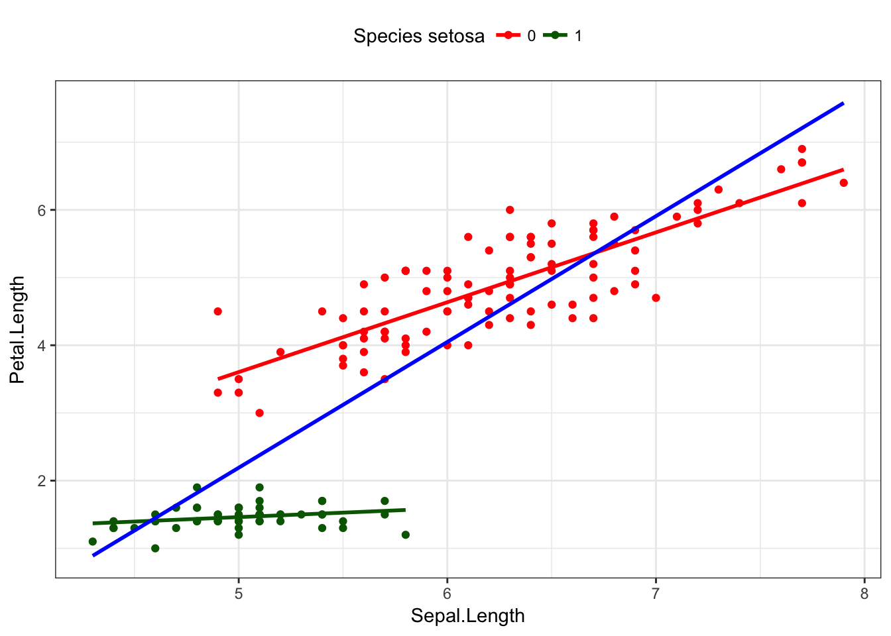

# Model Building {#model-building}

Model building methods are used mainly in exploratory situations where many independent variables have been measured, but a final model explaining the dependent variable has not been reached. You want to build a model that contains enough covariates to explain the model well, but still be parsimonious such that the model is still interpretable. 

This chapter introduces different types of covariates that can be used, stratified models, confounding and moderation. We then conclude with measures of model fit and methods to compare between competing models. 


## Categorical Predictors

Let's continue to model the length of the iris petal based on the length of the sepal, controlling for species. But here we'll keep species as a categorical variable. What happens if we just put the variable in the model? 


```r
summary(lm(Petal.Length ~ Sepal.Length + Species, data=iris))
## 
## Call:
## lm(formula = Petal.Length ~ Sepal.Length + Species, data = iris)
## 
## Residuals:
##      Min       1Q   Median       3Q      Max 
## -0.76390 -0.17875  0.00716  0.17461  0.79954 
## 
## Coefficients:
##                   Estimate Std. Error t value Pr(>|t|)    
## (Intercept)       -1.70234    0.23013  -7.397 1.01e-11 ***
## Sepal.Length       0.63211    0.04527  13.962  < 2e-16 ***
## Speciesversicolor  2.21014    0.07047  31.362  < 2e-16 ***
## Speciesvirginica   3.09000    0.09123  33.870  < 2e-16 ***
## ---
## Signif. codes:  0 '***' 0.001 '**' 0.01 '*' 0.05 '.' 0.1 ' ' 1
## 
## Residual standard error: 0.2826 on 146 degrees of freedom
## Multiple R-squared:  0.9749,	Adjusted R-squared:  0.9744 
## F-statistic:  1890 on 3 and 146 DF,  p-value: < 2.2e-16
```

Examine the coefficient names, `Speciesversicolor` and `Speciesvirginica`. R (and most software packages) automatically take a categorical variable and turn it into a series of binary indicator variables. Let's look at what the software program does in the background. Below is a sample of the iris data. The first column shows the row number, specifically I am only showing 2 sample rows from each species. The second column is the value of the sepal length, the third is the binary indicator for if the iris is from species _versicolor_, next the binary indicator for if the iris is from species _virginica_, and lastly the species as a 3 level categorical variable (which is what we're used to seeing at this point.)


----------------------------------------------------------------------------
 &nbsp;    Sepal.Length   Speciesversicolor   Speciesvirginica    Species   
--------- -------------- ------------------- ------------------ ------------
  **1**        5.1                0                  0             setosa   

  **2**        4.9                0                  0             setosa   

 **51**         7                 1                  0           versicolor 

 **52**        6.4                1                  0           versicolor 

 **101**       6.3                0                  1           virginica  

 **102**       5.8                0                  1           virginica  
----------------------------------------------------------------------------

### Factor variable coding

* Most commonly known as "Dummy coding". Not an informative term to use. 
* Better used term: Indicator variable
* Math notation: **I(gender == "Female")**. 
* A.k.a reference coding
* For a nominal X with K categories, define K indicator variables.
    - Choose a reference (referent) category:
    - Leave it out
    - Use remaining K-1 in the regression.
    - Often, the largest category is chosen as the reference category.

For the iris example, 2 indicator variables are created for _versicolor_ and _virginica_. Interpreting the regression coefficients are going to be **compared to the reference group**. In this case, it is species _setosa_. 

The mathematical model is now written as follows, where $x_{1}$ is Sepal Length, $x_{2}$ is the indicator for _versicolor_, and $x_{3}$ the indicator for _virginica_ 

$$ Y_{i} \sim \beta_{0} + \beta_{1}x_{i} + \beta_{2}x_{2i} + \beta_{3}x_{3i}+ \epsilon_{i}$$

Let's look at the regression coefficients and their 95% confidence intervals from the main effects model again. 


```r
main.eff.model <- lm(Petal.Length ~ Sepal.Length + Species, data=iris)
pander(main.eff.model)
```


---------------------------------------------------------------------
        &nbsp;           Estimate   Std. Error   t value   Pr(>|t|)  
----------------------- ---------- ------------ --------- -----------
    **(Intercept)**       -1.702      0.2301     -7.397    1.005e-11 

   **Sepal.Length**       0.6321     0.04527      13.96    1.121e-28 

 **Speciesversicolor**     2.21      0.07047      31.36    9.646e-67 

 **Speciesvirginica**      3.09      0.09123      33.87    4.918e-71 
---------------------------------------------------------------------

Table: Fitting linear model: Petal.Length ~ Sepal.Length + Species

```r
pander(confint(main.eff.model))
```


-----------------------------------------
        &nbsp;           2.5 %    97.5 % 
----------------------- -------- --------
    **(Intercept)**      -2.157   -1.248 

   **Sepal.Length**      0.5426   0.7216 

 **Speciesversicolor**   2.071    2.349  

 **Speciesvirginica**     2.91     3.27  
-----------------------------------------

In this _main effects_ model, Species only changes the intercept. The effect of species is not multiplied by Sepal length. The interpretations are the following: 

* $b_{1}$: After controlling for species, Petal length significantly increases with the length of the sepal (0.63, 95% CI 0.54-0.72, p<.0001). 
* $b_{2}$: _Versicolor_ has on average 2.2cm longer petal lengths compared to _setosa_ (95% CI 2.1-2.3, p<.0001). 
* $b_{3}$: _Virginica_ has on average 3.1cm longer petal lengths compared to _setosa_ (95% CI 2.9-3.3, p<.0001). 


### Wald test 

The Wald test is used for simultaneous tests of $Q$ variables in a model

* Consider a model with $P$ variables and you want to test if $Q$ additional variables are useful.   
* $H_{0}: Q$ additional variables are useless, i.e., their $\beta$'s all = 0  
* $H_{A}: Q$ additional variables are useful

This can be done in R by using the `regTermTest()` function in the `survey` package. 


```r
library(survey)
regTermTest(main.eff.model, "Species") 
## Wald test for Species
##  in lm(formula = Petal.Length ~ Sepal.Length + Species, data = iris)
## F =  624.9854  on  2  and  146  df: p= < 2.22e-16
```

##### Example 1: Employment status on depression score
Consider a model to predict depression using age, employment status and whether or not the person was chronically ill in the past year as covariates. This example uses the cleaned depression data set.


```r
depress <- read.delim("https://norcalbiostat.netlify.com/data/depress_081217.txt", header=TRUE,sep="\t")
full_model <- lm(cesd ~ age + chronill + employ, data=depress)
pander(summary(full_model))
```


---------------------------------------------------------------------
        &nbsp;           Estimate   Std. Error   t value   Pr(>|t|)  
----------------------- ---------- ------------ --------- -----------
    **(Intercept)**       11.48       1.502       7.646    3.191e-13 

        **age**           -0.133     0.03514     -3.785    0.0001873 

     **chronill**         2.688       1.024       2.625    0.009121  

 **employHouseperson**     6.75       1.797       3.757    0.0002083 

  **employIn School**     1.967       5.995       0.328     0.7431   

    **employOther**       4.897       4.278       1.145     0.2533   

     **employPT**         3.259       1.472       2.214     0.02765  

   **employRetired**      3.233       1.886       1.714     0.08756  

    **employUnemp**       7.632       2.339       3.263    0.001238  
---------------------------------------------------------------------


--------------------------------------------------------------
 Observations   Residual Std. Error   $R^2$    Adjusted $R^2$ 
-------------- --------------------- -------- ----------------
     294               8.385          0.1217      0.09704     
--------------------------------------------------------------

Table: Fitting linear model: cesd ~ age + chronill + employ

The results of this model show that age and chronic illness are statistically associated with CESD (each p<.006). However employment status shows mixed results. Some employment statuses are significantly different from the reference group, some are not. So overall, is employment status associated with depression? 

Recall that employment is a categorical variable, and all the coefficient estimates shown are the effect of being in that income category has on depression _compared to_ being employed full time. For example, the coefficient for PT employment is greater than zero, so they have a higher CESD score compared to someone who is fully employed. 

But what about employment status overall? Not all employment categories are significantly different from FT status. To test that employment status affects CESD we need to do a global test that all $\beta$'s are 0. 

$H_{0}: \beta_{3} = \beta_{4} = \beta_{5} = \beta_{6} = \beta_{7} = \beta_{8} = 0$  
$H_{A}$: At least one $\beta_{j}$ is not 0. 


```r
regTermTest(full_model, "employ")
## Wald test for employ
##  in lm(formula = cesd ~ age + chronill + employ, data = depress)
## F =  4.153971  on  6  and  285  df: p= 0.0005092
```

* Confirm that the degrees of freedom are correct. It should equal the # of categories in the variable you are testing, minus 1. 
    - Employment has 7 levels, so $df=6$. 
    - Or equivalently, the degrees of freedom are the number of $beta$'s you are testing to be 0. 
    
The p-value of this Wald test is significant, thus employment significantly predicts CESD score.


```r
load(url("https://norcalbiostat.netlify.com/data/addhealth_clean.Rdata"))
addhealth$smoke <- ifelse(addhealth$eversmoke_c=="Smoker", 1, 0)
```

#### Example 2: Blood Pressure
Consider a logistic model on smoking status (0= never smoked, 1=has smoked) using gender, income, and blood pressure class (`bp_class`) as predictors. 

$$
logit(Y) = \beta_{0} + \beta_{1}\mbox{(female)} + \beta_{2}\mbox{(income)} + \beta_{3}\mbox{(Pre-HTN)} 
+ \beta_{4}\mbox{(HTN-I)} + \beta_{5}\mbox{(HTN-II)}
$$


```r
bp.mod <- glm(smoke ~ female_c + income + bp_class, data=addhealth, family='binomial')
pander(summary(bp.mod))
```


---------------------------------------------------------------------
       &nbsp;           Estimate    Std. Error   z value   Pr(>|z|)  
--------------------- ------------ ------------ --------- -----------
   **(Intercept)**       1.046        0.1064      9.836    7.881e-23 

 **female_cFemale**     -0.6182      0.07617     -8.117    4.798e-16 

     **income**        -3.929e-06   1.411e-06    -2.785    0.005346  

 **bp_classPre-HTN**    0.07289      0.08206     0.8882     0.3745   

  **bp_classHTN-I**     -0.02072      0.1093     -0.1895    0.8497   

 **bp_classHTN-II**     0.02736       0.1888     0.1449     0.8848   
---------------------------------------------------------------------


(Dispersion parameter for  binomial  family taken to be  1 )


-------------------- ---------------------------
   Null deviance:     4853  on 3728  degrees of 
                               freedom          

 Residual deviance:   4769  on 3723  degrees of 
                               freedom          
-------------------- ---------------------------

It is unlikely that blood pressure is associated with smoking status, all groups are not statistically significantly different from the reference group (all p-values are large). Let's test that hypothesis formally using a Wald Test. 


```r
regTermTest(bp.mod, "bp_class")
## Wald test for bp_class
##  in glm(formula = smoke ~ female_c + income + bp_class, family = "binomial", 
##     data = addhealth)
## F =  0.428004  on  3  and  3723  df: p= 0.73294
```

The Wald Test has a large p-value of 0.73, thus blood pressure classification is not associated with smoking status.

* This means blood pressure classification should not be included in a model to explain smoking status. 

## Stratification

Stratified models examine the regression equations for each subgroup of the population and seeing if the relationship between the response and explanatory variables _changed_ for at least one subgroup. 

Consider the relationship between the length of an iris petal, and the length of it's sepal. Earlier we found that the iris species modified this relationship. Lets consider a binary indicator variable for species that groups _veriscolor_ and _virginica_ together. 


```r
iris$setosa <- ifelse(iris$Species=="setosa", 1, 0)
table(iris$setosa, iris$Species)
##    
##     setosa versicolor virginica
##   0      0         50        50
##   1     50          0         0
```

Within the _setosa_ species, there is little to no relationship between sepal and petal length. For the other two species, the relationship looks still significantly positive, but in the combined sample there appears to be a strong positive relationship (blue). 


```r
ggplot(iris, aes(x=Sepal.Length, y=Petal.Length, col=as.factor(setosa))) + 
            geom_point() + theme_bw() + theme(legend.position="top") + 
            scale_color_manual(name="Species setosa", values=c("red", "darkgreen")) + 
            geom_smooth(se=FALSE, method="lm") + 
            geom_smooth(aes(x=Sepal.Length, y=Petal.Length), col="blue", se=FALSE, method='lm')
```



The mathematical model describing the relationship between Petal length ($Y$), and Sepal length ($X$), for species _setosa_ ($s$) versus not-setosa ($n$), is written as follows: 

$$ Y_{is} \sim \beta_{0s} + \beta_{1s}*x_{i} + \epsilon_{is} \qquad \epsilon_{is} \sim \mathcal{N}(0,\sigma^{2}_{s})$$
$$ Y_{in} \sim \beta_{0n} + \beta_{1n}*x_{i} + \epsilon_{in} \qquad \epsilon_{in} \sim \mathcal{N}(0,\sigma^{2}_{n}) $$

In each model, the intercept, slope, and variance of the residuals can all be different. This is the unique and powerful feature of stratified models. The downside is that each model is only fit on the amount of data in that particular subset. Furthermore, each model has 3 parameters that need to be estimated: $\beta_{0}, \beta_{1}$, and $\sigma^{2}$, for a total of 6 for the two models. The more parameters that need to be estimated, the more data we need. 


## Moderation

Moderation occurs when the relationship between two variables depends on a third variable.

* The third variable is referred to as the moderating variable or simply the moderator. 
* The moderator affects the direction and/or strength of the relationship between the explanatory ($x$) and response ($y$) variable.
    - This tends to be an important 
* When testing a potential moderator, we are asking the question whether there is an association between two constructs, **but separately for different subgroups within the sample.**
    - This is also called a _stratified_ model, or a _subgroup analysis_.

Here are 3 scenarios demonstrating how a third variable can modify the relationship between the original two variables. 

**Scenario 1** - Significant relationship at bivariate level (saying expect the effect to exist in the entire population) then when test for moderation the third variable is a moderator if the strength (i.e., p-value is Non-Significant) of the relationship changes. Could just change strength for one level of third variable, not necessarily all levels of the third variable.

**Scenario 2** - Non-significant relationship at bivariate level (saying do not expect the effect to exist in the entire population) then when test for moderation the third variable is a moderator if the relationship becomes significant (saying expect to see it in at least one of the sub-groups or levels of third variable, but not in entire population because was not significant before tested for moderation). Could just become significant in one level of the third variable, not necessarily all levels of the third variable.

**Scenario 3** - Significant relationship at bivariate level (saying expect the effect to exist in the entire population) then when test for moderation the third variable is a moderator if the direction (i.e., means change order/direction) of the relationship changes. Could just change direction for one level of third variable, not necessarily all levels of the third variable.


### Example


## Interactions {#interactions}

If we care about how species _changes_ the relationship between petal and sepal length, we can fit a model with an **interaction** between sepal length ($x_{1}$) and species. For this first example let $x_{2}$ be an indicator for when `species == setosa` . Note that both _main effects_ of sepal length, and setosa species are also included in the model. Interactions are mathematically represented as a multiplication between the two variables that are interacting. 

$$ Y_{i} \sim \beta_{0} + \beta_{1}x_{i} + \beta_{2}x_{2i} + \beta_{3}x_{1i}x_{2i}$$

Ifwe evaluate this model for both levels of $x_{2}$, the resulting models are the same as the stratified models. 

When $x_{2} = 0$, the record is on an iris not from the _setosa_ species. 

$$ Y_{i} \sim \beta_{0} + \beta_{1}x_{i} + \beta_{2}(0) + \beta_{3}x_{1i}(0)$$
which simplifies to 
$$ Y_{i} \sim \beta_{0} + \beta_{1}x_{i}$$

When $x_{2} = 1$, the record is on an iris of the _setosa_ species. 

$$ Y_{i} \sim \beta_{0} + \beta_{1}x_{i} + \beta_{2}(1) + \beta_{3}x_{1i}(1)$$
which simplifies to
$$ Y_{i} \sim (\beta_{0} + \beta_{2}) + (\beta_{1} + \beta_{3})x_{i}$$

Each subgroup model has a different intercept and slope, but we had to estimate 4 parameters in the interaction model, and 6 for the fully stratified model. 


Interactions are fit in `R` by simply multiplying `*` the two variables together in the model statement. 

```r
summary(lm(Petal.Length ~ Sepal.Length + setosa + Sepal.Length*setosa, data=iris))
## 
## Call:
## lm(formula = Petal.Length ~ Sepal.Length + setosa + Sepal.Length * 
##     setosa, data = iris)
## 
## Residuals:
##      Min       1Q   Median       3Q      Max 
## -0.96754 -0.19948 -0.01386  0.22597  1.05479 
## 
## Coefficients:
##                     Estimate Std. Error t value Pr(>|t|)    
## (Intercept)         -1.55571    0.37509  -4.148 5.68e-05 ***
## Sepal.Length         1.03189    0.05957  17.322  < 2e-16 ***
## setosa               2.35877    0.88266   2.672  0.00839 ** 
## Sepal.Length:setosa -0.90026    0.17000  -5.296 4.28e-07 ***
## ---
## Signif. codes:  0 '***' 0.001 '**' 0.01 '*' 0.05 '.' 0.1 ' ' 1
## 
## Residual standard error: 0.3929 on 146 degrees of freedom
## Multiple R-squared:  0.9515,	Adjusted R-squared:  0.9505 
## F-statistic: 954.1 on 3 and 146 DF,  p-value: < 2.2e-16
```

The coefficient $b_{3}$ for the interaction term is significant, confirming that species changes the relationship between sepal length and petal length.

### Example


```r
summary(lm(Petal.Length ~ Sepal.Length + setosa + Sepal.Length*setosa, data=iris))
## 
## Call:
## lm(formula = Petal.Length ~ Sepal.Length + setosa + Sepal.Length * 
##     setosa, data = iris)
## 
## Residuals:
##      Min       1Q   Median       3Q      Max 
## -0.96754 -0.19948 -0.01386  0.22597  1.05479 
## 
## Coefficients:
##                     Estimate Std. Error t value Pr(>|t|)    
## (Intercept)         -1.55571    0.37509  -4.148 5.68e-05 ***
## Sepal.Length         1.03189    0.05957  17.322  < 2e-16 ***
## setosa               2.35877    0.88266   2.672  0.00839 ** 
## Sepal.Length:setosa -0.90026    0.17000  -5.296 4.28e-07 ***
## ---
## Signif. codes:  0 '***' 0.001 '**' 0.01 '*' 0.05 '.' 0.1 ' ' 1
## 
## Residual standard error: 0.3929 on 146 degrees of freedom
## Multiple R-squared:  0.9515,	Adjusted R-squared:  0.9505 
## F-statistic: 954.1 on 3 and 146 DF,  p-value: < 2.2e-16
```

* If $x_{2}=0$, then the effect of $x_{1}$ on $Y$ simplifies to: $\beta_{1}$
    * $b_{1}$ The effect of sepal length on petal length **for non-setosa species of iris** (`setosa=0`) 
    * For non-setosa species, the petal length increases 1.03cm for every additional cm of sepal length. 
* If $x_{2}=1$, then the effect of $x_{1}$ on $Y$ model simplifies to: $\beta_{1} + \beta_{3}$
    * For setosa species, the petal length increases by `1.03-0.9=0.13` cm for every additional cm of sepal length. 

\BeginKnitrBlock{rmdcaution}<div class="rmdcaution">The main effects ($b_{1}$, $b_{2}$) cannot be interpreted by themselves when there is an interaction in the model.</div>\EndKnitrBlock{rmdcaution}

Let's up the game now and look at the full interaction model with a categorical version of species. Recall $x_{1}$ is Sepal Length, $x_{2}$ is the indicator for _versicolor_, and $x_{3}$ the indicator for _virginica_ . 

$$ Y_{i} \sim \beta_{0} + \beta_{1}x_{i} + \beta_{2}x_{2i} + \beta_{3}x_{3i} + \beta_{4}x_{1i}x_{2i} + \beta_{5}x_{1i}x_{3i}+\epsilon_{i}$$

```r
summary(lm(Petal.Length ~ Sepal.Length + Species + Sepal.Length*Species, data=iris))
## 
## Call:
## lm(formula = Petal.Length ~ Sepal.Length + Species + Sepal.Length * 
##     Species, data = iris)
## 
## Residuals:
##      Min       1Q   Median       3Q      Max 
## -0.68611 -0.13442 -0.00856  0.15966  0.79607 
## 
## Coefficients:
##                                Estimate Std. Error t value Pr(>|t|)    
## (Intercept)                      0.8031     0.5310   1.512    0.133    
## Sepal.Length                     0.1316     0.1058   1.244    0.216    
## Speciesversicolor               -0.6179     0.6837  -0.904    0.368    
## Speciesvirginica                -0.1926     0.6578  -0.293    0.770    
## Sepal.Length:Speciesversicolor   0.5548     0.1281   4.330 2.78e-05 ***
## Sepal.Length:Speciesvirginica    0.6184     0.1210   5.111 1.00e-06 ***
## ---
## Signif. codes:  0 '***' 0.001 '**' 0.01 '*' 0.05 '.' 0.1 ' ' 1
## 
## Residual standard error: 0.2611 on 144 degrees of freedom
## Multiple R-squared:  0.9789,	Adjusted R-squared:  0.9781 
## F-statistic:  1333 on 5 and 144 DF,  p-value: < 2.2e-16
```

The slope of the relationship between sepal length and petal length is calculated as follows, for each species:   

* _setosa_ $(x_{2}=0, x_{3}=0): b_{1}=0.13$ 
* _versicolor_ $(x_{2}=1, x_{3}=0): b_{1} + b_{2} + b_{4} = 0.13+0.55 = 0.68$
* _virginica_ $(x_{2}=0, x_{3}=1): b_{1} + b_{3} + b_{5} = 0.13+0.62 = 0.75$

Compare this to the estimates gained from the stratified model: 


```r
coef(lm(Petal.Length ~ Sepal.Length, data=subset(iris, Species=="setosa")))
##  (Intercept) Sepal.Length 
##    0.8030518    0.1316317
coef(lm(Petal.Length ~ Sepal.Length, data=subset(iris, Species=="versicolor")))
##  (Intercept) Sepal.Length 
##    0.1851155    0.6864698
coef(lm(Petal.Length ~ Sepal.Length, data=subset(iris, Species=="virginica")))
##  (Intercept) Sepal.Length 
##    0.6104680    0.7500808
```

They're the same! Proof that an interaction is equivalent to stratification. 

### Example

What if we now wanted to include other predictors in the model? How does sepal length relate to petal length after controlling for petal width? We add the variable for petal width into the model


```r
summary(lm(Petal.Length ~ Sepal.Length + setosa + Sepal.Length*setosa + Petal.Width, data=iris))
## 
## Call:
## lm(formula = Petal.Length ~ Sepal.Length + setosa + Sepal.Length * 
##     setosa + Petal.Width, data = iris)
## 
## Residuals:
##      Min       1Q   Median       3Q      Max 
## -0.83519 -0.18278 -0.01812  0.17004  1.06968 
## 
## Coefficients:
##                     Estimate Std. Error t value Pr(>|t|)    
## (Intercept)         -0.86850    0.27028  -3.213  0.00162 ** 
## Sepal.Length         0.66181    0.05179  12.779  < 2e-16 ***
## setosa               1.83713    0.62355   2.946  0.00375 ** 
## Petal.Width          0.97269    0.07970  12.204  < 2e-16 ***
## Sepal.Length:setosa -0.61106    0.12213  -5.003 1.61e-06 ***
## ---
## Signif. codes:  0 '***' 0.001 '**' 0.01 '*' 0.05 '.' 0.1 ' ' 1
## 
## Residual standard error: 0.2769 on 145 degrees of freedom
## Multiple R-squared:  0.9761,	Adjusted R-squared:  0.9754 
## F-statistic:  1478 on 4 and 145 DF,  p-value: < 2.2e-16
```

So far, petal width, and the combination of species and sepal length are both significantly associated with petal length. 

_Note of caution: Stratification implies that the stratifying variable interacts with all other variables._ 
So if we were to go back to the stratified model where we fit the model of petal length on sepal length AND petal width, stratified by species, we would  be implying that species interacts with both sepal length and petal width. 

E.g. the following stratified model 

* $Y = A + B + C + D + C*D$, when D=1
* $Y = A + B + C + D + C*D$, when D=0

is the same as the following interaction model: 

* $Y = A + B + C + D + A*D + B*D + C*D$


## Variable Selection Process
We want to choose a set of independent variables that both will yield a good prediction using as few variables as possible. In many situations where regression is used, the investigator has strong justification for including certain variables in the model.

* previous studies
* accepted theory

The investigator may have prior justification for using certain variables but may be open to suggestions for the remaining variables.

The set of independent variables can be broken down into logical subsets

* The usual demographics are entered first (age, gender, ethnicity)
* A set of variables that other studies have shown to affect the dependent variable
* A third set of variables that _could_ be associated but the relationship has not yet been examined. 
  
Partially model-driven regression analysis and partially an exploratory analysis. 

\BeginKnitrBlock{rmdcaution}<div class="rmdcaution">Automated versions of variable selection processes should not be used blindly. </div>\EndKnitrBlock{rmdcaution}

### Confounding 

One primary purpose of a multivariable model is to assess the relationship between a particular explanatory variable $x$ and your response variable $y$, _after controlling for other factors_. 

As we just discussed, those other factors (characteristics/variables) could also be explaining part of the variability seen in $y$. 


> If the relationship between $x_{1}$ and $y$ is bivariately significant, but then no longer significant once $x_{2}$ has been added to the model, then $x_{2}$ is said to explain, or **confound**, the relationship between $x_{1}$ and $y$. 


### Automated selection procedures

* Forward selection: X variables added one at a time until optimal model reached
* Backward elimination: X variables removed one at a time until optimal model reached
* Stepwise selection: Combination of forward and backward. 

> "... perhaps the most serious source of error lies in letting statistical procedures make decisions for you."
> "Don't be too quick to turn on the computer. Bypassing the brain to compute by reflex is a sure recipe for disaster."
> _Good and Hardin, Common Errors in Statistics (and How to Avoid Them), p. 3, p. 152_

Take home message: Don't use these. 

* Stopping criteria and algorithm can be different for different software programs. 
* Can reject perfectly plausible models from later consideration
* Hides relationships between variables (X3 is added and now X1 is no longer significant. X1 vs X3 should be looked at)

### Best Subsets (PMA5 Section 8.7)

* Select one X with highest simple $r$ with Y
* Select two X’s with highest multiple $r$ with Y
* Select three X’s with highest multiple $r$ with Y
etc.
* Compute adjusted R2, AIC or BIC each time.
* Compare and choose among the "best subsets" of various sizes.

Ways to conduct best subsets regression in R: https://rstudio-pubs-static.s3.amazonaws.com/2897_9220b21cfc0c43a396ff9abf122bb351.html 

## Comparing between models
When working with multiple models, how do you choose between models? 
There are several measures we can use to compare between competing models. 


1. **Multiple $R^{2}$**
If the model explains a large amount of variation in the outcome that's good right? So we could consider using $R^{2}$ as a selection criteria and trying to find the model that maximizes this value. 

The residual sum of squares (RSS in the book or SSE) can be written as $\sum(Y-\hat{Y})^{2}(1-R^{2})$. Therefore minimizing the RSS is equivalent to maximizing the multiple correlation coefficient.  


Problem: The multiple $R^{2}$ _always_ increases as predictors are added to the model. 
    - Ex. 1: N = 100, P = 1, E($R^{2}$) = 0.01
    - Ex. 2: N = 21, P = 10, E($R^{2}$) = 0.5


Problem: $R^{2} = 1-\frac{Model SS}{Total SS}$ is biased: If population $R^{2}$ is really zero, then E($R^{2}$) = P/(N-1). 


2. **Adjusted $R^{2}$**
To alleviate bias use Mean squares instead of SS. 

$R^{2} = 1-\frac{Model MS}{Total MS}$

equivalently, 

$R^{2}_{adj} = R^{2} - \frac{p(1-R^{2})}{n-p-1}$

Now Adjusted $R^{2}$ is approximately unbiased and won't inflate as $p$ increases. 

3. **Mallows $C_{p}$**

$$
    C_{p} = (N-P-1)\left(\frac{RMSE}{\hat{\sigma}^{2}} -1 \right) + (P+1)
$$

* Smaller is better
* When all variables are chosen, $P+1$ is at it's maximum but the other part of $C_{p}$ is zero since $RMSE$==$\hat{\sigma}^{2}$


4. **Akaike Information Criterion (AIC)**

* A penalty is applied to the deviance that increases as the number of
  parameters $p$ increase. 
* Tries to find a parsimonious model that is closer to the “truth”.  
* Uses an information function, e.g., the likelihood function $(LL)$.

$$ AIC = -2LL + 2p$$

* Smaller is better
* Can also be written as a function of the residual sum of squares (RSS) (in book)

5. **Bayesian Information Criterion (BIC)**

* Similar to AIC. 
* Tries to find a parsimonious model that is more likely to be the “truth”. The smaller BIC, the better.

$$ BIC = -2LL + ln(N)*(P+1)$$ 

AIC vs BIC

* Both are “penalized likelihood” functions
* Each = -2log likelihood + penalty
* AIC: penalty = 2, BIC: penalty = ln(N)
* For any N > 7, ln(N) > 2
* Thus, BIC penalizes larger models more heavily.
* They often agree.
    - When they disagree, AIC chooses a larger model than BIC.


## What to watch out for
* Use previous research as a guide
* Variables not included can bias the results
* Significance levels are only a guide
* Perform model diagnostics after selection to check model fit. 
* _**Use common sense**_: A sub-optimal subset may make more sense than optimal one


