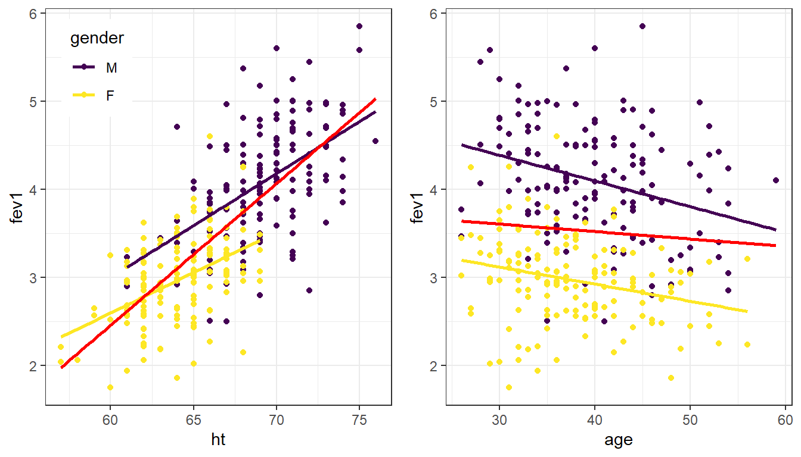

# Model Building {#model-building}

Model building methods are used mainly in exploratory situations where many independent variables have been measured, but a final model explaining the dependent variable has not been reached. You want to build a model that contains enough covariates to explain the model well, but still be parsimonious such that the model is still interpretable. 

This chapter introduces different types of covariates that can be used, stratified models, confounding and moderation. We then conclude with measures of model fit and methods to compare between competing models. 

## Stratification

Stratified models examine the regression equations for each subgroup of the population and seeing if the relationship between the response and explanatory variables _changed_ for at least one subgroup. 

Consider the relationship between the length of an iris petal, and the length of it's sepal. Earlier we found that the iris species modified this relationship. Lets consider a binary indicator variable for species that groups _veriscolor_ and _virginica_ together. 


```r
iris$setosa <- ifelse(iris$Species=="setosa", 1, 0)
table(iris$setosa, iris$Species)
##    
##     setosa versicolor virginica
##   0      0         50        50
##   1     50          0         0
```

Within the _setosa_ species, there is little to no relationship between sepal and petal length. For the other two species, the relationship looks still significantly positive, but in the combined sample there appears to be a strong positive relationship (blue). 


```r
ggplot(iris, aes(x=Sepal.Length, y=Petal.Length, col=as.factor(setosa))) + 
            geom_point() + theme_bw() + theme(legend.position="top") + 
            scale_color_manual(name="Species setosa", values=c("red", "darkgreen")) + 
            geom_smooth(se=FALSE, method="lm") + 
            geom_smooth(aes(x=Sepal.Length, y=Petal.Length), col="blue", se=FALSE, method='lm')
```


The mathematical model describing the relationship between Petal length ($Y$), and Sepal length ($X$), for species _setosa_ ($s$) versus not-setosa ($n$), is written as follows: 

$$ Y_{is} \sim \beta_{0s} + \beta_{1s}*x_{i} + \epsilon_{is} \qquad \epsilon_{is} \sim \mathcal{N}(0,\sigma^{2}_{s})$$
$$ Y_{in} \sim \beta_{0n} + \beta_{1n}*x_{i} + \epsilon_{in} \qquad \epsilon_{in} \sim \mathcal{N}(0,\sigma^{2}_{n}) $$

In each model, the intercept, slope, and variance of the residuals can all be different. This is the unique and powerful feature of stratified models. The downside is that each model is only fit on the amount of data in that particular subset. Furthermore, each model has 3 parameters that need to be estimated: $\beta_{0}, \beta_{1}$, and $\sigma^{2}$, for a total of 6 for the two models. The more parameters that need to be estimated, the more data we need. 


## Moderation

Moderation occurs when the relationship between two variables depends on a third variable.

* The third variable is referred to as the moderating variable or simply the moderator. 
* The moderator affects the direction and/or strength of the relationship between the explanatory ($x$) and response ($y$) variable.
    - This tends to be an important 
* When testing a potential moderator, we are asking the question whether there is an association between two constructs, **but separately for different subgroups within the sample.**
    - This is also called a _stratified_ model, or a _subgroup analysis_.

Here are 3 scenarios demonstrating how a third variable can modify the relationship between the original two variables. 

**Scenario 1** - Significant relationship at bivariate level (saying expect the effect to exist in the entire population) then when test for moderation the third variable is a moderator if the strength (i.e., p-value is Non-Significant) of the relationship changes. Could just change strength for one level of third variable, not necessarily all levels of the third variable.

**Scenario 2** - Non-significant relationship at bivariate level (saying do not expect the effect to exist in the entire population) then when test for moderation the third variable is a moderator if the relationship becomes significant (saying expect to see it in at least one of the sub-groups or levels of third variable, but not in entire population because was not significant before tested for moderation). Could just become significant in one level of the third variable, not necessarily all levels of the third variable.

**Scenario 3** - Significant relationship at bivariate level (saying expect the effect to exist in the entire population) then when test for moderation the third variable is a moderator if the direction (i.e., means change order/direction) of the relationship changes. Could just change direction for one level of third variable, not necessarily all levels of the third variable.

Recall that common analysis methods for analyzing bivariate relationships come in very few flavors: 

* Correlation (Q~Q)
* Linear Regression (Q~Q)
* $\chi^{2}$ (C~C)
* ANOVA (Q~C)


### Example 1: Sepal vs Petal Length

We just got done looking at the relationship between the length of an iris's Sepal, and the length (cm) of it's petal. 

```r
overall <- ggplot(iris, aes(x=Sepal.Length, y=Petal.Length)) + 
                geom_point() + geom_smooth(se=FALSE) + 
                theme_bw()

by_spec <- ggplot(iris, aes(x=Sepal.Length, y=Petal.Length, col=Species)) + 
                  geom_point() + geom_smooth(se=FALSE) + 
                  theme_bw() + theme(legend.position="top")

library(gridExtra)
grid.arrange(overall, by_spec , ncol=2)
```



 Is the relationship between sepal length and petal length the same within each species? 

Let's look at the correlation between these two continuous variables

_overall_

```r
cor(iris$Sepal.Length, iris$Petal.Length)
## [1] 0.8717538
```

_stratified by species_

```r
by(iris, iris$Species, function(x) cor(x$Sepal.Length, x$Petal.Length))
## iris$Species: setosa
## [1] 0.2671758
## -------------------------------------------------------- 
## iris$Species: versicolor
## [1] 0.754049
## -------------------------------------------------------- 
## iris$Species: virginica
## [1] 0.8642247
```

There is a strong, positive, linear relationship between the sepal length of the flower and the petal length when ignoring the species. The correlation coefficient $r$ for virginica and veriscolor are similar to the overall $r$ value, 0.86 and 0.75 respectively compared to 0.87. However the correlation between sepal and petal length for species setosa is only 0.26.

The points are clearly clustered by species, the slope of the lowess line between virginica and versicolor appear similar in strength, whereas the slope of the line for setosa is closer to zero. This would imply that petal length for Setosa may not be affected by the length of the sepal.

### Example 2: Simpson's Paradox

Sometimes moderating variables can result in what's known as _Simpson's Paradox_

https://en.wikipedia.org/wiki/Simpson%27s_paradox

## Interactions {#interactions}

If we care about how species _changes_ the relationship between petal and sepal length, we can fit a model with an **interaction** between sepal length ($x_{1}$) and species. For this first example let $x_{2}$ be an indicator for when `species == setosa` . Note that both _main effects_ of sepal length, and setosa species are also included in the model. Interactions are mathematically represented as a multiplication between the two variables that are interacting. 

$$ Y_{i} \sim \beta_{0} + \beta_{1}x_{i} + \beta_{2}x_{2i} + \beta_{3}x_{1i}x_{2i}$$

If we evaluate this model for both levels of $x_{2}$, the resulting models are the same as the stratified models. 

When $x_{2} = 0$, the record is on an iris not from the _setosa_ species. 

$$ Y_{i} \sim \beta_{0} + \beta_{1}x_{i} + \beta_{2}(0) + \beta_{3}x_{1i}(0)$$
which simplifies to 
$$ Y_{i} \sim \beta_{0} + \beta_{1}x_{i}$$

When $x_{2} = 1$, the record is on an iris of the _setosa_ species. 

$$ Y_{i} \sim \beta_{0} + \beta_{1}x_{i} + \beta_{2}(1) + \beta_{3}x_{1i}(1)$$
which simplifies to
$$ Y_{i} \sim (\beta_{0} + \beta_{2}) + (\beta_{1} + \beta_{3})x_{i}$$

Each subgroup model has a different intercept and slope, but we had to estimate 4 parameters in the interaction model, and 6 for the fully stratified model. 


Interactions are fit in `R` by simply multiplying `*` the two variables together in the model statement. 

```r
summary(lm(Petal.Length ~ Sepal.Length + setosa + Sepal.Length*setosa, data=iris))
## 
## Call:
## lm(formula = Petal.Length ~ Sepal.Length + setosa + Sepal.Length * 
##     setosa, data = iris)
## 
## Residuals:
##      Min       1Q   Median       3Q      Max 
## -0.96754 -0.19948 -0.01386  0.22597  1.05479 
## 
## Coefficients:
##                     Estimate Std. Error t value Pr(>|t|)    
## (Intercept)         -1.55571    0.37509  -4.148 5.68e-05 ***
## Sepal.Length         1.03189    0.05957  17.322  < 2e-16 ***
## setosa               2.35877    0.88266   2.672  0.00839 ** 
## Sepal.Length:setosa -0.90026    0.17000  -5.296 4.28e-07 ***
## ---
## Signif. codes:  0 '***' 0.001 '**' 0.01 '*' 0.05 '.' 0.1 ' ' 1
## 
## Residual standard error: 0.3929 on 146 degrees of freedom
## Multiple R-squared:  0.9515,	Adjusted R-squared:  0.9505 
## F-statistic: 954.1 on 3 and 146 DF,  p-value: < 2.2e-16
```

The coefficient $b_{3}$ for the interaction term is significant, confirming that species changes the relationship between sepal length and petal length.
 
### Example 1


```r
summary(lm(Petal.Length ~ Sepal.Length + setosa + Sepal.Length*setosa, data=iris))
## 
## Call:
## lm(formula = Petal.Length ~ Sepal.Length + setosa + Sepal.Length * 
##     setosa, data = iris)
## 
## Residuals:
##      Min       1Q   Median       3Q      Max 
## -0.96754 -0.19948 -0.01386  0.22597  1.05479 
## 
## Coefficients:
##                     Estimate Std. Error t value Pr(>|t|)    
## (Intercept)         -1.55571    0.37509  -4.148 5.68e-05 ***
## Sepal.Length         1.03189    0.05957  17.322  < 2e-16 ***
## setosa               2.35877    0.88266   2.672  0.00839 ** 
## Sepal.Length:setosa -0.90026    0.17000  -5.296 4.28e-07 ***
## ---
## Signif. codes:  0 '***' 0.001 '**' 0.01 '*' 0.05 '.' 0.1 ' ' 1
## 
## Residual standard error: 0.3929 on 146 degrees of freedom
## Multiple R-squared:  0.9515,	Adjusted R-squared:  0.9505 
## F-statistic: 954.1 on 3 and 146 DF,  p-value: < 2.2e-16
```

* If $x_{2}=0$, then the effect of $x_{1}$ on $Y$ simplifies to: $\beta_{1}$
    * $b_{1}$ The effect of sepal length on petal length **for non-setosa species of iris** (`setosa=0`) 
    * For non-setosa species, the petal length increases 1.03cm for every additional cm of sepal length. 
* If $x_{2}=1$, then the effect of $x_{1}$ on $Y$ model simplifies to: $\beta_{1} + \beta_{3}$
    * For setosa species, the petal length increases by `1.03-0.9=0.13` cm for every additional cm of sepal length. 

\BeginKnitrBlock{rmdcaution}<div class="rmdcaution">The main effects ($b_{1}$, $b_{2}$) cannot be interpreted by themselves when there is an interaction in the model.</div>\EndKnitrBlock{rmdcaution}

Let's up the game now and look at the full interaction model with a categorical version of species. Recall $x_{1}$ is Sepal Length, $x_{2}$ is the indicator for _versicolor_, and $x_{3}$ the indicator for _virginica_ . 

$$ Y_{i} \sim \beta_{0} + \beta_{1}x_{i} + \beta_{2}x_{2i} + \beta_{3}x_{3i} + \beta_{4}x_{1i}x_{2i} + \beta_{5}x_{1i}x_{3i}+\epsilon_{i}$$

```r
summary(lm(Petal.Length ~ Sepal.Length + Species + Sepal.Length*Species, data=iris))
## 
## Call:
## lm(formula = Petal.Length ~ Sepal.Length + Species + Sepal.Length * 
##     Species, data = iris)
## 
## Residuals:
##      Min       1Q   Median       3Q      Max 
## -0.68611 -0.13442 -0.00856  0.15966  0.79607 
## 
## Coefficients:
##                                Estimate Std. Error t value Pr(>|t|)    
## (Intercept)                      0.8031     0.5310   1.512    0.133    
## Sepal.Length                     0.1316     0.1058   1.244    0.216    
## Speciesversicolor               -0.6179     0.6837  -0.904    0.368    
## Speciesvirginica                -0.1926     0.6578  -0.293    0.770    
## Sepal.Length:Speciesversicolor   0.5548     0.1281   4.330 2.78e-05 ***
## Sepal.Length:Speciesvirginica    0.6184     0.1210   5.111 1.00e-06 ***
## ---
## Signif. codes:  0 '***' 0.001 '**' 0.01 '*' 0.05 '.' 0.1 ' ' 1
## 
## Residual standard error: 0.2611 on 144 degrees of freedom
## Multiple R-squared:  0.9789,	Adjusted R-squared:  0.9781 
## F-statistic:  1333 on 5 and 144 DF,  p-value: < 2.2e-16
```

The slope of the relationship between sepal length and petal length is calculated as follows, for each species:   

* _setosa_ $(x_{2}=0, x_{3}=0): b_{1}=0.13$ 
* _versicolor_ $(x_{2}=1, x_{3}=0): b_{1} + b_{2} + b_{4} = 0.13+0.55 = 0.68$
* _virginica_ $(x_{2}=0, x_{3}=1): b_{1} + b_{3} + b_{5} = 0.13+0.62 = 0.75$

Compare this to the estimates gained from the stratified model: 


```r
coef(lm(Petal.Length ~ Sepal.Length, data=subset(iris, Species=="setosa")))
##  (Intercept) Sepal.Length 
##    0.8030518    0.1316317
coef(lm(Petal.Length ~ Sepal.Length, data=subset(iris, Species=="versicolor")))
##  (Intercept) Sepal.Length 
##    0.1851155    0.6864698
coef(lm(Petal.Length ~ Sepal.Length, data=subset(iris, Species=="virginica")))
##  (Intercept) Sepal.Length 
##    0.6104680    0.7500808
```

They're the same! Proof that an interaction is equivalent to stratification. 

### Example 2

What if we now wanted to include other predictors in the model? How does sepal length relate to petal length after controlling for petal width? We add the variable for petal width into the model


```r
summary(lm(Petal.Length ~ Sepal.Length + setosa + Sepal.Length*setosa + Petal.Width, data=iris))
## 
## Call:
## lm(formula = Petal.Length ~ Sepal.Length + setosa + Sepal.Length * 
##     setosa + Petal.Width, data = iris)
## 
## Residuals:
##      Min       1Q   Median       3Q      Max 
## -0.83519 -0.18278 -0.01812  0.17004  1.06968 
## 
## Coefficients:
##                     Estimate Std. Error t value Pr(>|t|)    
## (Intercept)         -0.86850    0.27028  -3.213  0.00162 ** 
## Sepal.Length         0.66181    0.05179  12.779  < 2e-16 ***
## setosa               1.83713    0.62355   2.946  0.00375 ** 
## Petal.Width          0.97269    0.07970  12.204  < 2e-16 ***
## Sepal.Length:setosa -0.61106    0.12213  -5.003 1.61e-06 ***
## ---
## Signif. codes:  0 '***' 0.001 '**' 0.01 '*' 0.05 '.' 0.1 ' ' 1
## 
## Residual standard error: 0.2769 on 145 degrees of freedom
## Multiple R-squared:  0.9761,	Adjusted R-squared:  0.9754 
## F-statistic:  1478 on 4 and 145 DF,  p-value: < 2.2e-16
```

So far, petal width, and the combination of species and sepal length are both significantly associated with petal length. 

_Note of caution: Stratification implies that the stratifying variable interacts with all other variables._ 
So if we were to go back to the stratified model where we fit the model of petal length on sepal length AND petal width, stratified by species, we would  be implying that species interacts with both sepal length and petal width. 

E.g. the following stratified model 

* $Y = A + B + C + D + C*D$, when D=1
* $Y = A + B + C + D + C*D$, when D=0

is the same as the following interaction model: 

* $Y = A + B + C + D + A*D + B*D + C*D$


### Example 3: The relationship between income, employment status and depression. 
This example follows section \@ref(mlogreg). 

Here I create the binary indicators of `lowincome` (annual income <$10k/year) and underemployed (part time or unemployed).


```r
depress$lowincome <- ifelse(depress$income < 10, 1, 0)
table(depress$lowincome, depress$income, useNA="always")
##       
##         2  4  5  6  7  8  9 11 12 13 15 16 18 19 20 23 24 25 26 27 28 31
##   0     0  0  0  0  0  0  0 17  2 18 24  1  1 25  3 25  2  1  1  1 19  1
##   1     7  8 10 12 18 14 22  0  0  0  0  0  0  0  0  0  0  0  0  0  0  0
##   <NA>  0  0  0  0  0  0  0  0  0  0  0  0  0  0  0  0  0  0  0  0  0  0
##       
##        32 35 36 37 42 45 55 65 <NA>
##   0     1 24  1  1  1 15  9 10    0
##   1     0  0  0  0  0  0  0  0    0
##   <NA>  0  0  0  0  0  0  0  0    0

depress$underemployed <- ifelse(depress$employ %in% c("PT", "Unemp"), 1, 0 )
table(depress$underemployed, depress$employ, useNA="always")
##       
##         FT Houseperson In School Other  PT Retired Unemp <NA>
##   0    167          27         2     4   0      38     0    0
##   1      0           0         0     0  42       0    14    0
##   <NA>   0           0         0     0   0       0     0    0
```

The **Main Effects** model assumes that the effect of income on depression is independent of employment status, and the effect of employment status on depression is independent of income. 


```r
me_model <- glm(cases ~ lowincome + underemployed, data=depress, family="binomial")
summary(me_model)
## 
## Call:
## glm(formula = cases ~ lowincome + underemployed, family = "binomial", 
##     data = depress)
## 
## Deviance Residuals: 
##     Min       1Q   Median       3Q      Max  
## -0.9085  -0.5843  -0.5279  -0.5279   2.0197  
## 
## Coefficients:
##               Estimate Std. Error z value Pr(>|z|)    
## (Intercept)    -1.9003     0.2221  -8.556  < 2e-16 ***
## lowincome       0.2192     0.3353   0.654  0.51322    
## underemployed   1.0094     0.3470   2.909  0.00363 ** 
## ---
## Signif. codes:  0 '***' 0.001 '**' 0.01 '*' 0.05 '.' 0.1 ' ' 1
## 
## (Dispersion parameter for binomial family taken to be 1)
## 
##     Null deviance: 268.12  on 293  degrees of freedom
## Residual deviance: 259.93  on 291  degrees of freedom
## AIC: 265.93
## 
## Number of Fisher Scoring iterations: 4
```

To formally test whether an interaction term is necessary, we add the interaction term into the model and assess whether the coefficient for the interaction term is significantly different from zero. 

```r
me_intx_model <- glm(cases ~ lowincome + underemployed + lowincome*underemployed, data=depress, family="binomial") 
summary(me_intx_model)
## 
## Call:
## glm(formula = cases ~ lowincome + underemployed + lowincome * 
##     underemployed, family = "binomial", data = depress)
## 
## Deviance Residuals: 
##     Min       1Q   Median       3Q      Max  
## -1.3537  -0.5790  -0.5790  -0.4717   2.1219  
## 
## Coefficients:
##                         Estimate Std. Error z value Pr(>|z|)    
## (Intercept)              -1.7011     0.2175  -7.822 5.21e-15 ***
## lowincome                -0.4390     0.4324  -1.015  0.31005    
## underemployed             0.2840     0.4501   0.631  0.52802    
## lowincome:underemployed   2.2615     0.7874   2.872  0.00408 ** 
## ---
## Signif. codes:  0 '***' 0.001 '**' 0.01 '*' 0.05 '.' 0.1 ' ' 1
## 
## (Dispersion parameter for binomial family taken to be 1)
## 
##     Null deviance: 268.12  on 293  degrees of freedom
## Residual deviance: 251.17  on 290  degrees of freedom
## AIC: 259.17
## 
## Number of Fisher Scoring iterations: 4
```


## Confounding 

One primary purpose of a multivariable model is to assess the relationship between a particular explanatory variable $x$ and your response variable $y$, _after controlling for other factors_. 


Credit: [A blog about statistical musings](https://significantlystatistical.wordpress.com/2014/12/12/confounders-mediators-moderators-and-covariates/)


\BeginKnitrBlock{rmdnote}<div class="rmdnote">Easy to read short article from a Gastroenterology journal on how to control confounding effects by statistical analysis. https://www.ncbi.nlm.nih.gov/pmc/articles/PMC4017459/</div>\EndKnitrBlock{rmdnote}

Other factors (characteristics/variables) could also be explaining part of the variability seen in $y$. 

> If the relationship between $x_{1}$ and $y$ is bivariately significant, but then no longer significant once $x_{2}$ has been added to the model, then $x_{2}$ is said to explain, or **confound**, the relationship between $x_{1}$ and $y$.

Steps to determine if a variable $x_{2}$ is a confounder. 

1. Fit a regression model on $y \sim x_{1}$. 
2. If $x_{1}$ is not significantly associated with $y$, STOP. Re-read the "IF" part of the definition of a confounder. 
3. Fit a regression model on $y \sim x_{1} + x_{2}$. 
4. Look at the p-value for $x_{1}$. One of two things will have happened. 
    - If $x_{1}$ is still significant, then $x_{2}$ does NOT confound (or explain) the relationship between $y$ and $x_{1}$. 
    - If $x_{1}$ is NO LONGER significantly associated with $y$, then $x_{2}$ IS a confounder. 
    
    
Note that this is a two way relationship. The order of $x_{1}$ and $x_{2}$ is invaraiant. If you were to add $x_{2}$ to the model before $x_{1}$ you may see the same thing occur. That is - both variables are explaining the same portion of the variance in $y$. 

### Example: Does smoking affect pulse rate? 

Prior studies have indicate that smoking is associated with high blood pressure. Is smoking also associated with your pulse rate? 


First we consider the bivariate relationship between pulse rate (`H4PR`) and cigarette smoking as measured by the quantity of cigarettes smoked each day during the past 30 days (`H4TO6`). 

```r
lm(H4PR ~ H4TO6 , data=addhealth) %>% summary()
## 
## Call:
## lm(formula = H4PR ~ H4TO6, data = addhealth)
## 
## Residuals:
##     Min      1Q  Median      3Q     Max 
## -30.826  -8.548  -0.687   7.258 120.841 
## 
## Coefficients:
##             Estimate Std. Error t value Pr(>|t|)    
## (Intercept)  73.7702     0.4953 148.936  < 2e-16 ***
## H4TO6         0.1389     0.0396   3.507 0.000464 ***
## ---
## Signif. codes:  0 '***' 0.001 '**' 0.01 '*' 0.05 '.' 0.1 ' ' 1
## 
## Residual standard error: 12.56 on 1761 degrees of freedom
##   (4741 observations deleted due to missingness)
## Multiple R-squared:  0.006936,	Adjusted R-squared:  0.006372 
## F-statistic:  12.3 on 1 and 1761 DF,  p-value: 0.0004644
```

As the number of cigarettes smoked each day increases by one, a persons pulse rate significantly increases by 0.13. 

However, there are more ways to assess the amount someone smokes. Consider a different measure of smoking, "during the past 30 days, on how many days did you smoke cigarettes?" (`H4TO5`). So here we are measuring the # of days smoked, not the # of cigarettes per day. If we include both in the model, we note that the earlier measure of smoking `H4TO6` is no longer significant (at the 0.05 level). 


```r
lm(H4PR ~ H4TO5 +  H4TO6 , data=addhealth) %>% summary()
## 
## Call:
## lm(formula = H4PR ~ H4TO5 + H4TO6, data = addhealth)
## 
## Residuals:
##     Min      1Q  Median      3Q     Max 
## -31.682  -8.509  -1.014   7.302 120.320 
## 
## Coefficients:
##             Estimate Std. Error t value Pr(>|t|)    
## (Intercept) 72.78932    0.68037 106.985   <2e-16 ***
## H4TO5        0.06870    0.03271   2.101   0.0358 *  
## H4TO6        0.08292    0.04769   1.739   0.0822 .  
## ---
## Signif. codes:  0 '***' 0.001 '**' 0.01 '*' 0.05 '.' 0.1 ' ' 1
## 
## Residual standard error: 12.55 on 1760 degrees of freedom
##   (4741 observations deleted due to missingness)
## Multiple R-squared:  0.00942,	Adjusted R-squared:  0.008294 
## F-statistic: 8.368 on 2 and 1760 DF,  p-value: 0.0002415
```

Thus, the number of days smoked _confounds_ the relationship between the number of cigarettes smoked per day, and the person's pulse rate. 


Additional example interpretations from models not shown here. 

* After adjusting for the potential confounding factor of gender, being overweight (OR 0.920, CI 0.822 – 1.028, p = .1420) was not significantly associated with the likelihood of participating in an active sport. In this analysis, the odds ratio tells us that those adolescents who are overweight are 0.920 times less likely to participate in an active sport. Based on these analyses, gender is a confounding factor because the association between being overweight and active sport participation is no longer significant after accounting for gender.
* After adjusting for the potential confounding factor of gender, being overweight (OR 3.65, CI 1.573 – 4.891, p = .0001) was significantly and positively associated with the likelihood of participating in an active sport. In this analysis, the odds ratio tells us that those adolescents who are overweight are 3.65 times more likely to participate in an active sport. Based on these analyses, gender is not a confounding factor because the association between being overweight and active sport participation is still significant after accounting for gender. 
 

## Variable Selection Process

> Ref: PMA6 CH 9

Variable selection methods such as the ones described in this section, are most often used when performing an _Exploratory_ analysis, where many independent variables have been measured, but a final model to explain the variability of a dependent variable has not yet been determined. 

When building a model, we want to choose a set of independent variables that both will yield a good prediction using as few variables as possible (_parsimony_). We also need to consider controlling for moderators and confounders. In many situations where regression is used, the investigator has strong justification for including certain variables in the model.

* previous studies
* accepted theory

The investigator may have prior justification for using certain variables but may be open to suggestions for the remaining variables.

The set of independent variables can be broken down into logical subsets

1. **Factors of primary interest**. (such as an exposure or treatment)
2. **Potential confounders**. These are measures that could be associated with both the response, and explanatory variables, and which could _explain_ the relationship between the primary factor of interest and the outcome. These are typically a set of demographics such as age, gender, ethnicity, and tend to be factors found to be important in prior studies. 
3. **Effect Modifiers (Moderators)**. A set of variables that other studies have shown to change or affect the relationship between the explanatory and response variables. 
4. **Precision variables (covariates)**. Variables associated with the dependent variable, but not the primary factor of interest. 
  

How variables are chosen for inclusion into a model is heavily driven by the purpose of the model: 

* descriptive
* predictive 


### Automated selection procedures


_Forward selection_: Variables are added one at a time until optimal model reached. 

1. Choose the variable with the highest absolute correlation $\mid r \mid$ with the outcome.
2. Choose the next variable that maximizes the model adjusted $R^{2}$. 
3. Repeat until adding additional variables does not improve the model fit significantly. 

_Backward elimination_: Variables are removed one at a time until optimal model reached

1. Put all variables into the model. 
2. Remove the least useful variable in the model. This can be done by choosing the variable with the largest $p$-value. 
3. Repeat until removing additional variables reduces the model fit significantly. 


_Stepwise selection_: Combination of forward and backward. 

0. Start with no variables (just $\bar{Y}$)
1. Add the variable that results in the greatest improvement in model fit. 
2. Add another variable that results in the greatest improvement in model fit after controlling for the first. 
3. Check to see if removing any variable currently in the model improves the fit. 
4. Add another variable...
5. Check to remove variables...
6. Repeat until no variables can be added or removed. 

Most programs have the option to **force** variables to be included in the model. This is important in cases where there is a primary factor of interest such as a treatment effect. 


\BeginKnitrBlock{rmdcaution}<div class="rmdcaution">Automated versions of variable selection processes should not be used blindly. </div>\EndKnitrBlock{rmdcaution}


> "... perhaps the most serious source of error lies in letting statistical procedures make decisions for you."
> "Don't be too quick to turn on the computer. Bypassing the brain to compute by reflex is a sure recipe for disaster."
> _Good and Hardin, Common Errors in Statistics (and How to Avoid Them), p. 3, p. 152_

Warnings: 

* Stopping criteria and algorithm can be different for different software programs. 
* Can reject perfectly plausible models from later consideration
* Hides relationships between variables (X3 is added and now X1 is no longer significant. X1 vs X3 should be looked at)


_Best Subsets_

* Select one X with highest simple $r$ with Y
* Select two X’s with highest multiple $r$ with Y
* Select three X’s with highest multiple $r$ with Y
etc.
* Compute adjusted R2, AIC or BIC each time.
* Compare and choose among the "best subsets" of various sizes.

Ways to conduct best subsets regression in R: https://rstudio-pubs-static.s3.amazonaws.com/2897_9220b21cfc0c43a396ff9abf122bb351.html 


## Wald test (General F) {#general-F}

The Wald test is used for simultaneous tests of $Q$ variables in a model

Consider a model with $P$ variables and you want to test if $Q$ additional variables are useful.   

* $H_{0}: Q$ additional variables are useless, i.e., their $\beta$'s all = 0  
* $H_{A}: Q$ additional variables are useful

The traditional test statistic that we've seen since Intro stats is
$\frac{\hat{\theta}-\theta}{\sqrt{Var(\hat{\theta})}}$

The Wald test generalizes this test _any_ linear combination of predictors. 

$$
(R\hat{\theta}_{n}-r)^{'}[R({\hat{V}}_{n}/n)R^{'}]^{-1}
(R\hat{\theta}_{n}-r)
\quad \xrightarrow{\mathcal{D}}  \quad F(Q,n-P)
$$

Where $\mathbf{R}$ is the vector of coefficients for the $\beta$, and $\hat{V}_{n}$ is a consistent estimator of the covariance matrix. Instead of a normal distribution, this test statistic has an $F$ distribution with $Q$ and $n-P$ degrees of freedom. 

In the case where we're testing $\beta_{p}=\beta_{q}=...=0$, $\mathbf{R}$ is all 1's. 


##### Example: Employment status on depression score
Consider a model to predict depression using age, employment status and whether or not the person was chronically ill in the past year as covariates. This example uses the cleaned depression data set.


```r
full_model <- lm(cesd ~ age + chronill + employ, data=depress)
pander(summary(full_model))
```


---------------------------------------------------------------------
        &nbsp;           Estimate   Std. Error   t value   Pr(>|t|)  
----------------------- ---------- ------------ --------- -----------
    **(Intercept)**       11.48       1.502       7.646    3.191e-13 

        **age**           -0.133     0.03514     -3.785    0.0001873 

     **chronill**         2.688       1.024       2.625    0.009121  

 **employHouseperson**     6.75       1.797       3.757    0.0002083 

  **employIn School**     1.967       5.995       0.328     0.7431   

    **employOther**       4.897       4.278       1.145     0.2533   

     **employPT**         3.259       1.472       2.214     0.02765  

   **employRetired**      3.233       1.886       1.714     0.08756  

    **employUnemp**       7.632       2.339       3.263    0.001238  
---------------------------------------------------------------------


--------------------------------------------------------------
 Observations   Residual Std. Error   $R^2$    Adjusted $R^2$ 
-------------- --------------------- -------- ----------------
     294               8.385          0.1217      0.09704     
--------------------------------------------------------------

Table: Fitting linear model: cesd ~ age + chronill + employ

The results of this model show that age and chronic illness are statistically associated with CESD (each p<.006). However employment status shows mixed results. Some employment statuses are significantly different from the reference group, some are not. So overall, is employment status associated with depression? 

Recall that employment is a categorical variable, and all the coefficient estimates shown are the effect of being in that income category has on depression _compared to_ being employed full time. For example, the coefficient for PT employment is greater than zero, so they have a higher CESD score compared to someone who is fully employed. 

But what about employment status overall? Not all employment categories are significantly different from FT status. To test that employment status affects CESD we need to do a global test that all $\beta$'s related to employment status are 0. 


$H_{0}: \beta_{3} = \beta_{4} = \beta_{5} = \beta_{6} = \beta_{7} = \beta_{8} = 0$  
$H_{A}$: At least one $\beta_{j}$ is not 0. 


```r
survey::regTermTest(full_model, "employ")
## Wald test for employ
##  in lm(formula = cesd ~ age + chronill + employ, data = depress)
## F =  4.153971  on  6  and  285  df: p= 0.0005092
```

* Confirm that the degrees of freedom are correct. It should equal the # of categories in the variable you are testing, minus 1. 
    - Employment has 7 levels, so $df=6$. 
    - Or equivalently, the degrees of freedom are the number of $beta$'s you are testing to be 0. 
    
The p-value of this Wald test is significant, thus employment significantly predicts CESD score.

 What does the vector of coefficients $R$ look like here? 


## Lasso

**L**east **A**bsolute **S**hrinkage and **S**election **O**perator.

Goal is to minimize

$$
RSS + \lambda \sum_{j}\mid \beta_{j} \ \mid
$$

where $\lambda$ is a model complexity penalty parameter. 

* Used during cross-validation and AIC/BIC
* "Shrinks" the coefficients, setting some to exactly 0. 

\BeginKnitrBlock{rmdnote}<div class="rmdnote">Appropriate inference after model selection is currently under research. No unifying theory exists yet. </div>\EndKnitrBlock{rmdnote}

* For now, use lasso to choose variables, then fit a model with only those selected variables in the final model. 
* Variables chosen in this manner are important, yet biased estimates. 


## Comparing between models {#model-fit-criteria}

The goal: Find the subset of independent variables that optimizes (either minimize or maximize) a certain criteria. In other words, the goal is to find the optimal model. 

 How do we measure "optimal"? 


First we need to look at two quantities: 

### RSS: Residual Sum of Squares

Recall the method of least squares introduced in section \@ref(mlr) minimies the residual sum of squares around the regression plane. This value is central to all following model comparison. How ``far away" are the model estimates from the observed? 

$$
\sum(Y - \bar{Y})^{2}(1-R^{2})  
$$


### Likelihood function

What is the likelihood that we observed the data $x$, given parameter values $\theta$. 
$$
\mathcal{L}(\theta \mid x)=p_{\theta }(x)=P_{\theta }(X=x)
$$

* For strictly convenient mathematical matters, we tend to work with the **log-likelihood** (LL).  
* Great because $log$ is a monotonic increasing function, maximizing the LL = maximizing the likelihood function.  
* We can compare between models using functions based off the LL. 

----

There are several measures we can use to compare between competing models. 

### General F Test

Two nested models are similar if the p-value for the General F-test is non-significant at a .15 level.


### Multiple $R^{2}$
If the model explains a large amount of variation in the outcome that's good right? So we could consider using $R^{2}$ as a selection criteria and trying to find the model that maximizes this value. 


* Problem: The multiple $R^{2}$ _always_ increases as predictors are added to the model. 
    - Ex. 1: N = 100, P = 1, E($R^{2}$) = 0.01
    - Ex. 2: N = 21, P = 10, E($R^{2}$) = 0.5
* Problem: $R^{2} = 1-\frac{Model SS}{Total SS}$ is biased: If population $R^{2}$ is really zero, then E($R^{2}$) = P/(N-1). 


### Adjusted $R^{2}$
To alleviate bias use Mean squares instead of SS. 

$R^{2} = 1-\frac{Model MS}{Total MS}$

equivalently, 

$R^{2}_{adj} = R^{2} - \frac{p(1-R^{2})}{n-p-1}$

Now Adjusted $R^{2}$ is approximately unbiased and won't inflate as $p$ increases. 

### Mallows $C_{p}$

$$
    C_{p} = (N-P-1)\left(\frac{RMSE}{\hat{\sigma}^{2}} -1 \right) + (P+1)
$$

where $RMSE = \frac{RSS}{N-P-1}$. 

* Smaller is better
* When all variables are chosen, $P+1$ is at it's maximum but the other part of $C_{p}$ is zero since $RMSE$==$\hat{\sigma}^{2}$


### Akaike Information Criterion (AIC)

* A penalty is applied to the deviance that increases as the number of parameters $p$ increase. 
* Tries to find a parsimonious model that is closer to the “truth”.  
* Uses an information function, e.g., the likelihood function $(LL)$.

$$ AIC = -2LL + 2p$$

* Smaller is better
* Can also be written as a function of the residual sum of squares (RSS) (in book)
* Estimates the information in one model _relative to other models_
    - So if all models suck, your AIC will just tell you which one sucks less. 


### Bayesian Information Criterion (BIC)

* Similar to AIC. 
* Tries to find a parsimonious model that is more likely to be the “truth”. The smaller BIC, the better.

$$ BIC = -2LL + ln(N)*(P+1)$$ 

### AIC vs BIC

* Both are “penalized likelihood” functions
* Each = -2log likelihood + penalty
* AIC: penalty = 2, BIC: penalty = ln(N)
* For any N > 7, ln(N) > 2
* Thus, BIC penalizes larger models more heavily.
* They often agree.
    - When they disagree, AIC chooses a larger model than BIC.


## What to watch out for
* Multicollinearity
* Missing Data
* Use previous research as a guide
* Variables not included can bias the results
* Significance levels are only a guide
* Perform model diagnostics after selection to check model fit. 
* _**Use common sense**_: A sub-optimal subset may make more sense than optimal one


