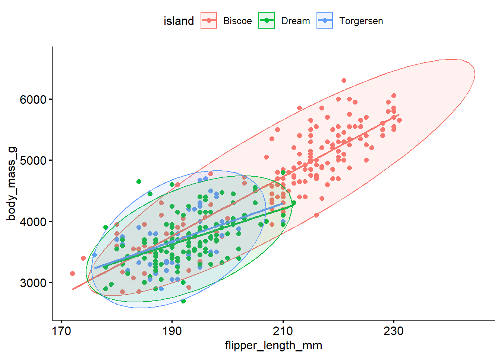
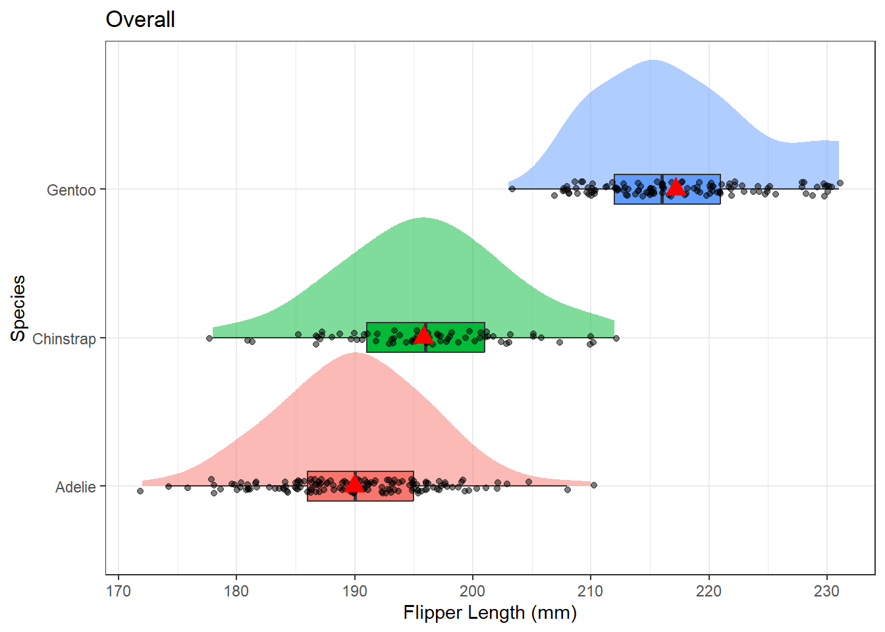
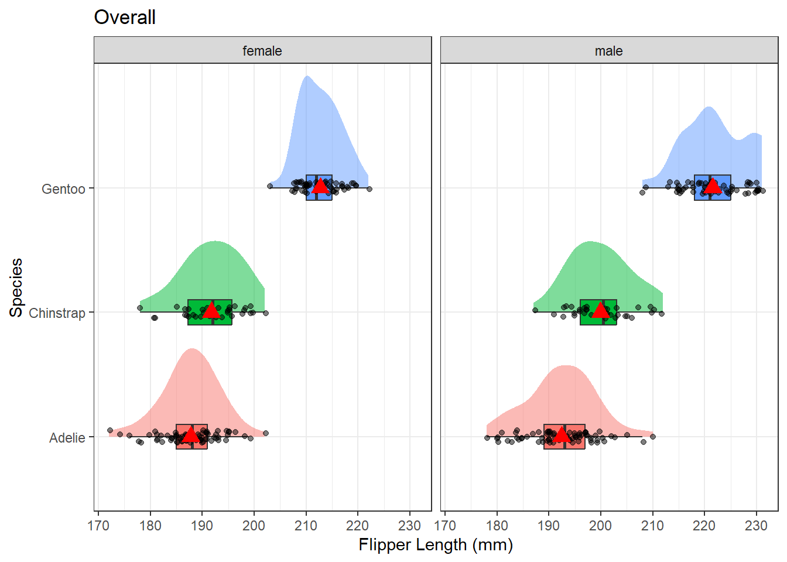
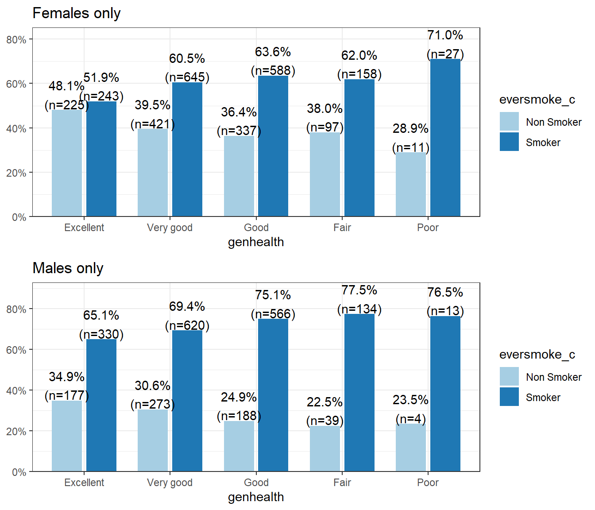

# Moderation and Stratification {#mod-strat}

Sometimes the relationship between X and Y may change depending on the value of a third variable. This section provides some motivation for why we need a single model formation that can accommodate more than a single predictor. 

\BeginKnitrBlock{rmdnote}<div class="rmdnote">This section uses functions from the `ggdist` and `ggpubr` packages to help tidy and visualize results from regression models. It also uses functions from the `performance` and `glmnet` packages to perform model selection and assessment. </div>\EndKnitrBlock{rmdnote}


This section uses the additional following packages and data: 


```r
library(ggdist) # for the "half-violin" plot (stat_slab)
library(ggpubr) # for the penguin scatterplot with ellipses (ggscatter)
pen <- palmerpenguins::penguins
```

## Moderation

_Moderation_ occurs when the relationship between two variables depends on a third variable.

* The third variable is referred to as the moderating variable or simply the moderator. 
* The moderator affects the direction and/or strength of the relationship between the explanatory ($x$) and response ($y$) variable.
    - This tends to be an important 
* When testing a potential moderator, we are asking the question whether there is an association between two constructs, **but separately for different subgroups within the sample.**
    - This is also called a _stratified_ model, or a _subgroup analysis_.

### Motivating Example - Admissions at UC Berkeley

Sometimes moderating variables can result in what's known as [Simpson's Paradox](https://en.wikipedia.org/wiki/Simpson%27s_paradox). This has had legal consequences in the past at UC Berkeley. 


Below are the admissions figures for Fall 1973 at UC Berkeley.

|       | Applicants | Admitted |
|-------|------------|----------|
| Total | 12,763     | 41%      |
| Men   | 8,442      | 44%      |
| Women | 4,321      | 35%      |

: Table of admissions rates at UC Berkeley in 1973

Is there evidence of gender bias in college admissions? Do you think a difference of 35% vs 44% is too large to be by chance?

Department specific data

|            |            |          |            |          |            |          |
|------------|------------|----------|------------|----------|------------|----------|
|            | All        |          | Men        |          | Women      |          |
| Department | Applicants | Admitted | Applicants | Admitted | Applicants | Admitted |
| A          | 933        | 64%      | 825        | 62%      | 108        | **82%**  |
| B          | 585        | 63%      | 560        | 63%      | 25         | **68%**  |
| C          | 918        | 35%      | 325        | 37%      | 593        | 34%      |
| D          | 792        | 34%      | 417        | 33%      | 375        | **35%**  |
| E          | 584        | 25%      | 191        | 28%      | 393        | 24%      |
| F          | 714        | 6%       | 373        | 6%       | 341        | **7%**   |
| Total      | 4526       | 39%      | 2691       | 45%      | 1835       | 30%      |

: The table of admissions rates for the 6 largest departments show a different story.

After adjusting for features such as size and competitiveness of the department, the pooled data showed a "small but statistically significant bias in favor of women"

### Motivating Example: Association of flower parts

Let's explore the relationship between the length of the sepal in an iris flower, and the length (cm) of it's petal. 


```r
overall <- ggplot(iris, aes(x=Sepal.Length, y=Petal.Length)) + 
                geom_point() + geom_smooth(se=FALSE) + 
                theme_bw()

by_spec <- ggplot(iris, aes(x=Sepal.Length, y=Petal.Length, col=Species)) + 
                  geom_point() + geom_smooth(se=FALSE) + 
                  theme_bw() + theme(legend.position="top")

gridExtra::grid.arrange(overall, by_spec , ncol=2)
```


The points are clearly clustered by species, the slope of the lowess line between virginica and versicolor appear similar in strength, whereas the slope of the line for setosa is closer to zero. This would imply that petal length for Setosa may not be affected by the length of the sepal.

## Stratification

Stratified models fit the regression equations (or any other bivariate analysis) for each subgroup of the population. 

The mathematical model describing the relationship between Petal length ($Y$), and Sepal length ($X$) for each of the species separately would be written as follows: 

$$ Y_{is} \sim \beta_{0s} + \beta_{1s}*x_{i} + \epsilon_{is} \qquad \epsilon_{is} \sim \mathcal{N}(0,\sigma^{2}_{s})$$
$$ Y_{iv} \sim \beta_{0v} + \beta_{1v}*x_{i} + \epsilon_{iv} \qquad \epsilon_{iv} \sim \mathcal{N}(0,\sigma^{2}_{v}) $$
$$ Y_{ir} \sim \beta_{0r} + \beta_{1r}*x_{i} + \epsilon_{ir} \qquad \epsilon_{ir} \sim \mathcal{N}(0,\sigma^{2}_{r}) $$

where $s, v, r$ indicates species _setosa, versicolor_ and _virginica_ respectively. 
  

In each model, the intercept, slope, and variance of the residuals can all be different. This is the unique and powerful feature of stratified models. The downside is that each model is only fit on the amount of data in that particular subset. Furthermore, each model has 3 parameters that need to be estimated: $\beta_{0}, \beta_{1}$, and $\sigma^{2}$, for a total of 9 for the three models. The more parameters that need to be estimated, the more data we need. 


## Identifying a moderator

Here are 3 scenarios demonstrating how a third variable can modify the relationship between the original two variables. 

* **Significant --\> Non-Significant**
    * Significant relationship at bivariate level
    * We expect the effect to exist in the entire population
    * Within at least one level of the third variable the strength of the relationship changes
    * P-value is no longer significant within at least one subgroup

* **Non-Significant --\> Significant**
    * Non-significant relationship at bivariate level
    * We do not expect the effect to exist in the entire population
    * Within at least one level of the third variable the relationship becomes significant
    * P-value is now significant within at least one subgroup

* **Change in Direction of Association**
    * Significant relationship at bivariate level
    * We expect the effect to exist in the entire population
    * Within at least one level of the third variable the direction of the relationship changes
    * Means change order, positive to negative correlation etc.


## What to look for in each type of analysis

* **ANOVA** - look at the $p$-value, $r$-squared, means, and the graph of the ANOVA and compare to those values in the Moderation (i.e., each level of third variable) output to determine if third variable is moderator or not.
* **Chi-Square** - look at the $p$-value, the percents for the columns in the crosstab table, and the graph for the Chi-Square and compare to those values in the Moderation (i.e., each level of third variable) output to determine if third variable is a moderator or not.
* **Correlation and Linear Regression** - look at the correlation coefficient ($r$), $p$-value, regression coefficients, $r$-squared, and the scatterplot. Compare to those values in the Moderation (i.e., each level of third variable) output to determine if third variable is a moderator or not.


## Ex: Correlation 

Can we predict penguin body mass from the flipper length?


```r
ggscatter(pen, x="flipper_length_mm", y = "body_mass_g", add = "reg.line", 
          color = "island", ellipse = TRUE)
```



Probably, but the relationship between flipper length and body mass changes depending on what island they are found on.


**overall**

```r
cor(pen$flipper_length_mm, pen$body_mass_g, use="pairwise.complete.obs")
## [1] 0.8712018
```

**stratified by species**

```r
by(pen, pen$species, function(x){
  cor(x$flipper_length_mm, x$body_mass_g, use="pairwise.complete.obs")
})
## pen$species: Adelie
## [1] 0.4682017
## ------------------------------------------------------------ 
## pen$species: Chinstrap
## [1] 0.6415594
## ------------------------------------------------------------ 
## pen$species: Gentoo
## [1] 0.7026665
```

There is a strong, positive, linear relationship (r=.87) between the flipper length and body mass of penguins when ignoring the species. This association is attenuated however within each species. _Gentoo_ and _Chinstrap_ still have strong correlations between flipper length and body mass, $r$=.70 and .64 respectively. However _Adelie_ species penguins only have a moderate correlation with $r=.45$. 

So does Species moderate the relationship between flipper length and body mass? Visually we see a difference, but it is likely not statisticaly significant. More on how to determine that in section \@ref(general-F).
 
## Ex: Regression

Let's explore the relationship between the length of the sepal in an iris flower, and the length (cm) of it's petal. 


```r
overall <- ggplot(iris, aes(x=Sepal.Length, y=Petal.Length)) + 
                geom_point() + geom_smooth(se=FALSE) + 
                theme_bw()

by_spec <- ggplot(iris, aes(x=Sepal.Length, y=Petal.Length, col=Species)) + 
                  geom_point() + geom_smooth(se=FALSE) + 
                  theme_bw() + theme(legend.position="top")

gridExtra::grid.arrange(overall, by_spec , ncol=2)
```


The points are clearly clustered by species, the slope of the lowess line between virginica and versicolor appear similar in strength, whereas the slope of the line for setosa is closer to zero. This would imply that petal length for Setosa may not be affected by the length of the sepal.


How does the species change the regression equation? 

**overall**

```r
lm(iris$Petal.Length ~ iris$Sepal.Length) |> summary() |> broom::tidy()
## # A tibble: 2 × 5
##   term              estimate std.error statistic  p.value
##   <chr>                <dbl>     <dbl>     <dbl>    <dbl>
## 1 (Intercept)          -7.10    0.507      -14.0 6.13e-29
## 2 iris$Sepal.Length     1.86    0.0859      21.6 1.04e-47
```

**stratified by species**

```r
by(iris, iris$Species, function(x) {
  lm(Petal.Length ~ Sepal.Length, data = x) |> summary() |> broom::tidy()
  })
## iris$Species: setosa
## # A tibble: 2 × 5
##   term         estimate std.error statistic p.value
##   <chr>           <dbl>     <dbl>     <dbl>   <dbl>
## 1 (Intercept)     0.803    0.344       2.34  0.0238
## 2 Sepal.Length    0.132    0.0685      1.92  0.0607
## ------------------------------------------------------------ 
## iris$Species: versicolor
## # A tibble: 2 × 5
##   term         estimate std.error statistic  p.value
##   <chr>           <dbl>     <dbl>     <dbl>    <dbl>
## 1 (Intercept)     0.185    0.514      0.360 7.20e- 1
## 2 Sepal.Length    0.686    0.0863     7.95  2.59e-10
## ------------------------------------------------------------ 
## iris$Species: virginica
## # A tibble: 2 × 5
##   term         estimate std.error statistic  p.value
##   <chr>           <dbl>     <dbl>     <dbl>    <dbl>
## 1 (Intercept)     0.610    0.417       1.46 1.50e- 1
## 2 Sepal.Length    0.750    0.0630     11.9  6.30e-16
```

* Overall: -7.1 + 1.86x, significant positive slope p = 1.04x10-47
* Setosa: 0.08 + 0.13x, non-significant slope, p=.06
* Versicolor: 0.19 + 0.69x, significant positive slope p=2.6x10-10
* Virginica: 0.61 + 0.75x, significant positive slope p= 6.3x10-16


So we can say that iris specis **moderates** the relationship between sepal and petal length. 

## Ex: ANOVA

Is the relationship between flipper length and species the same for each sex of penguin? 


```r
ggplot(pen, aes(x=flipper_length_mm, y=species, fill=species)) + 
      stat_slab(alpha=.5, justification = 0) + 
      geom_boxplot(width = .2,  outlier.shape = NA) + 
      geom_jitter(alpha = 0.5, height = 0.05) +
      stat_summary(fun="mean", geom="point", col="red", size=4, pch=17) + 
      theme_bw() + 
      labs(x="Flipper Length (mm)", y = "Species", title = "Overall") + 
      theme(legend.position = "none")
```




```r
pen %>% select(flipper_length_mm, species, sex) %>% na.omit() %>%
ggplot(aes(x=flipper_length_mm, y=species, fill=species)) + 
      stat_slab(alpha=.5, justification = 0) + 
      geom_boxplot(width = .2,  outlier.shape = NA) + 
      geom_jitter(alpha = 0.5, height = 0.05) +
      stat_summary(fun="mean", geom="point", col="red", size=4, pch=17) + 
      theme_bw() + 
      labs(x="Flipper Length (mm)", y = "Species", title = "Overall") + 
      theme(legend.position = "none") + 
  facet_wrap(~sex)
```



The pattern of distributions of flipper length by species seems the same for both sexes of penguin. Sex is likely not a moderator. Let's check the ANOVA anyhow

**Overall**

```r
aov(pen$flipper_length_mm ~ pen$species) |> summary()
##              Df Sum Sq Mean Sq F value Pr(>F)    
## pen$species   2  52473   26237   594.8 <2e-16 ***
## Residuals   339  14953      44                   
## ---
## Signif. codes:  0 '***' 0.001 '**' 0.01 '*' 0.05 '.' 0.1 ' ' 1
## 2 observations deleted due to missingness
```

**By Sex**

```r
by(pen, pen$sex, function(x) {
  aov(x$flipper_length_mm ~ x$species) |> summary()
  })
##              Df  Sum Sq Mean Sq F value    Pr(>F)    
## x$species     2 21415.6   10708  411.79 < 2.2e-16 ***
## Residuals   162  4212.6      26                      
## ---
## Signif. codes:  0 '***' 0.001 '**' 0.01 '*' 0.05 '.' 0.1 ' ' 1
## ------------------------------------------------------------ 
##              Df  Sum Sq Mean Sq F value    Pr(>F)    
## x$species     2 29098.4 14549.2  384.37 < 2.2e-16 ***
## Residuals   165  6245.6    37.9                      
## ---
## Signif. codes:  0 '***' 0.001 '**' 0.01 '*' 0.05 '.' 0.1 ' ' 1
```

Sex is **not** a modifier, the relationship between species and flipper length is the same within male and female penguins. 


## Ex: 4 Chi-Squared

**Identify response, explanatory, and moderating variables**

* Categorical response variable = Ever smoked (variable `eversmoke_c`
* Categorical explanatory variable = General Health (variable `genhealth`
* Categorical Potential Moderator = Gender (variable `female5_c`
  
**Visualize the relationship between smoking and general health across the entire sample.**


```r
plot_xtab(addhealth$genhealth, addhealth$eversmoke_c, 
          show.total = FALSE, margin = "row") + 
  ggtitle("Overall")
```




```r
fem <- addhealth %>% filter(female_c == "Female")
mal <- addhealth %>% filter(female_c == "Male")

fem.plot <- plot_xtab(fem$genhealth, fem$eversmoke_c, 
          show.total = FALSE, margin = "row") + 
  ggtitle("Females only")
mal.plot <- plot_xtab(mal$genhealth, mal$eversmoke_c, 
          show.total = FALSE, margin = "row") + 
  ggtitle("Males only")

gridExtra::grid.arrange(fem.plot, mal.plot)
```


A general pattern is seen where the proportion of smokers increases as the level of general health decreases. This pattern is similar within males and females, but it is noteworthy that a higher proportion of  non smokers are female. 


  Does being female change the relationship between smoking and general health? Is the distribution of smoking status (proportion of those who have ever smoked)  equal across all levels of general health, for both males and females?

**Fit both the original, and stratified models.**

**original**

```r
chisq.test(addhealth$eversmoke_c, addhealth$genhealth)
## 
## 	Pearson's Chi-squared test
## 
## data:  addhealth$eversmoke_c and addhealth$genhealth
## X-squared = 30.795, df = 4, p-value = 3.371e-06
```

**stratified**

```r
by(addhealth, addhealth$female_c, function(x) chisq.test(x$eversmoke_c, x$genhealth))
## addhealth$female_c: Male
## 
## 	Pearson's Chi-squared test
## 
## data:  x$eversmoke_c and x$genhealth
## X-squared = 19.455, df = 4, p-value = 0.0006395
## 
## ------------------------------------------------------------ 
## addhealth$female_c: Female
## 
## 	Pearson's Chi-squared test
## 
## data:  x$eversmoke_c and x$genhealth
## X-squared = 19.998, df = 4, p-value = 0.0004998
```

**Determine if the Third Variable is a moderator or not.**

The relationship between smoking status and general health is significant in both the main effects and the stratified model. The distribution of smoking status across general health categories does not differ between females and males. Gender is **not** a moderator for this analysis. 


