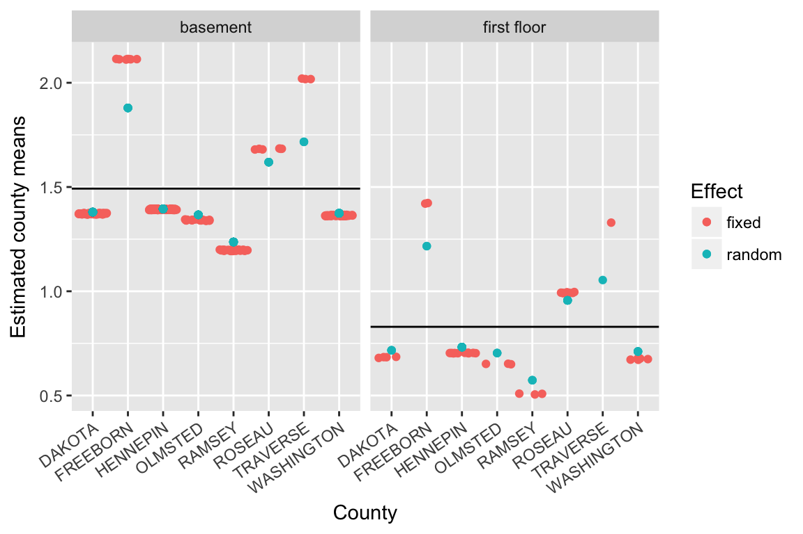

# Random Intercept Models {#RI}

Radon data explanation.


```r
data(radon, package="rstanarm")
```

Compare two models, partial pooling versus no-pooling.


```r
fit_partpool <- lme4::lmer(log_radon ~ (1 |county), data=radon)
bfit_partpool <- broom::augment(fit_partpool)

fit_nopool <- lm(log_radon~county, data=radon)
bfit_nopool <- broom::augment(fit_nopool)
```

The plot below displays the overall mean as complete pooling estimate (solid, horizontal line), and the no-pooling (fixed effect) and partial pooling (random effect) estimates for 8 randomly selected counties contained in the radon data.  The amount of shrinkage from the partial pooling fit is determined by sample size and the variances within and among the counties.  In general, we can see that the counties with smaller sample sizes are shrunk more towards the overall mean, while counties with larger sample sizes are shrunk less.  The fitted values corresponding to different observations within each county of the no-pooling model are jittered to help the eye determine approximate sample size within each county.


A similar sort of shrinkage effect is seen with covariates included in the model.  Consider the covariate $floor$, which takes on the value $1$ when the radon measurement was read within the first floor of the house and $0$ when the measurement was taken in the basement. In this case, county means are shrunk towards the mean of the response, $log(radon)$, within each level of the covariate.


