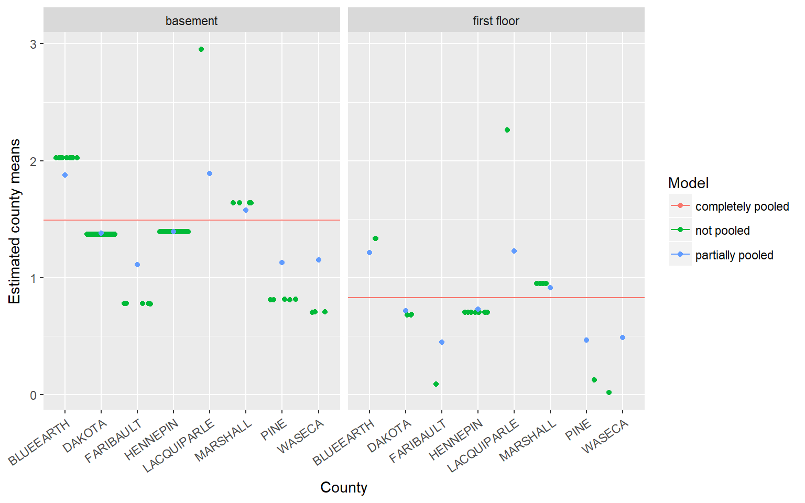

# Random Intercept Models {#RI}

<span style="color:blue">**Example Data**</span>

Radon is a radioactive gas that naturally occurs in soils around the U.S. As radon decays it releases other radioactive elements, which stick to, among other things, dust particles commonly found in homes.  The EPA believes [radon exposure](https://www.epa.gov/radon) is one of the leading causes of cancer in the United States.

This example uses a dataset named `radon` from the `rstanarm` package. The dataset contains $N=919$ observations, each measurement taken within a home that is located within one of the $J=85$ sampled counties in Minnesota.  The first six rows of the dataframe show us that the county Aitkin has variable levels of $log(radon)$. Our goal is to build a model to predict $log(radon)$.


```r
data(radon, package="rstanarm")
head(radon)
##   floor county  log_radon log_uranium
## 1     1 AITKIN 0.83290912  -0.6890476
## 2     0 AITKIN 0.83290912  -0.6890476
## 3     0 AITKIN 1.09861229  -0.6890476
## 4     0 AITKIN 0.09531018  -0.6890476
## 5     0  ANOKA 1.16315081  -0.8473129
## 6     0  ANOKA 0.95551145  -0.8473129
```

## Pooling

To highlight the benefits of random intercepts models we will compare three linear regression models: 

* complete pooling
* no pooling
* partial pooling (the random intercept model)


**Complete Pooling**

The complete pooling model pools all counties together to give one single estimate of the $log(radon)$ level. 


**No Pooling**

No pooling refers to the fact that no information is shared among the counties.  Each county is independent of the next.


**Partial Pooling**

The partial pooling model, partially shares information among the counties. 

Each county should get a _unique intercept_ such that the collection of county intercepts are randomly sampled from a normal distribution with mean $0$ and variance $\sigma^2_{\alpha}$.

Because all county intercepts are randomly sampled from the same theoretical population, $N(0, \sigma^2_{\alpha})$, information is shared among the counties.  This sharing of information is generally referred to as **shrinkage**, and should be thought of as a means to reduce variation in estimates among the counties.  When a county has little information to offer, it's estimated intercept will be shrunk towards to overall mean of all counties.


The plot below displays the overall mean as the complete pooling estimate (solid, horizontal line), the no pooling and partial pooling estimates for 8 randomly selected counties contained in the radon data.  The amount of shrinkage from the partial pooling fit is determined by a data dependent compromise between the county level sample size, the variation among the counties, and the variation within the counties.  


Generally, we can see that counties with smaller sample sizes are shrunk more towards the overall mean, while counties with larger sample sizes are shrunk less.  

\BeginKnitrBlock{rmdcaution}<div class="rmdcaution">The fitted values corresponding to different observations within each county of the no-pooling model are jittered to help the eye determine approximate sample size within each county. 

Estimates of variation within each county should not be determined from this arbitrary jittering of points.</div>\EndKnitrBlock{rmdcaution}

## Mathematical Models

The three models considered set $y_n=log(radon)$, and $x_n$ records floor (0=basement, 1=first floor) for homes $n=1, \ldots, N$.  

### Complete Pooling

The complete pooling model pools all counties together to give them one single estimate of the $log(radon)$ level, $\hat{\alpha}$.  

* The error term $\epsilon_n$ may represent variation due to measurement error, within-house variation, and/or within-county variation.  
* Fans of the random intercept model think that $\epsilon_n$, here, captures too many sources of error into one term, and think that this is a fault of the completely pooled model.


\begin{equation*}
\begin{split}

        y_n = \alpha & + \epsilon_n \\
            & \epsilon_n \sim N(0, \sigma_{\epsilon}^{2})

\end{split}
\end{equation*}


### No Pooling

* The no pooling model gives each county an independent estimate of  $log(radon$), $\hat{\alpha}_{j[n]}$.  
* Read the subscript $j[n]$ as home $n$ is nested within county $j$.  Hence, all homes in each county get their own independent estimate of $log(radon)$.  
* This is equivalent to the fixed effects model
* Here again, one might argue that the error term captures too much noise.


\begin{equation*}
\begin{split}

        y_n = \alpha_{j[n]} & + \epsilon_n \\
            \epsilon_n & \sim N(0, \sigma_{\epsilon}^{2})

\end{split}
\end{equation*}

### Partial Pooling (RI)

* The random intercept model, better known as the partial pooling model, gives each county an intercept term $\alpha_j[n]$ that varies according to its own error term, $\sigma_{\alpha}^2$.  
* This error term measures within-county variation
    - Separating measurement error ($\sigma_{\epsilon}^{2}$) from county level error ($\sigma_{\alpha}^{2}$) . 
* This multi-level modeling shares information among the counties to the effect that the estimates $\alpha_{j[n]}$ are a compromise between the completely pooled and not pooled estimates.  
* When a county has a relatively smaller sample size and/or the variance $\sigma^{2}_{\epsilon}$ is larger than the variance $\sigma^2_{\alpha}$, estimates are shrunk more from the not pooled estimates towards to completely pooled estimate.


\begin{equation*}
\begin{split}

        y_n = \alpha_{j[n]} & + \epsilon_n \\
            \epsilon_n & \sim N(0, \sigma_{\epsilon}^{2}) \\
            \alpha_j[n] & \sim N(\mu_{\alpha}, \sigma_{\alpha}^2)

\end{split}
\end{equation*}


## Components of Variance

Statistics can be thought of as the study of uncertainty, and variance is a measure of uncertainty (and information). So yet again we see that we're partitioning the variance. Recall that 

* Measurement error: $\sigma^{2}_{\epsilon}$ 
* County level error: $\sigma^{2}_{\alpha}$ 

The **intraclass correlation** (ICC, $\rho$) is interpreted as

* the proportion of total variance that is explained by the clusters.  
* the expected correlation between two individuals who are drawn from the same cluster. 

$$ 
\rho = \frac{\sigma^{2}_{\alpha}}{\sigma^{2}_{\alpha} + \sigma^{2}_{\epsilon}}
$$

* When $\rho$ is large, a lot of the variance is at the macro level
* units within each group are very similar
* If $\rho$ is small enough, one may ask if fitting a multi-level model is worth the complexity. 
* no hard and fast rule to say "is it large enough?", rules of thumb include if it's under 10% (0.1) then a single level analysis may still be appropriate, if it's over 10\% (0.1) then a multilevel model can be justified. 
  

## Fitting models in R {#fitri}

**No Pooling**

The no pooling model is fit with the function `lm`, giving each county a unique intercept in the model.  

```r
fit_nopool <- lm(log_radon ~ -1 + county, data=radon)
```

**Partial Pooling**

* The partial pooling model is fit with the function `lmer()`, which is part of the `lme4` package.
* The extra notation around the input variable `(1|county)` dictates that each county should get its own unique intercept $\alpha_{j[n]}$. 


```r
fit_partpool <- lme4::lmer(log_radon ~ (1 |county), data=radon)
```

The fixed effects portion of the model output of `lmer` is similar to output from `lm`, except no p-values are displayed.  The fact that no p-values are displayed is a much discussed topic.  The author of the library `lme4`, Douglas Bates, believes that there is no "obviously correct" solution to calculating p-values for models with randomly varying intercepts (or slopes); see [here](https://stat.ethz.ch/pipermail/r-help/2006-May/094765.html) for a general discussion. 


```r
summary(fit_partpool)
## Linear mixed model fit by REML ['lmerMod']
## Formula: log_radon ~ (1 | county)
##    Data: radon
## 
## REML criterion at convergence: 2184.9
## 
## Scaled residuals: 
##     Min      1Q  Median      3Q     Max 
## -4.6880 -0.5884  0.0323  0.6444  3.4186 
## 
## Random effects:
##  Groups   Name        Variance Std.Dev.
##  county   (Intercept) 0.08861  0.2977  
##  Residual             0.58686  0.7661  
## Number of obs: 919, groups:  county, 85
## 
## Fixed effects:
##             Estimate Std. Error t value
## (Intercept)    1.350      0.047   28.72
```

The random effects portion of the `lmer` output provides a point estimate of the variance of component $\sigma^2_{\alpha} = 0.09$ and the model's residual variance, $\sigma_\epsilon = 0.57$.


### Restricted (residual) Maximum Likelihood (REML)

* Similar to logistic regression, estimates typically aren't estimated directly using maximum likelihood (ML) methods. 
* Iterative methods like REML are used to get approximations. 
* REML is typically the default estimation method for most packages. 


Details of REML are beyond the scope of this class, but knowing the estimation method is important for two reasons

1. Some type of testing procedures that use the likelihood ratio may not be valid. 
    - Comparing models with different fixed effects using a likelihood ratio test is not valid. (Must use Wald Test instead) 
    - Can still use AIC/BIC as guidance (not as formal tests)

2. Iterative procedures are procedures that perform estimation steps over and over until the change in estimates from one step to the next is smaller than some tolerance.
    - Sometimes this convergence to an answer never happens. 
    - You will get some error message about the algorithm not converging. 
    - The more complex the model, the higher chance this can happen
    - scaling, centering, and avoiding collinearity can alleviate these problems with convergence.

You can change the fitting algorithm to use the Log Likelihood anyhow, it may be slightly slower but for simple models the estimates are going to be very close to the REML estimate. Below is a table showing the estimates for the random intercepts, 

<table class="table" style="width: auto !important; margin-left: auto; margin-right: auto;">
 <thead>
  <tr>
   <th style="text-align:left;">   </th>
   <th style="text-align:right;"> REML </th>
   <th style="text-align:right;"> MLE </th>
  </tr>
 </thead>
<tbody>
  <tr>
   <td style="text-align:left;"> AITKIN </td>
   <td style="text-align:right;"> 1.1107728 </td>
   <td style="text-align:right;"> 1.1143654 </td>
  </tr>
  <tr>
   <td style="text-align:left;"> ANOKA </td>
   <td style="text-align:right;"> 0.9427047 </td>
   <td style="text-align:right;"> 0.9438526 </td>
  </tr>
  <tr>
   <td style="text-align:left;"> BECKER </td>
   <td style="text-align:right;"> 1.2688325 </td>
   <td style="text-align:right;"> 1.2700351 </td>
  </tr>
  <tr>
   <td style="text-align:left;"> BELTRAMI </td>
   <td style="text-align:right;"> 1.2694025 </td>
   <td style="text-align:right;"> 1.2702493 </td>
  </tr>
  <tr>
   <td style="text-align:left;"> BENTON </td>
   <td style="text-align:right;"> 1.3243796 </td>
   <td style="text-align:right;"> 1.3245917 </td>
  </tr>
  <tr>
   <td style="text-align:left;"> BIGSTONE </td>
   <td style="text-align:right;"> 1.4081133 </td>
   <td style="text-align:right;"> 1.4068866 </td>
  </tr>
</tbody>
</table>

and the same estimates for the variance terms. 

```r
VarCorr(fit_partpool)
##  Groups   Name        Std.Dev.
##  county   (Intercept) 0.29767 
##  Residual             0.76607
VarCorr(fit_partpool_MLE)
##  Groups   Name        Std.Dev.
##  county   (Intercept) 0.29390 
##  Residual             0.76607
```

So does it matter? Yes and no. In general you want to fit the models using REML, but if you really want to use a Likelihood Ratio **test** to compare models then you need to fit the models using ML. 


## Including Covariates

A similar sort of shrinkage effect is seen with covariates included in the model.  

Consider the covariate $floor$, which takes on the value $1$ when the radon measurement was read within the first floor of the house and $0$ when the measurement was taken in the basement. In this case, county means are shrunk towards the mean of the response, $log(radon)$, within each level of the covariate.



Covariates are fit using standard `+` notation outside the random effects specification, i.e. `(1|county)`. 


```r
library(sjPlot)
ri.with.x <- lme4::lmer(log_radon ~ floor + (1 |county), data=radon)
sjt.lmer(ri.with.x, show.r2=FALSE)
```

<table style="border-collapse:collapse; border:none;border-bottom:double;">
<td style="padding:0.2cm; border-top:double;">&nbsp;</td>
<td style="border-bottom:1px solid; padding-left:0.5em; padding-right:0.5em; border-top:double;">&nbsp;</td>
<td style="padding:0.2cm; text-align:center; border-bottom:1px solid; border-top:double;" colspan="3">log_radon</td>
</tr>
<tr>
<td style="padding:0.2cm; font-style:italic;">&nbsp;</td>
<td style="padding-left:0.5em; padding-right:0.5em; font-style:italic;">&nbsp;</td>
<td style="padding:0.2cm; text-align:center; font-style:italic; ">B</td>
<td style="padding:0.2cm; text-align:center; font-style:italic; ">CI</td>
<td style="padding:0.2cm; text-align:center; font-style:italic; ">p</td> 
</tr>
<tr>
<td colspan="5" style="padding:0.2cm; text-align:left; border-top:1px solid; font-weight:bold; text-align:left;">Fixed Parts</td>
</tr>
<tr>
<td style="padding:0.2cm; text-align:left;">(Intercept)</td>
<td style="padding-left:0.5em; padding-right:0.5em; ">&nbsp;</td>
<td style="padding:0.2cm; text-align:center; ">1.49</td>
<td style="padding:0.2cm; text-align:center; ">1.40&nbsp;&ndash;&nbsp;1.59</td>
<td style="padding:0.2cm; text-align:center; ">&lt;.001</td>
</tr>
<tr>
<td style="padding:0.2cm; text-align:left;">floor (first floor)</td>
<td style="padding-left:0.5em; padding-right:0.5em;">&nbsp;</td>
<td style="padding:0.2cm; text-align:center; ">&#45;0.66</td>
<td style="padding:0.2cm; text-align:center; ">&#45;0.80&nbsp;&ndash;&nbsp;&#45;0.53</td>
<td style="padding:0.2cm; text-align:center; ">&lt;.001</td>
</tr><tr>
<td colspan="5" style="padding:0.2cm; padding-top:0.1cm; padding-bottom:0.1cm; text-align:left; font-weight:bold; text-align:left; padding-top:0.5em;">Random Parts</td>
</tr>

<tr>
<td style="padding:0.2cm; padding-top:0.1cm; padding-bottom:0.1cm; text-align:left;">&sigma;<sup>2</sup></td>
<td style="padding-left:0.5em; padding-right:0.5em;">&nbsp;</td><td style="padding:0.2cm; text-align:center; padding-top:0.1cm; padding-bottom:0.1cm;" colspan="3">0.527</td>
</tr>

<tr>
<td style="padding:0.2cm; padding-top:0.1cm; padding-bottom:0.1cm; text-align:left;">&tau;<sub>00, county</sub></td>
<td style="padding-left:0.5em; padding-right:0.5em;">&nbsp;</td><td style="padding:0.2cm; text-align:center; padding-top:0.1cm; padding-bottom:0.1cm;" colspan="3">0.099</td>
</tr>

<tr>
<td style="padding:0.2cm; padding-top:0.1cm; padding-bottom:0.1cm; text-align:left;">N<sub>county</sub></td>
<td style="padding-left:0.5em; padding-right:0.5em;">&nbsp;</td><td style="padding:0.2cm; text-align:center; padding-top:0.1cm; padding-bottom:0.1cm;" colspan="3">85</td>
</tr>
<tr>
<td style="padding:0.2cm; text-align:left; padding-top:0.1cm; padding-bottom:0.1cm;">ICC<sub>county</sub></td>
<td style="padding-left:0.5em; padding-right:0.5em;">&nbsp;</td><td style="padding:0.2cm; text-align:center; padding-top:0.1cm; padding-bottom:0.1cm;" colspan="3">0.159</td>
 </tr>

<tr>
<td style="padding:0.2cm; padding-top:0.1cm; padding-bottom:0.1cm; text-align:left; border-top:1px solid;">Observations</td>
<td style="padding-left:0.5em; padding-right:0.5em; border-top:1px solid;">&nbsp;</td><td style="padding:0.2cm; padding-top:0.1cm; padding-bottom:0.1cm; text-align:center; border-top:1px solid;" colspan="3">919</td>
</tr>
</table>

Note that in this table format, $\tau_{00} = \sigma^{2}_{\alpha}$ and $\sigma^{2} = \sigma^{2}_{\epsilon}$. The estimated random effects can also be easily visualized using functions from the same `sjPlot` package. 


```r
plot_model(ri.with.x, type="re", sort.est = "(Intercept)", y.offset = .4)
```


Function enhancements -- (see [vignette](http://www.strengejacke.de/sjPlot/) for more options) 

* Display the fixed effects by changing `type="est"`. 
* Plot the slope of the fixed effect for each level of the random effect `sjp.lmer(ri.with.x, type="ri.slope")` -- this is being depreciated in the future but works for now. Eventually I'll figure out how to get this plot out of `plot_model()`. 

## Centering terms

* Sometimes it might be better to measure the effect of a specific level relative to the average within cluster, rather than overall average.
* The "frog pond" effect
    - A student with an average IQ may be more confident and excel in a group of students with less than average IQ
    - But they may be discouraged and not perform to their potential in a group of students with higher than average IQ.
    
* Instead of using the actual value in the regression model
    - calculate the cluster specific average
    - calculate the difference between individual and specific cluster average
    - both cluster average (macro) and difference (micro) are included in the model. 


## Specifying Correlation Structures

* **Independence** In standard linear models, the assumption on the residuals $\epsilon_{i} \sim \mathcal{N}(0, \sigma_{\epsilon}^{2})$ means that

* The variance of each observation is $\sigma_{\epsilon}^{2}$
* The covariance between two different observations $0$

Consider $n=4$ observations, $y_{1}, \ldots , y_{4}$. Visually the covariance matrix between these four observations would look like this: 

$$
\begin{array}{c|cccc}
  & y_{1} & y_{2} & y_{3} & y_{4}\\
  \hline 
  y_{1} & \sigma_{\epsilon}^{2} & 0 & 0 & 0\\ 
  y_{2} & 0 & \sigma_{\epsilon}^{2} & 0 & 0\\ 
  y_{3} & 0 & 0 & \sigma_{\epsilon}^{2} & 0\\ 
  y_{4} & 0& 0 & 0 & \sigma_{\epsilon}^{2} 
\end{array}
$$

We can also write the covariance matrix as $\sigma_{\epsilon}^{2}$ times the correlation matrix. 

$$
\begin{bmatrix} 
  \sigma_{\epsilon}^{2} & 0 & 0 & 0\\ 
  0 & \sigma_{\epsilon}^{2} & 0 & 0\\ 
  0 & 0 & \sigma_{\epsilon}^{2} & 0\\ 
  0& 0 & 0 & \sigma_{\epsilon}^{2} 
\end{bmatrix}
=
\sigma_{\epsilon}^2 
\begin{bmatrix} 
1 & 0 & 0 & 0 \\ 
& 1 & 0 & 0 \\ 
& & 1 & 0 \\ 
& & & 1 
\end{bmatrix} 
$$


* **Compound Symmetry** or **Exchangeable** The simplest covariance structure that includes correlated errors is compound symmetry (CS). Here we see correlated errors between individuals, and note that these correlations are presumed to be the same for each pair of responses, namely $\rho$. 

$$
\sigma_{\epsilon}^{2}
\begin{bmatrix} 
1 & \rho & \rho & \rho \\ 
& 1 & \rho & \rho \\ 
& & 1 & \rho \\ 
& & & 1 
\end{bmatrix} 
$$

* **Autoregressive** Imagine that $y_{1}, \ldots , y_{4}$ were 4 different time points on the same person. The autoregressive (Lag 1) structure considers correlations to be highest for time adjacent times, and a systematically decreasing correlation with increasing distance between time points. This structure is only applicable for evenly spaced time intervals for the repeated measure.

$$
\sigma_{\epsilon}^{2}
\begin{bmatrix} 
1 & \rho & \rho^{2} & \rho^{3} \\ 
& 1 & \rho & \rho^{2} \\ 
& & 1 & \rho \\ 
& & & 1 
\end{bmatrix}
$$


* **Unstructured** The Unstructured covariance structure (UN) is the most complex because it is estimating unique correlations for each pair of observations. It is not uncommon to find out that you are not able to use this structure simply because there are too many parameters to estimate. 

$$
\begin{bmatrix} 
\sigma_{1}^{2} & \rho_{12} & \rho_{13} & \rho_{14} \\ 
& \sigma_{2}^{2} & \rho_{23} & \rho_{24} \\ 
& & \sigma_{3}^{2} & \rho_{34} \\ 
& & & \sigma_{4}^{2}
\end{bmatrix}
$$

* Random Intercept Model

Let $y_{1}$ and $y_{2}$ be from group 1, and $y_{3}$ and $y_{4}$ be from group 2. 

* error terms between groups are uncorrelated (groups are independent)
* two different observations from the same group have covariance $\sigma_{\alpha}^{2}$
* individuals now have the error associated with their own observation but also due to the group 
  $\sigma_{\epsilon}^{2} + \sigma_{\alpha}^{2}$


$$
\left[
\begin{array}{cc|cc}
  \sigma_{\epsilon}^{2} + \sigma_{\alpha}^{2} & \sigma_{\alpha}^{2} & 0 & 0\\ 
 \sigma_{\alpha}^{2} & \sigma_{\epsilon}^{2} + \sigma_{\alpha}^{2} & 0 & 0\\ 
 \hline
  0 & 0 & \sigma_{\epsilon}^{2} + \sigma_{\alpha}^{2} & \sigma_{\alpha}^{2}\\ 
  0 & 0 & \sigma_{\alpha}^{2} & \sigma_{\epsilon}^{2} + \sigma_{\alpha}^{2} 
\end{array}
\right]
$$


### Specifying different covariance structures in R

* Not able to do this using `lmer()` from package `lme4`
* Can do this using `lme()` from package `nlme`
    - Syntax is similar
    

```r
library(nlme)
model_lme_cs<-lme(log_radon ~ floor,
               random = ~ 1 | county, 
               cor=corCompSymm(0.5,form=~1|county),data = radon)
```

Using a different covariance structure can have a large effect on the results. 

* `lmer` using Identity: $\sigma^{2}_{\alpha} = 0.10, \sigma^{2}_{\epsilon} = 0.53$  
* `nlme` using Identity: $\sigma^{2}_{\alpha} = 0.32^2 = 0.10, \sigma^{2}_{\epsilon} = 0.73^2 = 0.53$  
* `nlme` using CS: $\sigma^{2}_{\alpha} = 0.13^2 = 0.02, \sigma^{2}_{\epsilon} = 0.78^2 = 0.61$

Also, mis-specifying the covariance structure can also have a large effect on the results. 


## Additional References

* Random effects ANOVA in SAS and R http://stla.github.io/stlapblog/posts/AV1R_SASandR.html
* ICCs in mixed models https://www.theanalysisfactor.com/the-intraclass-correlation-coefficient-in-mixed-models/
* Very nice introduction to mixed models in R https://m-clark.github.io/mixed-models-with-R/introduction.html
* [sjPlot](http://strengejacke.de/sjPlot/sjt.lmer/) **Really** nice way of printing output as tables (and plots).
* Interesting blog by [Tristan Mahr](https://tjmahr.github.io/plotting-partial-pooling-in-mixed-effects-models/) about pooling and shrinkage. 
* Derivation of the covariance structures http://www.bristol.ac.uk/cmm/learning/videos/correlation.html#matrix2 
* Changing covariance structures in lme4qtl: [[paper]](https://bmcbioinformatics.biomedcentral.com/track/pdf/10.1186/s12859-018-2057-x?site=bmcbioinformatics.biomedcentral.com) [[github]](https://github.com/variani/lme4qtl)
