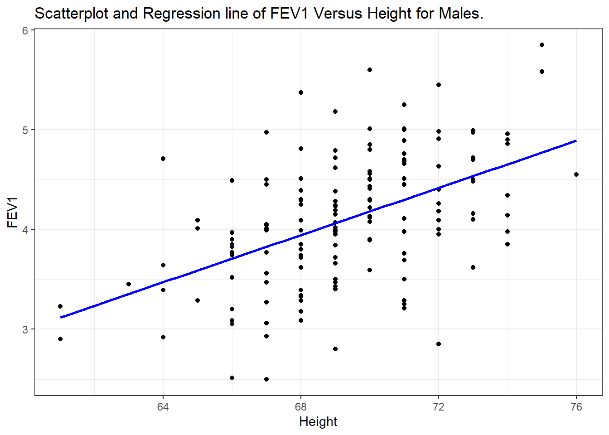
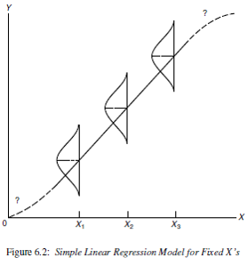
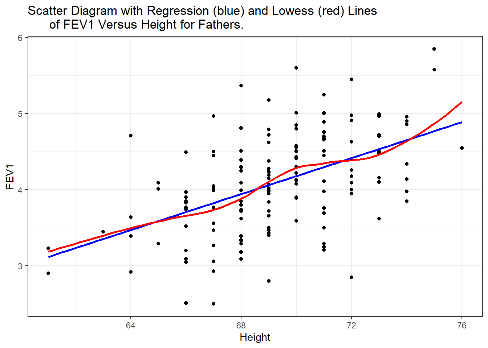
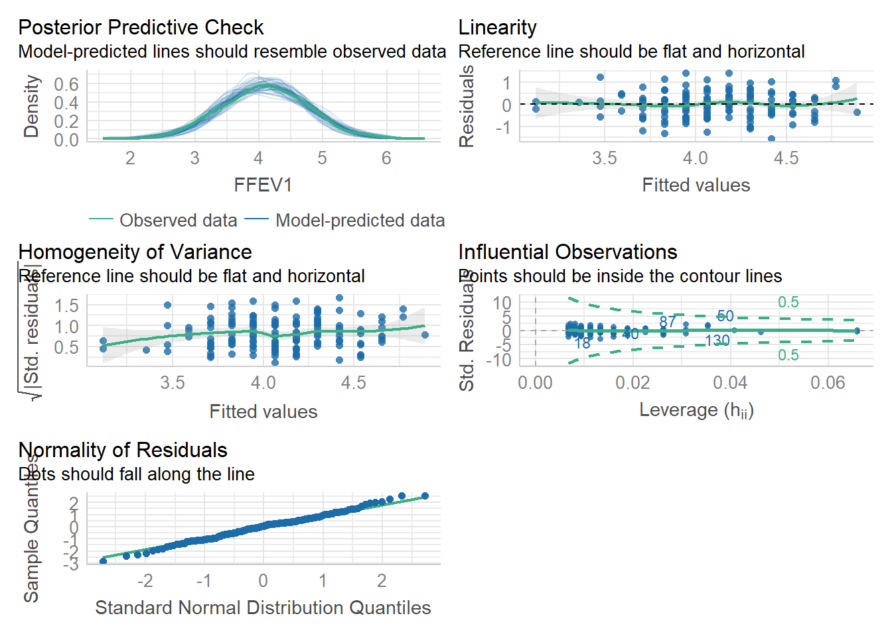

# Simple Linear Regression {#slr}

The goal of linear regression is to describe the relationship between an independent variable X and a continuous dependent variable $Y$ as a straight line. 

Data for this type of model can arise in two ways; 
  
* Fixed-$X$: values of $X$ are preselected by investigator
* Variable-$X$: have random sample of $(X,Y)$ values
    
    
Both Regression and Correlation can be used for two main purposes: 

* **Descriptive**: Draw inferences regarding the relationship 
* **Predictive**: Predict value of $Y$ for a given value of $X$

Simple Linear Regression is an example of a Bivariate analysis since there is only one covariate (explanatory variable) under consideration.  

\BeginKnitrBlock{rmdnote}<div class="rmdnote">This section uses functions from the `gridExtra`, `sjPlot`, `broom`, `performance` and `ggdist` packages to help tidy and visualize results from regression models. </div>\EndKnitrBlock{rmdnote}


## Example

Lung function data were obtained from an epidemiological study of households living in four areas with different amounts and types of air pollution. The data set used in this book is a subset of the total data. In this chapter we use only the data taken on the fathers, all of whom are nonsmokers (see PMA6 Appendix A for more details). 


```r
# Read in the data from a version stored online. 
fev <- read.delim("https://norcalbiostat.netlify.com/data/Lung_081217.txt", sep="\t", header=TRUE)
```

One of the major early indicators of reduced respiratory function is FEV1 or forced expiratory volume in the first second (amount of air exhaled in 1 second). Since it is known that taller males tend to have higher FEV1, we wish to determine the relationship between height and FEV1. We can use regression analysis for both a descriptive and predictive purpose. 

* **Descriptive**: Describing the relationship between FEV1 and height
* **Predictive**: Use the equation to determine expected or normal FEV1 for a given height


```r
ggplot(fev, aes(y=FFEV1, x=FHEIGHT)) + geom_point() + 
      xlab("Height") + ylab("FEV1") + 
      ggtitle("Scatterplot and Regression line of FEV1 Versus Height for Males.") + 
      geom_smooth(method="lm", se=FALSE, col="blue") 
```



In this graph, height is given on the horizontal axis since it is the independent or predictor variable and FEV1 is given on the vertical axis since it is the dependent or outcome variable.

**Interpretation**: There does appear to be a tendency for taller men to have higher FEV1. The **regression line** is also added to the graph. The line is tilted upwards, indicating that we expect larger values of FEV1 with larger values of height.

Specifically the equation of the regression line is 
$$
Y = -4.087 + 0.118 X
$$

The quantity 0.118 in front of $X$ is greater than zero, indicating that as we increase $X, Y$ will increase. For example, we would expect a father who is 70 inches tall to have an FEV1 value of

$$\mbox{FEV1} = -4.087 + (0.118) (70) = 4.173$$

If the height was 66 inches then we would expect an FEV1 value of only 3.70.

### Caution on out of range predictions

To take an extreme example, suppose a father was 2 feet tall. Then the equation would predict a negative value of FEV1 ($-1.255$).

A safe policy is to restrict the use of the equation to the range of the $X$ observed in the sample.


## Mathematical Model

The mathematical model that we use for regression has three features.

1. $Y$ values are normally distributed at any given $X$ 
2. The mean of $Y$ values at any given $X$ follows a straight line $Y = \beta_{0} + \beta_{1} X$. 
2. The variance of $Y$ values at any $X$ is $\sigma^2$ (same for all X). This is known as _homoscedasticity_, or _homogeneity of variance_. 


Mathematically this is written as: 

$$
Y|X \sim N(\mu_{Y|X}, \sigma^{2}) \\
\mu_{Y|X} = \beta_{0} + \beta_{1} X \\
Var(Y|X) = \sigma^{2} 
$$

and can be visualized as: 



### Unifying model framework

The mathematical model above describes the theoretical relationship between $Y$ and $X$. So in our unifying model framework to describe observed data, 

> DATA = MODEL + RESIDUAL

Our observed data values $y_{i}$ can be modeled as being centered on $\mu_{Y|X}$, with normally distributed residuals. 

$$
y_{i} = \beta_{0} + \beta_{1} X + \epsilon_{i} \\
\epsilon_{i} \sim N(0, \sigma^{2})
$$


## Parameter Estimates
* Estimate the slope $\beta_{1}$ and intercept $\beta_{0}$ using a method called **Least Squares**.
* The residual mean squared error (RMSE) is an estimate of the variance $s^{2}$
    - RMSE can also refer to the root mean squared error. 

The **Least Squares** method finds the estimates for the intercept $b_{0}$ and slope $b_{1}$ that minimize the SSE (Sum of squared errors). Let's explore that visually: 

See https://paternogbc.shinyapps.io/SS_regression/

**Initial Setup**  

* Set the sample size to 50
* Set the regression slope to 1
* Set the standard deviation to 5


The method of Least Squares finds the best estimates for $\beta_{0}$ and $\beta_{1}$ that minimized the sum of the squared residuals:

$$ \sum_{i=1}^{n} \epsilon_{i} $$

For simple linear regression the regression coefficient estimates that minimize the sum of squared errors can be calculated as: 

$$ \hat{\beta_{0}} = \bar{y} - \hat{\beta_{1}}\bar{x} \quad \mbox{  and  } \quad  \hat{\beta_{1}} = r\frac{s_{y}}{s_{x}} $$


### Sum of Squares

Partitioning the Variance using the Sum of Squares:

* SS Total- how far are the points away from $\bar{y}$? (one sample mean)
* SS Regression - how far away is the regression line from $\bar{y}$?.
* SS Error - how far are the points away from the estimated regression line? 

Looking at it this way, we are asking "If I know the value of $x$, how much better will I be at predicting $y$ than if I were just to use $\bar{y}$? 

_This is the same partitioning of variance that is happens with ANOVA!_

\BeginKnitrBlock{rmdnote}<div class="rmdnote">Increase the standard deviation to 30. What happens to SSReg? What about SSE? </div>\EndKnitrBlock{rmdnote}
      

Here is a [link](https://ryansafner.shinyapps.io/ols_estimation_by_min_sse/) to another interactive app where you can try to fit your own line to minimize the SSE. 

**RMSE** is the Root Mean Squared Error. In the PMA textbook this is denoted as $S$, which is an estimate for $\sigma$. 

$$ S = \sqrt{\frac{SSE}{N-2}}$$

## Assumptions

Many of the assumptions for regression are on the form of the residuals, which can't be assessed until _after_ the model has been fit. 

**Assumptions to check before modeling**

* Randomness / Independence
    - Very serious
    - Can use hierarchical models for clustered samples
    - No real good way to "test" for independence. Need to know how the sample was obtained. 
* Linear relationship
    - Slight departures OK
    - Can use transformations to achieve it
    - Graphical assessment: Simple scatterplot of $y$ vs $x$. 
      Looking for linearity in the relationship. 
      Should be done prior to any analysis. 

**Assumptions to check after modeling**

* Homogeneity of variance (same $\sigma^{2}$)
    - Not extremely serious
    - Can use transformations to achieve it
    - Graphical assessment: Plot the residuals against the x variable, add a lowess line. 
      This assumption is upheld if there is no relationship/trend between the residuals and
      the predictor. 
* Normal residuals
    - Slight departures OK
    - Can use transformations to achieve it
    - Graphical assessment: normal qqplot of the model residuals. 


## Example {#slr-fev}

Returning to the Lung function data set from PMA6, lets analyze the relationship between height and FEV for fathers in this data set. 


```r
ggplot(fev, aes(y=FFEV1, x=FHEIGHT)) + geom_point() + 
      xlab("Height") + ylab("FEV1") + 
      ggtitle("Scatter Diagram with Regression (blue) and Lowess (red) Lines 
      of FEV1 Versus Height for Fathers.") + 
      geom_smooth(method="lm", se=FALSE, col="blue") + 
      geom_smooth(se=FALSE, col="red") 
```



There does appear to be a tendency for taller men to have higher FEV1. The trend is linear, the red lowess trend line follows the blue linear fit line quite well. 

Let's fit a linear model and report the regression parameter estimates. 

```r
fev.dad.model <- lm(FFEV1 ~ FHEIGHT, data=fev)
broom::tidy(fev.dad.model) |> kable(digits=3)
```

<table>
 <thead>
  <tr>
   <th style="text-align:left;"> term </th>
   <th style="text-align:right;"> estimate </th>
   <th style="text-align:right;"> std.error </th>
   <th style="text-align:right;"> statistic </th>
   <th style="text-align:right;"> p.value </th>
  </tr>
 </thead>
<tbody>
  <tr>
   <td style="text-align:left;"> (Intercept) </td>
   <td style="text-align:right;"> -4.087 </td>
   <td style="text-align:right;"> 1.152 </td>
   <td style="text-align:right;"> -3.548 </td>
   <td style="text-align:right;"> 0.001 </td>
  </tr>
  <tr>
   <td style="text-align:left;"> FHEIGHT </td>
   <td style="text-align:right;"> 0.118 </td>
   <td style="text-align:right;"> 0.017 </td>
   <td style="text-align:right;"> 7.106 </td>
   <td style="text-align:right;"> 0.000 </td>
  </tr>
</tbody>
</table>

The least squares equation is $Y = -4.09 + 0.118X$. We can calculate the confidence interval for that estimate using the `confint` function. 


```r
confint(fev.dad.model) |> kable(digits=3)
```

<table>
 <thead>
  <tr>
   <th style="text-align:left;">   </th>
   <th style="text-align:right;"> 2.5 % </th>
   <th style="text-align:right;"> 97.5 % </th>
  </tr>
 </thead>
<tbody>
  <tr>
   <td style="text-align:left;"> (Intercept) </td>
   <td style="text-align:right;"> -6.363 </td>
   <td style="text-align:right;"> -1.810 </td>
  </tr>
  <tr>
   <td style="text-align:left;"> FHEIGHT </td>
   <td style="text-align:right;"> 0.085 </td>
   <td style="text-align:right;"> 0.151 </td>
  </tr>
</tbody>
</table>

For ever inch taller a father is, his FEV1 measurement significantly increases by .12 (95%CI: .09, .15, p<.0001).  

## Model Diagnostics

> See PMA6 Section 7.8

Lastly, we need to check assumptions on the residuals to see if the model results are valid. We can use the [`check_model`](https://easystats.github.io/performance/reference/check_model.html) function from the [`performance`](https://easystats.github.io/performance/) package to do the heavy lifting. 


```r
library(performance)
check_model(fev.dad.model)
```



No major deviations away from what is expected.   


## Prediction 
The `predict` function is used to create model based predictions. 

### Predict the _average_ value of Y ($\hat{y}$) based on the model

Create predictions for all observations in the data based on the model, and then take the mean of those $n$ predictions. 

$$
\hat{y_{i}} = b_{0} + b_{1}x_{i} \\
\hat{\mu} = \frac{1}{n}\hat{y_{i}}
$$


```r
predict(fev.dad.model) |> mean()
## [1] 4.093267
```

### Confidence intervals for the predicted mean
We can leverage the `t.test()` function to give us the confidence interval for $\hat{\mu}$


```r
t.test(predict(fev.dad.model))
## 
## 	One Sample t-test
## 
## data:  predict(fev.dad.model)
## t = 152.73, df = 149, p-value < 2.2e-16
## alternative hypothesis: true mean is not equal to 0
## 95 percent confidence interval:
##  4.040309 4.146225
## sample estimates:
## mean of x 
##  4.093267
```

This model predicts that fathers will have FEV1 measurements of 4.09 (95% CI 4.04, 4.14) on average. 

### Predict the _average_ value of Y $(\hat{y_{i}})$ for a certain value of $x^{*}$

This is also called the _fitted_ value. 

$$\hat{y_{i}} = b_{0} + b_{1}x^{*}_{i}$$

We create a new `data.frame` that holds the values of the data we want to predict. $x^{*}=60$ in the first example,  $x^{*}=65$ and $68$ in the second example. 


```r
predict(fev.dad.model, newdata = data.frame(FHEIGHT = 60))
##        1 
## 2.999612
predict(fev.dad.model, newdata = data.frame(FHEIGHT = c(65, 68)))
##        1        2 
## 3.590138 3.944454
```

The confidence interval for the fitted value $\hat{y_{i}}$ is

$$
\hat{Y} \pm t_{\frac{\alpha}{2}}S \bigg[ \frac{1}{N} + \sqrt{\frac{(X^* - \bar{X})^{2}}{\sum(X - \bar{X})^{2}}} \quad  \bigg]
$$

where $S$ is the sample estimated variance (RMSE). We can use the `interval` argument to `predict` to calculate this interval. 


```r
predict(fev.dad.model, 
        newdata = data.frame(FHEIGHT = c(65, 68)),
        interval = "confidence")
##        fit      lwr      upr
## 1 3.590138 3.423257 3.757019
## 2 3.944454 3.844515 4.044393
```

### Predict a _new_ value of Y $\hat{y_{i}}$ for a certain value of $x^{*}$

The point estimate of $\hat{y_{i}}$ is calculated the same, but the prediction interval is wider. This is because individual $y$'s are more variable than the average. This is the same concept that we saw when studying sampling distributions. The standard deviation of the mean $\mu_{Y}$, is smaller than the standard deviation of the individual data points $y_{i}$.

$$
\hat{Y} \pm t_{\frac{\alpha}{2}}S \bigg[ 1+  \frac{1}{N} + \sqrt{\frac{(X^* - \bar{X})^{2}}{\sum(X - \bar{X})^{2}}} \quad  \bigg]
$$

This is obtained in R by modifying the value of the `interval` argument. 


```r
predict(fev.dad.model, 
        newdata = data.frame(FHEIGHT = c(65, 68)),
        interval = "prediction")
##        fit      lwr      upr
## 1 3.590138 2.463568 4.716709
## 2 3.944454 2.825839 5.063069
```

If we set the `se` argument in `geom_smooth` to TRUE, the shaded region is the confidence band for the mean. To get the prediction interval, we have use the `predict` function to calculate the prediction interval, and then we can add that onto the plot as additional `geom_lines`.


```r
pred.int <- predict(fev.dad.model, interval="predict") |> data.frame()

ggplot(fev, aes(y=FFEV1, x=FHEIGHT)) + geom_point() + 
      geom_smooth(method="lm", se=TRUE, col="blue") + 
      geom_line(aes(y=pred.int$lwr), linetype="dashed", col="red", lwd=1.5) + 
      geom_line(aes(y=pred.int$upr), linetype="dashed", col="red", lwd=1.5)
```


## ANOVA for regression

Since an ANOVA is an analysis of the variance due to a model, compared to the unexplained variance, it can be used to test the overall model fit. This will give us the same general answer to the question of "is there an association between X and Y" that testing for a non-zero slope ($\beta \neq 0$). If the mean squared value for the regression is much larger than the mean squared value for the residual error, then the line fits the data better than the simple mean, and thus, the slope of the line is not zero. 


```r
aov(fev.dad.model) |> summary() |> pander()
```


--------------------------------------------------------------
    &nbsp;       Df    Sum Sq   Mean Sq   F value    Pr(>F)   
--------------- ----- -------- --------- --------- -----------
  **FHEIGHT**     1    16.05     16.05     50.5     4.677e-11 

 **Residuals**   148   47.05    0.3179      NA         NA     
--------------------------------------------------------------

Table: Analysis of Variance Model


## Correlation Coefficient

The correlation coefficient $\rho$ (Section  \@ref(bv-corr)) measures the strength of association between $X$ and $Y$ in the _population_. 

It also has a second interpretation as the **Coefficient of Determination**: $100\rho^{2}$ = % of variance of $Y$ associated with $\mathbf{X}$ or explained by $\mathbf{X}$ (the model). 

In other words, $\rho^{2}$ is reduction in variance of Y associated with knowledge of $\mathbf{X}$. 

