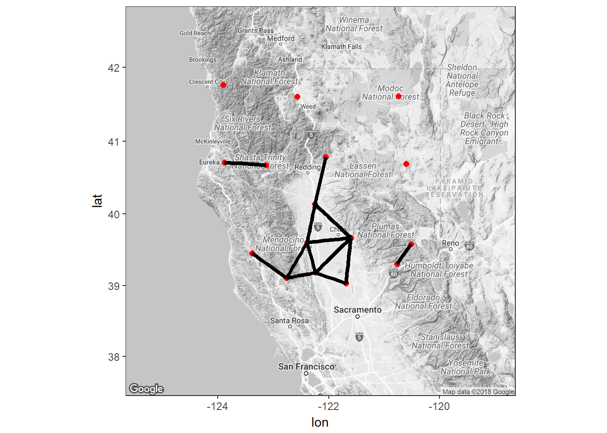
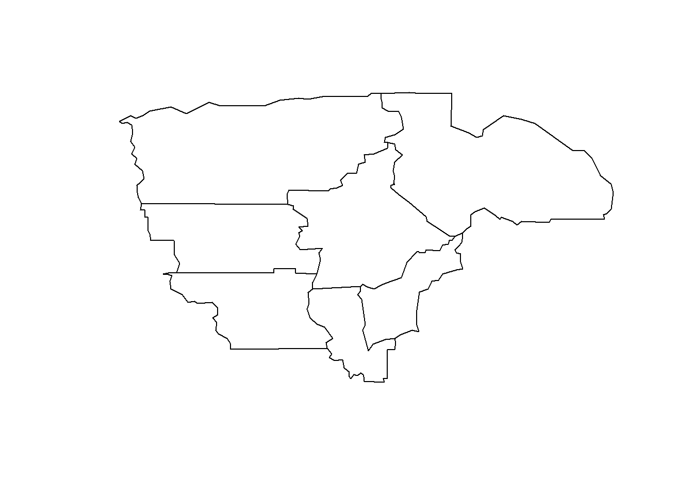
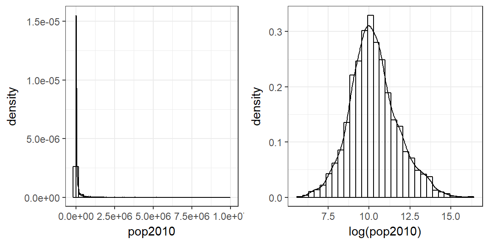
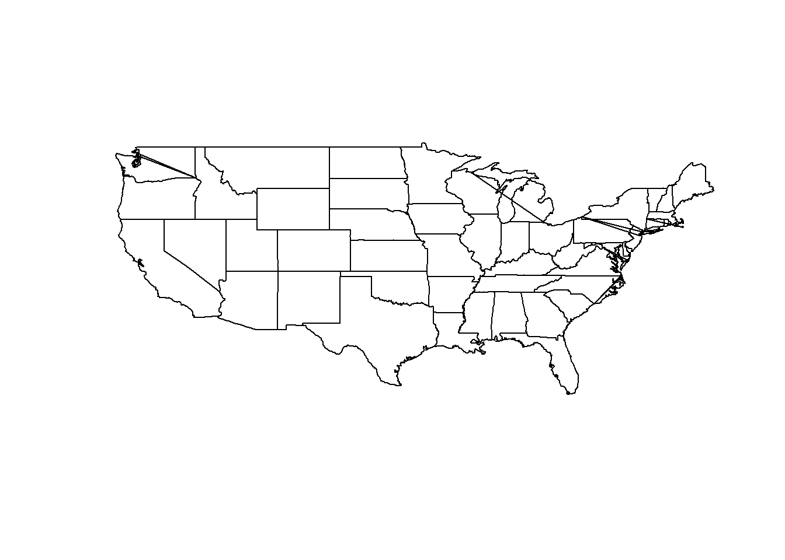
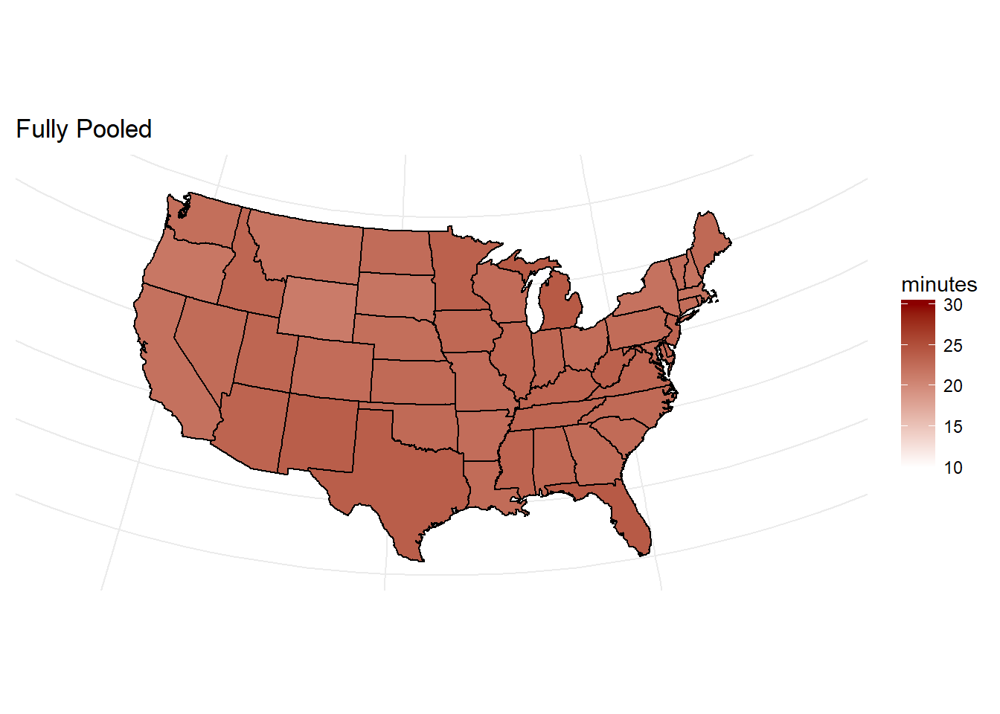
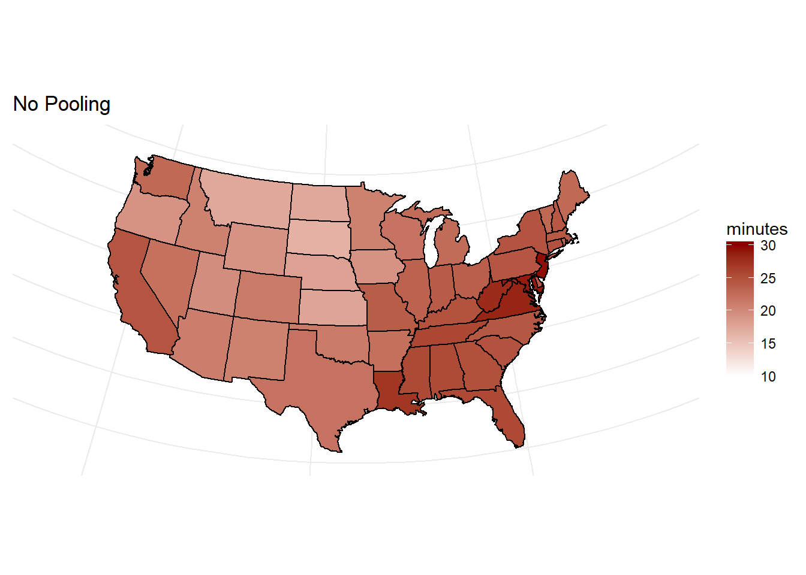
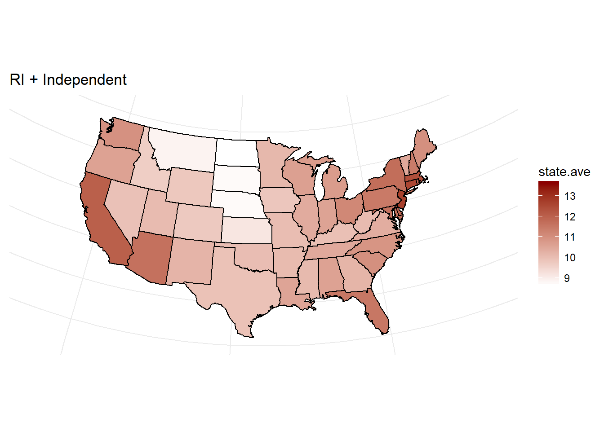
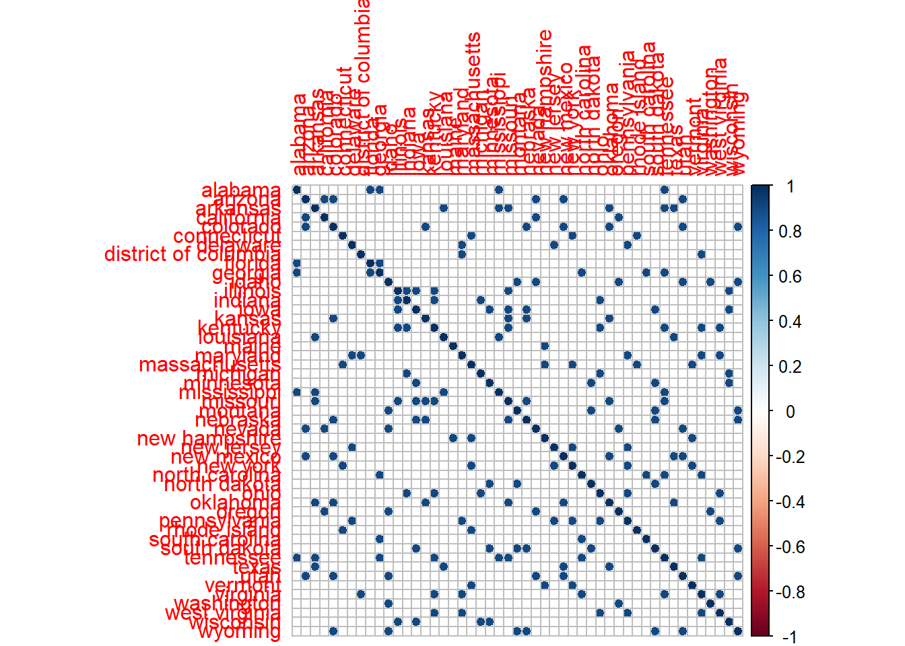
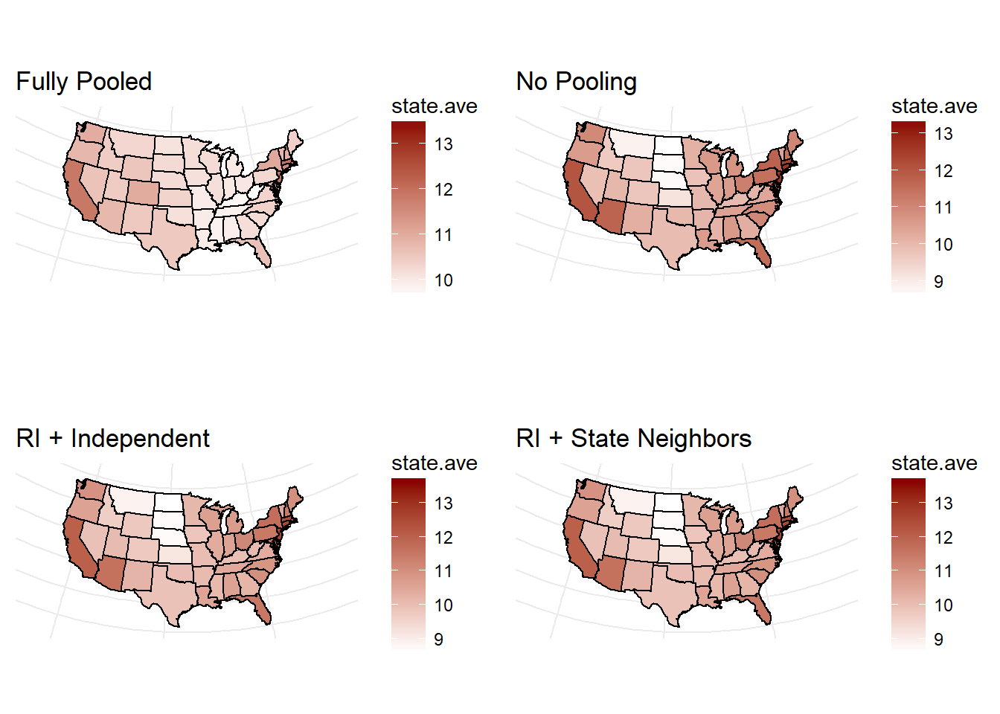

# Spatial Data {#spatial}

Outline: 

* Terminology
* How to make maps using ggplot, and shade areas of interest by the value of other variables
* How to identify neighbors
* How to create a neighborhood matrix
* How to test for spatial autocorrelation
* How to calculate a regression model using geographically correlated data. 

As before with longitudinal data, this topic can (and should) fill an entire class. There are also MANY MANY ways to play with spatial data in R. Much googling has occured to complete these notes.  


## Terminology

* _polygons_ : A shape that usually outlines a region such as a county or state. 
* _shape file_: a specific data format that can spatially describe features such as points lines and polygons. 
* _neighbors_ : two shapes/regions/points that are next to each other
* _longitude_ : distance east or west of the meridian at Greenwich English
* _latitude_ : distance north or south of the equator
* _FIPS_: Federal Information Processing standards - a.k.a. a code to uniquely identify counties in the United States
* _centroid_: The lat/long point that marks the "center" of a polygon
* _Cartesian distance_: distance between two points on a plane
* _Great circle distance_: shortest distance between two points on the surface of a sphere


## Mapping in R

* Use existing packages (easier)
* Import your own shape files (harder). 
    - A series of lat/long points and an order in which to to draw the lines between points can also be used but will need to be converted to a spatial polygon object at a later point. 

### Plotting Region polygons

Use the `maps` library get county border data. Take note of the variable names, we'll want to merge other data onto this data frame later. 

```r
counties <- map_data("county") 
head(counties)
##        long      lat group order  region subregion
## 1 -86.50517 32.34920     1     1 alabama   autauga
## 2 -86.53382 32.35493     1     2 alabama   autauga
## 3 -86.54527 32.36639     1     3 alabama   autauga
## 4 -86.55673 32.37785     1     4 alabama   autauga
## 5 -86.57966 32.38357     1     5 alabama   autauga
## 6 -86.59111 32.37785     1     6 alabama   autauga
```

We can use `ggplot` to draw `polygons` for each region/subregion.

```r
ggplot() + 
    geom_polygon(data = counties, aes(x = long, y = lat, group = group), 
                 color = "black", fill="NA") + 
    coord_map("albers", lat0 = 39, lat1 = 45) + labs(x=NULL, y=NULL) + 
    theme(panel.background = element_blank(), panel.border = element_blank(), 
          axis.ticks=element_blank(), axis.text = element_blank())
```


\BeginKnitrBlock{rmdnote}<div class="rmdnote">Play around with the plotting code to understand what each layer controls. </div>\EndKnitrBlock{rmdnote}

Let's get county level data that we can plot and analyze. The `countyComplete` data can be obtained by either the `OpenIntro` package or from Dr. Donatello's website. 


```r
cc <- read.csv("C:/GitHub/website/static/data/countyComplete.csv", header=TRUE)
cc[1:5,c(1,3,4,6,(ncol(cc)-5):ncol(cc))]
##             name FIPS pop2010 age_under_5 fed_spending fed_spend00
## 1 Autauga County 1001   54571         6.6       331142    7.582652
## 2 Baldwin County 1003  182265         6.1      1119082    7.969818
## 3 Barbour County 1005   27457         6.2       240308    8.275639
## 4    Bibb County 1007   22915         6.0       163201    7.836406
## 5  Blount County 1009   57322         6.3       294114    5.764229
##   fed_spend10    area density smoking_ban
## 1    6.068095  594.44    91.8        none
## 2    6.139862 1589.78   114.6        none
## 3    8.752158  884.88    31.0     partial
## 4    7.122016  622.58    36.8        none
## 5    5.130910  644.78    88.9        none
```

Looking at a few of the columns we see that this data contains county names, FIPS, county level data such as population, amount of federal spending, population density and what level of smoking ban that is in place. The only information that helps identify each county (other than the name) is FIPS. To add any points to a map, we need lat/long for points and region/subregion name. 

The [housingData package](https://cran.r-project.org/web/packages/housingData/housingData.pdf) has a `geoCounty` data set that connects FIPS to the county centroid. A little data cleaning needs to be done first to match the region names with the names found in the `counties` data set. 


```r
library(housingData) 
head(geoCounty) 
##    fips         county state       lon      lat rMapState rMapCounty
## 1 01001 Autauga County    AL -86.64565 32.54009   alabama    autauga
## 2 01003 Baldwin County    AL -87.72627 30.73831   alabama    baldwin
## 3 01005 Barbour County    AL -85.39733 31.87403   alabama    barbour
## 4 01007    Bibb County    AL -87.12526 32.99902   alabama       bibb
## 5 01009  Blount County    AL -86.56271 33.99044   alabama     blount
## 6 01011 Bullock County    AL -85.71680 32.10634   alabama    bullock

# align names
county.info <- geoCounty %>% mutate(FIPS = as.numeric(as.character(fips)), 
                             long.c = lon, lat.c=lat, 
                             region=rMapState, subregion=rMapCounty) %>% 
                     select(FIPS, long.c, lat.c, region, subregion)
head(county.info)
##   FIPS    long.c    lat.c  region subregion
## 1 1001 -86.64565 32.54009 alabama   autauga
## 2 1003 -87.72627 30.73831 alabama   baldwin
## 3 1005 -85.39733 31.87403 alabama   barbour
## 4 1007 -87.12526 32.99902 alabama      bibb
## 5 1009 -86.56271 33.99044 alabama    blount
## 6 1011 -85.71680 32.10634 alabama   bullock
```

Then we merge lat/long centroids and region names to county complete data frame so that data and all geographic information are all on one data frame. 


```r
cc <- cc %>% left_join(county.info)
cc[1:5,c(1,3,4,6,(ncol(cc)-5):ncol(cc))]
##             name FIPS pop2010 age_under_5 density smoking_ban    long.c
## 1 Autauga County 1001   54571         6.6    91.8        none -86.64565
## 2 Baldwin County 1003  182265         6.1   114.6        none -87.72627
## 3 Barbour County 1005   27457         6.2    31.0     partial -85.39733
## 4    Bibb County 1007   22915         6.0    36.8        none -87.12526
## 5  Blount County 1009   57322         6.3    88.9        none -86.56271
##      lat.c  region subregion
## 1 32.54009 alabama   autauga
## 2 30.73831 alabama   baldwin
## 3 31.87403 alabama   barbour
## 4 32.99902 alabama      bibb
## 5 33.99044 alabama    blount
```

Now we see that lat/long data as well as region/subregion names have been added. 

Last we'll merge all this county level data to the map data. 


```r
cc.map <- counties %>% left_join(cc)
cc.map[1:5,c(1:4,6, (ncol(cc.map)-5):ncol(cc.map))]
##        long      lat group order subregion fed_spend10   area density
## 1 -86.50517 32.34920     1     1   autauga    6.068095 594.44    91.8
## 2 -86.53382 32.35493     1     2   autauga    6.068095 594.44    91.8
## 3 -86.54527 32.36639     1     3   autauga    6.068095 594.44    91.8
## 4 -86.55673 32.37785     1     4   autauga    6.068095 594.44    91.8
## 5 -86.57966 32.38357     1     5   autauga    6.068095 594.44    91.8
##   smoking_ban    long.c    lat.c
## 1        none -86.64565 32.54009
## 2        none -86.64565 32.54009
## 3        none -86.64565 32.54009
## 4        none -86.64565 32.54009
## 5        none -86.64565 32.54009
```

Notice now that values such as area and density are repeated across rows per `subregion`, which directly corresponds to the `group` variable that allowed us to identify counties on the map. Now we can re-plot the county level map, and add a shading layer to this plot that is % poverty. 


```r
ggplot() + 
  geom_polygon(data = cc.map, aes(x = long, y = lat, group = group,
        fill = poverty), color = "black") + 
  coord_map("albers", lat0 = 39, lat1 = 45) + labs(x=NULL, y=NULL) + 
  theme(panel.background = element_blank(), panel.border = element_blank(), 
        axis.ticks=element_blank(), axis.text = element_blank()) + 
  scale_fill_continuous(low='white', high='darkorchid4')
```


\BeginKnitrBlock{rmdcaution}<div class="rmdcaution">We couldn't set `group=subregion` because county names are not unique. Change this value and replot the map above to see the impact. This demonstrates why having uniquely numbered shapes are critical for plotting. </div>\EndKnitrBlock{rmdcaution}

### Plotting points
Here is a different approach using a different package: `ggmap`. We use county centers for selected counties in Northern California instead of polygon regions to demonstrate how to plot points onto a map instead of regions. 


```r
library(ggmap)
norcal <- cc %>% filter(region=="california", subregion %in% 
          c('butte', 'shasta', 'tehama', 'lassen', 'modoc', 'siskiyou', 'humboldt', 
            'trinity', 'glenn', 'mendocino', 'sutter', 'sierra', 'nevada', 
            'del norte', 'lake', 'colusa')) 
norcal.center <- c(mean(norcal$long.c), mean(norcal$lat.c))
norcal.center
## [1] -122.15392   40.18119
```

The `get_map` function downloads google map data centered around `location`. See the [ggmap quick start](https://www.nceas.ucsb.edu/~frazier/RSpatialGuides/ggmap/ggmapCheatsheet.pdf) to see all the options you can use. 


```r
norcal.map <- get_map(location= norcal.center, zoom=7, color="bw")
```

This approach uses `ggmap()` instead of `ggplot()`, but layers (such as points) are still added on in a similar fashion. 

```r
ggmap(norcal.map) + 
  geom_point(data=norcal, aes(x=long.c, y=lat.c, 
                              color=per_capita_income, size=pop2010)) + 
  scale_color_gradient(low="darkgreen", high="chartreuse")
```


 
## Spatial Influence

* The closer the points, the more influence they should have on each other.
* Want to identify "neighbors"
* Neighbors can be identified based on 
    - (inverse) distance between centroids or points
    - existence of a shared border 
    - length of shared borders


### Distance between points
Calculate the great circle distance between points. 


```r
county.cent.mat <- as.matrix(norcal[,c('long.c', 'lat.c')]) # convert lat/long centroids to a matrix
D <- raster::pointDistance(county.cent.mat, lonlat=TRUE) 
rownames(D) <- colnames(D) <- norcal$subregion
D[1:5, 1:5]
##               butte    colusa del norte    glenn humboldt
## butte          0.00        NA        NA       NA       NA
## colusa     77055.36      0.00        NA       NA       NA
## del norte 303103.83 319031.41       0.0       NA       NA
## glenn      68210.62  48641.26  271321.8      0.0       NA
## humboldt  225521.47 219448.27  116948.0 175980.8        0
```

 What are the units of the values in `D`?  

 Why couldn't we have just used `dist(norcal)` here to create a distance matrix? 

### Spatial Weights Matrix

The further away the points, the lower the correlation. The simplest approach is to use the inverse distance, and then normalize weights across the rows. 

1. Calculate 1/ each distance (cell). 
2. Some values are `Inf`. Why did this happen? Set these to `NA`
3. Calculate the row totals
4. Divide the weight matrix `W` by the row totals to normalize rows


```r
W <- 1/D 
W[!is.finite(W)] <- NA 
rtot <- rowSums(W, na.rm=TRUE) 
W <- W/rtot 
W[1:5, 1:5] # confirm the weights add up to 1 across the rows
##               butte    colusa  del norte     glenn humboldt
## butte            NA        NA         NA        NA       NA
## colusa    1.0000000        NA         NA        NA       NA
## del norte 0.5128007 0.4871993         NA        NA       NA
## glenn     0.3768293 0.5284354 0.09473533        NA       NA
## humboldt  0.1909279 0.1962118 0.36818384 0.2446764       NA
```


### Identifying Neighbors
Recap terminology. polygons, shapes, data frames, coordinates. This section converts a lot of R objects from one object type to another. 

1. **Points are within a certain distance away from each other**


```r
library(spdep)
norcal_nb <- dnearneigh(x=county.cent.mat, d1=0, d2=80, longlat=T)
summary(norcal_nb)
## Neighbour list object:
## Number of regions: 16 
## Number of nonzero links: 26 
## Percentage nonzero weights: 10.15625 
## Average number of links: 1.625 
## 4 regions with no links:
## 3 7 9 13
## Link number distribution:
## 
## 0 1 2 3 4 
## 4 6 1 2 3 
## 6 least connected regions:
## 5 8 10 11 12 16 with 1 link
## 3 most connected regions:
## 1 2 4 with 4 links
```

The `dnearneigh` function identifies neighbors of region points by Great Circle distance (specified using `longlat=TRUE`) between lower (`d1`) and upper (`80`) bounds in kilometers. This creates a `neighborhood` object. We'll look at the structure of this shortly. 

To visualize these neighbors, we need to combine this neighborhood information back onto the data frame with existing coordinate data. To do that we need to convert the neighborhood object to data frame using `nb_to_df`, a [user defined function](http://mbjoseph.github.io/2015/06/15/nb_ggmap.html) that was googled. 

Then we can map county centers and connect neighbors with lines. 

```r
norcal.nb.toplot <- nb_to_df(norcal_nb, county.cent.mat)

ggmap(norcal.map) + 
  geom_point(data=norcal, aes(x=long.c, y=lat.c), col="red", size=2) + 
  geom_segment(data=norcal.nb.toplot, aes(x=x, xend=xend, y=y, yend=yend), lwd=1.5)
```



2. **Adjacent polygons**

The `maps` data provides polygon data in that it gives us a series of lat/long points and an order on how to connect them. This is not quite the same as a _shape file_. Using a function [found on this StackExchange post](https://gis.stackexchange.com/questions/18311/instantiating-spatial-polygon-without-using-a-shapefile-in-r) we convert the data frame containing polygon information to a special `SpatialPolygon` object. 


```r
library(sp)

local <- counties %>% 
        filter(region=="california", subregion %in% 
                 c('butte', 'glenn', 'colusa', 'plumas', 'sutter', 'yuba', 'tehama')) %>%
        select(long, lat, subregion)

local.spp <- local %>%
  group_by(subregion) %>%
  do(poly=select(., long, lat) %>%Polygon()) %>%
  rowwise() %>%
  do(polys=Polygons(list(.$poly),.$subregion)) %>%
  {SpatialPolygons(.$polys)}

plot(local.spp)
```



Now we can create the neighborhood matrix on this polygon shape file using `poly2nb`. 

```r
local_nb <- poly2nb(local.spp)
summary(local_nb)
## Neighbour list object:
## Number of regions: 7 
## Number of nonzero links: 24 
## Percentage nonzero weights: 48.97959 
## Average number of links: 3.428571 
## Link number distribution:
## 
## 3 6 
## 6 1 
## 6 least connected regions:
## colusa glenn plumas sutter tehama yuba with 3 links
## 1 most connected region:
## butte with 6 links
```


\BeginKnitrBlock{rmdnote}<div class="rmdnote">The `maptools` package also has a `map2SpatialPoylgons` function that may be helpful in some situations to convert maps to polygons. In this example we used the function `get_map()` which returned a `data.frame`. The `map()` function is another way to get map data out of the `maps` library, but it returns a `map` object. </div>\EndKnitrBlock{rmdnote}

### Neighborhood matrix

A neighborhood matrix is not stored in R the way we like to imagine matrices (squares). Instead it is a list, where each entry in the list is a vector of neighbor identifiers. 


```r
str(norcal_nb)
## List of 16
##  $ : int [1:4] 2 4 14 15
##  $ : int [1:4] 1 4 6 14
##  $ : int 0
##  $ : int [1:4] 1 2 6 15
##  $ : int 16
##  $ : int [1:3] 2 4 8
##  $ : int 0
##  $ : int 6
##  $ : int 0
##  $ : int 12
##  $ : int 15
##  $ : int 10
##  $ : int 0
##  $ : int [1:2] 1 2
##  $ : int [1:3] 1 4 11
##  $ : int 5
##  - attr(*, "class")= chr "nb"
##  - attr(*, "nbtype")= chr "distance"
##  - attr(*, "distances")= num [1:2] 0 80
##  - attr(*, "region.id")= chr [1:16] "1" "2" "3" "4" ...
##  - attr(*, "call")= language dnearneigh(x = county.cent.mat, d1 = 0, d2 = 80, longlat = T)
##  - attr(*, "dnn")= num [1:2] 0 80
##  - attr(*, "bounds")= chr [1:2] "GT" "LE"
##  - attr(*, "sym")= logi TRUE
```

Recall the first few counties in norcal are Butte, Colusa and Del Norte. The first three lines in `norcal_nb` identify the neighbors for that county. 

* Butte has 3 neighbors that are within 80km (50 miles) away. There are 3 lines extending out of Butte. 
* Colusa also has 3. 
* Del Norte has 0 neighbors.

Another example is the neighborhood matrix created using the local county shape files. 

```r
str(local_nb)
## List of 7
##  $ : int [1:6] 2 3 4 5 6 7
##  $ : int [1:3] 1 3 5
##  $ : int [1:3] 1 2 6
##  $ : int [1:3] 1 6 7
##  $ : int [1:3] 1 2 7
##  $ : int [1:3] 1 3 4
##  $ : int [1:3] 1 4 5
##  - attr(*, "class")= chr "nb"
##  - attr(*, "region.id")= chr [1:7] "butte" "colusa" "glenn" "plumas" ...
##  - attr(*, "call")= language poly2nb(pl = local.spp)
##  - attr(*, "type")= chr "queen"
##  - attr(*, "sym")= logi TRUE
```

We can transform a neighborhood object to a matrix using `nb2mat`. 

```r
local_nb_mat <- nb2mat(local_nb, style='B', zero.policy = TRUE)
colnames(local_nb_mat) <- unique(local$subregion)
kable(local_nb_mat)
```

<table>
 <thead>
  <tr>
   <th style="text-align:left;">   </th>
   <th style="text-align:right;"> butte </th>
   <th style="text-align:right;"> colusa </th>
   <th style="text-align:right;"> glenn </th>
   <th style="text-align:right;"> plumas </th>
   <th style="text-align:right;"> sutter </th>
   <th style="text-align:right;"> tehama </th>
   <th style="text-align:right;"> yuba </th>
  </tr>
 </thead>
<tbody>
  <tr>
   <td style="text-align:left;"> butte </td>
   <td style="text-align:right;"> 0 </td>
   <td style="text-align:right;"> 1 </td>
   <td style="text-align:right;"> 1 </td>
   <td style="text-align:right;"> 1 </td>
   <td style="text-align:right;"> 1 </td>
   <td style="text-align:right;"> 1 </td>
   <td style="text-align:right;"> 1 </td>
  </tr>
  <tr>
   <td style="text-align:left;"> colusa </td>
   <td style="text-align:right;"> 1 </td>
   <td style="text-align:right;"> 0 </td>
   <td style="text-align:right;"> 1 </td>
   <td style="text-align:right;"> 0 </td>
   <td style="text-align:right;"> 1 </td>
   <td style="text-align:right;"> 0 </td>
   <td style="text-align:right;"> 0 </td>
  </tr>
  <tr>
   <td style="text-align:left;"> glenn </td>
   <td style="text-align:right;"> 1 </td>
   <td style="text-align:right;"> 1 </td>
   <td style="text-align:right;"> 0 </td>
   <td style="text-align:right;"> 0 </td>
   <td style="text-align:right;"> 0 </td>
   <td style="text-align:right;"> 1 </td>
   <td style="text-align:right;"> 0 </td>
  </tr>
  <tr>
   <td style="text-align:left;"> plumas </td>
   <td style="text-align:right;"> 1 </td>
   <td style="text-align:right;"> 0 </td>
   <td style="text-align:right;"> 0 </td>
   <td style="text-align:right;"> 0 </td>
   <td style="text-align:right;"> 0 </td>
   <td style="text-align:right;"> 1 </td>
   <td style="text-align:right;"> 1 </td>
  </tr>
  <tr>
   <td style="text-align:left;"> sutter </td>
   <td style="text-align:right;"> 1 </td>
   <td style="text-align:right;"> 1 </td>
   <td style="text-align:right;"> 0 </td>
   <td style="text-align:right;"> 0 </td>
   <td style="text-align:right;"> 0 </td>
   <td style="text-align:right;"> 0 </td>
   <td style="text-align:right;"> 1 </td>
  </tr>
  <tr>
   <td style="text-align:left;"> tehama </td>
   <td style="text-align:right;"> 1 </td>
   <td style="text-align:right;"> 0 </td>
   <td style="text-align:right;"> 1 </td>
   <td style="text-align:right;"> 1 </td>
   <td style="text-align:right;"> 0 </td>
   <td style="text-align:right;"> 0 </td>
   <td style="text-align:right;"> 0 </td>
  </tr>
  <tr>
   <td style="text-align:left;"> yuba </td>
   <td style="text-align:right;"> 1 </td>
   <td style="text-align:right;"> 0 </td>
   <td style="text-align:right;"> 0 </td>
   <td style="text-align:right;"> 1 </td>
   <td style="text-align:right;"> 1 </td>
   <td style="text-align:right;"> 0 </td>
   <td style="text-align:right;"> 0 </td>
  </tr>
</tbody>
</table>

We can use this matrix structure as a correlation structure in a random intercept model. _Details forthcoming_


## Modeling geographically correlated data

### Geographically weighted regression

1. Fit a county-stratified regression model
2. Plot the regression coefficients on a map. 
3. Look for spatial trends. You can formally test this using [Moran's I](https://en.wikipedia.org/wiki/Moran%27s_I). 

Here is a good walk through if you want to take this approach: 
http://rspatial.org/analysis/rst/6-local_regression.html#geographicaly-weighted-regression

Recall the stratified model...

* is the no-pooled model - each region has it's own model
* estimates many more parameters than the pooled model
* regions with little to no data will have unstable estimates or simply won't be able to be fit. 

### Bayesian Models

Really this is where we all should be moving to. But we're not there yet. 


### Random Intercept Model 
Let's look to build a model to estimate the population. It's skewed right so we'll take a (natural) log. 


```r
raw <- ggplot(cc, aes(x=pop2010)) + 
        geom_histogram(aes(y=..density..), col="black",fill="NA") + geom_density() 
log <- ggplot(cc, aes(x=log(pop2010))) + 
        geom_histogram(aes(y=..density..), col="black",fill="NA") + geom_density() 
gridExtra::grid.arrange(raw, log, nrow=1)
```



Does there appear to be a spatial trend? Yup.  Note i took off the color of the polygons here to make it more clear to read. 

```r
ggplot() + 
  geom_polygon(data = cc.map, aes(x = long, y = lat, group = group,
        fill = log(pop2010))) + 
  coord_map("albers", lat0 = 39, lat1 = 45) + labs(x=NULL, y=NULL) + 
  theme(panel.background = element_blank(), panel.border = element_blank(), 
        axis.ticks=element_blank(), axis.text = element_blank()) + 
  scale_fill_continuous(low='white', high='darkorchid4')
```


We will use % of the county who own a home (`home_ownership`), % of people who are `foreign_born`, the % of the county living in `poverty` and the % of the county who have a `bachelors` degree.

1. Data preparation
    - a. Drop data from `countyComplete` on states such as Alaska and Hawaii, that aren't included in the map data obtained from `map_data`. These rows are identifable because they are missing the `region` variable from when we merged the mapping data onto the county data. 
    - b. Convert the state name to all lower case so it will match with the state name (as `region`) when mapping. 
    - c. Restrict the analysis data set to only the variables that will be used in modeling, and drop all records with missing data. 


```r
cont.us <- cc %>% filter(!is.na(cc$region)) %>%
                  mutate(state=tolower(state), y=log(pop2010)) %>%
                  select(y, home_ownership, foreign_born, poverty, bachelors, state, region) %>% na.omit()
```

The `countyComplete` data set has one value per county, so we can't fit a random intercept to the county level (and that would be too many clusters) - so we'll cluster at the state level. 

2. Get the map data at the state level

```r
states <- map_data("state") 
```

3. Create a neighbor matrix


```r
states.spp <- states %>%
  group_by(region) %>%
  do(poly=select(., long, lat) %>%Polygon()) %>%
  rowwise() %>%
  do(polys=Polygons(list(.$poly),.$region)) %>%
  {SpatialPolygons(.$polys)}

plot(states.spp)
```



```r
states_nb <- poly2nb(states.spp)

states_nb_mat <- nb2mat(states_nb, style='B', zero.policy = TRUE)
rownames <- colnames(states_nb_mat) <- unique(states$region)
```

View a sample to make sure it works - theres some wierd lines between WI and OH.

```r
states_nb_mat[c('wisconsin', 'ohio', 'michigan', 'illinois', 'indiana'),
              c('wisconsin', 'ohio', 'michigan', 'illinois', 'indiana')]
##           wisconsin ohio michigan illinois indiana
## wisconsin         0    0        1        1       0
## ohio              0    0        1        0       1
## michigan          1    1        0        0       1
## illinois          1    0        0        0       1
## indiana           0    1        1        1       0
```
All neighbors are accounted for, and none extra. Good. 


4. Define a function that extracts the fitted values from a model, and merges it onto the shape data for mapping. I'm going to be doing this process for several models. When you repeat the same steps more than 3 times, it's time to write a function. 


```r
model.to.map <- function(mod){
  fit.data<- data.frame(y.hat=predict(mod), region=cont.us$state)
  state.pred <- fit.data %>% group_by(region) %>% summarise(state.ave = mean(y.hat))
  plot.fitted <- states %>% left_join(state.pred) 
  return(plot.fitted)  
}
```


#### Fully pooled model: Ignore state level information

```r
fully_pooled <- lm(y ~ home_ownership + foreign_born + poverty + bachelors, data=cont.us)
fpm <- model.to.map(mod=fully_pooled)
```



#### No pooled model - Fixed effects for state.  


```r
no_pooled <- lm(y ~ home_ownership + foreign_born + poverty + bachelors + state, data=cont.us)
npm <- model.to.map(mod=no_pooled)
```



#### Partially pooled: States are independent

\BeginKnitrBlock{rmderror}<div class="rmderror">Disclaimer: This section does not work as intended. Do not use. For discussion purposes only. </div>\EndKnitrBlock{rmderror}


```r
pp_ind <- lme4::lmer(y ~ home_ownership + foreign_born + poverty + 
                     bachelors + (1|state), data=cont.us)
pp_ind_map <- model.to.map(mod=pp_ind)
```


#### Partially pooled: Neighboring states are correlated. 

We need to manually create the correlation matrix. 

1. Start with a matrix with 1's down the diagonal. Notice there's only 49 entries here.


```r
states.corr <- diag(49); colnames(states.corr) <- rownames(states.corr) <- rownames(states_nb_mat)
corrplot::corrplot(states.corr)
```



2. Then we add on the neighbor matrix - but add correlation between states. 


```r
states.spcorr <- states.corr + 0.9*states_nb_mat
corrplot::corrplot(states.spcorr)
```



3. Model using `lme4qtl` so we can specifiy the relationship matrix. 

```r
pp_spcorr <- lme4qtl::relmatLmer(y ~ home_ownership + foreign_born + poverty + 
                     bachelors + (1|state), data=cont.us, 
                     relmat = list(state = states.corr))
pp_spcorr_map <- model.to.map(mod=pp_spcorr)
```


Let's see these all together. 


Estimates are similar, so let's look at the differences (residuals) between the predicted values using the fully pooled and all others. 

* Red = fully pooled model under-estimated
* Blue = fully pooled over-estimated 



Story possibly to be continued. The RI model is creating identical state-level estimates as the spatially correlated model. This is due to one of two reasons: 

* We're predicting at the county level but aggregating up to the state level
* The package `lme4qtl` doesn't work the way it claims. 

Again... easier if we fit a Bayesian model here. 


## Additional Info

* ggmap quick start https://www.nceas.ucsb.edu/~frazier/RSpatialGuides/ggmap/ggmapCheatsheet.pdf 
* http://www.rspatial.org/
* NOAA's Southwest Fisheries Science Center. Making maps with R walk through/tutorial (2014) http://eriqande.github.io/rep-res-web/lectures/making-maps-with-R.html 
* Stat 4580 at University of Iowa: https://homepage.divms.uiowa.edu/~luke/classes/STAT4580/maps.html 
* How `map_id` works (county names are not unique): https://stackoverflow.com/questions/37912418/how-does-geom-map-map-id-function-work 
* map2spatialpolygon https://stackoverflow.com/questions/26062280/converting-a-map-object-to-a-spatialpolygon-object 
* More on Moran's I from ESRI http://resources.esri.com/help/9.3/arcgisengine/java/gp_toolref/spatial_statistics_tools/how_spatial_autocorrelation_colon_moran_s_i_spatial_statistics_works.htm 

* lme4qtl documentation
    - https://github.com/variani/lme4qtl 
    - https://www.ncbi.nlm.nih.gov/pmc/articles/PMC5830078/
    


